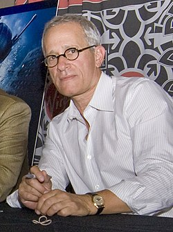

# James Newton Howard

## Biografía

James Newton Howard (Los Ángeles, California, 9 de junio de 1951) es un compositor estadounidense, nueve veces nominado al premio Óscar.

## Estilo musical

Canciones Búsqueda de música Nuevos lanzamientos Catálogo clásico Listas de reproducción temáticas

La mejor fuente en línea de música de películas y televisión. Copyright © 2018 - 2026 Whatsong.org. Reservados todos los derechos.

## Anécdotas y curiosidades

James Newton Howard (nacido el 9 de junio de 1951) [1] es un compositor de cine, orquestador y productor musical estadounidense. Ha compuesto música para más de 100 películas y ha recibido un premio Grammy, un premio Emmy y nueve nominaciones a los premios de la Academia.

## Top 10 bandas sonoras

1. ***The Dark Knight (Título en España: El caballero oscuro)***
    * **Póster:** [link](097_james_newton_howard/posters/poster_the_dark_knight_2008.jpg)
2. ***The Village (Título en España: El bosque)***
    * **Póster:** [link](097_james_newton_howard/posters/poster_the_village_2004.jpg)
3. ***The Fugitive (Título en España: El fugitivo)***
    * **Póster:** [link](097_james_newton_howard/posters/poster_the_fugitive_1993.jpg)
4. ***My Best Friend's Wedding (Título en España: La boda de mi mejor amigo)***
    * **Póster:** [link](097_james_newton_howard/posters/poster_my_best_friend_s_wedding_1997.jpg)
5. ***Michael Clayton (Título en España: Michael Clayton)***
    * **Póster:** [link](097_james_newton_howard/posters/poster_michael_clayton_2007.jpg)
6. ***Defiance (Título en España: Resistencia)***
    * **Póster:** [link](097_james_newton_howard/posters/poster_defiance_2008.jpg)
7. ***News of the World (Título en España: Noticias del gran mundo)***
    * **Póster:** [link](097_james_newton_howard/posters/poster_news_of_the_world_2020.jpg)
8. ***The Prince of Tides (Título en España: El príncipe de las mareas)***
    * **Póster:** [link](097_james_newton_howard/posters/poster_the_prince_of_tides_1991.jpg)
9. ***Batman Begins (Título en España: Batman Begins)***
    * **Póster:** [link](097_james_newton_howard/posters/poster_batman_begins_2005.jpg)
10. ***The Hunger Games (Título en España: Los Juegos del Hambre)***
    * **Póster:** [link](097_james_newton_howard/posters/poster_the_hunger_games_2012.jpg)

## Filmografía completa

- Crosby, Stills & Nash - Daylight Again (Título en España: Crosby, Stills & Nash - Daylight Again) (1983) · [Póster](097_james_newton_howard/posters/poster_crosby_stills_nash_daylight_again_1983.jpg)
- Dune (Título en España: Dune) (1984) · [Póster](097_james_newton_howard/posters/poster_dune_1984.jpg)
- Head Office (Título en España: Head Office) (1985) · [Póster](097_james_newton_howard/posters/poster_head_office_1985.jpg)
- Wildcats (Título en España: Gatos salvajes) (1986) · [Póster](097_james_newton_howard/posters/poster_wildcats_1986.jpg)
- Nobody's Fool (Título en España: La tonta de nadie) (1986) · [Póster](097_james_newton_howard/posters/poster_nobody_s_fool_1986.jpg)
- 8 Million Ways to Die (Título en España: Ocho millones de maneras de morir) (1986) · [Póster](097_james_newton_howard/posters/poster_8_million_ways_to_die_1986.jpg)
- Tough Guys (Título en España: Otra ciudad, otra ley) (1986) · [Póster](097_james_newton_howard/posters/poster_tough_guys_1986.jpg)
- Five Corners (Título en España: Cinco esquinas) (1987) · [Póster](097_james_newton_howard/posters/poster_five_corners_1987.jpg)
- Campus Man (Título en España: El rey del campus) (1987) · [Póster](097_james_newton_howard/posters/poster_campus_man_1987.jpg)
- Russkies (Título en España: Rusos) (1987) · [Póster](097_james_newton_howard/posters/poster_russkies_1987.jpg)
- Some Girls (Título en España: Algunas chicas) (1988) · [Póster](097_james_newton_howard/posters/poster_some_girls_1988.jpg)
- Everybody's All-American (Título en España: Cuando me enamoro) (1988) · [Póster](097_james_newton_howard/posters/poster_everybody_s_all_american_1988.jpg)
- Off Limits (Título en España: Saigón) (1988) · [Póster](097_james_newton_howard/posters/poster_off_limits_1988.jpg)
- Promised Land (Título en España: Tierra prometida) (1988) · [Póster](097_james_newton_howard/posters/poster_promised_land_1988.jpg)
- The Package (Título en España: A la caza del lobo rojo) (1989) · [Póster](097_james_newton_howard/posters/poster_the_package_1989.jpg)
- Tap (Título en España: Tap) (1989) · [Póster](097_james_newton_howard/posters/poster_tap_1989.jpg)
- Major League (Título en España: Una mujer en la liga) (1989) · [Póster](097_james_newton_howard/posters/poster_major_league_1989.jpg)
- Coupe de Ville (Título en España: Cadillac azul) (1990) · [Póster](097_james_newton_howard/posters/poster_coupe_de_ville_1990.jpg)
- Descending Angel (Título en España: Descending Angel) (1990) · [Póster](097_james_newton_howard/posters/poster_descending_angel_1990.jpg)
- Flatliners (Título en España: Línea mortal) (1990) · [Póster](097_james_newton_howard/posters/poster_flatliners_1990.jpg)
- Pretty Woman (Título en España: Pretty Woman) (1990) · [Póster](097_james_newton_howard/posters/poster_pretty_woman_1990.jpg)
- Revealing Evidence: Stalking the Honolulu Strangler (Título en España: Revealing Evidence: Stalking the Honolulu Strangler) (1990) · [Póster](097_james_newton_howard/posters/poster_revealing_evidence_stalking_the_honolulu_strangler_1990.jpg)
- Marked for Death (Título en España: Señalado por la muerte) (1990) · [Póster](097_james_newton_howard/posters/poster_marked_for_death_1990.jpg)
- 3 Men and a Little Lady (Título en España: Tres hombres y una pequeña dama) (1990) · [Póster](097_james_newton_howard/posters/poster_3_men_and_a_little_lady_1990.jpg)
- Guilty by Suspicion (Título en España: Caza de brujas) (1991) · [Póster](097_james_newton_howard/posters/poster_guilty_by_suspicion_1991.jpg)
- The Prince of Tides (Título en España: El príncipe de las mareas) (1991) · [Póster](097_james_newton_howard/posters/poster_the_prince_of_tides_1991.jpg)
- Dying Young (Título en España: Elegir un amor) (1991) · [Póster](097_james_newton_howard/posters/poster_dying_young_1991.jpg)
- Grand Canyon (Título en España: Grand Canyon (El alma de la ciudad)) (1991) · [Póster](097_james_newton_howard/posters/poster_grand_canyon_1991.jpg)
- My Girl (Título en España: Mi chica) (1991) · [Póster](097_james_newton_howard/posters/poster_my_girl_1991.jpg)
- King Ralph (Título en España: Rafi, un rey de peso) (1991) · [Póster](097_james_newton_howard/posters/poster_king_ralph_1991.jpg)
- The Man in the Moon (Título en España: Verano en Louisiana) (1991) · [Póster](097_james_newton_howard/posters/poster_the_man_in_the_moon_1991.jpg)
- A Private Matter (Título en España: A Private Matter) (1992) · [Póster](097_james_newton_howard/posters/poster_a_private_matter_1992.jpg)
- American Heart (Título en España: Corazón roto) (1992) · [Póster](097_james_newton_howard/posters/poster_american_heart_1992.jpg)
- Diggstown (Título en España: El golpe perfecto) (1992) · [Póster](097_james_newton_howard/posters/poster_diggstown_1992.jpg)
- Glengarry Glen Ross (Título en España: Glengarry Glen Ross (Éxito a cualquier precio)) (1992) · [Póster](097_james_newton_howard/posters/poster_glengarry_glen_ross_1992.jpg)
- Night and the City (Título en España: La noche y la ciudad) (1992) · [Póster](097_james_newton_howard/posters/poster_night_and_the_city_1992.jpg)
- Alive: 20 Years Later (Título en España: Alive: 20 Years Later) (1993) · [Póster](097_james_newton_howard/posters/poster_alive_20_years_later_1993.jpg)
- Dave (Título en España: Dave, presidente por un día) (1993) · [Póster](097_james_newton_howard/posters/poster_dave_1993.jpg)
- The Fugitive (Título en España: El fugitivo) (1993) · [Póster](097_james_newton_howard/posters/poster_the_fugitive_1993.jpg)
- Falling Down (Título en España: Un día de furia) (1993) · [Póster](097_james_newton_howard/posters/poster_falling_down_1993.jpg)
- Alive (Título en España: ¡Viven!) (1993) · [Póster](097_james_newton_howard/posters/poster_alive_1993.jpg)
- The Saint of Fort Washington (Título en España: Ángeles sin cielo) (1993) · [Póster](097_james_newton_howard/posters/poster_the_saint_of_fort_washington_1993.jpg)
- Intersection (Título en España: Entre dos mujeres) (1994) · [Póster](097_james_newton_howard/posters/poster_intersection_1994.jpg)
- Junior (Título en España: Junior) (1994) · [Póster](097_james_newton_howard/posters/poster_junior_1994.jpg)
- Wyatt Earp (Título en España: Wyatt Earp) (1994) · [Póster](097_james_newton_howard/posters/poster_wyatt_earp_1994.jpg)
- Just Cause (Título en España: Causa justa) (1995) · [Póster](097_james_newton_howard/posters/poster_just_cause_1995.jpg)
- Outbreak (Título en España: Estallido) (1995) · [Póster](097_james_newton_howard/posters/poster_outbreak_1995.jpg)
- French Kiss (Título en España: French Kiss) (1995) · [Póster](097_james_newton_howard/posters/poster_french_kiss_1995.jpg)
- Restoration (Título en España: Restauración) (1995) · [Póster](097_james_newton_howard/posters/poster_restoration_1995.jpg)
- Waterworld (Título en España: Waterworld) (1995) · [Póster](097_james_newton_howard/posters/poster_waterworld_1995.jpg)
- The Juror (Título en España: Coacción a un jurado) (1996) · [Póster](097_james_newton_howard/posters/poster_the_juror_1996.jpg)
- The Trigger Effect (Título en España: El efecto dominó) (1996) · [Póster](097_james_newton_howard/posters/poster_the_trigger_effect_1996.jpg)
- Eye for an Eye (Título en España: Eye for an Eye (Ojo por ojo)) (1996) · [Póster](097_james_newton_howard/posters/poster_eye_for_an_eye_1996.jpg)
- Primal Fear (Título en España: Las dos caras de la verdad) (1996) · [Póster](097_james_newton_howard/posters/poster_primal_fear_1996.jpg)
- Space Jam (Título en España: Space Jam) (1996) · [Póster](097_james_newton_howard/posters/poster_space_jam_1996.jpg)
- One Fine Day (Título en España: Un día inolvidable) (1996) · [Póster](097_james_newton_howard/posters/poster_one_fine_day_1996.jpg)
- My Best Friend's Wedding (Título en España: La boda de mi mejor amigo) (1997) · [Póster](097_james_newton_howard/posters/poster_my_best_friend_s_wedding_1997.jpg)
- The Postman (Título en España: Mensajero del futuro) (1997) · [Póster](097_james_newton_howard/posters/poster_the_postman_1997.jpg)
- The Devil's Advocate (Título en España: Pactar con el diablo) (1997) · [Póster](097_james_newton_howard/posters/poster_the_devil_s_advocate_1997.jpg)
- Fathers' Day (Título en España: Un lío padre) (1997) · [Póster](097_james_newton_howard/posters/poster_fathers_day_1997.jpg)
- Dante's Peak (Título en España: Un pueblo llamado Dante's Peak) (1997) · [Póster](097_james_newton_howard/posters/poster_dante_s_peak_1997.jpg)
- A Perfect Murder (Título en España: Un crimen perfecto) (1998) · [Póster](097_james_newton_howard/posters/poster_a_perfect_murder_1998.jpg)
- The Sixth Sense (Título en España: El sexto sentido) (1999) · [Póster](097_james_newton_howard/posters/poster_the_sixth_sense_1999.jpg)
- Stir of Echoes (Título en España: El último escalón) (1999) · [Póster](097_james_newton_howard/posters/poster_stir_of_echoes_1999.jpg)
- Snow Falling on Cedars (Título en España: Mientras nieva sobre los cedros) (1999) · [Póster](097_james_newton_howard/posters/poster_snow_falling_on_cedars_1999.jpg)
- Mumford (Título en España: Mumford. Algo va a cambiar tu vida) (1999) · [Póster](097_james_newton_howard/posters/poster_mumford_1999.jpg)
- Runaway Bride (Título en España: Novia a la fuga) (1999) · [Póster](097_james_newton_howard/posters/poster_runaway_bride_1999.jpg)
- Wayward Son (Título en España: Wayward Son) (1999) · [Póster](097_james_newton_howard/posters/poster_wayward_son_1999.jpg)
- Dinosaur (Título en España: Dinosaurio) (2000) · [Póster](097_james_newton_howard/posters/poster_dinosaur_2000.jpg)
- Unbreakable (Título en España: El protegido) (2000) · [Póster](097_james_newton_howard/posters/poster_unbreakable_2000.jpg)
- Vertical Limit (Título en España: Límite vertical) (2000) · [Póster](097_james_newton_howard/posters/poster_vertical_limit_2000.jpg)
- Music and Sound Design of 'The Sixth Sense' (Título en España: Music and Sound Design of 'The Sixth Sense') (2000) · [Póster](097_james_newton_howard/posters/poster_music_and_sound_design_of_the_sixth_sense_2000.jpg)
- Atlantis: The Lost Empire (Título en España: Atlantis: El imperio perdido) (2001) · [Póster](097_james_newton_howard/posters/poster_atlantis_the_lost_empire_2001.jpg)
- America's Sweethearts (Título en España: La pareja del año) (2001) · [Póster](097_james_newton_howard/posters/poster_america_s_sweethearts_2001.jpg)
- Unconditional Love (Título en España: Amor sin condiciones) (2002) · [Póster](097_james_newton_howard/posters/poster_unconditional_love_2002.jpg)
- De entre los zapatos (Título en España: De entre los zapatos) (2002) · [Póster](097_james_newton_howard/posters/poster_de_entre_los_zapatos_2002.jpg)
- The Emperor's Club (Título en España: El club de los emperadores) (2002) · [Póster](097_james_newton_howard/posters/poster_the_emperor_s_club_2002.jpg)
- Big Trouble (Título en España: El gran lío) (2002) · [Póster](097_james_newton_howard/posters/poster_big_trouble_2002.jpg)
- Treasure Planet (Título en España: El planeta del tesoro) (2002) · [Póster](097_james_newton_howard/posters/poster_treasure_planet_2002.jpg)
- Signs (Título en España: Señales) (2002) · [Póster](097_james_newton_howard/posters/poster_signs_2002.jpg)
- Dreamcatcher (Título en España: El cazador de sueños) (2003) · [Póster](097_james_newton_howard/posters/poster_dreamcatcher_2003.jpg)
- Making 'Signs' (Título en España: Making 'Signs') (2003) · [Póster](097_james_newton_howard/posters/poster_making_signs_2003.jpg)
- Peter Pan (Título en España: Peter Pan: La gran aventura) (2003) · [Póster](097_james_newton_howard/posters/poster_peter_pan_2003.jpg)
- City of Night: The Making of 'Collateral' (Título en España: City of Night: The Making of 'Collateral') (2004) · [Póster](097_james_newton_howard/posters/poster_city_of_night_the_making_of_collateral_2004.jpg)
- Collateral (Título en España: Collateral) (2004) · [Póster](097_james_newton_howard/posters/poster_collateral_2004.jpg)
- The Village (Título en España: El bosque) (2004) · [Póster](097_james_newton_howard/posters/poster_the_village_2004.jpg)
- Hidalgo (Título en España: Océanos de fuego (Hidalgo)) (2004) · [Póster](097_james_newton_howard/posters/poster_hidalgo_2004.jpg)
- Batman Begins (Título en España: Batman Begins) (2005) · [Póster](097_james_newton_howard/posters/poster_batman_begins_2005.jpg)
- Deconstructing 'The Village' (Título en España: Deconstructing 'The Village') (2005) · [Póster](097_james_newton_howard/posters/poster_deconstructing_the_village_2005.jpg)
- King Kong (Título en España: King Kong) (2005) · [Póster](097_james_newton_howard/posters/poster_king_kong_2005.jpg)
- The Interpreter (Título en España: La intérprete) (2005) · [Póster](097_james_newton_howard/posters/poster_the_interpreter_2005.jpg)
- Magnificent Desolation: Walking on the Moon (Título en España: Magnificent Desolation: Walking on the Moon) (2005) · [Póster](097_james_newton_howard/posters/poster_magnificent_desolation_walking_on_the_moon_2005.jpg)
- Blood Diamond (Título en España: Diamante de sangre) (2006) · [Póster](097_james_newton_howard/posters/poster_blood_diamond_2006.jpg)
- Freedomland (Título en España: El color del crimen) (2006) · [Póster](097_james_newton_howard/posters/poster_freedomland_2006.jpg)
- Lady in the Water (Título en España: La joven del agua) (2006) · [Póster](097_james_newton_howard/posters/poster_lady_in_the_water_2006.jpg)
- The Eighth Blunder of the World (Título en España: The Eighth Blunder of the World) (2006) · [Póster](097_james_newton_howard/posters/poster_the_eighth_blunder_of_the_world_2006.jpg)
- RV (Título en España: ¡Vaya vacaciones!) (2006) · [Póster](097_james_newton_howard/posters/poster_rv_2006.jpg)
- The Great Debaters (Título en España: El gran debate) (2007) · [Póster](097_james_newton_howard/posters/poster_the_great_debaters_2007.jpg)
- Charlie Wilson's War (Título en España: La guerra de Charlie Wilson) (2007) · [Póster](097_james_newton_howard/posters/poster_charlie_wilson_s_war_2007.jpg)
- The Water Horse (Título en España: Mi monstruo y yo) (2007) · [Póster](097_james_newton_howard/posters/poster_the_water_horse_2007.jpg)
- Michael Clayton (Título en España: Michael Clayton) (2007) · [Póster](097_james_newton_howard/posters/poster_michael_clayton_2007.jpg)
- I Am Legend (Título en España: Soy leyenda) (2007) · [Póster](097_james_newton_howard/posters/poster_i_am_legend_2007.jpg)
- The Lookout (Título en España: The Lookout) (2007) · [Póster](097_james_newton_howard/posters/poster_the_lookout_2007.jpg)
- The Dark Knight (Título en España: El caballero oscuro) (2008) · [Póster](097_james_newton_howard/posters/poster_the_dark_knight_2008.jpg)
- The Happening (Título en España: El incidente) (2008) · [Póster](097_james_newton_howard/posters/poster_the_happening_2008.jpg)
- Defiance (Título en España: Resistencia) (2008) · [Póster](097_james_newton_howard/posters/poster_defiance_2008.jpg)
- Mad Money (Título en España: Tres mujeres y un plan) (2008) · [Póster](097_james_newton_howard/posters/poster_mad_money_2008.jpg)
- Youssou Ndour: I Bring What I Love (Título en España: Youssou Ndour: I Bring What I Love) (2008) · [Póster](097_james_newton_howard/posters/poster_youssou_ndour_i_bring_what_i_love_2008.jpg)
- Confessions of a Shopaholic (Título en España: Confesiones de una compradora compulsiva) (2009) · [Póster](097_james_newton_howard/posters/poster_confessions_of_a_shopaholic_2009.jpg)
- Duplicity (Título en España: Duplicity) (2009) · [Póster](097_james_newton_howard/posters/poster_duplicity_2009.jpg)
- Starz Inside - Unforgettably Evil (Título en España: Starz Inside - Unforgettably Evil) (2009) · [Póster](097_james_newton_howard/posters/poster_starz_inside_unforgettably_evil_2009.jpg)
- The Last Airbender (Título en España: Airbender, el último guerrero) (2010) · [Póster](097_james_newton_howard/posters/poster_the_last_airbender_2010.jpg)
- Love & Other Drugs (Título en España: Amor y otras drogas) (2010) · [Póster](097_james_newton_howard/posters/poster_love_other_drugs_2010.jpg)
- Inhale (Título en España: Inhale) (2010) · [Póster](097_james_newton_howard/posters/poster_inhale_2010.jpg)
- Nanny McPhee and the Big Bang (Título en España: La niñera mágica y el Big Bang) (2010) · [Póster](097_james_newton_howard/posters/poster_nanny_mcphee_and_the_big_bang_2010.jpg)
- Salt (Título en España: Salt) (2010) · [Póster](097_james_newton_howard/posters/poster_salt_2010.jpg)
- The Tourist (Título en España: The Tourist) (2010) · [Póster](097_james_newton_howard/posters/poster_the_tourist_2010.jpg)
- Water for Elephants (Título en España: Agua para elefantes) (2011) · [Póster](097_james_newton_howard/posters/poster_water_for_elephants_2011.jpg)
- Gnomeo & Juliet (Título en España: Gnomeo y Julieta) (2011) · [Póster](097_james_newton_howard/posters/poster_gnomeo_juliet_2011.jpg)
- Larry Crowne (Título en España: Larry Crowne, nunca es tarde) (2011) · [Póster](097_james_newton_howard/posters/poster_larry_crowne_2011.jpg)
- Green Lantern (Título en España: Linterna Verde) (2011) · [Póster](097_james_newton_howard/posters/poster_green_lantern_2011.jpg)
- The Green Hornet (Título en España: The Green Hornet (El Avispón Verde)) (2011) · [Póster](097_james_newton_howard/posters/poster_the_green_hornet_2011.jpg)
- Snow White and the Huntsman (Título en España: Blancanieves y la leyenda del cazador) (2012) · [Póster](097_james_newton_howard/posters/poster_snow_white_and_the_huntsman_2012.jpg)
- The Bourne Legacy (Título en España: El legado de Bourne) (2012) · [Póster](097_james_newton_howard/posters/poster_the_bourne_legacy_2012.jpg)
- The Hunger Games (Título en España: Los Juegos del Hambre) (2012) · [Póster](097_james_newton_howard/posters/poster_the_hunger_games_2012.jpg)
- The World Is Watching: Making the Hunger Games (Título en España: The World Is Watching: Making the Hunger Games) (2012) · [Póster](097_james_newton_howard/posters/poster_the_world_is_watching_making_the_hunger_games_2012.jpg)
- Darling Companion (Título en España: ¡Por fin solos!) (2012) · [Póster](097_james_newton_howard/posters/poster_darling_companion_2012.jpg)
- After Earth (Título en España: After Earth) (2013) · [Póster](097_james_newton_howard/posters/poster_after_earth_2013.jpg)
- The Hunger Games: Catching Fire (Título en España: Los Juegos del Hambre: En llamas) (2013) · [Póster](097_james_newton_howard/posters/poster_the_hunger_games_catching_fire_2013.jpg)
- Parkland (Título en España: Parkland) (2013) · [Póster](097_james_newton_howard/posters/poster_parkland_2013.jpg)
- Cut Bank (Título en España: Cut Bank) (2014) · [Póster](097_james_newton_howard/posters/poster_cut_bank_2014.jpg)
- The Hunger Games: Mockingjay - Part 1 (Título en España: Los Juegos del Hambre: Sinsajo - Parte 1) (2014) · [Póster](097_james_newton_howard/posters/poster_the_hunger_games_mockingjay_part_1_2014.jpg)
- Maleficent (Título en España: Maléfica) (2014) · [Póster](097_james_newton_howard/posters/poster_maleficent_2014.jpg)
- Nightcrawler (Título en España: Nightcrawler) (2014) · [Póster](097_james_newton_howard/posters/poster_nightcrawler_2014.jpg)
- Pawn Sacrifice (Título en España: El caso Fischer) (2015) · [Póster](097_james_newton_howard/posters/poster_pawn_sacrifice_2015.jpg)
- Concussion (Título en España: La verdad duele) (2015) · [Póster](097_james_newton_howard/posters/poster_concussion_2015.jpg)
- The Hunger Games: Mockingjay - Part 2 (Título en España: Los Juegos del Hambre: Sinsajo - Parte 2) (2015) · [Póster](097_james_newton_howard/posters/poster_the_hunger_games_mockingjay_part_2_2015.jpg)
- The Mockingjay Lives: The Making of the Hunger Games: Mockingjay Part 1 (Título en España: The Mockingjay Lives: The Making of the Hunger Games: Mockingjay Part 1) (2015) · [Póster](097_james_newton_howard/posters/poster_the_mockingjay_lives_the_making_of_the_hunger_games_mockingjay_part_1_2015.jpg)
- All the Way (Título en España: All the Way) (2016) · [Póster](097_james_newton_howard/posters/poster_all_the_way_2016.jpg)
- Fantastic Beasts and Where to Find Them (Título en España: Animales fantásticos y dónde encontrarlos) (2016) · [Póster](097_james_newton_howard/posters/poster_fantastic_beasts_and_where_to_find_them_2016.jpg)
- The Huntsman: Winter's War (Título en España: Las crónicas de Blancanieves: El cazador y la reina del hielo) (2016) · [Póster](097_james_newton_howard/posters/poster_the_huntsman_winter_s_war_2016.jpg)
- Detroit (Título en España: Detroit) (2017) · [Póster](097_james_newton_howard/posters/poster_detroit_2017.jpg)
- Roman J. Israel, Esq. (Título en España: Roman J. Israel, Esq.) (2017) · [Póster](097_james_newton_howard/posters/poster_roman_j_israel_esq_2017.jpg)
- Fantastic Beasts: The Crimes of Grindelwald (Título en España: Animales fantásticos: Los crímenes de Grindelwald) (2018) · [Póster](097_james_newton_howard/posters/poster_fantastic_beasts_the_crimes_of_grindelwald_2018.jpg)
- The Nutcracker and the Four Realms (Título en España: El cascanueces y los cuatro reinos) (2018) · [Póster](097_james_newton_howard/posters/poster_the_nutcracker_and_the_four_realms_2018.jpg)
- Red Sparrow (Título en España: Gorrión rojo) (2018) · [Póster](097_james_newton_howard/posters/poster_red_sparrow_2018.jpg)
- A Hidden Life (Título en España: Vida oculta) (2019) · [Póster](097_james_newton_howard/posters/poster_a_hidden_life_2019.jpg)
- News of the World (Título en España: Noticias del gran mundo) (2020) · [Póster](097_james_newton_howard/posters/poster_news_of_the_world_2020.jpg)
- Jungle Cruise (Título en España: Jungle Cruise) (2021) · [Póster](097_james_newton_howard/posters/poster_jungle_cruise_2021.jpg)
- Raya and the Last Dragon (Título en España: Raya y el último dragón) (2021) · [Póster](097_james_newton_howard/posters/poster_raya_and_the_last_dragon_2021.jpg)
- Fantastic Beasts: The Secrets of Dumbledore (Título en España: Animales fantásticos: Los secretos de Dumbledore) (2022) · [Póster](097_james_newton_howard/posters/poster_fantastic_beasts_the_secrets_of_dumbledore_2022.jpg)
- Pain Hustlers (Título en España: El negocio del dolor) (2023) · [Póster](097_james_newton_howard/posters/poster_pain_hustlers_2023.jpg)
- The Hunger Games: The Ballad of Songbirds & Snakes (Título en España: Los Juegos del Hambre: Balada de pájaros cantores y serpientes) (2023) · [Póster](097_james_newton_howard/posters/poster_the_hunger_games_the_ballad_of_songbirds_snakes_2023.jpg)
- The Lost Bus (Título en España: Laberinto en llamas) (2025) · [Póster](097_james_newton_howard/posters/poster_the_lost_bus_2025.jpg)
- The Hunger Games: Sunrise on the Reaping (Título en España: Los Juegos del Hambre: Amanecer en la cosecha) (2026) · [Póster](097_james_newton_howard/posters/poster_the_hunger_games_sunrise_on_the_reaping_2026.jpg)
- Behemoth! (Título en España: Behemoth!) · [Póster](097_james_newton_howard/posters/poster_behemoth.jpg)

## Premios y nominaciones

* 1992 – Premio de la Academia a la mejor banda sonora original – por *The Prince of Tides (Título en España: El príncipe de las mareas)* – (Nominación)
* 1994 – Premio de la Academia a la mejor banda sonora original – por *The Fugitive (Título en España: El fugitivo)* – (Nominación)
* 1995 – Premio de la Academia a la mejor canción original – por *Look What Love Has Done* – (Nominación)
* 1995 – Premio de la Academia a la mejor canción original – por *http://www.wikidata.org/.well-known/genid/f782a40685f6908f4611e53ebaf6b203* – (Nominación)
* 1997 – Premio de la Academia a la mejor canción original – por *For the First Time (Título en España: For the First Time)* – (Nominación)
* 1998 – Premio de la Academia a la mejor banda sonora original de comedia o musical – por *My Best Friend's Wedding (Título en España: La boda de mi mejor amigo)* – (Nominación)
* 2001 – Premio Primetime Emmy a la mejor música del tema principal original – por *Gideon's Crossing* – (Ganador)
* 2005 – Premio de la Academia a la mejor banda sonora original – por *The Village (Título en España: El bosque)* – (Nominación)
* 2008 – Premio Grammy a la mejor banda sonora para medios visuales – por *The Dark Knight (Título en España: El caballero oscuro)* – (Ganador)
* 2008 – Premio de la Academia a la mejor banda sonora original – por *Michael Clayton (Título en España: Michael Clayton)* – (Nominación)
* 2009 – Premio de la Academia a la mejor banda sonora original – por *Defiance (Título en España: Resistencia)* – (Nominación)
* 2021 – Premio de la Academia a la mejor banda sonora original – por *News of the World (Título en España: Noticias del gran mundo)* – (Nominación)
* Premio Emmy – (Ganador)
* Premio Emmy en horario estelar – (Ganador)
* Premios Brit clásicos – (Ganador)
* Premios Grammy – (Ganador)

## Fuentes adicionales

* [MundoBSO](https://www.mundobso.com/compositor/howard-james-newton) — site:mundobso.com
* [MundoBSO (2)](https://www.mundobso.com/bso/collateral-james-newton-howard) — site:mundobso.com
* [MundoBSO (3)](https://www.mundobso.com/bso/avatar-la-leyenda-de-aang) — site:mundobso.com
* [Film Score Monthly](https://www.filmscoremonthly.com/board/posts.cfm?threadID=59139&forumID=1&archive=0) — site:filmscoremonthly.com
* [Film Score Monthly (2)](https://www.filmscoremonthly.com/board/posts.cfm?forumID=1&pageID=2&threadID=62483&archive=0) — site:filmscoremonthly.com
* [Film Score Monthly (3)](https://www.filmscoremonthly.com/board/posts.cfm?threadID=90301&forumID=1&archive=0) — site:filmscoremonthly.com
* [SoundtrackCollector](https://www.soundtrackcollector.com) — site:soundtrackcollector.com
* [SoundtrackCollector (2)](https://soundtrackcollector.com) — site:soundtrackcollector.com
* [SoundtrackCollector (3)](https://www.soundtrackcollector.com/catalog/composerdiscography.php?composerid=128&offset=400) — site:soundtrackcollector.com
* [WhatSong](https://www.whatsong.org) — site:whatsong.org
* [WhatSong (2)](https://www.whatsong.org/movie/i-am-legend) — site:whatsong.org
* [WhatSong (3)](https://www.whatsong.org/movie/snow-white-and-the-huntsman) — site:whatsong.org

## Notas externas

* MundoBSO: Todos los textos, salvo los firmados por otros, están registrados y son propiedad de Conrado Xalabarder. Prohibida la reproducción total o parcial sin el consentimiento expreso y por escrito del autor. Las fotos tienen únicamente propósitos identificativos, sin ninguna intención de vulneración de copyright. Si eres el autor/a o propietario de la foto escríbenos un email a cxa@mundobso para acreditarte o, si lo prefieres, para que la borremos
* MundoBSO (2): Compositor: Howard, James Newton Sello: Hip-O Duración: 54 minutos Información de la película Título original: Collateral Director: Michael Mann Nacionalidad: EE UU Año: 2004 Argumento Un asesino a sueldo sube a bordo de un taxi y lo secuestra, obligando al conductor a llevarle a una de sus víctimas. El conductor pretende evitarlo. Compositor: Howard, James Newton Sello: Hip-O Duración: 54 minutos
* MundoBSO (3): Compositor: Furukawa, Takeshi Sello: Netflix Duración: 76 minutos Información de la película Título original: Avatar: The Last Airbender Nacionalidad: EE UU Año: 2024 Argumento Serie televisiva que versiona la serie animada centrada en las aventuras de Aang y sus amigos, que luchan por salvar el mundo derrotando a la Nación del Fuego. Premios MundoBSO: 1 nominación IFMCA: 2 nominaciones Compositor: Furukawa, Takeshi Sello: Netflix Duración: 76 minutos
* SoundtrackCollector: 14 de enero - Confesión de un comisionado de policía de Riz Ortolani a la fiscalía 3 de diciembre - Wolf Hall de Debbie Wiseman: El espejo y la luz
* WhatSong: La mejor fuente en línea de música de películas y televisión. Copyright © 2018 - 2026 Whatsong.org. Reservados todos los derechos.
* WhatSong (2): Bob Marley & The Wailers - Marley (La banda sonora original) Neville lava al perro y reproduce esta canción en su ipod
* WhatSong (3): James Newton Howard - Blancanieves y el cazador (banda sonora original de la película) Ioanna Gika - Blancanieves y el cazador (banda sonora original de la película)
* masqcine.com: James Newton Howard nació en Los Ángeles (EE UU), en junio de 1951. En su familia la música era una parte muy importante, su abuela fue una importante violinista en los años 30 y 40. Así que su preferencia musical apareció a una edad muy temprana. Con tan sólo cuatro años ya estaba aprendiendo a tocar el piano, para posteriormente pasar por varias escuelas de música, para finalmente ir a la Universidad del Sur de California para especializarse en tocar y componer para piano. A finales de los 80 y principios de los 90 fueron los años en los que empezaría su carrera en el cine, y dedicación total.
* www.umusicpub.com: Canciones Búsqueda de música Nuevos lanzamientos Catálogo clásico Listas de reproducción temáticas El pianista, productor y compositor James Newton Howard compuso la música de más de 60 películas a partir de mediados de los 80, incluidas 'The Fugitive', 'The Prince of Tides', 'Pretty Woman', 'Glengarry Glen Ross', 'Batman Begins', 'Michael Clayton' y la serie 'Hunger Games'.
* musicacademy.org: ¡Serie de conciertos y eventos especiales de Mariposa ya a la venta! Acerca de nosotros La Academia Nuestra misión Nuestra historia Nuestro campus Artistas docentes Becarios y artistas de estudio de 2025 Junta directiva Consejo Asesor Nacional Carreras administrativas ¡Posiciones de verano publicadas! Exalumnos de la Academia Actualización del programa de exalumnos Búsqueda de información para exalumnos Exalumnos Premio al desempeño de exalumnos Exalumnos premiados Hermoso campus junto a la playa en Santa Bárbara, CA. Ver Nuestro Campus
* www.seattlechambermusic.org: Las solicitudes para la Academia de Adultos y Jóvenes cierran el lunes 2 de febrero. ¡Solicite ahora! Calendario de eventos Festival de invierno 2026 Sala de conciertos virtual Serie exclusiva 2026 Conciertos en el centro
* academia-lab.com: James Newton Howard (nacido el 9 de junio de 1951) es un compositor de cine, productor musical y teclista estadounidense. Ha compuesto música para más de 100 películas y ha recibido un premio Grammy, un premio Emmy y nueve nominaciones a los premios de la Academia. Sus bandas sonoras cinematográficas incluyen Pretty Woman (1990), The Fugitive (1993), Space Jam (1996), Dinosaur (2000), Peter Pan (2003), King Kong (2005), El caballero oscuro (2008) que compuso con Hans Zimmer, Los juegos del hambre (2012), Animales fantásticos y dónde encontrarlos (2016) y Crucero por la jungla (2021). Ha colaborado extensamente con los directores M. Night Shyamalan y Francis Lawrence, habiendo musicalizado...
