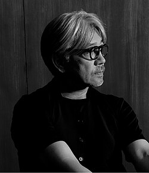

# Ryuichi Sakamoto

## Biografía

Ryūichi Sakamoto (坂本 龍一, Sakamoto Ryūichi?, Tokio, 17 de enero de 1952-Tokio, 28 de marzo de 2023)​ fue un músico, compositor, productor, pianista, cantante, escritor y actor japonés.​ Vivió en Tokio y Nueva York. Comenzó su carrera en 1978 como miembro de la banda pionera en la música electrónica Yellow Magic Orchestra (YMO),​​ donde tocó los teclados y ocasionalmente fue vocalista. La banda fue un éxito internacional, con éxitos como Computer Game / Firecracker (1978) y Behind the Mask (1978),​ escrita y cantada por Sakamoto. Se encontraba enfocado en su carrera como solista, en la que debutó con el álbum de música fusión experimental The Thousand Knives of Ryūichi Sakamoto (1978); posteriormente publicó el álbum pionero B-2 Unit (1980), que incluye el clásico de la música electro Riot in Lagos.​​​ Luego de la separación de YMO en 1983 continuó produciendo más álbumes en solitario, incluyendo colaboraciones con varios artistas internacionales a lo largo de la década de 1990. Comenzó a actuar y a componer música para cine con Merry Christmas Mr. Lawrence (1983), en la que interpretó uno de los personajes principales y realizó la banda sonora de la misma. La canción Forbidden Colours que compuso para el filme se convirtió en éxito a nivel mundial y ganó un premio BAFTA por la banda sonora del filme.​ Después ganó un Óscar y un Grammy por la banda sonora de El último emperador (1987),​ y también ganó dos Globos de Oro por su trabajo de música para cine.​ Adicionalmente compuso la música para la apertura de los Juegos Olímpicos de Barcelona 1992. A principios de los años noventa, tuvo una breve reunión con YMO, desempeñando un rol relevante en los movimientos techno y acid house de la época, antes de que se volvieran a separar.​ Su composición Energy Flow (1999) fue la primera canción instrumental en ser número uno en Japón.​ Ocasionalmente ha trabajado en animes y música de videojuegos, como compositor y guionista. A finales de los 2000, se reunió nuevamente con YMO, mientras componía música para cine. En 2009, le fue otorgado la Orden de las Artes y las Letras por el ministro de Cultura de Francia por sus contribuciones musicales.​

## Estilo musical

8 Premios y nominaciones Alternar subsección de premios y nominaciones 8.1 Premios honoríficos 8.2 Premios a la banda sonora 8.2.1 Premio de la Academia a la mejor música original [ 123 ] 8.2.2 Premio BAFTA a la mejor música de película [ 124 ] 8.2.3 Premios Grand Bell a la mejor música [ 125 ] 8.2.4 Premio Globo de Oro a la mejor música original [ 114 ] 8.2.5 Premio Grammy al Mejor Álbum de Banda Sonora para una Película, Televisión u Otros Medios Visuales [ 115 ] 8.2.6 Premio del Cine de Hong Kong a la Mejor Banda Sonora Original [ 126 ] 8.2.7 Premios del Cine Asiático al Mejor Compositor 8.3 Otros premios

## Anécdotas y curiosidades

2 Carrera en solitario Alternar subsección Carrera en solitario 2.1 Década de 1970 2.2 Década de 1980 2.3 Década de 1990 2.4 Década de 2000 2.5 Década de 2010 2.6 Década de 2020

## Top 10 bandas sonoras

1. ***The Last Emperor (Título en España: El último emperador)***
    * **Póster:** [link](098_ryuichi_sakamoto/posters/poster_the_last_emperor_1987.jpg)
2. ***The Revenant (Título en España: El renacido)***
    * **Póster:** [link](098_ryuichi_sakamoto/posters/poster_the_revenant_2015.jpg)
3. ***Snake Eyes (Título en España: Ojos de serpiente)***
    * **Póster:** [link](098_ryuichi_sakamoto/posters/poster_snake_eyes_1998.jpg)
4. ***Tacones lejanos (Título en España: Tacones lejanos)***
    * **Póster:** [link](098_ryuichi_sakamoto/posters/poster_tacones_lejanos_1991.jpg)
5. ***Wuthering Heights (Título en España: Cumbres  borrascosas)***
    * **Póster:** [link](098_ryuichi_sakamoto/posters/poster_wuthering_heights_1992.jpg)
6. ***The Handmaid's Tale (Título en España: El cuento de la doncella)***
    * **Póster:** [link](098_ryuichi_sakamoto/posters/poster_the_handmaid_s_tale_1990.jpg)
7. ***Little Buddha (Título en España: Pequeño Buda)***
    * **Póster:** [link](098_ryuichi_sakamoto/posters/poster_little_buddha_1993.jpg)
8. ***Rage (Título en España: Tokarev)***
    * **Póster:** [link](098_ryuichi_sakamoto/posters/poster_rage_2014.jpg)
9. ***Femme Fatale (Título en España: Femme Fatale)***
    * **Póster:** [link](098_ryuichi_sakamoto/posters/poster_femme_fatale_2002.jpg)
10. ***Beckett (Título en España: Beckett)***
    * **Póster:** [link](098_ryuichi_sakamoto/posters/poster_beckett_2021.jpg)

## Filmografía completa

- 空白の衝動 (Título en España: 空白の衝動) (1977) · [Póster](098_ryuichi_sakamoto/posters/poster_poster_1977.jpg)
- Behind the Mask (Título en España: Behind the Mask) (1978) · [Póster](098_ryuichi_sakamoto/posters/poster_behind_the_mask_1978.jpg)
- Ikenai Rouge Magic (Título en España: Ikenai Rouge Magic) (1982) · [Póster](098_ryuichi_sakamoto/posters/poster_ikenai_rouge_magic_1982.jpg)
- だいじょうぶマイフレンド (Título en España: だいじょうぶマイフレンド) (1983) · [Póster](098_ryuichi_sakamoto/posters/poster_poster_1983.jpg)
- Forbidden Colours (Título en España: Forbidden Colours) (1983) · [Póster](098_ryuichi_sakamoto/posters/poster_forbidden_colours_1983.jpg)
- The Oshima Gang (Título en España: The Oshima Gang) (1983) · [Póster](098_ryuichi_sakamoto/posters/poster_the_oshima_gang_1983.jpg)
- Japão, uma Viagem no Tempo (Título en España: Japão, uma Viagem no Tempo) (1985) · [Póster](098_ryuichi_sakamoto/posters/poster_jap_o_uma_viagem_no_tempo_1985.jpg)
- The Last Emperor (Título en España: El último emperador) (1987) · [Póster](098_ryuichi_sakamoto/posters/poster_the_last_emperor_1987.jpg)
- The Handmaid's Tale (Título en España: El cuento de la doncella) (1990) · [Póster](098_ryuichi_sakamoto/posters/poster_the_handmaid_s_tale_1990.jpg)
- Tacones lejanos (Título en España: Tacones lejanos) (1991) · [Póster](098_ryuichi_sakamoto/posters/poster_tacones_lejanos_1991.jpg)
- Wuthering Heights (Título en España: Cumbres  borrascosas) (1992) · [Póster](098_ryuichi_sakamoto/posters/poster_wuthering_heights_1992.jpg)
- Wuthering Heights (Título en España: Cumbres borrascosas) (1992) · [Póster](098_ryuichi_sakamoto/posters/poster_wuthering_heights_1992.jpg)
- Little Buddha (Título en España: Pequeño Buda) (1993) · [Póster](098_ryuichi_sakamoto/posters/poster_little_buddha_1993.jpg)
- ลูกบ้าเที่ยวล่าสุด (Título en España: ลูกบ้าเที่ยวล่าสุด) (1993) · [Póster](098_ryuichi_sakamoto/posters/poster_poster_1993.jpg)
- Wild Side (Título en España: El lado salvaje) (1995) · [Póster](098_ryuichi_sakamoto/posters/poster_wild_side_1995.jpg)
- The Other Side of Love (Título en España: The Other Side of Love) (1997) · [Póster](098_ryuichi_sakamoto/posters/poster_the_other_side_of_love_1997.jpg)
- Love Is the Devil: Study for a Portrait of Francis Bacon (Título en España: El amor es el demonio. Estudio para un retrato de Francis Bacon) (1998) · [Póster](098_ryuichi_sakamoto/posters/poster_love_is_the_devil_study_for_a_portrait_of_francis_bacon_1998.jpg)
- Snake Eyes (Título en España: Ojos de serpiente) (1998) · [Póster](098_ryuichi_sakamoto/posters/poster_snake_eyes_1998.jpg)
- L.O.L.: Lack of Love (Título en España: L.O.L.: Lack of Love) (2000) · [Póster](098_ryuichi_sakamoto/posters/poster_l_o_l_lack_of_love_2000.jpg)
- Derrida (Título en España: Derrida) (2002) · [Póster](098_ryuichi_sakamoto/posters/poster_derrida_2002.jpg)
- Femme Fatale (Título en España: Femme Fatale) (2002) · [Póster](098_ryuichi_sakamoto/posters/poster_femme_fatale_2002.jpg)
- Los rubios (Título en España: Los rubios) (2003) · [Póster](098_ryuichi_sakamoto/posters/poster_los_rubios_2003.jpg)
- Devil's Moon (Título en España: Devil's Moon) (2004) · [Póster](098_ryuichi_sakamoto/posters/poster_devil_s_moon_2004.jpg)
- Seven Samurai 20XX (Título en España: Seven Samurai 20XX) (2004) · [Póster](098_ryuichi_sakamoto/posters/poster_seven_samurai_20xx_2004.jpg)
- 星になった少年 Shining Boy ＆ Little Randy (Título en España: Shining Boy ＆ Little Randy) (2005) · [Póster](098_ryuichi_sakamoto/posters/poster_shining_boy_little_randy_2005.jpg)
- Silk (Título en España: Seda) (2007) · [Póster](098_ryuichi_sakamoto/posters/poster_silk_2007.jpg)
- 新しい靴を買わなくちゃ (Título en España: 新しい靴を買わなくちゃ) (2012) · [Póster](098_ryuichi_sakamoto/posters/poster_poster_2012.jpg)
- Rage (Título en España: Tokarev) (2014) · [Póster](098_ryuichi_sakamoto/posters/poster_rage_2014.jpg)
- 母と暮せば (Título en España: Nagasaki: Recuerdos de mi hijo) (2015) · [Póster](098_ryuichi_sakamoto/posters/poster_poster_2015.jpg)
- The Revenant (Título en España: El renacido) (2015) · [Póster](098_ryuichi_sakamoto/posters/poster_the_revenant_2015.jpg)
- I Hate New York (Título en España: I Hate New York) (2018) · [Póster](098_ryuichi_sakamoto/posters/poster_i_hate_new_york_2018.jpg)
- ずっとずっといっしょだよ (Título en España: Sayonara, Tyrano) (2018) · [Póster](098_ryuichi_sakamoto/posters/poster_poster_2018.jpg)
- Proxima (Título en España: Próxima) (2019) · [Póster](098_ryuichi_sakamoto/posters/poster_proxima_2019.jpg)
- Smithereens (Título en España: Smithereens) (2019) · [Póster](098_ryuichi_sakamoto/posters/poster_smithereens_2019.jpg)
- The Staggering Girl (Título en España: The Staggering Girl) (2019) · [Póster](098_ryuichi_sakamoto/posters/poster_the_staggering_girl_2019.jpg)
- Minamata (Título en España: El fotógrafo de Minamata) (2020) · [Póster](098_ryuichi_sakamoto/posters/poster_minamata_2020.jpg)
- Beckett (Título en España: Beckett) (2021) · [Póster](098_ryuichi_sakamoto/posters/poster_beckett_2021.jpg)
- After Yang (Título en España: Despidiendo a Yang) (2022) · [Póster](098_ryuichi_sakamoto/posters/poster_after_yang_2022.jpg)
- Cobalt Exception (Título en España: Cobalt Exception) (2022) · [Póster](098_ryuichi_sakamoto/posters/poster_cobalt_exception_2022.jpg)
- Riot In Lagos (Título en España: Riot In Lagos) · [Póster](098_ryuichi_sakamoto/posters/poster_riot_in_lagos.jpg)
- THE JAPANESE SOCCER ANTHEM (Título en España: THE JAPANESE SOCCER ANTHEM) · [Póster](098_ryuichi_sakamoto/posters/poster_the_japanese_soccer_anthem.jpg)
- The Sheltering Sky (Título en España: El cielo protector) · [Póster](098_ryuichi_sakamoto/posters/poster_the_sheltering_sky.jpg)
- The Wild Palms (Título en España: The Wild Palms) · [Póster](098_ryuichi_sakamoto/posters/poster_the_wild_palms.jpg)

## Premios y nominaciones

* 1983 – Premio BAFTA a la mejor música original – por *The Oshima Gang (Título en España: The Oshima Gang)* – (Ganador)
* 1988 – Premio Grammy a la mejor banda sonora para medios visuales – por *The Last Emperor (Título en España: El último emperador)* – (Nominación)
* 1988 – Premio de la Academia a la mejor banda sonora original – por *The Last Emperor (Título en España: El último emperador)* – (Ganador)
* 1988 – Premio de la Academia a la mejor banda sonora original – por *The Last Emperor (Título en España: El último emperador)* – (Nominación)
* 2002 – Orden de Río Branco – (Ganador)
* 2009 – Oficial de Artes y Letras – (Ganador)
* 2010 – Premios de fomento del arte – (Ganador)

## Fuentes adicionales

* [MundoBSO](https://mundobso.com) — site:mundobso.com
* [Film Score Monthly](https://www.filmscoremonthly.com/daily/article.cfm/articleID/8377/Film-Score-Friday-91925/) — site:filmscoremonthly.com
* [Film Score Monthly (2)](https://www.filmscoremonthly.com/daily/article.cfm/articleID/8173/Film-Score-Friday-12123/) — site:filmscoremonthly.com
* [Film Score Monthly (3)](https://www.filmscoremonthly.com/board/posts.cfm?archive=0&forumID=1&threadID=49633) — site:filmscoremonthly.com
* [SoundtrackCollector](https://www.soundtrackcollector.com/title/1958/Last+Emperor,+The) — site:soundtrackcollector.com
* [SoundtrackCollector (2)](https://www.soundtrackcollector.com/title/2130/Merry+Christmas,+Mr.+Lawrence) — site:soundtrackcollector.com
* [SoundtrackCollector (3)](https://www.soundtrackcollector.com/title/2981/Sheltering+Sky,+The) — site:soundtrackcollector.com
* [WhatSong](https://www.whatsong.org/tvshow/vikings/episode/41727) — site:whatsong.org
* [WhatSong (2)](https://www.whatsong.org/movie/the-revenant) — site:whatsong.org
* [WhatSong (3)](https://www.whatsong.org/movie/call-me-by-your-name) — site:whatsong.org

## Notas externas

* WhatSong: Trevor Morris, Einar Selvik, Steve Tavaglione y Brian Kilgore - Los vikingos II (banda sonora original de la película) Trevor Morris - Los vikingos II (banda sonora original de la película)
* WhatSong (2): Sinfónica de Seattle y Ludovic Morlot - John Luther Adams: Become Ocean Sinfónica de Seattle - John Luther Adams: Become Ocean
* WhatSong (3): John Adams - Llámame por tu nombre (banda sonora original de la película) Créditos iniciales. / La canción suena más adelante en la película mientras Elio observa a Oliver desde el balcón.
* www.classicalarchives.com: El viernes 1 de octubre de 2010, el director artístico Nolan Gasser habló con el célebre compositor, pianista y activista medioambiental japonés Ryuichi Sakamoto, cuyo lanzamiento debut en Decca combina dos álbumes recientes, Playing the Piano y Out of Noise. La impresionante carrera musical del Sr. Sakamoto abarca numerosos géneros, desde el tecno-pop de los años 1970 hasta la música de cine (incluidos grandes éxitos como Feliz Navidad, Mr. Lawrence y El último emperador, por el que ganó un Oscar) en los años 1980 y obras más puramente clásicas en los últimos años. En esta cautivadora entrevista, el Sr. Sakamoto analiza los antecedentes, las cuestiones técnicas y estéticas que rodean a los dos álbumes recientes muy diferentes, así como...
* classical.music.apple.com: ELECCIÓN DEL EDITOR Insen (Remaster) 2022 · Ryuichi Sakamoto, Alva Noto Reproduce Ryuichi Sakamoto Essentials Ryuichi Sakamoto Essentials
* www.yokogaomag.com: Ryuichi Sakamoto fue un pionero que trascendió las fronteras musicales, fusionando Oriente y Occidente, lo tradicional y lo moderno, lo digital y lo orgánico. A lo largo de su carrera de cinco décadas, Sakamoto redefinió lo que significa ser un artista global, utilizando la música como lenguaje universal para conectar personas y culturas de todo el mundo. Su trabajo con Yellow Magic Orchestra (YMO) revolucionó la música electrónica y sus innovadoras bandas sonoras cinematográficas le valieron elogios de la crítica, incluido un Premio de la Academia. Más allá de sus logros artísticos, Sakamoto fue un apasionado defensor de las cuestiones medioambientales y los derechos humanos, y utilizó su plataforma para crear conciencia sobre los problemas apremiantes de su época. Este artículo profundiza en la vida...
* www.acmi.net.au: Cuatro décadas de maestría musical del difunto gran compositor. En Feliz Navidad, Sr. Lawrence, surgen tensiones y choques culturales en un campo de prisioneros de guerra japonés entre los cautivos británicos, liderados por el mayor Jack Celliers (David Bowie), y sus captores japoneses, particularmente el enigmático Capitán Yonoi (Ryuichi Sakamoto). El drama de Nagisa Ōshima sobre la Segunda Guerra Mundial explora temas de honor, lealtad y relaciones prohibidas frente a la guerra, y la música de Sakamoto (este fue su debut como actor y compositor de música cinematográfica) equilibra delicadamente fascinantes composiciones de piano y texturas electrónicas para capturar las complejidades emocionales de los personajes de la película.
* www.cbr.com: El mundo del cine experimentó una pérdida significativa con el fallecimiento de Ryuichi Sakamoto en marzo de 2023. El aclamado compositor japonés ha trabajado con algunos de los mejores cineastas durante sus 40 años de carrera en el cine, ganando un Oscar por el épico drama histórico de 1987 El último emperador. Junto con el venerado cineasta Bernardo Bertolucci, Sakamoto trabajó con todos, desde Pedro Almodóvar y Brian De Palma hasta Alejandro González Iñárritu y Nagisa Oshima, para crear impresionantes paisajes sonoros y bandas sonoras ambientales que ayudan a reflejar el estado de ánimo dramático de cada historia contada. Es hora de resaltar las mejores bandas sonoras cinematográficas de Ryuichi Sakamoto para honrar el legado duradero del artista.
* www.rottentomatoes.com: -- The Great American Baking Show: Celebrity Big Game: Temporada 2 80% Bridgerton: Temporada 4 Enlace a Bridgerton: Temporada 4
* www.sitesakamoto.com: Cuando Ryuichi Sakamoto era estudiante de secundaria en Tokio, tenía que viajar en un tren de cercanías para llegar a clase. Los pasajeros siempre iban hacinados, atrapados unos a otros entre miembros extraviados y torsos retorcidos. Incapaz de moverse, todo lo que el adolescente Sakamoto podía hacer era escuchar. Se divirtió contando los sonidos que hacía el tren, identificando más de 10 que escuchaba cada mañana. Escuchar atentamente es un hábito que ha llevado a Sakamoto a lo largo de casi 70 años de exploración musical, llevándolo cada década hacia nuevas direcciones. Nació en 1952, el año en que John Cage compuso 4â²33â³. Cuando era un niño pequeño, le presentaron el piano, un instrumento que examinaría de muchos...
* cinema.cornell.edu: Visita Información de entradas Todos los pases de acceso Accesibilidad Estacionamiento e indicaciones Preguntas frecuentes Calendario de películas y eventos Serie de películas actual Películas actuales Películas pasadas Aviso de contenido
* yellow-magic-orchestra.fandom.com: Explorar la página principal Discutir todas las páginas Comunidad Mapas interactivos Publicaciones de blog recientes Contenido wiki Páginas modificadas recientemente Ryuichi Sakamoto Riot in Lagos Unidad B-2 Yellow Magic Orchestra Casas de bambú Petardo X∞Multiplica Canciones escritas por Ryuichi Sakamoto Tong Poo Tienes que ayudarte a ti mismo Esperando ríos G.T. Parolibre Technopolis U.T. Canciones de Yellow Magic Orchestra Firecracker Tong Poo Tienes que ayudarte a ti mismo Esperando Ríos Technopolis Cue U.T.
