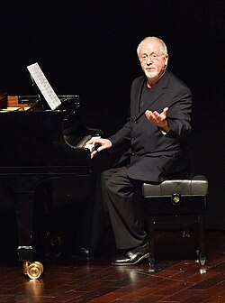

# Patrick Doyle

## Biografía

Patrick Doyle (n. Uddingston, South Lanarkshire, Escocia; 6 de abril de 1953) es un compositor escocés dedicado a la creación de música para cine, teatro, radio y televisión. También ha trabajado como actor en diversos proyectos teatrales y cinematográficos. Se graduó en 1974 en la Royal Scottish Academy of Music and Drama; para ese momento ya participaba como actor en puestas teatrales. Cuatro años después comenzó a componer música para diferentes producciones escénicas y televisivas. En 1987 se unió a la Renaissance Theatre Company trabajando como actor y director musical en la compañía. Su amigo de aquellas épocas en las tablas, el actor Kenneth Branagh, le encargó componer la música para su debut como director de cine, Enrique V. A partir de allí y del reconocimiento obtenido por ese trabajo, Doyle se dedicó de lleno a componer música incidental para producciones audiovisuales y radiales. En 1997 su ritmo de trabajo se vio alterado cuando se le diagnosticó leucemia; Doyle se sometió a un tratamiento de quimioterapia y logró salvarse pese a algunos pronósticos poco esperanzadores. Su experiencia como paciente con leucemia lo llevó a apoyar diversas iniciativas para concientizar a la sociedad sobre la enfermedad, una de ella fue la gala benéfica de 2008 en la que se realizó un concierto con una selección de sus obras musicales. Luego de recobrar su salud continuó trabajando en nuevos proyectos, cada vez con mayor perfil y éxito comercial como Grandes esperanzas, El diario de Bridget Jones o Harry Potter y el cáliz de fuego, la película de mayor recaudación en la cual ha trabajado. A lo largo de su carrera, Doyle ha colaborado frecuentemente con realizadores como el mencionado Kenneth Branagh, Mike Newell, Alfonso Cuarón y Régis Wargnier. Fuera de la composición para cine escribió piezas para concierto y coro como The Thistle and the Rose que le fue encargada por la casa real de Inglaterra. El estilo compositivo del escocés se caracteriza por una fuerte presencia de elementos del Clasicismo y Romanticismo británicos. Al igual que otros compositores de música cinematográfica como John Williams o Jerry Goldsmith, Doyle compone a base de leitmotifs y temas musicales definidos que estructuran la identidad de sus partituras. La crítica ha señalado también que su obra muestra una expresividad y un tono apasionado y melodramático cercano al de la era clásica de la música para cine de Hollywood. Sus composiciones para las películas Sense and Sensibility y Hamlet le valieron dos nominaciones respectivas a los premios Óscar; además, ganó el World Soundtrack Award por Gosford Park y El diario de Bridget Jones y ha conseguido nominaciones a diferentes premios por otros trabajos.​

## Estilo musical

2 Obra Alternar subsección Obra 2.1 Estilo e influencias 2.2 Listado de obras

Reseñas Cine TV Videojuegos Musicales DVD Libros Contenidos especiales Entrevistas Monografías Dossiers Reportajes Vídeo y Multimedia Filmografías

## Anécdotas y curiosidades

1 Vida y carrera Toggle Subsección Vida y carrera 1.1 Vida temprana 1.2 Carrera cinematográfica y televisiva 1.3 Colaboraciones de artistas 1.4 Obras de concierto y encargos originales 1.5 Obras grabadas 1.6 Premios 1.7 Vida personal

## Top 10 bandas sonoras

1. ***Sense and Sensibility (Título en España: Sentido y sensibilidad)***
    * **Póster:** [link](099_patrick_doyle/posters/poster_sense_and_sensibility_1995.jpg)
2. ***Hamlet (Título en España: Hamlet)***
    * **Póster:** [link](099_patrick_doyle/posters/poster_hamlet_1996.jpg)
3. ***Run (Título en España: Mamá te quiere)***
    * **Póster:** [link](099_patrick_doyle/posters/poster_run_2020.jpg)
4. ***Harry Potter and the Philosopher's Stone (Título en España: Harry Potter y la piedra filosofal)***
    * **Póster:** [link](099_patrick_doyle/posters/poster_harry_potter_and_the_philosopher_s_stone_2001.jpg)
5. ***Harry Potter and the Goblet of Fire (Título en España: Harry Potter y el cáliz de fuego)***
    * **Póster:** [link](099_patrick_doyle/posters/poster_harry_potter_and_the_goblet_of_fire_2005.jpg)
6. ***Thor (Título en España: Thor)***
    * **Póster:** [link](099_patrick_doyle/posters/poster_thor_2011.jpg)
7. ***Brave (Título en España: Indomable)***
    * **Póster:** [link](099_patrick_doyle/posters/poster_brave_2012.jpg)
8. ***Cinderella (Título en España: Cenicienta)***
    * **Póster:** [link](099_patrick_doyle/posters/poster_cinderella_2015.jpg)
9. ***Rise of the Planet of the Apes (Título en España: El origen del planeta de los simios)***
    * **Póster:** [link](099_patrick_doyle/posters/poster_rise_of_the_planet_of_the_apes_2011.jpg)
10. ***Carlito's Way (Título en España: Atrapado por su pasado)***
    * **Póster:** [link](099_patrick_doyle/posters/poster_carlito_s_way_1993.jpg)

## Filmografía completa

- Henry V (Título en España: Enrique V) (1989) · [Póster](099_patrick_doyle/posters/poster_henry_v_1989.jpg)
- Look Back in Anger (Título en España: Look Back in Anger) (1989) · [Póster](099_patrick_doyle/posters/poster_look_back_in_anger_1989.jpg)
- Håkon Håkonsen (Título en España: Náufragos) (1990) · [Póster](099_patrick_doyle/posters/poster_h_kon_h_konsen_1990.jpg)
- Dead Again (Título en España: Morir todavía) (1991) · [Póster](099_patrick_doyle/posters/poster_dead_again_1991.jpg)
- Indochine (Título en España: Indochina) (1992) · [Póster](099_patrick_doyle/posters/poster_indochine_1992.jpg)
- Into the West (Título en España: Escapada al sur) (1992) · [Póster](099_patrick_doyle/posters/poster_into_the_west_1992.jpg)
- Carlito's Way (Título en España: Atrapado por su pasado) (1993) · [Póster](099_patrick_doyle/posters/poster_carlito_s_way_1993.jpg)
- Much Ado About Nothing (Título en España: Mucho ruido y pocas nueces) (1993) · [Póster](099_patrick_doyle/posters/poster_much_ado_about_nothing_1993.jpg)
- Needful Things (Título en España: La tienda) (1993) · [Póster](099_patrick_doyle/posters/poster_needful_things_1993.jpg)
- Exit to Eden (Título en España: Dos sabuesos en la isla del Edén) (1994) · [Póster](099_patrick_doyle/posters/poster_exit_to_eden_1994.jpg)
- Mary Shelley's Frankenstein (Título en España: Frankenstein de Mary Shelley) (1994) · [Póster](099_patrick_doyle/posters/poster_mary_shelley_s_frankenstein_1994.jpg)
- A Little Princess (Título en España: La princesita) (1995) · [Póster](099_patrick_doyle/posters/poster_a_little_princess_1995.jpg)
- Sense and Sensibility (Título en España: Sentido y sensibilidad) (1995) · [Póster](099_patrick_doyle/posters/poster_sense_and_sensibility_1995.jpg)
- Une Femme française (Título en España: Los amores de una mujer francesa) (1995) · [Póster](099_patrick_doyle/posters/poster_une_femme_fran_aise_1995.jpg)
- Hamlet (Título en España: Hamlet) (1996) · [Póster](099_patrick_doyle/posters/poster_hamlet_1996.jpg)
- Mrs. Winterbourne (Título en España: Con cariño desde el cielo (Amor por accidente)) (1996) · [Póster](099_patrick_doyle/posters/poster_mrs_winterbourne_1996.jpg)
- Donnie Brasco (Título en España: Donnie Brasco) (1997) · [Póster](099_patrick_doyle/posters/poster_donnie_brasco_1997.jpg)
- Great Expectations (Título en España: Grandes esperanzas) (1998) · [Póster](099_patrick_doyle/posters/poster_great_expectations_1998.jpg)
- Quest for Camelot (Título en España: La espada mágica) (1998) · [Póster](099_patrick_doyle/posters/poster_quest_for_camelot_1998.jpg)
- Love's Labour's Lost (Título en España: Trabajos de amor perdidos) (2000) · [Póster](099_patrick_doyle/posters/poster_love_s_labour_s_lost_2000.jpg)
- Blow Dry (Título en España: Éxito por los pelos) (2001) · [Póster](099_patrick_doyle/posters/poster_blow_dry_2001.jpg)
- Bridget Jones's Diary (Título en España: El diario de Bridget Jones) (2001) · [Póster](099_patrick_doyle/posters/poster_bridget_jones_s_diary_2001.jpg)
- Gosford Park (Título en España: Gosford Park) (2001) · [Póster](099_patrick_doyle/posters/poster_gosford_park_2001.jpg)
- Harry Potter and the Philosopher's Stone (Título en España: Harry Potter y la piedra filosofal) (2001) · [Póster](099_patrick_doyle/posters/poster_harry_potter_and_the_philosopher_s_stone_2001.jpg)
- Killing Me Softly (Título en España: Suavemente me mata) (2002) · [Póster](099_patrick_doyle/posters/poster_killing_me_softly_2002.jpg)
- Calendar Girls (Título en España: Las chicas del calendario) (2003) · [Póster](099_patrick_doyle/posters/poster_calendar_girls_2003.jpg)
- Secondhand Lions (Título en España: El secreto de los McCann) (2003) · [Póster](099_patrick_doyle/posters/poster_secondhand_lions_2003.jpg)
- El misterio Galíndez (Título en España: El misterio Galíndez) (2003) · [Póster](099_patrick_doyle/posters/poster_el_misterio_gal_ndez_2003.jpg)
- Ma Nouvelle-France (Título en España: Ma Nouvelle-France) (2004) · [Póster](099_patrick_doyle/posters/poster_ma_nouvelle_france_2004.jpg)
- Nouvelle-France (Título en España: Tierra de pasiones) (2004) · [Póster](099_patrick_doyle/posters/poster_nouvelle_france_2004.jpg)
- Harry Potter and the Goblet of Fire (Título en España: Harry Potter y el cáliz de fuego) (2005) · [Póster](099_patrick_doyle/posters/poster_harry_potter_and_the_goblet_of_fire_2005.jpg)
- Man to Man (Título en España: Man to Man) (2005) · [Póster](099_patrick_doyle/posters/poster_man_to_man_2005.jpg)
- Nanny McPhee (Título en España: La niñera mágica) (2005) · [Póster](099_patrick_doyle/posters/poster_nanny_mcphee_2005.jpg)
- Wah-Wah (Título en España: Wah-Wah) (2005) · [Póster](099_patrick_doyle/posters/poster_wah_wah_2005.jpg)
- As You Like It (Título en España: Como gustéis) (2006) · [Póster](099_patrick_doyle/posters/poster_as_you_like_it_2006.jpg)
- Eragon (Título en España: Eragon) (2006) · [Póster](099_patrick_doyle/posters/poster_eragon_2006.jpg)
- Pars vite et reviens tard (Título en España: Plaga final) (2007) · [Póster](099_patrick_doyle/posters/poster_pars_vite_et_reviens_tard_2007.jpg)
- Sleuth (Título en España: La huella) (2007) · [Póster](099_patrick_doyle/posters/poster_sleuth_2007.jpg)
- The Last Legion (Título en España: La última legión) (2007) · [Póster](099_patrick_doyle/posters/poster_the_last_legion_2007.jpg)
- Igor (Título en España: Igor) (2008) · [Póster](099_patrick_doyle/posters/poster_igor_2008.jpg)
- Nim's Island (Título en España: La isla de Nim) (2008) · [Póster](099_patrick_doyle/posters/poster_nim_s_island_2008.jpg)
- Main Street (Título en España: Main Street) (2010) · [Póster](099_patrick_doyle/posters/poster_main_street_2010.jpg)
- Jig (Título en España: Jig) (2011) · [Póster](099_patrick_doyle/posters/poster_jig_2011.jpg)
- La Ligne droite (Título en España: La Ligne droite) (2011) · [Póster](099_patrick_doyle/posters/poster_la_ligne_droite_2011.jpg)
- Rise of the Planet of the Apes (Título en España: El origen del planeta de los simios) (2011) · [Póster](099_patrick_doyle/posters/poster_rise_of_the_planet_of_the_apes_2011.jpg)
- Thor (Título en España: Thor) (2011) · [Póster](099_patrick_doyle/posters/poster_thor_2011.jpg)
- Brave (Título en España: Indomable) (2012) · [Póster](099_patrick_doyle/posters/poster_brave_2012.jpg)
- Sir Billi (Título en España: Sir Billi) (2012) · [Póster](099_patrick_doyle/posters/poster_sir_billi_2012.jpg)
- The Legend of Mor'du (Título en España: La leyenda de Mordú) (2012) · [Póster](099_patrick_doyle/posters/poster_the_legend_of_mor_du_2012.jpg)
- 꼭두각시 (Título en España: 꼭두각시) (2013) · [Póster](099_patrick_doyle/posters/poster_poster_2013.jpg)
- Enchanted Kingdom (Título en España: Enchanted Kingdom) (2014) · [Póster](099_patrick_doyle/posters/poster_enchanted_kingdom_2014.jpg)
- Jack Ryan: Shadow Recruit (Título en España: Jack Ryan: Operación sombra) (2014) · [Póster](099_patrick_doyle/posters/poster_jack_ryan_shadow_recruit_2014.jpg)
- Cinderella (Título en España: Cenicienta) (2015) · [Póster](099_patrick_doyle/posters/poster_cinderella_2015.jpg)
- A United Kingdom (Título en España: Un reino unido) (2016) · [Póster](099_patrick_doyle/posters/poster_a_united_kingdom_2016.jpg)
- Whisky Galore (Título en España: Whisky Galore) (2016) · [Póster](099_patrick_doyle/posters/poster_whisky_galore_2016.jpg)
- The Emoji Movie (Título en España: Emoji: La película) (2017) · [Póster](099_patrick_doyle/posters/poster_the_emoji_movie_2017.jpg)
- Murder on the Orient Express (Título en España: Asesinato en el Orient Express) (2017) · [Póster](099_patrick_doyle/posters/poster_murder_on_the_orient_express_2017.jpg)
- I'll Never Forget the Last Time (Título en España: I'll Never Forget the Last Time) (2017) · [Póster](099_patrick_doyle/posters/poster_i_ll_never_forget_the_last_time_2017.jpg)
- The Emoji Movie (Título en España: Emoji: La película) (2017) · [Póster](099_patrick_doyle/posters/poster_the_emoji_movie_2017.jpg)
- All Is True (Título en España: El último acto) (2018) · [Póster](099_patrick_doyle/posters/poster_all_is_true_2018.jpg)
- Sgt. Stubby: An American Hero (Título en España: Sargento Stubby, un héroe muy especial) (2018) · [Póster](099_patrick_doyle/posters/poster_sgt_stubby_an_american_hero_2018.jpg)
- Artemis Fowl (Título en España: Artemis Fowl) (2020) · [Póster](099_patrick_doyle/posters/poster_artemis_fowl_2020.jpg)
- Run (Título en España: Mamá te quiere) (2020) · [Póster](099_patrick_doyle/posters/poster_run_2020.jpg)
- Death on the Nile (Título en España: Muerte en el Nilo) (2022) · [Póster](099_patrick_doyle/posters/poster_death_on_the_nile_2022.jpg)
- B.O.O.: Bureau of Otherworldly Operations (Título en España: B.O.O.: Bureau of Otherworldly Operations) · [Póster](099_patrick_doyle/posters/poster_b_o_o_bureau_of_otherworldly_operations.jpg)
- King Charles III Coronation March (Título en España: King Charles III Coronation March) · [Póster](https://example.com/placeholder.jpg)

## Premios y nominaciones

* 1996 – Premio de la Academia a la mejor banda sonora dramática original – por *Sense and Sensibility (Título en España: Sentido y sensibilidad)* – (Nominación)
* 1997 – Premio de la Academia a la mejor banda sonora dramática original – por *Hamlet (Título en España: Hamlet)* – (Nominación)

## Fuentes adicionales

* [MundoBSO](https://www.mundobso.com/compositor/doyle-patrick) — site:mundobso.com
* [MundoBSO (2)](https://w.mundobso.com/bso/cartero-siempre-llama-dos-veces-el) — site:mundobso.com
* [MundoBSO (3)](https://www.mundobso.com/bso/capitan-america-civil-war) — site:mundobso.com
* [Film Score Monthly](https://www.filmscoremonthly.com/board/posts.cfm?threadID=43247&forumID=1&archive=0) — site:filmscoremonthly.com
* [Film Score Monthly (2)](https://www.filmscoremonthly.com/backissues/viewissue.cfm?issueID=80) — site:filmscoremonthly.com
* [Film Score Monthly (3)](https://www.filmscoremonthly.com/daily/article.cfm/articleID/6604/) — site:filmscoremonthly.com
* [SoundtrackCollector](https://www.soundtrackcollector.com/title/5761/Much+Ado+About+Nothing) — site:soundtrackcollector.com
* [SoundtrackCollector (2)](https://www.soundtrackcollector.com/title/5608/Dead+Again) — site:soundtrackcollector.com
* [SoundtrackCollector (3)](https://www.soundtrackcollector.com/title/72086/Harry+Potter+And+The+Goblet+Of+Fire) — site:soundtrackcollector.com
* [WhatSong](https://www.whatsong.org/tvshow/prison-break/episode/37396) — site:whatsong.org
* [WhatSong (2)](https://www.whatsong.org/tvshow/how-i-met-your-mother/episode/44483) — site:whatsong.org
* [WhatSong (3)](https://www.whatsong.org/tvshow/9-1-1/episode/71629) — site:whatsong.org

## Notas externas

* MundoBSO: Compositor, barítono y ocasional actor nacido en Uddingston (Reino Unido), el 6 de abril de 1953. Compositor escocés muy conocido y apreciado entre los aficionados y el público cinéfilo en general, aunque en las últimas décadas no haya cosechado tantos triunfos como antaño. Su carrera, al igual que tantos y tantos otros grandes músicos de cine, está ligada especialmente a un cineasta. Kenneth Branagh y Doyle se conocen desde hace c asi treinta años y empezaron sus respectivas carreras en el cine a la par, por lo que no se entienden ambas trayectorias sin la prescindir de ninguno de ellos, así de ligadas están. Pero el escocés también ha tenido la oportunidad de trabajar con cineastas...
* MundoBSO (3): Compositor: Jackman, Henry Sello: Hollywood Duración: 69 minutos Información de la película Título original: Captain America: Civil War Director: Anthony Russo, Joe Russo Nacionalidad: EE UU Año: 2016 Argumento Continuación de Captain America: The Winter Soldier (14). Cuando otro incidente internacional involucra a Los Vengadores y causan varios daños colaterales, aumentan las presiones políticas para exigir más responsabilidades y determinar cuándo deben contratar los servicios del grupo de superhéroes. Esta nueva situación dividirá a Los Vengadores, mientras intentan proteger al mundo de un nuevo y terrible villano. Compositor: Jackman, Henry Sello: Hollywood Duración: 69 minutos
* WhatSong: Ramin Djawadi - Prison Break: Temporadas 3 y 4 (Banda sonora original de televisión) Ramin Djawadi - Prison Break: Temporadas 3 y 4 (Banda sonora original de televisión)
* WhatSong (2): Lily y Robin bailan con los dos nerds del último año de secundaria. Se reproduce de fondo cuando Lilly, Robin y Barney intentan entrar a la fiesta. La canción es una canción que está incluida en iMovie.
* WhatSong (3): Talking Heads - Favoritos populares 1976-1992: Sand In the Vaseline The Naked and Famous - Passive Me, Aggressive You (Remixes y caras B)
* www.colonnesonore.net: Reseñas Cine TV Videojuegos Musicales DVD Libros Contenidos especiales Entrevistas Monografías Dossiers Reportajes Vídeo y Multimedia Filmografías
* filmsymphony.es: Otros proyectos de FSO FSO Big Band FSO Cine en Concierto Banda Sonora Total Los Bridgerton en Concierto Galería FSO EN FOTOS fso en video FSO en la prensa FSO en TV
* music.apple.com: Una princesita (banda sonora original de la película / edición de lujo) La Valse de L'Amour Cinderella (banda sonora original de la película)â·â2015
* filmsymphony.es: Otros proyectos FSO FSO Big Band FSO Film in Concert Total Soundtrack Los Bridgerton en Concierto Galería FSO en Imágenes FSO en Vídeos FSO en Prensa escrita FSO en Televisión
* patrickdoylemusic.com: Patrick ha escrito la música de más de 60 largometrajes internacionales, incluida la cuarta entrega de la franquicia cinematográfica más popular de la historia, 'Harry Potter y el cáliz de fuego', dirigida por Mike Newell. La cuarta entrega de la franquicia cinematográfica oficialmente más popular del mundo.
* patrickdoylemusic.com: Por primera vez en el mundo, el 29 de enero de 2026, Patrick dirigirá personalmente la Wiener Symphoniker de Viena en una emocionante noche de música de cine de toda su carrera. El programa incluirá piezas de Harry Potter y el Cáliz de Fuego, Cenicienta, Thor, Sentido y Sensibilidad y muchas más. ¡No te pierdas este espectacular evento! Haga clic aquí para obtener entradas. En reconocimiento a su extraordinario trabajo, su impacto duradero en la industria cinematográfica y su compromiso de fomentar la próxima generación de talento musical, Berklee Valencia y Berklee College entregaron a Patrick Doyle un título honorífico de Doctor en Música en la ceremonia de graduación de 2025 en Valencia.
* patrickdoylemusic.com: Patrick Doyle es un compositor célebre internacionalmente y ganador de múltiples premios con una prolífica carrera de 50 años en cine, televisión, radio y teatro. Ha compuesto la música para algunas de las películas más importantes de la historia del cine moderno y su música ha llegado a una audiencia global de más de mil millones de personas.
