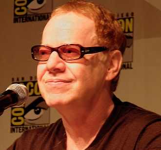

# Danny Elfman

## Biografía

Daniel Robert «Danny» Elfman (Los Ángeles, 29 de mayo de 1953) es un compositor, músico, cantautor y productor discográfico estadounidense. Es reconocido por ser un miembro fundador de la banda de new wave Oingo Boingo, y principalmente por escribir música para las películas del director Tim Burton y de Sam Raimi, debutando en 1985 como compositor de bandas sonoras con su película La gran aventura de Pee-Wee y manteniendo una extensa colaboración con Burton hasta el día de hoy; así mismo también compuso la banda sonora para la trilogía original de Spider-Man, dirigida por Sam Raimi, compuesta por Spider-Man y Spider-Man 2 y compuso la banda sonora de Doctor strange en el multiverso de la locura del mismo director. Además, es conocido por ser el líder del retirado grupo estadounidense Oingo Boingo y por crear el famoso tema de la serie televisiva animada Los Simpson que, entre muchos otros trabajos, le han otorgado un gran prestigio a lo largo de su ecléctica carrera musical.

## Estilo musical

Elfman proviene de una familia judía. Es hijo de la escritora Blossom Elfman. Su carrera creativa comenzó a principios de los años 70, cuando se unió como violinista al grupo de música teatral “Grand Magic Circus”, en el que su hermano mayor, Richard, tocaba las congas en ese momento. Posteriormente pasó a formar parte del grupo de música de vanguardia “The Mystic Knights of the Oingo Boingo”, que Richard fundó en 1972. En este grupo, Danny mostró sus habilidades musicales como cantante principal, trombonista y con diversos instrumentos de percusión como el balafón. Los Mystic Knights crearon la primera banda sonora de la película Forbidden Zone de Richard de 1978, que alcanzó el estatus de culto en los Estados Unidos. También en 1978, Richard entregó el liderazgo de la banda a Danny, quien un año más tarde formó la banda de rock de ocho integrantes Oingo Boingo a partir de la formación de 15 miembros de Mystic Knights. Tocó con Oingo Boingo durante los siguientes 17 años antes de decidir separar la banda en 1995 porque, según Elfman, era "el momento adecuado para hacerlo". [1]

## Anécdotas y curiosidades

2 Subsección de carrera alternar carrera 2.1 Oingo Boingo 2.2 Música para películas 2.3 Música de concierto 2.4 Música escénica 2.5 Televisión y otros proyectos 2.6 Solista

## Top 10 bandas sonoras

1. ***Good Will Hunting (Título en España: El indomable Will Hunting)***
    * **Póster:** [link](100_danny_elfman/posters/poster_good_will_hunting_1997.jpg)
2. ***Men in Black (Título en España: Men in Black)***
    * **Póster:** [link](100_danny_elfman/posters/poster_men_in_black_1997.jpg)
3. ***Batman (Título en España: Batman)***
    * **Póster:** [link](100_danny_elfman/posters/poster_batman_1989.jpg)
4. ***Big Fish (Título en España: Big Fish)***
    * **Póster:** [link](100_danny_elfman/posters/poster_big_fish_2003.jpg)
5. ***Milk (Título en España: Mi nombre es Harvey Milk)***
    * **Póster:** [link](100_danny_elfman/posters/poster_milk_2008.jpg)
6. ***Spider-Man (Título en España: Spider-Man)***
    * **Póster:** [link](100_danny_elfman/posters/poster_spider_man_2002.jpg)
7. ***Avengers: Age of Ultron (Título en España: Vengadores: La era de Ultrón)***
    * **Póster:** [link](100_danny_elfman/posters/poster_avengers_age_of_ultron_2015.jpg)
8. ***Spider-Man 2 (Título en España: Spider-Man 2)***
    * **Póster:** [link](100_danny_elfman/posters/poster_spider_man_2_2004.jpg)
9. ***Forbidden Zone (Título en España: La zona prohibida)***
    * **Póster:** [link](100_danny_elfman/posters/poster_forbidden_zone_1980.jpg)

## Filmografía completa

- Hot Tomorrows (Título en España: Hot Tomorrows) (1977) · [Póster](100_danny_elfman/posters/poster_hot_tomorrows_1977.jpg)
- Forbidden Zone (Título en España: La zona prohibida) (1980) · [Póster](100_danny_elfman/posters/poster_forbidden_zone_1980.jpg)
- Urgh! A Music War (Título en España: Urgh! A Music War) (1981) · [Póster](100_danny_elfman/posters/poster_urgh_a_music_war_1981.jpg)
- Good Morning, Mr. Orwell (Título en España: Good Morning, Mr. Orwell) (1984) · [Póster](100_danny_elfman/posters/poster_good_morning_mr_orwell_1984.jpg)
- Pee-wee's Big Adventure (Título en España: La gran aventura de Pee-Wee) (1985) · [Póster](100_danny_elfman/posters/poster_pee_wee_s_big_adventure_1985.jpg)
- Oingo Boingo: Live at the Ritz (Título en España: Oingo Boingo: Live at the Ritz) (1985) · [Póster](100_danny_elfman/posters/poster_oingo_boingo_live_at_the_ritz_1985.jpg)
- Amazing Stories (Título en España: Cuentos asombrosos) (1986) · [Póster](100_danny_elfman/posters/poster_amazing_stories_1986.jpg)
- Back to School (Título en España: Regreso a la escuela) (1986) · [Póster](100_danny_elfman/posters/poster_back_to_school_1986.jpg)
- Wisdom (Título en España: Wisdom, el delincuente) (1986) · [Póster](100_danny_elfman/posters/poster_wisdom_1986.jpg)
- Summer School (Título en España: Juerga tropical) (1987) · [Póster](100_danny_elfman/posters/poster_summer_school_1987.jpg)
- Oingo Boingo: Halloween '87 (Título en España: Oingo Boingo: Halloween '87) (1987) · [Póster](100_danny_elfman/posters/poster_oingo_boingo_halloween_87_1987.jpg)
- Beetlejuice (Título en España: Bitelchús) (1988) · [Póster](100_danny_elfman/posters/poster_beetlejuice_1988.jpg)
- Big Top Pee-wee (Título en España: El gran Pee-wee) (1988) · [Póster](100_danny_elfman/posters/poster_big_top_pee_wee_1988.jpg)
- Face Like a Frog (Título en España: Face Like a Frog) (1988) · [Póster](100_danny_elfman/posters/poster_face_like_a_frog_1988.jpg)
- Hot to Trot (Título en España: Hot to Trot, un caballo en la bolsa) (1988) · [Póster](100_danny_elfman/posters/poster_hot_to_trot_1988.jpg)
- Midnight Run (Título en España: Huida a medianoche) (1988) · [Póster](100_danny_elfman/posters/poster_midnight_run_1988.jpg)
- Scrooged (Título en España: Los fantasmas atacan al jefe) (1988) · [Póster](100_danny_elfman/posters/poster_scrooged_1988.jpg)
- Batman (Título en España: Batman) (1989) · [Póster](100_danny_elfman/posters/poster_batman_1989.jpg)
- Oingo Boingo: Skeletons in the Closet (Título en España: Oingo Boingo: Skeletons in the Closet) (1989) · [Póster](100_danny_elfman/posters/poster_oingo_boingo_skeletons_in_the_closet_1989.jpg)
- Darkman (Título en España: Darkman) (1990) · [Póster](100_danny_elfman/posters/poster_darkman_1990.jpg)
- Dick Tracy (Título en España: Dick Tracy) (1990) · [Póster](100_danny_elfman/posters/poster_dick_tracy_1990.jpg)
- Edward Scissorhands (Título en España: Eduardo Manostijeras) (1990) · [Póster](100_danny_elfman/posters/poster_edward_scissorhands_1990.jpg)
- Nightbreed (Título en España: Razas de noche) (1990) · [Póster](100_danny_elfman/posters/poster_nightbreed_1990.jpg)
- The Flash (Título en España: The Flash) (1990) · [Póster](100_danny_elfman/posters/poster_the_flash_1990.jpg)
- Batman Returns (Título en España: Batman vuelve) (1992) · [Póster](100_danny_elfman/posters/poster_batman_returns_1992.jpg)
- The Magical World of Chuck Jones (Título en España: The Magical World of Chuck Jones) (1992) · [Póster](100_danny_elfman/posters/poster_the_magical_world_of_chuck_jones_1992.jpg)
- The Nightmare Before Christmas (Título en España: Pesadilla antes de Navidad) (1993) · [Póster](100_danny_elfman/posters/poster_the_nightmare_before_christmas_1993.jpg)
- Sommersby (Título en España: Sommersby) (1993) · [Póster](100_danny_elfman/posters/poster_sommersby_1993.jpg)
- The Making of Tim Burton's 'The Nightmare Before Christmas' (Título en España: The Making of Tim Burton's 'The Nightmare Before Christmas') (1993) · [Póster](100_danny_elfman/posters/poster_the_making_of_tim_burton_s_the_nightmare_before_christmas_1993.jpg)
- Black Beauty (Título en España: Belleza negra (Un caballo llamado Furia)) (1994) · [Póster](100_danny_elfman/posters/poster_black_beauty_1994.jpg)
- Dead Presidents (Título en España: Dinero para quemar) (1995) · [Póster](100_danny_elfman/posters/poster_dead_presidents_1995.jpg)
- Dolores Claiborne (Título en España: Eclipse total (Dolores Claiborne)) (1995) · [Póster](100_danny_elfman/posters/poster_dolores_claiborne_1995.jpg)
- Tales from the Crypt: Demon Knight (Título en España: Historias de la cripta: Caballero del diablo) (1995) · [Póster](100_danny_elfman/posters/poster_tales_from_the_crypt_demon_knight_1995.jpg)
- To Die For (Título en España: Todo por un sueño) (1995) · [Póster](100_danny_elfman/posters/poster_to_die_for_1995.jpg)
- The Frighteners (Título en España: Agárrame esos fantasmas) (1996) · [Póster](100_danny_elfman/posters/poster_the_frighteners_1996.jpg)
- Extreme Measures (Título en España: Al Cruzar El Límite) (1996) · [Póster](100_danny_elfman/posters/poster_extreme_measures_1996.jpg)
- Bordello of Blood (Título en España: El club de los vampiros) (1996) · [Póster](100_danny_elfman/posters/poster_bordello_of_blood_1996.jpg)
- Mars Attacks! (Título en España: Mars Attacks!) (1996) · [Póster](100_danny_elfman/posters/poster_mars_attacks_1996.jpg)
- Mission: Impossible (Título en España: Misión imposible) (1996) · [Póster](100_danny_elfman/posters/poster_mission_impossible_1996.jpg)
- Oingo Boingo: Farewell (Live from the Universal Amphitheatre) (Título en España: Oingo Boingo: Farewell (Live from the Universal Amphitheatre)) (1996) · [Póster](100_danny_elfman/posters/poster_oingo_boingo_farewell_live_from_the_universal_amphitheatre_1996.jpg)
- Freeway (Título en España: Sin salida) (1996) · [Póster](100_danny_elfman/posters/poster_freeway_1996.jpg)
- Good Will Hunting (Título en España: El indomable Will Hunting) (1997) · [Póster](100_danny_elfman/posters/poster_good_will_hunting_1997.jpg)
- Flubber (Título en España: Flubber y el profesor chiflado) (1997) · [Póster](100_danny_elfman/posters/poster_flubber_1997.jpg)
- Men in Black (Título en España: Men in Black) (1997) · [Póster](100_danny_elfman/posters/poster_men_in_black_1997.jpg)
- A Civil Action (Título en España: Acción Civil) (1998) · [Póster](100_danny_elfman/posters/poster_a_civil_action_1998.jpg)
- Modern Vampires (Título en España: Revenant (Vampiros modernos)) (1998) · [Póster](100_danny_elfman/posters/poster_modern_vampires_1998.jpg)
- The Making of 'The Frighteners' (Título en España: The Making of 'Agárrame esos fantasmas') (1998) · [Póster](100_danny_elfman/posters/poster_the_making_of_the_frighteners_1998.jpg)
- A Simple Plan (Título en España: Un plan sencillo) (1998) · [Póster](100_danny_elfman/posters/poster_a_simple_plan_1998.jpg)
- Anywhere but Here (Título en España: A cualquier otro lugar) (1999) · [Póster](100_danny_elfman/posters/poster_anywhere_but_here_1999.jpg)
- Instinct (Título en España: Instinto) (1999) · [Póster](100_danny_elfman/posters/poster_instinct_1999.jpg)
- Sleepy Hollow (Título en España: Sleepy Hollow (El Jinete sin Cabeza)) (1999) · [Póster](100_danny_elfman/posters/poster_sleepy_hollow_1999.jpg)
- The Family Man (Título en España: Family Man) (2000) · [Póster](100_danny_elfman/posters/poster_the_family_man_2000.jpg)
- Fantasporto – Carnaval no Porto (Título en España: Fantasporto – Carnaval no Porto) (2000) · [Póster](100_danny_elfman/posters/poster_fantasporto_carnaval_no_porto_2000.jpg)
- The Gift (Título en España: Premonición) (2000) · [Póster](100_danny_elfman/posters/poster_the_gift_2000.jpg)
- Proof of Life (Título en España: Prueba de vida) (2000) · [Póster](100_danny_elfman/posters/poster_proof_of_life_2000.jpg)
- Psycho Path (Título en España: Psycho Path) (2000) · [Póster](100_danny_elfman/posters/poster_psycho_path_2000.jpg)
- Sleepy Hollow: Behind the Legend (Título en España: Sleepy Hollow: Behind the Legend) (2000) · [Póster](100_danny_elfman/posters/poster_sleepy_hollow_behind_the_legend_2000.jpg)
- Planet of the Apes (Título en España: El planeta de los simios) (2001) · [Póster](100_danny_elfman/posters/poster_planet_of_the_apes_2001.jpg)
- Heartbreakers (Título en España: Las seductoras) (2001) · [Póster](100_danny_elfman/posters/poster_heartbreakers_2001.jpg)
- Novocaine (Título en España: Sonrisa peligrosa) (2001) · [Póster](100_danny_elfman/posters/poster_novocaine_2001.jpg)
- Spy Kids (Título en España: Spy Kids) (2001) · [Póster](100_danny_elfman/posters/poster_spy_kids_2001.jpg)
- Chicago (Título en España: Chicago) (2002) · [Póster](100_danny_elfman/posters/poster_chicago_2002.jpg)
- Cosmic Symphonies: Elfman in Space (Título en España: Cosmic Symphonies: Elfman in Space) (2002) · [Póster](100_danny_elfman/posters/poster_cosmic_symphonies_elfman_in_space_2002.jpg)
- Red Dragon (Título en España: El dragón rojo) (2002) · [Póster](100_danny_elfman/posters/poster_red_dragon_2002.jpg)
- Men in Black II (Título en España: Hombres de negro II) (2002) · [Póster](100_danny_elfman/posters/poster_men_in_black_ii_2002.jpg)
- Spider-Man (Título en España: Spider-Man) (2002) · [Póster](100_danny_elfman/posters/poster_spider_man_2002.jpg)
- Big Fish (Título en España: Big Fish) (2003) · [Póster](100_danny_elfman/posters/poster_big_fish_2003.jpg)
- Hulk (Título en España: Hulk) (2003) · [Póster](100_danny_elfman/posters/poster_hulk_2003.jpg)
- Behind the Scenes of 'Spider-Man' (Título en España: Behind the Scenes of 'Spider-Man') (2004) · [Póster](100_danny_elfman/posters/poster_behind_the_scenes_of_spider_man_2004.jpg)
- Spider-Man 2 (Título en España: Spider-Man 2) (2004) · [Póster](100_danny_elfman/posters/poster_spider_man_2_2004.jpg)
- Charlie and the Chocolate Factory: Sweet Sounds (Título en España: Charlie and the Chocolate Factory: Sweet Sounds) (2005) · [Póster](100_danny_elfman/posters/poster_charlie_and_the_chocolate_factory_sweet_sounds_2005.jpg)
- Charlie and the Chocolate Factory (Título en España: Charlie y la fábrica de chocolate) (2005) · [Póster](100_danny_elfman/posters/poster_charlie_and_the_chocolate_factory_2005.jpg)
- Corpse Bride (Título en España: La novia cadáver) (2005) · [Póster](100_danny_elfman/posters/poster_corpse_bride_2005.jpg)
- Deep Sea 3D (Título en España: Deep Sea) (2006) · [Póster](100_danny_elfman/posters/poster_deep_sea_3d_2006.jpg)
- Charlotte's Web (Título en España: La telaraña de Carlota) (2006) · [Póster](100_danny_elfman/posters/poster_charlotte_s_web_2006.jpg)
- Nacho Libre (Título en España: Super Nacho) (2006) · [Póster](100_danny_elfman/posters/poster_nacho_libre_2006.jpg)
- Meet the Robinsons (Título en España: Descubriendo a los Robinsons) (2007) · [Póster](100_danny_elfman/posters/poster_meet_the_robinsons_2007.jpg)
- The Kingdom (Título en España: La sombra del reino) (2007) · [Póster](100_danny_elfman/posters/poster_the_kingdom_2007.jpg)
- Hellboy II: The Golden Army (Título en España: Hellboy II: El ejército dorado) (2008) · [Póster](100_danny_elfman/posters/poster_hellboy_ii_the_golden_army_2008.jpg)
- Milk (Título en España: Mi nombre es Harvey Milk) (2008) · [Póster](100_danny_elfman/posters/poster_milk_2008.jpg)
- Proud Iza (Título en España: Proud Iza) (2008) · [Póster](100_danny_elfman/posters/poster_proud_iza_2008.jpg)
- Shadows of the Bat: The Cinematic Saga of the Dark Knight (Título en España: Shadows of the Bat: The Cinematic Saga of the Dark Knight) (2008) · [Póster](100_danny_elfman/posters/poster_shadows_of_the_bat_the_cinematic_saga_of_the_dark_knight_2008.jpg)
- Standard Operating Procedure (Título en España: Standard Operating Procedure) (2008) · [Póster](100_danny_elfman/posters/poster_standard_operating_procedure_2008.jpg)
- Wanted (Título en España: Wanted (Se busca)) (2008) · [Póster](100_danny_elfman/posters/poster_wanted_2008.jpg)
- Taking Woodstock (Título en España: Destino: Woodstock) (2009) · [Póster](100_danny_elfman/posters/poster_taking_woodstock_2009.jpg)
- Notorious (Título en España: Notorious) (2009) · [Póster](100_danny_elfman/posters/poster_notorious_2009.jpg)
- 9 (Título en España: Número 9) (2009) · [Póster](100_danny_elfman/posters/poster_9_2009.jpg)
- Terminator Salvation (Título en España: Terminator: Salvation) (2009) · [Póster](100_danny_elfman/posters/poster_terminator_salvation_2009.jpg)
- Alice in Wonderland (Título en España: Alicia en el País de las Maravillas) (2010) · [Póster](100_danny_elfman/posters/poster_alice_in_wonderland_2010.jpg)
- DemiUrge Emesis (Título en España: DemiUrge Emesis) (2010) · [Póster](100_danny_elfman/posters/poster_demiurge_emesis_2010.jpg)
- The Wolfman (Título en España: El hombre lobo) (2010) · [Póster](100_danny_elfman/posters/poster_the_wolfman_2010.jpg)
- The Next Three Days (Título en España: Los próximos tres días) (2010) · [Póster](100_danny_elfman/posters/poster_the_next_three_days_2010.jpg)
- A Conversation with Danny Elfman & Tim Burton (Título en España: A Conversation with Danny Elfman & Tim Burton) (2011) · [Póster](100_danny_elfman/posters/poster_a_conversation_with_danny_elfman_tim_burton_2011.jpg)
- Real Steel (Título en España: Acero Puro) (2011) · [Póster](100_danny_elfman/posters/poster_real_steel_2011.jpg)
- Oingo Boingo: 1983 US Festival (Título en España: Oingo Boingo: 1983 US Festival) (2011) · [Póster](100_danny_elfman/posters/poster_oingo_boingo_1983_us_festival_2011.jpg)
- Restless (Título en España: Restless) (2011) · [Póster](100_danny_elfman/posters/poster_restless_2011.jpg)
- Silver Linings Playbook (Título en España: El lado bueno de las cosas) (2012) · [Póster](100_danny_elfman/posters/poster_silver_linings_playbook_2012.jpg)
- Frankenweenie (Título en España: Frankenweenie) (2012) · [Póster](100_danny_elfman/posters/poster_frankenweenie_2012.jpg)
- Hitchcock (Título en España: Hitchcock) (2012) · [Póster](100_danny_elfman/posters/poster_hitchcock_2012.jpg)
- Men in Black 3 (Título en España: Men in Black 3) (2012) · [Póster](100_danny_elfman/posters/poster_men_in_black_3_2012.jpg)
- Dark Shadows (Título en España: Sombras tenebrosas) (2012) · [Póster](100_danny_elfman/posters/poster_dark_shadows_2012.jpg)
- Promised Land (Título en España: Tierra prometida) (2012) · [Póster](100_danny_elfman/posters/poster_promised_land_2012.jpg)
- Captain Sparky vs. The Flying Saucers (Título en España: El capitan Sparky contra los platillos volantes) (2013) · [Póster](100_danny_elfman/posters/poster_captain_sparky_vs_the_flying_saucers_2013.jpg)
- Epic (Título en España: Epic: El mundo secreto) (2013) · [Póster](100_danny_elfman/posters/poster_epic_2013.jpg)
- American Hustle (Título en España: La gran estafa americana) (2013) · [Póster](100_danny_elfman/posters/poster_american_hustle_2013.jpg)
- Oz the Great and Powerful (Título en España: Oz, un mundo de fantasía) (2013) · [Póster](100_danny_elfman/posters/poster_oz_the_great_and_powerful_2013.jpg)
- Big Eyes (Título en España: Big Eyes) (2014) · [Póster](100_danny_elfman/posters/poster_big_eyes_2014.jpg)
- Mr. Peabody & Sherman (Título en España: Las aventuras de Peabody y Sherman) (2014) · [Póster](100_danny_elfman/posters/poster_mr_peabody_sherman_2014.jpg)
- Fifty Shades of Grey (Título en España: Cincuenta sombras de Grey) (2015) · [Póster](100_danny_elfman/posters/poster_fifty_shades_of_grey_2015.jpg)
- The End of the Tour (Título en España: El final de la gira) (2015) · [Póster](100_danny_elfman/posters/poster_the_end_of_the_tour_2015.jpg)
- Live From Lincoln Center: Danny Elfman's Music from the Films of Tim Burton (Título en España: Live From Lincoln Center: Danny Elfman's Music from the Films of Tim Burton) (2015) · [Póster](100_danny_elfman/posters/poster_live_from_lincoln_center_danny_elfman_s_music_from_the_films_of_tim_burton_2015.jpg)
- Goosebumps (Título en España: Pesadillas) (2015) · [Póster](100_danny_elfman/posters/poster_goosebumps_2015.jpg)
- Avengers: Age of Ultron (Título en España: Vengadores: La era de Ultrón) (2015) · [Póster](100_danny_elfman/posters/poster_avengers_age_of_ultron_2015.jpg)
- Alice Through the Looking Glass (Título en España: Alicia a través del espejo) (2016) · [Póster](100_danny_elfman/posters/poster_alice_through_the_looking_glass_2016.jpg)
- The Girl on the Train (Título en España: La chica del tren) (2016) · [Póster](100_danny_elfman/posters/poster_the_girl_on_the_train_2016.jpg)
- Before I Wake (Título en España: Somnia. Dentro de tus sueños) (2016) · [Póster](100_danny_elfman/posters/poster_before_i_wake_2016.jpg)
- 78/52 (Título en España: 78/52: La escena que cambió el cine) (2017) · [Póster](100_danny_elfman/posters/poster_78_52_2017.jpg)
- Fifty Shades Darker (Título en España: Cincuenta sombras más oscuras) (2017) · [Póster](100_danny_elfman/posters/poster_fifty_shades_darker_2017.jpg)
- The Circle (Título en España: El círculo) (2017) · [Póster](100_danny_elfman/posters/poster_the_circle_2017.jpg)
- Hollywood in Vienna 2017: A Tribute to Danny Elfman (Título en España: Hollywood in Vienna 2017: A Tribute to Danny Elfman) (2017) · [Póster](100_danny_elfman/posters/poster_hollywood_in_vienna_2017_a_tribute_to_danny_elfman_2017.jpg)
- Tulip Fever (Título en España: La fiebre del tulipán) (2017) · [Póster](100_danny_elfman/posters/poster_tulip_fever_2017.jpg)
- Justice League (Título en España: Liga de la Justicia) (2017) · [Póster](100_danny_elfman/posters/poster_justice_league_2017.jpg)
- Score: A Film Music Documentary (Título en España: Score: Compositores de Oscar) (2017) · [Póster](100_danny_elfman/posters/poster_score_a_film_music_documentary_2017.jpg)
- Fifty Shades Freed (Título en España: Cincuenta sombras liberadas) (2018) · [Póster](100_danny_elfman/posters/poster_fifty_shades_freed_2018.jpg)
- The Grinch (Título en España: El Grinch) (2018) · [Póster](100_danny_elfman/posters/poster_the_grinch_2018.jpg)
- Don't Worry, He Won't Get Far on Foot (Título en España: No te preocupes, no llegará lejos a pie) (2018) · [Póster](100_danny_elfman/posters/poster_don_t_worry_he_won_t_get_far_on_foot_2018.jpg)
- Dumbo (Título en España: Dumbo) (2019) · [Póster](100_danny_elfman/posters/poster_dumbo_2019.jpg)
- Men in Black: International (Título en España: Men in Black: International) (2019) · [Póster](100_danny_elfman/posters/poster_men_in_black_international_2019.jpg)
- Dolittle (Título en España: Las aventuras del doctor Dolittle) (2020) · [Póster](100_danny_elfman/posters/poster_dolittle_2020.jpg)
- Aliens, Clowns & Geeks (Título en España: Aliens, Clowns & Geeks) (2021) · [Póster](100_danny_elfman/posters/poster_aliens_clowns_geeks_2021.jpg)
- The Woman in the Window (Título en España: La mujer en la ventana) (2021) · [Póster](100_danny_elfman/posters/poster_the_woman_in_the_window_2021.jpg)
- Doctor Strange in the Multiverse of Madness (Título en España: Doctor Strange en el multiverso de la locura) (2022) · [Póster](100_danny_elfman/posters/poster_doctor_strange_in_the_multiverse_of_madness_2022.jpg)
- White Noise (Título en España: Ruido de fondo) (2022) · [Póster](100_danny_elfman/posters/poster_white_noise_2022.jpg)
- Bloody Bridget (Título en España: Bloody Bridget) (2023) · [Póster](100_danny_elfman/posters/poster_bloody_bridget_2023.jpg)
- The Simpsons: O C'mon All Ye Faithful (Título en España: (Ho Ho Ho) Santa Homer) (2024) · [Póster](100_danny_elfman/posters/poster_the_simpsons_o_c_mon_all_ye_faithful_2024.jpg)
- Beetlejuice Beetlejuice (Título en España: Bitelchús Bitelchús) (2024) · [Póster](100_danny_elfman/posters/poster_beetlejuice_beetlejuice_2024.jpg)
- May the 12th Be with You (Título en España: Que el Día de la Madre te acompañe) (2024) · [Póster](100_danny_elfman/posters/poster_may_the_12th_be_with_you_2024.jpg)
- Tim Burton: Life in the Line (Título en España: Tim Burton: Life in the Line) (2024) · [Póster](100_danny_elfman/posters/poster_tim_burton_life_in_the_line_2024.jpg)
- A Danny Elfman Christmas Story (Título en España: A Danny Elfman Christmas Story) (2025) · [Póster](100_danny_elfman/posters/poster_a_danny_elfman_christmas_story_2025.jpg)
- Dead Man's Wire (Título en España: Dead Man's Wire) (2025) · [Póster](100_danny_elfman/posters/poster_dead_man_s_wire_2025.jpg)
- Dracula (Título en España: Drácula) (2025) · [Póster](100_danny_elfman/posters/poster_dracula_2025.jpg)
- Remember To Enjoy The Light Before It’s Gone (Título en España: Remember To Enjoy The Light Before It’s Gone) (2025) · [Póster](100_danny_elfman/posters/poster_remember_to_enjoy_the_light_before_it_s_gone_2025.jpg)
- Wednesday: Fireplace (Título en España: Wednesday: Fireplace) (2025) · [Póster](100_danny_elfman/posters/poster_wednesday_fireplace_2025.jpg)
- Send Help (Título en España: SEND HELP (Enviad ayuda)) (2026) · [Póster](100_danny_elfman/posters/poster_send_help_2026.jpg)
- A Look Into 'The Forbidden Zone' (Título en España: A Look Into 'The Forbidden Zone') · [Póster](100_danny_elfman/posters/poster_a_look_into_the_forbidden_zone.jpg)
- Oingo Boingo: October 25th, 1990 (Título en España: Oingo Boingo: October 25th, 1990) · [Póster](100_danny_elfman/posters/poster_oingo_boingo_october_25th_1990.jpg)
- Ходжа Насреддин (Título en España: Ходжа Насреддин) · [Póster](100_danny_elfman/posters/poster_poster.jpg)

## Premios y nominaciones

* 1990 – Premio Grammy a la mejor composición instrumental – por *Batman (Título en España: Batman)* – (Ganador)
* 1998 – Premio de la Academia a la mejor banda sonora dramática original – por *Good Will Hunting (Título en España: El indomable Will Hunting)* – (Nominación)
* 1998 – Premio de la Academia a la mejor banda sonora original de comedia o musical – por *Men in Black (Título en España: Men in Black)* – (Nominación)
* 2004 – Premio de la Academia a la mejor banda sonora original – por *Big Fish (Título en España: Big Fish)* – (Nominación)
* 2005 – Premio Primetime Emmy a la mejor música del tema principal original – por *Desperate Housewives, les secrets de la série (Título en España: Desperate Housewives, les secrets de la série)* – (Ganador)
* 2009 – Premio de la Academia a la mejor banda sonora original – por *Milk (Título en España: Mi nombre es Harvey Milk)* – (Nominación)
* 2015 – Leyendas de Disney – (Ganador)
* 2016 – Premio Primetime Emmy a la mejor dirección musical – (Ganador)
* 2023 – Premio Primetime Emmy a la mejor música del tema principal original – por *Wednesday (Título en España: Wednesday)* – (Ganador)

## Fuentes adicionales

* [MundoBSO](https://www.mundobso.com/compositor/elfman-danny) — site:mundobso.com
* [MundoBSO (2)](https://www.mundobso.com/agoras/masterclass-danny-elfman-4) — site:mundobso.com
* [MundoBSO (3)](https://www.mundobso.com/agoras/masterclass-danny-elfman-10) — site:mundobso.com
* [Film Score Monthly](https://www.filmscoremonthly.com/backissues/viewissue.cfm?issueID=5) — site:filmscoremonthly.com
* [Film Score Monthly (2)](https://www.filmscoremonthly.com/backissues/viewissue.cfm?issueID=112) — site:filmscoremonthly.com
* [Film Score Monthly (3)](https://filmscoremonthly.com/board/posts.cfm?archive=0&forumID=1&pageID=3&threadID=81580) — site:filmscoremonthly.com
* [SoundtrackCollector](https://www.soundtrackcollector.com/title/86104/Milk) — site:soundtrackcollector.com
* [SoundtrackCollector (2)](https://www.soundtrackcollector.com/title/92155/Danny+Elfman+&+Tim+Burton+25th+Anniversary+Music+Box,+The) — site:soundtrackcollector.com
* [SoundtrackCollector (3)](https://www.soundtrackcollector.com/title/7786/Nightmare+Before+Christmas,+The) — site:soundtrackcollector.com
* [WhatSong](https://www.whatsong.org/movie/wanted) — site:whatsong.org
* [WhatSong (2)](https://www.whatsong.org/movie/the-nightmare-before-christmas) — site:whatsong.org
* [WhatSong (3)](https://www.whatsong.org/tvshow/scandal/episode/27618) — site:whatsong.org

## Notas externas

* MundoBSO: Nació en Los Ángeles (EE UU), el 29 de Mayo de 1953. Es uno de los compositores más populares de las últimas décadas, principalmente por haber colaborado durante casi 30 años con un director igualmente popular, como Tim Burton, aparte de tener también trabajos con directores de prestigio y en películas de primera fila. Su muy particular estilo, sus toques jazzísticos producto de su formación mus ical, y su enorme versatilidad combinada con su especialización para el género fantástico le han granjeado fans y admiradores que esperan siempre con ganas cada nuevo trabajo suyo. Tanto como su padre como su madre ejercían como profesores (su madre también era novelista). Tuvo una infancia normal...
* SoundtrackCollector (3): Pesadilla antes de Navidad de Tim Burton (1993, Estados Unidos, título completo)
* WhatSong: Wesley sale de su casa para ir a trabajar. Casi lo atropellan. Y juega cuando sale del trabajo y camina a casa. 00:58 Jugando en la limusina mientras Wesley intenta matar al tipo de atrás. Wesley voltea su auto por encima y le dispara a través del techo corredizo.
* WhatSong (2): Danny Elfman - Pesadilla antes de Navidad (Banda sonora original de la película) [Edición especial] Los ciudadanos de Halloween - Pesadilla antes de Navidad (Edición especial)
* WhatSong (3): Episodio 8 - Feliz cumpleaños, señor presidente (4 canciones) Danny Elfman - Los próximos tres días (Música de la película) [Música de Danny Elfman]
* blogs.loc.gov: Danny Elfman, legendario compositor de cine, estrena obra clásica en LOC 2025 Enero Febrero Marzo Abril Mayo Junio ​​Julio Agosto Septiembre Noviembre Diciembre
* fromthetop.org: Danny Elfman apareció en Show 302, grabado en Denver, CO, el 20 de febrero de 2015. Durante los últimos 30 años, el cuatro veces nominado al Oscar Danny Elfman se ha establecido como uno de los compositores cinematográficos más versátiles y consumados de la industria. Ha colaborado con directores como Tim Burton, David O. Russell, Gus Van Sant, Sam Raimi, Paul Haggis, Ang Lee, Rob Marshall, Guillermo del Toro, Brian De Palma y Peter Jackson. Comenzando con su primera banda sonora para Pee-wee's Big Adventure de Tim Burton, Elfman ha compuesto la banda sonora de una amplia gama de películas, entre ellas: Milk (nominada al Oscar), Good Will Hunting (nominada al Oscar), Big Fish (nominada al Oscar), Men in Black (nominada al Oscar), Edward...
* filmsymphony.es: Otros proyectos FSO FSO Big Band FSO Film in Concert Total Soundtrack Los Bridgerton en Concierto Galería FSO en Imágenes FSO en Vídeos FSO en Prensa escrita FSO en Televisión
* composerfocus.com: Artículos Composición Entrevista Teoría musical Resúmenes de producción Danny Elfman es uno de los compositores cinematográficos más destacados de los últimos treinta años. Es uno de esos raros compositores cuya música es muy popular no sólo entre los fanáticos de la música cinematográfica sino también entre los amantes del cine y la música en general.
* music.apple.com: Linda en casa Enviar ayuda (banda sonora original de la película)â·â2026 Enviar ayuda (banda sonora original de la película)â·â2026
* www.ecured.cu: Danny Elfman. Uno de los compositores contemporáneos más versátiles y de más éxito del mundo del cine, ha compuesto la música para 12 películas de Tim Burton, entre ellas La gran aventura de ''Pee-Wee'', Bitelchús, Batman (por la que consiguió un Grammy a la mejor pieza instrumental y una nominación como mejor banda sonora), Eduardo Manostijeras, Batman vuelve, Pesadilla antes de Navidad (otra nominación a los Grammy como mejor banda sonora), Mars Attacks!, Sleepy Hollow, El planeta de los simios, Big Fish (nominación a los Premios de la Academia) y Charlie y la fábrica de chocolate, las cuales fueron cintas que lo avalaron mucho más como el gran compositor que es en su gran carrera. 1...
* www.worldsoundtrackawards.com: Film Music Days Back Film Music Days Programa Conciertos Charlas y Masterclasses WSA Álbumes Ediciones pasadas Premios y Academia Volver Premios y Academia Ganadores y nominados WSAcademy Miembros Hazte miembro Presentaciones
