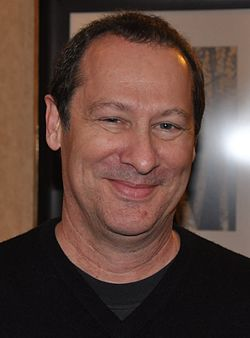

# Cliff Martinez

## Biografía

Cliff Martínez (Bronx, Nueva York; 5 de febrero de 1954) es un compositor de bandas sonoras cinematográficas y músico estadounidense, reconocido por haber sido el baterista de varias bandas famosas de los 70s y 80s, como The Dickies, The Weirdos, Lydia Lunch, la agrupación de Captain Beefheart o Red Hot Chili Peppers, de la cual formó parte entre 1984 y 1986. Crecido en Columbus, Ohio, el primer trabajo de Martínez fue la composición de música para el show de televisión estadounidense <<Pee Wee's Playhouse>>. Por aquel entonces, era el batería de algunos grupos de rock de forma temporal. Paulatinamente, su carrera se fue especializando en la composición de partituras para películas. Su primera banda sonora fue para la película Sexo, mentiras y cintas de vídeo, estrenada en 1989 y dirigida por Steven Soderbergh, quien le llamó posteriormente para muchos de sus trabajos como Traffic o Solaris. Martínez también compuso la banda sonora de las películas El halcón inglés y Narc entre otras.

## Estilo musical

69° Festival de Cine de Cannes ganó Mejor Banda Sonora (Mejor Banda Sonora Original) - Neon Demon 2016

Milan Records lanzará The Knick – Original Television Soundtrack digitalmente el martes 19 de agosto, seguido de un lanzamiento físico en CD el martes 16 de septiembre. El álbum, que también se lanzará en vinilo a finales de este año, incluye música original del compositor Cliff Martinez, miembro del Salón de la Fama del Rock and Roll como miembro de los Red Hot Chili Peppers. "Trabajar en una serie de televisión fue un esfuerzo de 10 semanas para mí. Mucho café... no tanto sueño", dijo Martínez sobre su primera incursión real en la composición de una serie de televisión por episodios. El compositor, que anteriormente compuso la música para un episodio de PEE WEE’S PLAYHOUSE, bromeó sobre su enfoque. “No hay nada como una serie de 10 horas...

## Anécdotas y curiosidades

Cliff Robert Martinez (nacido el 5 de febrero de 1954) es un músico y compositor estadounidense. Al principio de su carrera, Martínez era conocido como baterista, especialmente con los Red Hot Chili Peppers y Captain Beefheart and the Magic Band. [ 1 ] Desde la década de 1990, ha trabajado principalmente como compositor de bandas sonoras para películas, escribiendo música para Spring Breakers (2012), The Foreigner (2017) y múltiples películas de Steven Soderbergh, Sex, Lies, and Videotape (1989), Solaris (2002), Contagion (2011) y Traffic (2000) [ 2 ] y Nicolas Winding Refn, Drive (2011), [ 1 ] Sólo Dios perdona (2013), [ 1 ] El demonio de neón (2016) y la miniserie Demasiado viejo para morir joven (2019).

## Top 10 bandas sonoras

1. ***Drive (Título en España: Drive)***
    * **Póster:** [link](102_cliff_martinez/posters/poster_drive_2011.jpg)
2. ***Contagion (Título en España: Contagio)***
    * **Póster:** [link](102_cliff_martinez/posters/poster_contagion_2011.jpg)
3. ***Game Night (Título en España: Noche de juegos)***
    * **Póster:** [link](102_cliff_martinez/posters/poster_game_night_2018.jpg)
4. ***War Dogs (Título en España: Juego de armas)***
    * **Póster:** [link](102_cliff_martinez/posters/poster_war_dogs_2016.jpg)
5. ***Den of Thieves (Título en España: Juego de ladrones: El atraco perfecto)***
    * **Póster:** [link](102_cliff_martinez/posters/poster_den_of_thieves_2018.jpg)
6. ***The Foreigner (Título en España: El extranjero)***
    * **Póster:** [link](102_cliff_martinez/posters/poster_the_foreigner_2017.jpg)
7. ***The Lincoln Lawyer (Título en España: El inocente)***
    * **Póster:** [link](102_cliff_martinez/posters/poster_the_lincoln_lawyer_2011.jpg)
8. ***The Neon Demon (Título en España: The Neon Demon)***
    * **Póster:** [link](102_cliff_martinez/posters/poster_the_neon_demon_2016.jpg)
9. ***Traffic (Título en España: Traffic)***
    * **Póster:** [link](102_cliff_martinez/posters/poster_traffic_2000.jpg)
10. ***Wicker Park (Título en España: Obsesión)***
    * **Póster:** [link](102_cliff_martinez/posters/poster_wicker_park_2004.jpg)

## Filmografía completa

- Red Hot Chili Peppers: [1986] St. Louis, MO (Título en España: Red Hot Chili Peppers: [1986] St. Louis, MO) (1986) · [Póster](102_cliff_martinez/posters/poster_red_hot_chili_peppers_1986_st_louis_mo_1986.jpg)
- sex, lies, and videotape (Título en España: Sexo, mentiras y cintas de vídeo) (1989) · [Póster](102_cliff_martinez/posters/poster_sex_lies_and_videotape_1989.jpg)
- Pump Up the Volume (Título en España: Rebelión en las ondas) (1990) · [Póster](102_cliff_martinez/posters/poster_pump_up_the_volume_1990.jpg)
- Kafka (Título en España: Kafka, la verdad oculta) (1991) · [Póster](102_cliff_martinez/posters/poster_kafka_1991.jpg)
- Red Hot Chili Peppers - What Hits!? (Título en España: Red Hot Chili Peppers - What Hits!?) (1992) · [Póster](102_cliff_martinez/posters/poster_red_hot_chili_peppers_what_hits_1992.jpg)
- King of the Hill (Título en España: El rey de la colina) (1993) · [Póster](102_cliff_martinez/posters/poster_king_of_the_hill_1993.jpg)
- The Underneath (Título en España: Bajos fondos) (1995) · [Póster](102_cliff_martinez/posters/poster_the_underneath_1995.jpg)
- Gray's Anatomy (Título en España: Gray's Anatomy) (1996) · [Póster](102_cliff_martinez/posters/poster_gray_s_anatomy_1996.jpg)
- Schizopolis (Título en España: Schizopolis) (1997) · [Póster](102_cliff_martinez/posters/poster_schizopolis_1997.jpg)
- Wicked (Título en España: Perversión) (1998) · [Póster](102_cliff_martinez/posters/poster_wicked_1998.jpg)
- The Limey (Título en España: El halcón inglés) (1999) · [Póster](102_cliff_martinez/posters/poster_the_limey_1999.jpg)
- Traffic (Título en España: Traffic) (2000) · [Póster](102_cliff_martinez/posters/poster_traffic_2000.jpg)
- Narc (Título en España: Narc) (2002) · [Póster](102_cliff_martinez/posters/poster_narc_2002.jpg)
- Solaris (Título en España: Solaris) (2002) · [Póster](102_cliff_martinez/posters/poster_solaris_2002.jpg)
- Wonderland (Título en España: Wonderland (Sueños rotos)) (2003) · [Póster](102_cliff_martinez/posters/poster_wonderland_2003.jpg)
- Wicker Park (Título en España: Obsesión) (2004) · [Póster](102_cliff_martinez/posters/poster_wicker_park_2004.jpg)
- Havoc (Título en España: Caos) (2005) · [Póster](102_cliff_martinez/posters/poster_havoc_2005.jpg)
- First Snow (Título en España: First Snow (La primera nevada)) (2006) · [Póster](102_cliff_martinez/posters/poster_first_snow_2006.jpg)
- Stiletto (Título en España: Stiletto) (2008) · [Póster](102_cliff_martinez/posters/poster_stiletto_2008.jpg)
- Vice (Título en España: Vice) (2008) · [Póster](102_cliff_martinez/posters/poster_vice_2008.jpg)
- À l'origine (Título en España: Crónica de una mentira) (2009) · [Póster](102_cliff_martinez/posters/poster_l_origine_2009.jpg)
- Espion(s) (Título en España: Espion(s)) (2009) · [Póster](102_cliff_martinez/posters/poster_espion_s_2009.jpg)
- Contagion (Título en España: Contagio) (2011) · [Póster](102_cliff_martinez/posters/poster_contagion_2011.jpg)
- Drive (Título en España: Drive) (2011) · [Póster](102_cliff_martinez/posters/poster_drive_2011.jpg)
- The Lincoln Lawyer (Título en España: El inocente) (2011) · [Póster](102_cliff_martinez/posters/poster_the_lincoln_lawyer_2011.jpg)
- Arbitrage (Título en España: El fraude) (2012) · [Póster](102_cliff_martinez/posters/poster_arbitrage_2012.jpg)
- The Company You Keep (Título en España: Pacto de silencio) (2012) · [Póster](102_cliff_martinez/posters/poster_the_company_you_keep_2012.jpg)
- Spring Breakers (Título en España: Spring Breakers) (2013) · [Póster](102_cliff_martinez/posters/poster_spring_breakers_2013.jpg)
- Only God Forgives (Título en España: Sólo Dios perdona) (2013) · [Póster](102_cliff_martinez/posters/poster_only_god_forgives_2013.jpg)
- Mea Culpa (Título en España: Mea culpa) (2014) · [Póster](102_cliff_martinez/posters/poster_mea_culpa_2014.jpg)
- The Normal Heart (Título en España: The Normal Heart) (2014) · [Póster](102_cliff_martinez/posters/poster_the_normal_heart_2014.jpg)
- War Dogs (Título en España: Juego de armas) (2016) · [Póster](102_cliff_martinez/posters/poster_war_dogs_2016.jpg)
- The Neon Demon (Título en España: The Neon Demon) (2016) · [Póster](102_cliff_martinez/posters/poster_the_neon_demon_2016.jpg)
- The Foreigner (Título en España: El extranjero) (2017) · [Póster](102_cliff_martinez/posters/poster_the_foreigner_2017.jpg)
- Cliff and Larry: Beginnings (Título en España: Cliff and Larry: Beginnings) (2018) · [Póster](102_cliff_martinez/posters/poster_cliff_and_larry_beginnings_2018.jpg)
- Hotel Artemis (Título en España: Hotel Artemis) (2018) · [Póster](102_cliff_martinez/posters/poster_hotel_artemis_2018.jpg)
- Den of Thieves (Título en España: Juego de ladrones: El atraco perfecto) (2018) · [Póster](102_cliff_martinez/posters/poster_den_of_thieves_2018.jpg)
- Game Night (Título en España: Noche de juegos) (2018) · [Póster](102_cliff_martinez/posters/poster_game_night_2018.jpg)
- Kimi (Título en España: Kimi) (2022) · [Póster](102_cliff_martinez/posters/poster_kimi_2022.jpg)
- Copenhagen Cowboy: I neonlyset med Nicolas Winding Refn (Título en España: Cowboy de Copenhague: Bajo las luces de neón con Nicolas Winding Refn) (2023) · [Póster](102_cliff_martinez/posters/poster_copenhagen_cowboy_i_neonlyset_med_nicolas_winding_refn_2023.jpg)

## Premios y nominaciones

* 2014 – Premio Robert a la mejor música – (Ganador)
* 2017 – Premio Robert a la mejor música – (Ganador)

## Fuentes adicionales

* [MundoBSO](https://www.mundobso.com/compositor/martinez-cliff) — site:mundobso.com
* [MundoBSO (2)](https://www.mundobso.com/bso/cowboy-de-copenhague) — site:mundobso.com
* [MundoBSO (3)](https://w.mundobso.com/bso/cartero-siempre-llama-dos-veces-el) — site:mundobso.com
* [Film Score Monthly](https://www.filmscoremonthly.com/resources/calendar.cfm?calmonth=2) — site:filmscoremonthly.com
* [Film Score Monthly (2)](https://www.filmscoremonthly.com/board/posts.cfm?threadID=82467&forumID=1&archive=0) — site:filmscoremonthly.com
* [Film Score Monthly (3)](https://www.filmscoremonthly.com/board/posts.cfm?pageID=3&forumID=1&threadID=82467&archive=0) — site:filmscoremonthly.com
* [SoundtrackCollector](https://www.soundtrackcollector.com/title/7597/King+Of+The+Hill) — site:soundtrackcollector.com
* [SoundtrackCollector (2)](https://www.soundtrackcollector.com/viewarticle.php?articleid=2674) — site:soundtrackcollector.com
* [SoundtrackCollector (3)](https://www.soundtrackcollector.com/title/10604/Traffic) — site:soundtrackcollector.com
* [WhatSong](https://www.whatsong.org/movie/drive) — site:whatsong.org
* [WhatSong (2)](https://www.whatsong.org/tvshow/mr-robot/episode/48313) — site:whatsong.org
* [WhatSong (3)](https://www.whatsong.org/movie/hypernormalisation) — site:whatsong.org

## Notas externas

* MundoBSO: Nació en Nueva York (EE UU), el 5 de febrero de 1954. Su primer trabajo como compositor fue para el popular show televisivo "Pee Wee's Playhouse", al tiempo que tocaba la batería en varios grupos. Su paso al cine vino de la mano del director Steven Soderbergh, con quien colabora habitualmente. Nació en Nueva York (EE UU), el 5 de febrero de 1954. Su primer trabajo como compositor fue para el popular show televisivo "Pee Wee's Playhouse", al tiempo que tocaba la batería en varios grupos. Su paso al cine vino de la mano del director Steven Soderbergh, con quien colabora habitualmente.
* MundoBSO (2): Compositores: Martinez, Cliff | Kyed, Peter | Winding, Julian | Peter Peter Sello: Netflix Duración: 113 minutos Título original: Copenhagen Cowboy Director: Nicolas Winding Refn Nacionalidad: Dinamarca Año: 2022
* SoundtrackCollector (2): Milan Records lanzará The Knick – Original Television Soundtrack digitalmente el martes 19 de agosto, seguido de un lanzamiento físico en CD el martes 16 de septiembre. El álbum, que también se lanzará en vinilo a finales de este año, incluye música original del compositor Cliff Martinez, miembro del Salón de la Fama del Rock and Roll como miembro de los Red Hot Chili Peppers. "Trabajar en una serie de televisión fue un esfuerzo de 10 semanas para mí. Mucho café... no tanto sueño", dijo Martínez sobre su primera incursión real en la composición de una serie de televisión por episodios. El compositor, que anteriormente compuso la música para un episodio de PEE WEE’S PLAYHOUSE, bromeó sobre su enfoque. “No hay nada como una serie de 10 horas...
* WhatSong: Kavinsky & Lovefoxxx - Drive (banda sonora original de la película) Desire - Drive (banda sonora original de la película)
* WhatSong (2): El jefe de AllSafe hablando con su marido Este no es Brian Eno. Suena más como la banda sonora de Drive: Wrong Floor - Cliff Martinez Maxence Cyrin - It's Kind of a Funny Story (Música de la película)
* WhatSong (3): Barbara Mandrell - 20th Century Masters: The Millennium Collection: Lo mejor de Barbara Mandrell Clint Mansell - Moon (banda sonora de la película)
* soundtrackfest.com: Contenido Artículos Noticias Micronoticias Calendarios Calendario 2019 Calendario 2018 Calendario 2017 Calendarios Calendario 2019 Calendario 2018 Calendario 2017
* www.worldsoundtrackawards.com: Film Music Days Back Film Music Days Programa Conciertos Charlas y Masterclasses WSA Álbumes Ediciones pasadas Premios y Academia Volver Premios y Academia Ganadores y nominados WSAcademy Miembros Hazte miembro Presentaciones
* www.15questions.net: La función de la partitura varía con cada película. En la escala de importancia, a veces me siento como la estrella, a veces como un actor de carácter, a veces me siento como un extra entre la multitud y a veces me siento como si estuviera sentado en el estacionamiento esperando que termine la película. Hay momentos en que el compositor es como un médico y la película es el paciente, no le digas a ningún director que dije eso. Busco los puntos débiles de la película…. tal vez la música pueda hacer que algunas de las actuaciones sean más convincentes. Quizás las cosas van demasiado lentas y la música puede ayudar a acelerar el ritmo. Hay muchos problemas que notas cuando ves una película durante el proceso de edición que se pueden mejorar con música....
* cliff-martinez.com: Touch of Crude 2022 Kimi 2022 Vaquero de Copenhague 2022 The Wilds 2020 Demasiado viejo para morir joven 2019 Hotel Artemis 2018 Noche de juegos 2018 La leyenda de la mano roja 2018 Den of Thieves 2018 El extranjero 2017 Perros de guerra 2016 El demonio de neón 2016 El Knick 2014-2015 Far Cry 4 2014 Mi vida Dirigida por Nicolas Winding Refn 2014 Ménage à trois: 60 jours sur Mea Culpa 2014 El corazón normal 2014 Mea culpa 2014 Sólo Dios perdona 2013 Golem 2013 La compañía que mantienes 2012 Spring Breakers 2012 Arbitraje 2012 Contagio 2011 Drive 2011 El abogado de Lincoln 2011 À l'Origine 2009 Severe Clear 2009 Spy(s) 2009 Vice 2008 Stiletto 2008 First Snow 2006 Havoc 2005 Wicker Park 2004 Wonderland 2003 Narc: Shooting Up 2003...
* www.nts.live: Lo sentimos, no pudimos encontrar ningún episodio. Inténtelo de nuevo más tarde... Admite NTS para marcas de tiempo en canales en vivo y el archivo
* www.allocine.fr: Ej.: Filmografía de Robert De Niro, Filmografía de Brad Pitt Marsupilami de Philippe Lacheau con Philippe Lacheau, Jamel Debbouze Película - Tráiler de comedia
