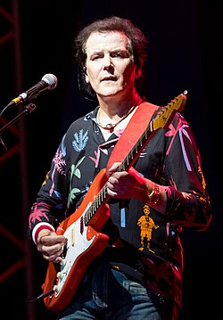

# Trevor Rabin

## Biografía

Trevor Charles Rabin (Johannesburgo, Gauteng; 13 de enero, de 1954) es un músico sudafricano conocido por haber sido guitarrista y compositor del grupo de rock progresivo británico Yes desde 1983 hasta 1995, y desde entonces, como compositor de bandas sonoras.

## Estilo musical

TREVOR RABIN: Y de hecho tienes razón; es una completa contradicción, porque ambas son ciertas, pero por diferentes razones y de diferentes maneras. Al escribir la música, simplemente me siento aquí y es un lugar solitario. Todo lo que escucho en mi cabeza se viene abajo. Nunca me detengo diciendo "Oh, eso no va con su estilo si estás en una banda" o "No sé si eso va con eso", y créeme, me encanta estar en una banda. Me encanta ese espíritu colaborativo, aunque algunos sugerirían que no me involucre en el espíritu colaborativo, pero no es cierto. Mike, una de las razones por las que quería dedicarme al cine es que crecí con la orquestación y la dirección y durante catorce años sentí que, aparte de una pequeña muestra cuando hicimos "Love Will Find A Way", donde escribí una pequeña pieza de cuerda, creo que era un octeto o algo así. Aparte de eso, no había hecho nada, no realmente para orquesta, y realmente quería volver a hacerlo... No recuerdo si fue Elmer Bernstein o uno de esos tipos dijo... incluso podría haber sido un agente, quien dijo que la única plataforma sensata para un compositor clásico serio y moderno es la composición cinematográfica. Desde el punto de vista de un agente, es sensato en el sentido de que puedes ganarte la vida realmente bien si lo haces con éxito, mientras que si escribes con éxito para ti mismo como compositor clásico, ¿adónde vas a ir? ¿Recibirás una beca de una universidad para escribir una pieza musical o lo que sea, tal vez te encargarán algunas cosas o enseñarás en una universidad? Y eso es genial, y gracias a Dios por esa gente, pero alguien tiene que hacer cine (risas), y lo encuentro un lugar muy emocionante. Una cita divertida, Alex [Scott, ex manager de Yes] me dijo el otro día: "Dijiste que tienes estas canciones. ¿Por qué no las terminas y haces un álbum, escribes algunas canciones?" Y dije: "Tendrás que darme algunas imágenes. Ya no puedo escribir sin imágenes". Entonces, si fuera a escribir un álbum, necesitaría una película para escribir. Quiero decir, es una broma, pero llega a un punto y, en ese sentido, ciertamente no eres un dictador. Es mucho más colaborativo en ese sentido, y la decisión de si la música es correcta o no, creo que fue Alan Silvestre, que es un compañero compositor y lo ha hecho muy bien y es muy bueno, y dijo que el problema con la música para películas es que el mejor compositor tiene que trabajar con el peor director, y eso puede ser cierto. Puedes trabajar con alguien que realmente no sabe de qué está hablando y, sí, puedes ser asertivo. Pero al final del día, él puede tomar tu música y ponerla allí, o ponerla allí, y afortunadamente para mí hasta ahora, en las veintitantos películas que he hecho, cada pieza musical se ha mantenido intacta y ha permanecido donde estaba destinada. Lo siento por James Horner, que hizo "Titanic", que escribió en la foto y James Cameron ni siquiera consideró dónde estaba puesta. Él lo tomaba y lo ponía donde quisiera, y esa es una manera de hacerlo, pero yo estaría en el infierno si hiciera eso, pero he tenido mucha suerte trabajando con algunos tipos geniales: Jerry Bruckheimer es una persona increíblemente inteligente, claramente en lo que respecta a los negocios, pero también creativamente; es un tipo muy inteligente. A veces tiene mala reputación porque cada película recauda 150 millones de dólares, muy rara vez se pierde una, y es un poco solitario en la cima, hace películas para las masas, pero ellas saben que no son menos válidas para un compositor. Creo que mi tema para "Armageddon" es uno de los mejores momentos temáticos que he tenido en una película. Al mismo tiempo, creo que "Whispers", que pasó directamente al disco, también fue uno de los mejores momentos; pero ciertamente creo que, en general, he escrito mi mejor música con películas, definitivamente no en una banda o como solista. Ha sido con el cine y no sé qué es. No sé si es porque una parte de tu cerebro, si está preocupada por el trabajo que tienes entre manos, tiene todas estas cosas de las que encargarte, por lo que el lado tuyo que crea la música es más inconsciente y menos consciente de lo que estás haciendo, porque en el momento en que empiezo a pensar en escribir, es difícil. Si es como quitar el polvo de la habitación y así es como me acerco a la escritura, es cuando surgen las mejores cosas.

## Anécdotas y curiosidades

2 Alternancia de carrera Subsección de carrera 2.1 1972–1978: Rabbitt y proyectos en solitario 2.2 1978–1982: Londres y Los Ángeles 2.3 1982–1995: Yes and Can't Look Away 2.4 1995–2012: Compositor de cine 2.5 2012–presente: regreso al trabajo en solitario y en banda

## Top 10 bandas sonoras

1. ***Armageddon (Título en España: Armageddon)***
    * **Póster:** [link](105_trevor_rabin/posters/poster_armageddon_1998.jpg)
2. ***Bad Boys II (Título en España: Dos policías rebeldes II)***
    * **Póster:** [link](105_trevor_rabin/posters/poster_bad_boys_ii_2003.jpg)
3. ***National Treasure (Título en España: La búsqueda (National Treasure))***
    * **Póster:** [link](105_trevor_rabin/posters/poster_national_treasure_2004.jpg)
4. ***Con Air (Título en España: Con Air (Convictos en el aire))***
    * **Póster:** [link](105_trevor_rabin/posters/poster_con_air_1997.jpg)
5. ***Enemy of the State (Título en España: Enemigo público)***
    * **Póster:** [link](105_trevor_rabin/posters/poster_enemy_of_the_state_1998.jpg)
6. ***Deep Blue Sea (Título en España: Deep Blue Sea)***
    * **Póster:** [link](105_trevor_rabin/posters/poster_deep_blue_sea_1999.jpg)
7. ***Coach Carter (Título en España: Coach Carter)***
    * **Póster:** [link](105_trevor_rabin/posters/poster_coach_carter_2005.jpg)
8. ***Gone in Sixty Seconds (Título en España: 60 Segundos)***
    * **Póster:** [link](105_trevor_rabin/posters/poster_gone_in_sixty_seconds_2000.jpg)
9. ***National Treasure: Book of Secrets (Título en España: La búsqueda 2: El diario secreto)***
    * **Póster:** [link](105_trevor_rabin/posters/poster_national_treasure_book_of_secrets_2007.jpg)
10. ***The Sorcerer's Apprentice (Título en España: El aprendiz de brujo)***
    * **Póster:** [link](105_trevor_rabin/posters/poster_the_sorcerer_s_apprentice_2010.jpg)

## Filmografía completa

- Death of a Snowman (Título en España: Death of a Snowman) (1976) · [Póster](105_trevor_rabin/posters/poster_death_of_a_snowman_1976.jpg)
- Access All Areas (Título en España: Access All Areas) (1985) · [Póster](105_trevor_rabin/posters/poster_access_all_areas_1985.jpg)
- Yes - 90125 Live (Título en España: Yes - 90125 Live) (1985) · [Póster](105_trevor_rabin/posters/poster_yes_90125_live_1985.jpg)
- Yes - Union Tour Denver (Título en España: Yes - Union Tour Denver) (1991) · [Póster](105_trevor_rabin/posters/poster_yes_union_tour_denver_1991.jpg)
- YesYears (Título en España: YesYears) (1991) · [Póster](105_trevor_rabin/posters/poster_yesyears_1991.jpg)
- Yes - Talk tour Live (Título en España: Yes - Talk tour Live) (1994) · [Póster](105_trevor_rabin/posters/poster_yes_talk_tour_live_1994.jpg)
- The Glimmer Man (Título en España: Glimmer man) (1996) · [Póster](105_trevor_rabin/posters/poster_the_glimmer_man_1996.jpg)
- Con Air (Título en España: Con Air (Convictos en el aire)) (1997) · [Póster](105_trevor_rabin/posters/poster_con_air_1997.jpg)
- Armageddon (Título en España: Armageddon) (1998) · [Póster](105_trevor_rabin/posters/poster_armageddon_1998.jpg)
- Homegrown (Título en España: Cosecha propia) (1998) · [Póster](105_trevor_rabin/posters/poster_homegrown_1998.jpg)
- Enemy of the State (Título en España: Enemigo público) (1998) · [Póster](105_trevor_rabin/posters/poster_enemy_of_the_state_1998.jpg)
- Jack Frost (Título en España: Jack Frost) (1998) · [Póster](105_trevor_rabin/posters/poster_jack_frost_1998.jpg)
- Deep Blue Sea (Título en España: Deep Blue Sea) (1999) · [Póster](105_trevor_rabin/posters/poster_deep_blue_sea_1999.jpg)
- Gone in Sixty Seconds (Título en España: 60 Segundos) (2000) · [Póster](105_trevor_rabin/posters/poster_gone_in_sixty_seconds_2000.jpg)
- Whispers: An Elephant's Tale (Título en España: Aventura elefantástica) (2000) · [Póster](105_trevor_rabin/posters/poster_whispers_an_elephant_s_tale_2000.jpg)
- The 6th Day (Título en España: El sexto día) (2000) · [Póster](105_trevor_rabin/posters/poster_the_6th_day_2000.jpg)
- Remember the Titans (Título en España: Titanes, hicieron historia) (2000) · [Póster](105_trevor_rabin/posters/poster_remember_the_titans_2000.jpg)
- The One (Título en España: El único) (2001) · [Póster](105_trevor_rabin/posters/poster_the_one_2001.jpg)
- American Outlaws (Título en España: Forajidos) (2001) · [Póster](105_trevor_rabin/posters/poster_american_outlaws_2001.jpg)
- Rock Star (Título en España: Rock Star) (2001) · [Póster](105_trevor_rabin/posters/poster_rock_star_2001.jpg)
- Texas Rangers (Título en España: Texas Rangers) (2001) · [Póster](105_trevor_rabin/posters/poster_texas_rangers_2001.jpg)
- Bad Company (Título en España: 9 días) (2002) · [Póster](105_trevor_rabin/posters/poster_bad_company_2002.jpg)
- The Banger Sisters (Título en España: Amigas a la fuerza) (2002) · [Póster](105_trevor_rabin/posters/poster_the_banger_sisters_2002.jpg)
- Kangaroo Jack (Título en España: Canguro Jack: Trinca y brinca) (2003) · [Póster](105_trevor_rabin/posters/poster_kangaroo_jack_2003.jpg)
- Bad Boys II (Título en España: Dos policías rebeldes II) (2003) · [Póster](105_trevor_rabin/posters/poster_bad_boys_ii_2003.jpg)
- Exorcist: The Beginning (Título en España: El exorcista: El comienzo) (2004) · [Póster](105_trevor_rabin/posters/poster_exorcist_the_beginning_2004.jpg)
- National Treasure (Título en España: La búsqueda (National Treasure)) (2004) · [Póster](105_trevor_rabin/posters/poster_national_treasure_2004.jpg)
- Torque (Título en España: Torque: Rodando al límite) (2004) · [Póster](105_trevor_rabin/posters/poster_torque_2004.jpg)
- Coach Carter (Título en España: Coach Carter) (2005) · [Póster](105_trevor_rabin/posters/poster_coach_carter_2005.jpg)
- Dominion: Prequel to The Exorcist (Título en España: El exorcista: El comienzo. La versión prohibida) (2005) · [Póster](105_trevor_rabin/posters/poster_dominion_prequel_to_the_exorcist_2005.jpg)
- The Great Raid (Título en España: El gran rescate) (2005) · [Póster](105_trevor_rabin/posters/poster_the_great_raid_2005.jpg)
- Yes: Greatest Video Hits (Título en España: Yes: Greatest Video Hits) (2005) · [Póster](105_trevor_rabin/posters/poster_yes_greatest_video_hits_2005.jpg)
- Glory Road (Título en España: Camino a la gloria) (2006) · [Póster](105_trevor_rabin/posters/poster_glory_road_2006.jpg)
- Flyboys (Título en España: Flyboys: Héroes del aire) (2006) · [Póster](105_trevor_rabin/posters/poster_flyboys_2006.jpg)
- Gridiron Gang (Título en España: La vida en juego) (2006) · [Póster](105_trevor_rabin/posters/poster_gridiron_gang_2006.jpg)
- Snakes on a Plane (Título en España: Serpientes en el Avión) (2006) · [Póster](105_trevor_rabin/posters/poster_snakes_on_a_plane_2006.jpg)
- The Guardian (Título en España: The Guardian) (2006) · [Póster](105_trevor_rabin/posters/poster_the_guardian_2006.jpg)
- Hot Rod (Título en España: Flipado sobre ruedas) (2007) · [Póster](105_trevor_rabin/posters/poster_hot_rod_2007.jpg)
- National Treasure: Book of Secrets (Título en España: La búsqueda 2: El diario secreto) (2007) · [Póster](105_trevor_rabin/posters/poster_national_treasure_book_of_secrets_2007.jpg)
- Get Smart (Título en España: Superagente 86 de película) (2008) · [Póster](105_trevor_rabin/posters/poster_get_smart_2008.jpg)
- 12 Rounds (Título en España: 12 trampas) (2009) · [Póster](105_trevor_rabin/posters/poster_12_rounds_2009.jpg)
- G-Force (Título en España: G-Force: Licencia para espiar) (2009) · [Póster](105_trevor_rabin/posters/poster_g_force_2009.jpg)
- Race to Witch Mountain (Título en España: La montaña embrujada) (2009) · [Póster](105_trevor_rabin/posters/poster_race_to_witch_mountain_2009.jpg)
- The Sorcerer's Apprentice (Título en España: El aprendiz de brujo) (2010) · [Póster](105_trevor_rabin/posters/poster_the_sorcerer_s_apprentice_2010.jpg)
- 5 Days of War (Título en España: 5 días de guerra) (2011) · [Póster](105_trevor_rabin/posters/poster_5_days_of_war_2011.jpg)
- I Am Number Four (Título en España: Soy el número cuatro) (2011) · [Póster](105_trevor_rabin/posters/poster_i_am_number_four_2011.jpg)
- Yes - Union Live (Título en España: Yes - Union Live) (2011) · [Póster](105_trevor_rabin/posters/poster_yes_union_live_2011.jpg)
- Grudge Match (Título en España: La gran revancha) (2013) · [Póster](105_trevor_rabin/posters/poster_grudge_match_2013.jpg)
- Max (Título en España: Max) (2015) · [Póster](105_trevor_rabin/posters/poster_max_2015.jpg)
- Score: A Film Music Documentary (Título en España: Score: Compositores de Oscar) (2017) · [Póster](105_trevor_rabin/posters/poster_score_a_film_music_documentary_2017.jpg)
- Yes - Live at the Apollo (Título en España: Yes - Live at the Apollo) (2018) · [Póster](105_trevor_rabin/posters/poster_yes_live_at_the_apollo_2018.jpg)
- The Misfits (Título en España: Ladrones de Élite) (2021) · [Póster](105_trevor_rabin/posters/poster_the_misfits_2021.jpg)

## Premios y nominaciones

* abuela – (Nominación)

## Fuentes adicionales

* [MundoBSO](https://www.mundobso.com/bso/geminis) — site:mundobso.com
* [MundoBSO (2)](https://www.mundobso.com/bso/capitan-america-civil-war) — site:mundobso.com
* [MundoBSO (3)](https://w.mundobso.com/bso/cartero-siempre-llama-dos-veces-el) — site:mundobso.com
* [Film Score Monthly](https://www.filmscoremonthly.com/board/posts.cfm?threadID=14853&forumID=1&archive=1) — site:filmscoremonthly.com
* [Film Score Monthly (2)](https://www.filmscoremonthly.com/board/posts.cfm?archive=1&forumID=1&threadID=20727) — site:filmscoremonthly.com
* [Film Score Monthly (3)](https://www.filmscoremonthly.com/board/posts.cfm?archive=1&forumID=1&threadID=8839) — site:filmscoremonthly.com
* [SoundtrackCollector](https://www.soundtrackcollector.com/title/10321/Gone+In+Sixty+Seconds) — site:soundtrackcollector.com
* [SoundtrackCollector (2)](https://www.soundtrackcollector.com/title/9406/Armageddon) — site:soundtrackcollector.com
* [SoundtrackCollector (3)](https://www.soundtrackcollector.com/title/37164/Rock+Star) — site:soundtrackcollector.com
* [WhatSong](https://www.whatsong.org/movie/armageddon) — site:whatsong.org
* [WhatSong (2)](https://www.whatsong.org/movie/gone-in-sixty-seconds) — site:whatsong.org
* [WhatSong (3)](https://www.whatsong.org/tvshow/the-mick/season-2) — site:whatsong.org

## Notas externas

* MundoBSO: Compositor: Balfe, Lorne Sello: La-La Land Duración: 62 minutos Información de la película Título original: Gemini Man Director: Ang Lee Nacionalidad: EE UU Año: 2019 Argumento Un asesino a sueldo decide retirarse, pero tendrá que enfrentarse a un clon suyo mucho más joven. Compositor: Balfe, Lorne Sello: La-La Land Duración: 62 minutos
* MundoBSO (2): Compositor: Jackman, Henry Sello: Hollywood Duración: 69 minutos Información de la película Título original: Captain America: Civil War Director: Anthony Russo, Joe Russo Nacionalidad: EE UU Año: 2016 Argumento Continuación de Captain America: The Winter Soldier (14). Cuando otro incidente internacional involucra a Los Vengadores y causan varios daños colaterales, aumentan las presiones políticas para exigir más responsabilidades y determinar cuándo deben contratar los servicios del grupo de superhéroes. Esta nueva situación dividirá a Los Vengadores, mientras intentan proteger al mundo de un nuevo y terrible villano. Compositor: Jackman, Henry Sello: Hollywood Duración: 69 minutos
* SoundtrackCollector: Gone In 60 Seconds (2000, Estados Unidos, ortografía alternativa)
* SoundtrackCollector (3): ¿Entonces quieres ser una estrella de rock? (2000, Estados Unidos, título provisional) Untitled Stephen Herek Project (2000, Estados Unidos, título provisional)
* WhatSong: Harry Stamper jode a un barco lleno de ecologistas jugando golf desde su plataforma hasta su barco.... El mensajero en bicicleta está conduciendo por el puente de Brooklyn hacia Nueva York, junto con su perro, el pequeño Richard. van a llegar a la cima... ¡¡¡A LO GRANDE!!!
* WhatSong (2): Moby - Gone in 60 Seconds (Banda sonora original de la película) Method Man & Redman - Gone in 60 Seconds (Banda sonora original de la película)
* WhatSong (3): La mejor fuente en línea de música de películas y televisión. Copyright © 2018 - 2026 Whatsong.org. Reservados todos los derechos.
* guitar-muse.com: Lecciones Principiantes Acordes y arpegios Composición Ejercicio y práctica Recursos Escalas rítmicas Técnica Teoría Consejos DIY En mayo de 2012, tuve el honor de entrevistar al ex guitarrista de Yes, venerable compositor de cine, cantante y compositor Trevor Rabin, para hablar sobre su nuevo álbum solista instrumental (y su primer álbum de estudio solista en 23 años), el aclamado por la crítica, “Jacaranda”.
* allmanbrothersband.com: Programas Base de datos de programas en vivo Informes de programas Lista de canciones y búsqueda de comentarios Hoy en la historia Mercancía Mercancía oficial de ABB - Tienda del museo Big House Tienda Gregg Allman Grabaciones en vivo oficiales de ABB - Munck Music
* music.apple.com: Tema de Armageddon Armageddon - The Albumâ·â1998 The Guardian Suite (versión partitura) The Guardian (banda sonora original)â·â2006
* theprogressiveaspect.net: Principal El equipo de TPA Revisores invitados y ex revisores destacados Los especiales de Prog Mill Nuestro planeta progresivo Reflexiones vertiginosas
* music.apple.com: Tema de Armageddon Armageddon - The Albumâ·â1998 The Guardian Suite (versión partitura) The Guardian (banda sonora original)â·â2006
