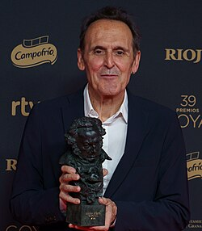

# Alberto Iglesias

## Biografía

Alberto Iglesias Fernández-Berridi (San Sebastián, 21 de octubre de 1955) es un compositor español.​ Es hermano de la escultora Cristina Iglesias (1956).

## Estilo musical

Otro pilar de las películas de Almodóvar es el compositor Alberto Iglesias, cuya asociación con el director se remonta a los años noventa. La música de Iglesias es tan flexible e inventiva como el trabajo de cámara de Almodóvar es táctil y delicioso, arrancando sensualmente nuestras simpatías y nuestros nervios con conjuntos de cuerdas tensas y alusiones de buen gusto a la tradición musical española.

## Anécdotas y curiosidades

San Sebastián, España. [ 5 ] La hermana mayor es un arte arterial absoluto. [ 6 ] Iglesias. [ 6 ] [ 7 ]

Nació en San Sebastián (España), el 21 de octubre de 1955. En el cine se inició en cortometrajes, hasta que a principios de los ochenta ya empezó a trabajar en largometrajes. Su vinculación a la filmografía de Julio Médem y sus creaciones para Pedro Almodóvar le han reportado un gran prestigio. Nació en San Sebastián (España), el 21 de octubre de 1955. En el cine se inició en cortometrajes, hasta que a principios de los ochenta ya empezó a trabajar en largometrajes. Su vinculación a la filmografía de Julio Médem y sus creaciones para Pedro Almodóvar le han reportado un gran prestigio.

## Top 10 bandas sonoras

1. ***Tinker Tailor Soldier Spy (Título en España: El topo)***
    * **Póster:** [link](107_alberto_iglesias/posters/poster_tinker_tailor_soldier_spy_2011.jpg)
2. ***The Constant Gardener (Título en España: El jardinero fiel)***
    * **Póster:** [link](107_alberto_iglesias/posters/poster_the_constant_gardener_2005.jpg)
3. ***Volver (Título en España: Volver)***
    * **Póster:** [link](107_alberto_iglesias/posters/poster_volver_2006.jpg)
4. ***The Kite Runner (Título en España: Cometas en el cielo)***
    * **Póster:** [link](107_alberto_iglesias/posters/poster_the_kite_runner_2007.jpg)
5. ***Maixabel (Título en España: Maixabel)***
    * **Póster:** [link](107_alberto_iglesias/posters/poster_maixabel_2021.jpg)
6. ***Exodus: Gods and Kings (Título en España: Exodus: Dioses y reyes)***
    * **Póster:** [link](107_alberto_iglesias/posters/poster_exodus_gods_and_kings_2014.jpg)

## Filmografía completa

- La muerte de Mikel (Título en España: La muerte de Mikel) (1984) · [Póster](107_alberto_iglesias/posters/poster_la_muerte_de_mikel_1984.jpg)
- Martín (Título en España: Martín) (1988) · [Póster](107_alberto_iglesias/posters/poster_mart_n_1988.jpg)
- Vacas (Título en España: Vacas) (1992) · [Póster](107_alberto_iglesias/posters/poster_vacas_1992.jpg)
- La ardilla roja (Título en España: La ardilla roja) (1993) · [Póster](107_alberto_iglesias/posters/poster_la_ardilla_roja_1993.jpg)
- La flor de mi secreto (Título en España: La flor de mi secreto) (1995) · [Póster](107_alberto_iglesias/posters/poster_la_flor_de_mi_secreto_1995.jpg)
- Carne trémula (Título en España: Carne trémula) (1997) · [Póster](107_alberto_iglesias/posters/poster_carne_tr_mula_1997.jpg)
- La femme de chambre du Titanic (Título en España: La camarera del Titanic) (1997) · [Póster](107_alberto_iglesias/posters/poster_la_femme_de_chambre_du_titanic_1997.jpg)
- Los amantes del Círculo Polar (Título en España: Los amantes del Círculo Polar) (1998) · [Póster](107_alberto_iglesias/posters/poster_los_amantes_del_c_rculo_polar_1998.jpg)
- Todo sobre mi madre (Título en España: Todo sobre mi madre) (1999) · [Póster](107_alberto_iglesias/posters/poster_todo_sobre_mi_madre_1999.jpg)
- Lucía y el sexo (Título en España: Lucía y el sexo) (2001) · [Póster](107_alberto_iglesias/posters/poster_luc_a_y_el_sexo_2001.jpg)
- Hable con ella (Título en España: Hable con ella) (2002) · [Póster](107_alberto_iglesias/posters/poster_hable_con_ella_2002.jpg)
- The Dancer Upstairs (Título en España: Pasos de baile) (2002) · [Póster](107_alberto_iglesias/posters/poster_the_dancer_upstairs_2002.jpg)
- Comandante (Título en España: Comandante) (2003) · [Póster](107_alberto_iglesias/posters/poster_comandante_2003.jpg)
- Te doy mis ojos (Título en España: Te doy mis ojos) (2003) · [Póster](107_alberto_iglesias/posters/poster_te_doy_mis_ojos_2003.jpg)
- La mala educación (Título en España: La mala educación) (2004) · [Póster](107_alberto_iglesias/posters/poster_la_mala_educaci_n_2004.jpg)
- The Constant Gardener (Título en España: El jardinero fiel) (2005) · [Póster](107_alberto_iglesias/posters/poster_the_constant_gardener_2005.jpg)
- Volver (Título en España: Volver) (2006) · [Póster](107_alberto_iglesias/posters/poster_volver_2006.jpg)
- The Kite Runner (Título en España: Cometas en el cielo) (2007) · [Póster](107_alberto_iglesias/posters/poster_the_kite_runner_2007.jpg)
- Deconstructing Almodóvar (Título en España: Deconstructing Almodóvar) (2007) · [Póster](107_alberto_iglesias/posters/poster_deconstructing_almod_var_2007.jpg)
- Viva Pedro: The Life & Times of Pedro Almodóvar (Título en España: Viva Pedro: The Life & Times of Pedro Almodóvar) (2007) · [Póster](107_alberto_iglesias/posters/poster_viva_pedro_the_life_times_of_pedro_almod_var_2007.jpg)
- Che: Part One (Título en España: Che: El argentino (Parte 1)) (2008) · [Póster](107_alberto_iglesias/posters/poster_che_part_one_2008.jpg)
- Che: Part Two (Título en España: Che: Guerrilla (Parte 2)) (2008) · [Póster](107_alberto_iglesias/posters/poster_che_part_two_2008.jpg)
- Los abrazos rotos (Título en España: Los abrazos rotos) (2009) · [Póster](107_alberto_iglesias/posters/poster_los_abrazos_rotos_2009.jpg)
- Le Moine (Título en España: El monje) (2011) · [Póster](107_alberto_iglesias/posters/poster_le_moine_2011.jpg)
- Tinker Tailor Soldier Spy (Título en España: El topo) (2011) · [Póster](107_alberto_iglesias/posters/poster_tinker_tailor_soldier_spy_2011.jpg)
- La piel que habito (Título en España: La piel que habito) (2011) · [Póster](107_alberto_iglesias/posters/poster_la_piel_que_habito_2011.jpg)
- También la lluvia (Título en España: También la lluvia) (2011) · [Póster](107_alberto_iglesias/posters/poster_tambi_n_la_lluvia_2011.jpg)
- Los amantes pasajeros (Título en España: Los amantes pasajeros) (2013) · [Póster](107_alberto_iglesias/posters/poster_los_amantes_pasajeros_2013.jpg)
- Exodus: Gods and Kings (Título en España: Exodus: Dioses y reyes) (2014) · [Póster](107_alberto_iglesias/posters/poster_exodus_gods_and_kings_2014.jpg)
- The Two Faces of January (Título en España: Las dos caras de enero) (2014) · [Póster](107_alberto_iglesias/posters/poster_the_two_faces_of_january_2014.jpg)
- Keepers of the Covenant: Making 'Exodus: Gods and Kings' (Título en España: Keepers of the Covenant: Making 'Exodus: Gods and Kings') (2015) · [Póster](107_alberto_iglesias/posters/poster_keepers_of_the_covenant_making_exodus_gods_and_kings_2015.jpg)
- ma ma (Título en España: ma ma) (2015) · [Póster](107_alberto_iglesias/posters/poster_ma_ma_2015.jpg)
- Julieta (Título en España: Julieta) (2016) · [Póster](107_alberto_iglesias/posters/poster_julieta_2016.jpg)
- La cordillera (Título en España: La cordillera) (2017) · [Póster](107_alberto_iglesias/posters/poster_la_cordillera_2017.jpg)
- Yuli (Título en España: Yuli) (2018) · [Póster](107_alberto_iglesias/posters/poster_yuli_2018.jpg)
- Dolor y gloria (Título en España: Dolor y gloria) (2019) · [Póster](107_alberto_iglesias/posters/poster_dolor_y_gloria_2019.jpg)
- The Human Voice (Título en España: La voz humana) (2020) · [Póster](107_alberto_iglesias/posters/poster_the_human_voice_2020.jpg)
- Madres paralelas (Título en España: Madres paralelas) (2021) · [Póster](107_alberto_iglesias/posters/poster_madres_paralelas_2021.jpg)
- Maixabel (Título en España: Maixabel) (2021) · [Póster](107_alberto_iglesias/posters/poster_maixabel_2021.jpg)
- O Night Divine (Título en España: O Night Divine) (2021) · [Póster](107_alberto_iglesias/posters/poster_o_night_divine_2021.jpg)
- Extraña forma de vida (Título en España: Extraña forma de vida) (2023) · [Póster](107_alberto_iglesias/posters/poster_extra_a_forma_de_vida_2023.jpg)
- La habitación de al lado (Título en España: La habitación de al lado) (2024) · [Póster](107_alberto_iglesias/posters/poster_la_habitaci_n_de_al_lado_2024.jpg)
- Amarga Navidad (Título en España: Amarga Navidad) (2026) · [Póster](107_alberto_iglesias/posters/poster_amarga_navidad_2026.jpg)

## Premios y nominaciones

* 2004 – Premio de Cine Europeo al Mejor Compositor – por *Bad Education (Título en España: La estafa (Bad Education))* – (Nominación)
* 2004 – Premio de Cine Europeo al Mejor Compositor – por *Can't Take My Eyes Off You (Título en España: Can't Take My Eyes Off You)* – (Nominación)
* 2006 – Premio de Cine Europeo al Mejor Compositor – por *Volver (Título en España: Volver)* – (Ganador)
* 2006 – Premio de Cine Europeo al Mejor Compositor – por *Volver (Título en España: Volver)* – (Nominación)
* 2006 – Premio de la Academia a la mejor banda sonora original – por *The Constant Gardener (Título en España: El jardinero fiel)* – (Nominación)
* 2008 – Premio de la Academia a la mejor banda sonora original – por *The Kite Runner (Título en España: Cometas en el cielo)* – (Nominación)
* 2009 – Premio de Cine Europeo al Mejor Compositor – por *Los abrazos rotos (Título en España: Los abrazos rotos)* – (Ganador)
* 2009 – Premio de Cine Europeo al Mejor Compositor – por *Los abrazos rotos (Título en España: Los abrazos rotos)* – (Nominación)
* 2011 – Premio de Cine Europeo al Mejor Compositor – por *The Making of The Skin I Live In (Título en España: The Making of The Skin I Live In)* – (Nominación)
* 2012 – Premio de Cine Europeo al Mejor Compositor – por *Tinker Tailor Soldier Spy (Título en España: El topo)* – (Ganador)
* 2012 – Premio de Cine Europeo al Mejor Compositor – por *Tinker Tailor Soldier Spy (Título en España: El topo)* – (Nominación)
* 2012 – Premio de la Academia a la mejor banda sonora original – por *Tinker Tailor Soldier Spy (Título en España: El topo)* – (Nominación)
* 2021 – Q110916569 – por *Maixabel (Título en España: Maixabel)* – (Nominación)
* 2021 – Q110916569 – por *Making Parallel Mothers (Título en España: Making Parallel Mothers)* – (Nominación)
* 2022 – Premio Feroz a la Mejor Banda Sonora Original – por *Maixabel (Título en España: Maixabel)* – (Nominación)
* 2022 – Premio Feroz a la Mejor Banda Sonora Original – por *Making Parallel Mothers (Título en España: Making Parallel Mothers)* – (Ganador)
* 2022 – Premio Goya a la Mejor Música Original – por *Maixabel (Título en España: Maixabel)* – (Nominación)
* 2022 – Premio de la Academia a la mejor banda sonora original – por *Making Parallel Mothers (Título en España: Making Parallel Mothers)* – (Nominación)
* Medalla de Oro al Mérito en las Bellas Artes – (Ganador)

## Fuentes adicionales

* [MundoBSO](https://www.mundobso.com/compositor/iglesias-alberto) — site:mundobso.com
* [MundoBSO (2)](https://www.mundobso.com/bso/pedro-almodovar-alberto-iglesias-film-music-collection) — site:mundobso.com
* [MundoBSO (3)](https://www.mundobso.com/bso/topo-el-alberto-iglesias) — site:mundobso.com
* [Film Score Monthly](https://www.filmscoremonthly.com/board/posts.cfm?threadID=117081) — site:filmscoremonthly.com
* [Film Score Monthly (2)](https://www.filmscoremonthly.com/daily/article.cfm?articleID=3581) — site:filmscoremonthly.com
* [Film Score Monthly (3)](https://www.filmscoremonthly.com/board/posts.cfm?threadID=151780&archive=0) — site:filmscoremonthly.com
* [SoundtrackCollector](https://www.soundtrackcollector.com/catalog/composerdiscography.php?composerid=1545) — site:soundtrackcollector.com
* [SoundtrackCollector (2)](https://www.soundtrackcollector.com/title/116805/Pedro+Almod%C3%B3var+&+Alberto+Iglesias+-+Film+Music+Collection) — site:soundtrackcollector.com
* [SoundtrackCollector (3)](https://www.soundtrackcollector.com/allnews.php) — site:soundtrackcollector.com
* [WhatSong](https://www.whatsong.org/tvshow/how-i-met-your-mother/episode/44483) — site:whatsong.org
* [WhatSong (2)](https://www.whatsong.org/tvshow/9-1-1/episode/71629) — site:whatsong.org
* [WhatSong (3)](https://www.whatsong.org/tvshow/grown-ish/episode/82123) — site:whatsong.org

## Notas externas

* MundoBSO: Nació en San Sebastián (España), el 21 de octubre de 1955. En el cine se inició en cortometrajes, hasta que a principios de los ochenta ya empezó a trabajar en largometrajes. Su vinculación a la filmografía de Julio Médem y sus creaciones para Pedro Almodóvar le han reportado un gran prestigio. Nació en San Sebastián (España), el 21 de octubre de 1955. En el cine se inició en cortometrajes, hasta que a principios de los ochenta ya empezó a trabajar en largometrajes. Su vinculación a la filmografía de Julio Médem y sus creaciones para Pedro Almodóvar le han reportado un gran prestigio.
* MundoBSO (2): Compositor: Iglesias, Alberto Sello: Quartet Records Duración: 605 minutos Información de la película Título original: Pedro Almodóvar & Alberto Iglesias: Film Music Collection Director: Pedro Almodóvar Nacionalidad: España Año: 2019 Compositor: Iglesias, Alberto Sello: Quartet Records Duración: 605 minutos
* MundoBSO (3): Compositor: Iglesias, Alberto Sello: Silva Screen Duración: 60 minutos Información de la película Título original: Tinker, Tailor, Soldier, Spy Director: Tomas Alfredson Nacionalidad: Reino Unido Año: 2011 Argumento Adaptación de la novela de John Le Carré sobre un agente británico a quien se le encarga la misión de descubrir un topo infiltrado entre las altas instancias del Servicio. Premios MundoBSO: 1 nominación Oscar: 1 nominación Bafta: 1 nominación World Soundtrack: 1 premio Compositor: Iglesias, Alberto Sello: Silva Screen Duración: 60 minutos
* WhatSong: Lily y Robin bailan con los dos nerds del último año de secundaria. Se reproduce de fondo cuando Lilly, Robin y Barney intentan entrar a la fiesta. La canción es una canción que está incluida en iMovie.
* WhatSong (2): Talking Heads - Favoritos populares 1976-1992: Sand In the Vaseline The Naked and Famous - Passive Me, Aggressive You (Remixes y caras B)
* WhatSong (3): Luca está pensando en él y en el encuentro sexual de Zoey de la noche anterior. Luca está estresado por su "yo". Texto a Zoey y su falta de respuesta.
* elpais.com: La música de Alberto Iglesias (San Sebastián, 1955) está llena de imágenes, aunque no sean necesariamente de las películas para las que fueron ideadas, sino otras nuevas que surgen cuando se escuchan sus composiciones lejos de la pantalla. Esas nuevas sincronías fluyen en Archipiélago, extensa compilación en cinco discos en la que el compositor (ganador de diez goyas, candidato tres veces al Oscar y a los Bafta y premio Nacional de Cine en 2007, entre otras distinciones) reúne algunas de sus partituras fundamentales. Asegura que no se trata de reivindicar su trabajo fuera de la pantalla –considera sus piezas órganos “funcionales” al servicio del cine–, pero que al ser también “música pura”...
* elpais.com: A sus 68 años, este compositor de éxito internacional, uno de los grandes en música para el cine, con 11 premios Goya y cuatro candidaturas al Oscar, se embarca en su primera ópera La familia Iglesias es un caso para estudiar en San Sebastián. De cuatro hermanos, todos han salido artistas. Dos escritores, Eduardo y Lourdes; una escultora de referencia, Cristina, y un músico, Alberto, con un carrerón internacional a sus 67 años. Al principio trataron de disuadirle, pero se empeñó y acabó cuajando una trayectoria, sobre todo dentro del cine, que supuso un antes y un después para los españoles en el ámbito internacional. Iglesias ha logrado 11 premios Goya y ha sido candidato cuatro veces a...
* music.apple.com: La habitación de al lado (banda sonora original de la película) La casa de espera La habitación de al lado (banda sonora original de la película)â·â2024
* mubi.com: Desde la década de 1980, Alberto Iglesias ha creado música hermosa y emocionante para la pantalla, trabajando ampliamente en su España natal y Hollywood y con una gama versátil de directores y géneros, respaldados por sus icónicas colaboraciones con Pedro Almodóvar. Las suites cinematográficas de Iglesias están decoradas con un delicioso jazz y una emotiva poesía orquestal. Equilibra maravillosamente la tensión del melodrama teatral con viajes a la memoria y la vitalidad de la vida del centro de la ciudad, con su glamour sofisticado y sus vientres libertinos. Esta mezcla proporciona una buena dosis de colaboraciones de Iglesias con Almodóvar, desde sus primeros años con películas como La flor de mi secreto (1995) y Carne viva (1997) hasta...
* filmsymphony.es: Otros proyectos FSO FSO Big Band FSO Film in Concert Total Soundtrack Los Bridgerton en Concierto Galería FSO en Imágenes FSO en Vídeos FSO en Prensa escrita FSO en Televisión
* www.adorocinema.com: Ej.: películas de Emma Stone, películas de Johnny Depp, películas de Brad Pitt ¡Ayuda! de Sam Raimi con Rachel McAdams, Dylan O'Brien Película - Tráiler de terror
