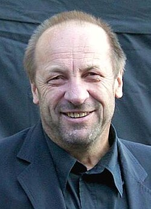

# Zbigniew Preisner

## Biografía

Zbigniew Preisner (20 de mayo de 1955, Bielsko-Biała, Polonia) es un compositor polaco. Su trabajo abarca tanto composiciones orquestales como bandas sonoras, siendo muy reconocido en esta última faceta. Ha trabajado con cineastas como Krzysztof Kieślowski, Louis Malle, Agnieszka Holland, Thomas Vinterberg y Fernando Trueba, entre otros. Sus bandas sonoras han sido reconocidas con premios como el César a la mejor música original y el LAFCA Award.​

## Estilo musical

Zbigniew Preisner nació en Bielsko-Biała, en el sur de Polonia, y estudió historia y filosofía en la Universidad Jagellónica de Cracovia. Como nunca había recibido lecciones formales de música, aprendió música por sí mismo escuchando y transcribiendo partes de discos. Su estilo compositivo representa una forma distintivamente escasa de neorromanticismo tonal. Paganini y Jean Sibelius son influencias reconocidas. [ 3 ]

## Anécdotas y curiosidades

Zbigniew Preisner (polaco: [ˈZbiɡɲɛf ˈprajsnɛr]; nacido el 20 de mayo de 1955 como Zbigniew Antoni Kowalski) [1] es un compositor de música cinematográfica polaco, mejor conocido por su trabajo con el director de cine Krzysztof Kieślowski. Recibió la Medalla de Oro al Mérito de la Cultura – Gloria Artis y la Cruz de Caballero de la Orden de Polonia Restituta. Es miembro de la Academia de Cine Francesa. [ 2 ]

## Top 10 bandas sonoras

1. ***The Island on Bird Street (Título en España: La isla de Bird Street)***
    * **Póster:** [link](108_zbigniew_preisner/posters/poster_the_island_on_bird_street_1997.jpg)
2. ***Damage (Título en España: Herida)***
    * **Póster:** [link](108_zbigniew_preisner/posters/poster_damage_1992.jpg)
3. ***Trois couleurs : Bleu (Título en España: Tres colores: Azul)***
    * **Póster:** [link](108_zbigniew_preisner/posters/poster_trois_couleurs_bleu_1993.jpg)
4. ***Trois couleurs : Rouge (Título en España: Tres colores: Rojo)***
    * **Póster:** [link](108_zbigniew_preisner/posters/poster_trois_couleurs_rouge_1994.jpg)
5. ***Trois couleurs : Blanc (Título en España: Tres colores: Blanco)***
    * **Póster:** [link](108_zbigniew_preisner/posters/poster_trois_couleurs_blanc_1994.jpg)
6. ***The Secret Garden (Título en España: El jardín secreto)***
    * **Póster:** [link](108_zbigniew_preisner/posters/poster_the_secret_garden_1993.jpg)
7. ***Europa Europa (Título en España: Europa, Europa)***
    * **Póster:** [link](108_zbigniew_preisner/posters/poster_europa_europa_1990.jpg)
8. ***La Double Vie de Véronique (Título en España: La doble vida de Verónica)***
    * **Póster:** [link](108_zbigniew_preisner/posters/poster_la_double_vie_de_v_ronique_1991.jpg)
9. ***Dekalog, siedem (Título en España: Decálogo 7)***
    * **Póster:** [link](108_zbigniew_preisner/posters/poster_dekalog_siedem_1989.jpg)
10. ***Dekalog, cztery (Título en España: Decálogo 4)***
    * **Póster:** [link](108_zbigniew_preisner/posters/poster_dekalog_cztery_1989.jpg)

## Filmografía completa

- Bez końca (Título en España: Sin fin) (1985) · [Póster](108_zbigniew_preisner/posters/poster_bez_ko_ca_1985.jpg)
- Lubię nietoperze (Título en España: Lubię nietoperze) (1986) · [Póster](108_zbigniew_preisner/posters/poster_lubi_nietoperze_1986.jpg)
- Kocham kino (Título en España: Kocham kino) (1988) · [Póster](108_zbigniew_preisner/posters/poster_kocham_kino_1988.jpg)
- Krótki film o miłości (Título en España: No amarás) (1988) · [Póster](108_zbigniew_preisner/posters/poster_kr_tki_film_o_mi_o_ci_1988.jpg)
- Krótki film o zabijaniu (Título en España: No matarás) (1988) · [Póster](108_zbigniew_preisner/posters/poster_kr_tki_film_o_zabijaniu_1988.jpg)
- Dekalog, dziesięć (Título en España: Decálogo 10) (1989) · [Póster](108_zbigniew_preisner/posters/poster_dekalog_dziesi_1989.jpg)
- Dekalog, dwa (Título en España: Decálogo 2) (1989) · [Póster](108_zbigniew_preisner/posters/poster_dekalog_dwa_1989.jpg)
- Dekalog, trzy (Título en España: Decálogo 3) (1989) · [Póster](108_zbigniew_preisner/posters/poster_dekalog_trzy_1989.jpg)
- Dekalog, cztery (Título en España: Decálogo 4) (1989) · [Póster](108_zbigniew_preisner/posters/poster_dekalog_cztery_1989.jpg)
- Dekalog, pięć (Título en España: Decálogo 5) (1989) · [Póster](108_zbigniew_preisner/posters/poster_dekalog_pi_1989.jpg)
- Dekalog, sześć (Título en España: Decálogo 6) (1989) · [Póster](108_zbigniew_preisner/posters/poster_dekalog_sze_1989.jpg)
- Dekalog, siedem (Título en España: Decálogo 7) (1989) · [Póster](108_zbigniew_preisner/posters/poster_dekalog_siedem_1989.jpg)
- Dekalog, osiem (Título en España: Decálogo 8) (1989) · [Póster](108_zbigniew_preisner/posters/poster_dekalog_osiem_1989.jpg)
- Dekalog, dziewięć (Título en España: Decálogo 9) (1989) · [Póster](108_zbigniew_preisner/posters/poster_dekalog_dziewi_1989.jpg)
- Europa Europa (Título en España: Europa, Europa) (1990) · [Póster](108_zbigniew_preisner/posters/poster_europa_europa_1990.jpg)
- At Play in the Fields of the Lord (Título en España: Jugando en los campos del Señor) (1991) · [Póster](108_zbigniew_preisner/posters/poster_at_play_in_the_fields_of_the_lord_1991.jpg)
- La Double Vie de Véronique (Título en España: La doble vida de Verónica) (1991) · [Póster](108_zbigniew_preisner/posters/poster_la_double_vie_de_v_ronique_1991.jpg)
- Damage (Título en España: Herida) (1992) · [Póster](108_zbigniew_preisner/posters/poster_damage_1992.jpg)
- The Secret Garden (Título en España: El jardín secreto) (1993) · [Póster](108_zbigniew_preisner/posters/poster_the_secret_garden_1993.jpg)
- Trois couleurs : Bleu (Título en España: Tres colores: Azul) (1993) · [Póster](108_zbigniew_preisner/posters/poster_trois_couleurs_bleu_1993.jpg)
- When a Man Loves a Woman (Título en España: Cuando un hombre ama a una mujer) (1994) · [Póster](108_zbigniew_preisner/posters/poster_when_a_man_loves_a_woman_1994.jpg)
- Mouvements du désir (Título en España: Mouvements du désir) (1994) · [Póster](108_zbigniew_preisner/posters/poster_mouvements_du_d_sir_1994.jpg)
- Trois couleurs : Blanc (Título en España: Tres colores: Blanco) (1994) · [Póster](108_zbigniew_preisner/posters/poster_trois_couleurs_blanc_1994.jpg)
- Trois couleurs : Rouge (Título en España: Tres colores: Rojo) (1994) · [Póster](108_zbigniew_preisner/posters/poster_trois_couleurs_rouge_1994.jpg)
- Elisa (Título en España: Elisa) (1995) · [Póster](108_zbigniew_preisner/posters/poster_elisa_1995.jpg)
- Feast of July (Título en España: Feast of July) (1995) · [Póster](108_zbigniew_preisner/posters/poster_feast_of_july_1995.jpg)
- The Island on Bird Street (Título en España: La isla de Bird Street) (1997) · [Póster](108_zbigniew_preisner/posters/poster_the_island_on_bird_street_1997.jpg)
- FairyTale: A True Story (Título en España: Un cuento de hadas) (1997) · [Póster](108_zbigniew_preisner/posters/poster_fairytale_a_true_story_1997.jpg)
- Corazón iluminado (Título en España: Corazón iluminado) (1998) · [Póster](108_zbigniew_preisner/posters/poster_coraz_n_iluminado_1998.jpg)
- Dreaming of Joseph Lees (Título en España: El sueño de Joseph Lees) (1999) · [Póster](108_zbigniew_preisner/posters/poster_dreaming_of_joseph_lees_1999.jpg)
- Aberdeen (Título en España: Aberdeen) (2000) · [Póster](108_zbigniew_preisner/posters/poster_aberdeen_2000.jpg)
- The Last September (Título en España: The Last September) (2000) · [Póster](108_zbigniew_preisner/posters/poster_the_last_september_2000.jpg)
- Between Strangers (Título en España: Entre extraños) (2002) · [Póster](108_zbigniew_preisner/posters/poster_between_strangers_2002.jpg)
- Effroyables Jardins (Título en España: Effroyables Jardins) (2003) · [Póster](108_zbigniew_preisner/posters/poster_effroyables_jardins_2003.jpg)
- It's All About Love (Título en España: Todo es por amor) (2003) · [Póster](108_zbigniew_preisner/posters/poster_it_s_all_about_love_2003.jpg)
- The Beautiful Country (Título en España: Un lugar maravilloso) (2004) · [Póster](108_zbigniew_preisner/posters/poster_the_beautiful_country_2004.jpg)
- Still Alive: Film o Krzysztofie Kieślowskim (Título en España: Still Alive: Film o Krzysztofie Kieślowskim) (2005) · [Póster](108_zbigniew_preisner/posters/poster_still_alive_film_o_krzysztofie_kie_lowskim_2005.jpg)
- Anonyma - Eine Frau in Berlin (Título en España: Anonyma - Una mujer en Berlín) (2008) · [Póster](108_zbigniew_preisner/posters/poster_anonyma_eine_frau_in_berlin_2008.jpg)
- Aglaja (Título en España: Aglaja) (2012) · [Póster](108_zbigniew_preisner/posters/poster_aglaja_2012.jpg)
- A História da Eternidade (Título en España: A História da Eternidade) (2014) · [Póster](108_zbigniew_preisner/posters/poster_a_hist_ria_da_eternidade_2014.jpg)
- David Gilmour - Live in Wroclaw 2016 (Título en España: David Gilmour - Live in Wroclaw 2016) (2016) · [Póster](108_zbigniew_preisner/posters/poster_david_gilmour_live_in_wroclaw_2016_2016.jpg)
- La reina de España (Título en España: La reina de España) (2016) · [Póster](108_zbigniew_preisner/posters/poster_la_reina_de_espa_a_2016.jpg)
- Meu Amigo Hindu (Título en España: Mi Amigo Hindú) (2016) · [Póster](108_zbigniew_preisner/posters/poster_meu_amigo_hindu_2016.jpg)
- Angelica (Título en España: Angelica) (2017) · [Póster](108_zbigniew_preisner/posters/poster_angelica_2017.jpg)
- David Gilmour - Live At Pompeii (Bonus Wroclaw 2016) (Título en España: David Gilmour - Live At Pompeii (Bonus Wroclaw 2016)) (2017) · [Póster](108_zbigniew_preisner/posters/poster_david_gilmour_live_at_pompeii_bonus_wroclaw_2016_2017.jpg)
- Lies We Tell (Título en España: La verdad puede matar) (2018) · [Póster](108_zbigniew_preisner/posters/poster_lies_we_tell_2018.jpg)
- El olvido que seremos (Título en España: El olvido que seremos) (2020) · [Póster](108_zbigniew_preisner/posters/poster_el_olvido_que_seremos_2020.jpg)
- Man of God (Título en España: Man of God) (2021) · [Póster](108_zbigniew_preisner/posters/poster_man_of_god_2021.jpg)
- Europa Centrale (Título en España: Europa Centrale) (2024) · [Póster](108_zbigniew_preisner/posters/poster_europa_centrale_2024.jpg)
- Haunted Heart (Título en España: Isla perdida (Haunted Heart)) (2024) · [Póster](108_zbigniew_preisner/posters/poster_haunted_heart_2024.jpg)

## Premios y nominaciones

* 1995 – Premio César a la mejor música escrita para una película – por *Trois couleurs : Rouge (Título en España: Tres colores: Rojo)* – (Ganador)
* 1996 – Premio César a la mejor música escrita para una película – por *Elisa (Título en España: Elisa)* – (Ganador)
* 2012 – Oficial de la Orden de Polonia Restituta – (Ganador)
* Federico – (Ganador)
* Medalla de Oro al Mérito de la Cultura – (Ganador)
* Oso de Plata por un logro excepcional – por *The Island on Bird Street (Título en España: La isla de Bird Street)* – (Ganador)

## Fuentes adicionales

* [MundoBSO](https://w.mundobso.com/bso/cartero-siempre-llama-dos-veces-el) — site:mundobso.com
* [MundoBSO (2)](https://www.mundobso.com/bso/milla-verde-la) — site:mundobso.com
* [MundoBSO (3)](https://www.mundobso.com/bso/frozen-el-reino-del-hielo) — site:mundobso.com
* [Film Score Monthly](https://www.filmscoremonthly.com/daily/index.cfm) — site:filmscoremonthly.com
* [Film Score Monthly (2)](https://www.filmscoremonthly.com/daily/articles.cfm?bauthor=169) — site:filmscoremonthly.com
* [Film Score Monthly (3)](https://www.filmscoremonthly.com/daily/article.cfm/articleID/8281/Film-Score-Friday-11124/) — site:filmscoremonthly.com
* [SoundtrackCollector](https://www.soundtrackcollector.com/title/92708/Preisner's+Voices) — site:soundtrackcollector.com
* [SoundtrackCollector (2)](https://www.soundtrackcollector.com/title/6895/At+Play+In+The+Fields+Of+The+Lord) — site:soundtrackcollector.com
* [SoundtrackCollector (3)](https://www.soundtrackcollector.com/title/5877/Trzy+Kolory:+Bialy) — site:soundtrackcollector.com
* [WhatSong](https://www.whatsong.org/tvshow/how-i-met-your-mother/episode/44483) — site:whatsong.org
* [WhatSong (2)](https://www.whatsong.org/tvshow/smallville/episode/39263) — site:whatsong.org
* [WhatSong (3)](https://www.whatsong.org/tvshow/vikings/episode/41727) — site:whatsong.org

## Notas externas

* MundoBSO (2): Compositor: Newman, Thomas Sello: Warner Duración: 66 minutos Información de la película Título original: The Green Mile Director: Frank Darabont Nacionalidad: EE UU Año: 1999 Argumento A mediados de los años treinta, un guarda de prisiones que custodia a los condenados a muerte descubre poderes sobrenaturales en un inmenso hombre negro, acusado de haber asesinado a dos niñas. Eso le llevará a creer en su inocencia. Premios Saturn: 1 nominación Compositor: Newman, Thomas Sello: Warner Duración: 66 minutos
* MundoBSO (3): Compositores: Beck, Christophe | Lopez, Robert Sello: Disney Duración: 98 minutos Título original: Frozen Director: Chris Buck, Jennifer Lee Nacionalidad: EE UU Año: 2013
* SoundtrackCollector (3): Tres colores: blanco (1994, Polonia, título original ISO-LATIN-2)
* WhatSong: Lily y Robin bailan con los dos nerds del último año de secundaria. Se reproduce de fondo cuando Lilly, Robin y Barney intentan entrar a la fiesta. La canción es una canción que está incluida en iMovie.
* WhatSong (2): Actuó mientras Pete mastica chicle de kriptonita y luego salva a Kara. OneRepublic - Soñando en voz alta (edición ampliada)
* WhatSong (3): Trevor Morris, Einar Selvik, Steve Tavaglione y Brian Kilgore - Los vikingos II (banda sonora original de la película) Trevor Morris - Los vikingos II (banda sonora original de la película)
* www.rockdelux.com: Si quisiéramos jugar al clickbait, podríamos decir que en cierta ocasión Zbigniew Preisner fue marido de Penélope Cruz. Sigue leyendo esta entrevista y descubrirás qué une a este compositor polaco con España, con Lisa Gerrard o con David Gilmour. El autor de las bandas sonoras de la trilogía de Krzysztof Kieślowski y de “El olvido que seremos”, la última película de Fernando Trueba, es uno de los grandes nombres de la música para cine de los últimos cuarenta años. El polaco Zbigniew Preisner (Bielsko-Biala, 1955) es un compositor extraordinariamente prolífico. Se dio a conocer mundialmente al mismo tiempo que su compatriota Krzysztof Kieślowski, para cuyas películas “La doble vida de...
* mtosmt.org: Para autores Política editorial de MTO Pautas de estilo de MTO Cómo enviar un artículo Enviar artículo Pautas para reseñas de libros en línea Disertaciones Todas las disertaciones Nuevas disertaciones Enumere su disertación
* preisner.com: Caldera Records acaba de lanzar a nivel mundial un CD con la música de Preisner para la película The Island en... Zbigniew Preisner presentará cinco conciertos llamados "Zbigniew Preisner i Przyjaciele....
* preisner.com: Zbigniew Preisner (n. 1955) es el principal compositor de música cinematográfica de Polonia y está considerado uno de los compositores cinematográficos más destacados de su generación. Durante muchos años, Preisner disfrutó de una estrecha colaboración con el director Krzysztof Kieslowski y su guionista Krzysztof Piesiewicz. Sus bandas sonoras para las películas de Kieslowski No end, Dekalog, The Double Life Of Veronique, Three Colors Blue, Three Colors White y Three Colors Red le han valido el reconocimiento internacional. Preisner ha compuesto la música para numerosos largometrajes, entre ellos At Play In The Fields Of The Lord de Hector Babenco, Foolish heart, My Hindu Friend, Damage de Louis Malle, When A Man Loves A Woman de Luis Mandoki, Europa de Agnieszka Holland...
* wisemusiccreative.com: Zbigniew Preisner (n. 1955) es el principal compositor de música cinematográfica de Polonia y está considerado uno de los compositores cinematográficos más destacados de su generación. Durante muchos años, Preisner disfrutó de una estrecha colaboración con el director Krzysztof Kieslowski y su guionista Krzysztof Piesiewicz. Sus bandas sonoras para las películas de Kieslowski No end, Dekalog, The Double Life Of Veronique, Three Colors Blue, Three Colors White y Three Colors Red le han valido el reconocimiento internacional. Preisner ha compuesto la música para numerosos largometrajes, entre ellos At Play In The Fields Of The Lord de Hector Babenco, Foolish heart, My Hindu Friend, Damage de Louis Malle, When A Man Loves A Woman de Luis Mandoki, Europa de Agnieszka Holland...
* music.apple.com: Tercera película Sinfonía musical La isla de Bird Street Julie (Vislumbres de entierro) Trois Couleurs: Bleu, Blanc, Rouge (Banda sonora original de la trilogía Tres colores de KieÅlowski)â·â1993
