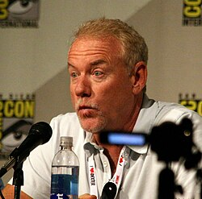

# John Debney

## Biografía

John Cardon Debney (Glendale, California; 18 de agosto de 1956) es un compositor y director de orquesta estadounidense, nominado al Óscar por la banda sonora de La Pasión de Cristo y autor también de la banda sonora de La isla de las cabezas cortadas, que obtuvo fantásticas críticas. Debney suele combinar su formación clásica con su gran conocimiento de los sonidos contemporáneos para adaptarse a cualquier tipo de composición.

## Estilo musical

John Cardon Debney (nacido el 18 de agosto de 1956) es un compositor y director de orquesta estadounidense de bandas sonoras de cine, televisión y videojuegos. [ 1 ] Su trabajo abarca una variedad de medios y géneros como comedia, terror, ciencia ficción, suspenso, fantasía y acción y aventuras. Es colaborador de Disney desde hace mucho tiempo y ha escrito música para sus películas, series de televisión y parques temáticos. También ha colaborado con directores de cine como Brian Robbins, Jon Favreau, Garry Marshall, Tom Shadyac, Peter Hyams, John A. Davis, Brad Anderson, Howard Deutch, Mark Dindal, Robert Rodriguez y Paul Tibbitt.

## Anécdotas y curiosidades

John Cardon Debney (nacido el 18 de agosto de 1956) es un compositor y director de orquesta estadounidense de bandas sonoras de cine, televisión y videojuegos. [ 1 ] Su trabajo abarca una variedad de medios y géneros como comedia, terror, ciencia ficción, suspenso, fantasía y acción y aventuras. Es colaborador de Disney desde hace mucho tiempo y ha escrito música para sus películas, series de televisión y parques temáticos. También ha colaborado con directores de cine como Brian Robbins, Jon Favreau, Garry Marshall, Tom Shadyac, Peter Hyams, John A. Davis, Brad Anderson, Howard Deutch, Mark Dindal, Robert Rodriguez y Paul Tibbitt.

## Top 10 bandas sonoras

1. ***The Passion of the Christ (Título en España: La pasión de Cristo)***
    * **Póster:** [link](110_john_debney/posters/poster_the_passion_of_the_christ_2004.jpg)
2. ***The SpongeBob Movie: Search for SquarePants (Título en España: Bob Esponja: Una aventura pirata)***
    * **Póster:** [link](110_john_debney/posters/poster_the_spongebob_movie_search_for_squarepants_2025.jpg)
3. ***Iron Man 2 (Título en España: Iron Man 2)***
    * **Póster:** [link](110_john_debney/posters/poster_iron_man_2_2010.jpg)
4. ***The Greatest Showman (Título en España: El gran showman)***
    * **Póster:** [link](110_john_debney/posters/poster_the_greatest_showman_2017.jpg)
5. ***Bruce Almighty (Título en España: Como Dios)***
    * **Póster:** [link](110_john_debney/posters/poster_bruce_almighty_2003.jpg)
6. ***Hocus Pocus (Título en España: El retorno de las brujas)***
    * **Póster:** [link](110_john_debney/posters/poster_hocus_pocus_1993.jpg)
7. ***The Emperor's New Groove (Título en España: El emperador y sus locuras)***
    * **Póster:** [link](110_john_debney/posters/poster_the_emperor_s_new_groove_2000.jpg)
8. ***Luck (Título en España: Luck)***
    * **Póster:** [link](110_john_debney/posters/poster_luck_2022.jpg)
9. ***Liar Liar (Título en España: Mentiroso compulsivo)***
    * **Póster:** [link](110_john_debney/posters/poster_liar_liar_1997.jpg)
10. ***The Jungle Book (Título en España: El libro de la selva)***
    * **Póster:** [link](110_john_debney/posters/poster_the_jungle_book_2016.jpg)

## Filmografía completa

- The Strongest Man in the World (Título en España: El hombre más fuerte del mundo) (1975) · [Póster](110_john_debney/posters/poster_the_strongest_man_in_the_world_1975.jpg)
- Donald Duck's 50th Birthday (Título en España: Donald Duck's 50th Birthday) (1984) · [Póster](110_john_debney/posters/poster_donald_duck_s_50th_birthday_1984.jpg)
- Fitness and Me: Why Exercise? (Título en España: Fitness and Me: Why Exercise?) (1984) · [Póster](110_john_debney/posters/poster_fitness_and_me_why_exercise_1984.jpg)
- The Further Adventures of Tennessee Buck (Título en España: Las aventuras de Tennessee Buck) (1988) · [Póster](110_john_debney/posters/poster_the_further_adventures_of_tennessee_buck_1988.jpg)
- Jetsons: The Movie (Título en España: Los supersónicos: La película) (1990) · [Póster](110_john_debney/posters/poster_jetsons_the_movie_1990.jpg)
- Into the Badlands (Título en España: Into the Badlands) (1991) · [Póster](110_john_debney/posters/poster_into_the_badlands_1991.jpg)
- Still Not Quite Human (Título en España: Still Not Quite Human) (1992) · [Póster](110_john_debney/posters/poster_still_not_quite_human_1992.jpg)
- Hocus Pocus (Título en España: El retorno de las brujas) (1993) · [Póster](110_john_debney/posters/poster_hocus_pocus_1993.jpg)
- Gunmen (Título en España: Gunmen) (1993) · [Póster](110_john_debney/posters/poster_gunmen_1993.jpg)
- Jonny's Golden Quest (Título en España: Jonny's Golden Quest) (1993) · [Póster](110_john_debney/posters/poster_jonny_s_golden_quest_1993.jpg)
- I Yabba-Dabba Do! (Título en España: La boda de Pebbles) (1993) · [Póster](110_john_debney/posters/poster_i_yabba_dabba_do_1993.jpg)
- The Flintstones: Hollyrock a Bye Baby (Título en España: Los Picapiedra en Hollyroca por un bebé) (1993) · [Póster](110_john_debney/posters/poster_the_flintstones_hollyrock_a_bye_baby_1993.jpg)
- The Halloween Tree (Título en España: The Halloween Tree) (1993) · [Póster](110_john_debney/posters/poster_the_halloween_tree_1993.jpg)
- The Town Santa Forgot (Título en España: The Town Santa Forgot) (1993) · [Póster](110_john_debney/posters/poster_the_town_santa_forgot_1993.jpg)
- Little Giants (Título en España: Pequeños Gigantes) (1994) · [Póster](110_john_debney/posters/poster_little_giants_1994.jpg)
- White Fang 2: Myth of the White Wolf (Título en España: Vuelve colmillo blanco) (1994) · [Póster](110_john_debney/posters/poster_white_fang_2_myth_of_the_white_wolf_1994.jpg)
- Houseguest (Título en España: El invitado) (1995) · [Póster](110_john_debney/posters/poster_houseguest_1995.jpg)
- In Pursuit of Honor (Título en España: En busca del honor) (1995) · [Póster](110_john_debney/posters/poster_in_pursuit_of_honor_1995.jpg)
- Cutthroat Island (Título en España: La isla de las cabezas cortadas) (1995) · [Póster](110_john_debney/posters/poster_cutthroat_island_1995.jpg)
- Sudden Death (Título en España: Muerte súbita) (1995) · [Póster](110_john_debney/posters/poster_sudden_death_1995.jpg)
- Carpool (Título en España: Carpool, todos al coche) (1996) · [Póster](110_john_debney/posters/poster_carpool_1996.jpg)
- Doctor Who (Título en España: Doctor Who: La película) (1996) · [Póster](110_john_debney/posters/poster_doctor_who_1996.jpg)
- Getting Away with Murder (Título en España: Un asesino muy ético) (1996) · [Póster](110_john_debney/posters/poster_getting_away_with_murder_1996.jpg)
- Justice League of America (Título en España: Justice League of America) (1997) · [Póster](110_john_debney/posters/poster_justice_league_of_america_1997.jpg)
- Liar Liar (Título en España: Mentiroso compulsivo) (1997) · [Póster](110_john_debney/posters/poster_liar_liar_1997.jpg)
- I Know What You Did Last Summer (Título en España: Sé lo que hicisteis el último verano) (1997) · [Póster](110_john_debney/posters/poster_i_know_what_you_did_last_summer_1997.jpg)
- The Relic (Título en España: The Relic) (1997) · [Póster](110_john_debney/posters/poster_the_relic_1997.jpg)
- Paulie (Título en España: Paulie, el loro bocazas) (1998) · [Póster](110_john_debney/posters/poster_paulie_1998.jpg)
- I'll Be Home for Christmas (Título en España: Vuelve a casa por Navidad, si puedes...) (1998) · [Póster](110_john_debney/posters/poster_i_ll_be_home_for_christmas_1998.jpg)
- Lost & Found (Título en España: Algo que perder) (1999) · [Póster](110_john_debney/posters/poster_lost_found_1999.jpg)
- Dick (Título en España: Aventuras en la Casa Blanca) (1999) · [Póster](110_john_debney/posters/poster_dick_1999.jpg)
- End of Days (Título en España: El fin de los días) (1999) · [Póster](110_john_debney/posters/poster_end_of_days_1999.jpg)
- The Adventures of Elmo in Grouchland (Título en España: Elmo en el país de los Gruñones) (1999) · [Póster](110_john_debney/posters/poster_the_adventures_of_elmo_in_grouchland_1999.jpg)
- G-Saviour (Título en España: G-Saviour) (1999) · [Póster](110_john_debney/posters/poster_g_saviour_1999.jpg)
- Goodnight Moon & Other Sleepytime Tales (Título en España: Goodnight Moon & Other Sleepytime Tales) (1999) · [Póster](110_john_debney/posters/poster_goodnight_moon_other_sleepytime_tales_1999.jpg)
- Inspector Gadget (Título en España: Inspector Gadget) (1999) · [Póster](110_john_debney/posters/poster_inspector_gadget_1999.jpg)
- Komodo (Título en España: Komodo) (1999) · [Póster](110_john_debney/posters/poster_komodo_1999.jpg)
- My Favorite Martian (Título en España: Mi marciano favorito) (1999) · [Póster](110_john_debney/posters/poster_my_favorite_martian_1999.jpg)
- The Emperor's New Groove (Título en España: El emperador y sus locuras) (2000) · [Póster](110_john_debney/posters/poster_the_emperor_s_new_groove_2000.jpg)
- The Replacements (Título en España: Equipo a la fuerza) (2000) · [Póster](110_john_debney/posters/poster_the_replacements_2000.jpg)
- Relative Values (Título en España: Gente con clase) (2000) · [Póster](110_john_debney/posters/poster_relative_values_2000.jpg)
- Cats & Dogs (Título en España: Como perros y gatos) (2001) · [Póster](110_john_debney/posters/poster_cats_dogs_2001.jpg)
- Jimmy Neutron: Boy Genius (Título en España: Jimmy Neutron: El niño inventor) (2001) · [Póster](110_john_debney/posters/poster_jimmy_neutron_boy_genius_2001.jpg)
- Heartbreakers (Título en España: Las seductoras) (2001) · [Póster](110_john_debney/posters/poster_heartbreakers_2001.jpg)
- The Princess Diaries (Título en España: Princesa por sorpresa) (2001) · [Póster](110_john_debney/posters/poster_the_princess_diaries_2001.jpg)
- See Spot Run (Título en España: Spot) (2001) · [Póster](110_john_debney/posters/poster_see_spot_run_2001.jpg)
- Spy Kids (Título en España: Spy Kids) (2001) · [Póster](110_john_debney/posters/poster_spy_kids_2001.jpg)
- Snow Dogs (Título en España: Aventuras en Alaska) (2002) · [Póster](110_john_debney/posters/poster_snow_dogs_2002.jpg)
- Dragonfly (Título en España: Dragonfly (La sombra de la libélula)) (2002) · [Póster](110_john_debney/posters/poster_dragonfly_2002.jpg)
- The Tuxedo (Título en España: El esmoquin) (2002) · [Póster](110_john_debney/posters/poster_the_tuxedo_2002.jpg)
- The Scorpion King (Título en España: El rey escorpión) (2002) · [Póster](110_john_debney/posters/poster_the_scorpion_king_2002.jpg)
- Swimfan (Título en España: Fanática) (2002) · [Póster](110_john_debney/posters/poster_swimfan_2002.jpg)
- Spy Kids 2: The Island of Lost Dreams (Título en España: Spy Kids 2: La isla de los sueños perdidos) (2002) · [Póster](110_john_debney/posters/poster_spy_kids_2_the_island_of_lost_dreams_2002.jpg)
- The Sweatbox (Título en España: The Sweatbox) (2002) · [Póster](110_john_debney/posters/poster_the_sweatbox_2002.jpg)
- The Hot Chick (Título en España: ¡Este cuerpo no es el mío!) (2002) · [Póster](110_john_debney/posters/poster_the_hot_chick_2002.jpg)
- Bruce Almighty (Título en España: Como Dios) (2003) · [Póster](110_john_debney/posters/poster_bruce_almighty_2003.jpg)
- Malibu's Most Wanted (Título en España: El más buscado en Malibú) (2003) · [Póster](110_john_debney/posters/poster_malibu_s_most_wanted_2003.jpg)
- Elf (Título en España: Elf) (2003) · [Póster](110_john_debney/posters/poster_elf_2003.jpg)
- Welcome to Mooseport (Título en España: Bienvenido a Mooseport) (2004) · [Póster](110_john_debney/posters/poster_welcome_to_mooseport_2004.jpg)
- The Passion of the Christ (Título en España: La pasión de Cristo) (2004) · [Póster](110_john_debney/posters/poster_the_passion_of_the_christ_2004.jpg)
- Raising Helen (Título en España: Mamá a la fuerza) (2004) · [Póster](110_john_debney/posters/poster_raising_helen_2004.jpg)
- The Whole Ten Yards (Título en España: Más falsas apariencias) (2004) · [Póster](110_john_debney/posters/poster_the_whole_ten_yards_2004.jpg)
- The Princess Diaries 2: Royal Engagement (Título en España: Princesa por sorpresa 2) (2004) · [Póster](110_john_debney/posters/poster_the_princess_diaries_2_royal_engagement_2004.jpg)
- Christmas with the Kranks (Título en España: Una Navidad de locos) (2004) · [Póster](110_john_debney/posters/poster_christmas_with_the_kranks_2004.jpg)
- Dreamer: Inspired By a True Story (Título en España: Camino hacia la victoria) (2005) · [Póster](110_john_debney/posters/poster_dreamer_inspired_by_a_true_story_2005.jpg)
- Chicken Little (Título en España: Chicken Little) (2005) · [Póster](110_john_debney/posters/poster_chicken_little_2005.jpg)
- Cheaper by the Dozen 2 (Título en España: Doce fuera de casa) (2005) · [Póster](110_john_debney/posters/poster_cheaper_by_the_dozen_2_2005.jpg)
- Duma (Título en España: Duma) (2005) · [Póster](110_john_debney/posters/poster_duma_2005.jpg)
- The Adventures of Sharkboy and Lavagirl (Título en España: Las aventuras de Sharkboy y Lavagirl) (2005) · [Póster](110_john_debney/posters/poster_the_adventures_of_sharkboy_and_lavagirl_2005.jpg)
- Sin City (Título en España: Sin City: Ciudad del pecado) (2005) · [Póster](110_john_debney/posters/poster_sin_city_2005.jpg)
- The Pacifier (Título en España: Un canguro superduro) (2005) · [Póster](110_john_debney/posters/poster_the_pacifier_2005.jpg)
- Zathura: A Space Adventure (Título en España: Zathura: Una aventura espacial) (2005) · [Póster](110_john_debney/posters/poster_zathura_a_space_adventure_2005.jpg)
- The Ant Bully (Título en España: Ant Bully, bienvenido al hormiguero) (2006) · [Póster](110_john_debney/posters/poster_the_ant_bully_2006.jpg)
- Barnyard (Título en España: El corral, una fiesta muy bestia) (2006) · [Póster](110_john_debney/posters/poster_barnyard_2006.jpg)
- Everyone's Hero (Título en España: El héroe de todos) (2006) · [Póster](110_john_debney/posters/poster_everyone_s_hero_2006.jpg)
- Film Noir: Bringing Darkness to Light (Título en España: Film Noir: Bringing Darkness to Light) (2006) · [Póster](110_john_debney/posters/poster_film_noir_bringing_darkness_to_light_2006.jpg)
- Keeping Up with the Steins (Título en España: Keeping Up with the Steins) (2006) · [Póster](110_john_debney/posters/poster_keeping_up_with_the_steins_2006.jpg)
- Idlewild (Título en España: Ritmo salvaje) (2006) · [Póster](110_john_debney/posters/poster_idlewild_2006.jpg)
- By His Wounds We Are Healed: Making 'The Passion of the Christ' (Título en España: By His Wounds We Are Healed: Making 'The Passion of the Christ') (2007) · [Póster](110_john_debney/posters/poster_by_his_wounds_we_are_healed_making_the_passion_of_the_christ_2007.jpg)
- Georgia Rule (Título en España: Lo dice Georgia) (2007) · [Póster](110_john_debney/posters/poster_georgia_rule_2007.jpg)
- Evan Almighty (Título en España: Sigo como Dios) (2007) · [Póster](110_john_debney/posters/poster_evan_almighty_2007.jpg)
- Meet Dave (Título en España: Atrapado en un pirado) (2008) · [Póster](110_john_debney/posters/poster_meet_dave_2008.jpg)
- Swing Vote (Título en España: El último voto) (2008) · [Póster](110_john_debney/posters/poster_swing_vote_2008.jpg)
- My Best Friend's Girl (Título en España: Una novia para dos) (2008) · [Póster](110_john_debney/posters/poster_my_best_friend_s_girl_2008.jpg)
- Old Dogs (Título en España: Dos canguros muy maduros) (2009) · [Póster](110_john_debney/posters/poster_old_dogs_2009.jpg)
- Hannah Montana: The Movie (Título en España: Hannah Montana: La película) (2009) · [Póster](110_john_debney/posters/poster_hannah_montana_the_movie_2009.jpg)
- Hotel for Dogs (Título en España: Hotel para perros) (2009) · [Póster](110_john_debney/posters/poster_hotel_for_dogs_2009.jpg)
- The Stoning of Soraya M. (Título en España: La verdad de Soraya M.) (2009) · [Póster](110_john_debney/posters/poster_the_stoning_of_soraya_m_2009.jpg)
- Aliens in the Attic (Título en España: Pequeños invasores) (2009) · [Póster](110_john_debney/posters/poster_aliens_in_the_attic_2009.jpg)
- Yogi Bear (Título en España: El Oso Yogui) (2010) · [Póster](110_john_debney/posters/poster_yogi_bear_2010.jpg)
- Valentine's Day (Título en España: Historias de San Valentín) (2010) · [Póster](110_john_debney/posters/poster_valentine_s_day_2010.jpg)
- Iron Man 2 (Título en España: Iron Man 2) (2010) · [Póster](110_john_debney/posters/poster_iron_man_2_2010.jpg)
- Predators (Título en España: Predators) (2010) · [Póster](110_john_debney/posters/poster_predators_2010.jpg)
- Dream House (Título en España: Detrás de las paredes) (2011) · [Póster](110_john_debney/posters/poster_dream_house_2011.jpg)
- The Change-Up (Título en España: El cambiazo) (2011) · [Póster](110_john_debney/posters/poster_the_change_up_2011.jpg)
- The Double (Título en España: La sombra de la traición) (2011) · [Póster](110_john_debney/posters/poster_the_double_2011.jpg)
- New Year's Eve (Título en España: Noche de fin de año) (2011) · [Póster](110_john_debney/posters/poster_new_year_s_eve_2011.jpg)
- No Strings Attached (Título en España: Sin compromiso) (2011) · [Póster](110_john_debney/posters/poster_no_strings_attached_2011.jpg)
- Alex Cross (Título en España: En la mente del asesino) (2012) · [Póster](110_john_debney/posters/poster_alex_cross_2012.jpg)
- The Three Stooges (Título en España: Los tres chiflados) (2012) · [Póster](110_john_debney/posters/poster_the_three_stooges_2012.jpg)
- A Thousand Words (Título en España: Mil palabras) (2012) · [Póster](110_john_debney/posters/poster_a_thousand_words_2012.jpg)
- Jobs (Título en España: Jobs) (2013) · [Póster](110_john_debney/posters/poster_jobs_2013.jpg)
- The Call (Título en España: La última llamada) (2013) · [Póster](110_john_debney/posters/poster_the_call_2013.jpg)
- Stonehearst Asylum (Título en España: Asylum: El experimento) (2014) · [Póster](110_john_debney/posters/poster_stonehearst_asylum_2014.jpg)
- The Cobbler (Título en España: Con la magia en los zapatos) (2014) · [Póster](110_john_debney/posters/poster_the_cobbler_2014.jpg)
- Draft Day (Título en España: Decisión final) (2014) · [Póster](110_john_debney/posters/poster_draft_day_2014.jpg)
- Walk of Shame (Título en España: Vaya resaca) (2014) · [Póster](110_john_debney/posters/poster_walk_of_shame_2014.jpg)
- The SpongeBob Movie: Sponge Out of Water (Título en España: Bob Esponja: Un héroe fuera del agua) (2015) · [Póster](110_john_debney/posters/poster_the_spongebob_movie_sponge_out_of_water_2015.jpg)
- Broken Horses (Título en España: Broken Horses) (2015) · [Póster](110_john_debney/posters/poster_broken_horses_2015.jpg)
- Growing Up Wild (Título en España: Crecer Salvajes) (2016) · [Póster](110_john_debney/posters/poster_growing_up_wild_2016.jpg)
- The Young Messiah (Título en España: El joven Mesías) (2016) · [Póster](110_john_debney/posters/poster_the_young_messiah_2016.jpg)
- The Jungle Book (Título en España: El libro de la selva) (2016) · [Póster](110_john_debney/posters/poster_the_jungle_book_2016.jpg)
- Mother's Day (Título en España: Feliz día de la madre) (2016) · [Póster](110_john_debney/posters/poster_mother_s_day_2016.jpg)
- Ice Age: Collision Course (Título en España: Ice Age: El gran cataclismo) (2016) · [Póster](110_john_debney/posters/poster_ice_age_collision_course_2016.jpg)
- 封神传奇 (Título en España: League of Gods) (2016) · [Póster](110_john_debney/posters/poster_poster_2016.jpg)
- Scrat: Spaced Out (Título en España: Scrat en el espacio) (2016) · [Póster](110_john_debney/posters/poster_scrat_spaced_out_2016.jpg)
- Home Again (Título en España: De vuelta a casa) (2017) · [Póster](110_john_debney/posters/poster_home_again_2017.jpg)
- The Greatest Showman (Título en España: El gran showman) (2017) · [Póster](110_john_debney/posters/poster_the_greatest_showman_2017.jpg)
- Flint (Título en España: Flint) (2017) · [Póster](110_john_debney/posters/poster_flint_2017.jpg)
- Score: A Film Music Documentary (Título en España: Score: Compositores de Oscar) (2017) · [Póster](110_john_debney/posters/poster_score_a_film_music_documentary_2017.jpg)
- Chiefs (Título en España: Chiefs) (2018) · [Póster](110_john_debney/posters/poster_chiefs_2018.jpg)
- Beirut (Título en España: El rehén) (2018) · [Póster](110_john_debney/posters/poster_beirut_2018.jpg)
- Hocus Pocus 25th Anniversary Halloween Bash (Título en España: Fiesta de Halloween del 25º aniversario de El retorno de las brujas) (2018) · [Póster](110_john_debney/posters/poster_hocus_pocus_25th_anniversary_halloween_bash_2018.jpg)
- Brian Banks (Título en España: Brian Banks: Nunca es tarde) (2019) · [Póster](110_john_debney/posters/poster_brian_banks_2019.jpg)
- Dora and the Lost City of Gold (Título en España: Dora y la ciudad perdida) (2019) · [Póster](110_john_debney/posters/poster_dora_and_the_lost_city_of_gold_2019.jpg)
- De dødes tjern (Título en España: Lake of Death) (2019) · [Póster](110_john_debney/posters/poster_de_d_des_tjern_2019.jpg)
- Sextuplets (Título en España: Sextillizos) (2019) · [Póster](110_john_debney/posters/poster_sextuplets_2019.jpg)
- The Beach Bum (Título en España: The Beach Bum) (2019) · [Póster](110_john_debney/posters/poster_the_beach_bum_2019.jpg)
- Isn't It Romantic (Título en España: ¿No es romántico?) (2019) · [Póster](110_john_debney/posters/poster_isn_t_it_romantic_2019.jpg)
- Asteroid Hunters (Título en España: Asteroid Hunters) (2020) · [Póster](110_john_debney/posters/poster_asteroid_hunters_2020.jpg)
- In Search of the Sanderson Sisters: A Hocus Pocus Hulaween Takeover (Título en España: In Search of the Sanderson Sisters: A Hocus Pocus Hulaween Takeover) (2020) · [Póster](110_john_debney/posters/poster_in_search_of_the_sanderson_sisters_a_hocus_pocus_hulaween_takeover_2020.jpg)
- Jingle Jangle: A Christmas Journey (Título en España: La navidad mágica de los Jangle) (2020) · [Póster](110_john_debney/posters/poster_jingle_jangle_a_christmas_journey_2020.jpg)
- I Still Believe (Título en España: Mientras estés conmigo) (2020) · [Póster](110_john_debney/posters/poster_i_still_believe_2020.jpg)
- Come Away (Título en España: Érase una vez...) (2020) · [Póster](110_john_debney/posters/poster_come_away_2020.jpg)
- American Underdog (Título en España: American Underdog) (2021) · [Póster](110_john_debney/posters/poster_american_underdog_2021.jpg)
- Clifford the Big Red Dog (Título en España: Clifford, el gran perro rojo) (2021) · [Póster](110_john_debney/posters/poster_clifford_the_big_red_dog_2021.jpg)
- Stille Nacht - Ein Lied für die Welt (Título en España: Noche de paz) (2021) · [Póster](110_john_debney/posters/poster_stille_nacht_ein_lied_f_r_die_welt_2021.jpg)
- Home Sweet Home Alone (Título en España: Por fin solo en casa) (2021) · [Póster](110_john_debney/posters/poster_home_sweet_home_alone_2021.jpg)
- Marry Me (Título en España: Cásate conmigo) (2022) · [Póster](110_john_debney/posters/poster_marry_me_2022.jpg)
- Hocus Pocus 2 (Título en España: El retorno de las brujas 2) (2022) · [Póster](110_john_debney/posters/poster_hocus_pocus_2_2022.jpg)
- Luck (Título en España: Luck) (2022) · [Póster](110_john_debney/posters/poster_luck_2022.jpg)
- Under the Boardwalk (Título en España: Bajo el muelle) (2023) · [Póster](110_john_debney/posters/poster_under_the_boardwalk_2023.jpg)
- 80 for Brady (Título en España: Locas por Brady) (2023) · [Póster](110_john_debney/posters/poster_80_for_brady_2023.jpg)
- Spy Kids: Armageddon (Título en España: Spy Kids: El armagedón) (2023) · [Póster](110_john_debney/posters/poster_spy_kids_armageddon_2023.jpg)
- The Garfield Movie (Título en España: Garfield: La película) (2024) · [Póster](110_john_debney/posters/poster_the_garfield_movie_2024.jpg)
- Horizon: An American Saga - Chapter 1 (Título en España: Horizon: An American Saga - Capítulo 1) (2024) · [Póster](110_john_debney/posters/poster_horizon_an_american_saga_chapter_1_2024.jpg)
- Space Cadet (Título en España: Infiltrada en la NASA) (2024) · [Póster](110_john_debney/posters/poster_space_cadet_2024.jpg)
- The SpongeBob Movie: Search for SquarePants (Título en España: Bob Esponja: Una aventura pirata) (2025) · [Póster](110_john_debney/posters/poster_the_spongebob_movie_search_for_squarepants_2025.jpg)
- In Your Dreams (Título en España: En sueños) (2025) · [Póster](110_john_debney/posters/poster_in_your_dreams_2025.jpg)
- Horizon: An American Saga - Chapter 2 (Título en España: Horizon: An American Saga - Capítulo 2) (2026) · [Póster](110_john_debney/posters/poster_horizon_an_american_saga_chapter_2_2026.jpg)
- You, Me & Tuscany (Título en España: Italiana) (2026) · [Póster](110_john_debney/posters/poster_you_me_tuscany_2026.jpg)
- The Man with the Bag (Título en España: The Man with the Bag) · [Póster](110_john_debney/posters/poster_the_man_with_the_bag.jpg)

## Premios y nominaciones

* 1994 – Premio Primetime Emmy a la mejor música del tema principal original – por *SeaQuest DSV* – (Ganador)
* 1997 – Premio Primetime Emmy a la mejor composición musical para una serie (partitura dramática original) – por *The Cape (Título en España: The Cape)* – (Ganador)
* 1997 – Premio Primetime Emmy a la mejor composición musical para una serie (partitura dramática original) – por *The Cape (Título en España: The Cape)* – (Nominación)
* 2005 – Premio de la Academia a la mejor banda sonora original – por *The Passion of the Christ (Título en España: La pasión de Cristo)* – (Nominación)

## Fuentes adicionales

* [MundoBSO](https://www.mundobso.com/compositor/debney-john) — site:mundobso.com
* [MundoBSO (2)](https://www.mundobso.com/bso/libro-de-la-selva-el-john-debney) — site:mundobso.com
* [MundoBSO (3)](https://w.mundobso.com/bso/cartero-siempre-llama-dos-veces-el) — site:mundobso.com
* [Film Score Monthly](https://www.filmscoremonthly.com/board/threads.cfm?forum&forum) — site:filmscoremonthly.com
* [Film Score Monthly (2)](https://www.filmscoremonthly.com/board/posts.cfm?archive=0&forumID=1&threadID=135694) — site:filmscoremonthly.com
* [Film Score Monthly (3)](https://www.filmscoremonthly.com/daily/article.cfm/articleID/8188/Film-Score-Friday-11224/) — site:filmscoremonthly.com
* [SoundtrackCollector](https://soundtrackcollector.com) — site:soundtrackcollector.com
* [SoundtrackCollector (2)](https://www.soundtrackcollector.com/catalog/composerdiscography.php?composerid=543) — site:soundtrackcollector.com
* [SoundtrackCollector (3)](https://www.soundtrackcollector.com/title/10353/Relative+Values) — site:soundtrackcollector.com
* [WhatSong](https://www.whatsong.org) — site:whatsong.org
* [WhatSong (2)](https://www.whatsong.org/movie/i-still-believe) — site:whatsong.org
* [WhatSong (3)](https://www.whatsong.org/movie/no-strings-attached) — site:whatsong.org

## Notas externas

* MundoBSO: Nació en Glendale, California (EE UU), el 18 de agosto de 1956. E s uno de esos músicos de cine que formarían parte de un hipotético grupo de nombres que nunca suenan en las carreras de premios o en las listas de los más famosos o prestigiosos, pero cuyos talentos consiguen cimentar carreras sólidas llenas de trabajas variados, la mayoría de ellos con resultados notables y a veces incluso sobresalientes. Compositores que siempre cumplen con eficacia, buen gusto y mostrando tablas y conocimiento para aspirar a proyectos más ambiciosos y a más reconocimiento. John Debney, sin duda, pertenece a este grupo. Su padre era nada menos que un productor de los estudios Disney, así que el mundo del...
* MundoBSO (2): Compositor: Debney, John Sello: Disney Duración: 74 minutos Información de la película Título original: The Jungle Book Director: Jon Favreau Nacionalidad: EE UU Año: 2016 Argumento El clásico de Rudyard Kipling sobre la historia de un niño criado en plena selva por los lobos que se convierte en miembro de la manada. Premios IFMCA: 1 nominación Satellite: 1 nominación Compositor: Debney, John Sello: Disney Duración: 74 minutos
* WhatSong: La mejor fuente en línea de música de películas y televisión. Copyright © 2018 - 2026 Whatsong.org. Reservados todos los derechos.
* WhatSong (2): Tráiler oficial. Retratando la historia real de Jeremy Camp. Jeremy le dice a Melissa que la ama por primera vez.
* WhatSong (3): Inauguración, hace 15 años, en la fiesta con Emma y Adam. El papá de Adam, Alvin, y el personal le cantan a Adam en su cumpleaños.
* soundtrackfest.com: Contenido Artículos Noticias Micronoticias Calendarios Calendario 2019 Calendario 2018 Calendario 2017 Calendarios Calendario 2019 Calendario 2018 Calendario 2017
* interviews.televisionacademy.com: "Tuve que escribir. Tenía que escribir esas canciones. Si no lo hacía, explotaría. Lo había sacado. Y todavía me siento así". En su entrevista de tres horas, John Debney habla sobre sus primeros años y cómo se convirtió en recadero en Disney. Recuerda sus primeros trabajos como compositor para El maravilloso mundo de Disney y, finalmente, su trabajo para el compositor de televisión Mike Post. Describe haber compuesto para varias series, entre ellas The Young Riders (por la que recibió un premio Emmy), seaQuest DSV, Star Trek: Deep Space Nine, Sisters y Hatfields & McCoys. Debney habla sobre el oficio de componer para televisión y largometrajes, y detalla sus actividades diarias trabajando en proyectos. Él narra su trabajo en varios...
* hollywoodelitecomposers.com: J ohn Debney es un compositor de cine estadounidense. Recibió una nominación al Premio de la Academia por su música para La Pasión de Cristo de Mel Gibson. También compuso la partitura de Cutthroat Island, que ha sido celebrada por los críticos musicales como un ejemplo notable de música cinematográfica de capa y espada. John nació y creció en la cercana Glendale, California, donde comenzó a recibir lecciones de guitarra a los seis años y tocó en bandas de rock en la universidad. Debney obtuvo su B.A. Licenciado en Composición Musical por el Instituto de Artes de California en 1979. Dos semanas después de graduarse de CalArts, consiguió un trabajo en el departamento de fotocopias de Disney. Después de tres años en Disney, trabajó independientemente para el compositor de televisión Mike Post. Debney avanzó...
* johndebney.com: La carrera de John Debney parecía destinada a Hollywood. Hijo del productor de Disney Studios, Louis Debney, John creció en la cercana Glendale, California, donde obtuvo temprana inspiración para el cine y la música mientras crecía en los estudios de Disney. Hijo de dos músicos, John mostró una aptitud temprana para la música y comenzó a recibir lecciones de guitarra a los seis años, para luego tocar en bandas de rock durante toda la universidad. Debney obtuvo su B.A. en Composición Musical del Instituto de las Artes de California en 1979, y después de cuatro años sumergiéndose en el negocio en los Estudios Disney, Debney hizo su entrada profesional en la industria, componiendo para televisión, trabajando con Steven Spielberg y Mike Post en programas como Star Trek: The...
* www.yellowbrick.co: John Debney es un nombre sinónimo de grandes bandas sonoras cinematográficas. Con más de 150 películas en su haber, Debney ha demostrado ser uno de los compositores más versátiles y talentosos de la industria. Ya sea acción, drama, comedia o terror, Debney ha creado bandas sonoras memorables para algunas de las películas más importantes de todos los tiempos. En este artículo, haremos un viaje a través de la carrera de John Debney, explorando sus películas más icónicas y los estilos únicos que aporta a cada partitura. John Debney nació en Glendale, California, en 1956 y creció en la cercana Burbank. Se crió en una familia de músicos y su padre, Louis Debney, fue un prolífico compositor y director de orquesta por derecho propio. John...
* www.televisionacademy.com: La carrera de John Debney parecía destinada a Hollywood. Hijo del productor de Disney Studios, Louis Debney, John creció en la cercana Glendale, California, donde obtuvo temprana inspiración para el cine y la música mientras crecía en los estudios de Disney. Hijo de dos músicos, John mostró una aptitud temprana para la música y comenzó a recibir lecciones de guitarra a los seis años, para luego tocar en bandas de rock durante toda la universidad. Debney obtuvo su B.A. en Composición Musical del Instituto de las Artes de California en 1979, y después de cuatro años sumergiéndose en el negocio en los Estudios Disney, Debney hizo su entrada profesional en la industria, componiendo para televisión, trabajando con Steven Spielberg y Mike Post en programas como Star Trek: The...
* elcinema.com: Todos Títulos Personas Cines Canales Temas elCinema TV Eventos Festivales Horizon: An American Saga - Capítulo 1 2024 - Película Música Compositor
