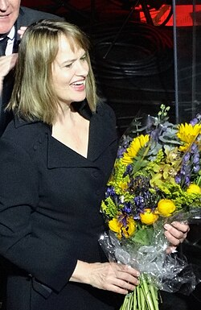

# Anne Dudley

## Biografía

Anne Jennifer Dudley (de soltera Beckingham; nacida el 7 de mayo de 1956) es una compositora, tecladista, directora de orquesta y música pop inglesa. Fue la primera compositora asociada de la BBC Concert Orchestra en 2001.​ Ha trabajado en los géneros clásico y pop, como compositora de películas, y fue uno de los miembros principales de la banda de synth-pop Art of Noise. En 1998, Dudley ganó un Oscar a la Mejor partitura musical o de comedia original por The Full Monty. Además de más de veinte bandas sonoras de otras películas, en 2012 se desempeñó como productora musical para la versión cinematográfica de Les Misérables,​ actuando también como arreglista y componiendo nueva música adicional.

## Estilo musical

Premio de la Academia a la mejor banda sonora original de comedia o musical (1998)

William Bollinger - Steppin' Stone - The XL and Sounds of Memphis Story Volumen 3 Fin del episodio sobre Toby y Happy escogiendo la fiesta nupcial.

## Anécdotas y curiosidades

1 Subsección de cambio de carrera 1.1 Bandas sonoras de películas 1.2 Trabajo de músico de sesión 1.3 Premios

Compositor: Newman, Thomas Sello: Warner Duración: 66 minutos Información de la película Título original: The Green Mile Director: Frank Darabont Nacionalidad: EE UU Año: 1999 Argumento A mediados de los años treinta, un guarda de prisiones que custodia a los condenados a muerte descubre poderes sobrenaturales en un inmenso hombre negro, acusado de haber asesinado a dos niñas. Eso le llevará a creer en su inocencia. Premios Saturn: 1 nominación Compositor: Newman, Thomas Sello: Warner Duración: 66 minutos

## Top 10 bandas sonoras

1. ***The Full Monty (Título en España: Full Monty)***
    * **Póster:** [link](112_anne_dudley/posters/poster_the_full_monty_1997.jpg)
2. ***American History X (Título en España: American History X)***
    * **Póster:** [link](112_anne_dudley/posters/poster_american_history_x_1998.jpg)
3. ***Mamma Mia! Here We Go Again (Título en España: Mamma Mia! Una y otra vez)***
    * **Póster:** [link](112_anne_dudley/posters/poster_mamma_mia_here_we_go_again_2018.jpg)
4. ***The Hustle (Título en España: Timadoras compulsivas)***
    * **Póster:** [link](112_anne_dudley/posters/poster_the_hustle_2019.jpg)
5. ***Elle (Título en España: Elle)***
    * **Póster:** [link](112_anne_dudley/posters/poster_elle_2016.jpg)
6. ***Benedetta (Título en España: Benedetta)***
    * **Póster:** [link](112_anne_dudley/posters/poster_benedetta_2021.jpg)
7. ***Pushing Tin (Título en España: Fuera de control)***
    * **Póster:** [link](112_anne_dudley/posters/poster_pushing_tin_1999.jpg)
8. ***Say Anything... (Título en España: Un gran amor)***
    * **Póster:** [link](112_anne_dudley/posters/poster_say_anything_1989.jpg)
9. ***The Crying Game (Título en España: Juego de lágrimas)***
    * **Póster:** [link](112_anne_dudley/posters/poster_the_crying_game_1992.jpg)
10. ***Zwartboek (Título en España: El libro negro)***
    * **Póster:** [link](112_anne_dudley/posters/poster_zwartboek_2006.jpg)

## Filmografía completa

- The Art of Noise In Visible Silence (Título en España: The Art of Noise In Visible Silence) (1986) · [Póster](112_anne_dudley/posters/poster_the_art_of_noise_in_visible_silence_1986.jpg)
- Hiding Out (Título en España: Descubierto) (1987) · [Póster](112_anne_dudley/posters/poster_hiding_out_1987.jpg)
- Buster (Título en España: Buster: el robo del siglo) (1988) · [Póster](112_anne_dudley/posters/poster_buster_1988.jpg)
- The Mighty Quinn (Título en España: A espaldas de la ley) (1989) · [Póster](112_anne_dudley/posters/poster_the_mighty_quinn_1989.jpg)
- Say Anything... (Título en España: Un gran amor) (1989) · [Póster](112_anne_dudley/posters/poster_say_anything_1989.jpg)
- Wilt (Título en España: Wilt) (1989) · [Póster](112_anne_dudley/posters/poster_wilt_1989.jpg)
- The Miracle (Título en España: Amor a una extraña) (1991) · [Póster](112_anne_dudley/posters/poster_the_miracle_1991.jpg)
- Knight Moves (Título en España: Jaque al asesino) (1992) · [Póster](112_anne_dudley/posters/poster_knight_moves_1992.jpg)
- The Crying Game (Título en España: Juego de lágrimas) (1992) · [Póster](112_anne_dudley/posters/poster_the_crying_game_1992.jpg)
- Felidae (Título en España: Francis el detectigato) (1994) · [Póster](112_anne_dudley/posters/poster_felidae_1994.jpg)
- The Grotesque (Título en España: The Grotesque) (1995) · [Póster](112_anne_dudley/posters/poster_the_grotesque_1995.jpg)
- When Saturday Comes (Título en España: Camino a la gloria) (1996) · [Póster](112_anne_dudley/posters/poster_when_saturday_comes_1996.jpg)
- Hollow Reed (Título en España: Tras el silencio) (1996) · [Póster](112_anne_dudley/posters/poster_hollow_reed_1996.jpg)
- The Full Monty (Título en España: Full Monty) (1997) · [Póster](112_anne_dudley/posters/poster_the_full_monty_1997.jpg)
- American History X (Título en España: American History X) (1998) · [Póster](112_anne_dudley/posters/poster_american_history_x_1998.jpg)
- Pushing Tin (Título en España: Fuera de control) (1999) · [Póster](112_anne_dudley/posters/poster_pushing_tin_1999.jpg)
- The Miracle Maker (Título en España: El hombre que hacía milagros) (2000) · [Póster](112_anne_dudley/posters/poster_the_miracle_maker_2000.jpg)
- Lucky Break (Título en España: Lucky Break) (2001) · [Póster](112_anne_dudley/posters/poster_lucky_break_2001.jpg)
- Monkeybone (Título en España: Monkeybone) (2001) · [Póster](112_anne_dudley/posters/poster_monkeybone_2001.jpg)
- Art Of Noise - Into Vision: The Complete Compendium (Título en España: Art Of Noise - Into Vision: The Complete Compendium) (2002) · [Póster](112_anne_dudley/posters/poster_art_of_noise_into_vision_the_complete_compendium_2002.jpg)
- A Man Apart (Título en España: Diablo (A Man Apart)) (2003) · [Póster](112_anne_dudley/posters/poster_a_man_apart_2003.jpg)
- Bright Young Things (Título en España: Escándalo con clase) (2003) · [Póster](112_anne_dudley/posters/poster_bright_young_things_2003.jpg)
- The Gathering (Título en España: Visitantes) (2003) · [Póster](112_anne_dudley/posters/poster_the_gathering_2003.jpg)
- Zwartboek (Título en España: El libro negro) (2006) · [Póster](112_anne_dudley/posters/poster_zwartboek_2006.jpg)
- Tristan & Isolde (Título en España: Tristán e Isolda) (2006) · [Póster](112_anne_dudley/posters/poster_tristan_isolde_2006.jpg)
- Perfect Creature (Título en España: La criatura perfecta) (2007) · [Póster](112_anne_dudley/posters/poster_perfect_creature_2007.jpg)
- The Walker (Título en España: The Walker) (2007) · [Póster](112_anne_dudley/posters/poster_the_walker_2007.jpg)
- Bill Bailey's Remarkable Guide to the Orchestra (Título en España: Bill Bailey's Remarkable Guide to the Orchestra) (2009) · [Póster](112_anne_dudley/posters/poster_bill_bailey_s_remarkable_guide_to_the_orchestra_2009.jpg)
- Who's Afraid Of The Art Of Noise (Título en España: Who's Afraid Of The Art Of Noise) (2011) · [Póster](112_anne_dudley/posters/poster_who_s_afraid_of_the_art_of_noise_2011.jpg)
- The Boy in the Dress (Título en España: El Chico del Vestido) (2014) · [Póster](112_anne_dudley/posters/poster_the_boy_in_the_dress_2014.jpg)
- Walking on Sunshine (Título en España: Walking on Sunshine) (2014) · [Póster](112_anne_dudley/posters/poster_walking_on_sunshine_2014.jpg)
- Away (Título en España: Away) (2016) · [Póster](112_anne_dudley/posters/poster_away_2016.jpg)
- Billionaire Boy (Título en España: Billionaire Boy) (2016) · [Póster](112_anne_dudley/posters/poster_billionaire_boy_2016.jpg)
- Elle (Título en España: Elle) (2016) · [Póster](112_anne_dudley/posters/poster_elle_2016.jpg)
- Mamma Mia! Here We Go Again (Título en España: Mamma Mia! Una y otra vez) (2018) · [Póster](112_anne_dudley/posters/poster_mamma_mia_here_we_go_again_2018.jpg)
- The Hustle (Título en España: Timadoras compulsivas) (2019) · [Póster](112_anne_dudley/posters/poster_the_hustle_2019.jpg)
- Benedetta (Título en España: Benedetta) (2021) · [Póster](112_anne_dudley/posters/poster_benedetta_2021.jpg)
- Everybody's Talking About Jamie (Título en España: Todos hablan de Jamie) (2021) · [Póster](112_anne_dudley/posters/poster_everybody_s_talking_about_jamie_2021.jpg)
- The Velveteen Rabbit (Título en España: El conejo de terciopelo) (2023) · [Póster](112_anne_dudley/posters/poster_the_velveteen_rabbit_2023.jpg)
- Untitled (Título en España: Untitled) (2023) · [Póster](112_anne_dudley/posters/poster_untitled_2023.jpg)
- Bull Street (Título en España: Bull Street) (2024) · [Póster](112_anne_dudley/posters/poster_bull_street_2024.jpg)
- Signs of Life (Título en España: Signs of Life) (2025) · [Póster](112_anne_dudley/posters/poster_signs_of_life_2025.jpg)
- Fing! (Título en España: Fing!) (2026) · [Póster](112_anne_dudley/posters/poster_fing_2026.jpg)

## Premios y nominaciones

* 1998 – Premio de la Academia a la mejor banda sonora original de comedia o musical – por *The Full Monty (Título en España: Full Monty)* – (Ganador)
* 1998 – Premio de la Academia a la mejor banda sonora original de comedia o musical – por *The Full Monty (Título en España: Full Monty)* – (Nominación)
* 2023 – Premio Alemán de Música de Cine – (Ganador)

## Fuentes adicionales

* [MundoBSO](https://w.mundobso.com/bso/cartero-siempre-llama-dos-veces-el) — site:mundobso.com
* [MundoBSO (2)](https://www.mundobso.com/bso/milla-verde-la) — site:mundobso.com
* [MundoBSO (3)](https://www.mundobso.com/bso/lobo-y-el-leon-el) — site:mundobso.com
* [Film Score Monthly](https://www.filmscoremonthly.com/board/posts.cfm?threadID=158606&forumID=1&archive=0) — site:filmscoremonthly.com
* [Film Score Monthly (2)](https://www.filmscoremonthly.com/fsmonline/issue_detail_print.cfm?issID=7&page=2) — site:filmscoremonthly.com
* [Film Score Monthly (3)](https://www.filmscoremonthly.com/board/threads.cfm?threadID=159042) — site:filmscoremonthly.com
* [SoundtrackCollector](https://soundtrackcollector.com/catalog/composerdiscography.php?composerid=299) — site:soundtrackcollector.com
* [SoundtrackCollector (2)](https://www.soundtrackcollector.com/title/7514/Jeeves+And+Wooster) — site:soundtrackcollector.com
* [SoundtrackCollector (3)](https://www.soundtrackcollector.com/title/1360/Buster) — site:soundtrackcollector.com
* [WhatSong](https://www.whatsong.org/tvshow/prison-break/episode/37396) — site:whatsong.org
* [WhatSong (2)](https://www.whatsong.org/tvshow/9-1-1/episode/71629) — site:whatsong.org
* [WhatSong (3)](https://www.whatsong.org/tvshow/scorpion/episode/52426) — site:whatsong.org

## Notas externas

* MundoBSO (2): Compositor: Newman, Thomas Sello: Warner Duración: 66 minutos Información de la película Título original: The Green Mile Director: Frank Darabont Nacionalidad: EE UU Año: 1999 Argumento A mediados de los años treinta, un guarda de prisiones que custodia a los condenados a muerte descubre poderes sobrenaturales en un inmenso hombre negro, acusado de haber asesinado a dos niñas. Eso le llevará a creer en su inocencia. Premios Saturn: 1 nominación Compositor: Newman, Thomas Sello: Warner Duración: 66 minutos
* MundoBSO (3): Compositor: Amar, Armand Sello: Long Distance Duración: 54 minutos Información de la película Título original: Le loup et le lion Director: Gilles de Maistre Nacionalidad: Francia Año: 2021 Argumento Una joven regresa a la casa de su infancia en una isla de Canadá. Allí su vida da un vuelco cuando rescata a un cachorro de lobo y a un cachorro de león. A medida que los animales crecen, los tres forman un vínculo inseparable, hasta que son separados. Compositor: Amar, Armand Sello: Long Distance Duración: 54 minutos
* WhatSong: Ramin Djawadi - Prison Break: Temporadas 3 y 4 (Banda sonora original de televisión) Ramin Djawadi - Prison Break: Temporadas 3 y 4 (Banda sonora original de televisión)
* WhatSong (2): Talking Heads - Favoritos populares 1976-1992: Sand In the Vaseline The Naked and Famous - Passive Me, Aggressive You (Remixes y caras B)
* WhatSong (3): William Bollinger - Steppin' Stone - The XL and Sounds of Memphis Story Volumen 3 Fin del episodio sobre Toby y Happy escogiendo la fiesta nupcial.
* music.apple.com: Candle In the Wind 1997 / Algo sobre tu apariencia esta noche - Singleâ·â1997 Suite de Poldark Poldark (Versión Deluxe)â·â2016
* music.apple.com: A lo largo de cuatro décadas de carrera, la compositora y arreglista británica Anne Dudley ha explorado los caminos musicales más diversos. En los 80, fue una de las fundadoras de la banda electrónica Art of Noise, para la que escribió el éxito “Moments In Love”. Además de música sesión y arreglista en proyectos de artistas como Seal o Rod Stewart, ha escrito bandas sonoras para el cine y la televisión que exploran la música sinfónica con sensibilidad pop y van de la intensidad atmosférica de Benedetta a la exuberante partitura de The Full Monty, por la que ganó un Oscar en 1998. Copyright © 2026 Apple Inc. Todos los derechos reservados.
* www.mfiles.co.uk: Anne Dudley siempre ha tenido una estrecha relación con la música pop. Tan pronto como se graduó en el Royal College of Music de Londres, consiguió un trabajo como teclista de sesión para el productor Trevor Horn. Al principio de su carrera, ayudó a organizar material para varios grupos y contribuyó con las partes destacadas del teclado en "The Book of Love" de ABC y Frankie va a "Two Tribes" de Holliwood. Luego, su carrera dio un giro más innovador cuando, junto con Gary Langan y Paul Morley, formó el grupo experimental "The Art of Noise". Este esfuerzo colaborativo se especializó inicialmente en tomar varias muestras de sonido y moldearlas en pistas techno distintivas, y luego buscó...
* www.annedudley.co.uk: Compositora, arreglista, productora e intérprete, Anne Dudley es una músico polifacética y aclamada por la crítica. La Academia Ivors anunció que Anne Dudley se convertirá en miembro de la Academia, el más alto honor que otorga. Se convierte en la miembro número 33 de la Academia Ivors, uniéndose a una lista de compositores y compositores extraordinarios, incluidos John Adams, Kate Bush, Elton John, James MacMillan, Paul McCartney, Bruce Springsteen, Sting, Errollyn Wallen y Judith Weir.
* classical.music.apple.com: Moments in Love - Single Moments in Love - Single Joe Hume The Velveteen Rabbit (banda sonora del original de Apple) The Velveteen Rabbit (banda sonora del original de Apple) Anne Dudley
* www.annedudley.co.uk: Entre los arreglos icónicos de Anne se encuentran el álbum de ABC "The Lexicon of Love", Frankie va a Hollywood "Two Tribes" y el álbum "Rattlesnakes" de Lloyd Cole, "Getting away with it" de Electronic y "Leave Right Now" de Will Young. Una lista más completa incluiría el álbum "A Different Beat" de Boyzone, el álbum "Press to Play" de Paul McCartney, el álbum "You can left your hat on" de Tom Jones, el álbum "Results" de Liza Minelli y Cher "It's a man's world", Pulp "This is hardcore", Wet Wet Wet "Holding back the river", el álbum "A spanner in the works" de Rod Stewart, los tres primeros álbumes de Seal, "Young Guns" de Wham y "More than Us" de Travis. artistas tan variados como Oleta Adams, Marc Almond, The Associates, Rick Astley, Bewitched,...
* www.annedudley.co.uk: En mayo de 2017 se estrenó una presentación en vivo en Liverpool Sound City cuando Anne apareció con sus colegas JJ y Gary Langan y un Fairlight antiguo. Se llevaron a cabo cuatro espectáculos en Billboard Live en Japón en septiembre de 2017, seguidos de uno único en la Biblioteca Británica en marzo de 2018.
