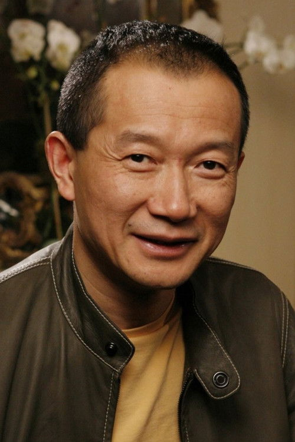

# Tan Dun

## Biografía

El Concierto para piano y orquesta "El fuego" es el primer concierto para piano del compositor chino Tan Dun. Fue un encargo de Lorin Maazel, el director de la Filarmónica de Nueva York. Su estreno tuvo lugar el 9 de abril de 2008, por el pianista chino Lang Lang (pieza que ha sido creada especialmente para él) y la Orquesta Filarmónica de Nueva York, bajo la batuta de Leonard Slatkin en el Avery Fisher Hall de Nueva York. Fue estrenada en España el 29 de enero de 2010 por la Orquesta Nacional de España, bajo la dirección del propio compositor.​ Tiene una duración aproximada de treinta minutos​ y está escrito en tres movimientos:

Lento Adagio melancholia Allegretto La partitura ha sido publicada por la editorial G. Schirmer.​ La obra está orquestada para dos flautas, flautín, dos oboes, dos clarinetes, dos fagotes, cuatro trompas, tres trombones, una tuba, timbales, cuatro instrumentos de percusión, arpa y cuerdas.​ Lang Lang describió la pieza como «muy melódica, muy rítmica y muy dramática».​ Algunas partes requieren una gran habilidad técnica, en las que el pianista usa aparte de sus dedos, las palmas, muñecas e incluso el antebrazo para dar ciertas notas,​ es por ello que el pianista es caracterizado como un «artista marcial del teclado».​ El concierto fue bien recibido por las críticas y ha sido descrito como una «amalgama de géneros».​

## Estilo musical

El concierto fue diseñado en el contexto de conmemorar el fallecimiento de lo viejo y el anhelo de lo nuevo. Al observar el programa de la velada, así como los solistas y la orquestación, era obvio que el propósito era presentar una “conversación entre clásicos y entre lo clásico y lo moderno y, además, entre Oriente y Occidente”, dijo Tan Dun, en una introducción de sus obras musicales al público.

## Anécdotas y curiosidades

Compositores: Beck, Christophe | Lopez, Robert Sello: Disney Duración: 98 minutos Título original: Frozen Director: Chris Buck, Jennifer Lee Nacionalidad: EE UU Año: 2013

## Top 10 bandas sonoras

1. ***Fallen (Título en España: Fallen)***
    * **Póster:** [link](114_tan_dun/posters/poster_fallen_1998.jpg)
2. ***英雄 (Título en España: Hero)***
    * **Póster:** [link](114_tan_dun/posters/poster_poster_2002.jpg)
3. ***卧虎藏龍 (Título en España: Tigre y dragón)***
    * **Póster:** [link](114_tan_dun/posters/poster_poster_2000.jpg)
4. ***The First Emperor (Título en España: The First Emperor)***
    * **Póster:** [link](114_tan_dun/posters/poster_the_first_emperor_2007.jpg)
5. ***夜宴 (Título en España: The Banquet)***
    * **Póster:** [link](114_tan_dun/posters/poster_poster_2006.jpg)
6. ***南京1937 (Título en España: 南京1937)***
    * **Póster:** [link](114_tan_dun/posters/poster_1937_1995.jpg)
7. ***垂簾聽政 (Título en España: 垂簾聽政)***
    * **Póster:** [link](114_tan_dun/posters/poster_poster_1983.jpg)
8. ***The Music of Strangers: Yo-Yo Ma and the Silk Road Ensemble (Título en España: The Music of Strangers: Yo-Yo Ma and the Silk Road Ensemble)***
    * **Póster:** [link](114_tan_dun/posters/poster_the_music_of_strangers_yo_yo_ma_and_the_silk_road_ensemble_2016.jpg)
9. ***Part One: China in Revolution 1911–1949 (Título en España: Part One: China in Revolution 1911–1949)***
    * **Póster:** [link](114_tan_dun/posters/poster_part_one_china_in_revolution_1911_1949_1989.jpg)
10. ***Beethovens Neunte - Symphonie für die Welt (Título en España: Beethovens Neunte - Symphonie für die Welt)***
    * **Póster:** [link](114_tan_dun/posters/poster_beethovens_neunte_symphonie_f_r_die_welt_2020.jpg)

## Filmografía completa

- 垂簾聽政 (Título en España: 垂簾聽政) (1983) · [Póster](114_tan_dun/posters/poster_poster_1983.jpg)
- Part One: China in Revolution 1911–1949 (Título en España: Part One: China in Revolution 1911–1949) (1989) · [Póster](114_tan_dun/posters/poster_part_one_china_in_revolution_1911_1949_1989.jpg)
- Part Two: The Mao Years 1949–1976 (Título en España: Part Two: The Mao Years 1949–1976) (1994) · [Póster](114_tan_dun/posters/poster_part_two_the_mao_years_1949_1976_1994.jpg)
- 南京1937 (Título en España: 南京1937) (1995) · [Póster](114_tan_dun/posters/poster_1937_1995.jpg)
- Fallen (Título en España: Fallen) (1998) · [Póster](114_tan_dun/posters/poster_fallen_1998.jpg)
- 卧虎藏龍 (Título en España: Tigre y dragón) (2000) · [Póster](114_tan_dun/posters/poster_poster_2000.jpg)
- 英雄 (Título en España: Hero) (2002) · [Póster](114_tan_dun/posters/poster_poster_2002.jpg)
- 夜宴 (Título en España: The Banquet) (2006) · [Póster](114_tan_dun/posters/poster_poster_2006.jpg)
- The First Emperor (Título en España: The First Emperor) (2007) · [Póster](114_tan_dun/posters/poster_the_first_emperor_2007.jpg)
- Do or Die: Lang Lang's Story (Título en España: Do or Die: Lang Lang's Story) (2012) · [Póster](114_tan_dun/posters/poster_do_or_die_lang_lang_s_story_2012.jpg)
- The Music of Strangers: Yo-Yo Ma and the Silk Road Ensemble (Título en España: The Music of Strangers: Yo-Yo Ma and the Silk Road Ensemble) (2016) · [Póster](114_tan_dun/posters/poster_the_music_of_strangers_yo_yo_ma_and_the_silk_road_ensemble_2016.jpg)
- Beethoven In Beijing (Título en España: Beethoven In Beijing) (2020) · [Póster](114_tan_dun/posters/poster_beethoven_in_beijing_2020.jpg)
- Beethovens Neunte - Symphonie für die Welt (Título en España: Beethovens Neunte - Symphonie für die Welt) (2020) · [Póster](114_tan_dun/posters/poster_beethovens_neunte_symphonie_f_r_die_welt_2020.jpg)

## Premios y nominaciones

* 1994 – Premio Eugene McDermott en las Artes del MIT – (Ganador)
* 1998 – Premio Grawemeyer de Composición Musical – (Ganador)
* 1998 – Premios Grawemeyer – (Ganador)
* 2001 – Premio de la Academia a la mejor banda sonora original – por *Crouching Tiger, Hidden Dragon: Sword of Destiny (Título en España: Tigre y dragón 2: La espada del destino)* – (Ganador)
* 2001 – Premio de la Academia a la mejor banda sonora original – por *Crouching Tiger, Hidden Dragon: Sword of Destiny (Título en España: Tigre y dragón 2: La espada del destino)* – (Nominación)
* 2001 – Premio de la Academia a la mejor canción original – por *A Love Before Time* – (Nominación)
* 2005 – Premio de Música de la Ciudad de Duisburg – (Ganador)
* 2011 – Premio Bach de la Ciudad Libre y Hanseática de Hamburgo – (Ganador)
* Medalla de Honor de la Isla Ellis – (Ganador)
* Premios Brit clásicos – (Ganador)

## Fuentes adicionales

* [MundoBSO](https://www.mundobso.com/bso/frozen-el-reino-del-hielo) — site:mundobso.com
* [MundoBSO (2)](https://www.mundobso.com/bso/despiadados-los) — site:mundobso.com
* [MundoBSO (3)](https://www.mundobso.com/bso/star-trek-insurrection) — site:mundobso.com
* [Film Score Monthly](https://www.filmscoremonthly.com/backissues/viewissue.cfm?issueID=40) — site:filmscoremonthly.com
* [Film Score Monthly (2)](https://www.filmscoremonthly.com/daily/article.cfm/articleID/8130/Film-Score-Friday-72123/) — site:filmscoremonthly.com
* [Film Score Monthly (3)](https://www.filmscoremonthly.com/Daily/article.cfm/articleID/8197/Film-Score-Friday-2924/) — site:filmscoremonthly.com
* [SoundtrackCollector](https://soundtrackcollector.com) — site:soundtrackcollector.com
* [SoundtrackCollector (2)](https://www.soundtrackcollector.com/?url) — site:soundtrackcollector.com
* [SoundtrackCollector (3)](https://www.soundtrackcollector.com/composer/browse/T/0) — site:soundtrackcollector.com
* [WhatSong](https://www.whatsong.org/tvshow/top-gear/episode/51737) — site:whatsong.org
* [WhatSong (2)](https://www.whatsong.org/tvshow/9-1-1/episode/71629) — site:whatsong.org
* [WhatSong (3)](https://www.whatsong.org/tvshow/modern-family/episode/79463) — site:whatsong.org

## Notas externas

* MundoBSO: Compositores: Beck, Christophe | Lopez, Robert Sello: Disney Duración: 98 minutos Título original: Frozen Director: Chris Buck, Jennifer Lee Nacionalidad: EE UU Año: 2013
* MundoBSO (2): Compositor: Morricone, Ennio Sello: Screen Trax Duración: 37 minutos Información de la película Título original: I crudeli Director: Sergio Corbucci Nacionalidad: Italia Año: 1967 Argumento Al acabar la guerra de Secesión norteamericana, un coronel sudista organiza un ejército para seguir combatiendo, y cuenta para ello con la ayuda de sus tres hijos. Compositor: Morricone, Ennio Sello: Screen Trax Duración: 37 minutos
* MundoBSO (3): Compositor: Goldsmith, Jerry Sello: GNP Duración: 79 minutos Información de la película Título original: Star Trek: Insurrection Director: Jonathan Frakes Nacionalidad: EE UU Año: 1998 Argumento La tripulación de la nave Enterprise encuentra un planeta con propiedades mágicas, en el que sus habitantes viven en eterna paz... hasta que surge la amenaza de invasión. Compositor: Goldsmith, Jerry Sello: GNP Duración: 79 minutos
* SoundtrackCollector (2): 14 de enero - Confesión de un comisionado de policía de Riz Ortolani a la fiscalía 3 de diciembre - Wolf Hall de Debbie Wiseman: El espejo y la luz
* WhatSong: Rachid Taha - Black Hawk Down (banda sonora original de la película) Jeremy y James silban brevemente, luego se escucha la canción real, mientras el trío se da cuenta de la dificultad del desafío que se les ha planteado, luego se suben a sus camiones y parten por primera vez.
* WhatSong (2): Talking Heads - Favoritos populares 1976-1992: Sand In the Vaseline The Naked and Famous - Passive Me, Aggressive You (Remixes y caras B)
* WhatSong (3): Hacia el final, cuando Mitch, Cam y los "chicos" se dirigen a la piscina sin camiseta. La mejor fuente en línea de música de películas y televisión. Copyright © 2018 - 2026 Whatsong.org. Reservados todos los derechos.
* bmop.org: Para crear la inquietante música original de la aclamada aventura romántica de artes marciales del director Ang Lee, Crouching Tiger, Hidden Dragon, el compositor Tan Dun recurrió a la vívida paleta de sonidos y texturas musicales y a la rica imaginación que lo han convertido en uno de los compositores de conciertos y óperas más distintivos de su época. Ang Lee (Sense & Sensibility, The Ice Storm) y Tan Dun trabajaron estrechamente (una colaboración poco común y profunda entre el director de cine y el compositor) para crear una música para la película que capturara su entorno tradicional chino del siglo XIX y aumentara su impacto para las audiencias de todo el mundo. Ang Lee ha dicho que él concibió las elaboradas secuencias de artes marciales de la película...
* www.classical-music.com: El compositor chino-estadounidense Tan Dun proviene de orígenes humildes para lograr el éxito global, pero sus preocupaciones siguen siendo las mismas: el equilibrio, la humanidad y el mundo natural, escribe Claire Jackson. Mejor conocido por su banda sonora para la muy popular película de artes marciales del año 2000 Crouching Tiger, Hidden Dragon, Tan Dun es un compositor chino-estadounidense y creador de algunos mundos sonoros muy aventureros. Continúe leyendo para obtener más información sobre este compositor innovador.
* maekan.com: Recientemente, MAEKAN se asoció con la publicación más reconocida de Hong Kong, SCMP, para producir una historia sobre Tan Dun, un maestro compositor y tesoro nacional chino viviente. Más conocido por el público internacional por su trabajo en la composición de Crouching Tiger, Hidden Dragon de Ang Lee, acumuló una gran cantidad de trabajo que combina las convenciones teatrales occidentales y tradicionales chinas antes de encontrar un mayor éxito con bandas sonoras para películas y componer para eventos históricos de China, como los Juegos Olímpicos de Beijing 2008.
* www.wisemusicclassical.com: El artista de renombre mundial y Embajador de Buena Voluntad Mundial de la UNESCO, Tan Dun, ha dejado una huella indeleble en la escena musical mundial con un repertorio creativo que abarca las fronteras de la música clásica, la interpretación multimedia y las tradiciones orientales y occidentales. Ganador de los honores más prestigiosos de la actualidad, incluidos el premio Grammy, el premio Oscar/de la Academia, el premio Grawemeyer, el premio Bach, el premio Shostakovich y, más recientemente, el premio León de Oro de Italia a la trayectoria, la música de Tan Dun ha sido interpretada en todo el mundo por importantes orquestas, teatros de ópera, festivales internacionales y en radio y televisión. El año pasado, Tan Dun dirigió la gran celebración de inauguración de Disneyland...
* www.wisemusicclassical.com: La música del compositor chino-estadounidense Tan Dun invita al oyente a un mundo sonoro personal que combina de manera experta las tradiciones musicales orientales y occidentales. Las melodías líricas permiten que la voz brille y la orquesta cautiva con sonidos poco ortodoxos entrelazados con el mundo natural: una “música orgánica” de piedra, arcilla, agua y papel. A lo largo de más de tres décadas, su catálogo operístico ha evolucionado desde obras experimentales hasta grandes óperas a gran escala que se dirigen a un amplio público. Las óperas de Tan Dun ofrecen una oportunidad de programación única: un repertorio impregnado de sonidos frescos e interpretaciones contemporáneas de auténticas historias asiáticas. Tea: Un espejo del alma (2002) 1 h 48’ Libreto en...
