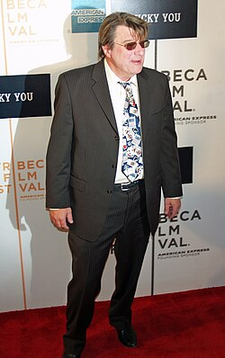

# Christopher Young

## Biografía

Christopher Young (28 de abril de 1958) es un compositor musical famoso por sus trabajos tanto para cine como para televisión. Muchos de sus trabajos han sido para películas de terror que incluyen A Nightmare on Elm Street 2: Freddy's Revenge y El exorcismo de Emily Rose o su trabajo junto a Danny Elfman en Spider-Man 3.

## Estilo musical

Christopher Young nació el 28 de abril de 1957 en Red Bank, Nueva Jersey. Creció en una familia de músicos y sus padres lo alentaron a dedicarse a su pasión por la música. Young comenzó a tocar el piano a una edad temprana y luego aprendió a tocar otros instrumentos como la guitarra y la batería.

## Anécdotas y curiosidades

2 Career Toggle Subsección de carrera 2.1 2005–2007: Nashville Star y álbum debut homónimo 2.2 2008–2010: Voices EP y The Man I Want to Be 2.3 2011–2015: Neon y A.M. 2.4 2015–2016: Ya voy y debe ser Navidad 2.5 2017–2018: Losing Sleep y la incorporación al Grand Ole Opry 2.6 2019–2024: Amigos famosos y amor joven y sábados por la noche 2.7 2024-presente: Black River Entertainment y Yo no vine aquí para irme

## Top 10 bandas sonoras

1. ***Priest (Título en España: El sicario de Dios)***
    * **Póster:** [link](116_christopher_young/posters/poster_priest_2011.jpg)
2. ***Pet Sematary (Título en España: Cementerio de animales)***
    * **Póster:** [link](116_christopher_young/posters/poster_pet_sematary_2019.jpg)
3. ***The Uninvited (Título en España: Presencias extrañas)***
    * **Póster:** [link](116_christopher_young/posters/poster_the_uninvited_2009.jpg)
4. ***Emmanuelle 4 (Título en España: Emmanuelle 4)***
    * **Póster:** [link](116_christopher_young/posters/poster_emmanuelle_4_1984.jpg)
5. ***Young Hearts (Título en España: Young hearts)***
    * **Póster:** [link](116_christopher_young/posters/poster_young_hearts_2024.jpg)
6. ***Ghost Rider (Título en España: Ghost Rider: El motorista fantasma)***
    * **Póster:** [link](116_christopher_young/posters/poster_ghost_rider_2007.jpg)
7. ***Hide and Seek (Título en España: El escondite)***
    * **Póster:** [link](116_christopher_young/posters/poster_hide_and_seek_2005.jpg)
8. ***The Hurricane (Título en España: Huracán Carter)***
    * **Póster:** [link](116_christopher_young/posters/poster_the_hurricane_1999.jpg)
9. ***Dragonfly (Título en España: Dragonfly (La sombra de la libélula))***
    * **Póster:** [link](116_christopher_young/posters/poster_dragonfly_2002.jpg)
10. ***Copycat (Título en España: Copycat)***
    * **Póster:** [link](116_christopher_young/posters/poster_copycat_1995.jpg)

## Filmografía completa

- April 28, (Título en España: April 28,) (1958) · [Póster](116_christopher_young/posters/poster_april_28_1958.jpg)
- Music for the Millions (Título en España: Music for the Millions) (1983) · [Póster](116_christopher_young/posters/poster_music_for_the_millions_1983.jpg)
- Emmanuelle 4 (Título en España: Emmanuelle 4) (1984) · [Póster](116_christopher_young/posters/poster_emmanuelle_4_1984.jpg)
- The Power (Título en España: The Power) (1984) · [Póster](116_christopher_young/posters/poster_the_power_1984.jpg)
- Avenging Angel (Título en España: Angel 2) (1985) · [Póster](116_christopher_young/posters/poster_avenging_angel_1985.jpg)
- Godzilla 1985 (Título en España: Godzilla 1985) (1985) · [Póster](116_christopher_young/posters/poster_godzilla_1985_1985.jpg)
- The Twilight Zone (Título en España: The Twilight Zone) (1985) · [Póster](116_christopher_young/posters/poster_the_twilight_zone_1985.jpg)
- Getting Even (Título en España: Getting Even) (1986) · [Póster](116_christopher_young/posters/poster_getting_even_1986.jpg)
- Invaders from Mars (Título en España: Invasores de Marte) (1986) · [Póster](116_christopher_young/posters/poster_invaders_from_mars_1986.jpg)
- Trick or Treat (Título en España: Muerte a 33 R.P.M.) (1986) · [Póster](116_christopher_young/posters/poster_trick_or_treat_1986.jpg)
- Flowers in the Attic (Título en España: Flores en el ático) (1987) · [Póster](116_christopher_young/posters/poster_flowers_in_the_attic_1987.jpg)
- The Telephone (Título en España: El teléfono) (1988) · [Póster](116_christopher_young/posters/poster_the_telephone_1988.jpg)
- Jersey Girl (Título en España: Jersey Girl) (1992) · [Póster](116_christopher_young/posters/poster_jersey_girl_1992.jpg)
- Rapid Fire (Título en España: Rapid fire) (1992) · [Póster](116_christopher_young/posters/poster_rapid_fire_1992.jpg)
- The Vagrant (Título en España: Psicosis mortal) (1992) · [Póster](116_christopher_young/posters/poster_the_vagrant_1992.jpg)
- 夏日情未了 (Título en España: 夏日情未了) (1993) · [Póster](116_christopher_young/posters/poster_poster_1993.jpg)
- Copycat (Título en España: Copycat) (1995) · [Póster](116_christopher_young/posters/poster_copycat_1995.jpg)
- Unforgettable (Título en España: Escondido en la memoria) (1996) · [Póster](116_christopher_young/posters/poster_unforgettable_1996.jpg)
- Hush (Título en España: Relación mortal) (1998) · [Póster](116_christopher_young/posters/poster_hush_1998.jpg)
- Judas Kiss (Título en España: El beso de Judas) (1998) · [Póster](116_christopher_young/posters/poster_judas_kiss_1998.jpg)
- In Too Deep (Título en España: Juego de confidencias) (1999) · [Póster](116_christopher_young/posters/poster_in_too_deep_1999.jpg)
- The Hurricane (Título en España: Huracán Carter) (1999) · [Póster](116_christopher_young/posters/poster_the_hurricane_1999.jpg)
- The Gift (Título en España: Premonición) (2000) · [Póster](116_christopher_young/posters/poster_the_gift_2000.jpg)
- Bandits (Título en España: Bandits (Bandidos)) (2001) · [Póster](116_christopher_young/posters/poster_bandits_2001.jpg)
- Sweet November (Título en España: Noviembre dulce) (2001) · [Póster](116_christopher_young/posters/poster_sweet_november_2001.jpg)
- The Glass House (Título en España: Última sospecha) (2001) · [Póster](116_christopher_young/posters/poster_the_glass_house_2001.jpg)
- Dragonfly (Título en España: Dragonfly (La sombra de la libélula)) (2002) · [Póster](116_christopher_young/posters/poster_dragonfly_2002.jpg)
- Z39.88 (Título en España: Z39.88) (2004) · [Póster](116_christopher_young/posters/poster_z39_88_2004.jpg)
- Hide and Seek (Título en España: El escondite) (2005) · [Póster](116_christopher_young/posters/poster_hide_and_seek_2005.jpg)
- Ghost Rider (Título en España: Ghost Rider: El motorista fantasma) (2007) · [Póster](116_christopher_young/posters/poster_ghost_rider_2007.jpg)
- May (Título en España: May) (2008) · [Póster](116_christopher_young/posters/poster_may_2008.jpg)
- The Informers (Título en España: Los confidentes) (2008) · [Póster](116_christopher_young/posters/poster_the_informers_2008.jpg)
- Creation (Título en España: La duda de Darwin) (2009) · [Póster](116_christopher_young/posters/poster_creation_2009.jpg)
- James Peterson (Título en España: James Peterson) (2009) · [Póster](116_christopher_young/posters/poster_james_peterson_2009.jpg)
- Love Happens (Título en España: Love Happens) (2009) · [Póster](116_christopher_young/posters/poster_love_happens_2009.jpg)
- The Uninvited (Título en España: Presencias extrañas) (2009) · [Póster](116_christopher_young/posters/poster_the_uninvited_2009.jpg)
- Haiti earthquake in (Título en España: Haiti earthquake in) (2010) · [Póster](116_christopher_young/posters/poster_haiti_earthquake_in_2010.jpg)
- The Black Tulip (Título en España: The Black Tulip) (2010) · [Póster](116_christopher_young/posters/poster_the_black_tulip_2010.jpg)
- When in Rome (Título en España: En la boda de mi hermana) (2010) · [Póster](116_christopher_young/posters/poster_when_in_rome_2010.jpg)
- Faces in the Crowd (Título en España: El rostro del asesino) (2011) · [Póster](116_christopher_young/posters/poster_faces_in_the_crowd_2011.jpg)
- Priest (Título en España: El sicario de Dios) (2011) · [Póster](116_christopher_young/posters/poster_priest_2011.jpg)
- The Tall Man (Título en España: El hombre de las sombras) (2012) · [Póster](116_christopher_young/posters/poster_the_tall_man_2012.jpg)
- March 20, (Título en España: March 20,) (2013) · [Póster](116_christopher_young/posters/poster_march_20_2013.jpg)
- The Kings of Summer (Título en España: Los reyes del verano) (2013) · [Póster](116_christopher_young/posters/poster_the_kings_of_summer_2013.jpg)
- Deliver Us from Evil (Título en España: Líbranos del mal) (2014) · [Póster](116_christopher_young/posters/poster_deliver_us_from_evil_2014.jpg)
- 西遊記之大鬧天宮 (Título en España: El rey Mono) (2014) · [Póster](116_christopher_young/posters/poster_poster_2014.jpg)
- Brian Weidling, which captured the recording session, was released in (Título en España: Brian Weidling, which captured the recording session, was released in) (2017) · [Póster](116_christopher_young/posters/poster_brian_weidling_which_captured_the_recording_session_was_released_in_2017.jpg)
- Pet Sematary (Título en España: Cementerio de animales) (2019) · [Póster](116_christopher_young/posters/poster_pet_sematary_2019.jpg)
- Articles with unsourced statements from August (Título en España: Articles with unsourced statements from August) (2022) · [Póster](116_christopher_young/posters/poster_articles_with_unsourced_statements_from_august_2022.jpg)
- August (Título en España: August) (2022) · [Póster](116_christopher_young/posters/poster_august_2022.jpg)
- Vector (Título en España: Vector) (2022) · [Póster](116_christopher_young/posters/poster_vector_2022.jpg)
- Young skin-vector (Título en España: Young skin-vector) (2022) · [Póster](116_christopher_young/posters/poster_young_skin_vector_2022.jpg)
- The Offering (Título en España: The Offering) (2023) · [Póster](116_christopher_young/posters/poster_the_offering_2023.jpg)
- An American Bombing: The Road to April 19th (Título en España: Un atentado americano: el camino hacial el 19 de abril) (2024) · [Póster](116_christopher_young/posters/poster_an_american_bombing_the_road_to_april_19th_2024.jpg)
- BLP articles lacking sources from April (Título en España: BLP articles lacking sources from April) (2024) · [Póster](https://example.com/placeholder.jpg)
- Wikidata","BLP articles lacking sources from April (Título en España: Wikidata","BLP articles lacking sources from April) (2024) · [Póster](https://example.com/placeholder.jpg)
- Young Hearts (Título en España: Young hearts) (2024) · [Póster](116_christopher_young/posters/poster_young_hearts_2024.jpg)
- Passenger (Título en España: Passenger) (2026) · [Póster](116_christopher_young/posters/poster_passenger_2026.jpg)
- Wikidata (Título en España: Wikidata) (2080) · [Póster](116_christopher_young/posters/poster_wikidata_2080.jpg)

## Premios y nominaciones

* Emmy – (Nominación)
* abuela – (Nominación)
* Óscar – (Nominación)

## Fuentes adicionales

* [MundoBSO](https://www.mundobso.com/compositor/young-christopher) — site:mundobso.com
* [MundoBSO (2)](https://www.mundobso.com/bso/lobo-y-el-leon-el) — site:mundobso.com
* [MundoBSO (3)](https://www.mundobso.com/bso/despiadados-los) — site:mundobso.com
* [Film Score Monthly](https://www.filmscoremonthly.com/board/posts.cfm?threadID=11867&forumID=1&archive=1) — site:filmscoremonthly.com
* [Film Score Monthly (2)](https://www.filmscoremonthly.com/board/posts.cfm?threadID=141124&forumID=1&archive=0) — site:filmscoremonthly.com
* [Film Score Monthly (3)](https://www.filmscoremonthly.com/board/posts.cfm?archive=0&threadID=110197) — site:filmscoremonthly.com
* [SoundtrackCollector](https://www.soundtrackcollector.com/title/96304/Tall+Man,+The) — site:soundtrackcollector.com
* [SoundtrackCollector (2)](https://www.soundtrackcollector.com/title/7490/Sliver) — site:soundtrackcollector.com
* [SoundtrackCollector (3)](https://soundtrackcollector.com) — site:soundtrackcollector.com
* [WhatSong](https://www.whatsong.org/movie/runaway-jury) — site:whatsong.org
* [WhatSong (2)](https://www.whatsong.org/movie/spider-man-2) — site:whatsong.org
* [WhatSong (3)](https://www.whatsong.org/tvshow/how-i-met-your-mother/episode/44483) — site:whatsong.org

## Notas externas

* MundoBSO: Nació en Red Bank, New Jersey (EE UU), el 28 de abril de 1957. Habitual en el cine de terror de los años 80, combina su formación jazzística con una inclinación hacia la percusión e investigación de nuevas sonoridades, empleando frecuentemente instrumentos que no son habituales. Buena parte de su obra deambula por títulos de escasa calidad, si bien desde hace algunos años ha podido acceder a títulos de mayor envergadura. Nació en Red Bank, New Jersey (EE UU), el 28 de abril de 1957. Habitual en el cine de terror de los años 80, combina su formación jazzística con una inclinación hacia la percusión e investigación de nuevas sonoridades, empleando frecuentemente instrumentos que no son...
* MundoBSO (2): Compositor: Amar, Armand Sello: Long Distance Duración: 54 minutos Información de la película Título original: Le loup et le lion Director: Gilles de Maistre Nacionalidad: Francia Año: 2021 Argumento Una joven regresa a la casa de su infancia en una isla de Canadá. Allí su vida da un vuelco cuando rescata a un cachorro de lobo y a un cachorro de león. A medida que los animales crecen, los tres forman un vínculo inseparable, hasta que son separados. Compositor: Amar, Armand Sello: Long Distance Duración: 54 minutos
* MundoBSO (3): Compositor: Morricone, Ennio Sello: Screen Trax Duración: 37 minutos Información de la película Título original: I crudeli Director: Sergio Corbucci Nacionalidad: Italia Año: 1967 Argumento Al acabar la guerra de Secesión norteamericana, un coronel sudista organiza un ejército para seguir combatiendo, y cuenta para ello con la ayuda de sus tres hijos. Compositor: Morricone, Ennio Sello: Screen Trax Duración: 37 minutos
* SoundtrackCollector: Suite de e inspirada en “The Tall Man” (Christopher Young)
* SoundtrackCollector (2): * no utilizado en películas ** contiene material no utilizado en películas
* WhatSong: Christopher Young - Runaway Jury (Banda sonora original de la película) Christopher Young - Runaway Jury (Banda sonora original de la película)
* WhatSong (2): 00:06 Peter llega al hotel para entregar las pizzas. 00:06 Peter llega al hotel para entregar las pizzas.
* WhatSong (3): Lily y Robin bailan con los dos nerds del último año de secundaria. Se reproduce de fondo cuando Lilly, Robin y Barney intentan entrar a la fiesta. La canción es una canción que está incluida en iMovie.
* www.popdisciple.com: Originario de Red Bank, Nueva Jersey, ¿qué inició tu exploración de la música y qué aspectos de tu entorno influyeron en el desarrollo de tu voz artística? ¿Cuándo se convirtió la música en parte de mi vida? No recuerdo la fecha exacta, pero no recuerdo una fecha que no estuviera en mi cabeza. ¿Cuándo fue una parte seria de mi vida? Ya tocaba la batería antes de que The Beatles tocaran por primera vez en el Ed Sullivan Show. La fecha más importante de mi vida musical fue el día siguiente. Esas cuatro personas eran todo lo que quería ser.
* www.hmmawards.com: Premios Ganadores de HMMA Nominados de HMMA Información de presentación y votación Honores de la industria Su impresionante lista de bandas sonoras de películas incluye el thriller dramático de Warner Bros. "Copycat" de Jon Amiel y la siguiente película de Amiel, la comedia de New Regency, "The Man Who Knew Too Little".
* clicktrack.neocities.org: Me siento obligado a compartir una historia sobre mi experiencia inicial con Christopher Young, quien fue mi primera entrevista para este libro. Chris y yo nos sentamos en su estudio de Culver City y hablamos durante casi dos horas. Estaba tan absorto en lo que decía que olvidé prestar atención a mi grabadora, que se había apagado media hora después de nuestra conversación. No hace falta decir que una vez que noté este problema, comencé a sudar, sin siquiera estar seguro de si debía mencionarle mi error a Chris. Lo único que pensé fue en saltar por la ventana del segundo piso y, si todavía estaba vivo, correr para salvar mi vida. Finalmente, reuní el valor suficiente para hablarle de la grabadora. Siendo tan bondadoso como talentoso, él...
* officialchristopheryoung.com: Procedió a tomar clases en la Escuela de Cine de UCLA, donde estudió con el famoso compositor de cine David Raksin (Laura). Su primera música que escribió para clase recibió una respuesta negativa de Raksin. El joven estudiante quedó devastado y casi renunció. Raksin se convertiría en su mayor mentor. Young conoció a varios cineastas universitarios con quienes más tarde trabajaría en el negocio. Uno de estos cineastas escribió y dirigió la película estudiantil The Dorm that Dripped Blood, para la que Young compuso la música. Se convirtió en un lanzamiento del estudio New Image, lo que le brindó a Young una temprana incursión en Hollywood. En unos pocos años, sus habilidades lo llevaron a la atención de importantes estudios y directores, incluido Clive Barker....
