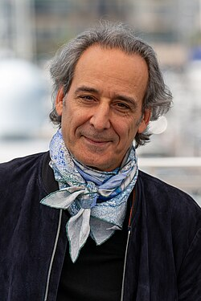

# Alexandre Desplat

## Biografía

Alexandre Michel Gérard Desplat (francés: [a.lɛk.sɑdʁ dɛs.pla], París, 23 de agosto de 1961) es un compositor de cine franco-griego. Ha ganado dos Premios Óscar por sus bandas sonoras para las películas El Gran Hotel Budapest y La forma del agua, y ha recibido once nominaciones al Óscar, nueve nominaciones al César (tres ganadoras), doce nominaciones al BAFTA (tres ganadoras), quince nominaciones a los Globos de Oro (dos ganadoras) y ocho nominaciones a los Grammy (dos ganadoras). Desplat ha trabajado en una variedad de películas, incluyendo éxitos independientes y comerciales como The Queen, La brújula dorada, El curioso caso de Benjamin Button, The Twilight Saga: New Moon, Fantástico Mr. Fox, Harry Potter y las Reliquias de la Muerte: parte 1 y Parte 2, El discurso del rey, La chica danesa, Moonrise Kingdom, Argo, El origen de los guardianes, La noche más oscura, Godzilla, The Imitation Game, Unbroken, Isla de perros, Mujercitas, Pinocho de Guillermo del Toro y Asteroid City.​​

## Estilo musical

Alexandre Desplat, un verdadero cinéfilo, ha desarrollado su propio estilo a través de un enfoque único que crea un tono y una identidad especiales para la música de cada película. Venerado por su extraordinaria carrera como compositor de música cinematográfica, ha creado bandas sonoras originales para más de 130 películas y ha recibido numerosos premios, incluidos dos Premios de la Academia, tres BAFTA, tres Premios César, dos Globos de Oro, dos premios GRAMMY y muchas otras nominaciones y distinciones. Desplat ha colaborado con directores como Wes Anderson, Kathryn Bigelow, George Clooney, David Fincher, Stephen Frears, Greta Gerwig, Terence Malick, Roman Polanski y Guillermo del Toro.

## Anécdotas y curiosidades

2 Subsección de cambio de carrera 2.1 1990–2009 2.2 2010–2019

Compositor: Desplat, Alexandre Sello: WaterTower Duración: 60 minutos Información de la película Título original: Godzilla Director: Gareth Edwards Nacionalidad: EE UU Año: 2014 Argumento Un monstruo marino, producto de mutaciones radioactivas, se enfrenta a malvadas criaturas que, animadas por la arrogancia científica de la humanidad, amenazan la vida de los hombres. Premios IFMCA: 1 nominación Saturn: 1 nominación Compositor: Desplat, Alexandre Sello: WaterTower Duración: 60 minutos

## Top 10 bandas sonoras

1. ***The Imitation Game (Título en España: The Imitation Game (Descifrando Enigma))***
    * **Póster:** [link](121_alexandre_desplat/posters/poster_the_imitation_game_2014.jpg)
2. ***Frankenstein (Título en España: Frankenstein)***
    * **Póster:** [link](121_alexandre_desplat/posters/poster_frankenstein_2025.jpg)
3. ***The Grand Budapest Hotel (Título en España: El gran hotel Budapest)***
    * **Póster:** [link](121_alexandre_desplat/posters/poster_the_grand_budapest_hotel_2014.jpg)
4. ***The Curious Case of Benjamin Button (Título en España: El curioso caso de Benjamin Button)***
    * **Póster:** [link](121_alexandre_desplat/posters/poster_the_curious_case_of_benjamin_button_2008.jpg)
5. ***The Shape of Water (Título en España: La forma del agua)***
    * **Póster:** [link](121_alexandre_desplat/posters/poster_the_shape_of_water_2017.jpg)
6. ***Isle of Dogs (Título en España: Isla de perros)***
    * **Póster:** [link](121_alexandre_desplat/posters/poster_isle_of_dogs_2018.jpg)
7. ***Little Women (Título en España: Mujercitas)***
    * **Póster:** [link](121_alexandre_desplat/posters/poster_little_women_2019.jpg)
8. ***Fantastic Mr. Fox (Título en España: Fantástico Sr. Fox)***
    * **Póster:** [link](121_alexandre_desplat/posters/poster_fantastic_mr_fox_2009.jpg)
9. ***The King's Speech (Título en España: El discurso del rey)***
    * **Póster:** [link](121_alexandre_desplat/posters/poster_the_king_s_speech_2010.jpg)
10. ***Argo (Título en España: Argo)***
    * **Póster:** [link](121_alexandre_desplat/posters/poster_argo_2012.jpg)

## Filmografía completa

- Ki lo sa? (Título en España: Ki lo sa?) (1986) · [Póster](121_alexandre_desplat/posters/poster_ki_lo_sa_1986.jpg)
- Family Express (Título en España: Family Express) (1991) · [Póster](121_alexandre_desplat/posters/poster_family_express_1991.jpg)
- Lapse of Memory (Título en España: Lapse of Memory) (1991) · [Póster](121_alexandre_desplat/posters/poster_lapse_of_memory_1991.jpg)
- Au nom du père et du fils (Título en España: Au nom du père et du fils) (1992) · [Póster](121_alexandre_desplat/posters/poster_au_nom_du_p_re_et_du_fils_1992.jpg)
- Papa veut pas que je t'épouse (Título en España: Papa veut pas que je t'épouse) (1992) · [Póster](121_alexandre_desplat/posters/poster_papa_veut_pas_que_je_t_pouse_1992.jpg)
- Le Tronc (Título en España: Le Tronc) (1993) · [Póster](121_alexandre_desplat/posters/poster_le_tronc_1993.jpg)
- The Hour of the Pig (Título en España: The Hour of the Pig) (1993) · [Póster](121_alexandre_desplat/posters/poster_the_hour_of_the_pig_1993.jpg)
- La Vienne Dynamique (Título en España: La Vienne Dynamique) (1994) · [Póster](121_alexandre_desplat/posters/poster_la_vienne_dynamique_1994.jpg)
- Le paradis absolument (Título en España: Le paradis absolument) (1994) · [Póster](121_alexandre_desplat/posters/poster_le_paradis_absolument_1994.jpg)
- Regarde les hommes tomber (Título en España: Regarde les hommes tomber) (1994) · [Póster](121_alexandre_desplat/posters/poster_regarde_les_hommes_tomber_1994.jpg)
- Le fils de Paul (Título en España: Le fils de Paul) (1995) · [Póster](121_alexandre_desplat/posters/poster_le_fils_de_paul_1995.jpg)
- Le Cri de la soie (Título en España: El placer de la seda) (1996) · [Póster](121_alexandre_desplat/posters/poster_le_cri_de_la_soie_1996.jpg)
- Le Montreur de boxe (Título en España: Le Montreur de boxe) (1996) · [Póster](121_alexandre_desplat/posters/poster_le_montreur_de_boxe_1996.jpg)
- Love, etc. (Título en España: Love, etc. (amor y demas)) (1996) · [Póster](121_alexandre_desplat/posters/poster_love_etc_1996.jpg)
- Passage à l'acte (Título en España: Passage à l'acte) (1996) · [Póster](121_alexandre_desplat/posters/poster_passage_l_acte_1996.jpg)
- Tout ce qui brille (Título en España: Tout ce qui brille) (1996) · [Póster](121_alexandre_desplat/posters/poster_tout_ce_qui_brille_1996.jpg)
- Un héros très discret (Título en España: Un héroe muy discreto) (1996) · [Póster](121_alexandre_desplat/posters/poster_un_h_ros_tr_s_discret_1996.jpg)
- La Voisine (Título en España: La Voisine) (1997) · [Póster](121_alexandre_desplat/posters/poster_la_voisine_1997.jpg)
- Un petit grain de folie (Título en España: Un petit grain de folie) (1997) · [Póster](121_alexandre_desplat/posters/poster_un_petit_grain_de_folie_1997.jpg)
- Atilano, presidente (Título en España: Atilano, presidente) (1998) · [Póster](121_alexandre_desplat/posters/poster_atilano_presidente_1998.jpg)
- The Revengers' Comedies (Título en España: El juego de la venganza) (1998) · [Póster](121_alexandre_desplat/posters/poster_the_revengers_comedies_1998.jpg)
- Une chance sur deux (Título en España: Los profesionales) (1998) · [Póster](121_alexandre_desplat/posters/poster_une_chance_sur_deux_1998.jpg)
- Une minute de silence (Título en España: Une minute de silence) (1998) · [Póster](121_alexandre_desplat/posters/poster_une_minute_de_silence_1998.jpg)
- Le château des singes (Título en España: El castillo de los monos) (1999) · [Póster](121_alexandre_desplat/posters/poster_le_ch_teau_des_singes_1999.jpg)
- Juliette (Título en España: Juliette) (1999) · [Póster](121_alexandre_desplat/posters/poster_juliette_1999.jpg)
- Retour à Fonteyne (Título en España: Retour à Fonteyne) (1999) · [Póster](121_alexandre_desplat/posters/poster_retour_fonteyne_1999.jpg)
- Toni (Título en España: Toni) (1999) · [Póster](121_alexandre_desplat/posters/poster_toni_1999.jpg)
- Amazone (Título en España: Amazone) (2000) · [Póster](121_alexandre_desplat/posters/poster_amazone_2000.jpg)
- The Luzhin Defence (Título en España: La defensa Luzhin) (2000) · [Póster](121_alexandre_desplat/posters/poster_the_luzhin_defence_2000.jpg)
- Les ritaliens (Título en España: Les ritaliens) (2000) · [Póster](121_alexandre_desplat/posters/poster_les_ritaliens_2000.jpg)
- Rien à faire (Título en España: Nada que hacer) (2000) · [Póster](121_alexandre_desplat/posters/poster_rien_faire_2000.jpg)
- Vive nous! (Título en España: Vive nous!) (2000) · [Póster](121_alexandre_desplat/posters/poster_vive_nous_2000.jpg)
- Barnie et ses petites contrariétés (Título en España: Barnie et ses petites contrariétés) (2001) · [Póster](121_alexandre_desplat/posters/poster_barnie_et_ses_petites_contrari_t_s_2001.jpg)
- Home Sweet Hoboken (Título en España: Home Sweet Hoboken) (2001) · [Póster](https://example.com/placeholder.jpg)
- Sur mes lèvres (Título en España: Lee mis labios) (2001) · [Póster](121_alexandre_desplat/posters/poster_sur_mes_l_vres_2001.jpg)
- Les portes de la gloire (Título en España: Les portes de la gloire) (2001) · [Póster](121_alexandre_desplat/posters/poster_les_portes_de_la_gloire_2001.jpg)
- Mauvais genres (Título en España: Mauvais genres) (2001) · [Póster](121_alexandre_desplat/posters/poster_mauvais_genres_2001.jpg)
- Reines d'un jour (Título en España: Reines d'un jour) (2001) · [Póster](121_alexandre_desplat/posters/poster_reines_d_un_jour_2001.jpg)
- Le passage du bac (Título en España: Le passage du bac) (2002) · [Póster](121_alexandre_desplat/posters/poster_le_passage_du_bac_2002.jpg)
- Madame Sans-Gêne (Título en España: Madame Sans-Gêne) (2002) · [Póster](121_alexandre_desplat/posters/poster_madame_sans_g_ne_2002.jpg)
- Michel Audiard et le mystère du triangle des Bermudes (Título en España: Michel Audiard et le mystère du triangle des Bermudes) (2002) · [Póster](121_alexandre_desplat/posters/poster_michel_audiard_et_le_myst_re_du_triangle_des_bermudes_2002.jpg)
- Nid de guêpes (Título en España: Nido de avispas) (2002) · [Póster](121_alexandre_desplat/posters/poster_nid_de_gu_pes_2002.jpg)
- Virus au paradis (Título en España: Gripe Aviar Virus mortal) (2003) · [Póster](121_alexandre_desplat/posters/poster_virus_au_paradis_2003.jpg)
- Inquiétudes (Título en España: Inquiétudes) (2003) · [Póster](121_alexandre_desplat/posters/poster_inqui_tudes_2003.jpg)
- Girl with a Pearl Earring (Título en España: La joven de la perla) (2003) · [Póster](121_alexandre_desplat/posters/poster_girl_with_a_pearl_earring_2003.jpg)
- Les Corps impatients (Título en España: Les Corps impatients) (2003) · [Póster](121_alexandre_desplat/posters/poster_les_corps_impatients_2003.jpg)
- Les baisers des autres (Título en España: Les baisers des autres) (2003) · [Póster](121_alexandre_desplat/posters/poster_les_baisers_des_autres_2003.jpg)
- Les beaux jours (Título en España: Les beaux jours) (2003) · [Póster](121_alexandre_desplat/posters/poster_les_beaux_jours_2003.jpg)
- Rire et Châtiment (Título en España: Rire et Châtiment) (2003) · [Póster](121_alexandre_desplat/posters/poster_rire_et_ch_timent_2003.jpg)
- Le Pacte du silence (Título en España: Silencio pactado) (2003) · [Póster](121_alexandre_desplat/posters/poster_le_pacte_du_silence_2003.jpg)
- Stormviðri (Título en España: Stormy weather) (2003) · [Póster](121_alexandre_desplat/posters/poster_stormvi_ri_2003.jpg)
- Tristan (Título en España: Tristan) (2003) · [Póster](121_alexandre_desplat/posters/poster_tristan_2003.jpg)
- L'Enquête corse (Título en España: El archivo corso) (2004) · [Póster](121_alexandre_desplat/posters/poster_l_enqu_te_corse_2004.jpg)
- Le pays des enfants perdus (Título en España: Le pays des enfants perdus) (2004) · [Póster](121_alexandre_desplat/posters/poster_le_pays_des_enfants_perdus_2004.jpg)
- Birth (Título en España: Reencarnación) (2004) · [Póster](121_alexandre_desplat/posters/poster_birth_2004.jpg)
- Casanova (Título en España: Casanova) (2005) · [Póster](121_alexandre_desplat/posters/poster_casanova_2005.jpg)
- De battre mon cœur s'est arrêté (Título en España: De latir mi  corazón se ha parado) (2005) · [Póster](121_alexandre_desplat/posters/poster_de_battre_mon_c_ur_s_est_arr_t_2005.jpg)
- Hostage (Título en España: Hostage) (2005) · [Póster](121_alexandre_desplat/posters/poster_hostage_2005.jpg)
- The Upside of Anger (Título en España: Más allá del odio) (2005) · [Póster](121_alexandre_desplat/posters/poster_the_upside_of_anger_2005.jpg)
- Syriana (Título en España: Syriana) (2005) · [Póster](121_alexandre_desplat/posters/poster_syriana_2005.jpg)
- Tu vas rire, mais je te quitte (Título en España: Tu vas rire, mais je te quitte) (2005) · [Póster](121_alexandre_desplat/posters/poster_tu_vas_rire_mais_je_te_quitte_2005.jpg)
- Une aventure (Título en España: Une aventure) (2005) · [Póster](121_alexandre_desplat/posters/poster_une_aventure_2005.jpg)
- Quand j'étais chanteur (Título en España: Chanson d'amour) (2006) · [Póster](121_alexandre_desplat/posters/poster_quand_j_tais_chanteur_2006.jpg)
- La Doublure (Título en España: El juego de los idiotas) (2006) · [Póster](121_alexandre_desplat/posters/poster_la_doublure_2006.jpg)
- The Painted Veil (Título en España: El velo pintado) (2006) · [Póster](121_alexandre_desplat/posters/poster_the_painted_veil_2006.jpg)
- Firewall (Título en España: Firewall) (2006) · [Póster](121_alexandre_desplat/posters/poster_firewall_2006.jpg)
- The Alibi (Título en España: The Alibi: La coartada) (2006) · [Póster](121_alexandre_desplat/posters/poster_the_alibi_2006.jpg)
- The Queen (Título en España: The Queen (La Reina)) (2006) · [Póster](121_alexandre_desplat/posters/poster_the_queen_2006.jpg)
- 色‧戒 (Título en España: Deseo, peligro) (2007) · [Póster](121_alexandre_desplat/posters/poster_poster_2007.jpg)
- L'Ennemi intime (Título en España: L'Ennemi intime) (2007) · [Póster](121_alexandre_desplat/posters/poster_l_ennemi_intime_2007.jpg)
- The Golden Compass (Título en España: La brújula dorada) (2007) · [Póster](121_alexandre_desplat/posters/poster_the_golden_compass_2007.jpg)
- Michou d'Auber (Título en España: Michou d'Auber) (2007) · [Póster](121_alexandre_desplat/posters/poster_michou_d_auber_2007.jpg)
- Mr. Magorium's Wonder Emporium (Título en España: Mr. Magorium y su tienda mágica) (2007) · [Póster](121_alexandre_desplat/posters/poster_mr_magorium_s_wonder_emporium_2007.jpg)
- Ségo et Sarko sont dans un bateau... (Título en España: Ségo et Sarko sont dans un bateau...) (2007) · [Póster](121_alexandre_desplat/posters/poster_s_go_et_sarko_sont_dans_un_bateau_2007.jpg)
- The Curious Case of Benjamin Button (Título en España: El curioso caso de Benjamin Button) (2008) · [Póster](121_alexandre_desplat/posters/poster_the_curious_case_of_benjamin_button_2008.jpg)
- Largo Winch (Título en España: Largo Winch) (2008) · [Póster](121_alexandre_desplat/posters/poster_largo_winch_2008.jpg)
- Afterwards (Título en España: Premonición) (2008) · [Póster](121_alexandre_desplat/posters/poster_afterwards_2008.jpg)
- Chéri (Título en España: Chéri) (2009) · [Póster](121_alexandre_desplat/posters/poster_ch_ri_2009.jpg)
- Coco avant Chanel (Título en España: Coco, de la rebeldía a la leyenda de Chanel) (2009) · [Póster](121_alexandre_desplat/posters/poster_coco_avant_chanel_2009.jpg)
- L'Armée du crime (Título en España: El ejército del crimen) (2009) · [Póster](121_alexandre_desplat/posters/poster_l_arm_e_du_crime_2009.jpg)
- Fantastic Mr. Fox (Título en España: Fantástico Sr. Fox) (2009) · [Póster](121_alexandre_desplat/posters/poster_fantastic_mr_fox_2009.jpg)
- Julie & Julia (Título en España: Julie y Julia) (2009) · [Póster](121_alexandre_desplat/posters/poster_julie_julia_2009.jpg)
- The Twilight Saga: New Moon (Título en España: La saga Crepúsculo: Luna nueva) (2009) · [Póster](121_alexandre_desplat/posters/poster_the_twilight_saga_new_moon_2009.jpg)
- The Curious Birth of Benjamin Button (Título en España: The Curious Birth of Benjamin Button) (2009) · [Póster](121_alexandre_desplat/posters/poster_the_curious_birth_of_benjamin_button_2009.jpg)
- Un prophète (Título en España: Un profeta) (2009) · [Póster](121_alexandre_desplat/posters/poster_un_proph_te_2009.jpg)
- The King's Speech (Título en España: El discurso del rey) (2010) · [Póster](121_alexandre_desplat/posters/poster_the_king_s_speech_2010.jpg)
- The Ghost Writer (Título en España: El escritor) (2010) · [Póster](121_alexandre_desplat/posters/poster_the_ghost_writer_2010.jpg)
- Harry Potter and the Deathly Hallows: Part 1 (Título en España: Harry Potter y las Reliquias de la Muerte - Parte 1) (2010) · [Póster](121_alexandre_desplat/posters/poster_harry_potter_and_the_deathly_hallows_part_1_2010.jpg)
- The Special Relationship (Título en España: La relacion especial) (2010) · [Póster](121_alexandre_desplat/posters/poster_the_special_relationship_2010.jpg)
- Tamara Drewe (Título en España: Tamara Drewe) (2010) · [Póster](121_alexandre_desplat/posters/poster_tamara_drewe_2010.jpg)
- The Tree of Life (Título en España: El árbol de la vida) (2011) · [Póster](121_alexandre_desplat/posters/poster_the_tree_of_life_2011.jpg)
- Exploring 'The Tree of Life' (Título en España: Exploring 'The Tree of Life') (2011) · [Póster](121_alexandre_desplat/posters/poster_exploring_the_tree_of_life_2011.jpg)
- Harry Potter and the Deathly Hallows: Part 2 (Título en España: Harry Potter y las Reliquias de la Muerte - Parte 2) (2011) · [Póster](121_alexandre_desplat/posters/poster_harry_potter_and_the_deathly_hallows_part_2_2011.jpg)
- La Fille du puisatier (Título en España: La Fille du puisatier) (2011) · [Póster](121_alexandre_desplat/posters/poster_la_fille_du_puisatier_2011.jpg)
- Largo Winch II (Título en España: Largo Winch: Conspiración en Birmania) (2011) · [Póster](121_alexandre_desplat/posters/poster_largo_winch_ii_2011.jpg)
- The Ides of March (Título en España: Los idus de marzo) (2011) · [Póster](121_alexandre_desplat/posters/poster_the_ides_of_march_2011.jpg)
- My Week with Marilyn (Título en España: Mi semana con Marilyn) (2011) · [Póster](121_alexandre_desplat/posters/poster_my_week_with_marilyn_2011.jpg)
- Extremely Loud & Incredibly Close (Título en España: Tan fuerte, tan cerca) (2011) · [Póster](121_alexandre_desplat/posters/poster_extremely_loud_incredibly_close_2011.jpg)
- Carnage (Título en España: Un dios salvaje) (2011) · [Póster](121_alexandre_desplat/posters/poster_carnage_2011.jpg)
- A Better Life (Título en España: Una vida mejor) (2011) · [Póster](121_alexandre_desplat/posters/poster_a_better_life_2011.jpg)
- A Therapy (Título en España: A Therapy) (2012) · [Póster](121_alexandre_desplat/posters/poster_a_therapy_2012.jpg)
- Argo (Título en España: Argo) (2012) · [Póster](121_alexandre_desplat/posters/poster_argo_2012.jpg)
- Cloclo (Título en España: Cloclo) (2012) · [Póster](121_alexandre_desplat/posters/poster_cloclo_2012.jpg)
- Roman Polanski: A Film Memoir (Título en España: Confesiones de Roman Polanski) (2012) · [Póster](121_alexandre_desplat/posters/poster_roman_polanski_a_film_memoir_2012.jpg)
- De rouille et d'os (Título en España: De óxido y hueso) (2012) · [Póster](121_alexandre_desplat/posters/poster_de_rouille_et_d_os_2012.jpg)
- Rise of the Guardians (Título en España: El origen de los guardianes) (2012) · [Póster](121_alexandre_desplat/posters/poster_rise_of_the_guardians_2012.jpg)
- Zero Dark Thirty (Título en España: La noche más oscura) (2012) · [Póster](121_alexandre_desplat/posters/poster_zero_dark_thirty_2012.jpg)
- Moonrise Kingdom (Título en España: Moonrise Kingdom) (2012) · [Póster](121_alexandre_desplat/posters/poster_moonrise_kingdom_2012.jpg)
- Reality (Título en España: Reality) (2012) · [Póster](121_alexandre_desplat/posters/poster_reality_2012.jpg)
- Renoir (Título en España: Renoir) (2012) · [Póster](121_alexandre_desplat/posters/poster_renoir_2012.jpg)
- Fanny (Título en España: Fanny) (2013) · [Póster](121_alexandre_desplat/posters/poster_fanny_2013.jpg)
- La Vénus à la fourrure (Título en España: La Venus de las pieles) (2013) · [Póster](121_alexandre_desplat/posters/poster_la_v_nus_la_fourrure_2013.jpg)
- Marius (Título en España: Marius) (2013) · [Póster](121_alexandre_desplat/posters/poster_marius_2013.jpg)
- Philomena (Título en España: Philomena) (2013) · [Póster](121_alexandre_desplat/posters/poster_philomena_2013.jpg)
- Zulu (Título en España: Zulu) (2013) · [Póster](121_alexandre_desplat/posters/poster_zulu_2013.jpg)
- The Grand Budapest Hotel (Título en España: El gran hotel Budapest) (2014) · [Póster](121_alexandre_desplat/posters/poster_the_grand_budapest_hotel_2014.jpg)
- Godzilla (Título en España: Godzilla) (2014) · [Póster](121_alexandre_desplat/posters/poster_godzilla_2014.jpg)
- Unbroken (Título en España: Invencible (Unbroken)) (2014) · [Póster](121_alexandre_desplat/posters/poster_unbroken_2014.jpg)
- The Monuments Men (Título en España: Operación Monumento) (2014) · [Póster](121_alexandre_desplat/posters/poster_the_monuments_men_2014.jpg)
- The Imitation Game (Título en España: The Imitation Game (Descifrando Enigma)) (2014) · [Póster](121_alexandre_desplat/posters/poster_the_imitation_game_2014.jpg)
- Il racconto dei racconti (Título en España: El cuento de los cuentos) (2015) · [Póster](121_alexandre_desplat/posters/poster_il_racconto_dei_racconti_2015.jpg)
- The Danish Girl (Título en España: La chica danesa) (2015) · [Póster](121_alexandre_desplat/posters/poster_the_danish_girl_2015.jpg)
- Suffragette (Título en España: Sufragistas) (2015) · [Póster](121_alexandre_desplat/posters/poster_suffragette_2015.jpg)
- Suite Française (Título en España: Suite francesa) (2015) · [Póster](121_alexandre_desplat/posters/poster_suite_fran_aise_2015.jpg)
- Every Thing Will Be Fine (Título en España: Todo saldrá bien) (2015) · [Póster](121_alexandre_desplat/posters/poster_every_thing_will_be_fine_2015.jpg)
- Une histoire de fou (Título en España: Una historia de locos) (2015) · [Póster](121_alexandre_desplat/posters/poster_une_histoire_de_fou_2015.jpg)
- 7:19 (Título en España: 7:19) (2016) · [Póster](121_alexandre_desplat/posters/poster_7_19_2016.jpg)
- Alone in Berlin (Título en España: Cartas de Berlín) (2016) · [Póster](121_alexandre_desplat/posters/poster_alone_in_berlin_2016.jpg)
- Florence Foster Jenkins (Título en España: Florence Foster Jenkins) (2016) · [Póster](121_alexandre_desplat/posters/poster_florence_foster_jenkins_2016.jpg)
- L'Odyssée (Título en España: Jacques) (2016) · [Póster](121_alexandre_desplat/posters/poster_l_odyss_e_2016.jpg)
- The Light Between Oceans (Título en España: La luz entre los océanos) (2016) · [Póster](121_alexandre_desplat/posters/poster_the_light_between_oceans_2016.jpg)
- The Secret Life of Pets (Título en España: Mascotas) (2016) · [Póster](121_alexandre_desplat/posters/poster_the_secret_life_of_pets_2016.jpg)
- American Pastoral (Título en España: Pastoral americana) (2016) · [Póster](121_alexandre_desplat/posters/poster_american_pastoral_2016.jpg)
- Réparer les vivants (Título en España: Reparar a los vivos) (2016) · [Póster](121_alexandre_desplat/posters/poster_r_parer_les_vivants_2016.jpg)
- 12 jours (Título en España: 12 días) (2017) · [Póster](121_alexandre_desplat/posters/poster_12_jours_2017.jpg)
- D'après une histoire vraie (Título en España: Basada en hechos reales) (2017) · [Póster](121_alexandre_desplat/posters/poster_d_apr_s_une_histoire_vraie_2017.jpg)
- Espèces menacées (Título en España: Espèces menacées) (2017) · [Póster](121_alexandre_desplat/posters/poster_esp_ces_menac_es_2017.jpg)
- The Shape of Water (Título en España: La forma del agua) (2017) · [Póster](121_alexandre_desplat/posters/poster_the_shape_of_water_2017.jpg)
- Score: A Film Music Documentary (Título en España: Score: Compositores de Oscar) (2017) · [Póster](121_alexandre_desplat/posters/poster_score_a_film_music_documentary_2017.jpg)
- Suburbicon (Título en España: Suburbicon) (2017) · [Póster](121_alexandre_desplat/posters/poster_suburbicon_2017.jpg)
- Valerian and the City of a Thousand Planets (Título en España: Valerian y la ciudad de los mil planetas) (2017) · [Póster](121_alexandre_desplat/posters/poster_valerian_and_the_city_of_a_thousand_planets_2017.jpg)
- Isle of Dogs (Título en España: Isla de perros) (2018) · [Póster](121_alexandre_desplat/posters/poster_isle_of_dogs_2018.jpg)
- Kursk (Título en España: Kursk) (2018) · [Póster](121_alexandre_desplat/posters/poster_kursk_2018.jpg)
- Le cinéma d'Alexandre Desplat (Título en España: Le cinéma d'Alexandre Desplat) (2018) · [Póster](121_alexandre_desplat/posters/poster_le_cin_ma_d_alexandre_desplat_2018.jpg)
- The Sisters Brothers (Título en España: Los hermanos Sisters) (2018) · [Póster](121_alexandre_desplat/posters/poster_the_sisters_brothers_2018.jpg)
- Operation Finale (Título en España: Operación final) (2018) · [Póster](121_alexandre_desplat/posters/poster_operation_finale_2018.jpg)
- Adults in the Room (Título en España: Comportarse como adultos) (2019) · [Póster](121_alexandre_desplat/posters/poster_adults_in_the_room_2019.jpg)
- J'accuse (Título en España: El oficial y el espía) (2019) · [Póster](121_alexandre_desplat/posters/poster_j_accuse_2019.jpg)
- The Secret Life of Pets 2 (Título en España: Mascotas 2) (2019) · [Póster](121_alexandre_desplat/posters/poster_the_secret_life_of_pets_2_2019.jpg)
- Little Women (Título en España: Mujercitas) (2019) · [Póster](121_alexandre_desplat/posters/poster_little_women_2019.jpg)
- Bandes Originales: Alexandre Desplat (Título en España: Bandes Originales: Alexandre Desplat) (2020) · [Póster](121_alexandre_desplat/posters/poster_bandes_originales_alexandre_desplat_2020.jpg)
- The Midnight Sky (Título en España: Cielo de medianoche) (2020) · [Póster](121_alexandre_desplat/posters/poster_the_midnight_sky_2020.jpg)
- Eiffel (Título en España: Eiffel) (2021) · [Póster](121_alexandre_desplat/posters/poster_eiffel_2021.jpg)
- Jacques Audiard, le cinéma à cœur (Título en España: Jacques Audiard, le cinéma à cœur) (2021) · [Póster](121_alexandre_desplat/posters/poster_jacques_audiard_le_cin_ma_c_ur_2021.jpg)
- The French Dispatch of the Liberty, Kansas Evening Sun (Título en España: La crónica francesa) (2021) · [Póster](121_alexandre_desplat/posters/poster_the_french_dispatch_of_the_liberty_kansas_evening_sun_2021.jpg)
- Lui (Título en España: Lui) (2021) · [Póster](121_alexandre_desplat/posters/poster_lui_2021.jpg)
- A Cooler Climate (Título en España: A Cooler Climate) (2022) · [Póster](121_alexandre_desplat/posters/poster_a_cooler_climate_2022.jpg)
- Coupez ! (Título en España: Corten!) (2022) · [Póster](121_alexandre_desplat/posters/poster_coupez_2022.jpg)
- The Outfit (Título en España: El sastre de la mafia) (2022) · [Póster](121_alexandre_desplat/posters/poster_the_outfit_2022.jpg)
- Guillermo del Toro's Pinocchio: Handcarved Cinema (Título en España: Guillermo del Toro's Pinocchio: Handcarved Cinema) (2022) · [Póster](121_alexandre_desplat/posters/poster_guillermo_del_toro_s_pinocchio_handcarved_cinema_2022.jpg)
- Killing Me Softly with His Songs (Título en España: Killing Me Softly with His Songs) (2022) · [Póster](121_alexandre_desplat/posters/poster_killing_me_softly_with_his_songs_2022.jpg)
- Guillermo del Toro's Pinocchio (Título en España: Pinocho de Guillermo del Toro) (2022) · [Póster](121_alexandre_desplat/posters/poster_guillermo_del_toro_s_pinocchio_2022.jpg)
- The Lost King (Título en España: The Lost King) (2022) · [Póster](121_alexandre_desplat/posters/poster_the_lost_king_2022.jpg)
- Asteroid City (Título en España: Asteroid City) (2023) · [Póster](121_alexandre_desplat/posters/poster_asteroid_city_2023.jpg)
- NYAD (Título en España: Nyad) (2023) · [Póster](121_alexandre_desplat/posters/poster_nyad_2023.jpg)
- Tirailleurs (Título en España: Padre y soldado) (2023) · [Póster](121_alexandre_desplat/posters/poster_tirailleurs_2023.jpg)
- The Boys in the Boat (Título en España: Remando como un solo hombre) (2023) · [Póster](121_alexandre_desplat/posters/poster_the_boys_in_the_boat_2023.jpg)
- The Palace (Título en España: The Palace) (2023) · [Póster](121_alexandre_desplat/posters/poster_the_palace_2023.jpg)
- Elyas (Título en España: Elyas el protector) (2024) · [Póster](121_alexandre_desplat/posters/poster_elyas_2024.jpg)
- Unstoppable (Título en España: Imparable: La historia de Anthony Robles) (2024) · [Póster](121_alexandre_desplat/posters/poster_unstoppable_2024.jpg)
- The Piano Lesson (Título en España: La lección de piano) (2024) · [Póster](121_alexandre_desplat/posters/poster_the_piano_lesson_2024.jpg)
- La Plus Précieuse des marchandises (Título en España: La mercancía más preciosa) (2024) · [Póster](121_alexandre_desplat/posters/poster_la_plus_pr_cieuse_des_marchandises_2024.jpg)
- Lee (Título en España: Lee Miller) (2024) · [Póster](121_alexandre_desplat/posters/poster_lee_2024.jpg)
- Alexandre Desplat – Le Concert symphonique au cinéma (Título en España: Alexandre Desplat – Le Concert symphonique au cinéma) (2025) · [Póster](121_alexandre_desplat/posters/poster_alexandre_desplat_le_concert_symphonique_au_cin_ma_2025.jpg)
- Eagles of the Republic (Título en España: Eagles of the Republic) (2025) · [Póster](121_alexandre_desplat/posters/poster_eagles_of_the_republic_2025.jpg)
- L'Homme qui rétrécit (Título en España: El hombre menguante) (2025) · [Póster](121_alexandre_desplat/posters/poster_l_homme_qui_r_tr_cit_2025.jpg)
- Frankenstein (Título en España: Frankenstein) (2025) · [Póster](121_alexandre_desplat/posters/poster_frankenstein_2025.jpg)
- Frankenstein: The Anatomy Lesson (Título en España: Frankenstein: Una lección de anatomía) (2025) · [Póster](121_alexandre_desplat/posters/poster_frankenstein_the_anatomy_lesson_2025.jpg)
- Jurassic World Rebirth (Título en España: Jurassic World: El renacer) (2025) · [Póster](121_alexandre_desplat/posters/poster_jurassic_world_rebirth_2025.jpg)
- The Phoenician Scheme (Título en España: La trama fenicia) (2025) · [Póster](121_alexandre_desplat/posters/poster_the_phoenician_scheme_2025.jpg)
- Montage: Great Film Composers and The Piano (Título en España: Montage: Great Film Composers and The Piano) · [Póster](121_alexandre_desplat/posters/poster_montage_great_film_composers_and_the_piano.jpg)
- Nino (Título en España: Nino) · [Póster](121_alexandre_desplat/posters/poster_nino.jpg)

## Premios y nominaciones

* 2004 – Premio de Cine Europeo al Mejor Compositor – por *Girl with a Pearl Earring (Título en España: La joven de la perla)* – (Nominación)
* 2007 – Premio de Cine Europeo al Mejor Compositor – por *The Queen (Título en España: The Queen (La Reina))* – (Ganador)
* 2007 – Premio de Cine Europeo al Mejor Compositor – por *The Queen (Título en España: The Queen (La Reina))* – (Nominación)
* 2007 – Premio de la Academia a la mejor banda sonora original – por *The Queen (Título en España: The Queen (La Reina))* – (Nominación)
* 2009 – Premio de Cine Europeo al Mejor Compositor – por *Coco avant Chanel (Título en España: Coco, de la rebeldía a la leyenda de Chanel)* – (Nominación)
* 2009 – Premio de la Academia a la mejor banda sonora original – por *The Curious Case of Benjamin Button (Título en España: El curioso caso de Benjamin Button)* – (Nominación)
* 2010 – Premio de Cine Europeo al Mejor Compositor – por *The Ghost Writer (Título en España: El escritor)* – (Ganador)
* 2010 – Premio de Cine Europeo al Mejor Compositor – por *The Ghost Writer (Título en España: El escritor)* – (Nominación)
* 2010 – Premio de la Academia a la mejor banda sonora original – por *Fantastic Mr. Fox (Título en España: Fantástico Sr. Fox)* – (Nominación)
* 2011 – Caballero de la Legión de Honor – (Ganador)
* 2011 – Premio de Cine Europeo al Mejor Compositor – por *The King's Speech (Título en España: El discurso del rey)* – (Nominación)
* 2011 – Premio de la Academia a la mejor banda sonora original – por *The King's Speech (Título en España: El discurso del rey)* – (Nominación)
* 2013 – Premio de la Academia a la mejor banda sonora original – por *Argo (Título en España: Argo)* – (Nominación)
* 2014 – Premio de la Academia a la mejor banda sonora original – por *Philomena (Título en España: Philomena)* – (Nominación)
* 2015 – Premio Grammy a la mejor banda sonora para medios visuales – por *The Grand Budapest Hotel (Título en España: El gran hotel Budapest)* – (Ganador)
* 2015 – Premio de la Academia a la mejor banda sonora original – por *The Grand Budapest Hotel (Título en España: El gran hotel Budapest)* – (Ganador)
* 2015 – Premio de la Academia a la mejor banda sonora original – por *The Grand Budapest Hotel (Título en España: El gran hotel Budapest)* – (Nominación)
* 2015 – Premio de la Academia a la mejor banda sonora original – por *The Imitation Game (Título en España: The Imitation Game (Descifrando Enigma))* – (Nominación)
* 2016 – Comendador de Artes y Letras – (Ganador)
* 2016 – Oficial de la Orden Nacional del Mérito – (Ganador)
* 2018 – Premio de la Academia a la mejor banda sonora original – por *The Shape of Water (Título en España: La forma del agua)* – (Ganador)
* 2019 – Premio de la Academia a la mejor banda sonora original – por *Isle of Dogs (Título en España: Isla de perros)* – (Nominación)
* 2020 – Premio César a la mejor música escrita para una película – por *J'accuse (Título en España: El oficial y el espía)* – (Nominación)
* 2020 – Premio de la Academia a la mejor banda sonora original – por *Little Women (Título en España: Mujercitas)* – (Nominación)
* 2023 – Premio César a la mejor música escrita para una película – por *Final Cut: Hölgyeim és uraim (Título en España: Final Cut: Ladies & Gentlemen)* – (Nominación)
* 2023 – Premio Globo de Oro a la mejor banda sonora original – por *Guillermo del Toro's Pinocchio (Título en España: Pinocho de Guillermo del Toro)* – (Nominación)
* Premio de la Academia a la mejor banda sonora original – por *Frankenstein (Título en España: Frankenstein)* – (Nominación)

## Fuentes adicionales

* [MundoBSO](https://www.mundobso.com/bso/godzilla-alexandre-desplat) — site:mundobso.com
* [MundoBSO (2)](https://w.mundobso.com/bso/cartero-siempre-llama-dos-veces-el) — site:mundobso.com
* [MundoBSO (3)](https://www.mundobso.com/bso/mujercitas-alexandre-desplat) — site:mundobso.com
* [Film Score Monthly](https://www.filmscoremonthly.com/daily/article.cfm/articleID/7158/The-Magic-&-Majesty-of-Alexandre-Desplat/) — site:filmscoremonthly.com
* [Film Score Monthly (2)](https://www.filmscoremonthly.com/daily/article.cfm/articleID/5965/) — site:filmscoremonthly.com
* [Film Score Monthly (3)](https://www.filmscoremonthly.com/board/posts.cfm?threadID=160360&forumID=1&archive=0) — site:filmscoremonthly.com
* [SoundtrackCollector](https://www.soundtrackcollector.com/catalog/composerdiscography.php?composerid=1254) — site:soundtrackcollector.com
* [SoundtrackCollector (2)](https://www.soundtrackcollector.com) — site:soundtrackcollector.com
* [SoundtrackCollector (3)](https://www.soundtrackcollector.com/title/77690/Mr.+Magorium's+Wonder+Emporium) — site:soundtrackcollector.com
* [WhatSong](https://www.whatsong.org/movie/valerian-and-the-city-of-a-thousand-planets) — site:whatsong.org
* [WhatSong (2)](https://www.whatsong.org/movie/little-women-2019) — site:whatsong.org
* [WhatSong (3)](https://www.whatsong.org/movie/the-shape-of-water) — site:whatsong.org

## Notas externas

* MundoBSO: Compositor: Desplat, Alexandre Sello: WaterTower Duración: 60 minutos Información de la película Título original: Godzilla Director: Gareth Edwards Nacionalidad: EE UU Año: 2014 Argumento Un monstruo marino, producto de mutaciones radioactivas, se enfrenta a malvadas criaturas que, animadas por la arrogancia científica de la humanidad, amenazan la vida de los hombres. Premios IFMCA: 1 nominación Saturn: 1 nominación Compositor: Desplat, Alexandre Sello: WaterTower Duración: 60 minutos
* MundoBSO (3): Compositor: Desplat, Alexandre Sello: Sony Classical Duración: 64 minutos Información de la película Título original: Little Women Director: Greta Gerwig Nacionalidad: EE UU Año: 2019 Argumento Versión del clásico literario de Alcott con la historia de la matriarca de un clan de adolescentes que está dispuesta a entender todos sus problemas y a resolver sus inquietudes amorosas. Premios Oscar: 1 nominación Globos de oro: 1 nominación Bafta: 1 nominación IFMCA: 1 premio, 1 nominación Compositor: Desplat, Alexandre Sello: Sony Classical Duración: 64 minutos
* SoundtrackCollector (2): 14 de enero - Confesión de un comisionado de policía de Riz Ortolani a la fiscalía 3 de diciembre - Wolf Hall de Debbie Wiseman: El espejo y la luz
* WhatSong: Baltic House Orchestra - Gangster's Paradise (de "Valerian and the City of a Thousand Planets") - Single Charles Bradley - Daptone Super Soul Revue (con Charles Bradley, Antibalas, Sharon Jones & The Dap-Kings, Saun & Starr & The Sugarman 3)
* WhatSong (2): Alexandre Desplat - Mujercitas (banda sonora original de la película) Al abrir, Jo obtiene la aprobación para su libro y corre feliz a casa. Tarjeta de título.
* WhatSong (3): Carmen Miranda - Chica Chica Boom Chic (Remastered) - Canción del tráiler único. Aparece en la película cuando Elisa acude a la criatura por la noche y se desnuda.
* www.colonnesonore.net: Reseñas Cine TV Videojuegos Musicales DVD Libros Contenidos especiales Entrevistas Monografías Dossiers Reportajes Vídeo y Multimedia Filmografías
* soundtrackfest.com: Contenido Artículos Noticias Micronoticias Calendarios Calendario 2019 Calendario 2018 Calendario 2017 Calendarios Calendario 2019 Calendario 2018 Calendario 2017
* www.kusc.org: Pulsa reproducir a continuación para escuchar nuestra función Arts Alive con el compositor Alexandre Desplat. Pulsa reproducir a continuación para escuchar una entrevista ampliada con el compositor Alexandre Desplat.
* www.laphil.com: Iniciar sesión Mi cuenta Mis pedidos Detalles de mi cuenta Cerrar sesión Calendario de conciertos y eventos Información sobre paquetes y entradas Festivales de la temporada 2025/26 Mejore su experiencia
* atlangue.com: Literatura francesa Autores Géneros literarios Movimientos Literarios Obras Literatura francesa Autores Géneros literarios Movimientos Literarios Obras
* goldenglobes.com: The Show Awards Database 2026 Nominaciones Ganadores/Nominados Premio Carol Burnett Premio Cecil B. DeMille Cobertura EN VIVO Cobertura EN VIVO 2024 Cobertura EN VIVO 2025 Cobertura EN VIVO 2026 Cobertura EN VIVO Cobertura EN VIVO 2024 Cobertura EN VIVO 2025 Cobertura EN VIVO 2026
