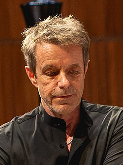

# Harry Gregson-Williams

## Biografía

Harry Dwayne Gregson-Williams (Inglaterra, Reino Unido; 13 de diciembre de 1961) es un compositor inglés hermano del también compositor Rupert Gregson-Williams. Es uno de los compositores más codiciados de Hollywood que ha trabajado en una gran variedad de proyectos de alto perfil, tanto en animación, como en películas con actores reales, o en videojuegos, entre los cuales se encuentra la banda sonora de la película "Las Crónicas de Narnia" o de la saga Metal Gear Solid.

## Estilo musical

Descubrir Colecciones Listas de reproducción Álbumes Estados de ánimo Géneros Sellos Compositores SoundFX

Harry Gregson-Williams lleva treinta años en el cine mostrando su talento en más de ciento veinte proyectos, pero pese a lo mucho demostrado es desconocido para la mayoría de la gente (no para la afición), y es un compositor que no está teniendo suerte en su gran alianza profesional con el director Ridley Scott, la más importante de su carrera. Sus seis colaboraciones han resultado de una manera u otra desastrosas bien artísticamente, por masacre de su música en montaje ( Kingdom of Heaven ), por inserción muy inadecuada de canciones ( The Martian ) o bien por fracaso estrepitoso en taquilla, como Exodus: Gods and Kings (hizo música adicional) y The Last Duel (21). Su ausencia en Napoleon...

## Anécdotas y curiosidades

Harry Gregson-Williams (nacido el 13 de diciembre de 1961) [1] es un compositor, director, orquestador y productor discográfico inglés. Ha compuesto música para videojuegos, televisión y películas como la serie Metal Gear, Spy Game, Kingdom of Heaven, Phone Booth, Man on Fire, Las crónicas de Narnia: El león, la bruja y el armario y el príncipe Caspian, Déjà Vu, X-Men Origins: Wolverine, The Martian, Team America: World Police, Antz, The Tigger Movie, Chicken Run y su secuela, la franquicia Shrek, Sinbad: Legend of the Seven Seas, Flushed Away, Arthur Christmas, Early Man, Catch-22 y Gladiator II. También es el hermano mayor del también compositor Rupert Gregson-Williams.

## Top 10 bandas sonoras

1. ***Shrek (Título en España: Shrek)***
    * **Póster:** [link](122_harry_gregson_williams/posters/poster_shrek_2001.jpg)
2. ***The Martian (Título en España: Marte (The Martian))***
    * **Póster:** [link](122_harry_gregson_williams/posters/poster_the_martian_2015.jpg)
3. ***Shrek 2 (Título en España: Shrek 2)***
    * **Póster:** [link](122_harry_gregson_williams/posters/poster_shrek_2_2004.jpg)
4. ***Kingdom of Heaven (Título en España: El reino de los cielos)***
    * **Póster:** [link](122_harry_gregson_williams/posters/poster_kingdom_of_heaven_2005.jpg)
5. ***Man on Fire (Título en España: El fuego de la venganza)***
    * **Póster:** [link](122_harry_gregson_williams/posters/poster_man_on_fire_2004.jpg)
6. ***Gone Baby Gone (Título en España: Adiós pequeña, adiós)***
    * **Póster:** [link](122_harry_gregson_williams/posters/poster_gone_baby_gone_2007.jpg)
7. ***Cowboys & Aliens (Título en España: Cowboys & Aliens)***
    * **Póster:** [link](122_harry_gregson_williams/posters/poster_cowboys_aliens_2011.jpg)

## Filmografía completa

- White Angel (Título en España: White Angel) (1994) · [Póster](122_harry_gregson_williams/posters/poster_white_angel_1994.jpg)
- Three Miles Up (Título en España: Three Miles Up) (1995) · [Póster](122_harry_gregson_williams/posters/poster_three_miles_up_1995.jpg)
- The Whole Wide World (Título en España: El que caminaba solo) (1996) · [Póster](122_harry_gregson_williams/posters/poster_the_whole_wide_world_1996.jpg)
- Witness Against Hitler (Título en España: Witness Against Hitler) (1996) · [Póster](122_harry_gregson_williams/posters/poster_witness_against_hitler_1996.jpg)
- Deceiver (Título en España: El impostor) (1997) · [Póster](122_harry_gregson_williams/posters/poster_deceiver_1997.jpg)
- The Borrowers (Título en España: Los Borrowers, una gran aventura) (1997) · [Póster](122_harry_gregson_williams/posters/poster_the_borrowers_1997.jpg)
- Smilla's Sense of Snow (Título en España: Smilla, misterio en la nieve) (1997) · [Póster](122_harry_gregson_williams/posters/poster_smilla_s_sense_of_snow_1997.jpg)
- Antz (Título en España: Antz (Hormigaz)) (1998) · [Póster](122_harry_gregson_williams/posters/poster_antz_1998.jpg)
- The Replacement Killers (Título en España: Asesinos de reemplazo) (1998) · [Póster](122_harry_gregson_williams/posters/poster_the_replacement_killers_1998.jpg)
- Enemy of the State (Título en España: Enemigo público) (1998) · [Póster](122_harry_gregson_williams/posters/poster_enemy_of_the_state_1998.jpg)
- Full Body Massage (Título en España: El masaje) (1999) · [Póster](122_harry_gregson_williams/posters/poster_full_body_massage_1999.jpg)
- The Match (Título en España: El partido) (1999) · [Póster](122_harry_gregson_williams/posters/poster_the_match_1999.jpg)
- Light It Up (Título en España: Generación perdida) (1999) · [Póster](122_harry_gregson_williams/posters/poster_light_it_up_1999.jpg)
- Swing Vote (Título en España: Swing Vote) (1999) · [Póster](122_harry_gregson_williams/posters/poster_swing_vote_1999.jpg)
- Chicken Run (Título en España: Chicken Run: Evasión en la granja) (2000) · [Póster](122_harry_gregson_williams/posters/poster_chicken_run_2000.jpg)
- King of the Jungle (Título en España: King of the Jungle) (2000) · [Póster](122_harry_gregson_williams/posters/poster_king_of_the_jungle_2000.jpg)
- The Tigger Movie (Título en España: La película de Tigger) (2000) · [Póster](122_harry_gregson_williams/posters/poster_the_tigger_movie_2000.jpg)
- Whatever Happened to Harold Smith? (Título en España: Whatever Happened to Harold Smith?) (2000) · [Póster](122_harry_gregson_williams/posters/poster_whatever_happened_to_harold_smith_2000.jpg)
- Powder Keg (Título en España: Powder Keg) (2001) · [Póster](122_harry_gregson_williams/posters/poster_powder_keg_2001.jpg)
- Shrek (Título en España: Shrek) (2001) · [Póster](122_harry_gregson_williams/posters/poster_shrek_2001.jpg)
- Spy Game (Título en España: Spy Game (Juego de espías)) (2001) · [Póster](122_harry_gregson_williams/posters/poster_spy_game_2001.jpg)
- Beat the Devil (Título en España: Beat the Devil) (2002) · [Póster](122_harry_gregson_williams/posters/poster_beat_the_devil_2002.jpg)
- Passionada (Título en España: Passionada) (2003) · [Póster](122_harry_gregson_williams/posters/poster_passionada_2003.jpg)
- The Ghost of Lord Farquaad (Título en España: Shrek: El fantasma de Lord Farquaad) (2003) · [Póster](122_harry_gregson_williams/posters/poster_the_ghost_of_lord_farquaad_2003.jpg)
- Sinbad: Legend of the Seven Seas (Título en España: Simbad: La leyenda de los siete mares) (2003) · [Póster](122_harry_gregson_williams/posters/poster_sinbad_legend_of_the_seven_seas_2003.jpg)
- The Rundown (Título en España: Tesoro del Amazonas) (2003) · [Póster](122_harry_gregson_williams/posters/poster_the_rundown_2003.jpg)
- The Making of Metal Gear Solid 2: Sons of Liberty (Título en España: The Making of Metal Gear Solid 2: Sons of Liberty) (2003) · [Póster](122_harry_gregson_williams/posters/poster_the_making_of_metal_gear_solid_2_sons_of_liberty_2003.jpg)
- Veronica Guerin (Título en España: Veronica Guerin) (2003) · [Póster](122_harry_gregson_williams/posters/poster_veronica_guerin_2003.jpg)
- Phone Booth (Título en España: Última llamada) (2003) · [Póster](122_harry_gregson_williams/posters/poster_phone_booth_2003.jpg)
- Bridget Jones: The Edge of Reason (Título en España: Bridget Jones: Sobreviviré) (2004) · [Póster](122_harry_gregson_williams/posters/poster_bridget_jones_the_edge_of_reason_2004.jpg)
- Man on Fire (Título en España: El fuego de la venganza) (2004) · [Póster](122_harry_gregson_williams/posters/poster_man_on_fire_2004.jpg)
- Return to Sender (Título en España: Sentencia de muerte) (2004) · [Póster](122_harry_gregson_williams/posters/poster_return_to_sender_2004.jpg)
- Shrek 2 (Título en España: Shrek 2) (2004) · [Póster](122_harry_gregson_williams/posters/poster_shrek_2_2004.jpg)
- Team America: World Police (Título en España: Team America: La policía del mundo) (2004) · [Póster](122_harry_gregson_williams/posters/poster_team_america_world_police_2004.jpg)
- Domino (Título en España: Domino) (2005) · [Póster](122_harry_gregson_williams/posters/poster_domino_2005.jpg)
- Kingdom of Heaven (Título en España: El reino de los cielos) (2005) · [Póster](122_harry_gregson_williams/posters/poster_kingdom_of_heaven_2005.jpg)
- The Chronicles of Narnia: The Lion, the Witch and the Wardrobe (Título en España: Las crónicas de Narnia: El león, la bruja y el armario) (2005) · [Póster](122_harry_gregson_williams/posters/poster_the_chronicles_of_narnia_the_lion_the_witch_and_the_wardrobe_2005.jpg)
- メタルギアソリッド3 EXISTENCE (Título en España: メタルギアソリッド3 EXISTENCE) (2005) · [Póster](122_harry_gregson_williams/posters/poster_3_existence_2005.jpg)
- Déjà Vu (Título en España: Déjà Vu) (2006) · [Póster](122_harry_gregson_williams/posters/poster_d_j_vu_2006.jpg)
- Flushed Away (Título en España: Ratónpolis) (2006) · [Póster](122_harry_gregson_williams/posters/poster_flushed_away_2006.jpg)
- The Path to Redemption (Título en España: The Path to Redemption) (2006) · [Póster](122_harry_gregson_williams/posters/poster_the_path_to_redemption_2006.jpg)
- Gone Baby Gone (Título en España: Adiós pequeña, adiós) (2007) · [Póster](122_harry_gregson_williams/posters/poster_gone_baby_gone_2007.jpg)
- The Number 23 (Título en España: El número 23) (2007) · [Póster](122_harry_gregson_williams/posters/poster_the_number_23_2007.jpg)
- Seraphim Falls (Título en España: Enfrentados) (2007) · [Póster](122_harry_gregson_williams/posters/poster_seraphim_falls_2007.jpg)
- Shrek the Third (Título en España: Shrek tercero) (2007) · [Póster](122_harry_gregson_williams/posters/poster_shrek_the_third_2007.jpg)
- Shrek the Halls (Título en España: Shreketefeliz Navidad) (2007) · [Póster](122_harry_gregson_williams/posters/poster_shrek_the_halls_2007.jpg)
- The Chronicles of Narnia: Prince Caspian (Título en España: Las crónicas de Narnia: El príncipe Caspian) (2008) · [Póster](122_harry_gregson_williams/posters/poster_the_chronicles_of_narnia_prince_caspian_2008.jpg)
- The Taking of Pelham 1 2 3 (Título en España: Asalto al tren Pelham 123) (2009) · [Póster](122_harry_gregson_williams/posters/poster_the_taking_of_pelham_1_2_3_2009.jpg)
- X-Men Origins: Wolverine (Título en España: X-Men orígenes: Lobezno) (2009) · [Póster](122_harry_gregson_williams/posters/poster_x_men_origins_wolverine_2009.jpg)
- Unstoppable (Título en España: Imparable) (2010) · [Póster](122_harry_gregson_williams/posters/poster_unstoppable_2010.jpg)
- Jolene (Título en España: Jolene) (2010) · [Póster](122_harry_gregson_williams/posters/poster_jolene_2010.jpg)
- Prince of Persia: The Sands of Time (Título en España: Prince of Persia: Las arenas del tiempo) (2010) · [Póster](122_harry_gregson_williams/posters/poster_prince_of_persia_the_sands_of_time_2010.jpg)
- Shrek Forever After (Título en España: Shrek, Felices para siempre) (2010) · [Póster](122_harry_gregson_williams/posters/poster_shrek_forever_after_2010.jpg)
- The Town (Título en España: The Town: Ciudad de ladrones) (2010) · [Póster](122_harry_gregson_williams/posters/poster_the_town_2010.jpg)
- Twelve (Título en España: Twelve) (2010) · [Póster](122_harry_gregson_williams/posters/poster_twelve_2010.jpg)
- Arthur Christmas (Título en España: Arthur Christmas: Operación regalo) (2011) · [Póster](122_harry_gregson_williams/posters/poster_arthur_christmas_2011.jpg)
- Cowboys & Aliens (Título en España: Cowboys & Aliens) (2011) · [Póster](122_harry_gregson_williams/posters/poster_cowboys_aliens_2011.jpg)
- Life in a Day (Título en España: La vida en un día) (2011) · [Póster](122_harry_gregson_williams/posters/poster_life_in_a_day_2011.jpg)
- Total Recall (Título en España: Desafío total) (2012) · [Póster](122_harry_gregson_williams/posters/poster_total_recall_2012.jpg)
- Mr. Pip (Título en España: Mister Pip) (2012) · [Póster](122_harry_gregson_williams/posters/poster_mr_pip_2012.jpg)
- The Equalizer (Título en España: The equalizer (El protector)) (2014) · [Póster](122_harry_gregson_williams/posters/poster_the_equalizer_2014.jpg)
- Blackhat (Título en España: Blackhat: Amenaza en la red) (2015) · [Póster](122_harry_gregson_williams/posters/poster_blackhat_2015.jpg)
- Monkey Kingdom (Título en España: El reino de los monos) (2015) · [Póster](122_harry_gregson_williams/posters/poster_monkey_kingdom_2015.jpg)
- The Martian (Título en España: Marte (The Martian)) (2015) · [Póster](122_harry_gregson_williams/posters/poster_the_martian_2015.jpg)
- Metal Gear Solid: Legacy (Título en España: Metal Gear Solid: Legacy) (2015) · [Póster](122_harry_gregson_williams/posters/poster_metal_gear_solid_legacy_2015.jpg)
- Miss You Already (Título en España: Ya te extraño) (2015) · [Póster](122_harry_gregson_williams/posters/poster_miss_you_already_2015.jpg)
- Confirmation (Título en España: Confirmation) (2016) · [Póster](122_harry_gregson_williams/posters/poster_confirmation_2016.jpg)
- Live by Night (Título en España: Vivir de noche) (2016) · [Póster](122_harry_gregson_williams/posters/poster_live_by_night_2016.jpg)
- Breath (Título en España: Breath (Respira)) (2017) · [Póster](122_harry_gregson_williams/posters/poster_breath_2017.jpg)
- The Zookeeper's Wife (Título en España: La casa de la esperanza) (2017) · [Póster](122_harry_gregson_williams/posters/poster_the_zookeeper_s_wife_2017.jpg)
- Score: A Film Music Documentary (Título en España: Score: Compositores de Oscar) (2017) · [Póster](122_harry_gregson_williams/posters/poster_score_a_film_music_documentary_2017.jpg)
- Early Man (Título en España: Cavernícola) (2018) · [Póster](122_harry_gregson_williams/posters/poster_early_man_2018.jpg)
- The Meg (Título en España: Megalodón) (2018) · [Póster](122_harry_gregson_williams/posters/poster_the_meg_2018.jpg)
- The Equalizer 2 (Título en España: The Equalizer 2) (2018) · [Póster](122_harry_gregson_williams/posters/poster_the_equalizer_2_2018.jpg)
- Penguins (Título en España: Los pingüinos) (2019) · [Póster](122_harry_gregson_williams/posters/poster_penguins_2019.jpg)
- Mulan (Título en España: Mulán) (2020) · [Póster](122_harry_gregson_williams/posters/poster_mulan_2020.jpg)
- The Last Duel (Título en España: El último duelo) (2021) · [Póster](122_harry_gregson_williams/posters/poster_the_last_duel_2021.jpg)
- Infinite (Título en España: Infinite) (2021) · [Póster](122_harry_gregson_williams/posters/poster_infinite_2021.jpg)
- House of Gucci (Título en España: La casa Gucci) (2021) · [Póster](122_harry_gregson_williams/posters/poster_house_of_gucci_2021.jpg)
- الكمينAl Kameen (Título en España: The Ambush) (2021) · [Póster](122_harry_gregson_williams/posters/poster_al_kameen_2021.jpg)
- Return to Space (Título en España: Regreso al espacio) (2022) · [Póster](122_harry_gregson_williams/posters/poster_return_to_space_2022.jpg)
- The Making of Chicken Run: Dawn of the Nugget (Título en España: Así se hizo ‘Chicken Run: Amanecer de los nuggets') (2023) · [Póster](122_harry_gregson_williams/posters/poster_the_making_of_chicken_run_dawn_of_the_nugget_2023.jpg)
- Chicken Run: Dawn of the Nugget (Título en España: Chicken Run: Amanecer de los nuggets) (2023) · [Póster](122_harry_gregson_williams/posters/poster_chicken_run_dawn_of_the_nugget_2023.jpg)
- Meg 2: The Trench (Título en España: Megalodón 2: La fosa) (2023) · [Póster](122_harry_gregson_williams/posters/poster_meg_2_the_trench_2023.jpg)
- Retribution (Título en España: Retribution) (2023) · [Póster](122_harry_gregson_williams/posters/poster_retribution_2023.jpg)
- Gladiator II (Título en España: Gladiator II) (2024) · [Póster](122_harry_gregson_williams/posters/poster_gladiator_ii_2024.jpg)
- Normal (Título en España: Normal) (2026) · [Póster](122_harry_gregson_williams/posters/poster_normal_2026.jpg)
- The Dog Stars (Título en España: The Dog Stars) (2026) · [Póster](122_harry_gregson_williams/posters/poster_the_dog_stars_2026.jpg)
- The Call (Título en España: The Call) · [Póster](122_harry_gregson_williams/posters/poster_the_call.jpg)

## Premios y nominaciones

* BAFTA – (Nominación)
* Emmy – (Nominación)
* abuela – (Nominación)

## Fuentes adicionales

* [MundoBSO](https://www.mundobso.com/editorial/nuevo-tiro-en-pie-propio) — site:mundobso.com
* [MundoBSO (2)](https://www.mundobso.com/bso/mulan-harry-gregson-williams) — site:mundobso.com
* [MundoBSO (3)](https://www.mundobso.com/bso/reino-de-los-cielos-el) — site:mundobso.com
* [Film Score Monthly](https://www.filmscoremonthly.com/backissues/viewissue.cfm?issueID=109) — site:filmscoremonthly.com
* [Film Score Monthly (2)](https://www.filmscoremonthly.com/board/posts.cfm?threadID=77213&forumID=1&archive=0) — site:filmscoremonthly.com
* [Film Score Monthly (3)](https://www.filmscoremonthly.com/board/posts.cfm?threadID=160100&forumID=1&archive=0) — site:filmscoremonthly.com
* [SoundtrackCollector](https://www.soundtrackcollector.com/catalog/composerdiscography.php?composerid=1397&offset=80) — site:soundtrackcollector.com
* [SoundtrackCollector (2)](https://www.soundtrackcollector.com/title/53269/Veronica+Guerin) — site:soundtrackcollector.com
* [SoundtrackCollector (3)](https://www.soundtrackcollector.com/title/62841/Man+On+Fire) — site:soundtrackcollector.com
* [WhatSong](https://www.whatsong.org/movie/alien-covenant) — site:whatsong.org
* [WhatSong (2)](https://www.whatsong.org/movie/total-recall) — site:whatsong.org
* [WhatSong (3)](https://www.whatsong.org/movie/knight-and-day) — site:whatsong.org

## Notas externas

* MundoBSO: Harry Gregson-Williams lleva treinta años en el cine mostrando su talento en más de ciento veinte proyectos, pero pese a lo mucho demostrado es desconocido para la mayoría de la gente (no para la afición), y es un compositor que no está teniendo suerte en su gran alianza profesional con el director Ridley Scott, la más importante de su carrera. Sus seis colaboraciones han resultado de una manera u otra desastrosas bien artísticamente, por masacre de su música en montaje ( Kingdom of Heaven ), por inserción muy inadecuada de canciones ( The Martian ) o bien por fracaso estrepitoso en taquilla, como Exodus: Gods and Kings (hizo música adicional) y The Last Duel (21). Su ausencia en Napoleon...
* MundoBSO (2): Compositor: Gregson-Williams, Harry Sello: Disney Duración: 118 minutos Información de la película Título original: Mulan Director: Niki Caro Nacionalidad: EE UU Año: 2020 Argumento Las aventuras de una muchacha china hija única de una respetada familia, que se disfraza de hombre para luchar en lugar de su padre contra los invasores Hunos. Premios IFMCA: 1 nominación World Soundtrack: 1 nominación Compositor: Gregson-Williams, Harry Sello: Disney Duración: 118 minutos
* MundoBSO (3): Compositor: Gregson-Williams, Harry Sello: Sony Classical Duración: 62 minutos Información de la película Título original: Kingdom of Heaven Director: Ridley Scott Nacionalidad: EE UU Año: 2005 Argumento En la Francia del siglo XII, un herrero descubre la verdad de su identidad como hijo de un noble cruzado, y decide partir hacia Tierra Santa, donde una frágil tregua se mantiene entre los sarracenos y el rey cristiano de Jerusalén. Premios IFMCA: 1 nominación Satellite: 1 premio Compositor: Gregson-Williams, Harry Sello: Sony Classical Duración: 62 minutos
* SoundtrackCollector (2): Chasing The Dragon: The Veronica Guerin Story (2002, Estados Unidos, título provisional)
* WhatSong: Melanie De Biasio - No Deal (Remezclado Presentado por Gilles Peterson) 00:02 Peter Weyland le pide a David que toque una pieza de Wagner en el piano.
* WhatSong (2): Harry Gregson-Williams - Total Recall (banda sonora original de la película) Harry Gregson-Williams - Total Recall (banda sonora original de la película)
* WhatSong (3): The Kingsmen - La historia del Northwest Rock, vol. 2 (The Garage Years) Proyecto Gotan - La Revancha del Tango (Versión Bonus Track)
* www.orchestraltools.com: Harry Gregson-Williams es un compositor, orquestador, director de orquesta y productor musical de renombre mundial. Nos reunimos con él para hablar sobre cómo comienza a trabajar en una nueva partitura, la importancia de la colaboración y las valiosas lecciones que ha aprendido a lo largo de su prolífica carrera. Ya sea trabajando con Ridley Scott, Niki Caro o el fallecido Joel Schumacher, Harry se ha dado cuenta de que el mundo de la música cinematográfica es muy impredecible, no sólo en cómo se unen sus partituras sino también en cómo llegan a su escritorio. Aunque la película Exodus: Gods and Kings de Ridley Scott ya tenía un compositor adjunto, Harry tuvo que estar disponible para agregar sus florituras creativas, sin mucho aviso.
* www.popdisciple.com: Harry Gregson-Williams es la distinguida luminaria musical que ha definido el sonido de una gama ecléctica de las películas más elitistas y las franquicias más queridas de Hollywood, incluidas The Martian, The Chronicles of Narnia, Shrek, Equalizer, Man on Fire, I Am Legend, X-Men Origins: Wolverine, The Town, Early Man, Bridget Jones' Diary, The Meg, Deja Vu, Monkey Kingdom y Live By Night. A lo largo de su influyente carrera en la música cinematográfica, Harry ha demostrado dominio del arte de contar historias, capturando la imaginación de su audiencia a través de sus mundos musicales que lo abarcan todo, inteligentemente elaborados. Actualmente, está nominado a su primer premio Emmy por su expresivo trabajo en "The Commuter"...
* www.universalproductionmusic.com: Descubrir Colecciones Listas de reproducción Álbumes Estado de ánimo Géneros Etiquetas Compositores SoundFX Presentación Con música de: Harry Gregson-Williams, compuesta por uno de los compositores más prolíficos y buscados de Hollywood. Este sello ofrece música adaptada a emociones específicas utilizando álbumes basados ​​en el estado de ánimo que están cuidadosamente seleccionados para el editor; Con una colección diversa de composiciones de cine y televisión de primera calidad, que van desde orquestaciones de gran éxito hasta guiones bajos oscuros y palpitantes: todo con el estilo compositivo y el sonido característicos de Harry.
* www.soundonsound.com: Inicio SOS para artistas Información publicitaria Anuncios de lectores Concursos Videos Podcasts Estudios de casos Foro Últimas publicaciones Buscar SOS para artistas Lectores Anuncios Preguntas frecuentes Glosario Reglas
* cines.com: Noticias Estrenos de cine 2020 Estrenos de cine 2021 La experiencia de Harry Gregson-Williams ha permitido que su trabajo sea alabado por directores como Andrew Adamson, Tim Johnson, Patrick Gilmore con los que ha trabajado en muchas películas. Un músico como Harry Gregson-Williams explota toda su creatividad insporandose en películas de Infantil, Aventuras, Animación, Fantástico. La melodía y efectos sonoros que podremos oir deste músico no nos dejará indiferentes.
