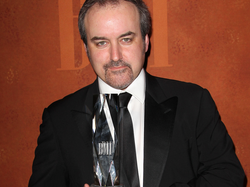

# David Arnold

## Biografía

David Arnold (23 de enero de 1962 en Bedfordshire, Inglaterra) es un compositor británico, conocido por sus partituras en Stargate, Independence Day, y cinco películas de James Bond.

## Estilo musical

Mientras asistía a Sixth Form College en Luton, Arnold se hizo amigo del director Danny Cannon. [ 3 ] Cannon inicialmente creó cortometrajes para los cuales se le pidió a Arnold que escribiera la música. Los dos hicieron sus respectivos debuts cinematográficos importantes con The Young Americans. "Play Dead", una canción de la película con la cantante Björk, alcanzó el puesto número 12 en el Reino Unido. Al año siguiente, compuso Stargate y Last of the Dogmen, con extractos del primero ocupando el tercer lugar en las pistas de bandas sonoras más utilizadas para avances de películas. [ 4 ]

## Anécdotas y curiosidades

1 Subsección de cambio de carrera 1.1 Conciertos de música de cine 1.2 James Bond

Compositores: Beck, Christophe | Lopez, Robert Sello: Disney Duración: 98 minutos Título original: Frozen Director: Chris Buck, Jennifer Lee Nacionalidad: EE UU Año: 2013

## Top 10 bandas sonoras

1. ***Independence Day (Título en España: Independence Day)***
    * **Póster:** [link](124_david_arnold/posters/poster_independence_day_1996.jpg)
2. ***Casino Royale (Título en España: Casino Royale)***
    * **Póster:** [link](124_david_arnold/posters/poster_casino_royale_2006.jpg)
3. ***Stargate (Título en España: Stargate: Puerta a las estrellas)***
    * **Póster:** [link](124_david_arnold/posters/poster_stargate_1994.jpg)
4. ***Aces High (Título en España: Ases del cielo)***
    * **Póster:** [link](124_david_arnold/posters/poster_aces_high_1976.jpg)
5. ***A Life Less Ordinary (Título en España: Una historia diferente)***
    * **Póster:** [link](124_david_arnold/posters/poster_a_life_less_ordinary_1997.jpg)
6. ***Last of the Dogmen (Título en España: Los últimos guerreros)***
    * **Póster:** [link](124_david_arnold/posters/poster_last_of_the_dogmen_1995.jpg)
7. ***The Young Americans (Título en España: La ley de las drogas)***
    * **Póster:** [link](124_david_arnold/posters/poster_the_young_americans_1993.jpg)

## Filmografía completa

- Murder in the Family (Título en España: Murder in the Family) (1938) · [Póster](124_david_arnold/posters/poster_murder_in_the_family_1938.jpg)
- Aces High (Título en España: Ases del cielo) (1976) · [Póster](124_david_arnold/posters/poster_aces_high_1976.jpg)
- The Young Americans (Título en España: La ley de las drogas) (1993) · [Póster](124_david_arnold/posters/poster_the_young_americans_1993.jpg)
- Stargate (Título en España: Stargate: Puerta a las estrellas) (1994) · [Póster](124_david_arnold/posters/poster_stargate_1994.jpg)
- Last of the Dogmen (Título en España: Los últimos guerreros) (1995) · [Póster](124_david_arnold/posters/poster_last_of_the_dogmen_1995.jpg)
- Independence Day (Título en España: Independence Day) (1996) · [Póster](124_david_arnold/posters/poster_independence_day_1996.jpg)
- Independence Day (Título en España: Independence Day) (1996) · [Póster](124_david_arnold/posters/poster_independence_day_1996.jpg)
- A Life Less Ordinary (Título en España: Una historia diferente) (1997) · [Póster](124_david_arnold/posters/poster_a_life_less_ordinary_1997.jpg)
- Tomorrow Never Dies (Título en España: El mañana nunca muere) (1997) · [Póster](124_david_arnold/posters/poster_tomorrow_never_dies_1997.jpg)
- Godzilla (Título en España: Godzilla) (1998) · [Póster](124_david_arnold/posters/poster_godzilla_1998.jpg)
- The World Is Not Enough (Título en España: El mundo nunca es suficiente) (1999) · [Póster](124_david_arnold/posters/poster_the_world_is_not_enough_1999.jpg)
- Wing Commander (Título en España: Wing Commander) (1999) · [Póster](124_david_arnold/posters/poster_wing_commander_1999.jpg)
- Shaft (Título en España: Shaft: The Return) (2000) · [Póster](124_david_arnold/posters/poster_shaft_2000.jpg)
- Baby Boy (Título en España: Baby Boy) (2001) · [Póster](124_david_arnold/posters/poster_baby_boy_2001.jpg)
- The Musketeer (Título en España: El mosquetero) (2001) · [Póster](124_david_arnold/posters/poster_the_musketeer_2001.jpg)
- Zoolander (Título en España: Zoolander (Un descerebrado de moda)) (2001) · [Póster](124_david_arnold/posters/poster_zoolander_2001.jpg)
- Changing Lanes (Título en España: Al límite de la verdad) (2002) · [Póster](124_david_arnold/posters/poster_changing_lanes_2002.jpg)
- Die Another Day (Título en España: Muere otro día) (2002) · [Póster](124_david_arnold/posters/poster_die_another_day_2002.jpg)
- Enough (Título en España: Nunca más) (2002) · [Póster](124_david_arnold/posters/poster_enough_2002.jpg)
- Hollywood Ending (Título en España: Un final made in Hollywood) (2002) · [Póster](124_david_arnold/posters/poster_hollywood_ending_2002.jpg)
- 2 Fast 2 Furious (Título en España: 2 Fast 2 Furious: A todo gas 2) (2003) · [Póster](124_david_arnold/posters/poster_2_fast_2_furious_2003.jpg)
- The Stepford Wives (Título en España: Las mujeres perfectas) (2004) · [Póster](124_david_arnold/posters/poster_the_stepford_wives_2004.jpg)
- Four Brothers (Título en España: Cuatro hermanos) (2005) · [Póster](124_david_arnold/posters/poster_four_brothers_2005.jpg)
- Stoned (Título en España: Stoned, el genuino Rolling Stone) (2005) · [Póster](124_david_arnold/posters/poster_stoned_2005.jpg)
- Amazing Grace (Título en España: Amazing Grace) (2006) · [Póster](124_david_arnold/posters/poster_amazing_grace_2006.jpg)
- Casino Royale (Título en España: Casino Royale) (2006) · [Póster](124_david_arnold/posters/poster_casino_royale_2006.jpg)
- Venus (Título en España: Venus) (2006) · [Póster](124_david_arnold/posters/poster_venus_2006.jpg)
- You Know My Name (Título en España: You Know My Name) (2006) · [Póster](124_david_arnold/posters/poster_you_know_my_name_2006.jpg)
- Death Proof (Título en España: Death Proof) (2007) · [Póster](124_david_arnold/posters/poster_death_proof_2007.jpg)
- Grindhouse (Título en España: Grindhouse) (2007) · [Póster](124_david_arnold/posters/poster_grindhouse_2007.jpg)
- Hot Fuzz (Título en España: Arma fatal) (2007) · [Póster](124_david_arnold/posters/poster_hot_fuzz_2007.jpg)
- Agent Crush (Título en España: Agent Crush) (2008) · [Póster](124_david_arnold/posters/poster_agent_crush_2008.jpg)
- How to Lose Friends & Alienate People (Título en España: Nueva York para principiantes) (2008) · [Póster](124_david_arnold/posters/poster_how_to_lose_friends_alienate_people_2008.jpg)
- Quantum of Solace (Título en España: Quantum of Solace) (2008) · [Póster](124_david_arnold/posters/poster_quantum_of_solace_2008.jpg)
- A Study in Pink (Título en España: A Study in Pink) (2010) · [Póster](124_david_arnold/posters/poster_a_study_in_pink_2010.jpg)
- Goldeneye 007 (Título en España: GoldenEye 007) (2010) · [Póster](124_david_arnold/posters/poster_goldeneye_007_2010.jpg)
- Made in Dagenham (Título en España: Pago justo) (2010) · [Póster](124_david_arnold/posters/poster_made_in_dagenham_2010.jpg)
- Morning Glory (Título en España: Morning Glory) (2010) · [Póster](124_david_arnold/posters/poster_morning_glory_2010.jpg)
- The Blind Banker (Título en España: The Blind Banker) (2010) · [Póster](124_david_arnold/posters/poster_the_blind_banker_2010.jpg)
- The Chronicles of Narnia: The Voyage of the Dawn Treader (Título en España: Las crónicas de Narnia: La travesía del viajero del alba) (2010) · [Póster](124_david_arnold/posters/poster_the_chronicles_of_narnia_the_voyage_of_the_dawn_treader_2010.jpg)
- 9/11: The Great Illusion: End Game of the Illuminati (Título en España: 9/11: The Great Illusion: End Game of the Illuminati) (2010) · [Póster](124_david_arnold/posters/poster_9_11_the_great_illusion_end_game_of_the_illuminati_2010.jpg)
- Paul (Título en España: Paul) (2011) · [Póster](124_david_arnold/posters/poster_paul_2011.jpg)
- 007 Legends (Título en España: 007 Legends) (2012) · [Póster](124_david_arnold/posters/poster_007_legends_2012.jpg)
- A Scandal in Belgravia (Título en España: A Scandal in Belgravia) (2012) · [Póster](https://example.com/placeholder.jpg)
- Mr. Stink (Título en España: Mr. Stink) (2012) · [Póster](124_david_arnold/posters/poster_mr_stink_2012.jpg)
- The Hounds of Baskerville (Título en España: The Hounds of Baskerville) (2012) · [Póster](124_david_arnold/posters/poster_the_hounds_of_baskerville_2012.jpg)
- The Reichenbach Fall (Título en España: The Reichenbach Fall) (2012) · [Póster](124_david_arnold/posters/poster_the_reichenbach_fall_2012.jpg)
- Sherlock: Many Happy Returns (Título en España: Sherlock: Many Happy Returns) (2013) · [Póster](124_david_arnold/posters/poster_sherlock_many_happy_returns_2013.jpg)
- Sherlock: His Last Vow (Título en España: Sherlock: His Last Vow) (2014) · [Póster](124_david_arnold/posters/poster_sherlock_his_last_vow_2014.jpg)
- The Empty Hearse (Título en España: The Empty Hearse) (2014) · [Póster](https://example.com/placeholder.jpg)
- The Inbetweeners 2 (Título en España: The Inbetweeners 2) (2014) · [Póster](124_david_arnold/posters/poster_the_inbetweeners_2_2014.jpg)
- The Sign of Three (Título en España: The Sign of Three) (2014) · [Póster](124_david_arnold/posters/poster_the_sign_of_three_2014.jpg)
- Sherlock: The Abominable Bride (Título en España: Sherlock: la novia abominable) (2016) · [Póster](124_david_arnold/posters/poster_sherlock_the_abominable_bride_2016.jpg)
- The Final Problem (Título en España: The Final Problem) (2017) · [Póster](124_david_arnold/posters/poster_the_final_problem_2017.jpg)
- The Lying Detective (Título en España: The Lying Detective) (2017) · [Póster](124_david_arnold/posters/poster_the_lying_detective_2017.jpg)
- The Six Thatchers (Título en España: The Six Thatchers) (2017) · [Póster](124_david_arnold/posters/poster_the_six_thatchers_2017.jpg)
- The Tiger Who Came to Tea (Título en España: El tigre que vino a tomar el té) (2019) · [Póster](124_david_arnold/posters/poster_the_tiger_who_came_to_tea_2019.jpg)
- Confess, Fletch (Título en España: Confiesa, Fletch) (2022) · [Póster](124_david_arnold/posters/poster_confess_fletch_2022.jpg)
- High School Big Shot (Título en España: High School Big Shot) · [Póster](124_david_arnold/posters/poster_high_school_big_shot.jpg)
- Michael Jordan: Come Fly with Me (Título en España: Michael Jordan: Come Fly with Me) · [Póster](124_david_arnold/posters/poster_michael_jordan_come_fly_with_me.jpg)
- Dracula (Título en España: Drácula) · [Póster](124_david_arnold/posters/poster_dracula.jpg)
- Free Agents (Título en España: Free Agents) · [Póster](124_david_arnold/posters/poster_free_agents.jpg)
- Good Omens: Lockdown (Título en España: Good Omens: Lockdown) · [Póster](124_david_arnold/posters/poster_good_omens_lockdown.jpg)
- Inside Man (Título en España: Plan oculto) · [Póster](124_david_arnold/posters/poster_inside_man.jpg)
- Little Britain Down Under (Título en España: Little Britain Down Under) · [Póster](124_david_arnold/posters/poster_little_britain_down_under.jpg)
- Sherlock Holmes and the Case of the Silk Stocking (Título en España: Sherlock Holmes y el caso de la media de seda) · [Póster](124_david_arnold/posters/poster_sherlock_holmes_and_the_case_of_the_silk_stocking.jpg)
- UC: Undercover (Título en España: UC: Undercover) · [Póster](124_david_arnold/posters/poster_uc_undercover.jpg)
- Zie Ze Vliegen (Título en España: Zie Ze Vliegen) · [Póster](124_david_arnold/posters/poster_zie_ze_vliegen.jpg)

## Premios y nominaciones

* 1996 – Premio Grammy a la mejor banda sonora para medios visuales – por *Independence Day (Título en España: Independence Day)* – (Ganador)
* 2007 – Premio World Soundtrack a la mejor canción original escrita directamente para una película – por *Casino Royale (Título en España: Casino Royale)* – (Ganador)

## Fuentes adicionales

* [MundoBSO](https://www.mundobso.com/compositor/arnold-david) — site:mundobso.com
* [MundoBSO (2)](https://w.mundobso.com/bso/cartero-siempre-llama-dos-veces-el) — site:mundobso.com
* [MundoBSO (3)](https://www.mundobso.com/bso/frozen-el-reino-del-hielo) — site:mundobso.com
* [Film Score Monthly](https://www.filmscoremonthly.com) — site:filmscoremonthly.com
* [Film Score Monthly (2)](https://www.filmscoremonthly.com/board/posts.cfm?archive=0&forumID=1&threadID=99825) — site:filmscoremonthly.com
* [Film Score Monthly (3)](https://www.filmscoremonthly.com/board/posts.cfm?threadID=139191) — site:filmscoremonthly.com
* [SoundtrackCollector](https://www.soundtrackcollector.com/catalog/composerdiscography.php?composerid=617) — site:soundtrackcollector.com
* [SoundtrackCollector (2)](https://www.soundtrackcollector.com/title/8239/Stargate) — site:soundtrackcollector.com
* [SoundtrackCollector (3)](https://www.soundtrackcollector.com/title/5998/Independence+Day) — site:soundtrackcollector.com
* [WhatSong](https://www.whatsong.org/tvshow/how-i-met-your-mother/episode/44483) — site:whatsong.org
* [WhatSong (2)](https://www.whatsong.org/tvshow/grown-ish/episode/82123) — site:whatsong.org
* [WhatSong (3)](https://www.whatsong.org/movie/casino-royale) — site:whatsong.org

## Notas externas

* MundoBSO: Todos los textos, salvo los firmados por otros, están registrados y son propiedad de Conrado Xalabarder. Prohibida la reproducción total o parcial sin el consentimiento expreso y por escrito del autor. Las fotos tienen únicamente propósitos identificativos, sin ninguna intención de vulneración de copyright. Si eres el autor/a o propietario de la foto escríbenos un email a cxa@mundobso para acreditarte o, si lo prefieres, para que la borremos
* MundoBSO (3): Compositores: Beck, Christophe | Lopez, Robert Sello: Disney Duración: 98 minutos Título original: Frozen Director: Chris Buck, Jennifer Lee Nacionalidad: EE UU Año: 2013
* Film Score Monthly: FSM HOME FilmScoreDaily FilmScoreFriday The Aisle Seat LukasKendall.com TABLERO DE MENSAJES Discusión general Puesto comercial Discusión sobre partituras no cinematográficas
* SoundtrackCollector (3): ID4 (1996, Estados Unidos, abreviatura promocional)
* WhatSong: Lily y Robin bailan con los dos nerds del último año de secundaria. Se reproduce de fondo cuando Lilly, Robin y Barney intentan entrar a la fiesta. La canción es una canción que está incluida en iMovie.
* WhatSong (2): Luca está pensando en él y en el encuentro sexual de Zoey de la noche anterior. Luca está estresado por su "yo". Texto a Zoey y su falta de respuesta.
* WhatSong (3): David Arnold y Nicholas Dodd - 007: Casino Royale (banda sonora original de la película) [Versión de lujo] David Arnold - 007: Casino Royale (banda sonora original de la película) [Versión de lujo]
* kaijumasterclass.com: El compositor cinematográfico ganador de un Grammy y un Emmy habla sobre sus épicas partituras para GODZILLA (1998) de Roland Emmerich y otras películas de gran éxito. (Moderador: John DeSentis)
* www.songwritingmagazine.co.uk: ENTREVISTAS A ESCRITORES 5 MINUTOS CON... PRESENTACIÓN DEL DIARIO DE UN ESCRITOR Entrevista: Laurence Jones De la disciplina clásica a la confesión del blues, la composición se convierte en supervivencia... Leer más + Entrevista: Eddie Schwartz Charlamos con el exitoso compositor que ha redescubierto su voz creativa y... Leer más + Lecciones aprendidas: D:Ream Las cosas solo pueden mejorar en tu composición si escuchas estos menos... Leer más + Entrevista: Mark Morriss de The Bluetones En lugar de dormirse en los laureles del britpop, el líder y letrista sigue... Leer más + CANCIONES CÓMO ESCRIBÍ UNA CANCIÓN CANCIONES DECONSTRUIDAS CANCIÓN POR CANCIÓN EN EL CLAVE DE LA NUEVA MÚSICA Canción por canción: 'Everythingbeing' de Alexander Wolfe Entra en un...
* hollywoodelitecomposers.com: D avid Arnold es un compositor de cine inglés mejor conocido por componer cinco películas de James Bond, la película Stargate de 1994, la película Independence Day de 1996, la película Godzilla de 1998 y las series de televisión Little Britain y Sherlock. Por el Día de la Independencia recibió un premio Grammy a la mejor composición instrumental escrita para una película o para televisión. Arnold es miembro de la Academia Británica de Compositores, Compositores y Autores. Mientras asistía a Sixth Form College en Luton, Arnold se hizo amigo del director Danny Cannon. Cannon inicialmente creó cortometrajes para los cuales se le pidió a Arnold que escribiera la música. Los dos hicieron sus respectivos debuts cinematográficos importantes con The Young Americans. "Jugar...
* crosseyedpianist.com: Por El pianista bizco | 16 de enero de 2020 10 de enero de 2020 ¿Quién o qué te inspiró a empezar a componer y seguir una carrera en la música?
* theincrediblesuit.blogspot.com: El blog de películas que realmente quiere que compres HITCHOLOGY Jo 25 de junio de 2015 a las 08:29 Oh, gracias por el artículo, siempre me alegra escuchar a los compositores de cine hablar sobre su trabajo y "descomprimir" lo que implica hacer música para películas. Leer el comentario de 'Martin es el camino para el público' me hace pensar... Supongo que eso es un poco lo que la música de cine también puede hacer. También gente en Birmingham o Nottingham: David Arnold dará dos conciertos allí este fin de semana: el viernes 26 de junio (Symphony Hall, Brum) y el domingo 28 de junio (Royal Concert Hall, Nott). Fui al de Londres la semana pasada y fue genial. Es muy divertido y puedes escuchar toda esa hermosa música en vivo (entonces me encantó escuchar A Night at the Opera...
