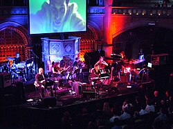

# Clint Mansell

## Biografía

Clint Mansell (Coventry, Reino Unido, 7 de enero de 1963) es un músico y compositor británico, nominado a los Globos de Oro por su labor en las bandas sonoras de importantes filmes como Réquiem por un sueño, Doom o La fuente de la vida, entre otras.

## Estilo musical

Mansell se asoció con el cineasta estadounidense Darren Aronofsky y compuso las bandas sonoras de sus películas Pi, Réquiem por un sueño, La fuente, El luchador, Cisne negro y Noé. Mansell es mejor conocido por la banda sonora de Réquiem por un sueño, particularmente la composición de la película "Lux Aeterna" y una versión reorquestada titulada "Requiem por una torre" que fue creada para el tráiler de El Señor de los Anillos: Las Dos Torres, los cuales han aparecido en múltiples anuncios, películas, avances de películas, videojuegos y otros medios.

## Anécdotas y curiosidades

2 Subsección de carrera alternar carrera 2.1 Carrera de rock alternativo 2.2 Carrera de música cinematográfica 2.3 Actuaciones sinfónicas 2.4 Acuerdo editorial

## Top 10 bandas sonoras

1. ***Black Swan (Título en España: Cisne negro)***
    * **Póster:** [link](126_clint_mansell/posters/poster_black_swan_2010.jpg)
2. ***Requiem for a Dream (Título en España: Réquiem por un sueño)***
    * **Póster:** [link](126_clint_mansell/posters/poster_requiem_for_a_dream_2000.jpg)
3. ***Ghost in the Shell (Título en España: Ghost in the Shell: El alma de la máquina)***
    * **Póster:** [link](126_clint_mansell/posters/poster_ghost_in_the_shell_2017.jpg)
4. ***Moon (Título en España: Moon)***
    * **Póster:** [link](126_clint_mansell/posters/poster_moon_2009.jpg)
5. ***Pi (Título en España: Pi, fe en el caos)***
    * **Póster:** [link](126_clint_mansell/posters/poster_pi_1998.jpg)
6. ***The Wrestler (Título en España: El luchador)***
    * **Póster:** [link](126_clint_mansell/posters/poster_the_wrestler_2008.jpg)
7. ***Filth (Título en España: Filth, el sucio)***
    * **Póster:** [link](126_clint_mansell/posters/poster_filth_2013.jpg)
8. ***Noah (Título en España: Noé)***
    * **Póster:** [link](126_clint_mansell/posters/poster_noah_2014.jpg)
9. ***11:14 (Título en España: 11:14 - Destino fatal)***
    * **Póster:** [link](126_clint_mansell/posters/poster_11_14_2003.jpg)
10. ***Loving Vincent (Título en España: Loving Vincent)***
    * **Póster:** [link](126_clint_mansell/posters/poster_loving_vincent_2017.jpg)

## Filmografía completa

- Pi (Título en España: Pi, fe en el caos) (1998) · [Póster](126_clint_mansell/posters/poster_pi_1998.jpg)
- Requiem for a Dream (Título en España: Réquiem por un sueño) (2000) · [Póster](126_clint_mansell/posters/poster_requiem_for_a_dream_2000.jpg)
- Knockaround Guys (Título en España: Ajuste de cuentas) (2001) · [Póster](126_clint_mansell/posters/poster_knockaround_guys_2001.jpg)
- The Hole (Título en España: The Hole) (2001) · [Póster](126_clint_mansell/posters/poster_the_hole_2001.jpg)
- Murder by Numbers (Título en España: Asesinato... 1-2-3) (2002) · [Póster](126_clint_mansell/posters/poster_murder_by_numbers_2002.jpg)
- Abandon (Título en España: La desaparición de Embry) (2002) · [Póster](126_clint_mansell/posters/poster_abandon_2002.jpg)
- Sonny (Título en España: Sonny) (2002) · [Póster](126_clint_mansell/posters/poster_sonny_2002.jpg)
- Ticker (Título en España: Ticker) (2002) · [Póster](126_clint_mansell/posters/poster_ticker_2002.jpg)
- World Traveler (Título en España: World Traveler) (2002) · [Póster](126_clint_mansell/posters/poster_world_traveler_2002.jpg)
- 11:14 (Título en España: 11:14 - Destino fatal) (2003) · [Póster](126_clint_mansell/posters/poster_11_14_2003.jpg)
- Suspect Zero (Título en España: Sospechoso cero) (2004) · [Póster](126_clint_mansell/posters/poster_suspect_zero_2004.jpg)
- Doom (Título en España: Doom) (2005) · [Póster](126_clint_mansell/posters/poster_doom_2005.jpg)
- Trust the Man (Título en España: Ellas y ellos) (2005) · [Póster](126_clint_mansell/posters/poster_trust_the_man_2005.jpg)
- Sahara (Título en España: Sahara) (2005) · [Póster](126_clint_mansell/posters/poster_sahara_2005.jpg)
- Smokin' Aces (Título en España: Ases calientes) (2006) · [Póster](126_clint_mansell/posters/poster_smokin_aces_2006.jpg)
- The Fountain (Título en España: La fuente de la vida) (2006) · [Póster](126_clint_mansell/posters/poster_the_fountain_2006.jpg)
- Wind Chill (Título en España: Escalofríos) (2007) · [Póster](126_clint_mansell/posters/poster_wind_chill_2007.jpg)
- Definitely, Maybe (Título en España: Definitivamente, quizás) (2008) · [Póster](126_clint_mansell/posters/poster_definitely_maybe_2008.jpg)
- The Wrestler (Título en España: El luchador) (2008) · [Póster](126_clint_mansell/posters/poster_the_wrestler_2008.jpg)
- Blood: The Last Vampire (Título en España: Blood: El último vampiro) (2009) · [Póster](126_clint_mansell/posters/poster_blood_the_last_vampire_2009.jpg)
- L'Affaire Farewell (Título en España: El caso Farewell) (2009) · [Póster](126_clint_mansell/posters/poster_l_affaire_farewell_2009.jpg)
- The Rebound (Título en España: Mi segunda vez) (2009) · [Póster](126_clint_mansell/posters/poster_the_rebound_2009.jpg)
- Moon (Título en España: Moon) (2009) · [Póster](126_clint_mansell/posters/poster_moon_2009.jpg)
- Within the Ring (Título en España: Within the Ring) (2009) · [Póster](126_clint_mansell/posters/poster_within_the_ring_2009.jpg)
- Black Swan (Título en España: Cisne negro) (2010) · [Póster](126_clint_mansell/posters/poster_black_swan_2010.jpg)
- Faster (Título en España: Sed de venganza) (2010) · [Póster](126_clint_mansell/posters/poster_faster_2010.jpg)
- Last Night (Título en España: Sólo una noche (Last night)) (2010) · [Póster](126_clint_mansell/posters/poster_last_night_2010.jpg)
- United (Título en España: United) (2011) · [Póster](126_clint_mansell/posters/poster_united_2011.jpg)
- Filth (Título en España: Filth, el sucio) (2013) · [Póster](126_clint_mansell/posters/poster_filth_2013.jpg)
- Stoker (Título en España: Stoker) (2013) · [Póster](126_clint_mansell/posters/poster_stoker_2013.jpg)
- Noah (Título en España: Noé) (2014) · [Póster](126_clint_mansell/posters/poster_noah_2014.jpg)
- High-Rise (Título en España: High-Rise) (2015) · [Póster](126_clint_mansell/posters/poster_high_rise_2015.jpg)
- Man Down (Título en España: Man Down) (2015) · [Póster](126_clint_mansell/posters/poster_man_down_2015.jpg)
- Ghost in the Shell (Título en España: Ghost in the Shell: El alma de la máquina) (2017) · [Póster](126_clint_mansell/posters/poster_ghost_in_the_shell_2017.jpg)
- Loving Vincent (Título en España: Loving Vincent) (2017) · [Póster](126_clint_mansell/posters/poster_loving_vincent_2017.jpg)
- The New Radical (Título en España: The New Radical) (2017) · [Póster](126_clint_mansell/posters/poster_the_new_radical_2017.jpg)
- Happy New Year, Colin Burstead (Título en España: Feliz Año Nuevo, Colin Burstead) (2018) · [Póster](126_clint_mansell/posters/poster_happy_new_year_colin_burstead_2018.jpg)
- Mute (Título en España: Mudo) (2018) · [Póster](126_clint_mansell/posters/poster_mute_2018.jpg)
- Berlin, I Love You (Título en España: Berlin, I Love You) (2019) · [Póster](126_clint_mansell/posters/poster_berlin_i_love_you_2019.jpg)
- Out of Blue (Título en España: El asesino del calibre 38) (2019) · [Póster](126_clint_mansell/posters/poster_out_of_blue_2019.jpg)
- Rebecca (Título en España: Rebeca) (2020) · [Póster](126_clint_mansell/posters/poster_rebecca_2020.jpg)
- Warning (Título en España: Alerta global) (2021) · [Póster](126_clint_mansell/posters/poster_warning_2021.jpg)
- In the Earth (Título en España: In the Earth) (2021) · [Póster](126_clint_mansell/posters/poster_in_the_earth_2021.jpg)
- The Good Nurse (Título en España: El ángel de la muerte) (2022) · [Póster](126_clint_mansell/posters/poster_the_good_nurse_2022.jpg)
- She Will (Título en España: She Will) (2022) · [Póster](126_clint_mansell/posters/poster_she_will_2022.jpg)
- Sharper (Título en España: Embaucadores) (2023) · [Póster](126_clint_mansell/posters/poster_sharper_2023.jpg)
- Love Lies Bleeding (Título en España: Sangre en los labios) (2024) · [Póster](126_clint_mansell/posters/poster_love_lies_bleeding_2024.jpg)

## Premios y nominaciones

* Premios Camille – (Ganador)

## Fuentes adicionales

* [MundoBSO](https://www.mundobso.com) — site:mundobso.com
* [MundoBSO (2)](https://www.mundobso.com/compositor/mansell-clint) — site:mundobso.com
* [MundoBSO (3)](https://www.mundobso.com/bso/rebeca-clint-mansell) — site:mundobso.com
* [Film Score Monthly](https://filmscoremonthly.com/board/posts.cfm?archive=0&forumID=1&threadID=60577) — site:filmscoremonthly.com
* [Film Score Monthly (2)](https://www.filmscoremonthly.com) — site:filmscoremonthly.com
* [Film Score Monthly (3)](https://filmscoremonthly.com/board/posts.cfm?threadID=29853&forumID=1&archive=1) — site:filmscoremonthly.com
* [SoundtrackCollector](https://www.soundtrackcollector.com/catalog/composerdiscography.php?composerid=1623) — site:soundtrackcollector.com
* [SoundtrackCollector (2)](https://www.soundtrackcollector.com/title/10484/Requiem+For+A+Dream) — site:soundtrackcollector.com
* [SoundtrackCollector (3)](https://www.soundtrackcollector.com/title/73222/Doom) — site:soundtrackcollector.com
* [WhatSong](https://www.whatsong.org/movie/requiem-for-a-dream) — site:whatsong.org
* [WhatSong (2)](https://www.whatsong.org/movie/black-swan) — site:whatsong.org
* [WhatSong (3)](https://www.whatsong.org/movie/filth) — site:whatsong.org

## Notas externas

* MundoBSO: Ludwig Göransson ha ganado el Premio Grammy por la banda sonora de Sinners, en el que es su tercer premio. La película también ha ganado en el apartado de mejor banda sonora de canciones, el Grammy a la mejor canción ha sido para Golden, de K-Pop Demon Hunters, y la mejor banda sonora de videojuego la ha ganado Austin Wintory por Sword of the Sea. Todos los textos, salvo los firmados por otros, están registrados y son propiedad de Conrado Xalabarder. Prohibida la reproducción total o parcial sin el consentimiento expreso y por escrito del autor.
* MundoBSO (2): Nació en Covertu (Reino Unido), el 7 de noviembre de 1963. Destacó en el mundo del rock, el pop y el rap, y publicó varios discos con su música. En el cine, colabora regularmente desde principios de 2000. Nació en Covertu (Reino Unido), el 7 de noviembre de 1963. Destacó en el mundo del rock, el pop y el rap, y publicó varios discos con su música. En el cine, colabora regularmente desde principios de 2000.
* MundoBSO (3): Compositor: Mansell, Clint Sello: Lakeshore Duración: 62 minutos Información de la película Título original: Rebecca Director: Ben Wheatley Nacionalidad: Reino Unido Año: 2020 Argumento Relato sobre una joven que sufre al ver a su aristocrático marido dominado por el recuerdo de su difunta primera esposa. Compositor: Mansell, Clint Sello: Lakeshore Duración: 62 minutos
* Film Score Monthly (2): FSM HOME FilmScoreDaily FilmScoreFriday The Aisle Seat LukasKendall.com TABLERO DE MENSAJES Discusión general Puesto comercial Discusión sobre partituras no cinematográficas
* WhatSong: Clint Mansell - Réquiem por un sueño (banda sonora de la película) Clint Mansell - Réquiem por un sueño (banda sonora de la película)
* WhatSong (2): Clint Mansell - Black Swan (banda sonora original de la película) 00:01 Primera canción que abre la película con Tina bailando el lago de los cisnes. Ella se despierta y se da cuenta de que fue un sueño.
* WhatSong (3): Clint Mansell - Filth (Música de la película original) James McAvoy - Filth (Música de la película original)
* music.apple.com: Lux Aeterna Réquiem por un sueño (banda sonora de la película)â·â2000 Réquiem por un sueño (banda sonora de la película)â·â2000
* hollywoodelitecomposers.com: C linton Darryl "Clint" Mansell es un músico, compositor y ex cantante y guitarrista inglés de la banda Pop Will Eat Itself. Después de la disolución de Pop Will Eat Itself en 1996, Mansell conoció la música cinematográfica cuando el director Darren Aronofsky lo contrató para componer la música de su primera película. N. Mansell luego escribió la música para la siguiente película de Aronofsky, Réquiem por un sueño, que ha sido bien recibida. Su composición principal "Lux Aeterna" se ha vuelto extremadamente popular, apareciendo en una amplia variedad de anuncios y avances de películas. La composición de Mansell para The Fountain fue nominada a Mejor Banda Sonora Original en la 64ª edición anual de los Globos de Oro. Sus otras bandas sonoras cinematográficas notables incluyen Moon,...
* classical.music.apple.com: C. MANSELL Réquiem por una torre âVersión orquestal de Lux Aeternaâ 2 El beso de Yennefer El beso de Yennefer Maksym RzemiÅski
* www.sensacine.com: Por ejemplo: Tom Hardy películas, Johnny Depp películas El agente secreto Director Kleber Mendonça Filho Con Wagner Moura, Gabriel Leone Película - Crimen Tráiler
* www.kusc.org: El compositor Clint Mansell en los estudios KUSC con el colaborador de Arts Alive Tim Greiving. Presiona reproducir a continuación para escuchar nuestra función Arts Alive con el compositor Clint Mansell.
