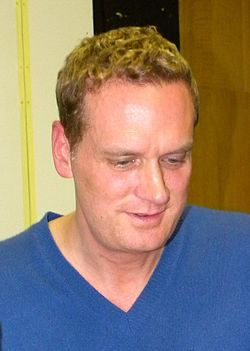

# John Ottman

## Biografía

John Ottman (San Diego, California; 6 de julio de 1964) es un compositor, editor de filmes y director estadounidense.

## Estilo musical

Es mejor conocido por su multitarea como editor y compositor de las películas de Bryan Singer y, en algunas ocasiones, por sus papeles de productor. The Usual Suspects, Apt Pupil, X2, Superman Returns (incluye adaptación de temas compuestos originalmente por John Williams), Valkyrie, Jack the Giant Slayer, X-Men: Days of Future Past y X-Men: Apocalypse. Otras películas notables en las que trabajó como compositor son Blancanieves: una historia de terror, la nueva versión de 2005 de House of Wax, Kiss Kiss Bang Bang, Fantastic Four y su secuela Fantastic Four: Rise of the Silver Surfer, The Invasion y Astro Boy.

## Anécdotas y curiosidades

John Ottman (nacido el 6 de julio de 1964) es un compositor, director y editor de cine estadounidense. Es mejor conocido por colaborar con el director Bryan Singer, componiendo y/o editando muchas de sus películas, incluidas Public Access (1993), The Usual Suspects (1995), Superman Returns (2006), Valkyrie (2008) y Jack the Giant Slayer (2013), así como la serie de películas X-Men. Por su trabajo en la película biográfica de Queen de Singer de 2018, Bohemian Rhapsody, Ottman ganó el Premio de la Academia a la Mejor Edición de Película.

## Top 10 bandas sonoras

1. ***Bohemian Rhapsody (Título en España: Bohemian Rhapsody)***
    * **Póster:** [link](129_john_ottman/posters/poster_bohemian_rhapsody_2018.jpg)
2. ***The Usual Suspects (Título en España: Sospechosos habituales)***
    * **Póster:** [link](129_john_ottman/posters/poster_the_usual_suspects_1995.jpg)
3. ***X-Men: Days of Future Past (Título en España: X-Men: Días del futuro pasado)***
    * **Póster:** [link](129_john_ottman/posters/poster_x_men_days_of_future_past_2014.jpg)
4. ***X-Men: Apocalypse (Título en España: X-Men: Apocalipsis)***
    * **Póster:** [link](129_john_ottman/posters/poster_x_men_apocalypse_2016.jpg)
5. ***The Nice Guys (Título en España: Dos buenos tipos)***
    * **Póster:** [link](129_john_ottman/posters/poster_the_nice_guys_2016.jpg)
6. ***Orphan (Título en España: La huérfana)***
    * **Póster:** [link](129_john_ottman/posters/poster_orphan_2009.jpg)
7. ***Valkyrie (Título en España: Valkiria)***
    * **Póster:** [link](129_john_ottman/posters/poster_valkyrie_2008.jpg)
8. ***Superman Returns (Título en España: Superman Returns: El regreso)***
    * **Póster:** [link](129_john_ottman/posters/poster_superman_returns_2006.jpg)
9. ***X2 (Título en España: X-Men 2)***
    * **Póster:** [link](129_john_ottman/posters/poster_x2_2003.jpg)
10. ***Astro Boy (Título en España: Astro Boy)***
    * **Póster:** [link](129_john_ottman/posters/poster_astro_boy_2009.jpg)

## Filmografía completa

- Public Access (Título en España: Public Access) (1993) · [Póster](129_john_ottman/posters/poster_public_access_1993.jpg)
- The Usual Suspects (Título en España: Sospechosos habituales) (1995) · [Póster](129_john_ottman/posters/poster_the_usual_suspects_1995.jpg)
- The Cable Guy (Título en España: Un loco a domicilio) (1996) · [Póster](129_john_ottman/posters/poster_the_cable_guy_1996.jpg)
- Snow White: A Tale of Terror (Título en España: Blancanieves, un cuento de terror (La verdadera historia)) (1997) · [Póster](129_john_ottman/posters/poster_snow_white_a_tale_of_terror_1997.jpg)
- Incognito (Título en España: Incognito) (1997) · [Póster](129_john_ottman/posters/poster_incognito_1997.jpg)
- Halloween H20: 20 Years Later (Título en España: Halloween: H20. Veinte años después) (1998) · [Póster](129_john_ottman/posters/poster_halloween_h20_20_years_later_1998.jpg)
- Nothing Is What It Seems:  The Making Of 'The Usual Suspects' (Título en España: Nothing Is What It Seems:  The Making Of 'The Usual Suspects') (1998) · [Póster](129_john_ottman/posters/poster_nothing_is_what_it_seems_the_making_of_the_usual_suspects_1998.jpg)
- Apt Pupil (Título en España: Verano de corrupción) (1998) · [Póster](129_john_ottman/posters/poster_apt_pupil_1998.jpg)
- Lake Placid (Título en España: Mandíbulas) (1999) · [Póster](129_john_ottman/posters/poster_lake_placid_1999.jpg)
- Urban Legends: Final Cut (Título en España: Leyenda urbana 2) (2000) · [Póster](129_john_ottman/posters/poster_urban_legends_final_cut_2000.jpg)
- Bubble Boy (Título en España: Bubble Boy (El Chico de la Burbuja)) (2001) · [Póster](129_john_ottman/posters/poster_bubble_boy_2001.jpg)
- Eight Legged Freaks (Título en España: Arac Attack) (2002) · [Póster](129_john_ottman/posters/poster_eight_legged_freaks_2002.jpg)
- Trapped (Título en España: Atrapada) (2002) · [Póster](129_john_ottman/posters/poster_trapped_2002.jpg)
- Keyser Soze, Lie or Legend - Featurette (Título en España: Keyser Soze, Lie or Legend - Featurette) (2002) · [Póster](129_john_ottman/posters/poster_keyser_soze_lie_or_legend_featurette_2002.jpg)
- Brother's Keeper (Título en España: Protección Fraternal) (2002) · [Póster](129_john_ottman/posters/poster_brother_s_keeper_2002.jpg)
- Pumpkin (Título en España: Pumpkin) (2002) · [Póster](129_john_ottman/posters/poster_pumpkin_2002.jpg)
- Gothika (Título en España: Gothika) (2003) · [Póster](129_john_ottman/posters/poster_gothika_2003.jpg)
- Requiem for Mutants: The Score of X2 (Título en España: Requiem for Mutants: The Score of X2) (2003) · [Póster](129_john_ottman/posters/poster_requiem_for_mutants_the_score_of_x2_2003.jpg)
- X2 (Título en España: X-Men 2) (2003) · [Póster](129_john_ottman/posters/poster_x2_2003.jpg)
- Cellular (Título en España: Cellular) (2004) · [Póster](129_john_ottman/posters/poster_cellular_2004.jpg)
- Hide and Seek (Título en España: El escondite) (2005) · [Póster](129_john_ottman/posters/poster_hide_and_seek_2005.jpg)
- Kiss Kiss Bang Bang (Título en España: Kiss Kiss Bang Bang) (2005) · [Póster](129_john_ottman/posters/poster_kiss_kiss_bang_bang_2005.jpg)
- House of Wax (Título en España: La casa de cera) (2005) · [Póster](129_john_ottman/posters/poster_house_of_wax_2005.jpg)
- Fantastic Four (Título en España: Los 4 fantásticos) (2005) · [Póster](129_john_ottman/posters/poster_fantastic_four_2005.jpg)
- Film Noir: Bringing Darkness to Light (Título en España: Film Noir: Bringing Darkness to Light) (2006) · [Póster](129_john_ottman/posters/poster_film_noir_bringing_darkness_to_light_2006.jpg)
- Superman Returns (Título en España: Superman Returns: El regreso) (2006) · [Póster](129_john_ottman/posters/poster_superman_returns_2006.jpg)
- The Invasion (Título en España: Invasión) (2007) · [Póster](129_john_ottman/posters/poster_the_invasion_2007.jpg)
- Fantastic Four: Rise of the Silver Surfer (Título en España: Los 4 fantásticos y Silver Surfer) (2007) · [Póster](129_john_ottman/posters/poster_fantastic_four_rise_of_the_silver_surfer_2007.jpg)
- Navigate This Maze (Título en España: Navigate This Maze) (2007) · [Póster](129_john_ottman/posters/poster_navigate_this_maze_2007.jpg)
- Valkyrie (Título en España: Valkiria) (2008) · [Póster](129_john_ottman/posters/poster_valkyrie_2008.jpg)
- Astro Boy (Título en España: Astro Boy) (2009) · [Póster](129_john_ottman/posters/poster_astro_boy_2009.jpg)
- Orphan (Título en España: La huérfana) (2009) · [Póster](129_john_ottman/posters/poster_orphan_2009.jpg)
- The Losers (Título en España: Los perdedores) (2010) · [Póster](129_john_ottman/posters/poster_the_losers_2010.jpg)
- The Resident (Título en España: La víctima perfecta) (2011) · [Póster](129_john_ottman/posters/poster_the_resident_2011.jpg)
- Unknown (Título en España: Sin identidad) (2011) · [Póster](129_john_ottman/posters/poster_unknown_2011.jpg)
- Jack the Giant Slayer (Título en España: Jack, el cazagigantes) (2013) · [Póster](129_john_ottman/posters/poster_jack_the_giant_slayer_2013.jpg)
- Non-Stop (Título en España: Non-Stop (Sin escalas)) (2014) · [Póster](129_john_ottman/posters/poster_non_stop_2014.jpg)
- X-Men: Days of Future Past (Título en España: X-Men: Días del futuro pasado) (2014) · [Póster](129_john_ottman/posters/poster_x_men_days_of_future_past_2014.jpg)
- The Nice Guys (Título en España: Dos buenos tipos) (2016) · [Póster](129_john_ottman/posters/poster_the_nice_guys_2016.jpg)
- X-Men: Apocalypse (Título en España: X-Men: Apocalipsis) (2016) · [Póster](129_john_ottman/posters/poster_x_men_apocalypse_2016.jpg)
- Bohemian Rhapsody (Título en España: Bohemian Rhapsody) (2018) · [Póster](129_john_ottman/posters/poster_bohemian_rhapsody_2018.jpg)

## Premios y nominaciones

* 2019 – Premio de la Academia al mejor montaje cinematográfico – por *Bohemian Rhapsody (Título en España: Bohemian Rhapsody)* – (Nominación)

## Fuentes adicionales

* [MundoBSO](https://www.mundobso.com/agoras/cronicas/el-infierno-en-hollywood-7) — site:mundobso.com
* [MundoBSO (2)](https://w.mundobso.com/bso/cartero-siempre-llama-dos-veces-el) — site:mundobso.com
* [MundoBSO (3)](https://www.mundobso.com/bso/milla-verde-la) — site:mundobso.com
* [Film Score Monthly](https://www.filmscoremonthly.com/board/posts.cfm?threadID=151230&forumID=7&archive=0) — site:filmscoremonthly.com
* [Film Score Monthly (2)](https://www.filmscoremonthly.com/backissues/viewissue.cfm?issueID=76) — site:filmscoremonthly.com
* [Film Score Monthly (3)](https://www.filmscoremonthly.com/board/posts.cfm?forumID=1&pageID=2&threadID=71559&archive=0) — site:filmscoremonthly.com
* [SoundtrackCollector](https://www.soundtrackcollector.com/composer/639/John+Ottman) — site:soundtrackcollector.com
* [SoundtrackCollector (2)](https://www.soundtrackcollector.com/catalog/composerdiscography.php?composerid=639) — site:soundtrackcollector.com
* [SoundtrackCollector (3)](https://www.soundtrackcollector.com/title/61853/Gothika) — site:soundtrackcollector.com
* [WhatSong](https://www.whatsong.org/movie/x-men-apocalypse) — site:whatsong.org
* [WhatSong (2)](https://www.whatsong.org/tvshow/how-i-met-your-mother/episode/44483) — site:whatsong.org
* [WhatSong (3)](https://www.whatsong.org/tvshow/9-1-1/episode/71629) — site:whatsong.org

## Notas externas

* MundoBSO (3): Compositor: Newman, Thomas Sello: Warner Duración: 66 minutos Información de la película Título original: The Green Mile Director: Frank Darabont Nacionalidad: EE UU Año: 1999 Argumento A mediados de los años treinta, un guarda de prisiones que custodia a los condenados a muerte descubre poderes sobrenaturales en un inmenso hombre negro, acusado de haber asesinado a dos niñas. Eso le llevará a creer en su inocencia. Premios Saturn: 1 nominación Compositor: Newman, Thomas Sello: Warner Duración: 66 minutos
* WhatSong: Lesley Duncan - Lesley Step Lightly: The Gm Recordings Plus 1974-1982 Ben Salisbury - The Church (de la banda sonora original de "Men") - Single
* WhatSong (2): Lily y Robin bailan con los dos nerds del último año de secundaria. Se reproduce de fondo cuando Lilly, Robin y Barney intentan entrar a la fiesta. La canción es una canción que está incluida en iMovie.
* WhatSong (3): Talking Heads - Favoritos populares 1976-1992: Sand In the Vaseline The Naked and Famous - Passive Me, Aggressive You (Remixes y caras B)
* www.soundtrack.net: Explora canciones de películas y programas de televisión, escúchalas en su totalidad con la profunda integración de Spotify y guarda pistas directamente en tus listas de reproducción. Muestra amor por tus canciones, películas y comentarios favoritos con Me gusta: tus elecciones impulsan recomendaciones de canciones personalizadas.
* scoringarts.com: El editor y compositor ganador del Premio de la Academia, John Ottman, se une a nosotros para hablar sobre sus primeras influencias en la música cinematográfica, incluidas Star Trek y Poltergeist de Jerry Goldsmith, y luego profundiza en su propio trabajo en The Usual Suspects, Cable Guy, Valkyrie, The Heist, Kiss Kiss Bang Bang, X-Men 2, X-Men Apocalypse, Bohemian Rhapsody y más. La doble perspectiva única de John sobre los oficios vecinos de la edición cinematográfica y la composición musical brinda una visión única de cómo los cineastas pueden contar una historia. Esta sesión fue moderada por William V. Malpede. John Ottman posee dos distinciones como destacado compositor de cine y editor de cine galardonado. Ottman ha realizado a menudo ambas tareas monumentales en las mismas películas. Semejante...
* classical.music.apple.com: X-Men: Apocalipsis (Banda Sonora Original de la Película) X-Men: Apocalipsis (Banda Sonora Original de la Película) John Ottman Talía In Concert (Movies & Soul) (En Directo) Talía In Concert (Movies & Soul) (En Directo) Orquesta Metropolitana De Madrid
* filmscoringtips.com: Buscar sugerencias Anuncios (12) Ayudar a los compositores (5) Negocios (7) Showreels de compositores (3) Plano del sitio web del compositor (2) Club de lectura de compositores (3) Favoritos de los compositores (18) Composición (15) Música de películas 101 (10) La meca de la música de películas (11) Comentarios de cineastas (11) Equipo favorito de FST (6) Música de juegos (2) Equipo y software (34) Laboratorios (22) Biblioteca de música (5) Estilo de vida (20) Síntesis modular (6) Redes (11) Presencia en línea (12) Episodios de podcast (18) Episodios de podcast FMF (11) Grabación, mezcla y masterización (16) Muestre su música (4) Compositores sociales (8) Álbum de banda sonora (2) Envíos (10) Consejos para compositores (132) Consejos para editores de películas (11) Consejos para cineastas (12) Consejos para compositores y productores...
* music.apple.com: Como un fuego X-Men: Apocalipsis (banda sonora original de la película)â·â2016 X-Men: Apocalipsis (banda sonora original de la película)â·â2016
* www.sonymusic.es: El compositor y también director de cine John Ottman es el autor de la banda sonora de X-Men: Apocalipsis, la nueva película de la famosa saga, en esta ocasión protagonizada por Jennifer Lawrence, Rose Byrne y Oscar Isaac. Ottman es conocido principalmente por sus colaboraciones con el director Bryan Singer, editando y componiendo las partituras para sus filmes Sospechosos habituales, Verano de corrupción, X-Men 2 y Superman Returns, siendo en esta última donde adaptó la música de Superman originalmente compuesta por John Williams. También es colaborador habitual del director español Jaume Collet-Serra.
* www.johnottman.com: "John como editor" (un ensayo y una fiesta de perras, de John Ottman). John Ottman posee dos distinciones como destacado compositor de cine y editor de cine galardonado. Ottman ha realizado a menudo ambas tareas monumentales en las mismas películas. Tareas dobles tan notables han incluido The Usual Suspects, X-Men 2, Superman Returns, Valkyrie y Jack the Giant Killer. También ocupó puestos de productor en varias de estas películas, además de dirigir, editar y componer la música de Urban Legends 2.
* www.rottentomatoes.com: -- The Great American Baking Show: Celebrity Big Game: Temporada 2 80% Bridgerton: Temporada 4 Enlace a Bridgerton: Temporada 4
