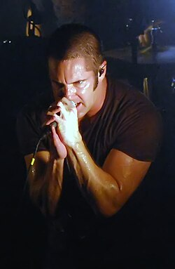

# Trent Reznor

## Biografía

Michael Trent Reznor (Mercer, Pensilvania, 17 de mayo de 1965) es un músico, compositor, productor y multiinstrumentista estadounidense. Fundó y lidera la banda Nine Inch Nails y perteneció a otras como Option 30, The Innocent y Exotic Birds, entre otros. En 2007, Reznor acabó su contrato discográfico con Interscope Records, pasando a ser un artista independiente. Está considerado como una de las figuras creativas más aclamadas de su generación musical.​ El primer lanzamiento de Reznor como Nine Inch Nails, Pretty Hate Machine, fue un éxito comercial y ha lanzado, desde entonces, varios álbumes de estudio y sencillos. Ha trabajado con David Bowie, Adrian Belew, Saul Williams y Marilyn Manson (considerado por muchos como el protegido de Reznor).​ En 1997, Reznor apareció en la lista de la gente más influyente de Estados Unidos elaborada por la revista Time, y la revista Spin le ha descrito como "el artista más vital de la música".​ En 2010 Reznor, en colaboración con Atticus Ross, compuso la música de la película The Social Network de David Fincher. El dúo ganó el Globo de Oro y posteriormente el Oscar a mejor banda sonora en 2011. La banda sonora fue lanzada por The Null Corporation, el sello discográfico independiente de Reznor.

## Estilo musical

Tortugas Ninja: Mutant Mayhem (banda sonora)

Uno de las bóvedas. Llevo mucho tiempo queriendo publicar esto en línea, simplemente porque todavía no puedo creer que haya hablado con Trent Reznor (por teléfono, en el otoño de 2014). Normalmente no me deslumbro, pero vamos. Esta es la transcripción completa de una entrevista utilizada en forma más breve en la última sección de Empire. Dado el trabajo de banda sonora que Reznor ha seguido haciendo, ahora es una especie de cápsula de la época en la que apenas comenzaba a dedicarse a la composición para películas y todavía no había compuesto música para nadie más que para David Fincher. No estoy tan mal. Me acabo de despertar en Portland. Estamos terminando los últimos shows de la gira de un año de Nine Inch Nails. Estamos justo al final.

## Anécdotas y curiosidades

"I want to fuck you like an animal." That's what they shout at Trent Reznor these days. Last year he released "The Downward Spiral", an album about one man's descent into suicidal depression, about letting go of everything. One of the songs, "Closer", was about sex. Those words that they holler at him-out of imitation and, sometimes, invitation-weren't really ones of lust but of self-hatred. "It's supernegative and superhateful," he explains. "It's 'I am a piece of shit and I am declaring that and if you think you want me, here I am.'" And now it's a modern nasty-as-nice catchphrase. "I didn't think it would become a frat-party anthem or a titty-dancer anthem," Trent Reznor snorts, and it's hard to tell whether his principal emotion is pride or embarrassment or despair. Oh well. "I think my next album is going to be called "Music for Titty Bars"". If the growing celebrity of Trent Reznor and Nine Inch Nails is centered around "Closer", "The Downward Sprial", and the inspired collage soundtrack for "Natural Born Killers", Woodstock '94 clinched it. Nine Inch Nails scared David Letterman and came to represent the event. It was almost too perfect: a weekend fired by the soppy nostalgia of who our parents were, recaptured by the messy, self-obsessed reality of who we are. As with so many things, Trent is concerned that people shouldn't think the band's mud-covered appearance was a deliberate ploy. Backstage they were clowning about and pushing each other, and soon they realized they'd reached the point of no return, and so they plastered the mud all over themselves. Onstage it wasn't so easy; the mud was exacting its revenge. Grit and sweat got in his eyes, and it became harder and harder to play the guitar. Afterward Trent took a shower, then went into the tour bus and started crying. Not elation and not sadness. Just a release of tension. Michael Trent Reznor's parents both grew up in the same small Pennsylvania town, Mercer, where he woud spend his childhood. They got married when they were still teenagers because they had to. His father was named Michael, so they always called their son Trent. Michael Sr. was a commercial artist; his wife was a homemaker. But they were too young for all of this. When Trent was five, after his sister Tera was born, his father had a talk with him. "I'm leaving." "When are you coming back?" "I'm not coming back." Trent just didn't understand what that meant. All he could think about was their Saturday trips down to the drugstore, where they'd sit at the soda fountain. A cherry Coke for Trent, a chocolate Coke for Dad. What about that? Afterward, though his parents were nearby, he lived with his grandparents. Several times he tells me how much he loves them: "I don't want to give the impression it was a miserable childhood." Trent Reznor tells me this, sitting in his Cleveland hotel suite. Cleveland was the city he moved to when he struck out on his own, but now it's just another stop toward the end of a yearlong tour. Some mellow rap music plays in the background and some incense is burning in the bedroom next door. He is dressed all in black and is wearing no shoes. Computers and keyboards are set up around him: He is working on a cover version of an obscure old Gary Numan song called "Metal". As we talk, he puts his feet on a switched off keyboard in front of him and moves his socks up and down, playing chunky, atonal chords neither of us can hear. This is called the Self-Destruct tour. On the road, Trent Reznor tells me, he goes through phases: "Self-destruct mode, repair mode, and then enjoy life mode. Followed by self-destruct mode." Just before Christmas he felt himself nudging toward self-destruct mode, then something pulled him headlong into it. He and his golden retriever Maise had been together for three years. She was visiting him on tour. When he came offstage in Columbus, something was wrong. "Come right now," they said. "It's Maise." Maise had been playing. She had jumped over a railing, expecting there to be the same ground on the landing side as the leaping side. It was fifty feet down. Trent hurried to the vet's. Maise was struggling to get up, but she couldn't. Her back was broken. There was nothing anybody could do, except the only thing we know how to do when we can't mend something. That was a bad day. Mr.Self-Destruct came to stay for a while after that. Over the last few years, Trent has stripped his life down. Everything that might have mattered apart from Nine Inch Nails he has either rejected or made it reject him. When he went on tour he didn't even have a home to go back to. Maise was his last link with a life you might call normal. And now she was gone. But the tequila was there. And the cocaine was there. (Cocaine isn't the sort of drug Trent favours. His idea of a drug experiecne is to take psilocybin mushrooms and cycle through Louisiana parklands, sucking in the experience. But cocaine can make you numb, and sometimes numb is the easiest way to feel.) And the wheel turned on, down through the mad, dark days, and out again. He feels better now. A little tired, but better. Monday in Cleveland: I loiter in the dressing room. Ice Cube's "AmeriKKKa's Most Wanted" is playing. Trent is waiting for a cortisone shot form a doctor. (As a child he had bad allergies-cats and dust and ragweed and grass and corn-and his ears were all messed up. His doctor put tubes in Trent's ears to equalize the pressure, and when Trent went swimming at the Mercer public pool he had to wear a tan bathing cap. "That was the source of much childhood trauma," he recalls.) Today, Trent has a deep red rash running all the way up his right arm. It's on his legs too. He thinks it might have been the hotel sheets in New York. A slightly dippy girl on the other side of the dressing room says, "Maybe you're allergic to me." Trent doesn't look impressed. Injection completed, Trent digs into a Gap bag for a new black T-shirt. He must be onstage soon. "My butt hurts," he says. After the show, we drive down to a club in the Cleveland Flats where there's a party. On the way in, Trent signs a couple of autographs, but this doesn't satisfy demand. "Trent!" shouts one girl, "You suck!". Later, a man comes up brandishing a British Petroleum business card. "What the fuck do you want?" Trent asks. Trent puts the card in his mouth, chomps off a little, and hands the ripped card back. The man looks pleased but wants more. Trent takes it back and spits on it. The man is utterly delighted. This is the last I see of Trent for two and a half days. The rash is worse. It has covered his whole body. He will see a regular doctor, and a homeopath, who will tell him to immerse himself in a bath of lavender and peppermint and chamomile and stuff, and to cover himself with green clay. All of this he will do. As he lies in bed, this girl keeps phoning him. His calls are being blocked, so she must be staying somewhere in the hotel. She tells him he'll know her when he sees her-she's the one who sings "Hurt" really loud at every concert. "Don't do that," he tells her. "Nobody wants to hear you." Most of the fans don't get that far. In hotels across Ohio and Michigan, callers who ask for Trent Reznor will be told there is no such guest registered. Those who ask for Steve Austin will enjoy more success. Steve Austin. You know. The Six Million Dollar Man. Trent always loved science fiction. But above all, he loved the Six Million Dollar Man, "probably because I wasn't the biggest kid in the class and I wasn't cool. The day the Bionic Woman died on "The Six Million Dollar Man", that was a tearful day in our household." He considers this, "When i think back, I had a degree of felling mildly depressed, of melancholiness." As he got older, he made the mistake of discovering horror films. "'The Exorcist' ruined my childhood," he says. "It was the ultimate scary thing because it couldn't easily be disproved." Then there was "The Omen". After that he was convinced he was the Antichrist. He went looking around his scalp for the three sixes which would confirm the truth. He was terrified of the Devil. He would make imaginary deals to sell his soul. In bed at night he would lie a certain way because if he lay on the other side he knew he would be in for bad things. Trent Reznor took the piano up when he was five, and he had talent. He played the saxophone too, and even the tuba for a while. Then he discovered Kiss. Gene Simmons! He was so cool. If you could be like Gene Simmons, then every day would be...*the greatest day of the world!* People would love you. You would be famous. Girls would like you. In high school he appeared in a couple of musicals: "Jesus Christ Superstar" and "The Music Man". He was Judas and the Music Man. "My fate had long been spelled out," he sniggers. In college he studied computer engineering and music. Before the first year was up, he knew he wanted to play music. At nineteen he auditioned for a band called the Innocent. "Foreigner crap...dinosaur AOR bullshit rock." He was accepted, and though he didn't play on their album-"Livin' on the Streets", if you will-his photograph did appear. The mention of this record and photograph causes the most touchy and embarrassed reaction Trent will exhibit in my presence. "Stupid. Dumb. A ridiculous 1983 sissy. You got me. I'm an idiot. I've tried to hide it. It was the one thing I was waiting for someone to throw at me." He left after three months. He was in endless other local bands, playing keyboards, biding his time. He worked in a keyboard store and then he worked in a local recording studio. His first, strange brush with fame came when the disastrous Michael J. Fox-Joan Jett film, "Light of Day" was shot in Cleveland. He was asked to be in a rinky-dink synth trio who are derided midway through the film: "They used to be called the Sins, but now they're the Problems," mocks one character, which seemed obliquely appropriate. He had always told himself that when the time came, he would be able to write songs, but this was a theory he had carefully avoided testing. Finally he started; he was really into the Clash at the time, and he tried to write these political lyrics and they just didn't work. It seemed fake. Then he turned to his private jottings. It was scary to sing about these feelings, and they weren't the sort of inner thoughts he was particularly keen to share with anyone, but somehow they made sense. The first song, "Down in It," was-appropriately-a suicide fantasy. A slow sinking. 'I used to be so big and strong. I used to know my right from wrong. I used to have something inside. Now just this hole that's open wide. And what I used to think was me is just a fading memory.' He called his 1989 debut 'Pretty Hate Machine.' He got some people- including drummer Chris Vrenna, whom he'd been living with-to tour with him as Nine Inch Nails. This was new for Trent. A time of discovery. "It was the first time we'd ever acknowledged to another male that you actually masturbate. We all felt liberated, and then if finally got to the point where...we'd always room with two guys in a room, and there'd be the Masturbation Moment. You'd get the bathroom, and the deal was you wouldn't fuck with that person. It was 'Look, I'm jacking off. It could be fifteen minutes, could be an hour. Take messages.'" Nine Inch Nails were invited on the first Lollapalooza and were suddenly being hailed as the world's primary industrial band. Along the way they sold half a million records. Things happened. Trent fell out with the boss of TVT, his first record company. (He still hates no one else more in the world.) A video camera used during the "Down in It" video, which was tied to a helium balloon that had broken away as it filmed Trent pretending to be dead, was found by a farmer, who turned it in to the police. They watched it, and a murder investigation began. A bus ride from Cleveland to Kalamazoo. Trent boards the coach carrying a plastic shopping bag. He has bought seven 'Twilight Zone' videos. In the copious video library on board are all the 'Planet of the Apes' films, except for the fourth, 'Conquest of the Planet of the Apes'. They've been looking for it everywhere. The bus rolls on. Band members shout, "It's all good." That's the latest Nine Inch Nails catchphrase. In Kalamazoo we go to eat in the hotel basement. On TV, O.J.Simpson's lawyers object to evidence that Simpson backhanded his wife in a limousine. "Imagine being in a relationship, guy or girl, where that happened," says bassist Danny Lohner. "You don't know what you're missing out on," says Trent. I think he only says this for the cheap laugh, and because he knows it is expected of him. Then he adds, slightly more seriously, "An intergral part of any relationship is knowing that you could be killed in your sleep at any time." Later, at the venue, Trent makes up one of his herbal pick-me-ups, carefully dripping a cocktail of brown potions into water: echinacea, american ginseng, and something else. His acupuncturist in L.A. recommended it to him. I'm ill too, so he offers me a cup. Tonight I get to watch his preshow preparations. He dances a little, sometimes watching himself in the mirror. Then he sits down and puts on some black eyeshadow, and applies the Desire tone lipstick he sometimes wears when he goes out. One by one the band head into the bathroom, where the white powder sits on the basin. It is cornstarch. They cover themselves from head to toe; Trent spares his hair. Any brand will do. But not flour. "We tried it once, but under the stage lights it turned into batter." The show is far more intense tonight. During one song he stops singing and says, "Can someone do me a favour and beat the shit out of the asshole with the red light before I kill the asshole?" Someone has been tracing a red laser beam over his body. Scary. "I'm just waiting to have my arm blown off," he'll explain later. "It's that feeling when it's zipping across your face and you're wondering when the JFK moment is going to come." Afterward Trent mixes us up some more herbs. I thank him. "You'll be injecting it soon," he says. On the bus, Trent opens a Federal Express package. It is a hefty self-published book of poetry and prose. The letter, from Brett, twenty-three, is heartbreaking. He published the book because no one else would, and has given up trying to sell it. "I am giving the remainder of the books to people I suspect and who I believe will aprreciate what I have written...You understand true art." There is no doubt that a certain type of outsider is drawn to Nine Inch Nails. The tattoo and body-piercing brigades have adopted them enthusiastically. Trent has no tattoos. His ears are pierced, but that is it. He had his septum pierced for a year, but it was a nightmare when he had a cold. As a rule, he doesn't even like to wear jewellery: "I don't like shit on me." It strikes me that the real message of all this is less an unwillingness to embrace modern masochistic rituals than a more primary impulse: Don't Pin Me Down. Don't Tell Me Who I Am. There is something else close to this, but even more fundamental. It is something Trent says when he's explaining the elegant, mortifying song "Piggy": "I'm saying 'If I don't care, you can't affect me.'" Danny calls the bus to attention. He wants to perform. He takes a lighter, lifts his legs, and tries to light a fart. There is a rather feelbe conflagration. "Don't write that," he says to me, mortified-meaning not the stunt itself but his failure to deliver. The band reminisce about the night in Atlanta when, after a ribald evening in a surreal titty bar, Jon Stewart impressed them with his own fart fireballs. "Sometimes," says Trent, "it's fun just to be retarded." The second Nine Inch Nails record, the "Broken" mini album, was a nasty mixed-up splurge of unfocused hate and despair. Trent wanted his next record to be something more. He had discovered that the more he wrote about his depressions, the more it fed and encouraged them. "And," he tells me, "I'm wondering if all this negative energy is leading to a dead end. What is the ultimate solution to this? It's kill myself, I guess. Right?" Maybe. But instead of doing it, he decided to chronicle the descent. It was to be a concept album called "The Downward Spiral. If there was a template in his head, it was the album which touched him most when he was youger: Pink Floyd's "The Wall". "The Downward Spiral," he says, "is about somebody discarding parts of themselves"-religion, love, caring about the opinion of others-"ultimately for self-realization." The bleakness builds to a crescendo with the title track. He simply set to music a suicide description which he wrote down when he was "really fucking utterly superdepressed" and then forgot about. "He couldn't believe how easy it was. He put the gun into his face. Bang! So much blood for such a tiny little hole. Problems have solutions. A lifetime of fucking things up fixed in one determined flash." "I'm not saying this from a covering-my-ass point of view," he insists, "but I'd thought about it several times, and saying it almost demystifites it." He was not without secondhand experience. A friend had watched his girlfriend shoot herself. And then drummer Jeff Ward-who had taken over for the the Lollapalooza era, when Trent fell out with Chris-carbon-monoxided himself in a car because he couldn't quit heroin. When Trent completed the record, he was convinced it was destructively uncommerical. But he either ignored, or refuses to acknowledge, the mentality of the American Pop Fan '94: Nothing is more commercial than uncommercial. And anyway, in a far more specific way he had managed to capture one of the dark ironies of our era. Kurt Cobain is the one who sings "I don't have a gun" and then blows his brains out. Trent Reznor sings "a lifetime of fucking things up fixed in one determined flash," but he is, I think, not the sort to kill himself. That makes things difficult. Kurt Cobain will stand now as the big, dumb, contemporary example by which the sincerity of anyone's suffering is measured, and by that idiotic standard Trent Reznor must always fall short. We talk about this, and after a while I get paranoid about the conversation's direction. I'm trying to stir a discussion, but more and more it feels as though I'm throwing up a challenge. I'm not suggesting you should kill yourself to validate your record, I tell him. "No," he says. "It doesn't mean enough to me to prove myself to you to do that." Later he tells me that when he was making TDS, he never finished recording the most disturbing song of all. It had just two lines: "Just do it. Nobody cares at all." Trent Reznor's first kiss was when he was ten. He talks about uncontrolled, aimless early desire: discovering you couldn't go up to the blackboard during math "because calculus has given you a hard-on". Trent lost his virginity when he was fifteen. He pulled out to discover the condom ring at the base of his penis, and nothing else. It had broken. He didn't tell her. He just prayed she wasn't pregnant. After that, he ended up going out with a devout, religious girl. Me: Tell me five words you associate with sex. Trent: (very long pause) The first things that pop into my head would be "taste", "sweat", "lick", "come", "bite". Me: In your songs, sex always seems very carnal and violent. And watching your videos, one might guess that you have a personal interest in masochism. Trent: I do, to a degree. I'm not a hard-core practitioner. Me: So do you like pain during sex? Trent: Sometimes. Just the psychology behind it. I'm some- what uncomfortable talking about this too much... Me: Have you ever kissed a man? Trent: Yes, I've kissed a man. Me: In the fullest sense? Trent: Almost. A veil of drunkeness. It was kind of a mutual thing. It was weird. It was half-joking around. It was bristly. And later-in the old Nine Inch Nails-if we wanted to get rid of people, the guitarist and I would start making out. It was a trick. I mean, I really love women. I don't dislike men, and there's many times I've thought about it. You get into certain scenes, and I realize I should experiment down that path, and I just haven't done it yet. I've been in situations where there's men involved, but not directly interacting. Me: So are there a lot of orgies around the Reznor household? Trent: No, no, it's not a common situation. When I'm in a relationship that overpowers the desire to...these usually arise from casual situations, usually intoxicated situations. You wake up and think, "Okay, we just stepped through another portal..." (pause) I think about giving head, though. I don't know why I'm saying this, but I think about that. I'd be good at giving head, because I know what...(laughs)...I mean, no one knows how to jack yourself off better than yourself, you know? Me: Which kiss will you remember forever? Trent: (extremely long pause) I don't know. Me: Are no kisses coming to mind, or various kisses? Trent: A variety of ones that are pretty high up there. It's the combination of the right environment and the right set of lips. Me: So it's a ranking problem rather than a memory problem? Trent: Yeah. (a lengthy pause) From my dog, Maise, licking me in the mouth, after I had passed out drinking. I was sleep- ing with my mouth open and Maise never does that normally. (he nearly always speaks of her in the present tense) Me: Did you kiss back? Trent: A little kiss back. I prefer to kiss her on the side of the mouth rather than getting right in. It's kind of incestuous, you understand, because she's part of the family. Me: What should a woman never do on a date with you? Trent: It's all good. (pause) But usually fart lighting is not one of my favourites. The next day, Trent offers a postmortem: "I woke up in a cold sweat this morning, fearing I've revealed too much. I started getting that uneasy feeling". I am not sure what he means, and he doesn't elaborate. About half an hour later he sighs, under his breath, "The big headline: I COULD SUCK A MAN'S COCK..." Some facts: He was born May 17, 1965. He was brought up Protestant and went to Sunday school. His favourite candy is Reese's peanut butter cups: "It's the perfect balance of shitty peanut material and chocolate." I ask him what the last book he read was and he says he's got a book of pathological crime stories somewhere, but he's not really reading right now. He dyes his dark brown hair jet black every six weeks. He shaved his head a couple of years ago, "and I thought, 'Christ, I'm ugly-what kind of hats are out now?'" When I ask what the last thing he does at night is, he says, "I try to have time to write a little bit in my journal. And I have a vigorous masturbation routine." The first time Trent smoked pot was with his father when he was fourteen. He's never liked it. His grandmother cried when she read his interview in USA Today, because it mentioned that Trent has taken drugs. She was upset for him. Trent went home for Christmas. That was the last time he cried: Grandma was ill, he was staying in a Howard Johnson, and one day nothing made more sense than sitting down for a couple of hours of unfocused weeping. The only record he could find at the local Kmart that seemed remotely interesting to play in the rental car was Sting's greatest hits. "I appreciate the fact that when it kicks into the chorus it's a good song, " he explains. "I don't like what he's saying, I don't like how he's saying it, but the pure craft of writing songs..." He sighs. "I realize I'm destroying my entire reputation by saying this." Rumours that have circulated about him: that he is dead ("I always here that"), that he is mysogynistic ("It makes me mad"), that there was a paternity suit against him ("I heard that, but it's not true"), that he knew Jeffrey Dahmer ("No affliliation whatsoever"), that he dated Kennedy ("She's just a friend"- they met at the Whiskey in L.A., after Kennedy humiliated him by singing "Head Like a Hole" loudly to his face to win a twenty-dollar bet with a buddy.) Then there is the legendary, impertinent small-penis aspersion. "That's an irritant," he says. A journalist first taunted him with this notion a while back. It annoyed him. "If I have to prove myself, I'll do that," he says. "I've got references, goddamn it". This slur now has a new proponent. Courtney Love has taken to talking ill of Trent Reznor. Saying things like: 'Nine Inch Nails, huh-more like Three Inch Nails.' It's a long story, and it is one to which, with some reluctance, Trent gives his side. He had never met Love before this autumn, but he heard she wanted to open for NIN and he liked Hole's last album, so he agreed. Six shows. "I thought, 'What's the worst that could happen?' Famous last words..." The first three shows, he didn't talk to her. "In Cleveland she was completely intoxicated, a fucking mess." He says that at one after-show party she was passed out on a pool table with her dress hiked up, and people were taking photographs, as though it were all quite normal. "I thought, that was shitty. I'd be upset if people I thought cared about me allowed me to be in that position." One night she said a few impudent things about NIN onstage. "What I didn't know then was her fierce competitiveness when she's opening for somebody-she's carrying the weight of alternative credibility on her back, and we're a New Wave faggot synth band that's easily dismissed. Even though my crowd dosen't give a shit about that." In Detroit they bumped into each other backstage and Courtney said her voice was messed up. Trent offered to mix her up some herbs and they talked. "I thought she was really smart, which you couldn't tell from her behaviour. But she was obsessed with media and how she's perceived. What I didn't realize was that 95% of it was her directly calling editors. She's got a full media network going on." He syas that contrary to the impression Love has given, they didn't have a sexual relationship. "I think if there was an attraction on her part toward me, it was maybe because I showed compassion. The bottom line was, I thought I was around someone who was a victim and somebody who could use a friend, and what I was around was a very good manipulator and a careerist, someone not to be underestimated." Soon it began to get nasty. The first story to spread was that Courtney was pregnant with his child. "It would be the second Immaculate Conception," snaps Trent. She said the things she knew would hurt him. She suggested he didn't want to be seen with her because it was bad for his rock-star image. And she pointedly announced to the world, as though to shame him, that he has a siver Porsche. That last fact, as it happens, is true. He refers to it once as "a 0,000 car." He says, "I had the money and I wanted a nice car to drive because it was fun, driving at five hundred miles per hour wondering if it's going to flip over and kill me and I'll die a glamourous death. It isn't to take models to movie premieres in." You disappoint me, I say. "I disappoint myself," he replies. (Trent calls me a couple of weeks after I leave the tour. He's on the bus, heading for Sioux Falls. This morning he was wakened by the telephone. "Hello, Trent. It's Courtney." Her mission was one of peace. "She seemed somewhat genuinely to want to make up. And I don't want a war between us. I said, 'If you want it to be stopped, stop it.'" But it reminded him of our conversations: "I'd been hearing from all these people all these things she'd been saying about me, and I'd been bottling up all my feelings about it, and you asked me, so I told you." He said what he was thinking, but now he wishes to calm the waters. "There's a nice side to her," he says, "and that's what I saw today." He laughs. "She's certainly a fucking character.") At the Toledo sports arena there is another federal express package for him. (This, it seems, is the new upscale way to make sure your unsolicited offering reaches the modern pop star of your choice.) I read the contents, and the awful truth finally dawns on me. Trent Reznor's role in '90s culture is not so much the Prince of Despondency or the Lord of Negativity. It is far worse than that. He is the Man You Send Bad Poetry To. The letter, as before, is a corker. "I went through a somewhat rocky emotional journey this past year...Somehow, somewhere our minds have met before." The poems are the usual bleak cries for help. A few titles: Crumbling away, Alone, Escape, The Need. Let me quote one. "I am full of nothing. Of darkness, emptiness, a void." It ends "And would there be a hole in the world where I'd been? I don't think so." Trent studies it only briefly. He tells me he wants to show me some cartoons he was sent, and leads me over to a luggage drawer, where he keeps mementos. There are cards and letters. There is a copy of "Thus Spake Zarathustra". He takes out a small pamphlet: 'Pocket Porn Special 46', which is full of explicit copulation photographs of most imaginable varities. "Last book read," he says. He finishes his makeup. "Trent Reznor, starring in 'The Crow'," he mutters sarcastically. Word comes from out front that the Toledo crowd is almost out of control. Women are sitting on people's shoulders and showing the crowd their breasts, and the backstage medical crews have had their hands full even during the Jim Rose Circus. "It's nice to be back with aggressive crowds," Trent says. "I miss when we played clubs and it was destruction and death." They have to wait to go on because-they are told-there is a body in the pit. That's more like it. "You expect that from Toledo," Trent laughs, then adds, "Where is Toledo?" Tonight's concert is the finest I see. I watch from the side of the stage, and the way they are possessed is terrifying. When guitarist Robin Finck rolls offstage at the end of "Happiness in Slavery", he just lies there glassy-eyed with exhaustion, and is given oxygen. Trent is even more manic. His is the anguished rampage of someone trying to reach something that always feels just beyond his fingertips. He bashes the keyboards with his guitar and his microphone and his body. He throws his guitar into the stage set; he tosses his microphone stand into the drums. (Accidents do happen. The other day when Trent was onstage, he landed on a keyboard and something went in his mouth, that metallic taste almost like blood, and it gave him a flashback to when he was a kid in his grandfather's dusty old garage, licking his grandfather's work tools because he wondered what they tasted like.) I try to figure out Trent's compelling, desperate frenzy. On his face is the thrilling, insatiable abandon of someone trying to prove to himself that what he does is for real. It is its very futility-you can never give yourself over completely if you're still aware that you care about doing it-that makes it so exciting. It is the fury that results when you try to disprove the equation that self-awareness is the enemy of sincerity. It's hard for him onstage. "Every day I'm saying the most personal thing I could ever say. And I don't know if I want people in my head that much, but I've chosen to give that out because I realized that's what made the strongest statement, that was the most honest art I could make. But one of the prices is that there's an open raw nerve that I'm letting everybody look at. There's a hole in the back of my pants with a bare asshole showing, and you can see right in there. And sometimes I wish I hadn't." Trent hates the idea that some people have: that just because the presentation is mildly theatreical, his intent is somehow cushioned or shallow. He claims, furious at the memory, that he was recently quoted as saying "I'm much closer to Alice Cooper than Eddie Vedder." He remembers how betrayed he felt as a teenager when Alice Cooper said that his character onstage wasn't real ("He said, 'I'm Vincent Fuckface and he's just a character I create' and I thought, "Fuck you!'"). And another thing: "I don't look at Eddie Vedder as any person I'd ever call reference to, and I don't look at him as a pinnacle of being sincere at all." In front of an audience, Trent Reznor would do anything to make them realize this matters. Nearly. He doesn't stage-dive anymore. He will show me scars running from his armpits to his shoulders. "Why do I not jump in the crowd? Because my shirt gets ripped off and someone sticks their finger in my butt." It is time to tell the legendary tale of Charles Manson, Tori Amos, and a curiously uncooked chicken. Trent and Tori had become friends (he sang on her last album) and she would visit him at the Los Angeles house where TDS was recorded. The house where Manson followers killed Sharon Tate. On one visit, Tori told a depressed Trent that whe would whip him up a hearty home-cooked meal. The cursed chicken. After six hours in the Tate house oven, it was still bloody and raw. Tori's preferred excuse: "The spirits of the house wouldn't let it." Eventually Trent left for another studio, where he ordered in. And the chicken? He shrugs. "I didn't ask. The ghosts ate it." The party tonight is at a club called, with cruel inaccuracy, Asylum. Any hope that the guests of honour night be in for a quiet, discreet night of fun are ruined by the subtle sign outside: FRIDAY-NIN PARTY. There is a cordoned off area, but from all sides crowds mill and stare. Even I feel horribly claustrophobic, and they are not looking at me. Trent lasts five minutes. "If I want that," he fumes, "I'll go to the zoo." We sit on the bus, waiting for the rest of his entourage to come to the same conclusion. Trent plyas Mother Tongue and PJ Harvey. Danny puts on Prong. We eat pizza. It's better here. Trent talks about the future. After the tour he will move to New Orleans, where he has bought a house. Earlier he had talked about taking some time to repair his life. "I still don't know who the fuck I am. I know what I don't believe in. I know what I've rejected. But I don't know what I do believe in." He sighs. "I don't trust people very much. I don't like that many people." This afternoon, when all the questions had been asked, he had fetched some photos. He handed me a few snapshots of his new house. It has lovely Southern balconies. He said it will be nice to do things he has never had the chance to, like "picking out kitchen sink units." He sifted through his other snapshots, fanning them closely in front of his face like a careful card player. He showed me maybe one in ten, mostly of Maise and him, lying together on beds. One is just Maise alone, staring into the camera. "Her last photo," he said. He told me he'd maybe like to act, and when I asked what he'd think about if he needed to cry on cue, he said: "Whatever's on top of the sad pile. Probably Maise dying." There is one statement which Trent Reznor had made to me, in different ways, over and over again: "I think the underlying basic thing is this: I've been really superlonely." (He likes his "super"s as much as his "fucking"s.) Pretty much all I hear from him is loneliness and numbness, so it was surprising when he let slip, this afternoon, that he is seeing somebody. "The level or degree is yet to be determined. It provides me with something to project onto." Does it make you happier? "Yeah," he said, though he sounded unsure. "Yeah." Then a third time, "Yeah." Well, that's good. He put on a pitiful, craven voice. "Somebody loves me." He paused. "And those people last night! They liked me! Remember?" Fans wait by the bus. Trent obliges. "I passed out before the show," says one, triumphantly. "I only saw the last five minutes." The second has a package which she hands over with the utmost solemnity. Her special gift, from her to him. Because he will understand. By now you should know what lies inside. Her poems are neatly typed, and the first four titles I spot are "Raven", "Damned", "World of Shadows", and "Death Wish". Article provided courtesy of Jason Patterson. View the NIN Hotline article index

## Top 10 bandas sonoras

1. ***Soul (Título en España: Soul)***
    * **Póster:** [link](130_trent_reznor/posters/poster_soul_2020.jpg)
2. ***The Social Network (Título en España: La red social)***
    * **Póster:** [link](130_trent_reznor/posters/poster_the_social_network_2010.jpg)
3. ***The Girl with the Dragon Tattoo (Título en España: Millennium: Los hombres que no amaban a las mujeres)***
    * **Póster:** [link](130_trent_reznor/posters/poster_the_girl_with_the_dragon_tattoo_2011.jpg)
4. ***Mank (Título en España: Mank)***
    * **Póster:** [link](130_trent_reznor/posters/poster_mank_2020.jpg)
5. ***Gone Girl (Título en España: Perdida)***
    * **Póster:** [link](130_trent_reznor/posters/poster_gone_girl_2014.jpg)
6. ***TRON: Ares (Título en España: TRON: Ares)***
    * **Póster:** [link](130_trent_reznor/posters/poster_tron_ares_2025.jpg)
7. ***The Gorge (Título en España: El abismo secreto)***
    * **Póster:** [link](130_trent_reznor/posters/poster_the_gorge_2025.jpg)
8. ***Bird Box (Título en España: A ciegas)***
    * **Póster:** [link](130_trent_reznor/posters/poster_bird_box_2018.jpg)
9. ***Challengers (Título en España: Rivales)***
    * **Póster:** [link](130_trent_reznor/posters/poster_challengers_2024.jpg)
10. ***The Killer (Título en España: El asesino)***
    * **Póster:** [link](130_trent_reznor/posters/poster_the_killer_2023.jpg)

## Filmografía completa

- Light of Day (Título en España: Rock Star) (1987) · [Póster](130_trent_reznor/posters/poster_light_of_day_1987.jpg)
- Nine Inch Nails - Live at The Pipeline (Newark, New Jersey) (Título en España: Nine Inch Nails - Live at The Pipeline (Newark, New Jersey)) (1989) · [Póster](130_trent_reznor/posters/poster_nine_inch_nails_live_at_the_pipeline_newark_new_jersey_1989.jpg)
- Nine Inch Nails: [1990] Live at The Video Bar (Título en España: Nine Inch Nails: [1990] Live at The Video Bar) (1990) · [Póster](130_trent_reznor/posters/poster_nine_inch_nails_1990_live_at_the_video_bar_1990.jpg)
- Pigface: Glitch (Título en España: Pigface: Glitch) (1992) · [Póster](130_trent_reznor/posters/poster_pigface_glitch_1992.jpg)
- Broken (Título en España: Broken) (1993) · [Póster](130_trent_reznor/posters/poster_broken_1993.jpg)
- Nine Inch Nails Live in San Jose (Título en España: Nine Inch Nails Live in San Jose) (1994) · [Póster](130_trent_reznor/posters/poster_nine_inch_nails_live_in_san_jose_1994.jpg)
- Nine Inch Nails: Behind The Scenes Of Closer (Título en España: Nine Inch Nails: Behind The Scenes Of Closer) (1994) · [Póster](130_trent_reznor/posters/poster_nine_inch_nails_behind_the_scenes_of_closer_1994.jpg)
- Nine Inch Nails: Woodstock 94 (Título en España: Nine Inch Nails: Woodstock 94) (1994) · [Póster](130_trent_reznor/posters/poster_nine_inch_nails_woodstock_94_1994.jpg)
- Nine Inch Nails & David Bowie: Dissonance (Título en España: Nine Inch Nails & David Bowie: Dissonance) (1995) · [Póster](130_trent_reznor/posters/poster_nine_inch_nails_david_bowie_dissonance_1995.jpg)
- Nine Inch Nails: Further Down The Spiral Tour (Título en España: Nine Inch Nails: Further Down The Spiral Tour) (1995) · [Póster](130_trent_reznor/posters/poster_nine_inch_nails_further_down_the_spiral_tour_1995.jpg)
- Nine Inch Nails: Closure (Título en España: Nine Inch Nails: Closure) (1997) · [Póster](130_trent_reznor/posters/poster_nine_inch_nails_closure_1997.jpg)
- Nine Inch Nails: Fragility 1.0 (Título en España: Nine Inch Nails: Fragility 1.0) (1999) · [Póster](130_trent_reznor/posters/poster_nine_inch_nails_fragility_1_0_1999.jpg)
- Nine Inch Nails: Live At Big Day Out, Sydney 2000 (Título en España: Nine Inch Nails: Live At Big Day Out, Sydney 2000) (2000) · [Póster](130_trent_reznor/posters/poster_nine_inch_nails_live_at_big_day_out_sydney_2000_2000.jpg)
- Nine Inch Nails: And All That Could Have Been (Título en España: Nine Inch Nails: And All That Could Have Been) (2002) · [Póster](130_trent_reznor/posters/poster_nine_inch_nails_and_all_that_could_have_been_2002.jpg)
- Nine Inch Nails - Toothful Voodooland (Título en España: Nine Inch Nails - Toothful Voodooland) (2005) · [Póster](130_trent_reznor/posters/poster_nine_inch_nails_toothful_voodooland_2005.jpg)
- The Broken Movie (Título en España: The Broken Movie) (2006) · [Póster](130_trent_reznor/posters/poster_the_broken_movie_2006.jpg)
- Nine Inch Nails: Beside You in Time (Título en España: Nine Inch Nails: Beside You in Time) (2007) · [Póster](130_trent_reznor/posters/poster_nine_inch_nails_beside_you_in_time_2007.jpg)
- Nine Inch Nails - Lights Over South America (Título en España: Nine Inch Nails - Lights Over South America) (2008) · [Póster](130_trent_reznor/posters/poster_nine_inch_nails_lights_over_south_america_2008.jpg)
- Nine Inch Nails- Lights In The Sky Tour (Título en España: Nine Inch Nails- Lights In The Sky Tour) (2008) · [Póster](130_trent_reznor/posters/poster_nine_inch_nails_lights_in_the_sky_tour_2008.jpg)
- Nine Inch Nails: The Slip - Rehearsals (Título en España: Nine Inch Nails: The Slip - Rehearsals) (2008) · [Póster](130_trent_reznor/posters/poster_nine_inch_nails_the_slip_rehearsals_2008.jpg)
- Nine Inch Nails and the Industrial Uprising (Título en España: Nine Inch Nails and the Industrial Uprising) (2009) · [Póster](130_trent_reznor/posters/poster_nine_inch_nails_and_the_industrial_uprising_2009.jpg)
- Nine Inch Nails: Another Version of the Truth - The Gift (Título en España: Nine Inch Nails: Another Version of the Truth - The Gift) (2009) · [Póster](130_trent_reznor/posters/poster_nine_inch_nails_another_version_of_the_truth_the_gift_2009.jpg)
- Nine Inch Nails: Australia (Título en España: Nine Inch Nails: Australia) (2009) · [Póster](130_trent_reznor/posters/poster_nine_inch_nails_australia_2009.jpg)
- Nine Inch Nails: Live at the Wiltern Theatre (Título en España: Nine Inch Nails: Live at the Wiltern Theatre) (2009) · [Póster](130_trent_reznor/posters/poster_nine_inch_nails_live_at_the_wiltern_theatre_2009.jpg)
- Nine Inch Nails: Nimes 2009 (Título en España: Nine Inch Nails: Nimes 2009) (2009) · [Póster](130_trent_reznor/posters/poster_nine_inch_nails_nimes_2009_2009.jpg)
- Nine Inch Nails: The Downward Spiral Live (Título en España: Nine Inch Nails: The Downward Spiral Live) (2009) · [Póster](130_trent_reznor/posters/poster_nine_inch_nails_the_downward_spiral_live_2009.jpg)
- The Social Network (Título en España: La red social) (2010) · [Póster](130_trent_reznor/posters/poster_the_social_network_2010.jpg)
- Rush: Beyond the Lighted Stage (Título en España: Rush: Beyond the Lighted Stage) (2010) · [Póster](130_trent_reznor/posters/poster_rush_beyond_the_lighted_stage_2010.jpg)
- Fix: The Ministry Movie (Título en España: Fix: The Ministry Movie) (2011) · [Póster](130_trent_reznor/posters/poster_fix_the_ministry_movie_2011.jpg)
- The Girl with the Dragon Tattoo (Título en España: Millennium: Los hombres que no amaban a las mujeres) (2011) · [Póster](130_trent_reznor/posters/poster_the_girl_with_the_dragon_tattoo_2011.jpg)
- Nine Inch Nails - Live at Fuji Rock (Título en España: Nine Inch Nails - Live at Fuji Rock) (2013) · [Póster](130_trent_reznor/posters/poster_nine_inch_nails_live_at_fuji_rock_2013.jpg)
- Nine Inch Nails :  Budweiser Made In America Festival (Título en España: Nine Inch Nails :  Budweiser Made In America Festival) (2013) · [Póster](130_trent_reznor/posters/poster_nine_inch_nails_budweiser_made_in_america_festival_2013.jpg)
- Nine Inch Nails: After All Is Said And Done (Título en España: Nine Inch Nails: After All Is Said And Done) (2013) · [Póster](130_trent_reznor/posters/poster_nine_inch_nails_after_all_is_said_and_done_2013.jpg)
- Nine Inch Nails: Lollapalooza 2013 (Título en España: Nine Inch Nails: Lollapalooza 2013) (2013) · [Póster](130_trent_reznor/posters/poster_nine_inch_nails_lollapalooza_2013_2013.jpg)
- Nine Inch Nails: [2013] Reading Festival (Título en España: Nine Inch Nails: [2013] Reading Festival) (2013) · [Póster](130_trent_reznor/posters/poster_nine_inch_nails_2013_reading_festival_2013.jpg)
- Nine Inch Nails: [2013] Rock 'n' Heim (Título en España: Nine Inch Nails: [2013] Rock 'n' Heim) (2013) · [Póster](130_trent_reznor/posters/poster_nine_inch_nails_2013_rock_n_heim_2013.jpg)
- Sound City (Título en España: Sound City) (2013) · [Póster](130_trent_reznor/posters/poster_sound_city_2013.jpg)
- VEVO Presents: Nine Inch Nails Tension 2013 (Título en España: VEVO Presents: Nine Inch Nails Tension 2013) (2013) · [Póster](130_trent_reznor/posters/poster_vevo_presents_nine_inch_nails_tension_2013_2013.jpg)
- I Dream of Wires (Título en España: I Dream of Wires) (2014) · [Póster](130_trent_reznor/posters/poster_i_dream_of_wires_2014.jpg)
- Nine Inch Nails - Austin City Limits (Título en España: Nine Inch Nails - Austin City Limits) (2014) · [Póster](130_trent_reznor/posters/poster_nine_inch_nails_austin_city_limits_2014.jpg)
- Gone Girl (Título en España: Perdida) (2014) · [Póster](130_trent_reznor/posters/poster_gone_girl_2014.jpg)
- Before the Flood (Título en España: Antes que sea tarde) (2016) · [Póster](130_trent_reznor/posters/poster_before_the_flood_2016.jpg)
- Patriots Day (Título en España: Día de patriotas) (2016) · [Póster](130_trent_reznor/posters/poster_patriots_day_2016.jpg)
- Visions of Harmony (Título en España: Visions of Harmony) (2016) · [Póster](130_trent_reznor/posters/poster_visions_of_harmony_2016.jpg)
- Nine Inch Nails: Panorama NYC Concert (Título en España: Nine Inch Nails: Panorama NYC Concert) (2017) · [Póster](130_trent_reznor/posters/poster_nine_inch_nails_panorama_nyc_concert_2017.jpg)
- Score: A Film Music Documentary (Título en España: Score: Compositores de Oscar) (2017) · [Póster](130_trent_reznor/posters/poster_score_a_film_music_documentary_2017.jpg)
- The Black Ghiandola (Título en España: The Black Ghiandola) (2017) · [Póster](130_trent_reznor/posters/poster_the_black_ghiandola_2017.jpg)
- Bird Box (Título en España: A ciegas) (2018) · [Póster](130_trent_reznor/posters/poster_bird_box_2018.jpg)
- mid90s (Título en España: En los 90) (2018) · [Póster](130_trent_reznor/posters/poster_mid90s_2018.jpg)
- Industrial Accident: The Story of Wax Trax! Records (Título en España: Industrial Accident: The Story of Wax Trax! Records) (2018) · [Póster](130_trent_reznor/posters/poster_industrial_accident_the_story_of_wax_trax_records_2018.jpg)
- Nine Inch Nails: Corona Capital Festival, Mexico City (Título en España: Nine Inch Nails: Corona Capital Festival, Mexico City) (2018) · [Póster](130_trent_reznor/posters/poster_nine_inch_nails_corona_capital_festival_mexico_city_2018.jpg)
- Nine Inch Nails: Live at Mad Cool Festival (Título en España: Nine Inch Nails: Live at Mad Cool Festival) (2018) · [Póster](130_trent_reznor/posters/poster_nine_inch_nails_live_at_mad_cool_festival_2018.jpg)
- Waves (Título en España: Un momento en el tiempo (Waves)) (2019) · [Póster](130_trent_reznor/posters/poster_waves_2019.jpg)
- Mank (Título en España: Mank) (2020) · [Póster](130_trent_reznor/posters/poster_mank_2020.jpg)
- Nine Inch Nails: Live - Cold and Black and Infinite (Título en España: Nine Inch Nails: Live - Cold and Black and Infinite) (2020) · [Póster](130_trent_reznor/posters/poster_nine_inch_nails_live_cold_and_black_and_infinite_2020.jpg)
- Soul (Título en España: Soul) (2020) · [Póster](130_trent_reznor/posters/poster_soul_2020.jpg)
- 22 vs. Earth (Título en España: 22 contra la Tierra) (2021) · [Póster](130_trent_reznor/posters/poster_22_vs_earth_2021.jpg)
- Empire of Light (Título en España: El imperio de la luz) (2022) · [Póster](130_trent_reznor/posters/poster_empire_of_light_2022.jpg)
- Bones and All (Título en España: Hasta los huesos: Bones and All) (2022) · [Póster](130_trent_reznor/posters/poster_bones_and_all_2022.jpg)
- The Killer (Título en España: El asesino) (2023) · [Póster](130_trent_reznor/posters/poster_the_killer_2023.jpg)
- Teenage Mutant Ninja Turtles: Mutant Mayhem (Título en España: Ninja Turtles: Caos mutante) (2023) · [Póster](130_trent_reznor/posters/poster_teenage_mutant_ninja_turtles_mutant_mayhem_2023.jpg)
- Queer (Título en España: Queer) (2024) · [Póster](130_trent_reznor/posters/poster_queer_2024.jpg)
- Challengers (Título en España: Rivales) (2024) · [Póster](130_trent_reznor/posters/poster_challengers_2024.jpg)
- After the Hunt (Título en España: Caza de brujas) (2025) · [Póster](130_trent_reznor/posters/poster_after_the_hunt_2025.jpg)
- Diverso: The Making of Queer (Título en España: Diverso: The Making of Queer) (2025) · [Póster](130_trent_reznor/posters/poster_diverso_the_making_of_queer_2025.jpg)
- The Gorge (Título en España: El abismo secreto) (2025) · [Póster](130_trent_reznor/posters/poster_the_gorge_2025.jpg)
- TRON: Ares (Título en España: TRON: Ares) (2025) · [Póster](130_trent_reznor/posters/poster_tron_ares_2025.jpg)
- Deep (Título en España: Deep) · [Póster](130_trent_reznor/posters/poster_deep.jpg)
- Nine Inch Nails - Live In Newark 89 (Título en España: Nine Inch Nails - Live In Newark 89) · [Póster](130_trent_reznor/posters/poster_nine_inch_nails_live_in_newark_89.jpg)
- Nine Inch Nails - Self Destruct 1994 (Título en España: Nine Inch Nails - Self Destruct 1994) · [Póster](130_trent_reznor/posters/poster_nine_inch_nails_self_destruct_1994.jpg)
- The Cure Rock & Roll Hall Of Fame 2019 (Título en España: The Cure Rock & Roll Hall Of Fame 2019) · [Póster](130_trent_reznor/posters/poster_the_cure_rock_roll_hall_of_fame_2019.jpg)

## Premios y nominaciones

* 2011 – Premio Globo de Oro a la mejor banda sonora original – por *The Social Network (Título en España: La red social)* – (Ganador)
* 2011 – Premio de la Academia a la mejor banda sonora original – por *The Social Network (Título en España: La red social)* – (Ganador)
* 2011 – Premio de la Academia a la mejor banda sonora original – por *The Social Network (Título en España: La red social)* – (Nominación)
* 2013 – Premio Grammy a la mejor banda sonora para medios visuales – por *The Girl with the Dragon Tattoo (Título en España: Millennium: Los hombres que no amaban a las mujeres)* – (Ganador)
* 2021 – Premio de la Academia a la mejor banda sonora original – por *Mank (Título en España: Mank)* – (Nominación)
* 2021 – Premio de la Academia a la mejor banda sonora original – por *Soul (Título en España: Soul)* – (Nominación)

## Fuentes adicionales

* [MundoBSO](https://w.mundobso.com/bso/cartero-siempre-llama-dos-veces-el) — site:mundobso.com
* [MundoBSO (2)](https://www.mundobso.com/bso/lobo-y-el-leon-el) — site:mundobso.com
* [MundoBSO (3)](https://www.mundobso.com/bso/star-trek-insurrection) — site:mundobso.com
* [Film Score Monthly](https://www.filmscoremonthly.com/Daily/article.cfm/articleID/8061/Film-Score-Friday-111822/) — site:filmscoremonthly.com
* [Film Score Monthly (2)](https://www.filmscoremonthly.com/daily/article.cfm/articleID/8300/Film-Score-Friday-11025/) — site:filmscoremonthly.com
* [Film Score Monthly (3)](https://www.filmscoremonthly.com/daily/article.cfm/articleID/8341/Film-Score-Friday-53025/) — site:filmscoremonthly.com
* [SoundtrackCollector](https://www.soundtrackcollector.com) — site:soundtrackcollector.com
* [SoundtrackCollector (2)](https://soundtrackcollector.com) — site:soundtrackcollector.com
* [SoundtrackCollector (3)](https://www.soundtrackcollector.com/title/124372/Challengers) — site:soundtrackcollector.com
* [WhatSong](https://www.whatsong.org/movie/the-social-network) — site:whatsong.org
* [WhatSong (2)](https://www.whatsong.org/tvshow/grown-ish/episode/82123) — site:whatsong.org
* [WhatSong (3)](https://www.whatsong.org/tvshow/how-i-met-your-mother/episode/44483) — site:whatsong.org

## Notas externas

* MundoBSO (2): Compositor: Amar, Armand Sello: Long Distance Duración: 54 minutos Información de la película Título original: Le loup et le lion Director: Gilles de Maistre Nacionalidad: Francia Año: 2021 Argumento Una joven regresa a la casa de su infancia en una isla de Canadá. Allí su vida da un vuelco cuando rescata a un cachorro de lobo y a un cachorro de león. A medida que los animales crecen, los tres forman un vínculo inseparable, hasta que son separados. Compositor: Amar, Armand Sello: Long Distance Duración: 54 minutos
* MundoBSO (3): Compositor: Goldsmith, Jerry Sello: GNP Duración: 79 minutos Información de la película Título original: Star Trek: Insurrection Director: Jonathan Frakes Nacionalidad: EE UU Año: 1998 Argumento La tripulación de la nave Enterprise encuentra un planeta con propiedades mágicas, en el que sus habitantes viven en eterna paz... hasta que surge la amenaza de invasión. Compositor: Goldsmith, Jerry Sello: GNP Duración: 79 minutos
* SoundtrackCollector: 14 de enero - Confesión de un comisionado de policía de Riz Ortolani a la fiscalía 3 de diciembre - Wolf Hall de Debbie Wiseman: El espejo y la luz
* WhatSong: Escena inicial de la película con Erica y Mark. 01:39 Mark le dice a Eduardo que regrese a Palo Alto para la fiesta del millón de miembros.
* WhatSong (2): Luca está pensando en él y en el encuentro sexual de Zoey de la noche anterior. Luca está estresado por su "yo". Texto a Zoey y su falta de respuesta.
* WhatSong (3): Lily y Robin bailan con los dos nerds del último año de secundaria. Se reproduce de fondo cuando Lilly, Robin y Barney intentan entrar a la fiesta. La canción es una canción que está incluida en iMovie.
* flexiblehead.blog: Uno de las bóvedas. Llevo mucho tiempo queriendo publicar esto en línea, simplemente porque todavía no puedo creer que haya hablado con Trent Reznor (por teléfono, en el otoño de 2014). Normalmente no me deslumbro, pero vamos. Esta es la transcripción completa de una entrevista utilizada en forma más breve en la última sección de Empire. Dado el trabajo de banda sonora que Reznor ha seguido haciendo, ahora es una especie de cápsula de la época en la que apenas comenzaba a dedicarse a la composición para películas y todavía no había compuesto música para nadie más que para David Fincher. No estoy tan mal. Me acabo de despertar en Portland. Estamos terminando los últimos shows de la gira de un año de Nine Inch Nails. Estamos justo al final.
* thefilmstage.com: La programación de abril de The Criterion Collection incluye a Point Blank, Monty Python y John Singleton en 4K. Una nueva película de Hong Sangsoo y más se estrenará en la Berlinale 2026
* the-jh-movie-collection-official.fandom.com: Explorar página principal Discutir todas las páginas Comunidad Mapas interactivos Publicaciones de blog recientes Películas Gira mundial de Trolls Pokémon Detective Pikachu Scoob! Los 5 famosos tritones de Ned (2020)
* www.alternavivo.com: ¿Qué se puede decir de alguien que ha sido capaz de inspirar al artista más innovador de la historia, con el permiso de los Beatles, y una de las referencias de la cultura popular del siglo XX –el más importante para los británicos– y de principios del XXI? Pues que es un genio. De haber escrito el reportaje hace una década, hablaría solo de su grupo insignia, Nine Inch Nails (NIN), pero la carrera de Trent Reznor (Mercer, Pensilvania, 1965) se ha desarrollado, y prácticamente centrado, en los últimos años en el ámbito de la composición de bandas sonoras para la televisión y el cine junto al inglés Atticus Ross, con un balance de un Globo de Oro y un Oscar por ‘La Red Social’, en 2011, y un...
* spyscape.com: La notable carrera de Trent Reznor debe considerarse una de las historias más improbables de la música moderna. Aunque ganó su primer premio importante, un Grammy, en 1992, su reputación como músico caótico, angustiado y artista en vivo sorprendentemente agresivo, con una tendencia a criticar en voz alta la industria musical, hacía parecer muy improbable que ganaría muchos más premios. Ahora es uno de los compositores de bandas sonoras más famosos de Hollywood, con una vitrina de trofeos repleta de premios Oscar, Emmy y Globos de Oro, que son un testimonio de la increíble versatilidad de este superhéroe secreto. Trent nació en 1965 y creció en la pequeña ciudad de Mercer, Pensilvania. Su...
* musicnonstop.uol.com.br: Trent Reznor, ex miembro de Nine Inch Nails, pasó de ser un productor musical monstruoso a un monstruo de producción de bandas sonoras. En el último Globo de Oro, celebrado este domingo (05), el artista ganó su tercer trofeo, por la canción de la película Rivals. Con esta hazaña, el loco ya acumula tres Globos de Oro, dos premios Oscar y un Grammy en apenas 20 años de carrera como compositor, cifras que lo convierten en uno de los compositores de bandas sonoras de la historia del cine. Nacido en Pensilvania (EE.UU.), el artista de 59 años fundó Nine Inch Nails mientras trabajaba como asistente de ingeniería de sonido en el estudio Right Track de Nueva York. Además de tener acceso gratuito a equipos en...
