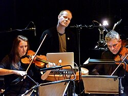

# Max Richter

## Biografía

Max Richter (22 de marzo de 1966, Hamelín, Alemania) es un productor, pianista y compositor británico, nacido en Alemania, de música contemporánea y minimalista, conocido por su vasta producción. Compone y graba su propia música; escribe para teatro, ópera, ballet y cine; produce y colabora en la grabación y presentación de otros artistas. Ha grabado siete álbumes en solitario y su música se usa ampliamente en el cine.​​

## Estilo musical

Max Richter CBE (/ ˈ r ɪ x t ər /; alemán: [ˈʁɪçtɐ]; nacido el 22 de marzo de 1966) es un compositor y pianista británico nacido en Alemania. Trabaja dentro de estilos posminimalistas y clásicos contemporáneos. [ 1 ] [ 2 ] [ 3 ] [ 4 ] Richter tiene formación clásica, se graduó en composición de la Universidad de Edimburgo, la Real Academia de Música de Londres y estudió con Luciano Berio en Italia. [ 5 ] [ 6 ]

## Anécdotas y curiosidades

Max Richter CBE (/ ˈ r ɪ x t ər /; alemán: [ˈʁɪçtɐ]; nacido el 22 de marzo de 1966) es un compositor y pianista británico nacido en Alemania. Trabaja dentro de estilos posminimalistas y clásicos contemporáneos. [ 1 ] [ 2 ] [ 3 ] [ 4 ] Richter tiene formación clásica, se graduó en composición de la Universidad de Edimburgo, la Real Academia de Música de Londres y estudió con Luciano Berio en Italia. [ 5 ] [ 6 ]

## Top 10 bandas sonoras

1. ***Hamnet (Título en España: Hamnet)***
    * **Póster:** [link](131_max_richter/posters/poster_hamnet_2025.jpg)
2. ***Ad Astra (Título en España: Ad astra)***
    * **Póster:** [link](131_max_richter/posters/poster_ad_astra_2019.jpg)
3. ***Hostiles (Título en España: Hostiles)***
    * **Póster:** [link](131_max_richter/posters/poster_hostiles_2017.jpg)
4. ***Miss Sloane (Título en España: El caso Sloane)***
    * **Póster:** [link](131_max_richter/posters/poster_miss_sloane_2016.jpg)
5. ***Disconnect (Título en España: Desconexión)***
    * **Póster:** [link](131_max_richter/posters/poster_disconnect_2013.jpg)
6. ***Spaceman (Título en España: El astronauta)***
    * **Póster:** [link](131_max_richter/posters/poster_spaceman_2024.jpg)
7. ***ואלס עם באשיר (Título en España: Vals con Bashir)***
    * **Póster:** [link](131_max_richter/posters/poster_poster_2008.jpg)
8. ***Mary Queen of Scots (Título en España: María reina de Escocia)***
    * **Póster:** [link](131_max_richter/posters/poster_mary_queen_of_scots_2018.jpg)
9. ***Escobar: Paradise Lost (Título en España: Escobar: Paraíso perdido)***
    * **Póster:** [link](131_max_richter/posters/poster_escobar_paradise_lost_2014.jpg)
10. ***White Boy Rick (Título en España: White Boy Rick)***
    * **Póster:** [link](131_max_richter/posters/poster_white_boy_rick_2018.jpg)

## Filmografía completa

- Geheime Geschichten (Título en España: Geheime Geschichten) (2004) · [Póster](131_max_richter/posters/poster_geheime_geschichten_2004.jpg)
- Soundproof (Título en España: Soundproof) (2006) · [Póster](131_max_richter/posters/poster_soundproof_2006.jpg)
- Nadzieja (Título en España: Nadzieja) (2007) · [Póster](131_max_richter/posters/poster_nadzieja_2007.jpg)
- Frankie Howerd: Rather You Than Me (Título en España: Frankie Howerd: Rather You Than Me) (2008) · [Póster](131_max_richter/posters/poster_frankie_howerd_rather_you_than_me_2008.jpg)
- Lost and Found (Título en España: Perdido y encontrado) (2008) · [Póster](131_max_richter/posters/poster_lost_and_found_2008.jpg)
- ואלס עם באשיר (Título en España: Vals con Bashir) (2008) · [Póster](131_max_richter/posters/poster_poster_2008.jpg)
- Vashti Bunyan: From Here to Before (Título en España: Vashti Bunyan: From Here to Before) (2008) · [Póster](131_max_richter/posters/poster_vashti_bunyan_from_here_to_before_2008.jpg)
- La prima linea (Título en España: La prima linea) (2009) · [Póster](131_max_richter/posters/poster_la_prima_linea_2009.jpg)
- Die Fremde (Título en España: La extraña) (2010) · [Póster](131_max_richter/posters/poster_die_fremde_2010.jpg)
- Elle s'appelait Sarah (Título en España: La llave de Sarah) (2010) · [Póster](131_max_richter/posters/poster_elle_s_appelait_sarah_2010.jpg)
- My Trip to Al-Qaeda (Título en España: My Trip to Al-Qaeda) (2010) · [Póster](131_max_richter/posters/poster_my_trip_to_al_qaeda_2010.jpg)
- Womb (Título en España: Womb) (2010) · [Póster](131_max_richter/posters/poster_womb_2010.jpg)
- Co raz zostało zapisane (Título en España: Co raz zostało zapisane) (2011) · [Póster](131_max_richter/posters/poster_co_raz_zosta_o_zapisane_2011.jpg)
- Edwin Boyd: Citizen Gangster (Título en España: El gangster) (2011) · [Póster](131_max_richter/posters/poster_edwin_boyd_citizen_gangster_2011.jpg)
- Impardonnables (Título en España: Impardonnables) (2011) · [Póster](131_max_richter/posters/poster_impardonnables_2011.jpg)
- Perfect Sense (Título en España: Perfect sense) (2011) · [Póster](131_max_richter/posters/poster_perfect_sense_2011.jpg)
- Lore (Título en España: Lore) (2012) · [Póster](131_max_richter/posters/poster_lore_2012.jpg)
- Disconnect (Título en España: Desconexión) (2013) · [Póster](131_max_richter/posters/poster_disconnect_2013.jpg)
- The Congress (Título en España: El congreso) (2013) · [Póster](131_max_richter/posters/poster_the_congress_2013.jpg)
- La Marque des anges - Miserere (Título en España: La Marque des anges - Miserere) (2013) · [Póster](131_max_richter/posters/poster_la_marque_des_anges_miserere_2013.jpg)
- Das Mädchen Wadjda (Título en España: La bicicleta verde) (2013) · [Póster](131_max_richter/posters/poster_das_m_dchen_wadjda_2013.jpg)
- Syngué Sabour - Pierre de patience (Título en España: La piedra de la paciencia) (2013) · [Póster](131_max_richter/posters/poster_syngu_sabour_pierre_de_patience_2013.jpg)
- La Religieuse (Título en España: La religiosa) (2013) · [Póster](131_max_richter/posters/poster_la_religieuse_2013.jpg)
- The Last Days on Mars (Título en España: Los últimos días en Marte) (2013) · [Póster](131_max_richter/posters/poster_the_last_days_on_mars_2013.jpg)
- The Lunchbox (Título en España: The Lunchbox) (2013) · [Póster](131_max_richter/posters/poster_the_lunchbox_2013.jpg)
- Escobar: Paradise Lost (Título en España: Escobar: Paraíso perdido) (2014) · [Póster](131_max_richter/posters/poster_escobar_paradise_lost_2014.jpg)
- Testament of Youth (Título en España: Testamento de juventud) (2015) · [Póster](131_max_richter/posters/poster_testament_of_youth_2015.jpg)
- Miss Sloane (Título en España: El caso Sloane) (2016) · [Póster](131_max_richter/posters/poster_miss_sloane_2016.jpg)
- Into the Forest (Título en España: En el bosque) (2016) · [Póster](131_max_richter/posters/poster_into_the_forest_2016.jpg)
- Morgan (Título en España: Morgan) (2016) · [Póster](131_max_richter/posters/poster_morgan_2016.jpg)
- The Sense of an Ending (Título en España: El sentido de un final) (2017) · [Póster](131_max_richter/posters/poster_the_sense_of_an_ending_2017.jpg)
- Hostiles (Título en España: Hostiles) (2017) · [Póster](131_max_richter/posters/poster_hostiles_2017.jpg)
- Werk ohne Autor (Título en España: La sombra del pasado) (2018) · [Póster](131_max_richter/posters/poster_werk_ohne_autor_2018.jpg)
- Mary Queen of Scots (Título en España: María reina de Escocia) (2018) · [Póster](131_max_richter/posters/poster_mary_queen_of_scots_2018.jpg)
- White Boy Rick (Título en España: White Boy Rick) (2018) · [Póster](131_max_richter/posters/poster_white_boy_rick_2018.jpg)
- Ad Astra (Título en España: Ad astra) (2019) · [Póster](131_max_richter/posters/poster_ad_astra_2019.jpg)
- The Forbidden City Concert: Carmina Burana (Título en España: The Forbidden City Concert: Carmina Burana) (2019) · [Póster](131_max_richter/posters/poster_the_forbidden_city_concert_carmina_burana_2019.jpg)
- Max Richter's Sleep (Título en España: Max Richter's Sleep) (2020) · [Póster](131_max_richter/posters/poster_max_richter_s_sleep_2020.jpg)
- Невесомость (Título en España: Невесомость) (2020) · [Póster](131_max_richter/posters/poster_poster_2020.jpg)
- Córy węgla (Título en España: Córy węgla) (2024) · [Póster](131_max_richter/posters/poster_c_ry_w_gla_2024.jpg)
- Spaceman (Título en España: El astronauta) (2024) · [Póster](131_max_richter/posters/poster_spaceman_2024.jpg)
- Les saisons de la danse (Título en España: Les saisons de la danse) (2024) · [Póster](131_max_richter/posters/poster_les_saisons_de_la_danse_2024.jpg)
- Hamnet (Título en España: Hamnet) (2025) · [Póster](131_max_richter/posters/poster_hamnet_2025.jpg)
- Max Richter's Sleep: Live at the Sydney Opera House (Título en España: Max Richter's Sleep: Live at the Sydney Opera House) · [Póster](131_max_richter/posters/poster_max_richter_s_sleep_live_at_the_sydney_opera_house.jpg)

## Premios y nominaciones

* 2008 – Premio de Cine Europeo al Mejor Compositor – por *ואלס עם באשיר (Título en España: Vals con Bashir)* – (Ganador)
* 2008 – Premio de Cine Europeo al Mejor Compositor – por *ואלס עם באשיר (Título en España: Vals con Bashir)* – (Nominación)
* 2013 – Echo Klassik – Música clásica sin fronteras – (Ganador)
* Comandante de la Orden del Imperio Británico – (Ganador)
* Premio de la Academia a la mejor banda sonora original – por *Hamnet (Título en España: Hamnet)* – (Nominación)

## Fuentes adicionales

* [MundoBSO](https://www.mundobso.com/compositor/richter-max) — site:mundobso.com
* [MundoBSO (2)](https://w.mundobso.com/bso/cartero-siempre-llama-dos-veces-el) — site:mundobso.com
* [MundoBSO (3)](https://www.mundobso.com/bso/milla-verde-la) — site:mundobso.com
* [Film Score Monthly](https://www.filmscoremonthly.com/board/posts.cfm?threadID=124199&forumID=1&archive=0) — site:filmscoremonthly.com
* [Film Score Monthly (2)](https://www.filmscoremonthly.com/board/posts.cfm?threadID=130003&forumID=1&archive=0) — site:filmscoremonthly.com
* [Film Score Monthly (3)](https://www.filmscoremonthly.com/fsmonline/free_article.cfm?ID=7513) — site:filmscoremonthly.com
* [SoundtrackCollector](https://www.soundtrackcollector.com/title/100338/Disconnect) — site:soundtrackcollector.com
* [SoundtrackCollector (2)](https://www.soundtrackcollector.com) — site:soundtrackcollector.com
* [SoundtrackCollector (3)](https://soundtrackcollector.com) — site:soundtrackcollector.com
* [WhatSong](https://www.whatsong.org/artist/4918) — site:whatsong.org
* [WhatSong (2)](https://www.whatsong.org/tvshow/the-crown/episode/7442) — site:whatsong.org
* [WhatSong (3)](https://www.whatsong.org/movie/hostiles) — site:whatsong.org

## Notas externas

* MundoBSO: Compositor y productor musical nacido en Hamelin (Alemania), el 22 de marzo de 1966. Se formó musicalmente en el Reino Unido, país donde se instaló para trabajar. Ha publicado varios álbumes y escrito la música de algunos largometrajes. Compositor y productor musical nacido en Hamelin (Alemania), el 22 de marzo de 1966. Se formó musicalmente en el Reino Unido, país donde se instaló para trabajar. Ha publicado varios álbumes y escrito la música de algunos largometrajes.
* MundoBSO (3): Compositor: Newman, Thomas Sello: Warner Duración: 66 minutos Información de la película Título original: The Green Mile Director: Frank Darabont Nacionalidad: EE UU Año: 1999 Argumento A mediados de los años treinta, un guarda de prisiones que custodia a los condenados a muerte descubre poderes sobrenaturales en un inmenso hombre negro, acusado de haber asesinado a dos niñas. Eso le llevará a creer en su inocencia. Premios Saturn: 1 nominación Compositor: Newman, Thomas Sello: Warner Duración: 66 minutos
* SoundtrackCollector (2): 14 de enero - Confesión de un comisionado de policía de Riz Ortolani a la fiscalía 3 de diciembre - Wolf Hall de Debbie Wiseman: El espejo y la luz
* WhatSong: Max Richter - Desconecta (Música de la película) Max Richter - Desconecta (Música de la película)
* WhatSong (2): Max Richter, Andre de Ridder, Konzerthaus Kammerorchester Berlin y Daniel Hope - Recompuesto por Max Richter: Vivaldi, The Four Seasons (Versión Deluxe) Margaret y Tony en la motocicleta se cruzan mientras los dos hacen el amor.
* WhatSong (3): Ryan Bingham - Hostiles (banda sonora original de la película) Ryan Bingham interpreta al sargento. Paul Malloy mientras toca la mandolina alrededor de la fogata.
* www.kinfolk.com: Para alguien cuya música tiene una huella tan sutil y delicada, Max Richter ha tenido una influencia sísmica durante la última década en la música. Su sonido característico rechaza los intrincados florecimientos de la música clásica, centrándose en cambio en figuras emotivas y accesibles de cuerdas y piano entrelazadas con sonidos electrónicos. Influyó en toda una escuela de compositores, incluidos Nils Frahm, Ólafur Arnalds y Jóhann Jóhannsson, para que interpretaran música contemplativa ante multitudes del tamaño de un estadio. Mientras continúa perfeccionando su estilo musical, el compositor británico nacido en Alemania, de 54 años, busca incesantemente encontrarse con sus oyentes en nuevos espacios. Ha compuesto para ballet, televisión (Black Mirror) y cine (Ad Astra, Arrival, Waltz with...
* www.udiscovermusic.com: Funciones Funciones en profundidad en este día Listas de uDiscover Álbumes redescubiertos Funciones > Funciones en profundidad en este día Listas de uDiscover Álbumes redescubiertos
* www.worldsoundtrackawards.com: Film Music Days Back Film Music Days Programa Conciertos Charlas y Masterclasses WSA Álbumes Ediciones pasadas Premios y Academia Volver Premios y Academia Ganadores y nominados WSAcademy Miembros Hazte miembro Presentaciones
* www.deutschegrammophon.com: Utilice * después de la última palabra cuando realice búsquedas con varias palabras (por ejemplo, van beethoven*) y como marcador de posición para completar palabras (por ejemplo, *eethov*) LOS CUADERNOS AZULES (Edición de 20 años) / Max Richter 31 de enero de 2025
* www.musicnotes.com: El nombre que está en la punta de la lengua a medida que la industria cinematográfica avanza hacia el siglo XX es el de Max Richter, un compositor británico nacido en Alemania. Su música se puede encontrar en salas de conciertos y en pantallas de cine de todo el mundo. También compone para televisión, prestando su talento a programas como The Leftovers. La razón de su éxito radica en el uso del estilo minimalista que ha aprovechado el espíritu de la época. Las composiciones de Max Richter son descendientes directas de la escuela de música minimalista. El descriptor "mínimo" aparece por primera vez en 1968 como una forma de describir música que presentaba estructuras rítmicas y armónicas cambiantes combinadas con repeticiones extremadamente largas...
* music.apple.com: Su toque elegante infunde sentimiento a la gran pantalla.
