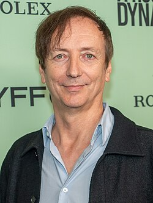

# Volker Bertelmann/Hauschka

## Biografía

Volker Bertelmann (nacido en 1966) es un pianista y compositor alemán que principalmente toca y graba bajo el nombre de Hauschka. Son conocidas sus composiciones para piano preparado.​​

## Estilo musical

Volker Bertelmann, mejor conocido como Hauschka, es el magnífico artista y compositor de vanguardia que ha definido el panorama musical de distinguidas películas y programas de televisión, incluidos Patrick Melrose, Adrift, Exodus, Gunpowder y Different Kinds of Rain. Fusionando diversos elementos de las tradiciones clásicas, las profundidades de la música electrónica y los sonidos de objetos encontrados, la innovación rítmica y la maravilla de la improvisación de Hauschka han desafiado y deleitado a audiencias de todo el mundo. Una clase magistral de minimalismo impactante, su música en colaboración con Dustin O'Halloran para Lion de Garth Davis obtuvo prestigiosas nominaciones a los Oscar, los Globos de Oro y los BAFTA, entre otros. En nuestra inspiradora conversación, Hauschka comparte su rica experiencia en piano preparado y detalla sus aventuras en el experimentalismo.

## Anécdotas y curiosidades

2 Alternancia de carrera Subsección de carrera 2.1 1992–2003: inicio de su carrera 2.2 2004–2006: inicios de piano preparados 2.3 2007–2010: espacio para expandirse, Ferndorf y paisajes extranjeros 2.4 2011–2014: Salon des Amateurs, Silfra y inicios de bandas sonoras cinematográficas 2.5 2015–presente: Lion, What If y obras encargadas

## Top 10 bandas sonoras

1. ***Lion (Título en España: Lion)***
    * **Póster:** [link](132_volker_bertelmann_hauschka/posters/poster_lion_2016.jpg)
2. ***The Old Guard (Título en España: La vieja guardia)***
    * **Póster:** [link](132_volker_bertelmann_hauschka/posters/poster_the_old_guard_2020.jpg)
3. ***Im Westen nichts Neues (Título en España: Sin novedad en el frente)***
    * **Póster:** [link](132_volker_bertelmann_hauschka/posters/poster_im_westen_nichts_neues_2022.jpg)
4. ***One Life (Título en España: Los niños de Winton)***
    * **Póster:** [link](132_volker_bertelmann_hauschka/posters/poster_one_life_2023.jpg)
5. ***The Amateur (Título en España: Amateur)***
    * **Póster:** [link](132_volker_bertelmann_hauschka/posters/poster_the_amateur_2025.jpg)
6. ***Conclave (Título en España: Cónclave)***
    * **Póster:** [link](132_volker_bertelmann_hauschka/posters/poster_conclave_2024.jpg)
7. ***The Art of Racing in the Rain (Título en España: El arte de vivir bajo la lluvia)***
    * **Póster:** [link](132_volker_bertelmann_hauschka/posters/poster_the_art_of_racing_in_the_rain_2019.jpg)
8. ***Adrift (Título en España: A la deriva)***
    * **Póster:** [link](132_volker_bertelmann_hauschka/posters/poster_adrift_2018.jpg)
9. ***Hotel Mumbai (Título en España: Hotel Bombay)***
    * **Póster:** [link](132_volker_bertelmann_hauschka/posters/poster_hotel_mumbai_2019.jpg)
10. ***A House of Dynamite (Título en España: Una casa llena de dinamita)***
    * **Póster:** [link](132_volker_bertelmann_hauschka/posters/poster_a_house_of_dynamite_2025.jpg)

## Filmografía completa

- Höhere Gewalt (Título en España: Höhere Gewalt) (2008) · [Póster](https://example.com/placeholder.jpg)
- Glück (Título en España: Felicidad) (2012) · [Póster](132_volker_bertelmann_hauschka/posters/poster_gl_ck_2012.jpg)
- Wild Horses (Título en España: Wild Horses) (2013) · [Póster](132_volker_bertelmann_hauschka/posters/poster_wild_horses_2013.jpg)
- Praia do Futuro (Título en España: Playa del Futuro) (2014) · [Póster](132_volker_bertelmann_hauschka/posters/poster_praia_do_futuro_2014.jpg)
- The Boy (Título en España: The Boy) (2015) · [Póster](132_volker_bertelmann_hauschka/posters/poster_the_boy_2015.jpg)
- Exodus: Where I come from is disappearing (Título en España: Exodus: Where I come from is disappearing) (2016) · [Póster](132_volker_bertelmann_hauschka/posters/poster_exodus_where_i_come_from_is_disappearing_2016.jpg)
- Lion (Título en España: Lion) (2016) · [Póster](132_volker_bertelmann_hauschka/posters/poster_lion_2016.jpg)
- In Dubious Battle (Título en España: Una lucha incierta) (2016) · [Póster](132_volker_bertelmann_hauschka/posters/poster_in_dubious_battle_2016.jpg)
- AlphaGo (Título en España: AlphaGo) (2017) · [Póster](132_volker_bertelmann_hauschka/posters/poster_alphago_2017.jpg)
- 1000 Arten Regen zu beschreiben (Título en España: 1000 Arten Regen zu beschreiben) (2018) · [Póster](132_volker_bertelmann_hauschka/posters/poster_1000_arten_regen_zu_beschreiben_2018.jpg)
- Adrift (Título en España: A la deriva) (2018) · [Póster](132_volker_bertelmann_hauschka/posters/poster_adrift_2018.jpg)
- Ashes in the Snow (Título en España: Retratos De Una Guerra) (2018) · [Póster](132_volker_bertelmann_hauschka/posters/poster_ashes_in_the_snow_2018.jpg)
- FX's A Christmas Carol (Título en España: Cuento de Navidad) (2019) · [Póster](132_volker_bertelmann_hauschka/posters/poster_fx_s_a_christmas_carol_2019.jpg)
- Cunningham (Título en España: Cunningham) (2019) · [Póster](132_volker_bertelmann_hauschka/posters/poster_cunningham_2019.jpg)
- The Art of Racing in the Rain (Título en España: El arte de vivir bajo la lluvia) (2019) · [Póster](132_volker_bertelmann_hauschka/posters/poster_the_art_of_racing_in_the_rain_2019.jpg)
- Als Hitler das rosa Kaninchen stahl (Título en España: El año que dejamos de jugar) (2019) · [Póster](132_volker_bertelmann_hauschka/posters/poster_als_hitler_das_rosa_kaninchen_stahl_2019.jpg)
- Hotel Mumbai (Título en España: Hotel Bombay) (2019) · [Póster](132_volker_bertelmann_hauschka/posters/poster_hotel_mumbai_2019.jpg)
- The Underdogs (Título en España: The Underdogs) (2019) · [Póster](132_volker_bertelmann_hauschka/posters/poster_the_underdogs_2019.jpg)
- Ammonite (Título en España: Ammonite) (2020) · [Póster](132_volker_bertelmann_hauschka/posters/poster_ammonite_2020.jpg)
- Summerland (Título en España: En Busca De Summerland) (2020) · [Póster](132_volker_bertelmann_hauschka/posters/poster_summerland_2020.jpg)
- المرشحة المثالية (Título en España: La candidata perfecta) (2020) · [Póster](132_volker_bertelmann_hauschka/posters/poster_poster_2020.jpg)
- The Old Guard (Título en España: La vieja guardia) (2020) · [Póster](132_volker_bertelmann_hauschka/posters/poster_the_old_guard_2020.jpg)
- Sörensen hat Angst (Título en España: Sörensen hat Angst) (2020) · [Póster](132_volker_bertelmann_hauschka/posters/poster_s_rensen_hat_angst_2020.jpg)
- Downhill (Título en España: Un desastre de altura) (2020) · [Póster](132_volker_bertelmann_hauschka/posters/poster_downhill_2020.jpg)
- Stowaway (Título en España: Polizón) (2021) · [Póster](132_volker_bertelmann_hauschka/posters/poster_stowaway_2021.jpg)
- Krigsseileren (Título en España: Krigsseileren) (2022) · [Póster](132_volker_bertelmann_hauschka/posters/poster_krigsseileren_2022.jpg)
- Against the Ice (Título en España: Perdidos en el Ártico) (2022) · [Póster](132_volker_bertelmann_hauschka/posters/poster_against_the_ice_2022.jpg)
- Im Westen nichts Neues (Título en España: Sin novedad en el frente) (2022) · [Póster](132_volker_bertelmann_hauschka/posters/poster_im_westen_nichts_neues_2022.jpg)
- Veden vartija (Título en España: Veden vartija) (2022) · [Póster](132_volker_bertelmann_hauschka/posters/poster_veden_vartija_2022.jpg)
- Jules (Título en España: Jules) (2023) · [Póster](132_volker_bertelmann_hauschka/posters/poster_jules_2023.jpg)
- The Dive (Título en España: La inmersión) (2023) · [Póster](132_volker_bertelmann_hauschka/posters/poster_the_dive_2023.jpg)
- One Life (Título en España: Los niños de Winton) (2023) · [Póster](132_volker_bertelmann_hauschka/posters/poster_one_life_2023.jpg)
- Conclave (Título en España: Cónclave) (2024) · [Póster](132_volker_bertelmann_hauschka/posters/poster_conclave_2024.jpg)
- Die Ironie des Lebens (Título en España: Die Ironie des Lebens) (2024) · [Póster](132_volker_bertelmann_hauschka/posters/poster_die_ironie_des_lebens_2024.jpg)
- The Crow (Título en España: El cuervo) (2024) · [Póster](132_volker_bertelmann_hauschka/posters/poster_the_crow_2024.jpg)
- A Sacrifice (Título en España: La secta) (2024) · [Póster](132_volker_bertelmann_hauschka/posters/poster_a_sacrifice_2024.jpg)
- The Amateur (Título en España: Amateur) (2025) · [Póster](132_volker_bertelmann_hauschka/posters/poster_the_amateur_2025.jpg)
- Delicious (Título en España: Delicia) (2025) · [Póster](132_volker_bertelmann_hauschka/posters/poster_delicious_2025.jpg)
- Grand Prix of Europe (Título en España: El Gran Premio; A todo Gas!!) (2025) · [Póster](132_volker_bertelmann_hauschka/posters/poster_grand_prix_of_europe_2025.jpg)
- Ballad of a Small Player (Título en España: Maldita suerte) (2025) · [Póster](132_volker_bertelmann_hauschka/posters/poster_ballad_of_a_small_player_2025.jpg)
- Dead of Winter (Título en España: Muerte en la nieve) (2025) · [Póster](132_volker_bertelmann_hauschka/posters/poster_dead_of_winter_2025.jpg)
- A House of Dynamite (Título en España: Una casa llena de dinamita) (2025) · [Póster](132_volker_bertelmann_hauschka/posters/poster_a_house_of_dynamite_2025.jpg)
- Corpus Delicti (Título en España: Corpus Delicti) (2026) · [Póster](132_volker_bertelmann_hauschka/posters/poster_corpus_delicti_2026.jpg)
- Panic Carefully (Título en España: Panic Carefully) (2027) · [Póster](132_volker_bertelmann_hauschka/posters/poster_panic_carefully_2027.jpg)
- Sequestered - Inside Conclave (Título en España: Sequestered - Inside Conclave) · [Póster](132_volker_bertelmann_hauschka/posters/poster_sequestered_inside_conclave.jpg)
- The Last Disturbance of Madeline Hynde (Título en España: The Last Disturbance of Madeline Hynde) · [Póster](132_volker_bertelmann_hauschka/posters/poster_the_last_disturbance_of_madeline_hynde.jpg)

## Premios y nominaciones

* BAFTA – (Nominación)
* BAFTA – (Ganador)
* BAFTA – por *Great Broadway Musical Moments from the Ed Sullivan Show (Título en España: Great Broadway Musical Moments from the Ed Sullivan Show)* – (Nominación)
* Globo de Oro – (Nominación)
* Premio de la Academia – (Nominación)
* Premio de la Academia – (Ganador)
* Premio de la Academia – por *Best Original Score* – (Nominación)
* Premio de la Academia – por *all major awards including the Academy Awards* – (Nominación)
* Óscar – (Nominación)
* Óscar – por *WWE Raw on Netflix Premier Post-Show (Título en España: WWE Raw on Netflix Premier Post-Show)* – (Nominación)
* Óscar – por *The Oscar Nominated Short Films 2012: Live Action (Título en España: The Oscar Nominated Short Films 2012: Live Action)* – (Nominación)

## Fuentes adicionales

* [MundoBSO](https://www.mundobso.com/compositor/bertelmann-volker) — site:mundobso.com
* [MundoBSO (2)](https://www.mundobso.com/bso/fenix-1123) — site:mundobso.com
* [MundoBSO (3)](https://w.mundobso.com/bso/cartero-siempre-llama-dos-veces-el) — site:mundobso.com
* [Film Score Monthly](https://www.filmscoremonthly.com/daily/index.cfm) — site:filmscoremonthly.com
* [Film Score Monthly (2)](https://www.filmscoremonthly.com/notes/wild_bunch_alt.html) — site:filmscoremonthly.com
* [Film Score Monthly (3)](https://www.filmscoremonthly.com/backissues/viewissue.cfm?issueID=80) — site:filmscoremonthly.com
* [SoundtrackCollector](https://www.soundtrackcollector.com/title/124900/Day+Of+The+Jackal,+The) — site:soundtrackcollector.com
* [SoundtrackCollector (2)](https://www.soundtrackcollector.com/catalog/soundtrackreviews.php?movieid=2787) — site:soundtrackcollector.com
* [SoundtrackCollector (3)](https://www.soundtrackcollector.com/viewarticle.php?articleid=702) — site:soundtrackcollector.com
* [WhatSong](https://www.whatsong.org/tvshow/how-i-met-your-mother/episode/44483) — site:whatsong.org
* [WhatSong (2)](https://www.whatsong.org/movie/green-street-hooligans) — site:whatsong.org
* [WhatSong (3)](https://www.whatsong.org/tvshow/travelers/episode/37733) — site:whatsong.org

## Notas externas

* MundoBSO: Nació en Kreuztal (Alemania), en 1966. Compositor y pianista que es conocido por su alias Hauschka, y que se destaca por sus actuaciones con piano preparado. Colabora ocasionalmente en el cine. Nació en Kreuztal (Alemania), en 1966. Compositor y pianista que es conocido por su alias Hauschka, y que se destaca por sus actuaciones con piano preparado. Colabora ocasionalmente en el cine.
* MundoBSO (2): Compositor: Julià, Roger Sello: Propaganda pel Fet! Duración: 33 minutos Información de la película Título original: Fènix 11·23 Director: Joel Joan, Sergi Lara Nacionalidad: España Año: 2011 Argumento Un joven crea una web para defender la lengua catalana. Una noche, la brigada antiterrorista irrumpe en su casa y lo acusa de terrorismo informático por haber enviadp un e-mail a una cadena de supermercados pidiendo el etiquetaje en catalán. Compositor: Julià, Roger Sello: Propaganda pel Fet! Duración: 33 minutos
* WhatSong: Lily y Robin bailan con los dos nerds del último año de secundaria. Se reproduce de fondo cuando Lilly, Robin y Barney intentan entrar a la fiesta. La canción es una canción que está incluida en iMovie.
* WhatSong (2): The Stone Roses - Getting There (Música de la película de Mary-Kate y Ashely Olsen) Cuando Bovver camina y va a provocar a los fanáticos de Birmingham en el estadio.
* WhatSong (3): La mejor fuente en línea de música de películas y televisión. Copyright © 2018 - 2026 Whatsong.org. Reservados todos los derechos.
* www.ableton.com: Loop Vea charlas, presentaciones y funciones de la Cumbre para creadores de música de Ableton Vea charlas, presentaciones y funciones de la Cumbre para creadores de música de Ableton
* www.awardsdaily.com: El compositor de cine Volker Bertelmann adoptó un enfoque abstracto y minimalista para la música de la película alemana nueve veces nominada al Oscar, Todo tranquilo en el frente occidental. En lugar de crear el tipo de sonido arrollador que cabría esperar de una epopeya bélica, Bertelmann optó por crear una atmósfera de incomodidad que imposibilita al espectador descansar, ni siquiera un segundo, mientras ve la película. Es una de las partituras más vanguardistas de este o cualquier otro año. En nuestra conversación, Bertelmann y yo discutimos cómo se le ocurrió la idea de crear sonidos disonantes para reflejar el horror de la guerra. Al hacerlo, ha producido una de las partituras más memorables de la historia del cine reciente.
* agencegloria.com: La Agencia Gloria representa a Volker Beterlmann para Francia, de acuerdo con Allegro Talent Group. Volker Bertlemann es un pianista, compositor y músico experimental de renombre internacional. En 2023, recibió un Oscar y un BAFTA en la categoría “Mejor banda sonora” por su trabajo en “EL OESTE, NADA NUEVO” de Edward Berger. Recientemente, la película “CONCLAVE” (también de Edward Berger) fue aclamada por la crítica y la música de Volker obtuvo nominaciones al Oscar (Mejor Música Original), los Globos de Oro (Mejor Música Original - Película), los Critics Choice Awards (Mejor Música) y los BAFTA (Mejor Música Original)....
* www.wisemusicclassical.com: El pianista y compositor experimental Volker Bertelmann, alias Hauschka, se autodenomina un "buscador de sonidos". Coloca pelotas de ping-pong en la caja de resonancia de su piano, coloca entre las cuerdas gomas de borrar, chinchetas y mucho más. Los sonidos que Bertelmann extrae de este modo de su piano preparado recuerdan a una batería exótica o a un dispositivo de efectos electrónicos. Pero en sus obras más recientes, el gran maestro del paisaje anímico pianístico ahora abre mundos sonoros bastante diferentes; Bertelmann ha descubierto la gran orquesta sinfónica. En la temporada 2014/15 es compositor residente de la Orquesta Sinfónica MDR de Leipzig. La orquesta y su director, Kristjan Järvi, encargaron...
* music.apple.com: Uisge Dhè (feat. Niall Gordà n) Upstreamâ·â2021 Gut gegen Nordwind (banda sonora original de la película) Gut gegen Nordwind (banda sonora original de la película) 2019
* music.apple.com: Ballad of a Small Player (banda sonora de la película de Netflix) Permanece en silencio en el frente occidental (banda sonora de la película de Netflix)â·â2022
* zff.com: El Festival de Cine de Zúrich honra al compositor alemán Volker Bertelmann con el Premio a la Trayectoria Profesional por la obra de su vida. Recibirá el premio el 30 de septiembre durante el 11º Concurso Internacional de Música de Cine (IFMC) en la Tonhalle Zurich. Bertelmann también es el presidente del jurado del IFMC de este año. Su lista de trabajos más conocidos incluye la banda sonora del drama contra la guerra TODO SILENCIO EN EL FRENTE OCCIDENTAL, que le valió al alemán un Oscar a principios de este año. Volker Bertelmann cuenta con muchos años de experiencia musical. © Carsten Sander
