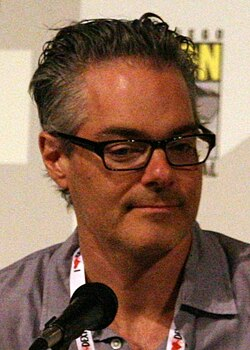

# Marco Beltrami

## Biografía

Marco Edward Beltrami (Long Island, 7 de octubre de 1966) es un compositor estadounidense, más conocido por su trabajo realizando bandas sonoras instrumentales de películas de terror como Mimic (1997), The Faculty (1998), Resident Evil (2002), Don't Be Afraid of the Dark (2011), The Woman in Black (2012) y Carrie (2013). Como gran amigo y colaborador de Wes Craven, Beltrami ha compuesto la banda sonora instrumental de siete de sus películas incluyendo las cuatro películas de la saga Scream (1996-2011). Beltrami ha sido nominado dos veces para los premios Óscar y ganó un Satellite a la mejor banda sonora por la película Soul Surfer (2011) y The Purge (2013).

## Estilo musical

Nació en Nueva York (EE UU), el 7 de octubre de 1966. Compositor con una carrera que dura ya dos décadas en las que ha logrado hacerse un nombre y labrarse una fama como uno de los músicos más sólidos y competentes de Hollywood. Ha trabajado con los mejores directores, y aunque se ha inclinado numerosas veces al género fantástico y de terror, ha demostrado sobradamente su polivalencia y su talento en películas de cualquier género. Nació en una familia de ascendencia griega e italiana. Durante toda su niñez y su juventud siempre sintió la vocación musical, y tras graduarse en el instituto, estudió en la Brown University, para posteriormente dar el salto a la Yale School of Music. Allí empezó...

## Anécdotas y curiosidades

Beltrami nació en Long Island, Nueva York, de ascendencia italiana y griega. [ 1 ] ​ Asistió al Ward Melville High School, y después, se graduó en la Universidad Brown y estudió en Yale School of Music, y entonces se trasladó al oeste a la USC Thornton School of Music en Los Ángeles donde estudió bajo las enseñanzas del legendario compositor Jerry Goldsmith.

## Top 10 bandas sonoras

1. ***The Hurt Locker (Título en España: En tierra hostil)***
    * **Póster:** [link](133_marco_beltrami/posters/poster_the_hurt_locker_2008.jpg)
2. ***3:10 to Yuma (Título en España: El tren de las 3:10)***
    * **Póster:** [link](133_marco_beltrami/posters/poster_3_10_to_yuma_2007.jpg)
3. ***Logan (Título en España: Logan)***
    * **Póster:** [link](133_marco_beltrami/posters/poster_logan_2017.jpg)
4. ***World War Z (Título en España: Guerra Mundial Z)***
    * **Póster:** [link](133_marco_beltrami/posters/poster_world_war_z_2013.jpg)
5. ***The Unholy Trinity (Título en España: Maldita trinidad)***
    * **Póster:** [link](133_marco_beltrami/posters/poster_the_unholy_trinity_2025.jpg)
6. ***A Quiet Place (Título en España: Un lugar tranquilo)***
    * **Póster:** [link](133_marco_beltrami/posters/poster_a_quiet_place_2018.jpg)
7. ***Scream (Título en España: Scream)***
    * **Póster:** [link](133_marco_beltrami/posters/poster_scream_1996.jpg)
8. ***Ford v Ferrari (Título en España: Le Mans '66)***
    * **Póster:** [link](133_marco_beltrami/posters/poster_ford_v_ferrari_2019.jpg)
9. ***Free Solo (Título en España: Free Solo)***
    * **Póster:** [link](133_marco_beltrami/posters/poster_free_solo_2018.jpg)
10. ***Venom: Let There Be Carnage (Título en España: Venom: habrá matanza)***
    * **Póster:** [link](133_marco_beltrami/posters/poster_venom_let_there_be_carnage_2021.jpg)

## Filmografía completa

- Death Match (Título en España: Death Match) (1994) · [Póster](133_marco_beltrami/posters/poster_death_match_1994.jpg)
- The Whispering (Título en España: The Whispering) (1995) · [Póster](133_marco_beltrami/posters/poster_the_whispering_1995.jpg)
- Inhumanoid (Título en España: Inhumanoid) (1996) · [Póster](133_marco_beltrami/posters/poster_inhumanoid_1996.jpg)
- Scream (Título en España: Scream) (1996) · [Póster](133_marco_beltrami/posters/poster_scream_1996.jpg)
- Mimic (Título en España: Mimic) (1997) · [Póster](133_marco_beltrami/posters/poster_mimic_1997.jpg)
- Scream 2 (Título en España: Scream 2) (1997) · [Póster](133_marco_beltrami/posters/poster_scream_2_1997.jpg)
- Stranger in My Home (Título en España: Stranger in My Home) (1997) · [Póster](133_marco_beltrami/posters/poster_stranger_in_my_home_1997.jpg)
- 54 (Título en España: 54 (Studio 54)) (1998) · [Póster](133_marco_beltrami/posters/poster_54_1998.jpg)
- David and Lisa (Título en España: David and Lisa) (1998) · [Póster](133_marco_beltrami/posters/poster_david_and_lisa_1998.jpg)
- The Faculty (Título en España: The Faculty) (1998) · [Póster](133_marco_beltrami/posters/poster_the_faculty_1998.jpg)
- The Florentine (Título en España: Apuesta a la vida) (1999) · [Póster](133_marco_beltrami/posters/poster_the_florentine_1999.jpg)
- Goodnight Moon & Other Sleepytime Tales (Título en España: Goodnight Moon & Other Sleepytime Tales) (1999) · [Póster](133_marco_beltrami/posters/poster_goodnight_moon_other_sleepytime_tales_1999.jpg)
- The Minus Man (Título en España: The Minus Man) (1999) · [Póster](133_marco_beltrami/posters/poster_the_minus_man_1999.jpg)
- Tuesdays with Morrie (Título en España: Tuesdays with Morrie) (1999) · [Póster](133_marco_beltrami/posters/poster_tuesdays_with_morrie_1999.jpg)
- Walking Across Egypt (Título en España: Walking Across Egypt) (1999) · [Póster](133_marco_beltrami/posters/poster_walking_across_egypt_1999.jpg)
- Dracula 2000 (Título en España: Drácula 2001) (2000) · [Póster](133_marco_beltrami/posters/poster_dracula_2000_2000.jpg)
- The Crow: Salvation (Título en España: El cuervo: Salvación) (2000) · [Póster](133_marco_beltrami/posters/poster_the_crow_salvation_2000.jpg)
- Goodbye, Casanova (Título en España: Goodbye, Casanova) (2000) · [Póster](133_marco_beltrami/posters/poster_goodbye_casanova_2000.jpg)
- Highway 395 (Título en España: Highway 395) (2000) · [Póster](133_marco_beltrami/posters/poster_highway_395_2000.jpg)
- The Watcher (Título en España: Juego asesino (The Watcher)) (2000) · [Póster](133_marco_beltrami/posters/poster_the_watcher_2000.jpg)
- Scream 3 (Título en España: Scream 3) (2000) · [Póster](133_marco_beltrami/posters/poster_scream_3_2000.jpg)
- Angel Eyes (Título en España: Mirada de ángel) (2001) · [Póster](133_marco_beltrami/posters/poster_angel_eyes_2001.jpg)
- Joy Ride (Título en España: Nunca juegues con extraños) (2001) · [Póster](133_marco_beltrami/posters/poster_joy_ride_2001.jpg)
- Blade II (Título en España: Blade II) (2002) · [Póster](133_marco_beltrami/posters/poster_blade_ii_2002.jpg)
- I Am Dina (Título en España: Dina) (2002) · [Póster](133_marco_beltrami/posters/poster_i_am_dina_2002.jpg)
- The Dangerous Lives of Altar Boys (Título en España: La peligrosa vida de los Altar boys) (2002) · [Póster](133_marco_beltrami/posters/poster_the_dangerous_lives_of_altar_boys_2002.jpg)
- The First $20 Million Is Always the Hardest (Título en España: Proyecto Magia) (2002) · [Póster](133_marco_beltrami/posters/poster_the_first_20_million_is_always_the_hardest_2002.jpg)
- Resident Evil (Título en España: Resident Evil) (2002) · [Póster](133_marco_beltrami/posters/poster_resident_evil_2002.jpg)
- Scoring Resident Evil (Título en España: Scoring Resident Evil) (2002) · [Póster](133_marco_beltrami/posters/poster_scoring_resident_evil_2002.jpg)
- The Blood Pact: The Making of 'Blade II' (Título en España: The Blood Pact: The Making of 'Blade II') (2002) · [Póster](133_marco_beltrami/posters/poster_the_blood_pact_the_making_of_blade_ii_2002.jpg)
- Dracula II: Ascension (Título en España: Drácula II: Resurrección) (2003) · [Póster](133_marco_beltrami/posters/poster_dracula_ii_ascension_2003.jpg)
- Terminator 3: Rise of the Machines (Título en España: Terminator 3: La rebelión de las máquinas) (2003) · [Póster](133_marco_beltrami/posters/poster_terminator_3_rise_of_the_machines_2003.jpg)
- Flight of the Phoenix (Título en España: El vuelo del Fénix) (2004) · [Póster](133_marco_beltrami/posters/poster_flight_of_the_phoenix_2004.jpg)
- Hellboy (Título en España: Hellboy) (2004) · [Póster](133_marco_beltrami/posters/poster_hellboy_2004.jpg)
- Hellboy: The Seeds of Creation (Título en España: Hellboy: The Seeds of Creation) (2004) · [Póster](133_marco_beltrami/posters/poster_hellboy_the_seeds_of_creation_2004.jpg)
- I, Robot (Título en España: Yo, robot) (2004) · [Póster](133_marco_beltrami/posters/poster_i_robot_2004.jpg)
- Cursed (Título en España: La maldición (Cursed)) (2005) · [Póster](133_marco_beltrami/posters/poster_cursed_2005.jpg)
- The Three Burials of Melquiades Estrada (Título en España: Los tres entierros de Melquiades Estrada) (2005) · [Póster](133_marco_beltrami/posters/poster_the_three_burials_of_melquiades_estrada_2005.jpg)
- Red Eye (Título en España: Vuelo nocturno) (2005) · [Póster](133_marco_beltrami/posters/poster_red_eye_2005.jpg)
- xXx: State of the Union (Título en España: xXx2: Estado de emergencia) (2005) · [Póster](133_marco_beltrami/posters/poster_xxx_state_of_the_union_2005.jpg)
- The Omen (Título en España: La profecía) (2006) · [Póster](133_marco_beltrami/posters/poster_the_omen_2006.jpg)
- Underworld: Evolution (Título en España: Underworld: Evolution) (2006) · [Póster](133_marco_beltrami/posters/poster_underworld_evolution_2006.jpg)
- Captivity (Título en España: Captivity (Cautivos)) (2007) · [Póster](133_marco_beltrami/posters/poster_captivity_2007.jpg)
- 3:10 to Yuma (Título en España: El tren de las 3:10) (2007) · [Póster](133_marco_beltrami/posters/poster_3_10_to_yuma_2007.jpg)
- Live Free or Die Hard (Título en España: La jungla 4.0) (2007) · [Póster](133_marco_beltrami/posters/poster_live_free_or_die_hard_2007.jpg)
- Vikaren (Título en España: La sustituta) (2007) · [Póster](133_marco_beltrami/posters/poster_vikaren_2007.jpg)
- The Invisible (Título en España: Lo que no se ve (The Invisible)) (2007) · [Póster](133_marco_beltrami/posters/poster_the_invisible_2007.jpg)
- Amusement (Título en España: Amusement: El juego del mal) (2008) · [Póster](133_marco_beltrami/posters/poster_amusement_2008.jpg)
- The Hurt Locker (Título en España: En tierra hostil) (2008) · [Póster](133_marco_beltrami/posters/poster_the_hurt_locker_2008.jpg)
- Max Payne (Título en España: Max Payne) (2008) · [Póster](133_marco_beltrami/posters/poster_max_payne_2008.jpg)
- L'Instinct de mort (Título en España: Mesrine Parte 1. Instinto de muerte) (2008) · [Póster](133_marco_beltrami/posters/poster_l_instinct_de_mort_2008.jpg)
- L'ennemi public n°1 (Título en España: Mesrine Parte 2. Enemigo público nº1) (2008) · [Póster](133_marco_beltrami/posters/poster_l_ennemi_public_n_1_2008.jpg)
- The Eye (Título en España: The Eye (Visiones)) (2008) · [Póster](133_marco_beltrami/posters/poster_the_eye_2008.jpg)
- In the Electric Mist (Título en España: En el centro de la tormenta) (2009) · [Póster](133_marco_beltrami/posters/poster_in_the_electric_mist_2009.jpg)
- Knowing (Título en España: Señales del futuro) (2009) · [Póster](133_marco_beltrami/posters/poster_knowing_2009.jpg)
- My Soul to Take (Título en España: Almas condenadas) (2010) · [Póster](133_marco_beltrami/posters/poster_my_soul_to_take_2010.jpg)
- Jonah Hex (Título en España: Jonah Hex) (2010) · [Póster](133_marco_beltrami/posters/poster_jonah_hex_2010.jpg)
- Don't Be Afraid of the Dark (Título en España: No tengas miedo a la oscuridad) (2010) · [Póster](133_marco_beltrami/posters/poster_don_t_be_afraid_of_the_dark_2010.jpg)
- Repo Men (Título en España: Repo Men) (2010) · [Póster](133_marco_beltrami/posters/poster_repo_men_2010.jpg)
- Soul Surfer (Título en España: Desafío sobre olas) (2011) · [Póster](133_marco_beltrami/posters/poster_soul_surfer_2011.jpg)
- The Sunset Limited (Título en España: El límite del atardecer) (2011) · [Póster](133_marco_beltrami/posters/poster_the_sunset_limited_2011.jpg)
- The Thing (Título en España: La cosa (The Thing)) (2011) · [Póster](133_marco_beltrami/posters/poster_the_thing_2011.jpg)
- Scream 4 (Título en España: Scream 4) (2011) · [Póster](133_marco_beltrami/posters/poster_scream_4_2011.jpg)
- Scream: The Inside Story (Título en España: Scream: Desde dentro) (2011) · [Póster](133_marco_beltrami/posters/poster_scream_the_inside_story_2011.jpg)
- Still Screaming: The Ultimate Scary Movie Retrospective (Título en España: Still Screaming: The Ultimate Scary Movie Retrospective) (2011) · [Póster](133_marco_beltrami/posters/poster_still_screaming_the_ultimate_scary_movie_retrospective_2011.jpg)
- Trouble with the Curve (Título en España: Golpe de efecto) (2012) · [Póster](133_marco_beltrami/posters/poster_trouble_with_the_curve_2012.jpg)
- Deadfall (Título en España: La huida) (2012) · [Póster](133_marco_beltrami/posters/poster_deadfall_2012.jpg)
- The Woman in Black (Título en España: La mujer de negro) (2012) · [Póster](133_marco_beltrami/posters/poster_the_woman_in_black_2012.jpg)
- The Sessions (Título en España: Las sesiones) (2012) · [Póster](133_marco_beltrami/posters/poster_the_sessions_2012.jpg)
- Carrie (Título en España: Carrie) (2013) · [Póster](133_marco_beltrami/posters/poster_carrie_2013.jpg)
- World War Z (Título en España: Guerra Mundial Z) (2013) · [Póster](133_marco_beltrami/posters/poster_world_war_z_2013.jpg)
- A Good Day to Die Hard (Título en España: La jungla: Un buen día para morir) (2013) · [Póster](133_marco_beltrami/posters/poster_a_good_day_to_die_hard_2013.jpg)
- The Wolverine (Título en España: Lobezno inmortal) (2013) · [Póster](133_marco_beltrami/posters/poster_the_wolverine_2013.jpg)
- Warm Bodies (Título en España: Memorias de un zombie adolescente) (2013) · [Póster](133_marco_beltrami/posters/poster_warm_bodies_2013.jpg)
- 설국열차 (Título en España: Rompenieves) (2013) · [Póster](133_marco_beltrami/posters/poster_poster_2013.jpg)
- 1864: Brødre i krig (Título en España: 1864) (2014) · [Póster](133_marco_beltrami/posters/poster_1864_br_dre_i_krig_2014.jpg)
- The Homesman (Título en España: Deuda de honor) (2014) · [Póster](133_marco_beltrami/posters/poster_the_homesman_2014.jpg)
- Seventh Son (Título en España: El séptimo hijo) (2014) · [Póster](133_marco_beltrami/posters/poster_seventh_son_2014.jpg)
- The November Man (Título en España: La conspiración de noviembre) (2014) · [Póster](133_marco_beltrami/posters/poster_the_november_man_2014.jpg)
- The Drop (Título en España: La entrega) (2014) · [Póster](133_marco_beltrami/posters/poster_the_drop_2014.jpg)
- The Woman in Black 2: Angel of Death (Título en España: La mujer de negro: El ángel de la muerte) (2014) · [Póster](133_marco_beltrami/posters/poster_the_woman_in_black_2_angel_of_death_2014.jpg)
- The Giver (Título en España: The Giver) (2014) · [Póster](133_marco_beltrami/posters/poster_the_giver_2014.jpg)
- The Gunman (Título en España: Caza al asesino) (2015) · [Póster](133_marco_beltrami/posters/poster_the_gunman_2015.jpg)
- Fantastic Four (Título en España: Cuatro Fantásticos) (2015) · [Póster](133_marco_beltrami/posters/poster_fantastic_four_2015.jpg)
- No Escape (Título en España: Golpe de estado) (2015) · [Póster](133_marco_beltrami/posters/poster_no_escape_2015.jpg)
- Hitman: Agent 47 (Título en España: Hitman: Agente 47) (2015) · [Póster](133_marco_beltrami/posters/poster_hitman_agent_47_2015.jpg)
- The Night Before (Título en España: Los tres reyes malos) (2015) · [Póster](133_marco_beltrami/posters/poster_the_night_before_2015.jpg)
- True Story (Título en España: Una historia real) (2015) · [Póster](133_marco_beltrami/posters/poster_true_story_2015.jpg)
- Ben-Hur (Título en España: Ben-Hur) (2016) · [Póster](133_marco_beltrami/posters/poster_ben_hur_2016.jpg)
- Gods of Egypt (Título en España: Dioses de Egipto) (2016) · [Póster](133_marco_beltrami/posters/poster_gods_of_egypt_2016.jpg)
- The Shallows (Título en España: Infierno azul) (2016) · [Póster](133_marco_beltrami/posters/poster_the_shallows_2016.jpg)
- The Snowman (Título en España: El muñeco de nieve) (2017) · [Póster](133_marco_beltrami/posters/poster_the_snowman_2017.jpg)
- Logan (Título en España: Logan) (2017) · [Póster](133_marco_beltrami/posters/poster_logan_2017.jpg)
- Making 'Logan' (Título en España: Making 'Logan') (2017) · [Póster](133_marco_beltrami/posters/poster_making_logan_2017.jpg)
- Матильда (Título en España: Matilda) (2017) · [Póster](133_marco_beltrami/posters/poster_poster_2017.jpg)
- Little Evil (Título en España: Pequeño demonio) (2017) · [Póster](133_marco_beltrami/posters/poster_little_evil_2017.jpg)
- Score: A Film Music Documentary (Título en España: Score: Compositores de Oscar) (2017) · [Póster](133_marco_beltrami/posters/poster_score_a_film_music_documentary_2017.jpg)
- First They Killed My Father (Título en España: Se lo llevaron: Recuerdos de una niña de Camboya) (2017) · [Póster](133_marco_beltrami/posters/poster_first_they_killed_my_father_2017.jpg)
- L'Empereur de Paris (Título en España: El emperador de París) (2018) · [Póster](133_marco_beltrami/posters/poster_l_empereur_de_paris_2018.jpg)
- Free Solo (Título en España: Free Solo) (2018) · [Póster](133_marco_beltrami/posters/poster_free_solo_2018.jpg)
- A Quiet Place (Título en España: Un lugar tranquilo) (2018) · [Póster](133_marco_beltrami/posters/poster_a_quiet_place_2018.jpg)
- Long Shot (Título en España: Casi imposible) (2019) · [Póster](133_marco_beltrami/posters/poster_long_shot_2019.jpg)
- Extremely Wicked, Shockingly Evil and Vile (Título en España: Extremadamente cruel, malvado y perverso) (2019) · [Póster](133_marco_beltrami/posters/poster_extremely_wicked_shockingly_evil_and_vile_2019.jpg)
- Scary Stories to Tell in the Dark (Título en España: Historias de miedo para contar en la oscuridad) (2019) · [Póster](133_marco_beltrami/posters/poster_scary_stories_to_tell_in_the_dark_2019.jpg)
- Ford v Ferrari (Título en España: Le Mans '66) (2019) · [Póster](133_marco_beltrami/posters/poster_ford_v_ferrari_2019.jpg)
- Velvet Buzzsaw (Título en España: Velvet Buzzsaw) (2019) · [Póster](133_marco_beltrami/posters/poster_velvet_buzzsaw_2019.jpg)
- Love and Monsters (Título en España: De amor y monstruos) (2020) · [Póster](133_marco_beltrami/posters/poster_love_and_monsters_2020.jpg)
- The Way I See It (Título en España: The Way I See It) (2020) · [Póster](133_marco_beltrami/posters/poster_the_way_i_see_it_2020.jpg)
- Underwater (Título en España: Underwater) (2020) · [Póster](133_marco_beltrami/posters/poster_underwater_2020.jpg)
- American Night (Título en España: American Night) (2021) · [Póster](133_marco_beltrami/posters/poster_american_night_2021.jpg)
- Chaos Walking (Título en España: Chaos Walking) (2021) · [Póster](133_marco_beltrami/posters/poster_chaos_walking_2021.jpg)
- Fear Street: 1994 (Título en España: La calle del terror - Parte 1: 1994) (2021) · [Póster](133_marco_beltrami/posters/poster_fear_street_1994_2021.jpg)
- Fear Street: 1978 (Título en España: La calle del terror - Parte 2: 1978) (2021) · [Póster](133_marco_beltrami/posters/poster_fear_street_1978_2021.jpg)
- Fear Street: 1666 (Título en España: La calle del terror - Parte 3: 1666) (2021) · [Póster](133_marco_beltrami/posters/poster_fear_street_1666_2021.jpg)
- A Quiet Place Part II (Título en España: Un lugar tranquilo 2) (2021) · [Póster](133_marco_beltrami/posters/poster_a_quiet_place_part_ii_2021.jpg)
- Skyggen i mit øje (Título en España: Una sombra en mi ojo) (2021) · [Póster](133_marco_beltrami/posters/poster_skyggen_i_mit_je_2021.jpg)
- Venom: Let There Be Carnage (Título en España: Venom: habrá matanza) (2021) · [Póster](133_marco_beltrami/posters/poster_venom_let_there_be_carnage_2021.jpg)
- Deep Water (Título en España: Aguas profundas) (2022) · [Póster](133_marco_beltrami/posters/poster_deep_water_2022.jpg)
- No Exit (Título en España: En la tormenta) (2022) · [Póster](133_marco_beltrami/posters/poster_no_exit_2022.jpg)
- Scream (Título en España: Scream) (2022) · [Póster](133_marco_beltrami/posters/poster_scream_2022.jpg)
- Plane (Título en España: El piloto) (2023) · [Póster](133_marco_beltrami/posters/poster_plane_2023.jpg)
- The Nun II (Título en España: La monja II) (2023) · [Póster](133_marco_beltrami/posters/poster_the_nun_ii_2023.jpg)
- Silent Night (Título en España: Noche de paz) (2023) · [Póster](133_marco_beltrami/posters/poster_silent_night_2023.jpg)
- Renfield (Título en España: Renfield) (2023) · [Póster](133_marco_beltrami/posters/poster_renfield_2023.jpg)
- The Killer (Título en España: The Killer) (2024) · [Póster](133_marco_beltrami/posters/poster_the_killer_2024.jpg)
- Deaf President Now! (Título en España: Deaf President Now!) (2025) · [Póster](133_marco_beltrami/posters/poster_deaf_president_now_2025.jpg)
- The Unholy Trinity (Título en España: Maldita trinidad) (2025) · [Póster](133_marco_beltrami/posters/poster_the_unholy_trinity_2025.jpg)
- Scream 7 (Título en España: Scream 7) (2026) · [Póster](133_marco_beltrami/posters/poster_scream_7_2026.jpg)

## Premios y nominaciones

* 2008 – Premio de la Academia a la mejor banda sonora original – por *3:10 to Yuma (Título en España: El tren de las 3:10)* – (Nominación)
* 2010 – Premio de la Academia a la mejor banda sonora original – por *The Hurt Locker (Título en España: En tierra hostil)* – (Nominación)

## Fuentes adicionales

* [MundoBSO](https://www.mundobso.com/compositor/beltrami-marco) — site:mundobso.com
* [MundoBSO (2)](https://w.mundobso.com/bso/cartero-siempre-llama-dos-veces-el) — site:mundobso.com
* [MundoBSO (3)](https://www.mundobso.com/bso/milla-verde-la) — site:mundobso.com
* [Film Score Monthly](https://filmscoremonthly.com/board/posts.cfm?threadID=157781&forumID=1&archive=0) — site:filmscoremonthly.com
* [Film Score Monthly (2)](https://www.filmscoremonthly.com/board/posts.cfm?forumID=1&pageID=2&threadID=69488&archive=0) — site:filmscoremonthly.com
* [Film Score Monthly (3)](https://www.filmscoremonthly.com/board/posts.cfm?pageID=1&forumID=1&threadID=77175&archive=0) — site:filmscoremonthly.com
* [SoundtrackCollector](https://www.soundtrackcollector.com/title/62414/Hellboy) — site:soundtrackcollector.com
* [SoundtrackCollector (2)](https://www.soundtrackcollector.com/catalog/composerdiscography.php?composerid=1374&offset=80) — site:soundtrackcollector.com
* [SoundtrackCollector (3)](https://www.soundtrackcollector.com) — site:soundtrackcollector.com
* [WhatSong](https://www.whatsong.org/movie/warm-bodies) — site:whatsong.org
* [WhatSong (2)](https://www.whatsong.org/movie/venom-let-there-be-carnage) — site:whatsong.org
* [WhatSong (3)](https://www.whatsong.org/movie/hellboy-2004) — site:whatsong.org

## Notas externas

* MundoBSO: Nació en Nueva York (EE UU), el 7 de octubre de 1966. Compositor con una carrera que dura ya dos décadas en las que ha logrado hacerse un nombre y labrarse una fama como uno de los músicos más sólidos y competentes de Hollywood. Ha trabajado con los mejores directores, y aunque se ha inclinado numerosas veces al género fantástico y de terror, ha demostrado sobradamente su polivalencia y su talento en películas de cualquier género. Nació en una familia de ascendencia griega e italiana. Durante toda su niñez y su juventud siempre sintió la vocación musical, y tras graduarse en el instituto, estudió en la Brown University, para posteriormente dar el salto a la Yale School of Music. Allí empezó...
* MundoBSO (3): Compositor: Newman, Thomas Sello: Warner Duración: 66 minutos Información de la película Título original: The Green Mile Director: Frank Darabont Nacionalidad: EE UU Año: 1999 Argumento A mediados de los años treinta, un guarda de prisiones que custodia a los condenados a muerte descubre poderes sobrenaturales en un inmenso hombre negro, acusado de haber asesinado a dos niñas. Eso le llevará a creer en su inocencia. Premios Saturn: 1 nominación Compositor: Newman, Thomas Sello: Warner Duración: 66 minutos
* SoundtrackCollector (3): 14 de enero - Confesión de un comisionado de policía de Riz Ortolani a la fiscalía 3 de diciembre - Wolf Hall de Debbie Wiseman: El espejo y la luz
* WhatSong: R está imaginando lo que hicieron algunos de los otros zombies antes de infectarse. R juega esto en su avión cuando está solo; R ve a Julie por primera vez.
* WhatSong (2): Escena de fiesta justo después de que Eddie y Venom discuten Harry Nilsson - Everybody's Talkin': The Very Best of Harry Nilsson
* WhatSong (3): Marco Beltrami - Hellboy (Banda Sonora Original de la Película) Marco Beltrami - Hellboy (Banda Sonora Original de la Película)
* www.projectumbrella.net: Editoriales Atracciones BIOHAZARD 7 Tutorial El Miedo BIOHAZARD CAFE & GRILL S.T.A.R.S. BIOHAZARD Nightmare BIOHAZARD THE ESCAPE BIOHAZARD THE ESCAPE BIOHAZARD THE ESCAPE 2 BIOHAZARD THE EXTREME BIOHAZARD THE REAL BIOHAZARD THE REAL BIOHAZARD THE REAL 2 BIOHAZARD THE REAL 3 Cronología cronológica de los materiales Ruinas de la mansión BIOHAZARD 2 Scriptbook BIO HAZARD DASH Umbrella Chronicles Cortar contenido Cortar archivos de Biohazard 4 Dino Crisis 2 Análisis del guión Biohazard Media Cronología Historia del Proyecto de Desarrollo Biohazard Resistencia Entrevista a Famitsu Información sobre S.T.A.R.S. miembros antes de Resident Evil 3 Conceptos de campaña de Resident Evil 6 Biohazard 0 entrevista con Kōji Oda Cut Monster...
* music.apple.com: Nueve perfectos desconocidos: Temporada 2 (Banda sonora de la serie original) Como un río alrededor de una roca Guerra Mundial Z (Música de la película)â·â2013
* www.marco-beltrami.com: Año Título Director Productora 2026 Sin título Joon-ho Bong Proyecto animado Joon-ho Bong 4th Creative Party The Royal Stunt Kief Davidson MRC Entertainment Unabomb Janus Metz 2.0 Entertainment / IM Global / MRC Film / Netflix Sin título Moriah Wilson Documental Marina Zenovich Anomaly Contenido y entretenimiento Scream 7 Kevin Williamson Spyglass Media Group / Outerback Entertainment / Paramount Pictures 2025 The Unholy Trinity Richard Gray Amadeus Producciones Presidente sordo ahora! Davis Guggenheim y Nyle DiMarco Concordia Studios 2024 Call Me Ted (Serie de TV, solo tema) Keith R. Clarke Point Blank Productions / MAX The Killer John Woo Universal Pictures / Entertainment One Apples Never...
* www.last.fm: Marco Beltrami (nacido el 7 de octubre de 1966) es un compositor y director de orquesta estadounidense conocido por su trabajo en bandas sonoras de cine y televisión. Ha compuesto música de varios géneros, incluidas películas de terror, acción, ciencia ficción, western y superhéroes. Los proyectos notables incluyen la serie Scream, Mimic, The Faculty, Resident Evil, A Quiet Place, Terminator 3: Rise of the Machines, Live Free or Die Hard, World War Z, I, Robot, Snowpiercer, 3:10 to Yuma, Jonah Hex, The Homesman, Hellboy, The Wolverine y Logan. Beltrami colaboró ​​frecuentemente con el director Wes Craven, musicalizando siete de sus películas, incluidas las cuatro entradas de la franquicia Scream de 1996 a 2011. También ha trabajado con directores...
* www.marco-beltrami.com: ¿Quién podría haber adivinado que Marco Beltrami, el compositor cinematográfico cuyas innovaciones musicales han redefinido el sonido del terror a finales del siglo XX, nunca había visto una película de terror antes de escribir una de sus partituras más conocidas? "Scream fue la primera que vi completa", revela, "antes estaba poco familiarizado con el género, probablemente porque soy un asustador barato. Sin embargo, al tener experiencia en conciertos, me di cuenta de que el terror se adapta bien a las técnicas de composición asociadas con la música del siglo XX, por lo que pude encontrar fácilmente una voz única para estas películas. Por supuesto, las películas en sí son un poco exageradas por derecho propio,...
* jhmoviecollection.fandom.com: Explorar la página principal Discutir todas las páginas Comunidad Mapas interactivos Publicaciones de blog recientes Películas Soul Tenet Sobre la luna Wonder Woman 1984 Tom the Hand 4 Podemos ser héroes
