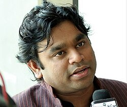

# A.R. Rahman

## Biografía

A. R. Rahman (tamil: ஏ.ஆர்.ரஹ்மான், hindi: ऐ.आर. रहमान; Chennai, Tamil Nadu, 6 de enero de 1966) es un compositor, productor y músico indio. Ha vendido más de 200 millones de casetes, siendo uno de los mayores vendedores musicales de la historia. Su carrera está ligada al cine por ser compositor de multitud de canciones de películas de Bollywood. Ha vendido más de 100 millones de discos donde se editaban canciones compuestas para estas películas. Dentro de los instrumentos utilizados para sus canciones, destaca los de teclados como el piano, o los de percusión, también cabe destacar la guitarra.

## Estilo musical

Con su estudio interno Panchathan Record Inn, la carrera de Rahman como compositor comenzó a principios de la década de 1990 con la película tamil Roja. [ 4 ] Después de eso, pasó a componer varias canciones para películas en tamil, incluida la políticamente cargada Bombay de Mani Ratnam, la urbana Kaadhalan, Thiruda Thiruda y la película debut de S. Shankar, Gentleman. La banda sonora de Rahman para su primera película de Hollywood, la comedia Couples Retreat (2009), ganó el premio BMI a la mejor banda sonora. Su música para Slumdog Millionaire (2008) le valió la Mejor Banda Sonora Original y la Mejor Canción Original (por Jai Ho) en la 81ª edición de los Premios de la Academia. También recibió el premio al Mejor Álbum de Banda Sonora Compilación y a la Mejor Canción Escrita para Medios Visuales en los Premios Grammy de 2010. Se le apoda "Isai Puyal" (traducido por Tormenta Musical) y "Mozart de Madrás". [ 5 ]

## Anécdotas y curiosidades

Allah Rakha Rahman (pronunciación ⓘ; nacido A. S. Dileep Kumar; 6 de enero de 1967), también conocido por las iniciales ARR, es un compositor musical, productor discográfico, cantante, compositor, multiinstrumentista y filántropo indio conocido por sus trabajos en el cine indio; predominantemente en películas tamil e hindi, con incursiones ocasionales en el cine internacional. Ha recibido seis Premios Nacionales de Cine, dos Premios de la Academia, dos Premios Grammy, un Premio BAFTA, un Premio Globo de Oro, seis Premios de Cine Estatal de Tamil Nadu, quince Premios Filmfare y dieciocho Premios Filmfare Sur. [ 2 ] En 2010, el Gobierno de la India le confirió el Padma Bhushan, el tercer premio civil más importante del país. [ 3 ]

## Top 10 bandas sonoras

1. ***Slumdog Millionaire (Título en España: Slumdog Millionaire)***
    * **Póster:** [link](134_a_r_rahman/posters/poster_slumdog_millionaire_2008.jpg)
2. ***127 Hours (Título en España: 127 horas)***
    * **Póster:** [link](134_a_r_rahman/posters/poster_127_hours_2010.jpg)
3. ***दिल से.. (Título en España: Dil se..)***
    * **Póster:** [link](134_a_r_rahman/posters/poster_poster_1998.jpg)
4. ***रंग दे बसंती (Título en España: Rang De Basanti)***
    * **Póster:** [link](134_a_r_rahman/posters/poster_poster_2006.jpg)
5. ***जोधा अकबर (Título en España: Jodhaa Akbar)***
    * **Póster:** [link](134_a_r_rahman/posters/poster_poster_2008.jpg)
6. ***Rockstar (Título en España: Rockstar)***
    * **Póster:** [link](134_a_r_rahman/posters/poster_rockstar_2011.jpg)
7. ***Couples Retreat (Título en España: Todo incluido)***
    * **Póster:** [link](134_a_r_rahman/posters/poster_couples_retreat_2009.jpg)

## Filmografía completa

- ரோஜா (Título en España: ரோஜா) (1992) · [Póster](134_a_r_rahman/posters/poster_poster_1992.jpg)
- യോദ്ധാ (Título en España: യോദ്ധാ) (1992) · [Póster](134_a_r_rahman/posters/poster_poster_1992.jpg)
- உழவன் (Título en España: உழவன்) (1993) · [Póster](134_a_r_rahman/posters/poster_poster_1993.jpg)
- கிழக்குச் சீமையிலே (Título en España: கிழக்குச் சீமையிலே) (1993) · [Póster](134_a_r_rahman/posters/poster_poster_1993.jpg)
- ஜென்டில்மேன் (Título en España: ஜென்டில்மேன்) (1993) · [Póster](134_a_r_rahman/posters/poster_poster_1993.jpg)
- திருடா திருடா (Título en España: திருடா திருடா) (1993) · [Póster](134_a_r_rahman/posters/poster_poster_1993.jpg)
- புதிய முகம் (Título en España: புதிய முகம்) (1993) · [Póster](134_a_r_rahman/posters/poster_poster_1993.jpg)
- Super Police (Título en España: Super Police) (1994) · [Póster](134_a_r_rahman/posters/poster_super_police_1994.jpg)
- கருத்தம்மா (Título en España: கருத்தம்மா) (1994) · [Póster](134_a_r_rahman/posters/poster_poster_1994.jpg)
- காதலன் (Título en España: காதலன்) (1994) · [Póster](134_a_r_rahman/posters/poster_poster_1994.jpg)
- டூயட் (Título en España: டூயட்) (1994) · [Póster](134_a_r_rahman/posters/poster_poster_1994.jpg)
- பவித்ரா (Título en España: பவித்ரா) (1994) · [Póster](134_a_r_rahman/posters/poster_poster_1994.jpg)
- புதிய மன்னர்கள் (Título en España: புதிய மன்னர்கள்) (1994) · [Póster](134_a_r_rahman/posters/poster_poster_1994.jpg)
- மே மாதம் (Título en España: மே மாதம்) (1994) · [Póster](134_a_r_rahman/posters/poster_poster_1994.jpg)
- வண்டிச்சோலை சின்ராசு (Título en España: வண்டிச்சோலை சின்ராசு) (1994) · [Póster](134_a_r_rahman/posters/poster_poster_1994.jpg)
- గ్యాంగ్ మాస్టర్ (Título en España: గ్యాంగ్ మాస్టర్) (1994) · [Póster](134_a_r_rahman/posters/poster_poster_1994.jpg)
- रंगीला (Título en España: रंगीला) (1995) · [Póster](134_a_r_rahman/posters/poster_poster_1995.jpg)
- இந்திரா (Título en España: இந்திரா) (1995) · [Póster](134_a_r_rahman/posters/poster_poster_1995.jpg)
- பம்பாய் (Título en España: பம்பாய்) (1995) · [Póster](134_a_r_rahman/posters/poster_poster_1995.jpg)
- முத்து (Título en España: முத்து) (1995) · [Póster](134_a_r_rahman/posters/poster_poster_1995.jpg)
- அந்திமந்தாரை (Título en España: அந்திமந்தாரை) (1996) · [Póster](134_a_r_rahman/posters/poster_poster_1996.jpg)
- இந்தியன் (Título en España: இந்தியன்) (1996) · [Póster](134_a_r_rahman/posters/poster_poster_1996.jpg)
- காதல் தேசம் (Título en España: காதல் தேசம்) (1996) · [Póster](134_a_r_rahman/posters/poster_poster_1996.jpg)
- மிஸ்டர் ரோமியோ (Título en España: மிஸ்டர் ரோமியோ) (1996) · [Póster](134_a_r_rahman/posters/poster_poster_1996.jpg)
- லவ் பேர்ட்ஸ் (Título en España: லவ் பேர்ட்ஸ்) (1996) · [Póster](134_a_r_rahman/posters/poster_poster_1996.jpg)
- फायर (Título en España: Fuego) (1997) · [Póster](134_a_r_rahman/posters/poster_poster_1997.jpg)
- दौड़ (Título en España: दौड़) (1997) · [Póster](134_a_r_rahman/posters/poster_poster_1997.jpg)
- இருவர் (Título en España: இருவர்) (1997) · [Póster](134_a_r_rahman/posters/poster_poster_1997.jpg)
- மின்சார கனவு (Título en España: மின்சார கனவு) (1997) · [Póster](134_a_r_rahman/posters/poster_poster_1997.jpg)
- ரட்சகன் (Título en España: ரட்சகன்) (1997) · [Póster](134_a_r_rahman/posters/poster_poster_1997.jpg)
- दिल से.. (Título en España: Dil se..) (1998) · [Póster](134_a_r_rahman/posters/poster_poster_1998.jpg)
- Kabhi Na Kabhi (Título en España: Kabhi Na Kabhi) (1998) · [Póster](134_a_r_rahman/posters/poster_kabhi_na_kabhi_1998.jpg)
- 1947: Earth (Título en España: Tierra) (1998) · [Póster](134_a_r_rahman/posters/poster_1947_earth_1998.jpg)
- डोली सजा के रखना (Título en España: डोली सजा के रखना) (1998) · [Póster](134_a_r_rahman/posters/poster_poster_1998.jpg)
- ஜீன்ஸ் (Título en España: ஜீன்ஸ்) (1998) · [Póster](134_a_r_rahman/posters/poster_poster_1998.jpg)
- ताल (Título en España: Taal) (1999) · [Póster](134_a_r_rahman/posters/poster_poster_1999.jpg)
- என் சுவாசக் காற்றே (Título en España: என் சுவாசக் காற்றே) (1999) · [Póster](134_a_r_rahman/posters/poster_poster_1999.jpg)
- காதலர் தினம் (Título en España: காதலர் தினம்) (1999) · [Póster](134_a_r_rahman/posters/poster_poster_1999.jpg)
- சங்கமம் (Título en España: சங்கமம்) (1999) · [Póster](134_a_r_rahman/posters/poster_poster_1999.jpg)
- ஜோடி (Título en España: ஜோடி) (1999) · [Póster](134_a_r_rahman/posters/poster_poster_1999.jpg)
- தாஜ்மகால் (Título en España: தாஜ்மகால்) (1999) · [Póster](134_a_r_rahman/posters/poster_poster_1999.jpg)
- படையப்பா (Título en España: படையப்பா) (1999) · [Póster](134_a_r_rahman/posters/poster_poster_1999.jpg)
- முதல்வன் (Título en España: முதல்வன்) (1999) · [Póster](134_a_r_rahman/posters/poster_poster_1999.jpg)
- पुकार (Título en España: पुकार) (2000) · [Póster](134_a_r_rahman/posters/poster_poster_2000.jpg)
- फ़िज़ा (Título en España: फ़िज़ा) (2000) · [Póster](134_a_r_rahman/posters/poster_poster_2000.jpg)
- அலைபாயுதே (Título en España: அலைபாயுதே) (2000) · [Póster](134_a_r_rahman/posters/poster_poster_2000.jpg)
- கண்டுகொண்டேன் கண்டுகொண்டேன் (Título en España: கண்டுகொண்டேன் கண்டுகொண்டேன்) (2000) · [Póster](134_a_r_rahman/posters/poster_poster_2000.jpg)
- தெனாலி (Título en España: தெனாலி) (2000) · [Póster](134_a_r_rahman/posters/poster_poster_2000.jpg)
- ரிதம் (Título en España: ரிதம்) (2000) · [Póster](134_a_r_rahman/posters/poster_poster_2000.jpg)
- लगान (Título en España: Lagaan: Érase una vez en la India) (2001) · [Póster](134_a_r_rahman/posters/poster_poster_2001.jpg)
- वन २ का ४ (Título en España: One 2 Ka 4) (2001) · [Póster](134_a_r_rahman/posters/poster_poster_2001.jpg)
- नायक (Título en España: नायक) (2001) · [Póster](134_a_r_rahman/posters/poster_poster_2001.jpg)
- பார்த்தாலே பரவசம் (Título en España: பார்த்தாலே பரவசம்) (2001) · [Póster](134_a_r_rahman/posters/poster_poster_2001.jpg)
- द लीज़ेंड ऑफ़ भगत सिंह (Título en España: La leyenda de Bhagat Singh) (2002) · [Póster](134_a_r_rahman/posters/poster_poster_2002.jpg)
- கன்னத்தில் முத்தமிட்டாள் (Título en España: Un beso en la mejilla) (2002) · [Póster](134_a_r_rahman/posters/poster_poster_2002.jpg)
- साथिया (Título en España: साथिया) (2002) · [Póster](134_a_r_rahman/posters/poster_poster_2002.jpg)
- காதல் வைரஸ் (Título en España: காதல் வைரஸ்) (2002) · [Póster](134_a_r_rahman/posters/poster_poster_2002.jpg)
- பாபா (Título en España: பாபா) (2002) · [Póster](134_a_r_rahman/posters/poster_poster_2002.jpg)
- 天地英雄 (Título en España: Guerreros del cielo y la tierra) (2003) · [Póster](134_a_r_rahman/posters/poster_poster_2003.jpg)
- பாய்ஸ் (Título en España: பாய்ஸ்) (2003) · [Póster](134_a_r_rahman/posters/poster_poster_2003.jpg)
- दिल ने जिसे अपना कहा (Título en España: दिल ने जिसे अपना कहा) (2004) · [Póster](134_a_r_rahman/posters/poster_poster_2004.jpg)
- युवा (Título en España: युवा) (2004) · [Póster](134_a_r_rahman/posters/poster_poster_2004.jpg)
- स्वदेस (Título en España: स्वदेस) (2004) · [Póster](134_a_r_rahman/posters/poster_poster_2004.jpg)
- ஆயுத எழுத்து (Título en España: ஆயுத எழுத்து) (2004) · [Póster](134_a_r_rahman/posters/poster_poster_2004.jpg)
- நியூ (Título en España: நியூ) (2004) · [Póster](134_a_r_rahman/posters/poster_poster_2004.jpg)
- నాని (Título en España: నాని) (2004) · [Póster](134_a_r_rahman/posters/poster_poster_2004.jpg)
- Water (Título en España: Agua) (2005) · [Póster](134_a_r_rahman/posters/poster_water_2005.jpg)
- Bollywood - Indiens klingendes Kino (Título en España: Bollywood - Indiens klingendes Kino) (2005) · [Póster](134_a_r_rahman/posters/poster_bollywood_indiens_klingendes_kino_2005.jpg)
- Bose: The Forgotten Hero (Título en España: Bose: The Forgotten Hero) (2005) · [Póster](134_a_r_rahman/posters/poster_bose_the_forgotten_hero_2005.jpg)
- Mangal Pandey - The Rising (Título en España: Mangal Pandey. Un hombre contra un imperio) (2005) · [Póster](134_a_r_rahman/posters/poster_mangal_pandey_the_rising_2005.jpg)
- அன்பே ஆருயிரே (Título en España: அன்பே ஆருயிரே) (2005) · [Póster](134_a_r_rahman/posters/poster_poster_2005.jpg)
- रंग दे बसंती (Título en España: Rang De Basanti) (2006) · [Póster](134_a_r_rahman/posters/poster_poster_2006.jpg)
- சில்லுனு ஒரு காதல் (Título en España: சில்லுனு ஒரு காதல்) (2006) · [Póster](134_a_r_rahman/posters/poster_poster_2006.jpg)
- வரலாறு (Título en España: வரலாறு) (2006) · [Póster](134_a_r_rahman/posters/poster_poster_2006.jpg)
- Elizabeth: The Golden Age (Título en España: Elizabeth: La edad de oro) (2007) · [Póster](134_a_r_rahman/posters/poster_elizabeth_the_golden_age_2007.jpg)
- Provoked: A True Story (Título en España: Provoked: una historia real) (2007) · [Póster](134_a_r_rahman/posters/poster_provoked_a_true_story_2007.jpg)
- गुरु (Título en España: गुरु) (2007) · [Póster](134_a_r_rahman/posters/poster_poster_2007.jpg)
- அழகிய தமிழ் மகன் (Título en España: அழகிய தமிழ் மகன்) (2007) · [Póster](134_a_r_rahman/posters/poster_poster_2007.jpg)
- சிவாஜி (Título en España: சிவாஜி) (2007) · [Póster](134_a_r_rahman/posters/poster_poster_2007.jpg)
- गजनी (Título en España: Ghajini) (2008) · [Póster](134_a_r_rahman/posters/poster_poster_2008.jpg)
- जोधा अकबर (Título en España: Jodhaa Akbar) (2008) · [Póster](134_a_r_rahman/posters/poster_poster_2008.jpg)
- जाने तू...या जाने ना (Título en España: Lo sepas o no) (2008) · [Póster](134_a_r_rahman/posters/poster_poster_2008.jpg)
- Sakkarakatti (Título en España: Sakkarakatti) (2008) · [Póster](134_a_r_rahman/posters/poster_sakkarakatti_2008.jpg)
- Slumdog Millionaire (Título en España: Slumdog Millionaire) (2008) · [Póster](134_a_r_rahman/posters/poster_slumdog_millionaire_2008.jpg)
- युव्वराज (Título en España: युव्वराज) (2008) · [Póster](134_a_r_rahman/posters/poster_poster_2008.jpg)
- Blue (Título en España: Blue) (2009) · [Póster](134_a_r_rahman/posters/poster_blue_2009.jpg)
- Couples Retreat (Título en España: Todo incluido) (2009) · [Póster](134_a_r_rahman/posters/poster_couples_retreat_2009.jpg)
- दिल्ली ६ (Título en España: दिल्ली ६) (2009) · [Póster](134_a_r_rahman/posters/poster_poster_2009.jpg)
- 127 Hours (Título en España: 127 horas) (2010) · [Póster](134_a_r_rahman/posters/poster_127_hours_2010.jpg)
- Ada... A Way of Life (Título en España: Ada... A Way of Life) (2010) · [Póster](134_a_r_rahman/posters/poster_ada_a_way_of_life_2010.jpg)
- Endhiran Making of Robot (Título en España: Endhiran Making of Robot) (2010) · [Póster](134_a_r_rahman/posters/poster_endhiran_making_of_robot_2010.jpg)
- Jhootha Hi Sahi (Título en España: Jhootha Hi Sahi) (2010) · [Póster](134_a_r_rahman/posters/poster_jhootha_hi_sahi_2010.jpg)
- எந்திரன் (Título en España: The robot (Terminator indio)) (2010) · [Póster](134_a_r_rahman/posters/poster_poster_2010.jpg)
- रावण (Título en España: रावण) (2010) · [Póster](134_a_r_rahman/posters/poster_poster_2010.jpg)
- ராவணன் (Título en España: ராவணன்) (2010) · [Póster](134_a_r_rahman/posters/poster_poster_2010.jpg)
- விண்ணைத்தாண்டி வருவாயா (Título en España: விண்ணைத்தாண்டி வருவாயா) (2010) · [Póster](134_a_r_rahman/posters/poster_poster_2010.jpg)
- ఏ మాయ చేసావే (Título en España: ఏ మాయ చేసావే) (2010) · [Póster](134_a_r_rahman/posters/poster_poster_2010.jpg)
- కొమరం పులి (Título en España: కొమరం పులి) (2010) · [Póster](134_a_r_rahman/posters/poster_poster_2010.jpg)
- Rockstar (Título en España: Rockstar) (2011) · [Póster](134_a_r_rahman/posters/poster_rockstar_2011.jpg)
- People Like Us (Título en España: Así somos) (2012) · [Póster](134_a_r_rahman/posters/poster_people_like_us_2012.jpg)
- Ekk Deewana Tha (Título en España: Ekk Deewana Tha) (2012) · [Póster](134_a_r_rahman/posters/poster_ekk_deewana_tha_2012.jpg)
- जब तक है जान (Título en España: Jab Tak Hai Jaan) (2012) · [Póster](134_a_r_rahman/posters/poster_poster_2012.jpg)
- रान्झाना (Título en España: रान्झाना) (2013) · [Póster](134_a_r_rahman/posters/poster_poster_2013.jpg)
- கடல் (Título en España: கடல்) (2013) · [Póster](134_a_r_rahman/posters/poster_poster_2013.jpg)
- மரியான் (Título en España: மரியான்) (2013) · [Póster](134_a_r_rahman/posters/poster_poster_2013.jpg)
- Million Dollar Arm (Título en España: El chico del millón de dólares) (2014) · [Póster](134_a_r_rahman/posters/poster_million_dollar_arm_2014.jpg)
- हाईवे (Título en España: Highway) (2014) · [Póster](134_a_r_rahman/posters/poster_poster_2014.jpg)
- Jai Ho (Título en España: Jai Ho) (2014) · [Póster](134_a_r_rahman/posters/poster_jai_ho_2014.jpg)
- Lekar Hum Deewana Dil (Título en España: Lekar Hum Deewana Dil) (2014) · [Póster](134_a_r_rahman/posters/poster_lekar_hum_deewana_dil_2014.jpg)
- The Distortion of Sound (Título en España: The Distortion of Sound) (2014) · [Póster](134_a_r_rahman/posters/poster_the_distortion_of_sound_2014.jpg)
- The Hundred-Foot Journey (Título en España: Un viaje de diez metros) (2014) · [Póster](134_a_r_rahman/posters/poster_the_hundred_foot_journey_2014.jpg)
- காவியத்தலைவன் (Título en España: காவியத்தலைவன்) (2014) · [Póster](134_a_r_rahman/posters/poster_poster_2014.jpg)
- கோச்சடையான் (Título en España: கோச்சடையான்) (2014) · [Póster](134_a_r_rahman/posters/poster_poster_2014.jpg)
- லிங்கா (Título en España: லிங்கா) (2014) · [Póster](134_a_r_rahman/posters/poster_poster_2014.jpg)
- ஐ (Título en España: Ai) (2015) · [Póster](134_a_r_rahman/posters/poster_poster_2015.jpg)
- محمد رسول‌الله (Título en España: Muhammad) (2015) · [Póster](134_a_r_rahman/posters/poster_poster_2015.jpg)
- तमाशा (Título en España: तमाशा) (2015) · [Póster](134_a_r_rahman/posters/poster_poster_2015.jpg)
- ஓ காதல் கண்மணி (Título en España: ஓ காதல் கண்மணி) (2015) · [Póster](134_a_r_rahman/posters/poster_poster_2015.jpg)
- 24 (Título en España: 24) (2016) · [Póster](134_a_r_rahman/posters/poster_24_2016.jpg)
- मोहेंजो डरो (Título en España: Mohenjo Daro) (2016) · [Póster](134_a_r_rahman/posters/poster_poster_2016.jpg)
- Pelé: Birth of a Legend (Título en España: Pelé: El nacimiento de una leyenda) (2016) · [Póster](134_a_r_rahman/posters/poster_pel_birth_of_a_legend_2016.jpg)
- அச்சம் என்பது மடமையடா (Título en España: அச்சம் என்பது மடமையடா) (2016) · [Póster](134_a_r_rahman/posters/poster_poster_2016.jpg)
- సాహసం శ్వాసగా సాగిపో (Título en España: సాహసం శ్వాసగా సాగిపో) (2016) · [Póster](134_a_r_rahman/posters/poster_poster_2016.jpg)
- Viceroy's House (Título en España: El último virrey de la India) (2017) · [Póster](134_a_r_rahman/posters/poster_viceroy_s_house_2017.jpg)
- மெர்சல் (Título en España: Mersal) (2017) · [Póster](134_a_r_rahman/posters/poster_poster_2017.jpg)
- माँ (Título en España: Mom) (2017) · [Póster](134_a_r_rahman/posters/poster_poster_2017.jpg)
- One Heart: The A.R. Rahman Concert Film (Título en España: One Heart: The A.R. Rahman Concert Film) (2017) · [Póster](134_a_r_rahman/posters/poster_one_heart_the_a_r_rahman_concert_film_2017.jpg)
- Roots (Título en España: Roots) (2017) · [Póster](134_a_r_rahman/posters/poster_roots_2017.jpg)
- Sachin: A Billion Dreams (Título en España: Sachin: A Billion Dreams) (2017) · [Póster](134_a_r_rahman/posters/poster_sachin_a_billion_dreams_2017.jpg)
- ओके जानू (Título en España: ओके जानू) (2017) · [Póster](134_a_r_rahman/posters/poster_poster_2017.jpg)
- காற்று வெளியிடை (Título en España: காற்று வெளியிடை) (2017) · [Póster](134_a_r_rahman/posters/poster_poster_2017.jpg)
- சினிமா வீரன் (Título en España: சினிமா வீரன்) (2017) · [Póster](134_a_r_rahman/posters/poster_poster_2017.jpg)
- 2.0 (Título en España: 2.0) (2018) · [Póster](134_a_r_rahman/posters/poster_2_0_2018.jpg)
- Beyond the Clouds (Título en España: Beyond the Clouds) (2018) · [Póster](134_a_r_rahman/posters/poster_beyond_the_clouds_2018.jpg)
- संजू (Título en España: Sanju) (2018) · [Póster](134_a_r_rahman/posters/poster_poster_2018.jpg)
- சர்கார் (Título en España: சர்கார்) (2018) · [Póster](134_a_r_rahman/posters/poster_poster_2018.jpg)
- செக்கச்சிவந்த வானம் (Título en España: செக்கச்சிவந்த வானம்) (2018) · [Póster](134_a_r_rahman/posters/poster_poster_2018.jpg)
- Blinded by the Light (Título en España: Blinded by the Light (Cegado por la luz)) (2019) · [Póster](134_a_r_rahman/posters/poster_blinded_by_the_light_2019.jpg)
- The Fakir of Venice (Título en España: The Fakir of Venice) (2019) · [Póster](134_a_r_rahman/posters/poster_the_fakir_of_venice_2019.jpg)
- رحمن (Título en España: رحمن) (2019) · [Póster](134_a_r_rahman/posters/poster_poster_2019.jpg)
- पी एम नरेंद्र मोदी (Título en España: पी एम नरेंद्र मोदी) (2019) · [Póster](134_a_r_rahman/posters/poster_poster_2019.jpg)
- சர்வம் தாளமயம் (Título en España: சர்வம் தாளமயம்) (2019) · [Póster](134_a_r_rahman/posters/poster_poster_2019.jpg)
- பிகில் (Título en España: பிகில்) (2019) · [Póster](134_a_r_rahman/posters/poster_poster_2019.jpg)
- Karthik Dial Seytha Yenn (Título en España: Karthik Dial Seytha Yenn) (2020) · [Póster](134_a_r_rahman/posters/poster_karthik_dial_seytha_yenn_2020.jpg)
- Shikara (Título en España: Shikara) (2020) · [Póster](134_a_r_rahman/posters/poster_shikara_2020.jpg)
- दिल बेचारा (Título en España: दिल बेचारा) (2020) · [Póster](134_a_r_rahman/posters/poster_poster_2020.jpg)
- 99 Songs (Título en España: 99 Songs) (2021) · [Póster](134_a_r_rahman/posters/poster_99_songs_2021.jpg)
- A.R. Rahman Live in Concert Expo 2020 Dubai (Título en España: A.R. Rahman Live in Concert Expo 2020 Dubai) (2021) · [Póster](134_a_r_rahman/posters/poster_a_r_rahman_live_in_concert_expo_2020_dubai_2021.jpg)
- अतरंगी रे (Título en España: Atrangi Re) (2021) · [Póster](134_a_r_rahman/posters/poster_poster_2021.jpg)
- मिमी (Título en España: Mimi) (2021) · [Póster](134_a_r_rahman/posters/poster_poster_2021.jpg)
- No Land's Man (Título en España: No Land's Man) (2021) · [Póster](134_a_r_rahman/posters/poster_no_land_s_man_2021.jpg)
- Tell It Like a Woman (Título en España: Cuéntalo como una mujer) (2022) · [Póster](134_a_r_rahman/posters/poster_tell_it_like_a_woman_2022.jpg)
- Heropanti 2 (Título en España: Heropanti 2) (2022) · [Póster](134_a_r_rahman/posters/poster_heropanti_2_2022.jpg)
- Le Musk (Título en España: Le Musk) (2022) · [Póster](134_a_r_rahman/posters/poster_le_musk_2022.jpg)
- வெந்து தணிந்தது காடு (Título en España: Vendhu Thanindhathu Kaadu) (2022) · [Póster](134_a_r_rahman/posters/poster_poster_2022.jpg)
- मिली (Título en España: मिली) (2022) · [Póster](134_a_r_rahman/posters/poster_poster_2022.jpg)
- இரவின் நிழல் (Título en España: இரவின் நிழல்) (2022) · [Póster](134_a_r_rahman/posters/poster_poster_2022.jpg)
- கோப்ரா (Título en España: கோப்ரா) (2022) · [Póster](134_a_r_rahman/posters/poster_poster_2022.jpg)
- பொன்னியின் செல்வன்: பாகம் 1 (Título en España: பொன்னியின் செல்வன்: பாகம் 1) (2022) · [Póster](134_a_r_rahman/posters/poster_1_2022.jpg)
- ആറാട്ട് (Título en España: ആറാട്ട്) (2022) · [Póster](134_a_r_rahman/posters/poster_poster_2022.jpg)
- മലയൻകുഞ്ഞ് (Título en España: മലയൻകുഞ്ഞ്) (2022) · [Póster](134_a_r_rahman/posters/poster_poster_2022.jpg)
- पिप्पा (Título en España: पिप्पा) (2023) · [Póster](134_a_r_rahman/posters/poster_poster_2023.jpg)
- பத்து தல (Título en España: பத்து தல) (2023) · [Póster](134_a_r_rahman/posters/poster_poster_2023.jpg)
- பொன்னியின் செல்வன்: பாகம் 2 (Título en España: பொன்னியின் செல்வன்: பாகம் 2) (2023) · [Póster](134_a_r_rahman/posters/poster_2_2023.jpg)
- மாமன்னன் (Título en España: மாமன்னன்) (2023) · [Póster](134_a_r_rahman/posters/poster_poster_2023.jpg)
- Headhunting to Beatboxing (Título en España: Headhunting to Beatboxing) (2024) · [Póster](134_a_r_rahman/posters/poster_headhunting_to_beatboxing_2024.jpg)
- Project One (Título en España: Project One) (2024) · [Póster](134_a_r_rahman/posters/poster_project_one_2024.jpg)
- अमर सिंह चमकीला (Título en España: अमर सिंह चमकीला) (2024) · [Póster](134_a_r_rahman/posters/poster_poster_2024.jpg)
- அயலான் (Título en España: அயலான்) (2024) · [Póster](134_a_r_rahman/posters/poster_poster_2024.jpg)
- ராயன் (Título en España: ராயன்) (2024) · [Póster](134_a_r_rahman/posters/poster_poster_2024.jpg)
- லால் சலாம் (Título en España: லால் சலாம்) (2024) · [Póster](134_a_r_rahman/posters/poster_poster_2024.jpg)
- ആടുജീവിതം (Título en España: ആടുജീവിതം) (2024) · [Póster](134_a_r_rahman/posters/poster_poster_2024.jpg)
- தக் லைஃப் (Título en España: Thug Life) (2025) · [Póster](134_a_r_rahman/posters/poster_poster_2025.jpg)
- उफ़्फ़ ये सियाप्पा (Título en España: उफ़्फ़ ये सियाप्पा) (2025) · [Póster](134_a_r_rahman/posters/poster_poster_2025.jpg)
- छावा (Título en España: छावा) (2025) · [Póster](134_a_r_rahman/posters/poster_poster_2025.jpg)
- तेरे इश्क़ में (Título en España: तेरे इश्क़ में) (2025) · [Póster](134_a_r_rahman/posters/poster_poster_2025.jpg)
- காதலிக்க நேரமில்லை (Título en España: காதலிக்க நேரமில்லை) (2025) · [Póster](134_a_r_rahman/posters/poster_poster_2025.jpg)
- Gandhi Talks (Título en España: Gandhi Talks) (2026) · [Póster](134_a_r_rahman/posters/poster_gandhi_talks_2026.jpg)
- रामायण (Título en España: रामायण) (2026) · [Póster](134_a_r_rahman/posters/poster_poster_2026.jpg)
- மூன் வாக் (Título en España: மூன் வாக்) (2026) · [Póster](134_a_r_rahman/posters/poster_poster_2026.jpg)
- పెద్ది (Título en España: పెద్ది) (2026) · [Póster](134_a_r_rahman/posters/poster_poster_2026.jpg)
- A.R.Rahman Live In Concert (Título en España: A.R.Rahman Live In Concert) · [Póster](134_a_r_rahman/posters/poster_a_r_rahman_live_in_concert.jpg)
- D56 (Título en España: D56) · [Póster](134_a_r_rahman/posters/poster_d56.jpg)
- Ebony McQueen (Título en España: Ebony McQueen) · [Póster](134_a_r_rahman/posters/poster_ebony_mcqueen.jpg)
- Lahore 1947 (Título en España: Lahore 1947) · [Póster](134_a_r_rahman/posters/poster_lahore_1947.jpg)
- Lijo - Hansal Mehta movie (Título en España: Lijo - Hansal Mehta movie) · [Póster](134_a_r_rahman/posters/poster_lijo_hansal_mehta_movie.jpg)
- Untitled LJP Film (Título en España: Untitled LJP Film) · [Póster](134_a_r_rahman/posters/poster_untitled_ljp_film.jpg)
- Untitled Maniratnam - Vijay Sethupathi Movie (Título en España: Untitled Maniratnam - Vijay Sethupathi Movie) · [Póster](134_a_r_rahman/posters/poster_untitled_maniratnam_vijay_sethupathi_movie.jpg)
- சங்கமித்ரா (Título en España: சங்கமித்ரா) · [Póster](134_a_r_rahman/posters/poster_poster.jpg)
- ஜீனி (Título en España: ஜீனி) · [Póster](134_a_r_rahman/posters/poster_poster.jpg)

## Premios y nominaciones

* 1992 – Premio Nacional de Cine a la Mejor Dirección Musical – por *Roja (Título en España: Roja)* – (Ganador)
* 1993 – Premio Filmfare al mejor director musical - Tamil – por *Roja (Título en España: Roja)* – (Ganador)
* 1994 – Premio Filmfare al mejor director musical - Tamil – por *Gentleman (Título en España: Gentleman)* – (Ganador)
* 1995 – Premio Filmfare RD Burman al nuevo talento musical – (Ganador)
* 1995 – Premio Filmfare al mejor director musical - Tamil – por *Sagunthalavin Kadhalan (Título en España: Sagunthalavin Kadhalan)* – (Ganador)
* 1996 – Premio Filmfare al mejor director musical – por *Rangeela (Título en España: Rangeela)* – (Ganador)
* 1996 – Premio Filmfare al mejor director musical - Tamil – por *Bombay (Título en España: Bombay)* – (Ganador)
* 1996 – Premio Nacional de Cine a la Mejor Dirección Musical – por *மின்சார கனவு (Título en España: மின்சார கனவு)* – (Ganador)
* 1997 – Premio Filmfare al mejor director musical - Tamil – por *காதல் தேசம் (Título en España: காதல் தேசம்)* – (Ganador)
* 1998 – Premio Filmfare al mejor director musical - Tamil – por *மின்சார கனவு (Título en España: மின்சார கனவு)* – (Ganador)
* 1999 – Premio Filmfare al mejor director musical – por *दिल से.. (Título en España: Dil se..)* – (Ganador)
* 1999 – Premio Filmfare al mejor director musical - Tamil – por *Jeans (Título en España: Jeans)* – (Ganador)
* 2000 – Padma Shri en las artes – (Ganador)
* 2000 – Premio Filmfare al mejor director musical – por *ताल (Título en España: Taal)* – (Ganador)
* 2000 – Premio Filmfare al mejor director musical - Tamil – por *വൺ (Título en España: വൺ)* – (Ganador)
* 2000 – Premio IIFA al Mejor Director Musical – por *ताल (Título en España: Taal)* – (Ganador)
* 2000 – Premio Zee Cine al mejor director musical – por *ताल (Título en España: Taal)* – (Ganador)
* 2001 – Premio Filmfare al mejor director musical - Tamil – por *அலைபாயுதே (Título en España: அலைபாயுதே)* – (Ganador)
* 2001 – Premio Nacional de Cine a la Mejor Dirección Musical – por *लगान (Título en España: Lagaan: Érase una vez en la India)* – (Ganador)
* 2002 – Premio Filmfare al mejor director musical – por *लगान (Título en España: Lagaan: Érase una vez en la India)* – (Ganador)
* 2002 – Premio IIFA al Mejor Director Musical – por *लगान (Título en España: Lagaan: Érase una vez en la India)* – (Ganador)
* 2002 – Premio Zee Cine al mejor director musical – por *लगान (Título en España: Lagaan: Érase una vez en la India)* – (Ganador)
* 2002 – Premio de la Película de Bollywood - Mejor Director Musical – por *लगान (Título en España: Lagaan: Érase una vez en la India)* – (Ganador)
* 2003 – Premio Filmfare a la mejor banda sonora de fondo – por *द लीज़ेंड ऑफ़ भगत सिंह (Título en España: La leyenda de Bhagat Singh)* – (Ganador)
* 2003 – Premio Filmfare al mejor director musical – por *साथिया (Título en España: साथिया)* – (Ganador)
* 2003 – Premio IIFA al Mejor Director Musical – por *साथिया (Título en España: साथिया)* – (Ganador)
* 2003 – Premio Zee Cine a la mejor música de fondo – por *द लीज़ेंड ऑफ़ भगत सिंह (Título en España: La leyenda de Bhagat Singh)* – (Ganador)
* 2003 – Premio Zee Cine al mejor director musical – por *साथिया (Título en España: साथिया)* – (Ganador)
* 2003 – Premio de la Película de Bollywood - Mejor Director Musical – por *साथिया (Título en España: साथिया)* – (Ganador)
* 2005 – Premio Filmfare a la mejor banda sonora de fondo – por *Videsi Nair Swadesi Nair (Título en España: Videsi Nair Swadesi Nair)* – (Ganador)
* 2007 – Premio Filmfare al mejor director musical – por *रंग दे बसंती (Título en España: Rang De Basanti)* – (Ganador)
* 2007 – Premio Filmfare al mejor director musical - Tamil – por *சில்லுனு ஒரு காதல் (Título en España: சில்லுனு ஒரு காதல்)* – (Ganador)
* 2007 – Premio IIFA al Mejor Director Musical – por *रंग दे बसंती (Título en España: Rang De Basanti)* – (Ganador)
* 2007 – Premio Vijay al mejor director musical – por *MGR Sivaji Rajini Kamal (Título en España: MGR Sivaji Rajini Kamal)* – (Ganador)
* 2007 – Premio Zee Cine al mejor director musical – por *रंग दे बसंती (Título en España: Rang De Basanti)* – (Ganador)
* 2008 – Premio Chevalier Sivaji Ganesan a la excelencia en el cine indio – (Ganador)
* 2008 – Premio Filmfare a la mejor banda sonora de fondo – por *Guru (Título en España: Guru)* – (Ganador)
* 2008 – Premio Filmfare al mejor director musical – por *Guru (Título en España: Guru)* – (Ganador)
* 2008 – Premio Filmfare al mejor director musical - Tamil – por *MGR Sivaji Rajini Kamal (Título en España: MGR Sivaji Rajini Kamal)* – (Ganador)
* 2008 – Premio IIFA al Mejor Director Musical – por *Guru (Título en España: Guru)* – (Ganador)
* 2008 – Premio Satellite a la mejor banda sonora original – por *Slumdog Millionaire (Título en España: Slumdog Millionaire)* – (Ganador)
* 2008 – Premio Zee Cine a la mejor música de fondo – por *Guru (Título en España: Guru)* – (Ganador)
* 2008 – Premio Zee Cine al mejor director musical – por *Guru (Título en España: Guru)* – (Ganador)
* 2008 – Premio de la Academia a la mejor canción original – por *Jai Ho (Título en España: Jai Ho)* – (Ganador)
* 2008 – Premio de la Broadcast Film Critics Association al mejor compositor – por *Slumdog Millionaire (Título en España: Slumdog Millionaire)* – (Ganador)
* 2009 – CNN-News18 Indio del Año – (Ganador)
* 2009 – Premio Apsara al mejor director musical – por *जोधा अकबर (Título en España: Jodhaa Akbar)* – (Ganador)
* 2009 – Premio BAFTA a la mejor música original – (Ganador)
* 2009 – Premio Filmfare a la mejor banda sonora de fondo – por *जोधा अकबर (Título en España: Jodhaa Akbar)* – (Ganador)
* 2009 – Premio Filmfare al mejor director musical – por *जाने तू...या जाने ना (Título en España: Lo sepas o no)* – (Ganador)
* 2009 – Premio Grammy a la mejor banda sonora recopilatoria para medios visuales – por *Slumdog Millionaire (Título en España: Slumdog Millionaire)* – (Ganador)
* 2009 – Premio Grammy a la mejor canción escrita para medios visuales – por *Jai Ho (Título en España: Jai Ho)* – (Ganador)
* 2009 – Premio IIFA al Mejor Director Musical – por *जोधा अकबर (Título en España: Jodhaa Akbar)* – (Ganador)
* 2009 – Premio de la Academia a la mejor banda sonora original – por *Slumdog Millionaire (Título en España: Slumdog Millionaire)* – (Ganador)
* 2009 – Premio de la Academia a la mejor banda sonora original – por *Slumdog Millionaire (Título en España: Slumdog Millionaire)* – (Nominación)
* 2009 – Premio de la Academia a la mejor canción original – por *Jai Ho (Título en España: Jai Ho)* – (Nominación)
* 2009 – Premio de la Academia a la mejor canción original – por *O Verdadeiro Poder dos Sayajins (Título en España: O Verdadeiro Poder dos Sayajins)* – (Nominación)
* 2010 – Padma Bhushan – (Ganador)
* 2010 – Premio Filmfare al mejor director musical – (Ganador)
* 2010 – Premio de la Asociación de Críticos de Cine a la Mejor Canción – por *And I Will Rise, If Only To Hold You Down (Título en España: And I Will Rise, If Only To Hold You Down)* – (Ganador)
* 2011 – Premio Filmfare al mejor director musical - Tamil – por *விண்ணைத்தாண்டி வருவாயா (Título en España: விண்ணைத்தாண்டி வருவாயா)* – (Ganador)
* 2011 – Premio Filmfare al mejor director musical - Telugu – por *ఏ మాయ చేసావే (Título en España: ఏ మాయ చేసావే)* – (Ganador)
* 2011 – Premio de la Academia a la mejor banda sonora original – por *127 Hours (Título en España: 127 horas)* – (Nominación)
* 2011 – Premio de la Academia a la mejor canción original – por *And I Will Rise, If Only To Hold You Down (Título en España: And I Will Rise, If Only To Hold You Down)* – (Nominación)
* 2012 – Premio Apsara al mejor director musical – por *Rockstar (Título en España: Rockstar)* – (Ganador)
* 2012 – Premio Filmfare al mejor director musical – por *Rockstar (Título en España: Rockstar)* – (Ganador)
* 2012 – Premio IIFA al Mejor Director Musical – por *Rockstar (Título en España: Rockstar)* – (Ganador)
* 2012 – Premio Zee Cine al mejor director musical – por *Rockstar (Título en España: Rockstar)* – (Ganador)
* 2013 – Premio Vijay al mejor director musical – por *KADAL (Título en España: KADAL)* – (Ganador)
* 2014 – Premio Filmfare al mejor director musical - Tamil – por *KADAL (Título en España: KADAL)* – (Ganador)
* 2016 – Premio de Cultura Asiática de Fukuoka – (Ganador)
* título honoris causa – (Ganador)

## Fuentes adicionales

* [MundoBSO](https://www.mundobso.com/bso/star-trek-insurrection) — site:mundobso.com
* [MundoBSO (2)](https://w.mundobso.com/bso/cartero-siempre-llama-dos-veces-el) — site:mundobso.com
* [MundoBSO (3)](https://www.mundobso.com/bso/milla-verde-la) — site:mundobso.com
* [Film Score Monthly](https://www.filmscoremonthly.com) — site:filmscoremonthly.com
* [Film Score Monthly (2)](https://www.filmscoremonthly.com/board/posts.cfm?threadID=130298&forumID=1&archive=0) — site:filmscoremonthly.com
* [Film Score Monthly (3)](https://www.filmscoremonthly.com/board/posts.cfm?threadID=160285&forumID=1&archive=0) — site:filmscoremonthly.com
* [SoundtrackCollector](https://www.soundtrackcollector.com) — site:soundtrackcollector.com
* [SoundtrackCollector (2)](https://soundtrackcollector.com) — site:soundtrackcollector.com
* [SoundtrackCollector (3)](https://www.soundtrackcollector.com/title/6013/Lost+World:+Jurassic+Park,+The) — site:soundtrackcollector.com
* [WhatSong](https://www.whatsong.org) — site:whatsong.org
* [WhatSong (2)](https://www.whatsong.org/movie/slumdog-millionaire) — site:whatsong.org
* [WhatSong (3)](https://www.whatsong.org/movie/kochadaiiyaan) — site:whatsong.org

## Notas externas

* MundoBSO: Compositor: Goldsmith, Jerry Sello: GNP Duración: 79 minutos Información de la película Título original: Star Trek: Insurrection Director: Jonathan Frakes Nacionalidad: EE UU Año: 1998 Argumento La tripulación de la nave Enterprise encuentra un planeta con propiedades mágicas, en el que sus habitantes viven en eterna paz... hasta que surge la amenaza de invasión. Compositor: Goldsmith, Jerry Sello: GNP Duración: 79 minutos
* MundoBSO (3): Compositor: Newman, Thomas Sello: Warner Duración: 66 minutos Información de la película Título original: The Green Mile Director: Frank Darabont Nacionalidad: EE UU Año: 1999 Argumento A mediados de los años treinta, un guarda de prisiones que custodia a los condenados a muerte descubre poderes sobrenaturales en un inmenso hombre negro, acusado de haber asesinado a dos niñas. Eso le llevará a creer en su inocencia. Premios Saturn: 1 nominación Compositor: Newman, Thomas Sello: Warner Duración: 66 minutos
* Film Score Monthly: FSM HOME FilmScoreDaily FilmScoreFriday The Aisle Seat LukasKendall.com TABLERO DE MENSAJES Discusión general Puesto comercial Discusión sobre partituras no cinematográficas
* SoundtrackCollector: 14 de enero - Confesión de un comisionado de policía de Riz Ortolani a la fiscalía 3 de diciembre - Wolf Hall de Debbie Wiseman: El espejo y la luz
* SoundtrackCollector (3): * Lost World, The (1996, Estados Unidos, título provisional) * Jurassic Park 2 (1996, Estados Unidos, título provisional)
* WhatSong: La mejor fuente en línea de música de películas y televisión. Copyright © 2018 - 2026 Whatsong.org. Reservados todos los derechos.
* WhatSong (2): M.I.A - Slumdog Millionaire (Música de la película) 00:06 Los niños juegan al cricket en la pista de aterrizaje, Jamal deja caer la pelota. Las autoridades los persiguen por los barrios marginales
* WhatSong (3): ARKANSAS. Rahman - Kochadaiiyaan (partitura de fondo original) A.R. Rahman - Kochadaiiyaan (partitura de fondo original)
* rahmaniac.com: Entrevistas Recientes Año 2024 Año 2023 Año 2022 Año 2021 Entre 2016 – 2020 Año 2020 Año 2019 Año 2018 Año 2017 Año 2016
* www.britannica.com: Nuestros editores revisarán lo que ha enviado y determinarán si deben revisar el artículo. NPR-AR Rahman anota con 'Slumdog Millionaire'
* www.masterworksbroadway.com: A R Rahman, a veces llamado el John Williams del cine indio, es un compositor sorprendentemente prolífico y exitoso de bandas sonoras de películas, canciones y otras músicas. Quizás sea más conocido en Occidente por su musical Bombay Dreams de 2002, que se presentó en el West End de Londres y luego en Broadway, y por la música de la exitosa película Slumdog Millionaire (2008), por la que ganó un premio Critics' Choice, el Globo de Oro a la mejor banda sonora original, el premio BAFTA a la mejor música para cine y dos premios de la Academia® a la mejor banda sonora original y a la mejor canción original. Nacido en 1966 en Chennai, Tamil Nadu, India, Allah Rakha Rahman tenía una formación musical. Su padre, un compositor que trabajó en la película...
* rahmaniac.com: Entrevistas Recientes Año 2024 Año 2023 Año 2022 Año 2021 Entre 2016 – 2020 Año 2020 Año 2019 Año 2018 Año 2017 Año 2016
