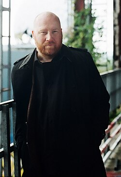

# Jóhann Jóhannsson

## Biografía

Jóhann Jóhannsson (pronunciación islandesa: [ˈjouːhan ˈjouːhansɔn]; Reikiavik, 19 de septiembre de 1969-Berlín, 9 de febrero de 2018)​ fue un compositor islandés que publicó discos en solitario desde 2002 hasta 2016 y compuso música para una amplia variedad de medios, incluyendo teatro, danza, televisión y películas. Fue nominado en dos ocasiones al Premio Óscar a la mejor banda sonora original y ganó un Globo de Oro a la mejor banda sonora original.

## Estilo musical

Jóhann Gunnar Jóhannsson (pronunciación de islandés: [ˈjouːhan ˈjouːhansɔn]; 19 de septiembre de 1969 - 9 de febrero de 2018) fue un compositor islandés que escribió música para una amplia gama de medios, incluidos teatro, danza, televisión y cine. Su trabajo está estilizado por la combinación de orquestación tradicional con elementos electrónicos contemporáneos. [ 2 ]

## Anécdotas y curiosidades

Primero hay que decir esto: me encantaba la música de Jóhann Jóhannsson. Fue poco convencional, experimental y profundamente creativo, al igual que su creador. Si bien nunca lo conocí ni lo conocí personalmente, me sentí vagamente conectado con él, ya que ambos éramos conocidos por combinar sonidos clásicos y electrónica moderna. Incluso teníamos amigos en común y trabajábamos con varios de los mismos músicos.

## Top 10 bandas sonoras

1. ***The Theory of Everything (Título en España: La teoría del todo)***
    * **Póster:** [link](139_j_hann_j_hannsson/posters/poster_the_theory_of_everything_2014.jpg)
2. ***Sicario (Título en España: Sicario)***
    * **Póster:** [link](139_j_hann_j_hannsson/posters/poster_sicario_2015.jpg)
3. ***Prisoners (Título en España: Prisioneros)***
    * **Póster:** [link](139_j_hann_j_hannsson/posters/poster_prisoners_2013.jpg)
4. ***Arrival (Título en España: La llegada)***
    * **Póster:** [link](139_j_hann_j_hannsson/posters/poster_arrival_2016.jpg)
5. ***Mandy (Título en España: Mandy)***
    * **Póster:** [link](139_j_hann_j_hannsson/posters/poster_mandy_2018.jpg)
6. ***Lovesong (Título en España: Lovesong)***
    * **Póster:** [link](139_j_hann_j_hannsson/posters/poster_lovesong_2017.jpg)
7. ***Mary Magdalene (Título en España: María Magdalena)***
    * **Póster:** [link](139_j_hann_j_hannsson/posters/poster_mary_magdalene_2018.jpg)
8. ***Personal Effects (Título en España: Efectos personales)***
    * **Póster:** [link](139_j_hann_j_hannsson/posters/poster_personal_effects_2009.jpg)
9. ***The Mercy (Título en España: Un océano entre nosotros)***
    * **Póster:** [link](139_j_hann_j_hannsson/posters/poster_the_mercy_2018.jpg)
10. ***Last and First Men (Título en España: Last and First Men)***
    * **Póster:** [link](139_j_hann_j_hannsson/posters/poster_last_and_first_men_2020.jpg)

## Filmografía completa

- Íslenski draumurinn (Título en España: Íslenski draumurinn) (2000) · [Póster](139_j_hann_j_hannsson/posters/poster_slenski_draumurinn_2000.jpg)
- Maður eins og ég (Título en España: Maður eins og ég) (2002) · [Póster](139_j_hann_j_hannsson/posters/poster_ma_ur_eins_og_g_2002.jpg)
- Dís (Título en España: Dís) (2004) · [Póster](139_j_hann_j_hannsson/posters/poster_d_s_2004.jpg)
- Gargandi snilld (Título en España: Gargandi snilld) (2005) · [Póster](139_j_hann_j_hannsson/posters/poster_gargandi_snilld_2005.jpg)
- Blóðbönd (Título en España: Thicker Than Water) (2006) · [Póster](139_j_hann_j_hannsson/posters/poster_bl_b_nd_2006.jpg)
- Ópium: Egy elmebeteg nő naplója (Título en España: Ópium: Egy elmebeteg nő naplója) (2007) · [Póster](139_j_hann_j_hannsson/posters/poster_pium_egy_elmebeteg_n_napl_ja_2007.jpg)
- Varmints (Título en España: Varmints) (2008) · [Póster](139_j_hann_j_hannsson/posters/poster_varmints_2008.jpg)
- Personal Effects (Título en España: Efectos personales) (2009) · [Póster](139_j_hann_j_hannsson/posters/poster_personal_effects_2009.jpg)
- Мама (Título en España: Мама) (2010) · [Póster](139_j_hann_j_hannsson/posters/poster_poster_2010.jpg)
- For Ellen (Título en España: For Ellen) (2012) · [Póster](139_j_hann_j_hannsson/posters/poster_for_ellen_2012.jpg)
- Sort Hvid Dreng (Título en España: Sort Hvid Dreng) (2012) · [Póster](https://example.com/placeholder.jpg)
- The Miners' Hymns (Título en España: The Miners' Hymns) (2012) · [Póster](139_j_hann_j_hannsson/posters/poster_the_miners_hymns_2012.jpg)
- 浮城谜事 (Título en España: 浮城谜事) (2012) · [Póster](139_j_hann_j_hannsson/posters/poster_poster_2012.jpg)
- Prisoners (Título en España: Prisioneros) (2013) · [Póster](139_j_hann_j_hannsson/posters/poster_prisoners_2013.jpg)
- End of Summer (Título en España: End of Summer) (2014) · [Póster](139_j_hann_j_hannsson/posters/poster_end_of_summer_2014.jpg)
- The Theory of Everything (Título en España: La teoría del todo) (2014) · [Póster](139_j_hann_j_hannsson/posters/poster_the_theory_of_everything_2014.jpg)
- McCanick (Título en España: McCanick) (2014) · [Póster](139_j_hann_j_hannsson/posters/poster_mccanick_2014.jpg)
- 推拿 (Título en España: 推拿) (2014) · [Póster](139_j_hann_j_hannsson/posters/poster_poster_2014.jpg)
- I Am Here (Título en España: I am here) (2015) · [Póster](139_j_hann_j_hannsson/posters/poster_i_am_here_2015.jpg)
- Sicario (Título en España: Sicario) (2015) · [Póster](139_j_hann_j_hannsson/posters/poster_sicario_2015.jpg)
- A Man Returned (Título en España: A Man Returned) (2016) · [Póster](139_j_hann_j_hannsson/posters/poster_a_man_returned_2016.jpg)
- I blodet (Título en España: I blodet (In the Blood)) (2016) · [Póster](139_j_hann_j_hannsson/posters/poster_i_blodet_2016.jpg)
- Arrival (Título en España: La llegada) (2016) · [Póster](139_j_hann_j_hannsson/posters/poster_arrival_2016.jpg)
- Eternal Recurrence: The Score of 'Arrival' (Título en España: Eternal Recurrence: The Score of 'Arrival') (2017) · [Póster](139_j_hann_j_hannsson/posters/poster_eternal_recurrence_the_score_of_arrival_2017.jpg)
- Lovesong (Título en España: Lovesong) (2017) · [Póster](139_j_hann_j_hannsson/posters/poster_lovesong_2017.jpg)
- A hentes, a kurva és a félszemű (Título en España: A hentes, a kurva és a félszemű) (2018) · [Póster](139_j_hann_j_hannsson/posters/poster_a_hentes_a_kurva_s_a_f_lszem_2018.jpg)
- Mandy (Título en España: Mandy) (2018) · [Póster](139_j_hann_j_hannsson/posters/poster_mandy_2018.jpg)
- Mary Magdalene (Título en España: María Magdalena) (2018) · [Póster](139_j_hann_j_hannsson/posters/poster_mary_magdalene_2018.jpg)
- The Mercy (Título en España: Un océano entre nosotros) (2018) · [Póster](139_j_hann_j_hannsson/posters/poster_the_mercy_2018.jpg)
- 风中有朵雨做的云 (Título en España: 风中有朵雨做的云) (2019) · [Póster](139_j_hann_j_hannsson/posters/poster_poster_2019.jpg)
- Last and First Men (Título en España: Last and First Men) (2020) · [Póster](139_j_hann_j_hannsson/posters/poster_last_and_first_men_2020.jpg)

## Premios y nominaciones

* 2014 – Premio Globo de Oro a la mejor banda sonora original – por *The Theory of Everything (Título en España: La teoría del todo)* – (Ganador)
* 2015 – Premio de la Academia a la mejor banda sonora original – por *The Theory of Everything (Título en España: La teoría del todo)* – (Nominación)
* 2016 – Premio de la Academia a la mejor banda sonora original – por *Sicario (Título en España: Sicario)* – (Nominación)
* Festival de Cine del Caballo Dorado – (Ganador)
* Premios de la música islandesa – (Ganador)

## Fuentes adicionales

* [MundoBSO](https://www.mundobso.com/compositor/johannsson-johann) — site:mundobso.com
* [MundoBSO (2)](https://www.mundobso.com/bso/blade-runner-2049) — site:mundobso.com
* [MundoBSO (3)](https://www.mundobso.com/bso/star-trek-insurrection) — site:mundobso.com
* [Film Score Monthly](https://www.filmscoremonthly.com/daily/article.cfm/articleID/7573/J%C3%B3hann-J%C3%B3hannsson---1969-2018/) — site:filmscoremonthly.com
* [Film Score Monthly (2)](https://www.filmscoremonthly.com/board/posts.cfm?archive=0&forumID=1&threadID=116698) — site:filmscoremonthly.com
* [Film Score Monthly (3)](https://www.filmscoremonthly.com/board/posts.cfm?threadID=152260&forumID=1&archive=0) — site:filmscoremonthly.com
* [SoundtrackCollector](https://www.soundtrackcollector.com) — site:soundtrackcollector.com
* [SoundtrackCollector (2)](https://soundtrackcollector.com) — site:soundtrackcollector.com
* [SoundtrackCollector (3)](https://www.soundtrackcollector.com/title/111291/Arrival) — site:soundtrackcollector.com
* [WhatSong](https://whatsong.org) — site:whatsong.org
* [WhatSong (2)](https://whatsong.org) — site:whatsong.org
* [WhatSong (3)](https://whatsong.org) — site:whatsong.org

## Notas externas

* MundoBSO: Nació en Reykjavík (Islandia), el 19 de septiembre de 1969, y murió en Berlin (Alemania), el 9 de febrero de 2018. Compositor que desarrolló su carrera en el terreno minimalista, el barroco y la música Drone, principalmente, y que también trabajó en el audiovisual. Nació en Reykjavík (Islandia), el 19 de septiembre de 1969, y murió en Berlin (Alemania), el 9 de febrero de 2018. Compositor que desarrolló su carrera en el terreno minimalista, el barroco y la música Drone, principalmente, y que también trabajó en el audiovisual.
* MundoBSO (2): Compositores: Zimmer, Hans | Wallfisch, Benjamin Sello: Epic Duración: 85 minutos Título original: Blade Runner 2049 Director: Denis Villeneuve Nacionalidad: EE UU Año: 2017
* MundoBSO (3): Compositor: Goldsmith, Jerry Sello: GNP Duración: 79 minutos Información de la película Título original: Star Trek: Insurrection Director: Jonathan Frakes Nacionalidad: EE UU Año: 1998 Argumento La tripulación de la nave Enterprise encuentra un planeta con propiedades mágicas, en el que sus habitantes viven en eterna paz... hasta que surge la amenaza de invasión. Compositor: Goldsmith, Jerry Sello: GNP Duración: 79 minutos
* SoundtrackCollector: 14 de enero - Confesión de un comisionado de policía de Riz Ortolani a la fiscalía 3 de diciembre - Wolf Hall de Debbie Wiseman: El espejo y la luz
* daily.redbullmusicacademy.com: El compositor islandés Jóhann Jóhannsson es un maestro en convertir ideas mínimas en enormes experiencias cinematográficas. Desde su célebre partitura teatral convertida en álbum debut Englabörn hasta la estética retrofuturista de IBM 1401 – A User's Manual y su más reciente colección de ideas minimalistas Orphée, ha explorado la dinámica entre la instrumentación clásica, la electrónica y la voz humana en su trabajo solista. Julian Brimmers se reunió con Jóhannsson para hacer un balance de su carrera hasta el momento en una charla informal en RBMA Radio. Lo que sigue es un extracto de esa conversación.
* es.laphil.com: Iniciar sesión Mi Cuenta Mis Pedidos Datos de mi cuenta Cerrar sesión Visita Cómo Llegar Estando Aquí Guía del lugar Boletos digitales Preguntas Frecuentes
* daily.bandcamp.com: Cuando el compositor Jóhann Jóhannsson murió trágica e inesperadamente a la edad de 48 años a principios de 2018, el mundo de la música perdió no solo al compositor de bandas sonoras más destacado de la segunda década de este siglo, sino también a un verdadero pionero. Los últimos 25 años de música han caracterizado un retorno aún continuo de las antiguas tradiciones de drones a la composición clásica occidental, a menudo a través de medios electrónicos. El sonido de todo esto es a menudo como ver la lenta fusión de galaxias; Jóhannsson es una de las primeras voces importantes que trabaja en este estilo, y su música refleja la calidad de enormes objetos luminosos que flotan en vastos espacios. Originario de Islandia, Jóhannsson se inició tocando y produciendo...
* www.barbican.org.uk: Arwa Haider analiza la vida y la obra del difunto compositor y explora el legado de un talento increíble. Hay una cualidad particular que late en todo el amplio catálogo del compositor y músico islandés Jóhann Jóhannsson: una especie de tierna intensidad, una extraordinaria profundidad de humor. La gama de sus expresiones ha resultado increíblemente amplia; La música de Jóhannsson tuvo un impacto vital en los ámbitos de la música clásica, electrónica y cinematográfica contemporánea (en particular, The Theory Of Everything, nominada al Oscar en 2014, y Arrival, de 2016), pero también abrazó naturalmente el rock alternativo, el indie experimental e incluso el pop alucinante del siglo XXI. La carga emotiva de su material ahora se siente intensificada por un sorprendente...
* www.jeanmichelserres.com: Jean-Michel Serres, compositor y pianista (Apfel Café Music): sitio web Lanzamientos de música clásica Todos los lanzamientos de música clásica Charles Koechlin Mel Bonis Moritz Moszkowski Oskar Merikanto Cécile Chaminade Erik Satie
* www.adorocinema.com: Ej.: películas de Emma Stone, películas de Johnny Depp, películas de Brad Pitt ¡Ayuda! de Sam Raimi con Rachel McAdams, Dylan O'Brien Película - Tráiler de terror
* www.deutschegrammophon.com: El compositor islandés Jóhann Jóhannsson fue una figura enormemente influyente en la escena musical contemporánea. Sin tener en cuenta ninguna noción de barreras entre diferentes géneros musicales, creó su propio lenguaje compositivo, una fusión de elementos clásicos, minimalistas, ambientales y electrónicos, con un uso frecuente de sintetizadores y drones. Cuando murió en febrero de 2018, con tan solo 48 años, se encontraba en el apogeo de sus poderes creativos. Su legado sigue vivo en su amplio catálogo grabado, cuyo contenido abarca desde obras evocadoras para pequeños conjuntos hasta bandas sonoras de películas sorprendentemente originales y ganadoras de múltiples premios. Nacido en Reykjavík en septiembre de 1969, Jóhannsson aprendió piano y trombón en su...
* www.fandango.com: Lo sentimos, Fandango no está disponible fuera de los Estados Unidos.
