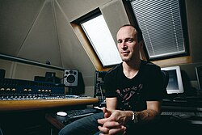

# Murray Gold

## Biografía

Murray Gold (n. 28 de febrero de 1969, Portsmouth, Inglaterra) es un premiado compositor inglés de teatro, cine y televisión así como dramaturgo para teatro y radio.

## Estilo musical

Otros créditos incluyen los largometrajes Death at a Funeral dirigido por Frank Oz, Mischief Night, dirigido por Penny Woolcock, Alien Autopsy y Veronika Decides to Die, así como la serie de ITV Holding, la serie de Historia Natural de la BBC Life Story, el drama criminal Scott & Bailey y Murray escribió el tema musical de la exitosa serie de Channel 4 Shameless.

## Anécdotas y curiosidades

Murray ha trabajado extensamente con el escritor y director Russell T Davies en proyectos como It's a Sin, A Very English Scandal protagonizada por Hugh Grant y Ben Whishaw, Years and Years, Casanova protagonizada por David Tennant, The Second Coming, Cucumber y Queer as Folk, series 1 y 2.

## Top 10 bandas sonoras

1. ***Death at a Funeral (Título en España: Un funeral de muerte)***
    * **Póster:** [link](140_murray_gold/posters/poster_death_at_a_funeral_2007.jpg)
2. ***Doctor Who: The Day of the Doctor (Título en España: Doctor Who: El Día del Doctor)***
    * **Póster:** [link](140_murray_gold/posters/poster_doctor_who_the_day_of_the_doctor_2013.jpg)
3. ***Doctor Who: Last Christmas (Título en España: Doctor Who: La última Navidad)***
    * **Póster:** [link](140_murray_gold/posters/poster_doctor_who_last_christmas_2014.jpg)
4. ***Doctor Who: Voyage of the Damned (Título en España: Doctor Who: El viaje de los condenados)***
    * **Póster:** [link](140_murray_gold/posters/poster_doctor_who_voyage_of_the_damned_2007.jpg)
5. ***Doctor Who: Twice Upon a Time (Título en España: Doctor Who: Twice Upon a Time)***
    * **Póster:** [link](140_murray_gold/posters/poster_doctor_who_twice_upon_a_time_2017.jpg)
6. ***Doctor Who: The Time of the Doctor (Título en España: Doctor Who: El tiempo del Doctor)***
    * **Póster:** [link](140_murray_gold/posters/poster_doctor_who_the_time_of_the_doctor_2013.jpg)
7. ***Hawking (Título en España: Hawking)***
    * **Póster:** [link](140_murray_gold/posters/poster_hawking_2004.jpg)
8. ***Doctor Who: Deep Breath (Título en España: Doctor Who: Deep Breath)***
    * **Póster:** [link](140_murray_gold/posters/poster_doctor_who_deep_breath_2014.jpg)
9. ***Doctor Who: The Runaway Bride (Título en España: Doctor Who: La novia fugitiva)***
    * **Póster:** [link](140_murray_gold/posters/poster_doctor_who_the_runaway_bride_2006.jpg)
10. ***Doctor Who: The Snowmen (Título en España: Doctor Who: Los Hombres de Nieve)***
    * **Póster:** [link](140_murray_gold/posters/poster_doctor_who_the_snowmen_2012.jpg)

## Filmografía completa

- Black Eyes (Título en España: Black Eyes) (1996) · [Póster](140_murray_gold/posters/poster_black_eyes_1996.jpg)
- Chicken Talk (Título en España: Chicken Talk) (1996) · [Póster](140_murray_gold/posters/poster_chicken_talk_1996.jpg)
- Mojo (Título en España: Mojo) (1997) · [Póster](140_murray_gold/posters/poster_mojo_1997.jpg)
- Beautiful Creatures (Título en España: Criaturas hermosas) (2000) · [Póster](140_murray_gold/posters/poster_beautiful_creatures_2000.jpg)
- Wild About Harry (Título en España: Wild About Harry) (2000) · [Póster](140_murray_gold/posters/poster_wild_about_harry_2000.jpg)
- Miranda (Título en España: Miranda) (2002) · [Póster](140_murray_gold/posters/poster_miranda_2002.jpg)
- Kiss of Life (Título en España: Kiss of Life) (2003) · [Póster](140_murray_gold/posters/poster_kiss_of_life_2003.jpg)
- Hawking (Título en España: Hawking) (2004) · [Póster](140_murray_gold/posters/poster_hawking_2004.jpg)
- Alien Autopsy (Título en España: Autopsia de un alien) (2006) · [Póster](140_murray_gold/posters/poster_alien_autopsy_2006.jpg)
- Doctor Who: The Runaway Bride (Título en España: Doctor Who: La novia fugitiva) (2006) · [Póster](140_murray_gold/posters/poster_doctor_who_the_runaway_bride_2006.jpg)
- Mischief Night (Título en España: Mischief Night) (2006) · [Póster](140_murray_gold/posters/poster_mischief_night_2006.jpg)
- Perfect Parents (Título en España: Perfect Parents) (2006) · [Póster](140_murray_gold/posters/poster_perfect_parents_2006.jpg)
- Doctor Who: Voyage of the Damned (Título en España: Doctor Who: El viaje de los condenados) (2007) · [Póster](140_murray_gold/posters/poster_doctor_who_voyage_of_the_damned_2007.jpg)
- Doctor Who: The Infinite Quest (Título en España: Doctor Who: The Infinite Quest) (2007) · [Póster](140_murray_gold/posters/poster_doctor_who_the_infinite_quest_2007.jpg)
- Death at a Funeral (Título en España: Un funeral de muerte) (2007) · [Póster](140_murray_gold/posters/poster_death_at_a_funeral_2007.jpg)
- I Want Candy (Título en España: Vaya par de productorex) (2007) · [Póster](140_murray_gold/posters/poster_i_want_candy_2007.jpg)
- Doctor Who: The Next Doctor (Título en España: Doctor Who: El siguiente Doctor) (2008) · [Póster](140_murray_gold/posters/poster_doctor_who_the_next_doctor_2008.jpg)
- Doctor Who: Music of the Spheres - Doctor Who at the Proms 2008 (Título en España: Doctor Who: Music of the Spheres - Doctor Who at the Proms 2008) (2008) · [Póster](140_murray_gold/posters/poster_doctor_who_music_of_the_spheres_doctor_who_at_the_proms_2008_2008.jpg)
- Doctor Who: Planet of the Dead (Título en España: Doctor Who: El planeta de los muertos) (2009) · [Póster](140_murray_gold/posters/poster_doctor_who_planet_of_the_dead_2009.jpg)
- Doctor Who: The Waters of Mars (Título en España: Doctor Who: Las aguas de Marte) (2009) · [Póster](140_murray_gold/posters/poster_doctor_who_the_waters_of_mars_2009.jpg)
- Veronika Decides to Die (Título en España: Verónica decide morir) (2009) · [Póster](140_murray_gold/posters/poster_veronika_decides_to_die_2009.jpg)
- Doctor Who: A Christmas Carol (Título en España: Dr. Who: Un Cuento de Navidad) (2010) · [Póster](140_murray_gold/posters/poster_doctor_who_a_christmas_carol_2010.jpg)
- Doctor Who: The Doctor, the Widow and the Wardrobe (Título en España: Doctor Who: El doctor, la viuda y el armario) (2011) · [Póster](140_murray_gold/posters/poster_doctor_who_the_doctor_the_widow_and_the_wardrobe_2011.jpg)
- Hoodwinked Too! Hood VS. Evil (Título en España: Las nuevas aventuras de Caperucita Roja) (2011) · [Póster](140_murray_gold/posters/poster_hoodwinked_too_hood_vs_evil_2011.jpg)
- Doctor Who: The Snowmen (Título en España: Doctor Who: Los Hombres de Nieve) (2012) · [Póster](140_murray_gold/posters/poster_doctor_who_the_snowmen_2012.jpg)
- Doctor Who at the Proms (Título en España: Doctor Who at the Proms) (2013) · [Póster](140_murray_gold/posters/poster_doctor_who_at_the_proms_2013.jpg)
- Doctor Who: The Day of the Doctor (Título en España: Doctor Who: El Día del Doctor) (2013) · [Póster](140_murray_gold/posters/poster_doctor_who_the_day_of_the_doctor_2013.jpg)
- Doctor Who: The Time of the Doctor (Título en España: Doctor Who: El tiempo del Doctor) (2013) · [Póster](140_murray_gold/posters/poster_doctor_who_the_time_of_the_doctor_2013.jpg)
- Doctor Who: The Night of the Doctor (Título en España: Doctor Who: The Night of the Doctor) (2013) · [Póster](140_murray_gold/posters/poster_doctor_who_the_night_of_the_doctor_2013.jpg)
- Base 9 (Título en España: Base 9) (2014) · [Póster](140_murray_gold/posters/poster_base_9_2014.jpg)
- Doctor Who: Dark Water / Death in Heaven (Título en España: Doctor Who: Dark Water / Death in Heaven) (2014) · [Póster](140_murray_gold/posters/poster_doctor_who_dark_water_death_in_heaven_2014.jpg)
- Doctor Who: Deep Breath (Título en España: Doctor Who: Deep Breath) (2014) · [Póster](140_murray_gold/posters/poster_doctor_who_deep_breath_2014.jpg)
- Doctor Who: Last Christmas (Título en España: Doctor Who: La última Navidad) (2014) · [Póster](140_murray_gold/posters/poster_doctor_who_last_christmas_2014.jpg)
- Doctor Who: The Ultimate Companion (Título en España: Doctor Who: The Ultimate Companion) (2014) · [Póster](140_murray_gold/posters/poster_doctor_who_the_ultimate_companion_2014.jpg)
- Doctor Who: The Ultimate Time Lord with Peter Davison (Título en España: Doctor Who: The Ultimate Time Lord with Peter Davison) (2014) · [Póster](140_murray_gold/posters/poster_doctor_who_the_ultimate_time_lord_with_peter_davison_2014.jpg)
- Doctor Who: The Husbands of River Song (Título en España: Doctor Who: The Husbands of River Song) (2015) · [Póster](140_murray_gold/posters/poster_doctor_who_the_husbands_of_river_song_2015.jpg)
- A Midsummer Night's Dream (Título en España: A Midsummer Night's Dream) (2016) · [Póster](140_murray_gold/posters/poster_a_midsummer_night_s_dream_2016.jpg)
- Doctor Who: The Return of Doctor Mysterio (Título en España: Doctor Who: El regreso del Doctor Mysterio) (2016) · [Póster](140_murray_gold/posters/poster_doctor_who_the_return_of_doctor_mysterio_2016.jpg)
- Doctor Who: Twice Upon a Time (Título en España: Doctor Who: Twice Upon a Time) (2017) · [Póster](140_murray_gold/posters/poster_doctor_who_twice_upon_a_time_2017.jpg)
- Roald & Beatrix: The Tail of the Curious Mouse (Título en España: Roald y Beatrix: La Cola del raton Curioso) (2020) · [Póster](140_murray_gold/posters/poster_roald_beatrix_the_tail_of_the_curious_mouse_2020.jpg)
- Doctor Who Children in Need Special 2023 (Título en España: Doctor Who Children in Need Special 2023) (2023) · [Póster](140_murray_gold/posters/poster_doctor_who_children_in_need_special_2023_2023.jpg)
- Doctor Who at 60: A Musical Celebration (Título en España: Doctor Who at 60: A Musical Celebration) (2023) · [Póster](140_murray_gold/posters/poster_doctor_who_at_60_a_musical_celebration_2023.jpg)
- Doctor Who: The Daleks in Colour (Título en España: Doctor Who: The Daleks in Colour) (2023) · [Póster](140_murray_gold/posters/poster_doctor_who_the_daleks_in_colour_2023.jpg)
- Doctor Who at the Proms (Título en España: Doctor Who at the Proms) (2024) · [Póster](140_murray_gold/posters/poster_doctor_who_at_the_proms_2024.jpg)
- Doctor Who: The Legend of Ruby Sunday & Empire of Death (Título en España: Doctor Who: The Legend of Ruby Sunday & Empire of Death) (2024) · [Póster](140_murray_gold/posters/poster_doctor_who_the_legend_of_ruby_sunday_empire_of_death_2024.jpg)
- Doctor Who: Wish World & The Reality War (Título en España: Doctor Who: Wish World & The Reality War) (2025) · [Póster](140_murray_gold/posters/poster_doctor_who_wish_world_the_reality_war_2025.jpg)
- Snow White: The Sacrifice (Título en España: Snow White: The Sacrifice) (2025) · [Póster](140_murray_gold/posters/poster_snow_white_the_sacrifice_2025.jpg)

## Premios y nominaciones

* 2000 – Premio Richard Imison – (Ganador)
* 2012 – Premio Tinniswood – (Ganador)

## Fuentes adicionales

* [MundoBSO](https://www.mundobso.com/bso/doctor-who-murray-gold) — site:mundobso.com
* [MundoBSO (2)](https://www.mundobso.com/bso/despiadados-los) — site:mundobso.com
* [MundoBSO (3)](https://www.mundobso.com/bso/frozen-el-reino-del-hielo) — site:mundobso.com
* [Film Score Monthly](https://www.filmscoremonthly.com/board/posts.cfm?threadID=151038&forumID=1&archive=0) — site:filmscoremonthly.com
* [Film Score Monthly (2)](https://www.filmscoremonthly.com/board/searchResults.cfm?forumID=0&pageID=9&showThreads=10&searchtarget=threads&frmKeywords=idm+6.42+build+32%2C+taiwebs) — site:filmscoremonthly.com
* [Film Score Monthly (3)](https://www.filmscoremonthly.com/daily/article.cfm/articleID/7570/Film-Score-Friday-4618/) — site:filmscoremonthly.com
* [SoundtrackCollector](https://soundtrackcollector.com) — site:soundtrackcollector.com
* [SoundtrackCollector (2)](https://www.soundtrackcollector.com/?url) — site:soundtrackcollector.com
* [SoundtrackCollector (3)](https://www.soundtrackcollector.com/catalog/soundtracktopic.php?movieid=76595&topicid=7685) — site:soundtrackcollector.com
* [WhatSong](https://www.whatsong.org/artist/108914) — site:whatsong.org
* [WhatSong (2)](https://www.whatsong.org/tvshow/doctor-who/episode/27220) — site:whatsong.org
* [WhatSong (3)](https://www.whatsong.org/tvshow/doctor-who/episode/29024) — site:whatsong.org

## Notas externas

* MundoBSO: Compositor: Gold, Murray Sello: Silva Screen Duración: 75 minutos Información de la película Título original: Doctor Who Nacionalidad: Reino Unido Año: 2005 Argumento Serie televisiva, remake de la también televisiva Doctor Who (74), en torno a un excéntrico e inteligente científico de otro Planeta que viaja a través del tiempo y del espacio. Compositor: Gold, Murray Sello: Silva Screen Duración: 75 minutos
* MundoBSO (2): Compositor: Morricone, Ennio Sello: Screen Trax Duración: 37 minutos Información de la película Título original: I crudeli Director: Sergio Corbucci Nacionalidad: Italia Año: 1967 Argumento Al acabar la guerra de Secesión norteamericana, un coronel sudista organiza un ejército para seguir combatiendo, y cuenta para ello con la ayuda de sus tres hijos. Compositor: Morricone, Ennio Sello: Screen Trax Duración: 37 minutos
* MundoBSO (3): Compositores: Beck, Christophe | Lopez, Robert Sello: Disney Duración: 98 minutos Título original: Frozen Director: Chris Buck, Jennifer Lee Nacionalidad: EE UU Año: 2013
* SoundtrackCollector (2): 14 de enero - Confesión de un comisionado de policía de Riz Ortolani a la fiscalía 3 de diciembre - Wolf Hall de Debbie Wiseman: El espejo y la luz
* WhatSong: Murray Gold - Doctor Who (Colección del 50 aniversario) [Banda sonora original de televisión] Murray Gold - Doctor Who - El día del doctor / El tiempo del doctor (Banda sonora original de televisión)
* WhatSong (2): Marni Nixon, André Previn, Didier Deutsch y Mona Washbourne - My Fair Lady (banda sonora original) Murray Gold y BBC National Orchestra of Wales - Doctor Who (banda sonora original de televisión)
* WhatSong (3): Murray Gold y BBC National Orchestra of Wales - Doctor Who (banda sonora original de televisión) Se reproduce justo después de que Rose queda atrapada en el universo paralelo.
* www.denofgeek.com: Cameron conversa con el talentoso compositor Murray Gold sobre Doctor Who, la música de regeneración, cómo componer para el Duodécimo Doctor y más... El compositor Murray Gold ha sido uno de los pocos constantes desde el regreso de Doctor Who en 2005. Su trabajo en el programa más grande del mundo ha sido sublime, entregando constantemente temas memorables, hermosos paisajes sonoros y melodías desgarradoras cada semana. Me reuní con Murray la víspera de su regreso al Royal Albert Hall para los Doctor Who Proms y hablé sobre todo lo relacionado con Who, desde la primera temporada hasta la octava temporada...
* tardis.fandom.com: ¿Nuevo en Doctor Who o que regresa después de un descanso? ¡Consulta nuestras guías diseñadas para ayudarte a encontrar tu camino! Explorar la página principal Discutir todas las páginas Comunidad Mapas interactivos
* guide.doctorwhonews.net: Murray Jonathan Gold es un compositor y dramaturgo inglés que se ha desempeñado como director musical de Doctor Who desde su reactivación en 2005. Ha sido nominado cuatro veces al BAFTA en la categoría Mejor Música Original para Televisión, por Vanity Fair (1999), Queer as Folk (2000), Casanova (2006) y Doctor Who (2008). Su música para la película ganadora del BAFTA Kiss of Life recibió el 'Premio Mozart del Séptimo Arte' por un jurado francés en Aubagne en 2003.
* www.warpedfactor.com: 10 cosas que quizás no sepas sobre El Señor de los Anillos: La Comunidad del Anillo Antes de que la tercera y última película de la trilogía de El Hobbit llegue a los cines esta Navidad, Geek Dave comienza una serie de trivias de Peter Jac... Espeleología urbana: exploración de metros y túneles subterráneos abandonados La espeleología urbana es novedosa y emocionante e implica moverse por partes de las ciudades que la mayoría de la gente no está dispuesta a explorar. Esto significa f...
* www.soundonsound.com: Inicio SOS para artistas Información publicitaria Anuncios de lectores Concursos Videos Podcasts Estudios de casos Foro Últimas publicaciones Buscar SOS para artistas Lectores Anuncios Preguntas frecuentes Glosario Reglas
