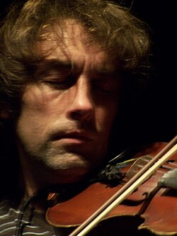

# Yann Tiersen

## Biografía

Yann Pierre Tiersen (Brest, Francia, 23 de junio de 1970), conocido como Yann Tiersen, es un músico y compositor francés, uno de los principales exponentes del minimalismo. Ha compuesto la banda sonora de las películas Amélie, Good Bye, Lenin! y Tabarly. Se caracteriza por su faceta multinstrumentista, aunque toca principalmente violín, piano y acordeón, entre otros.

## Estilo musical

2 Subsección Música Alternar música 2.1 Estilos e instrumentos 2.2 Bandas sonoras de películas 2.3 Colaboraciones 2.4 Obras benéficas

## Anécdotas y curiosidades

1 Biografía y carrera Toggle Subsección de biografía y carrera 1.1 Los primeros años: 1970–1992 1.2 Debut y reconocimiento nacional: 1993–2000 1.3 Amélie y el reconocimiento mundial: 2001–2009 1.4 Dust Lane y Skyline: 2010–presente

## Top 10 bandas sonoras

1. ***Good Bye, Lenin! (Título en España: Good bye, Lenin!)***
    * **Póster:** [link](141_yann_tiersen/posters/poster_good_bye_lenin_2003.jpg)
2. ***Le Fabuleux Destin d'Amélie Poulain (Título en España: Amelie)***
    * **Póster:** [link](141_yann_tiersen/posters/poster_le_fabuleux_destin_d_am_lie_poulain_2001.jpg)
3. ***La Vie rêvée des anges (Título en España: La vida soñada de los ángeles)***
    * **Póster:** [link](141_yann_tiersen/posters/poster_la_vie_r_v_e_des_anges_1998.jpg)
4. ***Qui plume la lune ? (Título en España: Qui plume la lune ?)***
    * **Póster:** [link](141_yann_tiersen/posters/poster_qui_plume_la_lune_1999.jpg)
5. ***Trois huit (Título en España: Trois huit)***
    * **Póster:** [link](141_yann_tiersen/posters/poster_trois_huit_2001.jpg)
6. ***Ouragan, l'odyssée d'un vent (Título en España: Ouragan, l'odyssée d'un vent)***
    * **Póster:** [link](141_yann_tiersen/posters/poster_ouragan_l_odyss_e_d_un_vent_2015.jpg)
7. ***L'homme aux bras ballants (Título en España: L'homme aux bras ballants)***
    * **Póster:** [link](141_yann_tiersen/posters/poster_l_homme_aux_bras_ballants_1997.jpg)
8. ***Tabarly (Título en España: Tabarly)***
    * **Póster:** [link](141_yann_tiersen/posters/poster_tabarly_2008.jpg)
9. ***Malá z rybárny (Título en España: Malá z rybárny)***
    * **Póster:** [link](141_yann_tiersen/posters/poster_mal_z_ryb_rny_2015.jpg)
10. ***Yann Tiersen Piano Day 2025 (Título en España: Yann Tiersen Piano Day 2025)***
    * **Póster:** [link](141_yann_tiersen/posters/poster_yann_tiersen_piano_day_2025_2025.jpg)

## Filmografía completa

- L'homme aux bras ballants (Título en España: L'homme aux bras ballants) (1997) · [Póster](141_yann_tiersen/posters/poster_l_homme_aux_bras_ballants_1997.jpg)
- La Vie rêvée des anges (Título en España: La vida soñada de los ángeles) (1998) · [Póster](141_yann_tiersen/posters/poster_la_vie_r_v_e_des_anges_1998.jpg)
- Qui plume la lune ? (Título en España: Qui plume la lune ?) (1999) · [Póster](141_yann_tiersen/posters/poster_qui_plume_la_lune_1999.jpg)
- Le Fabuleux Destin d'Amélie Poulain (Título en España: Amelie) (2001) · [Póster](141_yann_tiersen/posters/poster_le_fabuleux_destin_d_am_lie_poulain_2001.jpg)
- Trois huit (Título en España: Trois huit) (2001) · [Póster](141_yann_tiersen/posters/poster_trois_huit_2001.jpg)
- Good Bye, Lenin! (Título en España: Good bye, Lenin!) (2003) · [Póster](141_yann_tiersen/posters/poster_good_bye_lenin_2003.jpg)
- La Traversée (Título en España: La Traversée) (2005) · [Póster](141_yann_tiersen/posters/poster_la_travers_e_2005.jpg)
- Tabarly (Título en España: Tabarly) (2008) · [Póster](141_yann_tiersen/posters/poster_tabarly_2008.jpg)
- Malá z rybárny (Título en España: Malá z rybárny) (2015) · [Póster](141_yann_tiersen/posters/poster_mal_z_ryb_rny_2015.jpg)
- Ouragan, l'odyssée d'un vent (Título en España: Ouragan, l'odyssée d'un vent) (2015) · [Póster](141_yann_tiersen/posters/poster_ouragan_l_odyss_e_d_un_vent_2015.jpg)
- Yann Tiersen | Kerber - The film (Título en España: Yann Tiersen | Kerber - The film) (2021) · [Póster](141_yann_tiersen/posters/poster_yann_tiersen_kerber_the_film_2021.jpg)
- Piano Cinéma (Título en España: Piano Cinéma) (2022) · [Póster](141_yann_tiersen/posters/poster_piano_cin_ma_2022.jpg)
- Yann Tiersen Passengers: Tempelhof Airport (Título en España: Yann Tiersen Passengers: Tempelhof Airport) (2023) · [Póster](141_yann_tiersen/posters/poster_yann_tiersen_passengers_tempelhof_airport_2023.jpg)
- Yann Tiersen Piano Day 2025 (Título en España: Yann Tiersen Piano Day 2025) (2025) · [Póster](141_yann_tiersen/posters/poster_yann_tiersen_piano_day_2025_2025.jpg)

## Premios y nominaciones

* 2004 – Victoria del álbum de música original de cine o televisión. – por *Good Bye, Lenin! (Título en España: Good bye, Lenin!)* – (Ganador)
* Caballero de las Artes y las Letras – (Ganador)

## Fuentes adicionales

* [MundoBSO](https://www.mundobso.com/compositor/tiersen-yann) — site:mundobso.com
* [MundoBSO (2)](https://www.mundobso.com/bso/despiadados-los) — site:mundobso.com
* [MundoBSO (3)](https://www.mundobso.com/bso/milla-verde-la) — site:mundobso.com
* [Film Score Monthly](https://www.filmscoremonthly.com/backissues/viewissue.cfm?issueID=59) — site:filmscoremonthly.com
* [Film Score Monthly (2)](https://www.filmscoremonthly.com/board/posts.cfm?forumID=1&pageID=2&threadID=82254&archive=0) — site:filmscoremonthly.com
* [Film Score Monthly (3)](https://www.filmscoremonthly.com/daily/article.cfm/articleID/8198/Film-Score-Friday-21624/) — site:filmscoremonthly.com
* [SoundtrackCollector](https://www.soundtrackcollector.com/title/40283/Fabuleux+Destin+d'Am%C3%A9lie+Poulain,+Le) — site:soundtrackcollector.com
* [SoundtrackCollector (2)](https://www.soundtrackcollector.com/title/77183/European+Film+Music+Collection,+The) — site:soundtrackcollector.com
* [SoundtrackCollector (3)](https://soundtrackcollector.com) — site:soundtrackcollector.com
* [WhatSong](https://www.whatsong.org) — site:whatsong.org
* [WhatSong (2)](https://www.whatsong.org/tvshow/how-i-met-your-mother/episode/44483) — site:whatsong.org
* [WhatSong (3)](https://www.whatsong.org/tvshow/grown-ish/episode/82123) — site:whatsong.org

## Notas externas

* MundoBSO: Compositor francés, nacido en Brest (Francia), el 23 de junio de 1970, que se ha destacado en la música experimental y en las nuevas tendencias, publicando varios discos. Ha trabajado en teatro y en el cine, aunque en este medio más ocasionalmente. Compositor francés, nacido en Brest (Francia), el 23 de junio de 1970, que se ha destacado en la música experimental y en las nuevas tendencias, publicando varios discos. Ha trabajado en teatro y en el cine, aunque en este medio más ocasionalmente.
* MundoBSO (2): Compositor: Morricone, Ennio Sello: Screen Trax Duración: 37 minutos Información de la película Título original: I crudeli Director: Sergio Corbucci Nacionalidad: Italia Año: 1967 Argumento Al acabar la guerra de Secesión norteamericana, un coronel sudista organiza un ejército para seguir combatiendo, y cuenta para ello con la ayuda de sus tres hijos. Compositor: Morricone, Ennio Sello: Screen Trax Duración: 37 minutos
* MundoBSO (3): Compositor: Newman, Thomas Sello: Warner Duración: 66 minutos Información de la película Título original: The Green Mile Director: Frank Darabont Nacionalidad: EE UU Año: 1999 Argumento A mediados de los años treinta, un guarda de prisiones que custodia a los condenados a muerte descubre poderes sobrenaturales en un inmenso hombre negro, acusado de haber asesinado a dos niñas. Eso le llevará a creer en su inocencia. Premios Saturn: 1 nominación Compositor: Newman, Thomas Sello: Warner Duración: 66 minutos
* SoundtrackCollector: Amelie Of Montmarte (2001, Internacional: título en inglés: título del festival) Amelie From Montmartre (2001, Internacional: título en inglés)
* WhatSong: La mejor fuente en línea de música de películas y televisión. Copyright © 2018 - 2026 Whatsong.org. Reservados todos los derechos.
* WhatSong (2): Lily y Robin bailan con los dos nerds del último año de secundaria. Se reproduce de fondo cuando Lilly, Robin y Barney intentan entrar a la fiesta. La canción es una canción que está incluida en iMovie.
* WhatSong (3): Luca está pensando en él y en el encuentro sexual de Zoey de la noche anterior. Luca está estresado por su "yo". Texto a Zoey y su falta de respuesta.
* musiqueando.com: Críticas de discos Maquetas, demos y EP´s Recopilatorios Grandes clásicos para la historia Discos internacionales Discos nacionales Descubrimos un genio que huye de un cliché, ser el compositor de la Banda Sonora de la película francesa con más éxito de los últimos años, Amèlie. Un artista que busca incansablemente nuevos instrumentos y que parece haber encontrado su último experimento en su propia voz.
* www.the-independent.com: Las notificaciones se pueden gestionar en las preferencias del navegador. Deportes Deportes Deportes de EE. UU. Fútbol Fórmula 1 UFC Rugby Union Cricket Tenis Boxeo Ciclismo Golf Videos deportivos
* nowthenmagazine.com: Yann Tiersen no es el nombre más francés del mundo, pero desde el estreno de Amélie en 2001 ha sido un nombre muy conocido en todo el Canal de la Mancha. Porque detrás del éxito cinematográfico internacional de Jean-Pierre Jeunet se esconde una banda sonora ejemplar escrita por M. Tiersen, una partitura notablemente francesa que contradice los antecedentes familiares belgas y noruegos del escritor. Sus creaciones más recientes han dejado espacio para la guitarra eléctrica y los sintetizadores (anteriormente eclipsados ​​por el piano, el violín y el acordeón), dándole una paleta más amplia para dibujar. Dust Lane llegó a las tiendas en octubre luego de la firma de Tiersen con Mute, y el hombre ha estado aquí recorriendo el nuevo material. Le hablé sobre su nueva dirección...
* indyrock.es: MENÚ-INDYROCK Información musical desde 1997 HOME*INICIO NOTICIAS Actualidad musical, avances... CONCURSOS Convocatorias, datos... INDYROCK-TV Vídeos, estrenos, directos, acústicos... GRUPOS Bandas en INDYROCK... MONOGRÁFICOS RADIOHEAD 091 TENDENCIAS Artes y vanguardias... CONTACTO MAIL INDYROCK-TV Vídeos, estrenos, directos, acústicos...
* music.apple.com: Canal de Caledonia La hora del líquido l Rathlin desde la distanciaâ·â2025 La hora del líquido l Rathlin desde la distanciaâ·â2025
