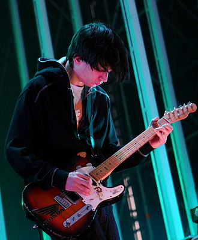

# Jonny Greenwood

## Biografía

Jonathan Richard Guy Greenwood (Oxford, 5 de noviembre de 1971), más conocido como Jonny Greenwood, es un músico multinstrumentalista y compositor británico, conocido por ser integrante de la banda de rock Radiohead, además de músico y compositor de música clásica contemporánea y música experimental en su trabajo en solitario, y en la banda de rock alternativo The Smile. Su rol principal en Radiohead es el de guitarra solista y tecladista, aunque también toca la viola, la armónica, el glockenspiel, las ondas Martenot, el banjo o la percusión. En 2011 la revista Rolling Stone lo situó en el puesto 48.º en la Lista de los 100 guitarristas más grandes de todos los tiempos.​ Ha compuesto la banda sonora de las películas Bodysong (2003), There Will Be Blood (2007), Norwegian Wood (2010), Tenemos que hablar de Kevin (2011), The Master (2012), Inherent Vice (2014), Phantom Thread (2017), You Were Never Really Here (2017), Licorice Pizza (2021), Spencer (2021) y The Power of the Dog (2021). Por Phantom Thread y The Power of the Dog fue nominado al Globo de Oro y al Óscar. Fue además compositor residente de la BBC Concert Orchestra. Es hermano del también miembro de Radiohead, Colin Greenwood, bajista del grupo.

## Estilo musical

Johnny Greenwood es un nombre sinónimo de guitarra innovadora y experimental. Como guitarrista principal de la banda de rock inglesa Radiohead, Greenwood ha superado los límites del instrumento durante más de dos décadas, creando sonidos complejos y únicos que han ayudado a redefinir el papel de la guitarra en la música moderna.

## Anécdotas y curiosidades

2 Alternancia de carrera Subsección de carrera 2.1 1991–1992: Pablo Honey 2.2 1995–1999: The Bends y OK Computer 2.3 2000–2003: Kid A, Amnesiac y Hail to the Thief 2.4 2003–2006: Bodysong y primer trabajo orquestal 2.5 2007–2010: There Will Be Blood y In Rainbows 2.6 2010–2013: Norwegian Wood y The King of Limbs 2.7 2014–2016: Inherent Vice, Junun y A Moon Shaped Pool 2.8 2017–2020: Phantom Thread y The Power of the Dog 2.9 2021–2023: the Smile y Jarak Qaribak 2.10 2024-presente: Wall of Ojos y recortes

## Top 10 bandas sonoras

1. ***One Battle After Another (Título en España: Una batalla tras otra)***
    * **Póster:** [link](143_jonny_greenwood/posters/poster_one_battle_after_another_2025.jpg)
2. ***Phantom Thread (Título en España: El hilo invisible)***
    * **Póster:** [link](143_jonny_greenwood/posters/poster_phantom_thread_2017.jpg)
3. ***The Power of the Dog (Título en España: El poder del perro)***
    * **Póster:** [link](143_jonny_greenwood/posters/poster_the_power_of_the_dog_2021.jpg)
4. ***Harry Potter and the Goblet of Fire (Título en España: Harry Potter y el cáliz de fuego)***
    * **Póster:** [link](143_jonny_greenwood/posters/poster_harry_potter_and_the_goblet_of_fire_2005.jpg)
5. ***There Will Be Blood (Título en España: Pozos de ambición)***
    * **Póster:** [link](143_jonny_greenwood/posters/poster_there_will_be_blood_2007.jpg)
6. ***You Were Never Really Here (Título en España: En realidad, nunca estuviste aquí)***
    * **Póster:** [link](143_jonny_greenwood/posters/poster_you_were_never_really_here_2017.jpg)
7. ***The Master (Título en España: The Master)***
    * **Póster:** [link](143_jonny_greenwood/posters/poster_the_master_2012.jpg)
8. ***Inherent Vice (Título en España: Puro vicio)***
    * **Póster:** [link](143_jonny_greenwood/posters/poster_inherent_vice_2014.jpg)
9. ***Spencer (Título en España: Spencer)***
    * **Póster:** [link](143_jonny_greenwood/posters/poster_spencer_2021.jpg)

## Filmografía completa

- Radiohead • Live at the Metro Chicago 1993 (Título en España: Radiohead • Live at the Metro Chicago 1993) (1993) · [Póster](143_jonny_greenwood/posters/poster_radiohead_live_at_the_metro_chicago_1993_1993.jpg)
- Radiohead: Reading Festival 1994 (Título en España: Radiohead: Reading Festival 1994) (1994) · [Póster](143_jonny_greenwood/posters/poster_radiohead_reading_festival_1994_1994.jpg)
- Radiohead: Live at The Astoria 1994 (Título en España: Radiohead: Live at The Astoria 1994) (1995) · [Póster](143_jonny_greenwood/posters/poster_radiohead_live_at_the_astoria_1994_1995.jpg)
- Radiohead: Live at the Chicago Metro 1996 (Título en España: Radiohead: Live at the Chicago Metro 1996) (1996) · [Póster](143_jonny_greenwood/posters/poster_radiohead_live_at_the_chicago_metro_1996_1996.jpg)
- Radiohead: Pinkpop 1996 (Título en España: Radiohead: Pinkpop 1996) (1996) · [Póster](143_jonny_greenwood/posters/poster_radiohead_pinkpop_1996_1996.jpg)
- Radiohead • Live From the 10 Spot 1997 (Título en España: Radiohead • Live From the 10 Spot 1997) (1997) · [Póster](143_jonny_greenwood/posters/poster_radiohead_live_from_the_10_spot_1997_1997.jpg)
- Radiohead: Eurockéennes 1997 (Título en España: Radiohead: Eurockéennes 1997) (1997) · [Póster](143_jonny_greenwood/posters/poster_radiohead_eurock_ennes_1997_1997.jpg)
- Radiohead: Glastonbury 1997 (Título en España: Radiohead: Glastonbury 1997) (1997) · [Póster](143_jonny_greenwood/posters/poster_radiohead_glastonbury_1997_1997.jpg)
- 7 Television Commercials (Título en España: 7 Television Commercials) (1998) · [Póster](143_jonny_greenwood/posters/poster_7_television_commercials_1998.jpg)
- Meeting People Is Easy (Título en España: Meeting People Is Easy) (1998) · [Póster](143_jonny_greenwood/posters/poster_meeting_people_is_easy_1998.jpg)
- Radiohead:  Live At Radio City Music Hall 1998 (Título en España: Radiohead:  Live At Radio City Music Hall 1998) (1998) · [Póster](143_jonny_greenwood/posters/poster_radiohead_live_at_radio_city_music_hall_1998_1998.jpg)
- Radiohead: Tibetan Freedom Concert (Título en España: Radiohead: Tibetan Freedom Concert) (1998) · [Póster](143_jonny_greenwood/posters/poster_radiohead_tibetan_freedom_concert_1998.jpg)
- Radiohead: Live From A Tent In Dublin (Título en España: Radiohead: Live From A Tent In Dublin) (2000) · [Póster](143_jonny_greenwood/posters/poster_radiohead_live_from_a_tent_in_dublin_2000.jpg)
- Radiohead: Live at Canal+ 2001 (Título en España: Radiohead: Live at Canal+ 2001) (2001) · [Póster](143_jonny_greenwood/posters/poster_radiohead_live_at_canal_2001_2001.jpg)
- Radiohead: Live in Vaison-la-Romaine (Título en España: Radiohead: Live in Vaison-la-Romaine) (2001) · [Póster](143_jonny_greenwood/posters/poster_radiohead_live_in_vaison_la_romaine_2001.jpg)
- Radiohead: Pinkpop 2001 (Título en España: Radiohead: Pinkpop 2001) (2001) · [Póster](143_jonny_greenwood/posters/poster_radiohead_pinkpop_2001_2001.jpg)
- Radiohead: Rock AM Ring 2001 (Título en España: Radiohead: Rock AM Ring 2001) (2001) · [Póster](143_jonny_greenwood/posters/poster_radiohead_rock_am_ring_2001_2001.jpg)
- Reflections on Kid A (Título en España: Reflections on Kid A) (2001) · [Póster](143_jonny_greenwood/posters/poster_reflections_on_kid_a_2001.jpg)
- Bodysong (Título en España: Bodysong) (2003) · [Póster](143_jonny_greenwood/posters/poster_bodysong_2003.jpg)
- Radiohead: ARTE music planet (Título en España: Radiohead: ARTE music planet) (2003) · [Póster](143_jonny_greenwood/posters/poster_radiohead_arte_music_planet_2003.jpg)
- Radiohead: Eurockéennes 2003 (Título en España: Radiohead: Eurockéennes 2003) (2003) · [Póster](143_jonny_greenwood/posters/poster_radiohead_eurock_ennes_2003_2003.jpg)
- Radiohead: Glastonbury 2003 (Título en España: Radiohead: Glastonbury 2003) (2003) · [Póster](143_jonny_greenwood/posters/poster_radiohead_glastonbury_2003_2003.jpg)
- Radiohead: Homework: An Unauthorized Documentary (Título en España: Radiohead: Homework: An Unauthorized Documentary) (2003) · [Póster](143_jonny_greenwood/posters/poster_radiohead_homework_an_unauthorized_documentary_2003.jpg)
- Radiohead: Live at MTV's $2 Bill 2003 (Título en España: Radiohead: Live at MTV's $2 Bill 2003) (2003) · [Póster](143_jonny_greenwood/posters/poster_radiohead_live_at_mtv_s_2_bill_2003_2003.jpg)
- Thom Yorke and Jonny Greenwood | Acoustic at Le Reservoir (Título en España: Thom Yorke and Jonny Greenwood | Acoustic at Le Reservoir) (2003) · [Póster](143_jonny_greenwood/posters/poster_thom_yorke_and_jonny_greenwood_acoustic_at_le_reservoir_2003.jpg)
- Pixies: Gouge (Título en España: Pixies: Gouge) (2004) · [Póster](143_jonny_greenwood/posters/poster_pixies_gouge_2004.jpg)
- The Most Gigantic Lying Mouth of All Time (Título en España: The Most Gigantic Lying Mouth of All Time) (2004) · [Póster](143_jonny_greenwood/posters/poster_the_most_gigantic_lying_mouth_of_all_time_2004.jpg)
- Glastonbury Anthems: The Best of Glastonbury 1994-2004 (Título en España: Glastonbury Anthems: The Best of Glastonbury 1994-2004) (2005) · [Póster](143_jonny_greenwood/posters/poster_glastonbury_anthems_the_best_of_glastonbury_1994_2004_2005.jpg)
- Harry Potter and the Goblet of Fire (Título en España: Harry Potter y el cáliz de fuego) (2005) · [Póster](143_jonny_greenwood/posters/poster_harry_potter_and_the_goblet_of_fire_2005.jpg)
- Coachella (Título en España: Coachella) (2006) · [Póster](143_jonny_greenwood/posters/poster_coachella_2006.jpg)
- Radiohead | OK Computer: A Classic Album Under Review (Título en España: Radiohead | OK Computer: A Classic Album Under Review) (2006) · [Póster](143_jonny_greenwood/posters/poster_radiohead_ok_computer_a_classic_album_under_review_2006.jpg)
- Radiohead | Rock en Seine (Título en España: Radiohead | Rock en Seine) (2006) · [Póster](143_jonny_greenwood/posters/poster_radiohead_rock_en_seine_2006.jpg)
- Radiohead: Bonnaroo Festival 2006 (Título en España: Radiohead: Bonnaroo Festival 2006) (2006) · [Póster](143_jonny_greenwood/posters/poster_radiohead_bonnaroo_festival_2006_2006.jpg)
- There Will Be Blood (Título en España: Pozos de ambición) (2007) · [Póster](143_jonny_greenwood/posters/poster_there_will_be_blood_2007.jpg)
- Scotch Mist: A Film with Radiohead in It (Título en España: Scotch Mist: A Film with Radiohead in It) (2007) · [Póster](143_jonny_greenwood/posters/poster_scotch_mist_a_film_with_radiohead_in_it_2007.jpg)
- Scott Walker: 30 Century Man (Título en España: Scott Walker: 30 Century Man) (2007) · [Póster](143_jonny_greenwood/posters/poster_scott_walker_30_century_man_2007.jpg)
- Radiohead: In Rainbows - From the Basement (Título en España: Radiohead: In Rainbows - From the Basement) (2008) · [Póster](143_jonny_greenwood/posters/poster_radiohead_in_rainbows_from_the_basement_2008.jpg)
- Radiohead: Live From 93 Feet East, London (Título en España: Radiohead: Live From 93 Feet East, London) (2008) · [Póster](143_jonny_greenwood/posters/poster_radiohead_live_from_93_feet_east_london_2008.jpg)
- Radiohead: Live in Japan 2008 (Título en España: Radiohead: Live in Japan 2008) (2008) · [Póster](143_jonny_greenwood/posters/poster_radiohead_live_in_japan_2008_2008.jpg)
- Radiohead: Outside Lands 2008 (Título en España: Radiohead: Outside Lands 2008) (2008) · [Póster](143_jonny_greenwood/posters/poster_radiohead_outside_lands_2008_2008.jpg)
- Radiohead: Saitama Super Arena 2008 (Título en España: Radiohead: Saitama Super Arena 2008) (2008) · [Póster](143_jonny_greenwood/posters/poster_radiohead_saitama_super_arena_2008_2008.jpg)
- From the Basement (Título en España: From the Basement) (2009) · [Póster](143_jonny_greenwood/posters/poster_from_the_basement_2009.jpg)
- Radiohead | Rain Down: Live in Brazil (Rio) (Título en España: Radiohead | Rain Down: Live in Brazil (Rio)) (2009) · [Póster](143_jonny_greenwood/posters/poster_radiohead_rain_down_live_in_brazil_rio_2009.jpg)
- Radiohead: Buenos Aires 2009 (Título en España: Radiohead: Buenos Aires 2009) (2009) · [Póster](143_jonny_greenwood/posters/poster_radiohead_buenos_aires_2009_2009.jpg)
- Radiohead: Live in Poland 2009 (Título en España: Radiohead: Live in Poland 2009) (2009) · [Póster](143_jonny_greenwood/posters/poster_radiohead_live_in_poland_2009_2009.jpg)
- Radiohead: Live in Praha 2009 (Título en España: Radiohead: Live in Praha 2009) (2009) · [Póster](143_jonny_greenwood/posters/poster_radiohead_live_in_praha_2009_2009.jpg)
- Radiohead: Reading Festival 2009 (Título en España: Radiohead: Reading Festival 2009) (2009) · [Póster](143_jonny_greenwood/posters/poster_radiohead_reading_festival_2009_2009.jpg)
- Radiohead: The Bends (Bonus DVD) (Título en España: Radiohead: The Bends (Bonus DVD)) (2009) · [Póster](143_jonny_greenwood/posters/poster_radiohead_the_bends_bonus_dvd_2009.jpg)
- Radiohead for Haiti 2010 (Título en España: Radiohead for Haiti 2010) (2010) · [Póster](143_jonny_greenwood/posters/poster_radiohead_for_haiti_2010_2010.jpg)
- ノルウェイの森 (Título en España: Tokio Blues (Norwegian Wood)) (2010) · [Póster](143_jonny_greenwood/posters/poster_poster_2010.jpg)
- Radiohead | Logical Emotions (Título en España: Radiohead | Logical Emotions) (2011) · [Póster](143_jonny_greenwood/posters/poster_radiohead_logical_emotions_2011.jpg)
- Radiohead: Roseland Ballroom 2011 (Título en España: Radiohead: Roseland Ballroom 2011) (2011) · [Póster](143_jonny_greenwood/posters/poster_radiohead_roseland_ballroom_2011_2011.jpg)
- Radiohead: The King Of Limbs – Live From The Basement (Título en España: Radiohead: The King of Limbs - Live from the Basement) (2011) · [Póster](143_jonny_greenwood/posters/poster_radiohead_the_king_of_limbs_live_from_the_basement_2011.jpg)
- We Need to Talk About Kevin (Título en España: Tenemos que hablar de Kevin) (2011) · [Póster](143_jonny_greenwood/posters/poster_we_need_to_talk_about_kevin_2011.jpg)
- Radiohead: Austin City Limits 2012 (Título en España: Radiohead: Austin City Limits 2012) (2012) · [Póster](143_jonny_greenwood/posters/poster_radiohead_austin_city_limits_2012_2012.jpg)
- Radiohead: Coachella Valley Music and Arts Festival 2012 (Título en España: Radiohead: Coachella Valley Music and Arts Festival 2012) (2012) · [Póster](143_jonny_greenwood/posters/poster_radiohead_coachella_valley_music_and_arts_festival_2012_2012.jpg)
- The Master (Título en España: The Master) (2012) · [Póster](143_jonny_greenwood/posters/poster_the_master_2012.jpg)
- Le Chant des Ondes (Título en España: Le Chant des Ondes) (2013) · [Póster](143_jonny_greenwood/posters/poster_le_chant_des_ondes_2013.jpg)
- Inherent Vice (Título en España: Puro vicio) (2014) · [Póster](143_jonny_greenwood/posters/poster_inherent_vice_2014.jpg)
- Wege Durchs Labyrinth - Der Komponist Krzysztof Penderecki (Título en España: Wege Durchs Labyrinth - Der Komponist Krzysztof Penderecki) (2014) · [Póster](143_jonny_greenwood/posters/poster_wege_durchs_labyrinth_der_komponist_krzysztof_penderecki_2014.jpg)
- Junun (Título en España: Junun) (2015) · [Póster](143_jonny_greenwood/posters/poster_junun_2015.jpg)
- Radiohead: Austin City Limits Music Festival 2016 (Título en España: Radiohead: Austin City Limits Music Festival 2016) (2016) · [Póster](143_jonny_greenwood/posters/poster_radiohead_austin_city_limits_music_festival_2016_2016.jpg)
- Radiohead: Lollapalooza Festival Berlin 2016 (Título en España: Radiohead: Lollapalooza Festival Berlin 2016) (2016) · [Póster](143_jonny_greenwood/posters/poster_radiohead_lollapalooza_festival_berlin_2016_2016.jpg)
- Radiohead: Lollapalooza Festival Chicago 2016 (Título en España: Radiohead: Lollapalooza Festival Chicago 2016) (2016) · [Póster](143_jonny_greenwood/posters/poster_radiohead_lollapalooza_festival_chicago_2016_2016.jpg)
- Radiohead: NOS Alive! 2016 (Título en España: Radiohead: NOS Alive! 2016) (2016) · [Póster](143_jonny_greenwood/posters/poster_radiohead_nos_alive_2016_2016.jpg)
- Radiohead: OpenAir Festival St. Gallen 2016 (Título en España: Radiohead: OpenAir Festival St. Gallen 2016) (2016) · [Póster](143_jonny_greenwood/posters/poster_radiohead_openair_festival_st_gallen_2016_2016.jpg)
- Radiohead: Outside Lands 2016 (Título en España: Radiohead: Outside Lands 2016) (2016) · [Póster](143_jonny_greenwood/posters/poster_radiohead_outside_lands_2016_2016.jpg)
- Radiohead: Summer Sonic Festival 2016 (Título en España: Radiohead: Summer Sonic Festival 2016) (2016) · [Póster](143_jonny_greenwood/posters/poster_radiohead_summer_sonic_festival_2016_2016.jpg)
- Phantom Thread (Título en España: El hilo invisible) (2017) · [Póster](143_jonny_greenwood/posters/poster_phantom_thread_2017.jpg)
- You Were Never Really Here (Título en España: En realidad, nunca estuviste aquí) (2017) · [Póster](143_jonny_greenwood/posters/poster_you_were_never_really_here_2017.jpg)
- Radiohead | Live at I-Days 2017 (Título en España: Radiohead | Live at I-Days 2017) (2017) · [Póster](143_jonny_greenwood/posters/poster_radiohead_live_at_i_days_2017_2017.jpg)
- Radiohead | Main Square (Título en España: Radiohead | Main Square) (2017) · [Póster](143_jonny_greenwood/posters/poster_radiohead_main_square_2017.jpg)
- Radiohead | NorthSide 2017 (Título en España: Radiohead | NorthSide 2017) (2017) · [Póster](143_jonny_greenwood/posters/poster_radiohead_northside_2017_2017.jpg)
- Radiohead: Best Kept Secret 2017 (Título en España: Radiohead: Best Kept Secret 2017) (2017) · [Póster](143_jonny_greenwood/posters/poster_radiohead_best_kept_secret_2017_2017.jpg)
- Radiohead: Coachella Valley Music and Arts Festival 2017 (Título en España: Radiohead: Coachella Valley Music and Arts Festival 2017) (2017) · [Póster](143_jonny_greenwood/posters/poster_radiohead_coachella_valley_music_and_arts_festival_2017_2017.jpg)
- Radiohead: Glastonbury 2017 (Título en España: Radiohead: Glastonbury 2017) (2017) · [Póster](143_jonny_greenwood/posters/poster_radiohead_glastonbury_2017_2017.jpg)
- Radiohead: Open'er Festival 2017 (Título en España: Radiohead: Open'er Festival 2017) (2017) · [Póster](143_jonny_greenwood/posters/poster_radiohead_open_er_festival_2017_2017.jpg)
- Radiohead: Rock Werchter 2017 (Título en España: Radiohead: Rock Werchter 2017) (2017) · [Póster](143_jonny_greenwood/posters/poster_radiohead_rock_werchter_2017_2017.jpg)
- Radiohead: TRNSMT 2017 (Título en España: Radiohead: TRNSMT 2017) (2017) · [Póster](143_jonny_greenwood/posters/poster_radiohead_trnsmt_2017_2017.jpg)
- Radiohead | Live in Lima, Peru (Título en España: Radiohead en Lima, Perú) (2018) · [Póster](143_jonny_greenwood/posters/poster_radiohead_live_in_lima_peru_2018.jpg)
- Radiohead: Live in São Paulo 2018 (Título en España: Radiohead: Live in São Paulo 2018) (2018) · [Póster](143_jonny_greenwood/posters/poster_radiohead_live_in_s_o_paulo_2018_2018.jpg)
- The Power of the Dog (Título en España: El poder del perro) (2021) · [Póster](143_jonny_greenwood/posters/poster_the_power_of_the_dog_2021.jpg)
- Licorice Pizza (Título en España: Licorice Pizza) (2021) · [Póster](143_jonny_greenwood/posters/poster_licorice_pizza_2021.jpg)
- River (Título en España: River) (2021) · [Póster](143_jonny_greenwood/posters/poster_river_2021.jpg)
- Spencer (Título en España: Spencer) (2021) · [Póster](143_jonny_greenwood/posters/poster_spencer_2021.jpg)
- The Smile | Live Broadcasts (Título en España: The Smile | Live Broadcasts) (2022) · [Póster](143_jonny_greenwood/posters/poster_the_smile_live_broadcasts_2022.jpg)
- The Smile: Forget Everything You Knew… A Debut Concert in London (Título en España: The Smile: Forget Everything You Knew… A Debut Concert in London) (2022) · [Póster](143_jonny_greenwood/posters/poster_the_smile_forget_everything_you_knew_a_debut_concert_in_london_2022.jpg)
- The Smile: 6 Music Festival (Título en España: The Smile: 6 Music Festival) (2024) · [Póster](143_jonny_greenwood/posters/poster_the_smile_6_music_festival_2024.jpg)
- One Battle After Another (Título en España: Una batalla tras otra) (2025) · [Póster](143_jonny_greenwood/posters/poster_one_battle_after_another_2025.jpg)
- Polaris (Título en España: Polaris) · [Póster](143_jonny_greenwood/posters/poster_polaris.jpg)
- Tibetan Freedom Concert (Título en España: Tibetan Freedom Concert) · [Póster](143_jonny_greenwood/posters/poster_tibetan_freedom_concert.jpg)

## Premios y nominaciones

* 2008 – Oso de Plata por su destacada contribución artística – (Ganador)
* 2018 – Premio de la Academia a la mejor banda sonora original – por *Phantom Thread (Título en España: El hilo invisible)* – (Nominación)
* 2022 – Premio de la Academia a la mejor banda sonora original – por *The Power of the Dog (Título en España: El poder del perro)* – (Nominación)
* Premio de Cine Independiente Británico a la Mejor Música – (Ganador)
* Premio de la Academia a la mejor banda sonora original – por *One Battle After Another (Título en España: Una batalla tras otra)* – (Nominación)

## Fuentes adicionales

* [MundoBSO](https://www.mundobso.com/editorial/hans-zimmer-o-greenwood) — site:mundobso.com
* [MundoBSO (2)](https://w.mundobso.com/bso/cartero-siempre-llama-dos-veces-el) — site:mundobso.com
* [MundoBSO (3)](https://www.mundobso.com/bso/lobo-y-el-leon-el) — site:mundobso.com
* [Film Score Monthly](https://www.filmscoremonthly.com/board/posts.cfm?archive=0&forumID=1&pageID=2&threadID=146257) — site:filmscoremonthly.com
* [Film Score Monthly (2)](https://filmscoremonthly.com/board/posts.cfm?threadID=94813) — site:filmscoremonthly.com
* [Film Score Monthly (3)](https://www.filmscoremonthly.com/board/posts.cfm?threadID=159514&forumID=1&archive=0) — site:filmscoremonthly.com
* [SoundtrackCollector](https://www.soundtrackcollector.com/title/72086/Harry+Potter+And+The+Goblet+Of+Fire) — site:soundtrackcollector.com
* [SoundtrackCollector (2)](https://soundtrackcollector.com) — site:soundtrackcollector.com
* [SoundtrackCollector (3)](https://www.soundtrackcollector.com/catalog/soundtracktopic.php?movieid=76595&topicid=7685) — site:soundtrackcollector.com
* [WhatSong](https://www.whatsong.org/movie/harry-potter-and-the-goblet-of-fire) — site:whatsong.org
* [WhatSong (2)](https://www.whatsong.org/tvshow/top-gear/episode/45053) — site:whatsong.org
* [WhatSong (3)](https://www.whatsong.org/tvshow/how-i-met-your-mother/episode/44483) — site:whatsong.org

## Notas externas

* MundoBSO: Parece bastante cantado que Hans Zimmer conseguirá su segundo Oscar este fin de semana, en circunstancias poco dignas, eso sí, por lo maldispuesto por la Academia para la ceremonia, en la que la categoría musical será expulsada junto a otras de la retransmisión en directo. Hace casi treinta años que Zimmer merece una segunda estatuilla por su enorme relevancia y gran contribución al cine contemporáneo, con bandas sonoras innovadoras, rupturistas, inteligentes y por supuesto también polémicas. No todo Zimmer es bueno ni tampoco interesante, pero tiene obras merecedoras de reconocimiento, y Dune está entre ellas. No a todo el mundo le ha gustado lo que ha hecho en la película de Villeneuve,...
* MundoBSO (3): Compositor: Amar, Armand Sello: Long Distance Duración: 54 minutos Información de la película Título original: Le loup et le lion Director: Gilles de Maistre Nacionalidad: Francia Año: 2021 Argumento Una joven regresa a la casa de su infancia en una isla de Canadá. Allí su vida da un vuelco cuando rescata a un cachorro de lobo y a un cachorro de león. A medida que los animales crecen, los tres forman un vínculo inseparable, hasta que son separados. Compositor: Amar, Armand Sello: Long Distance Duración: 54 minutos
* WhatSong: Jarvis Cocker, Jason Buckle, Jonny Greenwood, Phil Selway, Steve Claydon y Steve Mackey - Harry Potter y el cáliz de fuego (banda sonora original de la película) La banda Weird Sisters sale y toca durante la escena del Baile de Navidad
* WhatSong (2): The Dust Brothers - Fight Club (Banda sonora original de la película) Abel Korzeniowski - Un hombre soltero (Banda sonora original de la película)
* WhatSong (3): Lily y Robin bailan con los dos nerds del último año de secundaria. Se reproduce de fondo cuando Lilly, Robin y Barney intentan entrar a la fiesta. La canción es una canción que está incluida en iMovie.
* nialler9.com: Fue en 2003 cuando se lanzó su partitura para Bodysong, cuando el mundo se dio cuenta de que el encorvado y silencioso Radiohead que tocaba la guitarra como si estuviera tratando de estrangularla hasta la muerte era en realidad un compositor bastante bueno por derecho propio. La influencia de Jonny Greenwood en el sonido de la banda siempre fue más policromática que el simple sonido que emite su instrumento de seis cuerdas. Las queridas ondes Martenot del multiinstrumentista (uno de los primeros instrumentos musicales electrónicos que suena como un theremin) fueron clave para la atmósfera y el color de álbumes como Kid A, Amnesiac, Hail to The Thief y el trabajo posterior de la banda. Después de una temporada como compositor residente de la BBC Concert Orchestra en...
* www.nonesuch.com: "Si has visto One Battle After Another, sabrás que la partitura es muy importante para la película", dice la presentadora de la banda sonora Edith Bowman antes de su conversación con el compositor de la partitura, Jonny Greenwood. "Y comienza con la partitura. Estás en esto por eso. Hay tantas texturas y capas y motivos y temas maravillosos a lo largo de toda la partitura. Creo que definitivamente es una de mis partituras favoritas de Jonny Greenwood. Y parece que casi todo lo que ha hecho anteriormente con Paul Thomas Anderson ha conducido a esta partitura en particular. Es tan buena... Increíble". Puedes escuchar su conversación aquí. “Si has visto Una batalla tras otra, sabrás que el resultado es tan...
* britishmusiccollection.org.uk: Jonny Greenwood es mejor conocido como el guitarrista principal de la banda Radiohead. Hasta la fecha ha escrito cinco obras “clásicas”: smear (dos ondes martenots y conjunto); Popcorn Superhet Receiver (orquesta de cuerdas), Doghouse (trío de cuerdas y gran orquesta), 48 Responses to Polymorphia (48 cuerdas) y Water (orquesta de cámara).
* uproxx.com: Como fanático de Radiohead desde hace mucho tiempo, esto es a la vez un motivo de celebración y, si te lo estás perdiendo, una fuente de profunda ansiedad. Cada punto culminante se siente como un golpe burlón. ¿Por qué no me aguanté y conduje seis horas hasta Chicago? Espera, ¿tocaron “Blow Out”? [Busca vuelos a Detroit.] Vale la pena señalar que el último pico de Radiohead como acto trascendente en vivo se produce 25 años después de la primera gira de la banda por Norteamérica, cuando el éxito de “Creep” los convirtió en una banda sorprendentemente popular en Estados Unidos. Un año antes de que Oasis y Blur despertaran el interés estadounidense por el britpop, Radiohead fue el raro grupo de rock británico que se infiltró en el mercado pop estadounidense, todo gracias a una canción que eventualmente...
* www.sopitas.com: Música, noticias, deportes, entretenimiento y más! Jonny Greenwood es un genio. Además de ser un miembro fundador y guitarrista de Radiohead, en los últimos 20 años ha colaborado en varias películas para crear la música de la mano de directores como Lynne Ramsay, Jane Campion, Pablo Larraín y su más grande compañero, Paul Thomas Anderson.
* movieweb.com: Desde principios de la década de 2000, Jonny Greenwood ha demostrado ser mucho más que el excéntrico guitarrista de la banda de rock inglesa Radiohead. El multiinstrumentista, cuyos talentos incluyen la guitarra, el bajo, el piano, la viola, la batería y muchos otros, es también un compositor de cine de gran talento, cuyo legado sigue prevaleciendo. Trabajando frecuentemente con autores apreciados como Paul Thomas Anderson y Lynne Ramsay, Greenwood ha creado algunas de las bandas sonoras cinematográficas más fascinantes y memorables del siglo XXI. No tiene miedo de explorar una variedad de géneros y sonidos, desde la electrónica hasta el free jazz y una atrevida renovación de la música clásica. Aquí están las mejores bandas sonoras cinematográficas del compositor, clasificadas. Relacionado: Howard...
* radiohead.fandom.com: Asegúrate de leer Radiohead Wiki:Reglas y Radiohead Wiki:Manual de estilo. ¡Gracias! Explorar la página principal Discutir todas las páginas Comunidad Mapas interactivos Publicaciones de blog recientes
