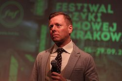

# Abel Korzeniowski

## Biografía

Abel Korzeniowski (Cracovia, Polonia, 18 de julio de 1972) es un compositor polaco de cine y teatro. Tras estudiar con Krzysztof Penderecki y graduarse de la Academia de Música de Cracovia en 2000, participó en producciones cinematográficas de su país tales como Big Animal (2000), Tomorrow's Weather (2003) y An Angel in Krakow (2002). Luego de mudarse a Los Ángeles en 2006, compuso la banda sonora de varias películas estadounidenses, entre ellas, Battle for Terra (2007), Un hombre soltero (2009) y W.E. (2012).​​​ Por su trabajo en las bandas sonoras de Un hombre soltero y W.E. fue nominado al Globo de Oro en 2010 y en 2012, respectivamente.​ Por la primera ganó además el San Diego Film Critics Society Award. Además de su trabajo con bandas sonoras, ha compuesto música para Tiffany y BMW-i, la subsidiaria de autos eléctricos e híbridos de BMW.​ En 2012 realizó el arreglo del espectáculo musical y álbum de Patricia Kaas Kaas chante Piaf (en español, «Kaas canta a Piaf»), con varios de los éxitos de Édith Piaf.​

## Estilo musical

Una de las razones por las que me gusta tanto la música de Korzeniowski es que le gusta escribir piezas puramente orquestales centrándose en el piano y las cuerdas. También puedes escuchar otros instrumentos de vez en cuando, pero principalmente son para aportar color extra. Cada pista de este álbum se ajusta a esta descripción, como explicaré con más detalle algunas de ellas. La primera canción, “Spies and Typewriters”, es un ejemplo perfecto de lo que se puede esperar de la música de esta película. Esta pieza comienza solo con las cuerdas trabajando juntas, con un poco de percusión de fondo, y a mitad de camino se introduce el piano. En “Iron Curtain” las cuerdas se utilizan para una pieza que suena más oscura y con líneas bajas y largas.

## Anécdotas y curiosidades

Abel Korzeniowski (pronunciación polaca: [ˈabɛl koʐɛˈɲɔfski]; nacido el 18 de julio de 1972) es un compositor polaco de partituras de cine y teatro.

## Top 10 bandas sonoras

1. ***Nocturnal Animals (Título en España: Animales nocturnos)***
    * **Póster:** [link](144_abel_korzeniowski/posters/poster_nocturnal_animals_2016.jpg)
2. ***The Nun (Título en España: La monja)***
    * **Póster:** [link](144_abel_korzeniowski/posters/poster_the_nun_2018.jpg)
3. ***A Single Man (Título en España: Un hombre soltero)***
    * **Póster:** [link](144_abel_korzeniowski/posters/poster_a_single_man_2009.jpg)
4. ***W.E. (Título en España: Wallis y Eduardo: El romance del siglo)***
    * **Póster:** [link](144_abel_korzeniowski/posters/poster_w_e_2011.jpg)
5. ***Escape from Tomorrow (Título en España: Escape from Tomorrow)***
    * **Póster:** [link](144_abel_korzeniowski/posters/poster_escape_from_tomorrow_2013.jpg)
6. ***The Watchers (Título en España: Los vigilantes)***
    * **Póster:** [link](144_abel_korzeniowski/posters/poster_the_watchers_2024.jpg)
7. ***The Courier (Título en España: El espía inglés)***
    * **Póster:** [link](144_abel_korzeniowski/posters/poster_the_courier_2020.jpg)
8. ***Till (Título en España: Till, el crimen que lo cambió todo)***
    * **Póster:** [link](144_abel_korzeniowski/posters/poster_till_2022.jpg)
9. ***Emily (Título en España: Emily)***
    * **Póster:** [link](144_abel_korzeniowski/posters/poster_emily_2022.jpg)
10. ***Romeo & Juliet (Título en España: Romeo y Julieta)***
    * **Póster:** [link](144_abel_korzeniowski/posters/poster_romeo_juliet_2013.jpg)

## Filmografía completa

- Duże zwierzę (Título en España: Duże zwierzę) (2000) · [Póster](144_abel_korzeniowski/posters/poster_du_e_zwierz_2000.jpg)
- Anioł w Krakowie (Título en España: Anioł w Krakowie) (2002) · [Póster](144_abel_korzeniowski/posters/poster_anio_w_krakowie_2002.jpg)
- Pogoda na jutro (Título en España: Pogoda na jutro) (2003) · [Póster](144_abel_korzeniowski/posters/poster_pogoda_na_jutro_2003.jpg)
- Pu-239 (Título en España: Pu-239) (2006) · [Póster](144_abel_korzeniowski/posters/poster_pu_239_2006.jpg)
- Battle for Terra (Título en España: Objetivo: Terrum) (2007) · [Póster](144_abel_korzeniowski/posters/poster_battle_for_terra_2007.jpg)
- Gwiazda Kopernika (Título en España: Gwiazda Kopernika) (2009) · [Póster](144_abel_korzeniowski/posters/poster_gwiazda_kopernika_2009.jpg)
- A Single Man (Título en España: Un hombre soltero) (2009) · [Póster](144_abel_korzeniowski/posters/poster_a_single_man_2009.jpg)
- W.E. (Título en España: Wallis y Eduardo: El romance del siglo) (2011) · [Póster](144_abel_korzeniowski/posters/poster_w_e_2011.jpg)
- Escape from Tomorrow (Título en España: Escape from Tomorrow) (2013) · [Póster](144_abel_korzeniowski/posters/poster_escape_from_tomorrow_2013.jpg)
- Romeo & Juliet (Título en España: Romeo y Julieta) (2013) · [Póster](144_abel_korzeniowski/posters/poster_romeo_juliet_2013.jpg)
- The Making of Escape from Tomorrow (Título en España: The Making of Escape from Tomorrow) (2013) · [Póster](144_abel_korzeniowski/posters/poster_the_making_of_escape_from_tomorrow_2013.jpg)
- Ziarno prawdy (Título en España: Ziarno prawdy) (2015) · [Póster](144_abel_korzeniowski/posters/poster_ziarno_prawdy_2015.jpg)
- Nocturnal Animals (Título en España: Animales nocturnos) (2016) · [Póster](144_abel_korzeniowski/posters/poster_nocturnal_animals_2016.jpg)
- The Nun (Título en España: La monja) (2018) · [Póster](144_abel_korzeniowski/posters/poster_the_nun_2018.jpg)
- The Courier (Título en España: El espía inglés) (2020) · [Póster](144_abel_korzeniowski/posters/poster_the_courier_2020.jpg)
- Emily (Título en España: Emily) (2022) · [Póster](144_abel_korzeniowski/posters/poster_emily_2022.jpg)
- Till (Título en España: Till, el crimen que lo cambió todo) (2022) · [Póster](144_abel_korzeniowski/posters/poster_till_2022.jpg)
- The Cigarette (Título en España: The Cigarette) (2023) · [Póster](144_abel_korzeniowski/posters/poster_the_cigarette_2023.jpg)
- The Watchers (Título en España: Los vigilantes) (2024) · [Póster](144_abel_korzeniowski/posters/poster_the_watchers_2024.jpg)
- The Good Boy (Título en España: The Good Boy) (2026) · [Póster](144_abel_korzeniowski/posters/poster_the_good_boy_2026.jpg)

## Premios y nominaciones

* 2010 – Globo de Oro – (Nominación)
* 2012 – Globo de Oro – (Nominación)
* 2015 – BAFTA – (Nominación)
* 2015 – Emmy – (Nominación)
* 2016 – Emmy – (Nominación)
* Emmy – (Nominación)
* Emmy – por *A Series: Abel Korzeniowski Outstanding Prosthetic Makeup For A Series: Nick Dudman* – (Ganador)
* Globo de Oro – por *Tom Ford’s* – (Nominación)
* Globo de Oro – por *the 67th annual Golden Globe Awards announced. Three nods for A SINGLE MAN! Colin Firth for Best Actor* – (Nominación)
* Globo de Oro – por *the 69th annual Golden Globe Awards announced. Two nods for W.E.! Madonna for Best Song and Abel Korzeniowski for Best Original Score.* – (Nominación)
* Premio de la Academia – (Nominación)

## Fuentes adicionales

* [MundoBSO](https://www.mundobso.com/compositor/korzeniowski-abel) — site:mundobso.com
* [MundoBSO (2)](https://w.mundobso.com/bso/cartero-siempre-llama-dos-veces-el) — site:mundobso.com
* [MundoBSO (3)](https://www.mundobso.com/bso/milla-verde-la) — site:mundobso.com
* [Film Score Monthly](https://www.filmscoremonthly.com/board/posts.cfm?threadID=104443&forumID=1&archive=0) — site:filmscoremonthly.com
* [Film Score Monthly (2)](https://filmscoremonthly.com/board/posts.cfm?threadID=76804) — site:filmscoremonthly.com
* [Film Score Monthly (3)](https://www.filmscoremonthly.com/board/posts.cfm?forumID=1&pageID=3&threadID=151483&archive=0) — site:filmscoremonthly.com
* [SoundtrackCollector](https://www.soundtrackcollector.com/catalog/composerdiscography.php?composerid=8709) — site:soundtrackcollector.com
* [SoundtrackCollector (2)](https://www.soundtrackcollector.com/title/109053/15+Years+WSA+-+A+Film+Music+Celebration) — site:soundtrackcollector.com
* [SoundtrackCollector (3)](https://www.soundtrackcollector.com/title/87850/Single+Man,+A) — site:soundtrackcollector.com
* [WhatSong](https://www.whatsong.org/tvshow/penny-dreadful/episode/25889) — site:whatsong.org
* [WhatSong (2)](https://www.whatsong.org/tvshow/top-gear/episode/45053) — site:whatsong.org
* [WhatSong (3)](https://www.whatsong.org/tvshow/top-gear/episode/19070) — site:whatsong.org

## Notas externas

* MundoBSO: Nació en Cracovia (Polonia), el 18 de julio de 1972. Se graduó en su ciudad natal como cellista y compositor y ha desarrollado su carrera en el mundo de la música concertista, el teatro, el cine y la televisión. Nació en Cracovia (Polonia), el 18 de julio de 1972. Se graduó en su ciudad natal como cellista y compositor y ha desarrollado su carrera en el mundo de la música concertista, el teatro, el cine y la televisión.
* MundoBSO (3): Compositor: Newman, Thomas Sello: Warner Duración: 66 minutos Información de la película Título original: The Green Mile Director: Frank Darabont Nacionalidad: EE UU Año: 1999 Argumento A mediados de los años treinta, un guarda de prisiones que custodia a los condenados a muerte descubre poderes sobrenaturales en un inmenso hombre negro, acusado de haber asesinado a dos niñas. Eso le llevará a creer en su inocencia. Premios Saturn: 1 nominación Compositor: Newman, Thomas Sello: Warner Duración: 66 minutos
* WhatSong: Susan Graham, Le Concert d'Astrée y Emmanuelle Haïm - Purcell: Dido y Eneas Angelique preguntan a Dorian sobre su salida actual; Lily se viste y luego se perfuma; Víctor y Lyle descansan; Malcolm se va; Caliban observa a Lily y Dorian; Angélique está para escuchar el viento soplar.
* WhatSong (2): The Dust Brothers - Fight Club (Banda sonora original de la película) Abel Korzeniowski - Un hombre soltero (Banda sonora original de la película)
* WhatSong (3): Andy Brown, Ilan Eshkeri y London Metropolitan Orchestra - Stardust (Música de la película) John Ottman - Superman Returns (Música de la película)
* elpais.com: El músico Abel Korzeniowski (Cracovia, 1972) no tenía otra salida profesional. Ni la hubiese querido. Cuando tenía dos años, su madre, que tocaba el chelo en la ópera de Cracovia, le regaló su primer instrumento. En la adolescencia descubrió el cine y de forma natural mezcló sus dos pasiones. Tras graduarse con méritos en la Academia de Música de su ciudad natal con el maestro Krzysztof Penderecki, se convirtió en la gran estrella de la música del cine polaco. Ganó el mayor premio posible en su país con su banda sonora de debut en un largometraje, la de la película Big Animal (que contaba con guion de Krzysztof Kieslowski). El estrés y la presión en Polonia le llevó a miles de kilómetros de...
* www.yourclassical.org: Formas de donar Comience con una donación mensual Más formas de donar Done un vehículo Donación planificada Fondo asesorado por donantes Abel Korzeniowski es único entre los compositores de cine y televisión de hoy, por varias razones. Con todo cada vez más acelerado y cada vez más compositores ahondando en la percusión y los sintetizadores como punto de partida, Korzeniowski comienza por las cuerdas.
* cinemagavia.es: Si ya tienes un código introducelo a continuación para validarlo. Televisión Netflix Filmin HBO Amazon Prime Video Disney+ Apple TV Movistar Cosmo TV AMC Networks Paramount Network FlixOlé
* www.bmi.com: Iniciar sesión Creadores y editores de música Usuarios/licenciatarios de música Buscar en este sitio o: Buscar vista de canción Buscar por título, artista, compositor, compositor, editor y más...
* www.abelkorzeniowski.com: El trabajo de Abel Korzeniowski en música cinematográfica lo ubica en un pequeño grupo de compositores que parecen destinados a definir el futuro de esta forma de arte. Es su música apasionada, evocadora y verdaderamente original, basada en el estilo europeo moderno, la que deja una impresión singular en el oyente. Las partituras de Korzeniowski han recibido un tremendo entusiasmo de la crítica y numerosos premios, entre los que destacan dos nominaciones al Globo de Oro y tres premios World Soundtrack. Su música exuberante, conmovedora y muy original para A Single Man de Tom Ford, protagonizada por Colin Firth y Julianne Moore, fue recibida con aclamación inmediata. La partitura llamó la atención de Madonna, quien lo invitó a crear música para su largometraje W.E.....
* www.abelkorzeniowski.com: Sinopsis: La idílica vida de una exitosa propietaria de una galería de arte de Los Ángeles se ve empañada por los constantes viajes de su apuesto segundo marido. Mientras él está fuera, ella se ve conmocionada por la llegada de un manuscrito escrito por su primer marido, a quien no ha visto en años. El manuscrito cuenta la historia de un profesor que encuentra […] Un hat-trick para PENNY DREADFUL en los British Academy Television Craft Awards. Mejor Música Original, Mejor Diseño de Producción, Mejor Maquillaje y Peluquería
* composer.spitfireaudio.com: Ese es el punto de partida del nuevo drama de la directora Frances O'Connor, Emily, un relato especulativo sobre la inspiración de la autora, sus relaciones entre hermanos y su espíritu interior que mezcla juiciosamente realidad y ficción. El elemento ficticio de la historia surge principalmente a través de la relación de Emily con el curador local de Haworth, Weightman, una figura de la vida real que, según el registro histórico, parecía compartir una conexión más profunda con la hermana de Emily, Anne. Una faceta crítica de la textura melancólica de la película es la partitura del destacado compositor polaco Abel Korzeniowski, quien no es ajeno a articular los atormentados sentimientos internos de las almas creativas. Con su música para Un hombre soltero (2010), la primera de su...
