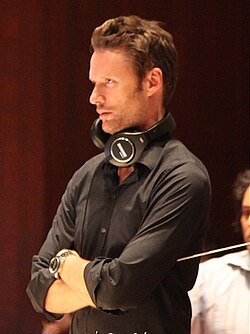

# Brian Tyler

## Biografía

Brian Theodore Tyler (Los Ángeles, California, Estados Unidos, 8 de mayo de 1972) es un compositor, director de orquesta, arreglista y productor de discos estadounidense, conocido por sus bandas sonoras de películas, televisión y videojuegos. En sus 26 años de carrera, Tyler ha compuesto siete entregas de la franquicia Fast & Furious, Rambo, Eagle Eye, tres entregas de la franquicia The Expendables, Iron Man 3, Now You See Me, Avengers: Age of Ultron junto a Danny Elfman, Crazy Rich Asians y The Super Mario Bros. Movie, entre otras. También compuso y reorganizó la fanfarria actual del logotipo de Universal Pictures, compuesta originalmente por Jerry Goldsmith, para el 100.º aniversario de Universal Pictures, que debutó con The Lorax (2012), y compuso el logotipo de Marvel Studios de 2013 a 2016, que debutó con Thor: The Dark World (2013), que también compuso la partitura de la película. Compuso el tema NFL Sunday Countdown para ESPN, el tema de la Fórmula 1 (utilizado en la Fórmula 2 y la Fórmula 3) y el himno de la Copa Mundial de Esports. También está detrás de la banda sonora de muchas series de televisión, incluida Yellowstone. Por su trabajo como compositor de cine, ganó los Premios IFMCA 2014 como Compositor del Año. Su composición para la película Last Call, le valió la primera de tres nominaciones al Emmy, un disco de oro y la incorporación a la rama musical de la Academia de Artes y Ciencias Cinematográficas. Hasta noviembre de 2017, sus películas han recaudado $12 mil millones de dólares en todo el mundo, lo que lo coloca entre los 10 compositores cinematográficos más taquilleros de todos los tiempos.

## Estilo musical

Tyler también creó el arreglo actual de la fanfarria del logo de Universal Pictures (compuesta originalmente por Jerry Goldsmith) que debutó con The Lorax (2012) en celebración del centenario de Universal Pictures. También compuso el logotipo de Marvel Studios de 2013-2016, que debutó con Thor: The Dark World (2013), para el que también compuso la banda sonora de la película. Compuso el tema de la cuenta atrás del domingo de la NFL para ESPN, el tema de la Fórmula Uno (también utilizado en la Fórmula 2 y la Fórmula 3) y el himno de la Copa Mundial de Esports. También está detrás de la banda sonora de numerosas series de televisión, incluidas Yellowstone, 1883 y 1923, todas con Breton Vivian. Por su trabajo como compositor de cine, ganó el premio IFMCA Awards 2014 Compositor del Año.

## Anécdotas y curiosidades

2 Subsección de cambio de carrera 2.1 Película 2.2 Música

Compositor: Jackman, Henry Sello: Hollywood Duración: 69 minutos Información de la película Título original: Captain America: Civil War Director: Anthony Russo, Joe Russo Nacionalidad: EE UU Año: 2016 Argumento Continuación de Captain America: The Winter Soldier (14). Cuando otro incidente internacional involucra a Los Vengadores y causan varios daños colaterales, aumentan las presiones políticas para exigir más responsabilidades y determinar cuándo deben contratar los servicios del grupo de superhéroes. Esta nueva situación dividirá a Los Vengadores, mientras intentan proteger al mundo de un nuevo y terrible villano. Compositor: Jackman, Henry Sello: Hollywood Duración: 69 minutos

## Top 10 bandas sonoras

1. ***Avengers: Age of Ultron (Título en España: Vengadores: La era de Ultrón)***
    * **Póster:** [link](145_brian_tyler/posters/poster_avengers_age_of_ultron_2015.jpg)
2. ***Iron Man 3 (Título en España: Iron Man 3)***
    * **Póster:** [link](145_brian_tyler/posters/poster_iron_man_3_2013.jpg)
3. ***Thor: The Dark World (Título en España: Thor: el mundo oscuro)***
    * **Póster:** [link](145_brian_tyler/posters/poster_thor_the_dark_world_2013.jpg)
4. ***Now You See Me: Now You Don't (Título en España: Ahora me ves 3)***
    * **Póster:** [link](145_brian_tyler/posters/poster_now_you_see_me_now_you_don_t_2025.jpg)
5. ***Six-String Samurai (Título en España: Holocausto Samurái)***
    * **Póster:** [link](145_brian_tyler/posters/poster_six_string_samurai_1998.jpg)
6. ***The 4th Floor (Título en España: El cuarto piso)***
    * **Póster:** [link](145_brian_tyler/posters/poster_the_4th_floor_1999.jpg)
7. ***The Super Mario Bros. Movie (Título en España: Super Mario Bros: La película)***
    * **Póster:** [link](145_brian_tyler/posters/poster_the_super_mario_bros_movie_2023.jpg)
8. ***Nuremberg (Título en España: Núremberg)***
    * **Póster:** [link](145_brian_tyler/posters/poster_nuremberg_2025.jpg)
9. ***Fast X (Título en España: Fast & Furious X)***
    * **Póster:** [link](145_brian_tyler/posters/poster_fast_x_2023.jpg)
10. ***Now You See Me (Título en España: Ahora me ves)***
    * **Póster:** [link](145_brian_tyler/posters/poster_now_you_see_me_2013.jpg)

## Filmografía completa

- Six-String Samurai (Título en España: Holocausto Samurái) (1998) · [Póster](145_brian_tyler/posters/poster_six_string_samurai_1998.jpg)
- The 4th Floor (Título en España: El cuarto piso) (1999) · [Póster](145_brian_tyler/posters/poster_the_4th_floor_1999.jpg)
- Four Dogs Playing Poker (Título en España: Muerte a la carta) (2000) · [Póster](145_brian_tyler/posters/poster_four_dogs_playing_poker_2000.jpg)
- Panic (Título en España: Panic) (2000) · [Póster](145_brian_tyler/posters/poster_panic_2000.jpg)
- Terror Tract (Título en España: Área maldita) (2000) · [Póster](145_brian_tyler/posters/poster_terror_tract_2000.jpg)
- Bubba Ho-tep (Título en España: Bubba Ho-tep) (2002) · [Póster](145_brian_tyler/posters/poster_bubba_ho_tep_2002.jpg)
- Frailty (Título en España: Escalofrío) (2002) · [Póster](145_brian_tyler/posters/poster_frailty_2002.jpg)
- Plan B (Título en España: Plan B) (2002) · [Póster](145_brian_tyler/posters/poster_plan_b_2002.jpg)
- Vampires: Los Muertos (Título en España: Vampiros: Los muertos) (2002) · [Póster](145_brian_tyler/posters/poster_vampires_los_muertos_2002.jpg)
- The Big Empty (Título en España: El gran destino) (2003) · [Póster](145_brian_tyler/posters/poster_the_big_empty_2003.jpg)
- Darkness Falls (Título en España: En la oscuridad) (2003) · [Póster](145_brian_tyler/posters/poster_darkness_falls_2003.jpg)
- The Hunted (Título en España: The Hunted (La presa)) (2003) · [Póster](145_brian_tyler/posters/poster_the_hunted_2003.jpg)
- Timeline (Título en España: Timeline) (2003) · [Póster](145_brian_tyler/posters/poster_timeline_2003.jpg)
- Godsend (Título en España: El enviado) (2004) · [Póster](145_brian_tyler/posters/poster_godsend_2004.jpg)
- The Final Cut (Título en España: La memoria de los muertos) (2004) · [Póster](145_brian_tyler/posters/poster_the_final_cut_2004.jpg)
- Paparazzi (Título en España: Paparazzi) (2004) · [Póster](145_brian_tyler/posters/poster_paparazzi_2004.jpg)
- Constantine (Título en España: Constantine) (2005) · [Póster](145_brian_tyler/posters/poster_constantine_2005.jpg)
- The Greatest Game Ever Played (Título en España: Juego de honor) (2005) · [Póster](145_brian_tyler/posters/poster_the_greatest_game_ever_played_2005.jpg)
- The Fast and the Furious: Tokyo Drift (Título en España: A todo gas: Tokyo Race) (2006) · [Póster](145_brian_tyler/posters/poster_the_fast_and_the_furious_tokyo_drift_2006.jpg)
- Aliens vs Predator: Requiem (Título en España: Aliens vs. Predator 2) (2007) · [Póster](145_brian_tyler/posters/poster_aliens_vs_predator_requiem_2007.jpg)
- Bug (Título en España: Bug) (2007) · [Póster](145_brian_tyler/posters/poster_bug_2007.jpg)
- War (Título en España: El asesino (War)) (2007) · [Póster](145_brian_tyler/posters/poster_war_2007.jpg)
- Finishing the Game: The Search for a New Bruce Lee (Título en España: Finishing the Game: The Search for a New Bruce Lee) (2007) · [Póster](145_brian_tyler/posters/poster_finishing_the_game_the_search_for_a_new_bruce_lee_2007.jpg)
- Partition (Título en España: Pasión sin fronteras) (2007) · [Póster](145_brian_tyler/posters/poster_partition_2007.jpg)
- Rambo (Título en España: John Rambo) (2008) · [Póster](145_brian_tyler/posters/poster_rambo_2008.jpg)
- Eagle Eye (Título en España: La conspiración del pánico) (2008) · [Póster](145_brian_tyler/posters/poster_eagle_eye_2008.jpg)
- Bangkok Dangerous (Título en España: Peligro en Bangkok) (2008) · [Póster](145_brian_tyler/posters/poster_bangkok_dangerous_2008.jpg)
- The Lazarus Project (Título en España: Proyecto Lazarus) (2008) · [Póster](145_brian_tyler/posters/poster_the_lazarus_project_2008.jpg)
- The Final Destination (Título en España: Destino final 4) (2009) · [Póster](145_brian_tyler/posters/poster_the_final_destination_2009.jpg)
- Dragonball Evolution (Título en España: Dragonball Evolution) (2009) · [Póster](145_brian_tyler/posters/poster_dragonball_evolution_2009.jpg)
- Fast & Furious (Título en España: Fast & Furious: Aún más rápido) (2009) · [Póster](145_brian_tyler/posters/poster_fast_furious_2009.jpg)
- Middle Men (Título en España: Middle Men) (2009) · [Póster](145_brian_tyler/posters/poster_middle_men_2009.jpg)
- The Killing Room (Título en España: The Killing Room) (2009) · [Póster](145_brian_tyler/posters/poster_the_killing_room_2009.jpg)
- Law Abiding Citizen (Título en España: Un ciudadano ejemplar) (2009) · [Póster](145_brian_tyler/posters/poster_law_abiding_citizen_2009.jpg)
- From the Ashes: Post-Production and Release of 'The Expendables' (Título en España: From the Ashes: Post-Production and Release of 'The Expendables') (2010) · [Póster](145_brian_tyler/posters/poster_from_the_ashes_post_production_and_release_of_the_expendables_2010.jpg)
- The Expendables (Título en España: Los mercenarios) (2010) · [Póster](145_brian_tyler/posters/poster_the_expendables_2010.jpg)
- Final Destination 5 (Título en España: Destino final 5) (2011) · [Póster](145_brian_tyler/posters/poster_final_destination_5_2011.jpg)
- Fast Five (Título en España: Fast & Furious 5) (2011) · [Póster](145_brian_tyler/posters/poster_fast_five_2011.jpg)
- Battle: Los Angeles (Título en España: Invasión a la Tierra) (2011) · [Póster](145_brian_tyler/posters/poster_battle_los_angeles_2011.jpg)
- Brake (Título en España: Brake) (2012) · [Póster](145_brian_tyler/posters/poster_brake_2012.jpg)
- The Expendables 2 (Título en España: Los mercenarios 2) (2012) · [Póster](145_brian_tyler/posters/poster_the_expendables_2_2012.jpg)
- Now You See Me (Título en España: Ahora me ves) (2013) · [Póster](145_brian_tyler/posters/poster_now_you_see_me_2013.jpg)
- Iron Man 3 (Título en España: Iron Man 3) (2013) · [Póster](145_brian_tyler/posters/poster_iron_man_3_2013.jpg)
- John Dies at the End (Título en España: John muere al final) (2013) · [Póster](145_brian_tyler/posters/poster_john_dies_at_the_end_2013.jpg)
- Standing Up (Título en España: Standing Up) (2013) · [Póster](145_brian_tyler/posters/poster_standing_up_2013.jpg)
- Thor: The Dark World (Título en España: Thor: el mundo oscuro) (2013) · [Póster](145_brian_tyler/posters/poster_thor_the_dark_world_2013.jpg)
- Transformers Prime: Beast Hunters - Predacons Rising (Título en España: Transformers Prime Beast Hunters: Predacons Rising) (2013) · [Póster](145_brian_tyler/posters/poster_transformers_prime_beast_hunters_predacons_rising_2013.jpg)
- Marvel One-Shot: All Hail the King (Título en España: Corto Marvel: Todos aclaman al Rey) (2014) · [Póster](145_brian_tyler/posters/poster_marvel_one_shot_all_hail_the_king_2014.jpg)
- Into the Storm (Título en España: En el ojo de la tormenta) (2014) · [Póster](145_brian_tyler/posters/poster_into_the_storm_2014.jpg)
- The Expendables 3 (Título en España: Los mercenarios 3) (2014) · [Póster](145_brian_tyler/posters/poster_the_expendables_3_2014.jpg)
- Marvel Studios: Assembling a Universe (Título en España: Marvel: Construyendo un universo) (2014) · [Póster](145_brian_tyler/posters/poster_marvel_studios_assembling_a_universe_2014.jpg)
- Teenage Mutant Ninja Turtles (Título en España: Ninja Turtles) (2014) · [Póster](145_brian_tyler/posters/poster_teenage_mutant_ninja_turtles_2014.jpg)
- Edge (Título en España: Edge) (2015) · [Póster](145_brian_tyler/posters/poster_edge_2015.jpg)
- Furious 7 (Título en España: Fast & Furious 7) (2015) · [Póster](145_brian_tyler/posters/poster_furious_7_2015.jpg)
- Truth (Título en España: La verdad) (2015) · [Póster](145_brian_tyler/posters/poster_truth_2015.jpg)
- Avengers: Age of Ultron (Título en España: Vengadores: La era de Ultrón) (2015) · [Póster](145_brian_tyler/posters/poster_avengers_age_of_ultron_2015.jpg)
- Now You See Me 2 (Título en España: Ahora me ves 2) (2016) · [Póster](145_brian_tyler/posters/poster_now_you_see_me_2_2016.jpg)
- Criminal (Título en España: Criminal) (2016) · [Póster](145_brian_tyler/posters/poster_criminal_2016.jpg)
- The Fate of the Furious (Título en España: Fast & Furious 8) (2017) · [Póster](145_brian_tyler/posters/poster_the_fate_of_the_furious_2017.jpg)
- The Mummy (Título en España: La momia) (2017) · [Póster](145_brian_tyler/posters/poster_the_mummy_2017.jpg)
- Power Rangers (Título en España: Power Rangers) (2017) · [Póster](145_brian_tyler/posters/poster_power_rangers_2017.jpg)
- Score: A Film Music Documentary (Título en España: Score: Compositores de Oscar) (2017) · [Póster](145_brian_tyler/posters/poster_score_a_film_music_documentary_2017.jpg)
- xXx: Return of Xander Cage (Título en España: xXx: Reactivated) (2017) · [Póster](145_brian_tyler/posters/poster_xxx_return_of_xander_cage_2017.jpg)
- Crazy Rich Asians (Título en España: Crazy Rich Asians) (2018) · [Póster](145_brian_tyler/posters/poster_crazy_rich_asians_2018.jpg)
- Five Feet Apart (Título en España: A dos metros de ti) (2019) · [Póster](145_brian_tyler/posters/poster_five_feet_apart_2019.jpg)
- Escape Room (Título en España: Escape Room) (2019) · [Póster](145_brian_tyler/posters/poster_escape_room_2019.jpg)
- Charlie's Angels (Título en España: Los ángeles de Charlie) (2019) · [Póster](145_brian_tyler/posters/poster_charlie_s_angels_2019.jpg)
- Ready or Not (Título en España: Noche de bodas) (2019) · [Póster](145_brian_tyler/posters/poster_ready_or_not_2019.jpg)
- Rambo: Last Blood (Título en España: Rambo: Last Blood) (2019) · [Póster](145_brian_tyler/posters/poster_rambo_last_blood_2019.jpg)
- What Men Want (Título en España: ¿En qué piensan los hombres?) (2019) · [Póster](145_brian_tyler/posters/poster_what_men_want_2019.jpg)
- Clouds (Título en España: Clouds) (2020) · [Póster](145_brian_tyler/posters/poster_clouds_2020.jpg)
- Those Who Wish Me Dead (Título en España: Aquellos que desean mi muerte) (2021) · [Póster](145_brian_tyler/posters/poster_those_who_wish_me_dead_2021.jpg)
- Escape Room: Tournament of Champions (Título en España: Escape Room 2: Mueres por salir) (2021) · [Póster](145_brian_tyler/posters/poster_escape_room_tournament_of_champions_2021.jpg)
- F9 (Título en España: Fast & Furious 9) (2021) · [Póster](145_brian_tyler/posters/poster_f9_2021.jpg)
- Vegas Needs a New King: The Making of Six-String Samurai (Título en España: Vegas Needs a New King: The Making of Six-String Samurai) (2021) · [Póster](145_brian_tyler/posters/poster_vegas_needs_a_new_king_the_making_of_six_string_samurai_2021.jpg)
- Redeeming Love (Título en España: Amor redentor) (2022) · [Póster](145_brian_tyler/posters/poster_redeeming_love_2022.jpg)
- Chip 'n Dale: Rescue Rangers (Título en España: Chip y Chop: Los guardianes rescatadores) (2022) · [Póster](145_brian_tyler/posters/poster_chip_n_dale_rescue_rangers_2022.jpg)
- Scream (Título en España: Scream) (2022) · [Póster](145_brian_tyler/posters/poster_scream_2022.jpg)
- Fast X (Título en España: Fast & Furious X) (2023) · [Póster](145_brian_tyler/posters/poster_fast_x_2023.jpg)
- Scream VI (Título en España: Scream VI) (2023) · [Póster](145_brian_tyler/posters/poster_scream_vi_2023.jpg)
- The Super Mario Bros. Movie (Título en España: Super Mario Bros: La película) (2023) · [Póster](145_brian_tyler/posters/poster_the_super_mario_bros_movie_2023.jpg)
- Abigail (Título en España: Abigail) (2024) · [Póster](145_brian_tyler/posters/poster_abigail_2024.jpg)
- Transformers One (Título en España: Transformers One) (2024) · [Póster](145_brian_tyler/posters/poster_transformers_one_2024.jpg)
- Now You See Me: Now You Don't (Título en España: Ahora me ves 3) (2025) · [Póster](145_brian_tyler/posters/poster_now_you_see_me_now_you_don_t_2025.jpg)
- Nuremberg (Título en España: Núremberg) (2025) · [Póster](145_brian_tyler/posters/poster_nuremberg_2025.jpg)
- The Super Mario Galaxy Movie (Título en España: Super Mario Galaxy la película) (2026) · [Póster](145_brian_tyler/posters/poster_the_super_mario_galaxy_movie_2026.jpg)

## Premios y nominaciones

* 2014 – Premio Primetime Emmy a la mejor música del tema principal original – por *Sleepy Hollow (Título en España: Sleepy Hollow (El Jinete sin Cabeza))* – (Nominación)

## Fuentes adicionales

* [MundoBSO](https://www.mundobso.com/compositor/tyler-brian) — site:mundobso.com
* [MundoBSO (2)](https://w.mundobso.com/bso/cartero-siempre-llama-dos-veces-el) — site:mundobso.com
* [MundoBSO (3)](https://www.mundobso.com/bso/capitan-america-civil-war) — site:mundobso.com
* [Film Score Monthly](https://www.filmscoremonthly.com/backissues/viewissue.cfm?issueID=76) — site:filmscoremonthly.com
* [Film Score Monthly (2)](https://filmscoremonthly.com/board/posts.cfm?threadID=158488&forumID=1&archive=0) — site:filmscoremonthly.com
* [Film Score Monthly (3)](https://filmscoremonthly.com/board/posts.cfm?forumID=1&pageID=12&threadID=100844&archive=0) — site:filmscoremonthly.com
* [SoundtrackCollector](https://www.soundtrackcollector.com/catalog/composerdiscography.php?composerid=2523) — site:soundtrackcollector.com
* [SoundtrackCollector (2)](https://www.soundtrackcollector.com) — site:soundtrackcollector.com
* [SoundtrackCollector (3)](https://www.soundtrackcollector.com/title/95076/Transformers+Prime+) — site:soundtrackcollector.com
* [WhatSong](https://www.whatsong.org) — site:whatsong.org
* [WhatSong (2)](https://www.whatsong.org/movie/the-fast-and-the-furious-tokyo-drift) — site:whatsong.org
* [WhatSong (3)](https://www.whatsong.org/movie/redeeming-love) — site:whatsong.org

## Notas externas

* MundoBSO: Todos los textos, salvo los firmados por otros, están registrados y son propiedad de Conrado Xalabarder. Prohibida la reproducción total o parcial sin el consentimiento expreso y por escrito del autor. Las fotos tienen únicamente propósitos identificativos, sin ninguna intención de vulneración de copyright. Si eres el autor/a o propietario de la foto escríbenos un email a cxa@mundobso para acreditarte o, si lo prefieres, para que la borremos
* MundoBSO (3): Compositor: Jackman, Henry Sello: Hollywood Duración: 69 minutos Información de la película Título original: Captain America: Civil War Director: Anthony Russo, Joe Russo Nacionalidad: EE UU Año: 2016 Argumento Continuación de Captain America: The Winter Soldier (14). Cuando otro incidente internacional involucra a Los Vengadores y causan varios daños colaterales, aumentan las presiones políticas para exigir más responsabilidades y determinar cuándo deben contratar los servicios del grupo de superhéroes. Esta nueva situación dividirá a Los Vengadores, mientras intentan proteger al mundo de un nuevo y terrible villano. Compositor: Jackman, Henry Sello: Hollywood Duración: 69 minutos
* SoundtrackCollector (2): 14 de enero - Confesión de un comisionado de policía de Riz Ortolani a la fiscalía 3 de diciembre - Wolf Hall de Debbie Wiseman: El espejo y la luz
* WhatSong: La mejor fuente en línea de música de películas y televisión. Copyright © 2018 - 2026 Whatsong.org. Reservados todos los derechos.
* WhatSong (2): Han y Sean llegan al bar y lo atraviesan hasta el garaje de Han. Fannypack - Tan estilístico / El tema de Fannypack - EP
* WhatSong (3): Brian Tyler - Amor redentor (Banda sonora original de la película) Brian Tyler - Amor redentor (Banda sonora original de la película)
* www.popdisciple.com: Brian Tyler es el valiente compositor, músico multifacético y director de orquesta que ha conquistado el mundo de la música cinematográfica. Con más de 70 largometrajes en su haber, Brian se ha ganado una brillante reputación por sus refinados arreglos orquestales y partituras de acción de alto octanaje. Ha contribuido con su sensibilidad musical a una variedad de películas taquilleras y emocionantes programas de televisión, incluidos Iron Man 3, The Mummy, Thor: The Dark World, The Fate of the Furious, Hawaii Five-0, Rambo, xXx: Return of Xander Cage, Power Rangers y Sleepy Hollow. Más recientemente, Brian está disfrutando del éxito generalizado de su trabajo en la obra maestra que desafía los estereotipos de Jon M. Chu, Crazy Rich Asians y Taylor Sheridan...
* www.televisionacademy.com: La base de datos de la Academia de Televisión enumera información de los Emmy en horario de máxima audiencia. Haga clic aquí para obtener más información. Contenido del sitio web © Academia de Televisión. EMMY, EMMYS y la estatuilla Emmy son marcas comerciales registradas y/o derechos de autor de ATAS y NATAS. TELEVISION ACADEMY y ACADEMY OF TELEVISION ARTS & SCIENCES son marcas registradas de ATAS.
* www.oreateai.com: ¡Lea las últimas guías, consejos e ideas sobre redacción inteligente de Al y generación de presentaciones! Brian Tyler es un nombre que resuena profundamente en la industria cinematográfica, particularmente en el ámbito de las bandas sonoras cinematográficas. Con un impresionante portafolio que abarca más de dos décadas, ha creado música para algunas de las películas y franquicias más memorables de Hollywood. Su capacidad para evocar emociones a través del sonido es incomparable, lo que lo convierte en uno de los principales compositores del cine contemporáneo.
* www.briantyler.com: Para jugar, mantenga presionada la tecla Intro. Para detenerlo, suelte la tecla Intro.
* ultimatepopculture.fandom.com: ¡Estamos buscando revitalizar esta wiki! Para obtener más información, haga clic aquí. Explorar la página principal Todas las páginas Comunidad Mapas interactivos Publicaciones de blog recientes
* www.briantyler.com: Brian Tyler es nominado en múltiples ocasiones a los premios BAFTA y Emmy, artista discográfico con ventas de platino y ha sido compositor y director de orquesta en más de 100 largometrajes. Los créditos musicales de Tyler incluyen Avengers: Age of Ultron de Joss Whedon, Furious 7 de James Wan y Fate of the Furious de F. Gary Gray, así como otros en la franquicia Fast and the Furious, Iron Man 3 de Shane Black, Thor: The Dark World de Alan Taylor, Crazy Rich Asians de Jon Chu, por la que fue votado para la lista de finalistas del Oscar 2019 a la mejor banda sonora original, Truth de James Vanderbilt, protagonizada por Cate Blanchett y Robert Redford, Clouds de Justin Baldoni, Now You See Me de Louis Leterrier y Now You See Me 2 de Jon Chu, What Men de Adam Shankman...
