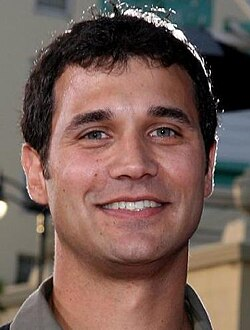

# Ramin Djawadi

## Biografía

Ramin Djawadi (en persa: رامین جوادی) (Duisburgo, Rin-Ruhr; 19 de julio de 1974), también conocido como Ramin D, es un compositor y productor germano-iraní de música orquestal para cine y televisión. Es conocido por haber sido nominado a los Grammy por la banda sonora de la película Iron Man y también por componer la banda sonora de Pacific Rim o de las series Juego de tronos y Westworld, ambas de HBO.​

## Estilo musical

El ganador del Emmy Ramin Djawadi compuso los temas de apertura de Game of Thrones y Westworld. Crédito de la foto: Matt Martin.

## Anécdotas y curiosidades

Ramin Djawadi (nacido el 19 de julio de 1974) es un compositor, director de orquesta y productor discográfico alemán [ 1 ] [ 2 ] [ 3 ]. Es conocido por sus partituras para la serie de HBO Juego de Tronos, por la que fue nominado a los premios Grammy en 2018 y 2020. [4] También es el compositor de la serie precuela de Juego de Tronos de HBO, House of the Dragon (2022-presente). [ 5 ] Ha compuesto música para películas como Choque de titanes, Pacific Rim, Warcraft, A Wrinkle in Time, Iron Man y Eternals; así como series de televisión que incluyen 3 Body Problem, Prison Break, Person of Interest, Jack Ryan, Westworld y Fallout y videojuegos como Medal of Honor, Gears of War 4, Gears 5 y System Shock 2.

## Top 10 bandas sonoras

1. ***Iron Man (Título en España: Iron Man)***
    * **Póster:** [link](146_ramin_djawadi/posters/poster_iron_man_2008.jpg)
2. ***Pacific Rim (Título en España: Pacific Rim)***
    * **Póster:** [link](146_ramin_djawadi/posters/poster_pacific_rim_2013.jpg)
3. ***Clash of the Titans (Título en España: Furia de titanes)***
    * **Póster:** [link](146_ramin_djawadi/posters/poster_clash_of_the_titans_2010.jpg)
4. ***Blade: Trinity (Título en España: Blade Trinity)***
    * **Póster:** [link](146_ramin_djawadi/posters/poster_blade_trinity_2004.jpg)
5. ***Mercy (Título en España: Sin piedad)***
    * **Póster:** [link](146_ramin_djawadi/posters/poster_mercy_2026.jpg)
6. ***Eternals (Título en España: Eternals)***
    * **Póster:** [link](146_ramin_djawadi/posters/poster_eternals_2021.jpg)
7. ***Uncharted (Título en España: Uncharted)***
    * **Póster:** [link](146_ramin_djawadi/posters/poster_uncharted_2022.jpg)
8. ***Warcraft (Título en España: Warcraft: El origen)***
    * **Póster:** [link](146_ramin_djawadi/posters/poster_warcraft_2016.jpg)
9. ***The Great Wall (Título en España: La Gran Muralla)***
    * **Póster:** [link](146_ramin_djawadi/posters/poster_the_great_wall_2016.jpg)
10. ***Safe House (Título en España: El invitado)***
    * **Póster:** [link](146_ramin_djawadi/posters/poster_safe_house_2012.jpg)

## Filmografía completa

- Beat the Drum (Título en España: Beat the Drum) (2003) · [Póster](146_ramin_djawadi/posters/poster_beat_the_drum_2003.jpg)
- Saving Jessica Lynch (Título en España: Saving Jessica Lynch) (2003) · [Póster](146_ramin_djawadi/posters/poster_saving_jessica_lynch_2003.jpg)
- Blade: Trinity (Título en España: Blade Trinity) (2004) · [Póster](146_ramin_djawadi/posters/poster_blade_trinity_2004.jpg)
- Thunderbirds (Título en España: Thunderbirds) (2004) · [Póster](146_ramin_djawadi/posters/poster_thunderbirds_2004.jpg)
- Buffalo Dreams (Título en España: Buffalo Dreams) (2005) · [Póster](146_ramin_djawadi/posters/poster_buffalo_dreams_2005.jpg)
- Boog and Elliot's Midnight Bun Run (Título en España: Boog and Elliot's Midnight Bun Run) (2006) · [Póster](146_ramin_djawadi/posters/poster_boog_and_elliot_s_midnight_bun_run_2006.jpg)
- Open Season (Título en España: Colegas en el bosque) (2006) · [Póster](146_ramin_djawadi/posters/poster_open_season_2006.jpg)
- Ask the Dust (Título en España: Pregúntale al viento) (2006) · [Póster](146_ramin_djawadi/posters/poster_ask_the_dust_2006.jpg)
- Les enfants invisibles (Título en España: Todos los niños invisibles) (2006) · [Póster](146_ramin_djawadi/posters/poster_les_enfants_invisibles_2006.jpg)
- Mr. Brooks (Título en España: Mr. Brooks) (2007) · [Póster](146_ramin_djawadi/posters/poster_mr_brooks_2007.jpg)
- The ChubbChubbs Save Xmas (Título en España: The ChubbChubbs Save Xmas) (2007) · [Póster](146_ramin_djawadi/posters/poster_the_chubbchubbs_save_xmas_2007.jpg)
- Open Season 2 (Título en España: Colegas en el bosque 2) (2008) · [Póster](146_ramin_djawadi/posters/poster_open_season_2_2008.jpg)
- Iron Man (Título en España: Iron Man) (2008) · [Póster](146_ramin_djawadi/posters/poster_iron_man_2008.jpg)
- Deception (Título en España: La lista) (2008) · [Póster](146_ramin_djawadi/posters/poster_deception_2008.jpg)
- Fly Me to the Moon (Título en España: Vamos a la Luna) (2008) · [Póster](146_ramin_djawadi/posters/poster_fly_me_to_the_moon_2008.jpg)
- The Unborn (Título en España: La semilla del mal) (2009) · [Póster](146_ramin_djawadi/posters/poster_the_unborn_2009.jpg)
- It's Complicated (Título en España: No es tan fácil) (2009) · [Póster](146_ramin_djawadi/posters/poster_it_s_complicated_2009.jpg)
- Prison Break: The Final Break (Título en España: Prison Break: Evasión final) (2009) · [Póster](146_ramin_djawadi/posters/poster_prison_break_the_final_break_2009.jpg)
- Clash of the Titans (Título en España: Furia de titanes) (2010) · [Póster](146_ramin_djawadi/posters/poster_clash_of_the_titans_2010.jpg)
- A Turtle's Tale: Sammy's Adventures (Título en España: Las aventuras de Sammy) (2010) · [Póster](146_ramin_djawadi/posters/poster_a_turtle_s_tale_sammy_s_adventures_2010.jpg)
- Fright Night (Título en España: Noche de miedo (Fright Night)) (2011) · [Póster](146_ramin_djawadi/posters/poster_fright_night_2011.jpg)
- Red Dawn (Título en España: Amanecer rojo) (2012) · [Póster](146_ramin_djawadi/posters/poster_red_dawn_2012.jpg)
- Safe House (Título en España: El invitado) (2012) · [Póster](146_ramin_djawadi/posters/poster_safe_house_2012.jpg)
- A Turtle's Tale 2: Sammy's Escape from Paradise (Título en España: Las aventuras de Sammy 2) (2012) · [Póster](146_ramin_djawadi/posters/poster_a_turtle_s_tale_2_sammy_s_escape_from_paradise_2012.jpg)
- The House of Magic (Título en España: La casa mágica) (2013) · [Póster](146_ramin_djawadi/posters/poster_the_house_of_magic_2013.jpg)
- Pacific Rim (Título en España: Pacific Rim) (2013) · [Póster](146_ramin_djawadi/posters/poster_pacific_rim_2013.jpg)
- African Safari (Título en España: África) (2013) · [Póster](146_ramin_djawadi/posters/poster_african_safari_2013.jpg)
- Dracula Untold (Título en España: Drácula, la leyenda jamás contada) (2014) · [Póster](146_ramin_djawadi/posters/poster_dracula_untold_2014.jpg)
- The Great Wall (Título en España: La Gran Muralla) (2016) · [Póster](146_ramin_djawadi/posters/poster_the_great_wall_2016.jpg)
- Robinson Crusoe (Título en España: Robinson, una aventura tropical) (2016) · [Póster](146_ramin_djawadi/posters/poster_robinson_crusoe_2016.jpg)
- Warcraft (Título en España: Warcraft: El origen) (2016) · [Póster](146_ramin_djawadi/posters/poster_warcraft_2016.jpg)
- The Mountain Between Us (Título en España: La montaña entre nosotros) (2017) · [Póster](146_ramin_djawadi/posters/poster_the_mountain_between_us_2017.jpg)
- Slender Man (Título en España: Slender Man) (2018) · [Póster](146_ramin_djawadi/posters/poster_slender_man_2018.jpg)
- A Wrinkle in Time (Título en España: Un pliegue en el tiempo) (2018) · [Póster](146_ramin_djawadi/posters/poster_a_wrinkle_in_time_2018.jpg)
- The Queen's Corgi (Título en España: Corgi, las mascotas de la reina) (2019) · [Póster](146_ramin_djawadi/posters/poster_the_queen_s_corgi_2019.jpg)
- Elephant (Título en España: Los elefantes) (2020) · [Póster](146_ramin_djawadi/posters/poster_elephant_2020.jpg)
- In the Footsteps of Elephant (Título en España: Tras los pasos del elefante) (2020) · [Póster](146_ramin_djawadi/posters/poster_in_the_footsteps_of_elephant_2020.jpg)
- Eternals (Título en España: Eternals) (2021) · [Póster](146_ramin_djawadi/posters/poster_eternals_2021.jpg)
- Reminiscence (Título en España: Reminiscencia) (2021) · [Póster](146_ramin_djawadi/posters/poster_reminiscence_2021.jpg)
- The Man from Toronto (Título en España: El hombre de Toronto) (2022) · [Póster](146_ramin_djawadi/posters/poster_the_man_from_toronto_2022.jpg)
- Metal Lords (Título en España: Metal Lords) (2022) · [Póster](146_ramin_djawadi/posters/poster_metal_lords_2022.jpg)
- The Ravine (Título en España: The Ravine) (2022) · [Póster](146_ramin_djawadi/posters/poster_the_ravine_2022.jpg)
- Uncharted (Título en España: Uncharted) (2022) · [Póster](146_ramin_djawadi/posters/poster_uncharted_2022.jpg)
- Pioniere der Filmmusik - Europas Sound für Hollywood (Título en España: Pioniere der Filmmusik - Europas Sound für Hollywood) (2024) · [Póster](146_ramin_djawadi/posters/poster_pioniere_der_filmmusik_europas_sound_f_r_hollywood_2024.jpg)
- Mercy (Título en España: Sin piedad) (2026) · [Póster](146_ramin_djawadi/posters/poster_mercy_2026.jpg)
- Supergirl (Título en España: Supergirl) (2026) · [Póster](146_ramin_djawadi/posters/poster_supergirl_2026.jpg)
- 11817 (Título en España: 11817) · [Póster](146_ramin_djawadi/posters/poster_11817.jpg)

## Premios y nominaciones

* 2019 – Emmy – por *The Wrecking Crew (Título en España: Los hermanos demolición)* – (Nominación)
* 2020 – abuela – (Nominación)
* Emmy – (Nominación)
* Emmy – (Ganador)
* Emmy – por *Outstanding Music Composition for a Series* – (Nominación)
* Emmy – por *Outstanding Music Composition for a Series (Original Dramatic Score)* – (Nominación)
* Premio de la Academia – (Nominación)
* abuela – (Nominación)
* abuela – por *Best Score Soundtrack for Visual Media* – (Nominación)
* abuela – por *Mr. Edison at Work in His Chemical Laboratory (Título en España: Mr. Edison at Work in His Chemical Laboratory)* – (Nominación)
* abuela – por *the Grammy Award for Best Score Soundtrack for Visual Media.* – (Nominación)

## Fuentes adicionales

* [MundoBSO](https://www.mundobso.com/bso/eternals) — site:mundobso.com
* [MundoBSO (2)](https://www.mundobso.com/compositor/djawadi-ramin) — site:mundobso.com
* [MundoBSO (3)](https://www.mundobso.com/agoras/masterclass-hans-zimmer-y-11) — site:mundobso.com
* [Film Score Monthly](https://filmscoremonthly.com/board/posts.cfm?forumID=1&pageID=2&threadID=115108&archive=0) — site:filmscoremonthly.com
* [Film Score Monthly (2)](https://filmscoremonthly.com/board/posts.cfm?threadID=129558&forumID=1&archive=0) — site:filmscoremonthly.com
* [Film Score Monthly (3)](https://www.filmscoremonthly.com/daily/article.cfm/articleID/7996/) — site:filmscoremonthly.com
* [SoundtrackCollector](https://www.soundtrackcollector.com/title/77472/Iron+Man) — site:soundtrackcollector.com
* [SoundtrackCollector (2)](https://www.soundtrackcollector.com/title/93804/Game+Of+Thrones) — site:soundtrackcollector.com
* [SoundtrackCollector (3)](https://www.soundtrackcollector.com/title/93676/Medal+Of+Honor+Soundtrack+Collection) — site:soundtrackcollector.com
* [WhatSong](https://www.whatsong.org/tvshow/prison-break/episode/37396) — site:whatsong.org
* [WhatSong (2)](https://www.whatsong.org/tvshow/westworld/episode/83069) — site:whatsong.org
* [WhatSong (3)](https://www.whatsong.org/tvshow/game-of-thrones/episode/8266) — site:whatsong.org

## Notas externas

* MundoBSO: Compositor: Djawadi, Ramin Sello: Hollywood Duración: 68 minutos Información de la película Título original: Eternals Director: Chloé Zhao Nacionalidad: EE UU Año: 2021 Argumento Los Eternos son una raza de seres inmortales con poderes sobrehumanos que han vivido en secreto en la Tierra durante miles de años. Aunque nunca han intervenido, ahora una amenaza se cierne sobre la humanidad. Compositor: Djawadi, Ramin Sello: Hollywood Duración: 68 minutos
* MundoBSO (2): Compositor alemán de origen iraní, nacido en Duisburg, el 19 de julio de 1974. Comenzó colaborando con otros compositores, antes de asumir sus propios proyectos en cine y televisión. Compositor alemán de origen iraní, nacido en Duisburg, el 19 de julio de 1974. Comenzó colaborando con otros compositores, antes de asumir sus propios proyectos en cine y televisión.
* WhatSong: Ramin Djawadi - Prison Break: Temporadas 3 y 4 (Banda sonora original de televisión) Ramin Djawadi - Prison Break: Temporadas 3 y 4 (Banda sonora original de televisión)
* WhatSong (2): Ramin Djawadi - Westworld: Temporada 3 (Música de la serie HBO) Orquesta de la Ópera Estatal de Hungría, Coro del Festival de Budapest, Will Humburg, Maurizio Frusoni, Daniela Longhi y Jozsef Mukk
* WhatSong (3): Ramin Djawadi - Juego de Tronos (Música de la Serie HBO) Tres hombres de las noches observan cómo rastrean a los salvajes más allá del muro.
* musicopro.com: Ramin Djawadi es un compositor internacional cuyas huellas musicales han adornado algunas de las películas, series de televisión y videojuegos más populares de las últimas dos décadas. Su diversa cartera incluye “Piratas del Caribe: La maldición de la perla negra”, “Something’s Gotta Give”, “Prison Break”, “Iron Man” y más. Ramin es quizás mejor conocido por su trabajo en la serie de HBO Game of Thrones y Westworld. Desde entonces, ha regresado al universo de Game of Thrones para componer la muy esperada serie de precuelas House of the Dragon, que se estrenó el 21 de agosto de 2022 en HBO. Ramin generosamente se sentó con nosotros para abrir el telón y arrojar luz sobre su proceso de...
* the-talks.com: Nombre: Ramin Djawadi Fecha de nacimiento: 19 de julio de 1974 Lugar de nacimiento: Duisburg, Alemania Ocupación: Compositor de cine Sr. Djawadi, como compositor para cine y televisión, ¿qué partituras cinematográficas le conmueven más?
* www.nathanfieldsmusic.com: Con la nueva temporada de House of the Dragon (una precuela de Game of Thrones), es el momento perfecto para explorar el intrincado mundo de las bandas sonoras de las películas, en particular la fusión cultural en las magistrales composiciones de Ramin Djawadi para esta serie icónica. El trabajo de Djawadi no solo marcó el tono del espectáculo épico, sino que también combinó una variedad de influencias musicales para crear una experiencia rica e inmersiva. Comprender estos matices puede mejorar nuestra apreciación de la banda sonora de la nueva temporada y de la serie en su conjunto. Ramin Djawadi, conocido por su versatilidad y enfoques innovadores, se basó en numerosas tradiciones culturales para crear la inolvidable banda sonora de Juego de Tronos. Su habilidad para tejer...
* jhmoviecollection.fandom.com: Explorar la página principal Discutir todas las páginas Comunidad Mapas interactivos Publicaciones de blog recientes Películas Soul Tenet Sobre la luna Wonder Woman 1984 Tom the Hand 4 Podemos ser héroes
* www.ramindjawadi.com: Wild Cats 3D con Kevin Richardson (Corto documental) (2015) Wild Cats 3D con Kevin Richardson (Corto documental) (2015)
* filmsymphony.es: Otros proyectos FSO FSO Big Band FSO Film in Concert Total Soundtrack Los Bridgerton en Concierto Galería FSO en Imágenes FSO en Vídeos FSO en Prensa escrita FSO en Televisión
* jhmoviecollection.fandom.com: Explorar la página principal Discutir todas las páginas Comunidad Mapas interactivos Publicaciones de blog recientes Películas Soul Tenet Sobre la luna Wonder Woman 1984 Tom the Hand 4 Podemos ser héroes
