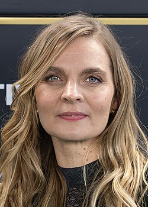

# Hildur Guðnadóttir

## Biografía

Hildur Ingveldardóttir Guðnadóttir (Reykjavik, 4 de septiembre de 1982) es una compositora y chelista islandesa. En 2020 ganó un Globo de Oro, un Premio de la Crítica Cinematográfica, un Premio BAFTA y un Premio Oscar por Mejor Banda Sonora en la película Joker.

## Estilo musical

Hildur Guðnadóttir, ganadora del Premio de la Academia, es una compositora, violonchelista y cantante islandesa que se ha manifestado a la vanguardia del pop experimental y la música contemporánea. En sus trabajos en solitario, extrae de su instrumento un amplio espectro de sonidos, que van desde la simplicidad íntima hasta enormes paisajes sonoros. Su trabajo para Cine y Televisión incluye “Sicario: Day of the Soldado”, “Mary Magdalene”, “Tom of Finland”, “Journey’s End” y 20 episodios de la serie de televisión islandesa “Trapped” (transmitida en Amazon Prime).

## Anécdotas y curiosidades

Hildur Ingveldardóttir Guðnadóttir [ a ] ​​(nacido el 4 de septiembre de 1982) es un músico y compositor islandés. Violonchelista de formación clásica, ha tocado y grabado con las bandas Pan Sonic, Throbbing Gristle, Múm y Stórsveit Nix Noltes, y ha realizado giras con Animal Collective y Sunn O))). Ha recibido varios elogios, incluido un Premio de la Academia, dos Premios Grammy y un Premio Primetime Emmy.

## Top 10 bandas sonoras

1. ***Joker (Título en España: Joker)***
    * **Póster:** [link](154_hildur_gu_nad_ttir/posters/poster_joker_2019.jpg)
2. ***Women Talking (Título en España: Ellas hablan)***
    * **Póster:** [link](154_hildur_gu_nad_ttir/posters/poster_women_talking_2022.jpg)
3. ***28 Years Later: The Bone Temple (Título en España: 28 años después: El templo de los huesos)***
    * **Póster:** [link](154_hildur_gu_nad_ttir/posters/poster_28_years_later_the_bone_temple_2026.jpg)
4. ***Sicario: Day of the Soldado (Título en España: Sicario: El día del soldado)***
    * **Póster:** [link](154_hildur_gu_nad_ttir/posters/poster_sicario_day_of_the_soldado_2018.jpg)
5. ***A Haunting in Venice (Título en España: Misterio en Venecia)***
    * **Póster:** [link](154_hildur_gu_nad_ttir/posters/poster_a_haunting_in_venice_2023.jpg)
6. ***Joker: Folie à Deux (Título en España: Joker: Folie à Deux)***
    * **Póster:** [link](154_hildur_gu_nad_ttir/posters/poster_joker_folie_deux_2024.jpg)
7. ***TÁR (Título en España: TÁR)***
    * **Póster:** [link](154_hildur_gu_nad_ttir/posters/poster_t_r_2022.jpg)
8. ***Kapringen (Título en España: Secuestro)***
    * **Póster:** [link](154_hildur_gu_nad_ttir/posters/poster_kapringen_2012.jpg)
9. ***Mary Magdalene (Título en España: María Magdalena)***
    * **Póster:** [link](154_hildur_gu_nad_ttir/posters/poster_mary_magdalene_2018.jpg)
10. ***Journey's End (Título en España: Senderos de Honor)***
    * **Póster:** [link](154_hildur_gu_nad_ttir/posters/poster_journey_s_end_2017.jpg)

## Filmografía completa

- Astro - Uma Fábula Urbana em um Rio de Janeiro Mágico (Título en España: Astro - Uma Fábula Urbana em um Rio de Janeiro Mágico) (2012) · [Póster](154_hildur_gu_nad_ttir/posters/poster_astro_uma_f_bula_urbana_em_um_rio_de_janeiro_m_gico_2012.jpg)
- Kapringen (Título en España: Secuestro) (2012) · [Póster](154_hildur_gu_nad_ttir/posters/poster_kapringen_2012.jpg)
- Jîn (Título en España: Jîn) (2013) · [Póster](154_hildur_gu_nad_ttir/posters/poster_j_n_2013.jpg)
- End of Summer (Título en España: End of Summer) (2014) · [Póster](154_hildur_gu_nad_ttir/posters/poster_end_of_summer_2014.jpg)
- Kathedralen (Título en España: Kathedralen) (2014) · [Póster](154_hildur_gu_nad_ttir/posters/poster_kathedralen_2014.jpg)
- Eiðurinn (Título en España: Medidas extremas) (2016) · [Póster](154_hildur_gu_nad_ttir/posters/poster_ei_urinn_2016.jpg)
- Journey's End (Título en España: Senderos de Honor) (2017) · [Póster](154_hildur_gu_nad_ttir/posters/poster_journey_s_end_2017.jpg)
- Strong Island (Título en España: Strong Island) (2017) · [Póster](154_hildur_gu_nad_ttir/posters/poster_strong_island_2017.jpg)
- Tom of Finland (Título en España: Tom of Finland) (2017) · [Póster](154_hildur_gu_nad_ttir/posters/poster_tom_of_finland_2017.jpg)
- Mary Magdalene (Título en España: María Magdalena) (2018) · [Póster](154_hildur_gu_nad_ttir/posters/poster_mary_magdalene_2018.jpg)
- Sicario: Day of the Soldado (Título en España: Sicario: El día del soldado) (2018) · [Póster](154_hildur_gu_nad_ttir/posters/poster_sicario_day_of_the_soldado_2018.jpg)
- Joker (Título en España: Joker) (2019) · [Póster](154_hildur_gu_nad_ttir/posters/poster_joker_2019.jpg)
- Women Talking (Título en España: Ellas hablan) (2022) · [Póster](154_hildur_gu_nad_ttir/posters/poster_women_talking_2022.jpg)
- TÁR (Título en España: TÁR) (2022) · [Póster](154_hildur_gu_nad_ttir/posters/poster_t_r_2022.jpg)
- A Haunting in Venice (Título en España: Misterio en Venecia) (2023) · [Póster](154_hildur_gu_nad_ttir/posters/poster_a_haunting_in_venice_2023.jpg)
- The Fundraiser (Título en España: The Fundraiser) (2023) · [Póster](154_hildur_gu_nad_ttir/posters/poster_the_fundraiser_2023.jpg)
- Joker: Folie à Deux (Título en España: Joker: Folie à Deux) (2024) · [Póster](154_hildur_gu_nad_ttir/posters/poster_joker_folie_deux_2024.jpg)
- Utan ord – i filmmusikens värld (Título en España: Utan ord – i filmmusikens värld) (2024) · [Póster](154_hildur_gu_nad_ttir/posters/poster_utan_ord_i_filmmusikens_v_rld_2024.jpg)
- Hedda (Título en España: Hedda) (2025) · [Póster](154_hildur_gu_nad_ttir/posters/poster_hedda_2025.jpg)
- 28 Years Later: The Bone Temple (Título en España: 28 años después: El templo de los huesos) (2026) · [Póster](154_hildur_gu_nad_ttir/posters/poster_28_years_later_the_bone_temple_2026.jpg)
- Bez końca (Título en España: Bez końca) (2026) · [Póster](154_hildur_gu_nad_ttir/posters/poster_bez_ko_ca_2026.jpg)
- The Bride! (Título en España: ¡La novia!) (2026) · [Póster](154_hildur_gu_nad_ttir/posters/poster_the_bride_2026.jpg)

## Premios y nominaciones

* 2019 – Premio Primetime Emmy a la mejor composición musical para una miniserie, película o especial – por *Chernobyl (Título en España: Chernobyl)* – (Ganador)
* 2019 – Premio Satellite a la mejor banda sonora original – por *Joker (Título en España: Joker)* – (Ganador)
* 2020 – Premio BAFTA a la mejor música original – por *Joker (Título en España: Joker)* – (Ganador)
* 2020 – Premio Globo de Oro a la mejor banda sonora original – por *Joker (Título en España: Joker)* – (Ganador)
* 2020 – Premio Grammy a la mejor banda sonora para medios visuales – por *Chernobyl (Título en España: Chernobyl)* – (Ganador)
* 2020 – Premio de la Academia a la mejor banda sonora original – por *Joker (Título en España: Joker)* – (Ganador)
* 2021 – Premio Grammy a la mejor banda sonora para medios visuales – por *Joker (Título en España: Joker)* – (Ganador)
* 2023 – Premio Globo de Oro a la mejor banda sonora original – por *Women Talking (Título en España: Ellas hablan)* – (Nominación)

## Fuentes adicionales

* [MundoBSO](https://www.mundobso.com/compositor/guonadottir-hildur) — site:mundobso.com
* [MundoBSO (2)](https://w.mundobso.com/bso/cartero-siempre-llama-dos-veces-el) — site:mundobso.com
* [MundoBSO (3)](https://www.mundobso.com/bso/frozen-el-reino-del-hielo) — site:mundobso.com
* [Film Score Monthly](https://filmscoremonthly.com/board/threads.cfm?forumID=1) — site:filmscoremonthly.com
* [Film Score Monthly (2)](https://www.filmscoremonthly.com/board/posts.cfm?threadID=156414) — site:filmscoremonthly.com
* [Film Score Monthly (3)](https://www.filmscoremonthly.com/daily/article.cfm/articleID/7756/Film-Score-Friday-11020/) — site:filmscoremonthly.com
* [SoundtrackCollector](https://www.soundtrackcollector.com) — site:soundtrackcollector.com
* [SoundtrackCollector (2)](https://soundtrackcollector.com) — site:soundtrackcollector.com
* [SoundtrackCollector (3)](https://www.soundtrackcollector.com/catalog/soundtrackreviews.php?movieid=2787) — site:soundtrackcollector.com
* [WhatSong](https://www.whatsong.org/tvshow/how-i-met-your-mother/episode/44483) — site:whatsong.org
* [WhatSong (2)](https://www.whatsong.org/tvshow/grown-ish/episode/82123) — site:whatsong.org
* [WhatSong (3)](https://www.whatsong.org/tvshow/prison-break/episode/37396) — site:whatsong.org

## Notas externas

* MundoBSO: Nació en Reykjavik (Islandia), el 4 de septiembre de 1982. Compositora y violoncelista islandesa que ha colaborado con varios grupos musicales y que cuenta con algunas colaboraciones importantes en el medio audiovisual. Nació en Reykjavik (Islandia), el 4 de septiembre de 1982. Compositora y violoncelista islandesa que ha colaborado con varios grupos musicales y que cuenta con algunas colaboraciones importantes en el medio audiovisual.
* MundoBSO (3): Compositores: Beck, Christophe | Lopez, Robert Sello: Disney Duración: 98 minutos Título original: Frozen Director: Chris Buck, Jennifer Lee Nacionalidad: EE UU Año: 2013
* SoundtrackCollector: 14 de enero - Confesión de un comisionado de policía de Riz Ortolani a la fiscalía 3 de diciembre - Wolf Hall de Debbie Wiseman: El espejo y la luz
* WhatSong: Lily y Robin bailan con los dos nerds del último año de secundaria. Se reproduce de fondo cuando Lilly, Robin y Barney intentan entrar a la fiesta. La canción es una canción que está incluida en iMovie.
* WhatSong (2): Luca está pensando en él y en el encuentro sexual de Zoey de la noche anterior. Luca está estresado por su "yo". Texto a Zoey y su falta de respuesta.
* WhatSong (3): Ramin Djawadi - Prison Break: Temporadas 3 y 4 (Banda sonora original de televisión) Ramin Djawadi - Prison Break: Temporadas 3 y 4 (Banda sonora original de televisión)
* www.icelandair.com: Hay una cosa en ser compositora islandesa en el mundo de la música que le gusta a Hildur Guðnadóttir: por sus orígenes, no se adhiere a ninguna jerarquía. Al crecer en Islandia, Hildur aprendió que hacer música es un proyecto comunitario donde todos son iguales y todos se ayudan unos a otros. Ahora que está en la cima de su carrera (ganadora de un Oscar y un Globo de Oro por su banda sonora de 'Joker', un Emmy y un Grammy por la miniserie de televisión 'Chernobyl'), Hildur sigue creyendo en esta filosofía. Se trata de la música y la gente con la que la haces, y nada más. Todos los demás elementos son sólo ruido que debe ignorarse.
* www.hildurness.com: Hildur Guðnadóttir, ganadora del Premio de la Academia, es una compositora, violonchelista y cantante islandesa que se ha manifestado a la vanguardia del pop experimental y la música contemporánea. En sus trabajos en solitario, extrae de su instrumento un amplio espectro de sonidos, que van desde la simplicidad íntima hasta enormes paisajes sonoros. Su trabajo para Cine y Televisión incluye “Sicario: Day of the Soldado”, “Mary Magdalene”, “Tom of Finland”, “Journey’s End” y 20 episodios de la serie de televisión islandesa “Trapped” (transmitida en Amazon Prime). Además, su obra incluye bandas sonoras para películas como “Joker”, protagonizada por Joaquin Phoenix, por la que ganó un Globo de Oro a la Mejor Banda Sonora Original y un Oscar...
* music.apple.com: 28 años después: The Bone Temple (banda sonora original de la película) The Bone Temple 28 años después: The Bone Temple (banda sonora original de la película)â·â2026
* www.thenation.com: Hildur Guðnadóttir en los Globos de Oro. (Foto de Kevin Winter/Getty Images) Pocos insultos golpean tan fuerte a un compositor serio como decir que una obra “suena a música de película” o, peor aún, a “música ambiental”. La función de fondo de la banda sonora de una película ha estigmatizado el género como algo insustancial y propenso al cliché desde los días en que los pianistas tintineaban mientras las películas mudas parpadeaban en las primeras salas de cine. La música ambiental se afianzó como género con la introducción de los discos de larga duración, cuando los álbumes de cuerdas exuberantes y sonidos exóticos falsos de schlocksters como Les Baxter se presentaron como lubricantes auditivos para el sexo de soltero, y las variaciones contemporáneas de la forma...
* music.apple.com: 28 años después: The Bone Temple (banda sonora original de la película) Bathroom Dance Joker (banda sonora original de la película)â·â2019
* composer.spitfireaudio.com: En 2017, tuvimos la suerte de entrevistar a la ganadora del Premio de la Academia, Hildur Guðnadóttir. Hildur habla sobre su experiencia en la música, cómo aprendió a tocar el violonchelo, cómo llegó a trabajar en The Revenant y su relación con el compositor Jóhann Jóhannsson. Hildur, que actualmente reside en Berlín, es originaria de Islandia y es una consumada violonchelista, compositora y cantante.
