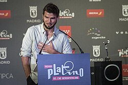

# Lucas Vidal

## Biografía

Lucas Vidal (Madrid, 6 de marzo de 1984) es un compositor español. Ha ganado dos Premios Goya, y ha hecho bandas sonoras de películas y de series. ​

## Estilo musical

2 Obra musical Alternar subsección Obra musical 2.1 Cine 2.2 Series

Nació en Madrid (España), el 6 de marzo de 1984. Licenciado en música para cine y composición en la Berklee College of Music de Boston. Ha realizado colaboraciones para el Boston Ballet y el Providence Ballet. Nació en Madrid (España), el 6 de marzo de 1984. Licenciado en música para cine y composición en la Berklee College of Music de Boston. Ha realizado colaboraciones para el Boston Ballet y el Providence Ballet.

## Anécdotas y curiosidades

Lucas Vidal nació en Madrid en 1984 en una familia muy unida a la música. Su abuelo paterno, José Manuel Vidal Zapater fue el fundador de la compañía discográfica Hispavox en 1953. De su familia materna le viene su relación con el ballet (su prima Zenaida Yanowsky fue primera bailarina del Royal Ballet y su primo Yury Yanowsky del Boston Ballet ). [ 1 ] ​

## Top 10 bandas sonoras

1. ***Vanishing on 7th Street (Título en España: Desaparición en la calle 7)***
    * **Póster:** [link](157_lucas_vidal/posters/poster_vanishing_on_7th_street_2010.jpg)
2. ***The Cold Light of Day (Título en España: La fría luz del día)***
    * **Póster:** [link](157_lucas_vidal/posters/poster_the_cold_light_of_day_2012.jpg)
3. ***The Raven (Título en España: El enigma del cuervo)***
    * **Póster:** [link](157_lucas_vidal/posters/poster_the_raven_2012.jpg)
4. ***Fast & Furious 6 (Título en España: Fast & Furious 6)***
    * **Póster:** [link](157_lucas_vidal/posters/poster_fast_furious_6_2013.jpg)
5. ***Anna (Título en España: Mindscape)***
    * **Póster:** [link](157_lucas_vidal/posters/poster_anna_2013.jpg)
6. ***The Quiet Ones (Título en España: El estigma del mal)***
    * **Póster:** [link](157_lucas_vidal/posters/poster_the_quiet_ones_2014.jpg)

## Filmografía completa

- La isla interior (Título en España: La isla interior) (2009) · [Póster](157_lucas_vidal/posters/poster_la_isla_interior_2009.jpg)
- Vanishing on 7th Street (Título en España: Desaparición en la calle 7) (2010) · [Póster](157_lucas_vidal/posters/poster_vanishing_on_7th_street_2010.jpg)
- Mientras duermes (Título en España: Mientras duermes) (2011) · [Póster](157_lucas_vidal/posters/poster_mientras_duermes_2011.jpg)
- The Raven (Título en España: El enigma del cuervo) (2012) · [Póster](157_lucas_vidal/posters/poster_the_raven_2012.jpg)
- Invasor (Título en España: Invasor) (2012) · [Póster](157_lucas_vidal/posters/poster_invasor_2012.jpg)
- The Cold Light of Day (Título en España: La fría luz del día) (2012) · [Póster](157_lucas_vidal/posters/poster_the_cold_light_of_day_2012.jpg)
- Fast & Furious 6 (Título en España: Fast & Furious 6) (2013) · [Póster](157_lucas_vidal/posters/poster_fast_furious_6_2013.jpg)
- Anna (Título en España: Mindscape) (2013) · [Póster](157_lucas_vidal/posters/poster_anna_2013.jpg)
- The Quiet Ones (Título en España: El estigma del mal) (2014) · [Póster](157_lucas_vidal/posters/poster_the_quiet_ones_2014.jpg)
- Kidnapping Mr. Heineken (Título en España: El caso Heineken) (2015) · [Póster](157_lucas_vidal/posters/poster_kidnapping_mr_heineken_2015.jpg)
- Nadie quiere la noche (Título en España: Nadie quiere la noche) (2015) · [Póster](157_lucas_vidal/posters/poster_nadie_quiere_la_noche_2015.jpg)
- Palmeras en la nieve (Título en España: Palmeras en la nieve) (2015) · [Póster](157_lucas_vidal/posters/poster_palmeras_en_la_nieve_2015.jpg)
- Tracers (Título en España: Tracers) (2015) · [Póster](157_lucas_vidal/posters/poster_tracers_2015.jpg)
- Alegría, tristeza (Título en España: Alegría, tristeza) (2018) · [Póster](157_lucas_vidal/posters/poster_alegr_a_tristeza_2018.jpg)
- El árbol de la sangre (Título en España: El árbol de la sangre) (2018) · [Póster](157_lucas_vidal/posters/poster_el_rbol_de_la_sangre_2018.jpg)
- Paradise Hills (Título en España: Paradise Hills) (2019) · [Póster](157_lucas_vidal/posters/poster_paradise_hills_2019.jpg)
- Salir del ropero (Título en España: Salir del ropero) (2020) · [Póster](157_lucas_vidal/posters/poster_salir_del_ropero_2020.jpg)
- 8 (Título en España: 8) (2025) · [Póster](157_lucas_vidal/posters/poster_8_2025.jpg)
- Aída y vuelta (Título en España: Aída y vuelta) (2026) · [Póster](157_lucas_vidal/posters/poster_a_da_y_vuelta_2026.jpg)
- A una isla de ti (Título en España: A una isla de ti) · [Póster](https://example.com/placeholder.jpg)

## Premios y nominaciones

* Emmy – por *the best original music.* – (Nominación)

## Fuentes adicionales

* [MundoBSO](https://www.mundobso.com/compositor/vidal-lucas) — site:mundobso.com
* [MundoBSO (2)](https://w.mundobso.com/bso/cartero-siempre-llama-dos-veces-el) — site:mundobso.com
* [MundoBSO (3)](https://www.mundobso.com/bso/milla-verde-la) — site:mundobso.com
* [Film Score Monthly](https://www.filmscoremonthly.com/daily/article.cfm/articleID/7078/) — site:filmscoremonthly.com
* [Film Score Monthly (2)](https://www.filmscoremonthly.com/board/searchResults.cfm?forumID=0&pageID=176&showThreads=10&searchtarget=threads&frmKeywords=idm+6.42+build+32%2C+taiwebs) — site:filmscoremonthly.com
* [Film Score Monthly (3)](https://www.filmscoremonthly.com/board/posts.cfm?forumID=7&pageID=30&threadID=38365&archive=0) — site:filmscoremonthly.com
* [SoundtrackCollector](https://soundtrackcollector.com) — site:soundtrackcollector.com
* [SoundtrackCollector (2)](https://www.soundtrackcollector.com/title/101089/Fast+&+Furious+6) — site:soundtrackcollector.com
* [SoundtrackCollector (3)](https://www.soundtrackcollector.com/forum/displayquestion.php?topicid=1232) — site:soundtrackcollector.com
* [WhatSong](https://www.whatsong.org/tvshow/how-i-met-your-mother/episode/44483) — site:whatsong.org
* [WhatSong (2)](https://www.whatsong.org/tvshow/good-witch/episode/88626) — site:whatsong.org
* [WhatSong (3)](https://www.whatsong.org/tvshow/9-1-1/episode/71629) — site:whatsong.org

## Notas externas

* MundoBSO: Nació en Madrid (España), el 6 de marzo de 1984. Licenciado en música para cine y composición en la Berklee College of Music de Boston. Ha realizado colaboraciones para el Boston Ballet y el Providence Ballet. Nació en Madrid (España), el 6 de marzo de 1984. Licenciado en música para cine y composición en la Berklee College of Music de Boston. Ha realizado colaboraciones para el Boston Ballet y el Providence Ballet.
* MundoBSO (3): Compositor: Newman, Thomas Sello: Warner Duración: 66 minutos Información de la película Título original: The Green Mile Director: Frank Darabont Nacionalidad: EE UU Año: 1999 Argumento A mediados de los años treinta, un guarda de prisiones que custodia a los condenados a muerte descubre poderes sobrenaturales en un inmenso hombre negro, acusado de haber asesinado a dos niñas. Eso le llevará a creer en su inocencia. Premios Saturn: 1 nominación Compositor: Newman, Thomas Sello: Warner Duración: 66 minutos
* WhatSong: Lily y Robin bailan con los dos nerds del último año de secundaria. Se reproduce de fondo cuando Lilly, Robin y Barney intentan entrar a la fiesta. La canción es una canción que está incluida en iMovie.
* WhatSong (2): La mejor fuente en línea de música de películas y televisión. Copyright © 2018 - 2026 Whatsong.org. Reservados todos los derechos.
* WhatSong (3): Talking Heads - Favoritos populares 1976-1992: Sand In the Vaseline The Naked and Famous - Passive Me, Aggressive You (Remixes y caras B)
* grupobcc.com: Lucas Vidal es uno de los compositores españoles con mayor reconocimiento internacional. Su trayectoria profesional le ha valido reconocimiento en todo el mundo, entre el público y la crítica musical, además de varios premios, como dos Goya y un premio Emmy. Lucas Vidal nació en Madrid en 1984 en el seno de una familia muy cercana a la música. Su abuelo paterno, José Manuel Vidal Zapater, fue el fundador de la discográfica Hispavox en 1953, en la que grababan artistas de la época. De su familia materna viene su relación con el ballet. Estos fundamentos le dieron a Lucas la pasión por la música desde muy joven.
* music.apple.com: No por mucho tiempo 8CHO (Banda Sonora Original) · 2025 Y te veo otra vez 8CHO (Banda Sonora Original) · 2025
* music.apple.com: No por mucho tiempo 8CHO (Banda Sonora Original) · 2025 Y te veo otra vez 8CHO (Banda Sonora Original) · 2025
* www.lucasvidal.com: En los últimos años, Lucas ha desarrollado un importante papel como productor musical de grandes proyectos (Himno de LaLiga, Himno de Iberoamérica, Identidad Sonora de Telefónica y Movistar, Juegos Olímpicos de 2016, compositor de la Zarzuela “Trato de Favor”, con libreto de Boris Izaguirre), artistas (System of a Down, Raphael, Antonio Orozco, Israel Fernández, Sara Baras), y ha compuesto música para algunas de las series más vistas en plataformas audiovisuales como Netflix, Apple+ y Movistar (Élite, Celeste, Bienvenidos al Edén, Sagrada Familia, El Inmortal, Las Azules, Ni una más). Como director de orquesta ha dirigido en múltiples ocasiones en el Teatro Real (Centenario de Disney, Gala Telefónica, Homenaje a John...
* lucasvidal.com: En los últimos años, Lucas ha desarrollado un importante papel como productor musical de grandes proyectos (Himno de LaLiga, Himno de Iberoamérica, Identidad Sonora de Telefónica y Movistar, Juegos Olímpicos de 2016, compositor de la Zarzuela “Trato de Favor”, con libreto de Boris Izaguirre), artistas (System of a Down, Raphael, Antonio Orozco, Israel Fernández, Sara Baras), y ha compuesto música para algunas de las series más vistas en plataformas audiovisuales como Netflix, Apple+ y Movistar (Élite, Celeste, Bienvenidos al Edén, Sagrada Familia, El Inmortal, Las Azules, Ni una más). Como director de orquesta ha dirigido en múltiples ocasiones en el Teatro Real (Centenario de Disney, Gala Telefónica, Homenaje a John...
* music.apple.com: No por mucho tiempo 8CHO (Banda Sonora Original) · 2025 Y te veo otra vez 8CHO (Banda Sonora Original) · 2025
* www.lucasvidal.com: En los últimos años, Lucas ha desarrollado un papel importante como productor musical para grandes proyectos (LaLiga Anthem, Iberoamérica Anthem, Sound Identity de Telefónica y Movistar, Juegos Olímpicos de 2016, compositor de la zarzuela «Trato de favor», con libreto de Boris Izaguirre), artistas (System of a Down, Raphael, Antonio Orozco, Israel Fernández, Sara Baras) y ha compuesto música para algunos de los más vistos series en plataformas audiovisuales como Netflix, Apple+ y Movistar (Elite, Celeste, Bienvenidos al Edén, Sagrada Familia, El Inmortal, Las Azules, Ni una más ). Como director, ha dirigido en múltiples ocasiones en el Teatro Real (Disney Centennial, Telefónica Gala,...
