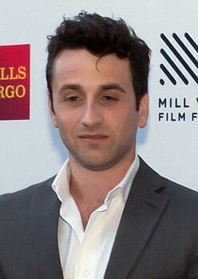

# Justin Hurwitz

## Biografía

Justin Hurwitz (Condado de Los Ángeles, California, 22 de enero de 1985) es un compositor y guionista estadounidense, conocido por sus colaboraciones con el guionista y director Damien Chazelle en las películas Whiplash (2014) y La La Land (2016).​​​ Hurwitz y Chazelle se conocieron como estudiantes universitarios en la Universidad de Harvard donde tocaban habitualmente en una misma banda y se convirtieron en compañeros de habitación.​ Hurwitz asistió a la Nicolet High School en Glendale, Wisconsin.​

## Estilo musical

3 Filmografía Alternar subsección Filmografía 3.1 Películas 3.2 Televisión 3.3 Musicales

La mejor fuente en línea de música de películas y televisión. Copyright © 2018 - 2026 Whatsong.org. Reservados todos los derechos.

## Anécdotas y curiosidades

Justin Hurwitz (nacido el 22 de enero de 1985) [1] es un compositor de cine y guionista de televisión estadounidense. Es mejor conocido por su larga amistad y colaboración con el director Damien Chazelle, musicalizando cada una de sus películas: Guy and Madeline on a Park Bench (2009), Whiplash (2014), La La Land (2016), First Man (2018) y Babylon (2022).

## Top 10 bandas sonoras

1. ***La La Land (Título en España: La ciudad de las estrellas (La La Land))***
    * **Póster:** [link](158_justin_hurwitz/posters/poster_la_la_land_2016.jpg)
2. ***Babylon (Título en España: Babylon)***
    * **Póster:** [link](158_justin_hurwitz/posters/poster_babylon_2022.jpg)
3. ***Whiplash (Título en España: Whiplash)***
    * **Póster:** [link](158_justin_hurwitz/posters/poster_whiplash_2014.jpg)
4. ***First Man (Título en España: First Man (El primer hombre))***
    * **Póster:** [link](158_justin_hurwitz/posters/poster_first_man_2018.jpg)
5. ***Guy and Madeline on a Park Bench (Título en España: Guy and Madeline on a Park Bench)***
    * **Póster:** [link](158_justin_hurwitz/posters/poster_guy_and_madeline_on_a_park_bench_2010.jpg)
6. ***La La La (Título en España: La, la, la: La historia del musical)***
    * **Póster:** [link](158_justin_hurwitz/posters/poster_la_la_la_2018.jpg)
7. ***Life Is the Greatest Odyssey (Título en España: Life Is the Greatest Odyssey)***
    * **Póster:** [link](158_justin_hurwitz/posters/poster_life_is_the_greatest_odyssey_2023.jpg)
8. ***A Panoramic Canvas Called Babylon (Título en España: A Panoramic Canvas Called Babylon)***
    * **Póster:** [link](158_justin_hurwitz/posters/poster_a_panoramic_canvas_called_babylon_2023.jpg)
9. ***Piano Cinéma (Título en España: Piano Cinéma)***
    * **Póster:** [link](158_justin_hurwitz/posters/poster_piano_cin_ma_2022.jpg)
10. ***Amazing Grace (Título en España: Amazing Grace)***
    * **Póster:** [link](158_justin_hurwitz/posters/poster_amazing_grace_2020.jpg)

## Filmografía completa

- Guy and Madeline on a Park Bench (Título en España: Guy and Madeline on a Park Bench) (2010) · [Póster](158_justin_hurwitz/posters/poster_guy_and_madeline_on_a_park_bench_2010.jpg)
- Whiplash (Título en España: Whiplash) (2014) · [Póster](158_justin_hurwitz/posters/poster_whiplash_2014.jpg)
- La La Land (Título en España: La ciudad de las estrellas (La La Land)) (2016) · [Póster](158_justin_hurwitz/posters/poster_la_la_land_2016.jpg)
- First Man (Título en España: First Man (El primer hombre)) (2018) · [Póster](158_justin_hurwitz/posters/poster_first_man_2018.jpg)
- La La La (Título en España: La, la, la: La historia del musical) (2018) · [Póster](158_justin_hurwitz/posters/poster_la_la_la_2018.jpg)
- Amazing Grace (Título en España: Amazing Grace) (2020) · [Póster](158_justin_hurwitz/posters/poster_amazing_grace_2020.jpg)
- Babylon (Título en España: Babylon) (2022) · [Póster](158_justin_hurwitz/posters/poster_babylon_2022.jpg)
- Piano Cinéma (Título en España: Piano Cinéma) (2022) · [Póster](158_justin_hurwitz/posters/poster_piano_cin_ma_2022.jpg)
- A Panoramic Canvas Called Babylon (Título en España: A Panoramic Canvas Called Babylon) (2023) · [Póster](158_justin_hurwitz/posters/poster_a_panoramic_canvas_called_babylon_2023.jpg)
- Life Is the Greatest Odyssey (Título en España: Life Is the Greatest Odyssey) (2023) · [Póster](158_justin_hurwitz/posters/poster_life_is_the_greatest_odyssey_2023.jpg)
- Untitled Prison Film (Título en España: Untitled Prison Film) · [Póster](158_justin_hurwitz/posters/poster_untitled_prison_film.jpg)

## Premios y nominaciones

* 2017 – Premio de la Academia a la mejor banda sonora original – por *La La Land (Título en España: La ciudad de las estrellas (La La Land))* – (Ganador)
* 2017 – Premio de la Academia a la mejor banda sonora original – por *La La Land (Título en España: La ciudad de las estrellas (La La Land))* – (Nominación)
* 2017 – Premio de la Academia a la mejor canción original – por *Audition (The Fools Who Dream)* – (Nominación)
* 2023 – Premio Globo de Oro a la mejor banda sonora original – por *Babylon (Título en España: Babylon)* – (Ganador)
* 2023 – Premio de la Academia a la mejor banda sonora original – por *Babylon (Título en España: Babylon)* – (Nominación)

## Fuentes adicionales

* [MundoBSO](https://www.mundobso.com/bso/whiplash) — site:mundobso.com
* [MundoBSO (2)](https://www.mundobso.com/compositor/hurwitz-justin) — site:mundobso.com
* [MundoBSO (3)](https://www.mundobso.com/bso/babylon-justin-hurwitz) — site:mundobso.com
* [Film Score Monthly](https://www.filmscoremonthly.com/board/posts.cfm?forumID=1&threadID=117975) — site:filmscoremonthly.com
* [Film Score Monthly (2)](https://filmscoremonthly.com/board/posts.cfm?forumID=1&pageID=3&threadID=130133&archive=0) — site:filmscoremonthly.com
* [Film Score Monthly (3)](https://www.filmscoremonthly.com/daily/article.cfm/articleID/8130/Film-Score-Friday-72123/) — site:filmscoremonthly.com
* [SoundtrackCollector](https://www.soundtrackcollector.com) — site:soundtrackcollector.com
* [SoundtrackCollector (2)](https://soundtrackcollector.com) — site:soundtrackcollector.com
* [SoundtrackCollector (3)](https://www.soundtrackcollector.com/title/105570/Whiplash) — site:soundtrackcollector.com
* [WhatSong](https://www.whatsong.org/movie/whiplash) — site:whatsong.org
* [WhatSong (2)](https://www.whatsong.org) — site:whatsong.org
* [WhatSong (3)](https://www.whatsong.org/tvshow/how-i-met-your-mother/episode/44483) — site:whatsong.org

## Notas externas

* MundoBSO: Compositores: Hurwitz, Justin | Simonec, Tim Sello: Varèse Sarabande Duración: 55 minutos Título original: Whiplash Director: Damien Chazelle Nacionalidad: EE UU Año: 2014
* MundoBSO (2): Nació en Los Ángeles, California (EE UU), el 22 de enero de 1985. Compositor y guionista conocido por sus colaboraciones con el guionista y director Damien Chazelle. Nació en Los Ángeles, California (EE UU), el 22 de enero de 1985. Compositor y guionista conocido por sus colaboraciones con el guionista y director Damien Chazelle.
* MundoBSO (3): Compositor: Hurwitz, Justin Sello: Interscope Duración: 97 minutos Información de la película Título original: Babylon Director: Damien Chazelle Nacionalidad: EE UU Año: 2022 Argumento Ambientada en Los Angeles durante los años veinte, cuenta una historia de ambición y excesos desmesurados que recorre la ascensión y caída de múltiples personajes durante una época de desenfrenada decadencia y depravación en los albores de Hollywood. Premios MundoBSO: 1 nominación Oscar: 1 nominación Globos de oro: 1 premio Bafta: 1 nominación IFMCA: 1 nominación Satellite: 1 premio Compositor: Hurwitz, Justin Sello: Interscope Duración: 97 minutos
* SoundtrackCollector: 14 de enero - Confesión de un comisionado de policía de Riz Ortolani a la fiscalía 3 de diciembre - Wolf Hall de Debbie Wiseman: El espejo y la luz
* WhatSong: J.K. Simmons - Whiplash (Banda sonora original de la película) Justin Hurwitz - Whiplash (Banda sonora original de la película)
* WhatSong (2): La mejor fuente en línea de música de películas y televisión. Copyright © 2018 - 2026 Whatsong.org. Reservados todos los derechos.
* WhatSong (3): Lily y Robin bailan con los dos nerds del último año de secundaria. Se reproduce de fondo cuando Lilly, Robin y Barney intentan entrar a la fiesta. La canción es una canción que está incluida en iMovie.
* composer.spitfireaudio.com: Con Babylon, una película que sigue el ascenso y la caída de múltiples personajes en el Hollywood de los años 20, el compositor ganador del Oscar regresa para su quinta colaboración con Damien Chazelle. La partitura coincide con la ambición de la película a la que está poniendo banda sonora, exigiendo que Hurwitz adapte su proceso habitual para encontrar los instrumentos y los músicos adecuados, ya sean de YouTube o Britain's Got Talent. Es esa atención al detalle lo que ha llevado a temas como 'Voodoo Mama', un tema pegadizo que hace sonar los dedos de los pies y que se ha repetido desde que mis oídos sintieron una serenata por primera vez. Fácilmente podría haber pasado toda mi conversación con Hurwitz hablando solo de esa canción, pero también cubrimos la suya...
* www.rottentomatoes.com: -- The Great American Baking Show: Celebrity Big Game: Temporada 2 80% Bridgerton: Temporada 4 Enlace a Bridgerton: Temporada 4
* es.laphil.com: Iniciar sesión Mi Cuenta Mis Pedidos Datos de mi cuenta Cerrar sesión Visita Cómo Llegar Estando Aquí Guía del lugar Boletos digitales Preguntas Frecuentes
* www.motionpictures.org: Acerca de Misión Personal Historia Alcance internacional Carreras Oportunidades profesionales Beca de leyes y políticas de entretenimiento de MPA Contáctenos Carreras Oportunidades profesionales Beca de leyes y políticas de entretenimiento de MPA
* music.apple.com: Tema de Mia & Sebastian La La Land (Banda Sonora Original de la Película)â·â2016 La La Land (Banda Sonora Original de la Película)â·â2016
