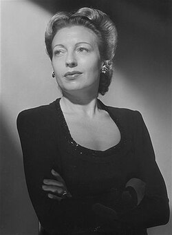

# Germaine Franco

## Biografía

Germaine Montero (Germaine Heygel) (París, 22 de octubre de 1909; Saint-Romain-en-Viennois, 29 de junio de 2000) fue una actriz y cantante francesa.Nació en el barrio de Montmartre, su padre la envió a Valladolid a perfeccionar su castellano. Allí conoció a Federico García Lorca, de quien fue intérprete extraordinaria, realizando giras con su elenco. Tras el golpe de Estado dado por Francisco Franco, cambió su nombre por Montero retornando a París en 1938 para actuar en la obra Fuenteovejuna, y en 1939 interpretó Bodas de sangre también en París, la primera vez que la obra de Federico García Lorca era interpretado fuera de España. También conocida como cantante de canciones españolas, flamenco y de chanson francesa, durante la ocupación nazi dio refugio al compositor Joseph Kosma y cantó con Jacques Prévert. Su posición antibélica la forzó a emigrar a Suiza, donde conoció al que sería su marido, Mario Bertschy. Con el actor Gerard Philipe fue pionera en el Theatre National Populaire (TPN) de Jean Vilar en el Festival de Aviñón, donde hizo una recordada Madre Coraje y sus hijos de Bertolt Brecht. Después de la guerra se convirtió en una importante figura de cabaret; Jean Renoir, Jean Anouilh, Pierre MacOrlan, Prevert y Boris Vian compusieron y arreglaron canciones de Kurt Weill para ella. "Le Cauchemar du chauffeur de taxi", "La Peche a la baleine", "Les Feuilles mortes" y "Barbara" fueron sus más celebradas.

## Estilo musical

Germaine Franco es una compositora, directora, compositora, arreglista, productora discográfica y percusionista estadounidense. Es una compositora ganadora de un Grammy y nominada al Oscar. Su extenso currículum, junto con su curiosidad e inventiva, la han convertido en una pionera. Franco fue la primera latina en ganar un Grammy a la Mejor Banda Sonora para Medios Visuales con su música para Encanto (2021), [ 1 ] y la primera en recibir el Premio Annie por Logros Destacados por Música en una Película Animada con Coco en 2018. Además, Encanto recibió una nominación al Premio de la Academia a la Mejor Música Original, un Premio SCL a la Mejor Música Original para una Película de Estudio, un Premio Annie a la Mejor Música en una Película, un Premio Billboard de Música y un Premio Mundial. Nominación a los premios Soundtrack Awards como Compositor de Cine del Año en 2022. También es la primera latina en ser nominada a un Premio de la Academia a la Mejor Banda Sonora Original, así como la primera en unirse a la rama musical de la Academia. [ 2 ] Recientemente completó su trabajo en el gran éxito de Netflix The Mother, dirigido por Niki Caro. La película es uno de los estrenos más exitosos de Netflix hasta la fecha, ocupando el puesto número 1 en 82 países. [ 3 ]

## Anécdotas y curiosidades

Franco nació en California. [ 8 ] Asistió a la Escuela de Música Shepherd en la Universidad Rice, donde estudió percusión y composición, obteniendo una licenciatura en 1984 y una maestría en 1987. Fue durante este tiempo que comenzó a escribir música además de actuar. [ 9 ]

## Top 10 bandas sonoras

1. ***Encanto (Título en España: Encanto)***
    * **Póster:** [link](162_germaine_franco/posters/poster_encanto_2021.jpg)
2. ***Dope (Título en España: Dope)***
    * **Póster:** [link](162_germaine_franco/posters/poster_dope_2015.jpg)
3. ***Tag (Título en España: ¡Tú la llevas!)***
    * **Póster:** [link](162_germaine_franco/posters/poster_tag_2018.jpg)
4. ***The Mother (Título en España: La madre)***
    * **Póster:** [link](162_germaine_franco/posters/poster_the_mother_2023.jpg)
5. ***Dora and the Lost City of Gold (Título en España: Dora y la ciudad perdida)***
    * **Póster:** [link](162_germaine_franco/posters/poster_dora_and_the_lost_city_of_gold_2019.jpg)
6. ***Work It (Título en España: Work It: Al ritmo de los sueños)***
    * **Póster:** [link](162_germaine_franco/posters/poster_work_it_2020.jpg)
7. ***Someone Great (Título en España: Alguien especial)***
    * **Póster:** [link](162_germaine_franco/posters/poster_someone_great_2019.jpg)
8. ***Little (Título en España: Pequeño gran problema)***
    * **Póster:** [link](162_germaine_franco/posters/poster_little_2019.jpg)
9. ***Curious George: Go West, Go Wild (Título en España: Jorge el curioso: De visita en el salvaje oeste)***
    * **Póster:** [link](162_germaine_franco/posters/poster_curious_george_go_west_go_wild_2020.jpg)
10. ***Walk with Me (Título en España: Camina conmigo)***
    * **Póster:** [link](162_germaine_franco/posters/poster_walk_with_me_2017.jpg)

## Filmografía completa

- Dope (Título en España: Dope) (2015) · [Póster](162_germaine_franco/posters/poster_dope_2015.jpg)
- Walk with Me (Título en España: Camina conmigo) (2017) · [Póster](162_germaine_franco/posters/poster_walk_with_me_2017.jpg)
- Chiefs (Título en España: Chiefs) (2018) · [Póster](162_germaine_franco/posters/poster_chiefs_2018.jpg)
- The Unafraid (Título en España: The Unafraid) (2018) · [Póster](162_germaine_franco/posters/poster_the_unafraid_2018.jpg)
- Tag (Título en España: ¡Tú la llevas!) (2018) · [Póster](162_germaine_franco/posters/poster_tag_2018.jpg)
- Someone Great (Título en España: Alguien especial) (2019) · [Póster](162_germaine_franco/posters/poster_someone_great_2019.jpg)
- Dora and the Lost City of Gold (Título en España: Dora y la ciudad perdida) (2019) · [Póster](162_germaine_franco/posters/poster_dora_and_the_lost_city_of_gold_2019.jpg)
- Little (Título en España: Pequeño gran problema) (2019) · [Póster](162_germaine_franco/posters/poster_little_2019.jpg)
- Curious George: Go West, Go Wild (Título en España: Jorge el curioso: De visita en el salvaje oeste) (2020) · [Póster](162_germaine_franco/posters/poster_curious_george_go_west_go_wild_2020.jpg)
- Work It (Título en España: Work It: Al ritmo de los sueños) (2020) · [Póster](162_germaine_franco/posters/poster_work_it_2020.jpg)
- Encanto (Título en España: Encanto) (2021) · [Póster](162_germaine_franco/posters/poster_encanto_2021.jpg)
- The Mother (Título en España: La madre) (2023) · [Póster](162_germaine_franco/posters/poster_the_mother_2023.jpg)
- Holy Molé (Título en España: Holy Molé) · [Póster](162_germaine_franco/posters/poster_holy_mol.jpg)

## Premios y nominaciones

* 2022 – Premio de la Academia a la mejor banda sonora original – por *Encanto (Título en España: Encanto)* – (Nominación)

## Fuentes adicionales

* [MundoBSO](https://w.mundobso.com/bso/cartero-siempre-llama-dos-veces-el) — site:mundobso.com
* [MundoBSO (2)](https://www.mundobso.com/bso/frozen-el-reino-del-hielo) — site:mundobso.com
* [MundoBSO (3)](https://www.mundobso.com/bso/lobo-y-el-leon-el) — site:mundobso.com
* [Film Score Monthly](https://filmscoremonthly.com/daily/article.cfm/articleID/7957/Film-Score-Friday-112621/) — site:filmscoremonthly.com
* [Film Score Monthly (2)](https://www.filmscoremonthly.com/daily/article.cfm/articleID/7958/Film-Score-Friday-12321/) — site:filmscoremonthly.com
* [Film Score Monthly (3)](https://www.filmscoremonthly.com/fsmonline/free_article.cfm?ID=4685) — site:filmscoremonthly.com
* [SoundtrackCollector](https://www.soundtrackcollector.com) — site:soundtrackcollector.com
* [SoundtrackCollector (2)](https://soundtrackcollector.com) — site:soundtrackcollector.com
* [SoundtrackCollector (3)](https://www.soundtrackcollector.com/catalog/soundtracktopic.php?movieid=76595&topicid=7685) — site:soundtrackcollector.com
* [WhatSong](https://www.whatsong.org/tvshow/how-i-met-your-mother/episode/44483) — site:whatsong.org
* [WhatSong (2)](https://www.whatsong.org/tvshow/prison-break/episode/37396) — site:whatsong.org
* [WhatSong (3)](https://www.whatsong.org/tvshow/grown-ish/episode/82123) — site:whatsong.org

## Notas externas

* MundoBSO (2): Compositores: Beck, Christophe | Lopez, Robert Sello: Disney Duración: 98 minutos Título original: Frozen Director: Chris Buck, Jennifer Lee Nacionalidad: EE UU Año: 2013
* MundoBSO (3): Compositor: Amar, Armand Sello: Long Distance Duración: 54 minutos Información de la película Título original: Le loup et le lion Director: Gilles de Maistre Nacionalidad: Francia Año: 2021 Argumento Una joven regresa a la casa de su infancia en una isla de Canadá. Allí su vida da un vuelco cuando rescata a un cachorro de lobo y a un cachorro de león. A medida que los animales crecen, los tres forman un vínculo inseparable, hasta que son separados. Compositor: Amar, Armand Sello: Long Distance Duración: 54 minutos
* SoundtrackCollector: 14 de enero - Confesión de un comisionado de policía de Riz Ortolani a la fiscalía 3 de diciembre - Wolf Hall de Debbie Wiseman: El espejo y la luz
* WhatSong: Lily y Robin bailan con los dos nerds del último año de secundaria. Se reproduce de fondo cuando Lilly, Robin y Barney intentan entrar a la fiesta. La canción es una canción que está incluida en iMovie.
* WhatSong (2): Ramin Djawadi - Prison Break: Temporadas 3 y 4 (Banda sonora original de televisión) Ramin Djawadi - Prison Break: Temporadas 3 y 4 (Banda sonora original de televisión)
* WhatSong (3): Luca está pensando en él y en el encuentro sexual de Zoey de la noche anterior. Luca está estresado por su "yo". Texto a Zoey y su falta de respuesta.
* www.publico.es: La compositora de raíces mexicanas está nominada a la Mejor banda sonora en la próxima edición de los Premios Oscar, que se celebran este 27 de marzo. Los Ángeles - 24/03/2022 16:30 - Actualizado a 24/03/2022 16:33
* music.apple.com: ¡Hola Casita! Encanto (Banda Sonora Original de la Película)â·â2021 Encanto (Banda Sonora Original de la Película)â·â2021
* www.germainefranco.com: PROYECTOS Largometraje Cine Documental Televisión Interactiva Conciertos PROYECTOS Largometraje Cine Documental Televisión Interactiva Conciertos
* www.germainefranco.com: PROYECTOS Largometraje Cine Documental Televisión Interactiva Conciertos PROYECTOS Largometraje Cine Documental Televisión Interactiva Conciertos
* www.publico.es: La compositora de raíces mexicanas está nominada a la Mejor banda sonora en la próxima edición de los Premios Oscar, que se celebran este 27 de marzo. Los Ángeles - 24/03/2022 16:30 - Actualizado a 24/03/2022 16:33
* goldenglobes.com: The Show Awards Database 2026 Nominaciones Ganadores/Nominados Premio Carol Burnett Premio Cecil B. DeMille Cobertura EN VIVO Cobertura EN VIVO 2024 Cobertura EN VIVO 2025 Cobertura EN VIVO 2026 Cobertura EN VIVO Cobertura EN VIVO 2024 Cobertura EN VIVO 2025 Cobertura EN VIVO 2026
