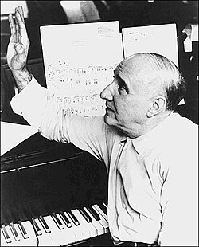

# Dimitri Tiomkin

## País o nacionalidad

Estados Unidos

## Biografía

### Infancia y Formación en Rusia

Dimitri Zinovich Tiomkin nació el 10 de mayo de 1894 en Kremenchuk, una ciudad del Imperio Ruso en lo que hoy es Ucrania. Hijo de Marie Tartakovsky, una profesora de música, y Zinovie Tiomkin, un médico, Dimitri creció en un entorno donde la música era parte cotidiana. Desde pequeño mostró un talento innato, ingresando al Conservatorio de San Petersburgo alrededor de los nueve años, donde estudió piano con maestros como Felix Blumenfeld e Isabelle Vengerova, y composición con Alexander Glazunov, director del conservatorio y mentor de figuras como Prokofiev y Shostakovich. [1]

En San Petersburgo, Tiomkin no solo brilló como pianista solista, sino que también se sumergió en el mundo del cine mudo, acompañando al piano proyecciones de películas rusas para ganarse la vida. La Revolución Bolchevique de 1917 marcó un punto de inflexión: huyó a Berlín para reunirse con su padre, dejando atrás su tierra natal. [2]

### Etapa Europea: De Berlín a Hollywood

En Berlín, entre 1921 y 1923, Tiomkin estudió con el legendario Ferruccio Busoni y sus discípulos Egon Petri y Michael Zadora. Como concertista, debutó con el Segundo Concierto para Piano de Liszt junto a la Filarmónica de Berlín, consolidando su reputación. Compuso música ligera: estudios, foxtrots, marchas y valses, equilibrando lo clásico con lo popular. [3]

Tras un paso por París, donde conoció a Igor Stravinsky, la crisis de 1929 lo llevó a Nueva York con su esposa, la coreógrafa Albertina Rasch. Allí tocaba piano en cines mudos, pero el crack bursátil los empujó a Hollywood en 1929. Albertina supervisó números de baile en MGM, mientras Dimitri empezaba en bandas sonoras menores. [4]

Su primera gran oportunidad llegó en 1931 con *Resurrection* de Universal, el primer drama no musical del estudio. En 1933, Paramount le confió *Alice in Wonderland*, con guión de Joseph L. Mankiewicz, donde compuso banda sonora y canciones. [5]

Un accidente en 1937 le rompió el brazo, acabando con su sueño de ser concertista y enfocándolo en la composición cinematográfica. [6]

### Auge en Hollywood: La Década de Oro

Los años 50 fueron su apogeo: compuso cerca de una banda sonora por mes, siendo el compositor mejor pagado. Entre 1948 y 1958, creó 57 scores, incluyendo nueve en 1952 solo. [7]

Colaboró con directores como Frank Capra en *Lost Horizon* (1937), que reveló su maestría en orquestaciones grandiosas y coros masivos. [8]

Aquí una **cronología clave** de su carrera: [1]

| Año | Obra destacada | Estudio/Nota |
|-----|----------------|--------------|
| 1931 | *Resurrection* | Universal, primer drama no musical |
| 1933 | *Alice in Wonderland* | Paramount, con canciones |
| 1937 | *Lost Horizon* | Nominación Oscar indirecta |
| 1952 | *High Noon* | 2 Oscars (música y canción) |
| 1954 | *The High and the Mighty* | Oscar partitura |
| 1958 | *The Old Man and the Sea* | Oscar partitura |
| 1960 | *The Alamo* | Canción nominada |
| 1970 | *Tchaikovsky* | Productor ejecutivo, nominada Oscar |

### Premios y Legado

Tiomkin acumuló 22 nominaciones al Oscar, ganando 4: dos por *High Noon* (1952, música y canción 'Do Not Forsake Me'), una por *The High and the Mighty* (1954) y otra por *The Old Man and the Sea* (1958). Sus canciones icónicas incluyen 'The Green Leaves of Summer' (*The Young Land*, 1959), 'The Ballad of the Alamo' y 'Town Without Pity'. [2]

Trabajó en westerns como *The War Wagon* (1967) con John Wayne, y epics como *55 Days at Peking* (1963). [3]

### Últimos Años y Regreso a las Raíces

La muerte de Albertina en 1967 y un asalto en su casa de Los Ángeles lo llevaron a Europa. Compuso *Catherine the Great* (1968) en Inglaterra y cerró su carrera con *Tchaikovsky* (1970), una coproducción ruso-estadounidense filmada en la URSS, permitiéndole volver a su patria. [4]

Murió el 11 de noviembre de 1979 en Londres, dejando un legado de innovación en bandas sonoras. [5]

Una **tabla de colaboraciones clave**: [6]

| Director/Actor | Películas | Impacto |
|----------------|-----------|---------|
| Frank Capra | *Lost Horizon* (1937) | Orquestación épica |
| John Wayne | *The Alamo* (1960), *The War Wagon* (1967) | Westerns memorables |
| John Sturges | *High Noon* (1952) | Doble Oscar |
| Howard Hawks | *The Big Sky* (1952), otros | Estilo grandioso |

## Estilo musical

Dimitri Tiomkin revolucionó las bandas sonoras con su enfoque en **orquestaciones grandiosas y coloridas**, usando fuerzas sinfónicas masivas, coros y combinaciones inusuales de instrumentos para crear paisajes sonoros inmersivos. Su fascinación por el 'color musical' le permitía escribir alrededor del diálogo, haciendo que la instrumentación interactuara con el timbre y rango de la voz del actor, elevando la emoción narrativa. [1]

En westerns como *High Noon*, fusionó baladas folk con tensión orquestal, inventando el 'sound' del género: guitarras, coros y percusión que evocan vastos paisajes americanos. Influenciado por su formación clásica (Glazunov, Busoni), incorporaba elementos rusos y folclóricos, pero adaptados al cine hollywoodense. [2]

Sus técnicas de composición priorizaban la **letra emocional**: canciones integradas como 'Do Not Forsake Me' no solo narraban, sino que definían personajes. En *Lost Horizon*, demostró maestría en escalas épicas con coros y metales potentes. [3]

Influencias clave venían de su herencia eslava (Glazunov), el romanticismo de Liszt y la ligereza berlinesa, pero Tiomkin innovó al sincronizar música con acción, anticipando scores modernos. Su estilo lírico y exuberante, como en *The Old Man and the Sea*, inspirado en temas de pesca, mezclaba intimidad con épica. [4]

En resumen, Tiomkin era un pintor sonoro: usaba orquesta como paleta para emociones humanas, desde la soledad del desierto hasta la grandeza de la aventura. [5]

## Datos curiosos y técnica de composición

Tiomkin era un trabajador incansable, componiendo hasta una banda sonora por mes en los 50, pero su método era meticuloso: esbozaba temas principales primero, luego orquestaba con precisión quirúrgica, siempre probando con actores para alinear música y voz. Vivía para el cine, rechazando ofertas de conciertos tras su lesión, y su matrimonio con Albertina Rasch fue una sociedad creativa total, hasta su muerte que lo devastó. [1]

Excentrista en su exilio perpetuo, huyó de Rusia, prosperó en Hollywood, pero un robo violento en 1967 lo hizo vender todo y volver a Europa, cerrando ciclos con *Tchaikovsky* en la URSS. Hablaba con acento ruso marcado en ceremonias Oscar, bromeando 'I'd like to thank the Academy... and God!' en aceptaciones memorables. [2]

Humanamente, era generoso con jóvenes compositores, pero terco en defender su visión, peleando con estudios por control creativo. Su regreso a Rusia en 1970, décadas después de la Revolución, fue emotivo, como un hijo pródigo. [3]

## Top 10 bandas sonoras

1. ***The Alamo (Título en España: El Álamo)*** (1960)
    * **Póster:** [link](007_dimitri_tiomkin/posters/poster_the_alamo_1960.jpg)
2. ***High Noon (Título en España: Solo ante el peligro)*** (1952)
    * **Póster:** [link](007_dimitri_tiomkin/posters/poster_high_noon_1952.jpg)
3. ***Giant (Título en España: Gigante)*** (1956)
    * **Póster:** [link](007_dimitri_tiomkin/posters/poster_giant_1956.jpg)
4. ***The Guns of Navarone (Título en España: Los cañones de Navarone)*** (1961)
    * **Póster:** [link](007_dimitri_tiomkin/posters/poster_the_guns_of_navarone_1961.jpg)
5. ***Mr. Smith Goes to Washington (Título en España: Caballero sin espada)*** (1939)
    * **Póster:** [link](007_dimitri_tiomkin/posters/poster_mr_smith_goes_to_washington_1939.jpg)
6. ***Champion (Título en España: El ídolo de barro)*** (1949)
    * **Póster:** [link](007_dimitri_tiomkin/posters/poster_champion_1949.jpg)
7. ***The Fall of the Roman Empire (Título en España: La caída del Imperio Romano)*** (1964)
    * **Póster:** [link](007_dimitri_tiomkin/posters/poster_the_fall_of_the_roman_empire_1964.jpg)
8. ***55 Days at Peking (Título en España: 55 días en Pekín)*** (1963)
    * **Póster:** [link](007_dimitri_tiomkin/posters/poster_55_days_at_peking_1963.jpg)
9. ***Friendly Persuasion (Título en España: La gran prueba)*** (1956)
    * **Póster:** [link](007_dimitri_tiomkin/posters/poster_friendly_persuasion_1956.jpg)
10. ***The Old Man and the Sea (Título en España: El viejo y el mar)*** (1958)
    * **Póster:** [link](007_dimitri_tiomkin/posters/poster_the_old_man_and_the_sea_1958.jpg)

## Filmografía completa

| Año | Título | Título original | Póster |
| --- | --- | --- | --- |
| 1933 | Alicia en el país de las Maravillas | Alice in Wonderland | [Póster](007_dimitri_tiomkin/posters/poster_alice_in_wonderland_1933.jpg) |
| 1935 | Las manos de Orlac | Mad Love | [Póster](007_dimitri_tiomkin/posters/poster_mad_love_1935.jpg) |
| 1935 | The Casino Murder Case | — | [Póster](007_dimitri_tiomkin/posters/poster_the_casino_murder_case_1935.jpg) |
| 1935 | Vivo mi vida | I Live My Life | [Póster](007_dimitri_tiomkin/posters/poster_i_live_my_life_1935.jpg) |
| 1937 | Horizontes perdidos | Lost Horizon | [Póster](007_dimitri_tiomkin/posters/poster_lost_horizon_1937.jpg) |
| 1937 | The Road Back | — | [Póster](007_dimitri_tiomkin/posters/poster_the_road_back_1937.jpg) |
| 1938 | Lobos del norte | Spawn of the North | [Póster](007_dimitri_tiomkin/posters/poster_spawn_of_the_north_1938.jpg) |
| 1938 | Vive como quieras | You Can't Take It with You | [Póster](007_dimitri_tiomkin/posters/poster_you_can_t_take_it_with_you_1938.jpg) |
| 1939 | Caballero sin espada | Mr. Smith Goes to Washington | [Póster](007_dimitri_tiomkin/posters/poster_mr_smith_goes_to_washington_1939.jpg) |
| 1939 | Sólo los ángeles tienen alas | Only Angels Have Wings | [Póster](007_dimitri_tiomkin/posters/poster_only_angels_have_wings_1939.jpg) |
| 1940 | El forastero | The Westerner | [Póster](007_dimitri_tiomkin/posters/poster_the_westerner_1940.jpg) |
| 1940 | Men Without Souls | — | [Póster](007_dimitri_tiomkin/posters/poster_men_without_souls_1940.jpg) |
| 1940 | Unidos por la fortuna | Lucky Partners | [Póster](007_dimitri_tiomkin/posters/poster_lucky_partners_1940.jpg) |
| 1941 | Flying Blind | — | [Póster](007_dimitri_tiomkin/posters/poster_flying_blind_1941.jpg) |
| 1941 | Forced Landing | — | [Póster](007_dimitri_tiomkin/posters/poster_forced_landing_1941.jpg) |
| 1941 | Juan Nadie | Meet John Doe | [Póster](007_dimitri_tiomkin/posters/poster_meet_john_doe_1941.jpg) |
| 1941 | Justicia corsa | The Corsican Brothers | [Póster](007_dimitri_tiomkin/posters/poster_the_corsican_brothers_1941.jpg) |
| 1941 | Scattergood Meets Broadway | — | [Póster](007_dimitri_tiomkin/posters/poster_scattergood_meets_broadway_1941.jpg) |
| 1942 | A Gentleman After Dark | — | [Póster](007_dimitri_tiomkin/posters/poster_a_gentleman_after_dark_1942.jpg) |
| 1942 | Soberbia | The Moon and Sixpence | [Póster](007_dimitri_tiomkin/posters/poster_the_moon_and_sixpence_1942.jpg) |
| 1942 | Twin Beds | — | [Póster](007_dimitri_tiomkin/posters/poster_twin_beds_1942.jpg) |
| 1943 | La sombra de una duda | Shadow of a Doubt | [Póster](007_dimitri_tiomkin/posters/poster_shadow_of_a_doubt_1943.jpg) |
| 1943 | Report from the Aleutians | — | [Póster](007_dimitri_tiomkin/posters/poster_report_from_the_aleutians_1943.jpg) |
| 1943 | The Unknown Guest | — | [Póster](007_dimitri_tiomkin/posters/poster_the_unknown_guest_1943.jpg) |
| 1943 | Why We Fight 5: La batalla de Rusia | Why We Fight: The Battle of Russia | [Póster](007_dimitri_tiomkin/posters/poster_why_we_fight_the_battle_of_russia_1943.jpg) |
| 1944 | Attack! The Battle for New Britain | — | [Póster](007_dimitri_tiomkin/posters/poster_attack_the_battle_for_new_britain_1944.jpg) |
| 1944 | El puente de San Luis Rey | The Bridge of San Luis Rey | [Póster](007_dimitri_tiomkin/posters/poster_the_bridge_of_san_luis_rey_1944.jpg) |
| 1944 | Ladies Courageous | — | [Póster](007_dimitri_tiomkin/posters/poster_ladies_courageous_1944.jpg) |
| 1944 | The Impostor | — | [Póster](007_dimitri_tiomkin/posters/poster_the_impostor_1944.jpg) |
| 1944 | When Strangers Marry | — | [Póster](007_dimitri_tiomkin/posters/poster_when_strangers_marry_1944.jpg) |
| 1944 | Why We Fight 6: La batalla de China | Why We Fight: The Battle of China | [Póster](007_dimitri_tiomkin/posters/poster_why_we_fight_the_battle_of_china_1944.jpg) |
| 1945 | China's Little Devils | — | [Póster](007_dimitri_tiomkin/posters/poster_china_s_little_devils_1945.jpg) |
| 1945 | Dillinger | — | [Póster](007_dimitri_tiomkin/posters/poster_dillinger_1945.jpg) |
| 1945 | Forever Yours | — | [Póster](007_dimitri_tiomkin/posters/poster_forever_yours_1945.jpg) |
| 1945 | Pardon My Past | — | [Póster](007_dimitri_tiomkin/posters/poster_pardon_my_past_1945.jpg) |
| 1945 | Why We Fight 7: La Guerra llega a Estados Unidos | War Comes to America | [Póster](007_dimitri_tiomkin/posters/poster_war_comes_to_america_1945.jpg) |
| 1946 | A través del espejo | The Dark Mirror | [Póster](007_dimitri_tiomkin/posters/poster_the_dark_mirror_1946.jpg) |
| 1946 | Black Beauty | — | [Póster](007_dimitri_tiomkin/posters/poster_black_beauty_1946.jpg) |
| 1946 | Duelo al sol | Duel in the Sun | [Póster](007_dimitri_tiomkin/posters/poster_duel_in_the_sun_1946.jpg) |
| 1946 | El Diablo y yo | Angel on My Shoulder | [Póster](007_dimitri_tiomkin/posters/poster_angel_on_my_shoulder_1946.jpg) |
| 1946 | Let There Be Light | — | [Póster](007_dimitri_tiomkin/posters/poster_let_there_be_light_1946.jpg) |
| 1946 | Señal de parada | Whistle Stop | [Póster](007_dimitri_tiomkin/posters/poster_whistle_stop_1946.jpg) |
| 1946 | ¡Qué bello es vivir! | It's a Wonderful Life | [Póster](007_dimitri_tiomkin/posters/poster_it_s_a_wonderful_life_1946.jpg) |
| 1947 | La noche eterna | The Long Night | [Póster](007_dimitri_tiomkin/posters/poster_the_long_night_1947.jpg) |
| 1948 | Jennie | Portrait of Jennie | [Póster](007_dimitri_tiomkin/posters/poster_portrait_of_jennie_1948.jpg) |
| 1948 | Río Rojo | Red River | [Póster](007_dimitri_tiomkin/posters/poster_red_river_1948.jpg) |
| 1948 | So This Is New York | — | [Póster](007_dimitri_tiomkin/posters/poster_so_this_is_new_york_1948.jpg) |
| 1948 | Tarzán y las sirenas | Tarzan and the Mermaids | [Póster](007_dimitri_tiomkin/posters/poster_tarzan_and_the_mermaids_1948.jpg) |
| 1948 | The Dude Goes West | — | [Póster](007_dimitri_tiomkin/posters/poster_the_dude_goes_west_1948.jpg) |
| 1949 | Canadian Pacific | — | [Póster](007_dimitri_tiomkin/posters/poster_canadian_pacific_1949.jpg) |
| 1949 | Clamor humano | Home of the Brave | [Póster](007_dimitri_tiomkin/posters/poster_home_of_the_brave_1949.jpg) |
| 1949 | Con las horas contadas | D.O.A. | [Póster](007_dimitri_tiomkin/posters/poster_d_o_a_1949.jpg) |
| 1949 | El ídolo de barro | Champion | [Póster](007_dimitri_tiomkin/posters/poster_champion_1949.jpg) |
| 1949 | Luz roja | Red Light | [Póster](007_dimitri_tiomkin/posters/poster_red_light_1949.jpg) |
| 1950 | Champagne for Caesar | — | [Póster](007_dimitri_tiomkin/posters/poster_champagne_for_caesar_1950.jpg) |
| 1950 | Cyrano de Bergerac | — | [Póster](007_dimitri_tiomkin/posters/poster_cyrano_de_bergerac_1950.jpg) |
| 1950 | Dakota Lil | — | [Póster](007_dimitri_tiomkin/posters/poster_dakota_lil_1950.jpg) |
| 1950 | Guilty Bystander | — | [Póster](007_dimitri_tiomkin/posters/poster_guilty_bystander_1950.jpg) |
| 1950 | Los Hombres | The Men | [Póster](007_dimitri_tiomkin/posters/poster_the_men_1950.jpg) |
| 1951 | El enigma de otro mundo | The Thing from Another World | [Póster](007_dimitri_tiomkin/posters/poster_the_thing_from_another_world_1951.jpg) |
| 1951 | Extraños en un tren | Strangers on a Train | [Póster](007_dimitri_tiomkin/posters/poster_strangers_on_a_train_1951.jpg) |
| 1951 | Mister Universe | — | [Póster](007_dimitri_tiomkin/posters/poster_mister_universe_1951.jpg) |
| 1951 | Peking Express | — | [Póster](007_dimitri_tiomkin/posters/poster_peking_express_1951.jpg) |
| 1951 | Tambores de guerra | Drums in the Deep South | [Póster](007_dimitri_tiomkin/posters/poster_drums_in_the_deep_south_1951.jpg) |
| 1951 | The Well | — | [Póster](007_dimitri_tiomkin/posters/poster_the_well_1951.jpg) |
| 1952 | El último baluarte | Bugles in the Afternoon | [Póster](007_dimitri_tiomkin/posters/poster_bugles_in_the_afternoon_1952.jpg) |
| 1952 | Lady in the Iron Mask | — | [Póster](007_dimitri_tiomkin/posters/poster_lady_in_the_iron_mask_1952.jpg) |
| 1952 | Motín | Mutiny | [Póster](007_dimitri_tiomkin/posters/poster_mutiny_1952.jpg) |
| 1952 | My Six Convicts | — | [Póster](007_dimitri_tiomkin/posters/poster_my_six_convicts_1952.jpg) |
| 1952 | Río de sangre | The Big Sky | [Póster](007_dimitri_tiomkin/posters/poster_the_big_sky_1952.jpg) |
| 1952 | Solo ante el peligro | High Noon | [Póster](007_dimitri_tiomkin/posters/poster_high_noon_1952.jpg) |
| 1952 | The Four Poster | — | [Póster](007_dimitri_tiomkin/posters/poster_the_four_poster_1952.jpg) |
| 1952 | The Happy Time | — | [Póster](007_dimitri_tiomkin/posters/poster_the_happy_time_1952.jpg) |
| 1952 | The Steel Trap | — | [Póster](007_dimitri_tiomkin/posters/poster_the_steel_trap_1952.jpg) |
| 1953 | Astucia de mujer | Jeopardy | [Póster](007_dimitri_tiomkin/posters/poster_jeopardy_1953.jpg) |
| 1953 | Cara de ángel | Angel Face | [Póster](007_dimitri_tiomkin/posters/poster_angel_face_1953.jpg) |
| 1953 | Cease Fire! | — | [Póster](007_dimitri_tiomkin/posters/poster_cease_fire_1953.jpg) |
| 1953 | Hombres de infanteria | Take the High Ground! | [Póster](007_dimitri_tiomkin/posters/poster_take_the_high_ground_1953.jpg) |
| 1953 | Retorno al Paraíso | Return to Paradise | [Póster](007_dimitri_tiomkin/posters/poster_return_to_paradise_1953.jpg) |
| 1953 | Soplo salvaje | Blowing Wild | [Póster](007_dimitri_tiomkin/posters/poster_blowing_wild_1953.jpg) |
| 1953 | Yo confieso | I Confess | [Póster](007_dimitri_tiomkin/posters/poster_i_confess_1953.jpg) |
| 1954 | Amazonas negras | The Adventures of Hajji Baba | [Póster](007_dimitri_tiomkin/posters/poster_the_adventures_of_hajji_baba_1954.jpg) |
| 1954 | Crimen perfecto | Dial M for Murder | [Póster](007_dimitri_tiomkin/posters/poster_dial_m_for_murder_1954.jpg) |
| 1954 | Escrito en el cielo | The High and the Mighty | [Póster](007_dimitri_tiomkin/posters/poster_the_high_and_the_mighty_1954.jpg) |
| 1954 | Retaguardia | The Command | [Póster](007_dimitri_tiomkin/posters/poster_the_command_1954.jpg) |
| 1954 | Su Majestad de los mares del sur | His Majesty O'Keefe | [Póster](007_dimitri_tiomkin/posters/poster_his_majesty_o_keefe_1954.jpg) |
| 1954 | Una bala en el camino | A Bullet Is Waiting | [Póster](007_dimitri_tiomkin/posters/poster_a_bullet_is_waiting_1954.jpg) |
| 1955 | El proceso de Billy Mitchell | The Court-Martial of Billy Mitchell | [Póster](007_dimitri_tiomkin/posters/poster_the_court_martial_of_billy_mitchell_1955.jpg) |
| 1955 | La pelirroja indómita | Strange Lady in Town | [Póster](007_dimitri_tiomkin/posters/poster_strange_lady_in_town_1955.jpg) |
| 1955 | Tierra de faraones | Land of the Pharaohs | [Póster](007_dimitri_tiomkin/posters/poster_land_of_the_pharaohs_1955.jpg) |
| 1956 | Ansiedad trágica | Tension at Table Rock | [Póster](007_dimitri_tiomkin/posters/poster_tension_at_table_rock_1956.jpg) |
| 1956 | Gigante | Giant | [Póster](007_dimitri_tiomkin/posters/poster_giant_1956.jpg) |
| 1956 | La gran prueba | Friendly Persuasion | [Póster](007_dimitri_tiomkin/posters/poster_friendly_persuasion_1956.jpg) |
| 1957 | Duelo de titanes | Gunfight at the O.K. Corral | [Póster](007_dimitri_tiomkin/posters/poster_gunfight_at_the_o_k_corral_1957.jpg) |
| 1957 | La última bala | Night Passage | [Póster](007_dimitri_tiomkin/posters/poster_night_passage_1957.jpg) |
| 1957 | Search for Paradise | — | [Póster](007_dimitri_tiomkin/posters/poster_search_for_paradise_1957.jpg) |
| 1957 | Viento Salvaje | Wild Is the Wind | [Póster](007_dimitri_tiomkin/posters/poster_wild_is_the_wind_1957.jpg) |
| 1958 | El viejo y el mar | The Old Man and the Sea | [Póster](007_dimitri_tiomkin/posters/poster_the_old_man_and_the_sea_1958.jpg) |
| 1959 | El último tren de Gun Hill | Last Train from Gun Hill | [Póster](007_dimitri_tiomkin/posters/poster_last_train_from_gun_hill_1959.jpg) |
| 1959 | Río Bravo | Rio Bravo | [Póster](007_dimitri_tiomkin/posters/poster_rio_bravo_1959.jpg) |
| 1959 | The Young Land | — | [Póster](007_dimitri_tiomkin/posters/poster_the_young_land_1959.jpg) |
| 1960 | El Álamo | The Alamo | [Póster](007_dimitri_tiomkin/posters/poster_the_alamo_1960.jpg) |
| 1960 | Los que no perdonan | The Unforgiven | [Póster](007_dimitri_tiomkin/posters/poster_the_unforgiven_1960.jpg) |
| 1960 | Tres vidas errantes | The Sundowners | [Póster](007_dimitri_tiomkin/posters/poster_the_sundowners_1960.jpg) |
| 1961 | Ciudad sin piedad | Town Without Pity | [Póster](007_dimitri_tiomkin/posters/poster_town_without_pity_1961.jpg) |
| 1961 | Los cañones de Navarone | The Guns of Navarone | [Póster](007_dimitri_tiomkin/posters/poster_the_guns_of_navarone_1961.jpg) |
| 1963 | 55 días en Pekín | 55 Days at Peking | [Póster](007_dimitri_tiomkin/posters/poster_55_days_at_peking_1963.jpg) |
| 1964 | 36 Horas | 36 Hours | [Póster](007_dimitri_tiomkin/posters/poster_36_hours_1964.jpg) |
| 1964 | El fabuloso mundo del circo | Circus World | [Póster](007_dimitri_tiomkin/posters/poster_circus_world_1964.jpg) |
| 1964 | La caída del Imperio Romano | The Fall of the Roman Empire | [Póster](007_dimitri_tiomkin/posters/poster_the_fall_of_the_roman_empire_1964.jpg) |
| 1967 | Ataque al carro blindado | The War Wagon | [Póster](007_dimitri_tiomkin/posters/poster_the_war_wagon_1967.jpg) |
| 1968 | Great Catherine | — | [Póster](007_dimitri_tiomkin/posters/poster_great_catherine_1968.jpg) |
| 1970 | Чайковский | — | [Póster](007_dimitri_tiomkin/posters/poster_poster_1970.jpg) |
| 1997 | Merry Christmas, George Bailey | — | [Póster](007_dimitri_tiomkin/posters/poster_merry_christmas_george_bailey_1997.jpg) |

## Premios y nominaciones

* 1940 – Nominación de la Academia – por *Mr. Smith Goes to Washington (Título en España: Caballero sin espada)*
* 1943 – Nominación de la Academia – por *The Corsican Brothers (Título en España: Justicia corsa)*
* 1944 – Nominación de la Academia – por *The Moon and Sixpence (Título en España: Soberbia)*
* 1945 – Nominación de la Academia – por *The Bridge of San Luis Rey (Título en España: El puente de San Luis Rey)*
* 1950 – Nominación de la Academia – por *Champion (Título en España: El ídolo de barro)*
* 1953 – Premio de la Academia – por *High Noon (Título en España: Solo ante el peligro)*
* 1953 – Nominación de la Academia – por *High Noon (Título en España: Solo ante el peligro)*
* 1953 – Premio de la Academia – por *The Ballad of High Noon*
* 1955 – Premio de la Academia – por *The High and the Mighty (Título en España: Escrito en el cielo)*
* 1955 – Nominación de la Academia – por *The High and the Mighty (Título en España: Escrito en el cielo)*
* 1955 – Nominación de la Academia – por *The High and the Mighty (Título en España: Escrito en el cielo)*
* 1957 – Nominación de la Academia – por *Giant (Título en España: Gigante)*
* 1957 – Nominación de la Academia – por *Friendly Persuasion (Título en España: La gran prueba)*
* 1958 – Nominación de la Academia – por *Wild Is the Wind (Título en España: Viento Salvaje)*
* 1959 – Premio de la Academia – por *The Old Man and the Sea (Título en España: El viejo y el mar)*
* 1959 – Nominación de la Academia – por *The Old Man and the Sea (Título en España: El viejo y el mar)*
* 1960 – Premio Globo de Oro a la mejor banda sonora original – por *The Alamo (Título en España: El Álamo)* – (Ganador)
* 1960 – Nominación de la Academia – por *Strange Are the Ways of Love*
* 1961 – Premio Globo de Oro a la Mejor Canción Original – por *Town Without Pity (Título en España: Ciudad sin piedad)* – (Ganador)
* 1961 – Nominación de la Academia – por *The Alamo (Título en España: El Álamo)*
* 1961 – Nominación de la Academia – por *The Green Leaves of Summer*
* 1962 – Nominación de la Academia – por *The Guns of Navarone (Título en España: Los cañones de Navarone)*
* 1962 – Nominación de la Academia – por *Town Without Pity (Título en España: Ciudad sin piedad)*
* 1964 – Nominación de la Academia – por *55 Days at Peking (Título en España: 55 días en Pekín)*
* 1964 – Nominación de la Academia – por *So Little Time (Título en España: So Little Time)*
* 1965 – Nominación de la Academia – por *The Fall of the Roman Empire (Título en España: La caída del Imperio Romano)*
* 1972 – Nominación de la Academia – por *Жена Чайковского (Título en España: La mujer de Tchaikovsky)*
* Caballero de las Artes y las Letras – (Ganador)
* Oficial de la Legión de Honor – (Ganador)
* Orden de Isabel la Católica – (Ganador)

## Citas

[1]: https://themoviescores.com/inicio/biografias-de-compositores-de-bandas-sonoras/dimitri-tiomkin-biografia-compositor-banda-sonora/
[2]: https://en.wikipedia.org/wiki/Dimitri_Tiomkin
[3]: https://dimitritiomkin.com/biography/dimitri-tiomkin/
[4]: https://elmiradornocturno.blogspot.com/2023/05/dimitri-tiomkin.html
[5]: http://cinemauniverse.blogspot.com/2009/08/dimitri-tiomkin-uno-de-los-compositores.html
[6]: https://www.mundobso.com/compositor/tiomkin-dimitri
[7]: https://deportescineyotros.com/2017/10/16/dimitri-tiomkin-gran-compositor-de-bandas-sonoras-filmicas/
[8]: https://es.wikipedia.org/wiki/Dimitri_Tiomkin

## Fuentes adicionales

* [MundoBSO](https://mundobso.com) — site:mundobso.com
* [MundoBSO (2)](https://mundobso.com) — site:mundobso.com
* [MundoBSO (3)](https://mundobso.com) — site:mundobso.com
* [Film Score Monthly](https://filmscoremonthly.com) — site:filmscoremonthly.com
* [Film Score Monthly (2)](https://filmscoremonthly.com) — site:filmscoremonthly.com
* [Film Score Monthly (3)](https://www.filmscoremonthly.com/the-october-rise-of-dimitri-tiomkin/) — site:filmscoremonthly.com
* [SoundtrackCollector](https://soundtrackcollector.com) — site:soundtrackcollector.com
* [SoundtrackCollector (2)](https://soundtrackcollector.com) — site:soundtrackcollector.com
* [SoundtrackCollector (3)](https://www.soundtrackcollector.com/catalog/composerdiscography.php?composerid=2048&offset=80) — site:soundtrackcollector.com
* [WhatSong](https://whatsong.org) — site:whatsong.org
* [WhatSong (2)](https://whatsong.org) — site:whatsong.org
* [WhatSong (3)](https://whatsong.org) — site:whatsong.org

## Notas externas

* Film Score Monthly (3): FSM HOME FilmScoreDaily FilmScoreFriday The Aisle Seat LukasKendall.com TABLERO DE MENSAJES Discusión general Puesto comercial Discusión sobre partituras no cinematográficas
* elmiradornocturno.blogspot.com: Hola, soy Leonardo Liberman. Te invito a visitar mi Blog, en el que propongo temas de interés general. Podes mandarme tu comentario al E-mail elmiradornocturno@gmail.com Foto de portada: Magdalena Viggiani. El sitio www.dimitritiomkin.com publicó esta biografía.
* www.love4musicals.com: CARTELERA ESPAÑA Musicales en cartel LONDRES – West End NUEVA YORK – Broadway Musicales, teatro, cine y música en español. Descubre los espectáculos de Broadway, Madrid y el West End. Lee nuestras reseñas, descubre los compositores y sus obras. No te pierdas nuestros podcasts donde discutimos los últimos estrenos, entrevistamos a artistas y expertos del teatro musical.
* www.arrozamargo.com: ▼ 2023 (78) ► diciembre (8) ► noviembre (5) ► octubre (6) ► septiembre (2) ► agosto (4) ► julio (5) ► junio (3) ▼ mayo (9) Don Ángel Palmero Vaquero y el colegio Argantonio Reportaje-entrevista a Silvia Moreno y Dani Llamas... 'Steven quiere conocerte' 'Dimitri Tiomkin, canciones para el Lejano Oeste' Un recorrido por el mundo retro de las videoconsol... 'Baby' en 'Versión española' de TVE 2 con la prese... Un arduo trabajo de investigación para localizar m... John Williams, protagonista de una de las ponencia... ¿Son caras las entradas para el concierto de Morri... ► abril (12) ► marzo (9) ► febrero (10) ► enero (5) ▼ mayo (9) Don Ángel Palmero Vaquero y el colegio Argantonio...
* dialnet.unirioja.es: Cambiar de idioma, Idioma Catalán
* themoviescores.com: Kremenchuk, Poltava Governorate, Imperio Ruso (hoy Ucrania), 10 de mayo de 1894 – Londres, Inglaterra, Reino Unido, 11 de noviembre de 1979 (85 años) Dimitri Zinovich Tiomkin fue uno de los músicos cinematográficos más distinguidos, premiados y reverenciados de la época dorada de Hollywood, referencia musical indudable e ineludible del cine de las décadas del cuarenta, cincuenta y sesenta. Se ganó un lugar en el panteón de los más exitosos y productivos compositores en la historia del cine americano, con 16 nominaciones al Oscar y 4 estatuillas ganadas.
* cinemauniverse.blogspot.com: Enhorabuena porque te superas cada día, regalándonos artículos de personajes maravillosos que son desconocidos para la gran mayoría de nosotros. Muy buen post Saludos nos leemos ► 2012 (7) ► julio (1) ► mayo (1) ► abril (1) ► enero (4)
* www.youtube.com: Hacer un seguimiento de las interrupciones y prevenir el spam, el fraude y los abusos Mostrar contenido personalizado en función de tus ajustes
* www.ecured.cu: Dimitri Tiomkin (Kremenchuk, de Ucrania, entonces del Imperio ruso, 10 de mayo de 1894- Londres, 11 de noviembre de 1979 ) fue un compositor ruso nacionalizado estadounidense. Nació en Ucrania, en el seno de una familia judia, bajo el dominio de la antigua Rusia zarista, pero se trasladó desde muy niño a San Petersburgo, donde estudió, entre otras asignaturas, armonía y contrapunto con Alexander Glazunov, y fue considerado uno de los grandes niños prodigios. Tras la Revolución rusa se traslada a Berlín, donde sigue su carrera meteórica. Años más tarde se traslada a Nueva York y finalmente tras el crac del 29 a Hollywood. Si su nombre no resultara conocido, su música y canciones son más...
* www.mundobso.com: Nació en Kremenchuk (actual Ucrania), el 10 de mayo de 1894, y murió en Londres (Reino Unido), el 11 de noviembre de 1979. R eferencia ineludible en el cine de la décadas de los 40, 50 y 60 en Hollywood, y uno de los músicos más premiados y reverenciados de su tiempo, cuyas partituras estuvieron presentes en auténticas cimas del séptimo arte. Estudió en el Conservatorio de San Petersburgo, donde tuvo como profesor, entre otros, a Alexander Glazunov, mentor de Sergei Prokofiev y Dmitri Shostakovich. En los turbulentos años de la Revolución Rusa entró en el mundo del cine componiendo música para películas mudas. Años después, se trasladó con su padre a Berlín, para proseguir sus estudios de...
* afisha.london: Calendario Teatro Películas Música Charlas de arte Negocios para niños Fiestas benéficas Tours Varios Calendario Teatro Películas Música Charlas de arte Negocios para niños Fiestas benéficas Tours Varios
* dimitritiomkin.com: 1894-c. 1921 (Kremenchuk y San Petersburgo, Rusia) Dimitri Zinovich Tiomkin nació en Kremenchuk el 10 de mayo de 1894. Su madre, Marie (de soltera Tartakovsky), era profesora de música y su padre, Zinovie, médico. Estudiante del Conservatorio de San Petersburgo, destacó como pianista solista bajo la tutela de Felix Blumenfeld e Isabelle Vengerova, y también estudió con el compositor Alexander Glazunov, director del conservatorio. En su tiempo libre, Tiomkin frecuentaba el café “Homeless Dog”, confraternizando con otros artistas bohemios de vanguardia, entre ellos su compañero de estudios Serge Prokofiev y el bailarín Mikhail Fokine.
