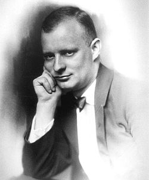

# Paul Hindemith

## País o nacionalidad

Estados Unidos

## Biografía

### Infancia y Formación Musical
Paul Hindemith nació el 16 de noviembre de 1895 en Hanau, Alemania, en una familia humilde. Desde niño mostró un talento excepcional para la música, aprendiendo violín y viola de manera autodidacta antes de ingresar al Conservatorio de Frankfurt a los 11 años. Su padre, un pintor y obrero, lo presionó para que se dedicara profesionalmente a la música, lo que lo llevó a debutar como violinista a los 12 años en orquestas locales.

### Ascenso en la Escena Alemana
En 1915, durante la Primera Guerra Mundial, Hindemith sirvió como violinista en el ejército, pero pronto regresó a la música civil. Se unió a la Ópera de Frankfurt como violista y comenzó a componer obras innovadoras influenciadas por el expresionismo. Su primera ópera, *Asesino, esperanza de las mujeres* (1919), marcó su entrada en el mundo escénico con un estilo audaz y atonal.

### Período de Madurez y Neoclasicismo (1920s)
Los años 20 fueron prolíficos: compuso las *Kammermusik* (1922-1927), una serie de conciertos para diversos instrumentos que fusionaban jazz, neoclasicismo y polirritmias. Obras como *Sancta Susanna* (1922) y *Cardillac* (1926) consolidaron su reputación como compositor vanguardista. Tocaba viola en el Cuarteto Amar, promoviendo música contemporánea.

| Cronología de Obras Clave (1920-1930) |
|---------------------------------------|
| **Año** | **Obra** |
| 1922 | Sancta Susanna (ópera) |
| 1922-1927 | Kammermusik (conciertos) |
| 1923 | Das Marienleben (ciclo de canciones) |
| 1926 | Cardillac (ópera) |
| 1930 | Konzertmusik op. 49 y 50 |

### Conflictos con el Nazismo
En los 1930s, Hindemith enfrentó el régimen nazi por su música 'degenerada'. Su ópera *Mathis der Maler* (1934), inspirada en Matthias Grünewald, criticaba indirectamente el totalitarismo artístico. Aunque inicialmente protegido por Furtwängler, emigró en 1938 a Suiza y luego a EE.UU., renunciando a la ciudadanía alemana.

### Exilio y Carrera en Estados Unidos
En 1940, Hindemith se instaló en EE.UU., enseñando en la Universidad de Yale. Compuso *Ludus Tonalis* (1942), un tratado tonal con fugas al estilo de Bach, y las *Metamorfosis sinfónicas sobre temas de Weber* (1943). Su *Sinfonía Serena* (1946) refleja serenidad postbélica.

| Colaboraciones y Estrenos Destacados |
|-------------------------------------|
| **Colaborador/Orquesta** | **Obra** | **Año** |
| Wilhelm Furtwängler | Mathis der Maler (ópera) | 1935 |
| Orquesta de Filadelfia | Symphonia Serena | 1946 |
| Cuarteto Amar | Kammermusik | 1920s |
| Ensambles de Yale | Ludus Tonalis | 1942 |

### Últimos Años y Legado
Regresó a Europa en 1953, componiendo *Die Harmonie der Welt* (ópera y sinfonía, 1957). Murió en 1963 en Fráncfort. Su obra abarca óperas, sinfonías, sonatas y música sacra, evolucionando del expresionismo a un tonalismo personal.

### Obras Maestras Tardías
Destacan *When Lilacs Last in the Dooryard Bloom'd* (1946), réquiem por FDR, y sonatas para casi todos los instrumentos (1935-1955). Su pedagogía influyó en generaciones vía *Elementary Training for Musicians*.

## Estilo musical

Hindemith inició con un expresionismo crudo, influido por Schoenberg y el jazz, como en *Sancta Susanna*, con armonías disonantes y ritmos sincopados que evocan la agitación posguerra. En los 1920s, abrazó el neoclasicismo 'Gebrauchsmusik' (música útil), priorizando la artesanía sobre la experimentación, con polifonía densa y contrapunto motorizado en las *Kammermusik*. [1]

Su teoría tonal, expuesta en *The Craft of Musical Composition*, clasifica intervalos por 'tensión' relativa, favoreciendo un politonalismo accesible donde la tónica emerge orgánicamente, no por cromatismo dodecafónico sino por jerarquías naturales. En orquestación, equilibra bloques instrumentales con texturas transparentes, como en *Mathis der Maler*, donde vientos y cuerdas dialogan contrapuntísticamente. [2]

Influencias barrocas (Bach) y clásicas (Mozart) se fusionan con folclore alemán en *Der Schwanendreher* (1935), usando viola como voz solista narrativa. En etapas tardías, su estilo se serena: *Metamorfosis sinfónicas* transforma temas de Weber en variaciones sinfónicas magistrales, con elegancia contrapuntística. [3]

Técnicas como el 'contrapunto lineal' y ostinatos rítmicos definen su madurez, siempre al servicio de la forma y expresividad humana, rechazando serialismo puro por un tonalismo 'expandido'. [4]

## Datos curiosos y técnica de composición

Hindemith era un violista virtuoso que fundó el Cuarteto Amar en 1921, tocando sus propias obras con precisión feroz, lo que le permitía experimentar directamente con timbres y técnicas. Su método de trabajo era incansable: componía de memoria, revisando obsesivamente, y enseñaba improvisación elemental para 'entrenar el oído' de músicos jóvenes, creyendo que la música debía ser accesible y funcional para todos. Vivía con austeridad, rechazando lujos pese a su fama, y en el exilio americano cultivó un jardín como metáfora de armonía cósmica, reflejada en *Die Harmonie der Welt*. [1]

Excentrista en su rechazo al nazismo, grabó mensajes radiofónicos contra el régimen disfrazados en música, y en EE.UU. se naturalizó en 1946, componiendo réquiems pacifistas como tributo a Whitman. Su pasión por la viola lo llevó a componer sonatas para casi todos los instrumentos, democratizando la música de cámara. Era conocido por su humor seco en clases, donde analizaba intervalos como 'planetas en órbita', humanizando la teoría compleja. [2]

## Top 10 bandas sonoras

1. ***Im Kampf mit dem Berge (Título en España: Im Kampf mit dem Berge)*** (1921)
    * **Póster:** [link](008_paul_hindemith/posters/poster_im_kampf_mit_dem_berge_1921.jpg)
2. ***Vormittagsspuk (Título en España: Vormittagsspuk)*** (1928)
    * **Póster:** [link](008_paul_hindemith/posters/poster_vormittagsspuk_1928.jpg)
3. ***Allemagne 90 neuf zéro (Título en España: Allemagne 90 neuf zéro)*** (1993)
    * **Póster:** [link](008_paul_hindemith/posters/poster_allemagne_90_neuf_z_ro_1993.jpg)
4. ***Сказочка про козявочку (Título en España: Сказочка про козявочку)*** (1985)
    * **Póster:** [link](008_paul_hindemith/posters/poster_poster_1985.jpg)
5. ***Wolfgang Sawallisch: Hindemith: Cardillac (Título en España: Wolfgang Sawallisch: Hindemith: Cardillac)*** (1985)
    * **Póster:** [link](008_paul_hindemith/posters/poster_wolfgang_sawallisch_hindemith_cardillac_1985.jpg)
6. ***Hindemith: Sancta Susanna (Título en España: Hindemith: Sancta Susanna)*** (2016)
    * **Póster:** [link](008_paul_hindemith/posters/poster_hindemith_sancta_susanna_2016.jpg)
7. ***Midori spielt Brahms' Violinkonzert (Título en España: Midori spielt Brahms' Violinkonzert)*** (2013)
    * **Póster:** [link](008_paul_hindemith/posters/poster_midori_spielt_brahms_violinkonzert_2013.jpg)

## Filmografía completa

| Año | Título | Título original | Póster |
| --- | --- | --- | --- |
| 1921 | Im Kampf mit dem Berge | — | [Póster](008_paul_hindemith/posters/poster_im_kampf_mit_dem_berge_1921.jpg) |
| 1928 | Vormittagsspuk | — | [Póster](008_paul_hindemith/posters/poster_vormittagsspuk_1928.jpg) |
| 1985 | Wolfgang Sawallisch: Hindemith: Cardillac | — | [Póster](008_paul_hindemith/posters/poster_wolfgang_sawallisch_hindemith_cardillac_1985.jpg) |
| 1985 | Сказочка про козявочку | — | [Póster](008_paul_hindemith/posters/poster_poster_1985.jpg) |
| 1993 | Allemagne 90 neuf zéro | — | [Póster](008_paul_hindemith/posters/poster_allemagne_90_neuf_z_ro_1993.jpg) |
| 2013 | Midori spielt Brahms' Violinkonzert | — | [Póster](008_paul_hindemith/posters/poster_midori_spielt_brahms_violinkonzert_2013.jpg) |
| 2016 | Hindemith: Sancta Susanna | — | [Póster](008_paul_hindemith/posters/poster_hindemith_sancta_susanna_2016.jpg) |

## Premios y nominaciones

* 1948 – Doctor honoris causa de la Universidad Johann Wolfgang Goethe de Frankfurt – (Ganador)
* 1950 – Doctor honoris causa de la Universidad Libre de Berlín – (Ganador)
* 1951 – Premio Bach de la Ciudad Libre y Hanseática de Hamburgo – (Ganador)
* 1954 – Doctor honoris causa de la Universidad de Oxford – (Ganador)
* 1955 – Placa de Goethe de la ciudad de Frankfurt – (Ganador)
* 1955 – Premio Wihur Sibelius – (Ganador)
* 1962 – Premio Balzán – (Ganador)
* 1963 – Premio de Arte de Berlín – (Ganador)
* Miembro Honorario de la Sociedad Internacional de Música Contemporánea – (Ganador)
* Orden Pour le Mérite para las Ciencias y las Artes – (Ganador)
* por mérito – (Ganador)

## Citas

[1]: http://vivalamusicahoy.blogspot.com/2010/07/obras-principales-de-paul-hindemith.html
[2]: http://es.instr.scorser.com/C/Todos/Paul+Hindemith/Todos/Alphabeticly.html
[3]: https://www.melomanodigital.com/klaviermusik-mit-orchester-opus-29-de-paul-hindemith/
[4]: http://www.ateneodecordoba.com/index.php/Paul_Hindemith
[5]: http://angelcarrascosa.blogspot.com/2020/04/seleccion-discografica-de-hindemith.html
[6]: https://es.wikipedia.org/wiki/Paul_Hindemith
[7]: https://www.orquestasinfonicadexalapa.com/blog/entrada.php?id=239
[8]: https://filosofiadelamusica.es/bio/phin.htm
[9]: https://holocaustmusic.ort.org/es/politics-and-propaganda/third-reich/hindemith-paul/
[10]: https://es.laphil.com/musicdb/artists/2425/paul-hindemith

## Fuentes adicionales

* [MundoBSO](https://mundobso.com) — site:mundobso.com
* [MundoBSO (2)](https://mundobso.com) — site:mundobso.com
* [MundoBSO (3)](https://mundobso.com) — site:mundobso.com
* [Film Score Monthly](https://filmscoremonthly.com) — site:filmscoremonthly.com
* [Film Score Monthly (2)](https://filmscoremonthly.com) — site:filmscoremonthly.com
* [Film Score Monthly (3)](https://filmscoremonthly.com) — site:filmscoremonthly.com
* [SoundtrackCollector](https://www.soundtrackcollector.com/catalog/search.php?searchon=soundtrack&searchtext=In) — site:soundtrackcollector.com
* [SoundtrackCollector (2)](https://soundtrackcollector.com) — site:soundtrackcollector.com
* [SoundtrackCollector (3)](https://soundtrackcollector.com) — site:soundtrackcollector.com
* [WhatSong](https://whatsong.org) — site:whatsong.org
* [WhatSong (2)](https://whatsong.org) — site:whatsong.org
* [WhatSong (3)](https://whatsong.org) — site:whatsong.org

## Notas externas

* scherzo.es: Secciones – Libros – Jazz – Danza – Aniversario – Bandas sonoras — El eco de la imagen – Sonido – Educación – Músicas sumergidas – Doctor, oigo voces – El horizonte quimérico Secciones – Libros – Jazz – Danza – Aniversario – Bandas sonoras — El eco de la imagen – Sonido – Educación – Músicas sumergidas – Doctor, oigo voces – El horizonte quimérico
* holocaustmusic.ort.org: Temas arrow_drop_down Política y Propaganda Resistencia y Exilio Restauración y restitución Reacciones Memoria Music and Genocide Película sobre el Holocausto Paul Hindemith fue uno de los compositores alemanes más exitosos de siglo XX. Su relación con el Partido Nazi estaba plagada de contradicciones y paradojas. Si bien en 1934 Goebbels admitió que “indudablemente es uno de los talentos más importantes de la generación de compositores jóvenes”, dos años después sus composiciones fueron prohibidas. Aunque era un modernista comprometido que colaboraba tanto con músicos izquierdistas como con judíos, la actitud apolítica de Hindemith, su predisposición a transigir y su reputación...
* filosofiadelamusica.es: Compositor alemán y una de las figuras más importantes del panorama musical de la primera mitad del siglo XX, comienza con 14 años los estudios de violín y composición en el Conservatorio Honch de Frankfurt (1908-1917) con Arnold Mendelsson y Bernard Sekles. Asimismo, de 1915 a 1923 ejerce de director de orquesta de la Ópera de Frankfurt, con un breve intervalo para realizar el servicio militar. Como compositor también realiza trabajos donde une poesía de autores alemanes con música en obras como el ciclo de canciones Die junge Magd (1922), Das Marienleben (1924), la ópera Cadillac (1926), y/o la cantata Der Lindberghflug (1928). En la década de los años 30, Hindemith compone la...
* aulavirtualdefagot4profesional.on.drv.tw: Cómo funciona el aula virtual Actividad 1 Actividad 2 Actividad 3 UD 1 - El cuerpo ¿Por qué es importante cuidar nuestro cuerpo? El cuerpo, la postura y la propiocepción Ejercicios de movilidad Pelvis Curl Chest Lift Bridging Assisted Roll Up Arm Arcs Bent knee opening Dart Dead Bug Fémur Arcs Prone Press Up Roll Up Side to side Side Series Relaciona tu cuerpo con tu práctica instrumental ¿He adquirido los conocimientos? Nivel de propiocepción ¿Es cierto que...?
* www.biografiasyvidas.com: (Hanau, 1895 - Francfort, 1963) Compositor alemán. Fue una de las figuras más importantes dentro del panorama musical alemán de la primera mitad del siglo XX. Su relevancia radica en que fue uno de los más fervientes experimentadores de la música clásica del siglo, puesto que trató de renovar la tonalidad que imperaba en el sistema musical desde hacía más de trescientos años. Además, fue uno de los pioneros en la creación de la llamada "música utilitaria" ( Gebrauchsmusik ), música para poder ser escuchada a cualquier hora del día y en cualquier situación. Hindemith tenía la creencia de que el compositor debía actuar como un artesano, al tiempo que debía mostrar en su música las necesidades...
* www.religionenlibertad.com: Paul Hindemith dirige a la Orquesta Sinfónica de Chicago en un concierto del 7 de abril de 1963. La primera consideración que hace el sabio sacerdote, matemático y filósofo Boecio (480-525 d.C.) en su obra Sobre el fundamento de la música es la siguiente:
* www.windrep.org: Paul Hindemith (16 de noviembre de 1895, Hanau, Alemania - 28 de diciembre de 1963, Frankfurt am Main) fue un compositor y educador alemán. Hindemith estudió dirección, composición y violín con Arnold Mendelssohn y Bernhard Sekles en el Conservatorio Hoch, y se mantenía tocando en bandas de baile y grupos de comedia musical. De 1915 a 1923 fue concertino de la Orquesta de la Ópera de Frankfurt y en 1929 fundó el Cuarteto Amar, tocando la viola.
* www.britannica.com: Nuestros editores revisarán lo que ha enviado y determinarán si deben revisar el artículo. La música y el Holocausto - Biografía de Paul Hindemith
* www.classical-music.com: A menudo descartado hoy como un seco neoclásico, el compositor alemán Paul Hindemith fue de hecho una de las figuras más visionarias de su tiempo, dice John Allison. Aquí explora su vida y su obra. Durante más de 20 años, Paul Hindemith y su esposa Gertrud se acostumbraron a enviar tarjetas de felicitación hechas por ellos mismos para Navidad y Año Nuevo. El compositor, brillante caricaturista y artista gráfico, los diseñó todos, y el último, de 1963-64, es especialmente conmovedor.
* www.deutschegrammophon.com: Paul Hindemith, uno de los compositores más importantes de la primera mitad del siglo XX, dominó la vida musical alemana durante la República de Weimar (1919-1933). Músico versátil, mantuvo un asombroso nivel de productividad en su composición mientras desarrollaba una exitosa carrera como violista solista y miembro de un cuarteto de cuerda profesional. Estos dones, junto con su dedicación a la enseñanza, aseguraron que pudiera prosperar incluso después de que decidió abandonar Alemania durante el Tercer Reich y establecer su hogar en los Estados Unidos. Hindemith provenía de un entorno humilde y enfrentó una pobreza extrema durante su infancia. Sin embargo, sus padres lo alentaron a aprender música y su floreciente...
* imslp.org: Página Página Discusión (0) Ver código fuente Historia Qué vínculos aquí Cambios relacionados Versión imprimible Enlace permanente Página Discusión (0) Ver código fuente Historia Qué vínculos aquí Cambios relacionados Versión imprimible Enlace permanente
* app.idagio.com: Metamorfosis sinfónica de temas de Carl Maria von Weber (1943) Sonata para viola y piano en fa mayor op. 4/11 (1919)
