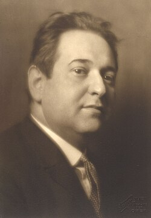

# Erich Wolfgang Korngold

## País o nacionalidad

Estados Unidos

## Biografía

Erich Wolfgang Korngold (Brno, 29 de mayo de 1897-Los Ángeles, Estados Unidos, 29 de noviembre de 1957) fue un compositor y director de orquesta nacido en el Imperio austrohúngaro y posteriormente nacionalizado estadounidense en 1943. Fue un niño prodigio, que llegó a ser uno de los más importantes e influyentes compositores de la historia de Hollywood, así como un notable pianista.​​ Compuso además cinco óperas y varias obras orquestales, de cámara y canciones.

## Estilo musical

Erich Korngold, el padre de las bandas sonoras nació en Brno 18:47

Erich Wolfgang Korngold fue un influyente compositor nacido en Viena, Austria-Hungría, que surgió como un niño prodigio en la música. Compuso su primer ballet a la edad de once años y obtuvo elogios por su Sinfonietta en si mayor, terminada en 1913. La carrera de Korngold estuvo marcada por su servicio como director musical durante la Primera Guerra Mundial y su eventual migración a los Estados Unidos en la década de 1930, impulsada por el ascenso de los nazis en Europa. En Hollywood, se convirtió en un destacado compositor de cine y ganó dos premios de la Academia por sus partituras, incluida la reconocida música de *Las aventuras de Robin Hood*. A pesar de su éxito en el cine, Korngold luchó por volver a la música de concierto después de la Segunda Guerra Mundial, ya que su...

## Datos curiosos y técnica de composición

Erich Wolfgang Korngold fue un influyente compositor nacido en Viena, Austria-Hungría, que surgió como un niño prodigio en la música. Compuso su primer ballet a la edad de once años y obtuvo elogios por su Sinfonietta en si mayor, terminada en 1913. La carrera de Korngold estuvo marcada por su servicio como director musical durante la Primera Guerra Mundial y su eventual migración a los Estados Unidos en la década de 1930, impulsada por el ascenso de los nazis en Europa. En Hollywood, se convirtió en un destacado compositor de cine y ganó dos premios de la Academia por sus partituras, incluida la reconocida música de *Las aventuras de Robin Hood*. A pesar de su éxito en el cine, Korngold luchó por volver a la música de concierto después de la Segunda Guerra Mundial, ya que su estilo ricamente cromático cayó en desgracia. Compuso obras importantes como la ópera *Die tote Stadt* y el Concierto para piano en do sostenido para el pianista manco Paul Wittgenstein. Korngold falleció en Hollywood en 1957 y, aunque inicialmente se pasó por alto, desde entonces se han reevaluado sus contribuciones a la música, posicionándolo como una figura clave de la música del romanticismo tardío.

## Top 10 bandas sonoras

1. ***The Adventures of Robin Hood (Título en España: Robin de los bosques)*** (1938)
    * **Póster:** [link](010_erich_wolfgang_korngold/posters/poster_the_adventures_of_robin_hood_1938.jpg)
2. ***The Sea Hawk (Título en España: El halcón del mar)*** (1940)
    * **Póster:** [link](010_erich_wolfgang_korngold/posters/poster_the_sea_hawk_1940.jpg)
3. ***The Private Lives of Elizabeth and Essex (Título en España: La vida privada de Elisabeth y Essex)*** (1939)
    * **Póster:** [link](010_erich_wolfgang_korngold/posters/poster_the_private_lives_of_elizabeth_and_essex_1939.jpg)
4. ***Captain Blood (Título en España: El capitán Blood)*** (1935)
    * **Póster:** [link](010_erich_wolfgang_korngold/posters/poster_captain_blood_1935.jpg)
5. ***Deception (Título en España: Engaño)*** (1946)
    * **Póster:** [link](010_erich_wolfgang_korngold/posters/poster_deception_1946.jpg)
6. ***Kings Row (Título en España: Abismo de pasión)*** (1942)
    * **Póster:** [link](010_erich_wolfgang_korngold/posters/poster_kings_row_1942.jpg)

## Filmografía completa

| Año | Título | Título original | Póster |
| --- | --- | --- | --- |
| 1935 | A Dream Comes True | — | [Póster](010_erich_wolfgang_korngold/posters/poster_a_dream_comes_true_1935.jpg) |
| 1935 | El capitán Blood | Captain Blood | [Póster](010_erich_wolfgang_korngold/posters/poster_captain_blood_1935.jpg) |
| 1936 | El caballero Adverse | Anthony Adverse | [Póster](010_erich_wolfgang_korngold/posters/poster_anthony_adverse_1936.jpg) |
| 1936 | Give Us This Night | — | [Póster](010_erich_wolfgang_korngold/posters/poster_give_us_this_night_1936.jpg) |
| 1936 | The Green Pastures | — | [Póster](010_erich_wolfgang_korngold/posters/poster_the_green_pastures_1936.jpg) |
| 1937 | El príncipe y el mendigo | The Prince and the Pauper | [Póster](010_erich_wolfgang_korngold/posters/poster_the_prince_and_the_pauper_1937.jpg) |
| 1937 | Otro amanecer | Another Dawn | [Póster](010_erich_wolfgang_korngold/posters/poster_another_dawn_1937.jpg) |
| 1938 | Robin de los bosques | The Adventures of Robin Hood | [Póster](010_erich_wolfgang_korngold/posters/poster_the_adventures_of_robin_hood_1938.jpg) |
| 1939 | Juárez | Juarez | [Póster](010_erich_wolfgang_korngold/posters/poster_juarez_1939.jpg) |
| 1939 | La vida privada de Elisabeth y Essex | The Private Lives of Elizabeth and Essex | [Póster](010_erich_wolfgang_korngold/posters/poster_the_private_lives_of_elizabeth_and_essex_1939.jpg) |
| 1940 | El halcón del mar | The Sea Hawk | [Póster](010_erich_wolfgang_korngold/posters/poster_the_sea_hawk_1940.jpg) |
| 1941 | El lobo de mar | The Sea Wolf | [Póster](010_erich_wolfgang_korngold/posters/poster_the_sea_wolf_1941.jpg) |
| 1942 | Abismo de pasión | Kings Row | [Póster](010_erich_wolfgang_korngold/posters/poster_kings_row_1942.jpg) |
| 1943 | La ninfa constante | The Constant Nymph | [Póster](010_erich_wolfgang_korngold/posters/poster_the_constant_nymph_1943.jpg) |
| 1944 | Entre dos mundos | Between Two Worlds | [Póster](010_erich_wolfgang_korngold/posters/poster_between_two_worlds_1944.jpg) |
| 1946 | Cautivo del deseo | Of Human Bondage | [Póster](010_erich_wolfgang_korngold/posters/poster_of_human_bondage_1946.jpg) |
| 1946 | Engaño | Deception | [Póster](010_erich_wolfgang_korngold/posters/poster_deception_1946.jpg) |
| 1946 | Predilección | Devotion | [Póster](010_erich_wolfgang_korngold/posters/poster_devotion_1946.jpg) |
| 1947 | Nunca huyas de mí | Escape Me Never | [Póster](010_erich_wolfgang_korngold/posters/poster_escape_me_never_1947.jpg) |
| 1955 | Fuego mágico | Magic Fire | [Póster](010_erich_wolfgang_korngold/posters/poster_magic_fire_1955.jpg) |
| 1999 | Die tote Stadt | — | [Póster](010_erich_wolfgang_korngold/posters/poster_die_tote_stadt_1999.jpg) |
| 2009 | Die Tote Stadt | — | [Póster](010_erich_wolfgang_korngold/posters/poster_die_tote_stadt_2009.jpg) |
| 2010 | Die tote Stadt | — | [Póster](010_erich_wolfgang_korngold/posters/poster_die_tote_stadt_2010.jpg) |
| 2018 | Die tote Stadt | — | [Póster](010_erich_wolfgang_korngold/posters/poster_die_tote_stadt_2018.jpg) |
| 2024 | Pioniere der Filmmusik - Europas Sound für Hollywood | — | [Póster](010_erich_wolfgang_korngold/posters/poster_pioniere_der_filmmusik_europas_sound_f_r_hollywood_2024.jpg) |

## Premios y nominaciones

* 1939 – Premio de la Academia – por *The Adventures of Robin Hood (Título en España: Robin de los bosques)*
* 1939 – Nominación de la Academia – por *The Adventures of Robin Hood (Título en España: Robin de los bosques)*
* 1940 – Nominación de la Academia – por *The Private Lives of Elizabeth and Essex (Título en España: La vida privada de Elisabeth y Essex)*
* 1941 – Nominación de la Academia – por *The Sea Hawk (Título en España: El halcón del mar)*

## Fuentes adicionales

* [MundoBSO](https://www.mundobso.com/new/biblioteca/erich-wolfgang-korngold) — site:mundobso.com
* [MundoBSO (2)](https://www.mundobso.com/new/bso/elizabeth-and-essex-the-classic-film-scores-of-erich-wolfgang-korngold) — site:mundobso.com
* [MundoBSO (3)](https://www.mundobso.com/articulos/korngold-erich-wolfgang) — site:mundobso.com
* [Film Score Monthly](https://filmscoremonthly.com) — site:filmscoremonthly.com
* [Film Score Monthly (2)](https://filmscoremonthly.com) — site:filmscoremonthly.com
* [Film Score Monthly (3)](https://filmscoremonthly.com) — site:filmscoremonthly.com
* [SoundtrackCollector](http://www.soundtrackcollector.com/title/8475/Captain+Blood) — site:soundtrackcollector.com
* [SoundtrackCollector (2)](http://www.soundtrackcollector.com/title/6367/Elizabeth+And+Essex:+The+Classic+Film+Scores+Of+Erich+Wolfgang+Korngold) — site:soundtrackcollector.com
* [SoundtrackCollector (3)](https://soundtrackcollector.com) — site:soundtrackcollector.com
* [WhatSong](https://whatsong.org) — site:whatsong.org
* [WhatSong (2)](https://whatsong.org) — site:whatsong.org
* [WhatSong (3)](https://whatsong.org) — site:whatsong.org

## Notas externas

* MundoBSO: Editorial: Phaidon Press Título completo: Erich Wolfgang Korngold Autor: Jessica Duchen Nacionalidad: EE UU Año: 1996 Número de páginas: 239 Categorias: Biografías Descripción Libro que repasa la vida y filmografía de Erich Wolfgang Korngold. Libro que repasa la vida y filmografía de Erich Wolfgang Korngold.
* MundoBSO (2): Compositor: Korngold, Erich Wolfgang Sello: RCA Victor Duración: 58 minutos Información de la película Título original: Elizabeth And Essex: The Classic Film Scores Of Erich Wolfgang Korngold Nacionalidad: EE UU Año: 1989 Compositor: Korngold, Erich Wolfgang Sello: RCA Victor Duración: 58 minutos
* MundoBSO (3): Todos los textos, salvo los firmados por otros, están registrados y son propiedad de Conrado Xalabarder. Prohibida la reproducción total o parcial sin el consentimiento expreso y por escrito del autor. Las fotos tienen únicamente propósitos identificativos, sin ninguna intención de vulneración de copyright. Si eres el autor/a o propietario de la foto escríbenos un email a cxa@mundobso para acreditarte o, si lo prefieres, para que la borremos
* www.ebsco.com: Erich Wolfgang Korngold fue un influyente compositor nacido en Viena, Austria-Hungría, que surgió como un niño prodigio en la música. Compuso su primer ballet a la edad de once años y obtuvo elogios por su Sinfonietta en si mayor, terminada en 1913. La carrera de Korngold estuvo marcada por su servicio como director musical durante la Primera Guerra Mundial y su eventual migración a los Estados Unidos en la década de 1930, impulsada por el ascenso de los nazis en Europa. En Hollywood, se convirtió en un destacado compositor de cine y ganó dos premios de la Academia por sus partituras, incluida la reconocida música de *Las aventuras de Robin Hood*. A pesar de su éxito en el cine, Korngold luchó por volver a la música de concierto después de la Segunda Guerra Mundial, ya que su...
* orelfoundation.org: Erich Wolfgang Korngold (1897-1957) fue un niño prodigio, un notable talento de entreguerras en la vida musical de la Europa de habla alemana y, en sus últimos años, una de las figuras más famosas del establishment musical de Hollywood. Hoy en día se le recuerda por sus numerosas partituras cinematográficas, pero también por su música operística e instrumental. Erich Wolfgang Korngold, uno de los prodigios de la composición más célebres de todos los tiempos y pionero en el desarrollo de la banda sonora clásica de Hollywood, nació en Brünn, Moravia, el 29 de mayo de 1897, segundo hijo de Julius Korngold y Josephine Witrofsky. La familia se mudó a Viena en 1901, y en 1904 Julius sucedió a su mentor, Eduard Hanslick, como director musical...
* www.britannica.com: Nuestros editores revisarán lo que ha enviado y determinarán si deben revisar el artículo. La Fundación Orel - Biografía de Erich Wolfgang Korngold
* korngold-society.org: Medios Discografía Libros Grabaciones en CD recomendadas Grabaciones en DVD recomendadas Vídeos de Youtube Korngold en Twitter Libro electrónico multimedia gratuito Eventos Festspiel de Salzburgo 2004 Die Tote Stadt 2006 Nueva York 2001 Memorial 2007 Mucho ruido y pocas nueces Violanta La serenata silenciosa Die tote Stadt 2016 Mucho ruido y pocas nueces, actuación de la UNCSA
* www.windrep.org: Erich Wolfgang Korngold (29 de mayo de 1897, Brno, Austria/Hungría - 29 de noviembre de 1957, Los Ángeles) fue un compositor estadounidense de origen austrohúngaro. Nació en un hogar judío y fue el segundo hijo del eminente crítico musical Julius Korngold. Erich, un niño prodigio, interpretó su cantata Gold para Gustav Mahler en 1909; Mahler lo llamó "genio musical" y recomendó estudiar con el compositor Alexander von Zemlinsky. Richard Strauss también habló muy bien de la juventud. A la edad de 11 años compuso su ballet Der Schneemann (El muñeco de nieve), que se convirtió en una sensación cuando se presentó en la Ópera de la Corte de Viena en 1910, incluida una actuación dirigida para el emperador Francisco José. Esta obra fue seguida primero con un piano...
* www.charlottesymphony.org: Conciertos y entradas Próximos eventos Programas de descuentos Certificados de regalo Ventas grupales Suscripciones a la temporada 2025-26 Planifique su visita Preguntas frecuentes sobre accesibilidad Estacionamiento y transporte público Charlas previas al concierto Lugares
* pacificsymphony.blog: Un sitio web de música clásica dedicado a la Sinfónica del Pacífico Erich Wolfgang Korngold nació en Brünn, Austria-Hungría (ahora Brno, República Checa). Un niño prodigio, ya componía música a los siete años y obtuvo los primeros elogios de los legendarios compositores Gustav Mahler y Richard Strauss. Los músicos judíos eran un objetivo particular del Tercer Reich, por lo que en 1934, Korngold se unió a la vanguardia de compositores judíos vieneses que huyeron antes del inicio de la Segunda Guerra Mundial para establecerse en Hollywood. Korngold se convirtió en un pionero de la música cinematográfica de Hollywood y ayudó a crear una época dorada musical a la altura de la época dorada del cine estadounidense. Se hizo conocido como uno de los fundadores de la música cinematográfica estadounidense, habiendo compuesto 16...
* korngold-society.org: Medios Discografía Libros Grabaciones en CD recomendadas Grabaciones en DVD recomendadas Vídeos de Youtube Korngold en Twitter Libro electrónico multimedia gratuito Eventos Festspiel de Salzburgo 2004 Die Tote Stadt 2006 Nueva York 2001 Memorial 2007 Mucho ruido y pocas nueces Violanta La serenata silenciosa Die tote Stadt 2016 Mucho ruido y pocas nueces, actuación de la UNCSA
* www.laphil.com: Iniciar sesión Mi cuenta Mis pedidos Detalles de mi cuenta Cerrar sesión Calendario de conciertos y eventos Información sobre paquetes y entradas Festivales de la temporada 2025/26 Mejore su experiencia
