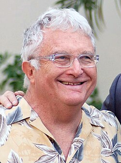

# Alfred Newman

## País o nacionalidad

Estados Unidos

## Biografía

Randall Stuart "Randy" Newman (Los Ángeles, California; 28 de noviembre de 1943) es un compositor, arreglista, cantante y pianista estadounidense. Es conocido por sus mordaces canciones y sus bandas sonoras de películas.​ Nacido en Los Ángeles en una familia extensa de compositores de películas de Hollywood, Newman comenzó su carrera como compositor a la edad de 17 años, escribiendo éxitos para artistas como Dusty Springfield, Cilla Black, Jerry Butler y Alan Price.​ En 1968, hizo su debut como solista con el álbum Randy Newman, producido por Lenny Waronker y Van Dyke Parks, siguiendo con álbumes aclamados por la crítica como 12 Songs (1970), Sail Away (1972) y Good Old Boys (1974).​ Desde la década de 1980, Newman ha trabajado principalmente como compositor de películas. Ha compuesto la música de nueve películas animadas de Disney-Pixar, incluidas las cuatro películas de Toy Story (1995-2019), Bichos: Una aventura en miniatura (1998), las dos películas de Monsters, Inc. (2001-2013) y la primera y tercera películas de Cars (2006, 2017), así como las películas de Disney Jim y el durazno gigante (1996) y La princesa y el sapo (2009). Otras bandas sonoras incluyen Ragtime (1981), El mejor (1984), Despertares (1990), Pleasantville (1998), Seabiscuit (2003) e Historia de un matrimonio (2019).​ Newman ha recibido veintidós nominaciones al Premio de la Academia en las categorías de Mejor Banda Sonora Original y Mejor Canción Original y ha ganado dos veces en la última categoría por las canciones "If I Didn't Have You" y "We Belong Together", lo que contribuye a que Newman pertenezca a la familia extendida más nominada al Premio de la Academia, con un total de 92 nominaciones en varias categorías de música. También ha ganado tres premios Emmy, siete premios Grammy y el premio gobernador de The Recording Academy.​ En 2007, The Walt Disney Company lo reconoció como una Leyenda de Disney.​

## Estilo musical

Información de estilo musical en proceso de documentación.

## Datos curiosos y técnica de composición

Información de anécdotas y curiosidades en proceso de documentación.

## Top 10 bandas sonoras

1. ***All About Eve (Título en España: Eva al desnudo)*** (1950)
    * **Póster:** [link](013_alfred_newman/posters/poster_all_about_eve_1950.jpg)
2. ***The King and I (Título en España: El rey y yo)*** (1956)
    * **Póster:** [link](013_alfred_newman/posters/poster_the_king_and_i_1956.jpg)
3. ***Anastasia (Título en España: Anastasia)*** (1956)
    * **Póster:** [link](013_alfred_newman/posters/poster_anastasia_1956.jpg)
4. ***How the West Was Won (Título en España: La conquista del Oeste)*** (1962)
    * **Póster:** [link](013_alfred_newman/posters/poster_how_the_west_was_won_1962.jpg)
5. ***Wuthering Heights (Título en España: Cumbres borrascosas)*** (1939)
    * **Póster:** [link](013_alfred_newman/posters/poster_wuthering_heights_1939.jpg)
6. ***The Diary of Anne Frank (Título en España: El diario de Ana Frank)*** (1959)
    * **Póster:** [link](013_alfred_newman/posters/poster_the_diary_of_anne_frank_1959.jpg)
7. ***Airport (Título en España: Aeropuerto)*** (1970)
    * **Póster:** [link](013_alfred_newman/posters/poster_airport_1970.jpg)
8. ***How Green Was My Valley (Título en España: ¡Qué verde era mi valle!)*** (1941)
    * **Póster:** [link](013_alfred_newman/posters/poster_how_green_was_my_valley_1941.jpg)
9. ***Daddy Long Legs (Título en España: Papá piernas largas)*** (1955)
    * **Póster:** [link](013_alfred_newman/posters/poster_daddy_long_legs_1955.jpg)
10. ***Camelot (Título en España: Camelot)*** (1967)
    * **Póster:** [link](013_alfred_newman/posters/poster_camelot_1967.jpg)

## Filmografía completa

| Año | Título | Título original | Póster |
| --- | --- | --- | --- |
| 1931 | Around the World in 80 Minutes with Douglas Fairbanks | — | [Póster](013_alfred_newman/posters/poster_around_the_world_in_80_minutes_with_douglas_fairbanks_1931.jpg) |
| 1931 | Corsair | — | [Póster](013_alfred_newman/posters/poster_corsair_1931.jpg) |
| 1931 | El doctor Arrowsmith | Arrowsmith | [Póster](013_alfred_newman/posters/poster_arrowsmith_1931.jpg) |
| 1931 | El paraíso del mal | The Unholy Garden | [Póster](013_alfred_newman/posters/poster_the_unholy_garden_1931.jpg) |
| 1931 | Esta noche o nunca | Tonight or Never | [Póster](013_alfred_newman/posters/poster_tonight_or_never_1931.jpg) |
| 1931 | The Age for Love | — | [Póster](013_alfred_newman/posters/poster_the_age_for_love_1931.jpg) |
| 1932 | Bajo la lluvia | Rain | [Póster](013_alfred_newman/posters/poster_rain_1932.jpg) |
| 1932 | Carne | Flesh | [Póster](013_alfred_newman/posters/poster_flesh_1932.jpg) |
| 1932 | Cinemanía | Movie Crazy | [Póster](013_alfred_newman/posters/poster_movie_crazy_1932.jpg) |
| 1932 | El Robinson moderno | Mr. Robinson Crusoe | [Póster](013_alfred_newman/posters/poster_mr_robinson_crusoe_1932.jpg) |
| 1932 | Night World | — | [Póster](013_alfred_newman/posters/poster_night_world_1932.jpg) |
| 1932 | Sky Devils | — | [Póster](013_alfred_newman/posters/poster_sky_devils_1932.jpg) |
| 1932 | Su único pecado | Cynara | [Póster](013_alfred_newman/posters/poster_cynara_1932.jpg) |
| 1932 | The Greeks Had a Word for Them | — | [Póster](013_alfred_newman/posters/poster_the_greeks_had_a_word_for_them_1932.jpg) |
| 1932 | Torero a la fuerza | The Kid from Spain | [Póster](013_alfred_newman/posters/poster_the_kid_from_spain_1932.jpg) |
| 1933 | A la sombra de los muelles | I Cover the Waterfront | [Póster](013_alfred_newman/posters/poster_i_cover_the_waterfront_1933.jpg) |
| 1933 | Broadway Thru a Keyhole | — | [Póster](013_alfred_newman/posters/poster_broadway_thru_a_keyhole_1933.jpg) |
| 1933 | El arrabal | The Bowery | [Póster](013_alfred_newman/posters/poster_the_bowery_1933.jpg) |
| 1933 | Escándalos Romanos | Roman Scandals | [Póster](013_alfred_newman/posters/poster_roman_scandals_1933.jpg) |
| 1933 | Secrets | — | [Póster](013_alfred_newman/posters/poster_secrets_1933.jpg) |
| 1933 | Soy un vagabundo | Hallelujah, I'm a Bum | [Póster](013_alfred_newman/posters/poster_hallelujah_i_m_a_bum_1933.jpg) |
| 1933 | The Masquerader | — | [Póster](013_alfred_newman/posters/poster_the_masquerader_1933.jpg) |
| 1934 | Bulldog Drummond Strikes Back | — | [Póster](013_alfred_newman/posters/poster_bulldog_drummond_strikes_back_1934.jpg) |
| 1934 | El chico millonario | Kid Millions | [Póster](013_alfred_newman/posters/poster_kid_millions_1934.jpg) |
| 1934 | El pan nuestro de cada día | Our Daily Bread | [Póster](013_alfred_newman/posters/poster_our_daily_bread_1934.jpg) |
| 1934 | La reina del boulevard | Nana | [Póster](013_alfred_newman/posters/poster_nana_1934.jpg) |
| 1934 | Nacida para ser mala | Born to Be Bad | [Póster](013_alfred_newman/posters/poster_born_to_be_bad_1934.jpg) |
| 1934 | The Affairs of Cellini | — | [Póster](013_alfred_newman/posters/poster_the_affairs_of_cellini_1934.jpg) |
| 1934 | The House of Rothschild | — | [Póster](013_alfred_newman/posters/poster_the_house_of_rothschild_1934.jpg) |
| 1934 | The Last Gentleman | — | [Póster](013_alfred_newman/posters/poster_the_last_gentleman_1934.jpg) |
| 1934 | The Mighty Barnum | — | [Póster](013_alfred_newman/posters/poster_the_mighty_barnum_1934.jpg) |
| 1934 | Transatlantic Merry-Go-Round | — | [Póster](013_alfred_newman/posters/poster_transatlantic_merry_go_round_1934.jpg) |
| 1934 | Una avería en la línea | Looking for Trouble | [Póster](013_alfred_newman/posters/poster_looking_for_trouble_1934.jpg) |
| 1934 | Vivamos de nuevo | We Live Again | [Póster](013_alfred_newman/posters/poster_we_live_again_1934.jpg) |
| 1935 | Clive of India | — | [Póster](013_alfred_newman/posters/poster_clive_of_india_1935.jpg) |
| 1935 | El cardenal Richelieu | Cardinal Richelieu | [Póster](013_alfred_newman/posters/poster_cardinal_richelieu_1935.jpg) |
| 1935 | El soldadito del amor | Red Salute | [Póster](013_alfred_newman/posters/poster_red_salute_1935.jpg) |
| 1935 | Folies Bergère | — | [Póster](013_alfred_newman/posters/poster_folies_berg_re_1935.jpg) |
| 1935 | La ciudad sin ley | Barbary Coast | [Póster](013_alfred_newman/posters/poster_barbary_coast_1935.jpg) |
| 1935 | La llamada de la selva | Call of the Wild | [Póster](013_alfred_newman/posters/poster_call_of_the_wild_1935.jpg) |
| 1935 | Los miserables | Les Misérables | [Póster](013_alfred_newman/posters/poster_les_mis_rables_1935.jpg) |
| 1935 | Noche nupcial | The Wedding Night | [Póster](013_alfred_newman/posters/poster_the_wedding_night_1935.jpg) |
| 1935 | Splendor | — | [Póster](013_alfred_newman/posters/poster_splendor_1935.jpg) |
| 1935 | The Dark Angel | — | [Póster](013_alfred_newman/posters/poster_the_dark_angel_1935.jpg) |
| 1935 | The Melody Lingers on | — | [Póster](013_alfred_newman/posters/poster_the_melody_lingers_on_1935.jpg) |
| 1936 | Desengaño | Dodsworth | [Póster](013_alfred_newman/posters/poster_dodsworth_1936.jpg) |
| 1936 | Esos tres | These Three | [Póster](013_alfred_newman/posters/poster_these_three_1936.jpg) |
| 1936 | Mi adorable enemiga | Beloved Enemy | [Póster](013_alfred_newman/posters/poster_beloved_enemy_1936.jpg) |
| 1936 | One Rainy Afternoon | — | [Póster](013_alfred_newman/posters/poster_one_rainy_afternoon_1936.jpg) |
| 1936 | Ramona | — | [Póster](013_alfred_newman/posters/poster_ramona_1936.jpg) |
| 1936 | Rivales | Come and Get It | [Póster](013_alfred_newman/posters/poster_come_and_get_it_1936.jpg) |
| 1936 | Strike Me Pink | — | [Póster](013_alfred_newman/posters/poster_strike_me_pink_1936.jpg) |
| 1936 | The Gay Desperado | — | [Póster](013_alfred_newman/posters/poster_the_gay_desperado_1936.jpg) |
| 1937 | 52nd Street | — | [Póster](013_alfred_newman/posters/poster_52nd_street_1937.jpg) |
| 1937 | Calle sin salida | Dead End | [Póster](013_alfred_newman/posters/poster_dead_end_1937.jpg) |
| 1937 | Cena de medianoche | History Is Made at Night | [Póster](013_alfred_newman/posters/poster_history_is_made_at_night_1937.jpg) |
| 1937 | El prisionero de Zenda | The Prisoner of Zenda | [Póster](013_alfred_newman/posters/poster_the_prisoner_of_zenda_1937.jpg) |
| 1937 | Huracán sobre la isla | The Hurricane | [Póster](013_alfred_newman/posters/poster_the_hurricane_1937.jpg) |
| 1937 | La mascota del regimiento | Wee Willie Winkie | [Póster](013_alfred_newman/posters/poster_wee_willie_winkie_1937.jpg) |
| 1937 | Redención | Slave Ship | [Póster](013_alfred_newman/posters/poster_slave_ship_1937.jpg) |
| 1937 | Stella Dallas | — | [Póster](013_alfred_newman/posters/poster_stella_dallas_1937.jpg) |
| 1937 | Sólo se vive una vez | You Only Live Once | [Póster](013_alfred_newman/posters/poster_you_only_live_once_1937.jpg) |
| 1937 | Woman Chases Man | — | [Póster](013_alfred_newman/posters/poster_woman_chases_man_1937.jpg) |
| 1938 | El vaquero y la dama | The Cowboy and the Lady | [Póster](013_alfred_newman/posters/poster_the_cowboy_and_the_lady_1938.jpg) |
| 1938 | La banda de Alexander | Alexander's Ragtime Band | [Póster](013_alfred_newman/posters/poster_alexander_s_ragtime_band_1938.jpg) |
| 1938 | Trade Winds | — | [Póster](013_alfred_newman/posters/poster_trade_winds_1938.jpg) |
| 1939 | Beau Geste | — | [Póster](013_alfred_newman/posters/poster_beau_geste_1939.jpg) |
| 1939 | Corazones indomables | Drums Along the Mohawk | [Póster](013_alfred_newman/posters/poster_drums_along_the_mohawk_1939.jpg) |
| 1939 | Cumbres borrascosas | Wuthering Heights | [Póster](013_alfred_newman/posters/poster_wuthering_heights_1939.jpg) |
| 1939 | El joven Lincoln | Young Mr. Lincoln | [Póster](013_alfred_newman/posters/poster_young_mr_lincoln_1939.jpg) |
| 1939 | Esmeralda la Zíngara | The Hunchback of Notre Dame | [Póster](013_alfred_newman/posters/poster_the_hunchback_of_notre_dame_1939.jpg) |
| 1939 | Gunga Din | — | [Póster](013_alfred_newman/posters/poster_gunga_din_1939.jpg) |
| 1939 | La jungla en armas | The Real Glory | [Póster](013_alfred_newman/posters/poster_the_real_glory_1939.jpg) |
| 1939 | Rapsodia de juventud | They Shall Have Music | [Póster](013_alfred_newman/posters/poster_they_shall_have_music_1939.jpg) |
| 1939 | The Star Maker | — | [Póster](013_alfred_newman/posters/poster_the_star_maker_1939.jpg) |
| 1939 | Vinieron las lluvias | The Rains Came | [Póster](013_alfred_newman/posters/poster_the_rains_came_1939.jpg) |
| 1940 | Blondie on a Budget | — | [Póster](013_alfred_newman/posters/poster_blondie_on_a_budget_1940.jpg) |
| 1940 | Earthbound | — | [Póster](013_alfred_newman/posters/poster_earthbound_1940.jpg) |
| 1940 | El hombre de la frontera | Brigham Young | [Póster](013_alfred_newman/posters/poster_brigham_young_1940.jpg) |
| 1940 | El signo del Zorro | The Mark of Zorro | [Póster](013_alfred_newman/posters/poster_the_mark_of_zorro_1940.jpg) |
| 1940 | Enviado Especial | Foreign Correspondent | [Póster](013_alfred_newman/posters/poster_foreign_correspondent_1940.jpg) |
| 1940 | Girl in 313 | — | [Póster](013_alfred_newman/posters/poster_girl_in_313_1940.jpg) |
| 1940 | Hudson's Bay | — | [Póster](013_alfred_newman/posters/poster_hudson_s_bay_1940.jpg) |
| 1940 | Las uvas de la ira | The Grapes of Wrath | [Póster](013_alfred_newman/posters/poster_the_grapes_of_wrath_1940.jpg) |
| 1940 | Little Old New York | — | [Póster](013_alfred_newman/posters/poster_little_old_new_york_1940.jpg) |
| 1940 | Noche de angustia | Vigil in the Night | [Póster](013_alfred_newman/posters/poster_vigil_in_the_night_1940.jpg) |
| 1940 | Sabían lo que querían | They Knew What They Wanted | [Póster](013_alfred_newman/posters/poster_they_knew_what_they_wanted_1940.jpg) |
| 1941 | Belle Starr | — | [Póster](013_alfred_newman/posters/poster_belle_starr_1941.jpg) |
| 1941 | Bola de fuego | Ball of Fire | [Póster](013_alfred_newman/posters/poster_ball_of_fire_1941.jpg) |
| 1941 | Charley's Aunt | — | [Póster](013_alfred_newman/posters/poster_charley_s_aunt_1941.jpg) |
| 1941 | El hombre atrapado | Man Hunt | [Póster](013_alfred_newman/posters/poster_man_hunt_1941.jpg) |
| 1941 | Sangre y arena | Blood and Sand | [Póster](013_alfred_newman/posters/poster_blood_and_sand_1941.jpg) |
| 1941 | Vidas sin rumbo | Wild Geese Calling | [Póster](013_alfred_newman/posters/poster_wild_geese_calling_1941.jpg) |
| 1941 | ¡Qué verde era mi valle! | How Green Was My Valley | [Póster](013_alfred_newman/posters/poster_how_green_was_my_valley_1941.jpg) |
| 1942 | Diez héroes de West Point | Ten Gentlemen from West Point | [Póster](013_alfred_newman/posters/poster_ten_gentlemen_from_west_point_1942.jpg) |
| 1942 | El cisne negro | The Black Swan | [Póster](013_alfred_newman/posters/poster_the_black_swan_1942.jpg) |
| 1942 | El flautista de Hamelin | The Pied Piper | [Póster](013_alfred_newman/posters/poster_the_pied_piper_1942.jpg) |
| 1942 | El hijo de la furia | Son of Fury: The Story of Benjamin Blake | [Póster](013_alfred_newman/posters/poster_son_of_fury_the_story_of_benjamin_blake_1942.jpg) |
| 1942 | Infierno en la tierra | China Girl | [Póster](013_alfred_newman/posters/poster_china_girl_1942.jpg) |
| 1942 | It's Everybody's War | — | [Póster](013_alfred_newman/posters/poster_it_s_everybody_s_war_1942.jpg) |
| 1942 | La batalla de Midway | The Battle of Midway | [Póster](013_alfred_newman/posters/poster_the_battle_of_midway_1942.jpg) |
| 1942 | Roxie Hart | — | [Póster](013_alfred_newman/posters/poster_roxie_hart_1942.jpg) |
| 1942 | Rumbo a las playas de Tripoli | To the Shores of Tripoli | [Póster](013_alfred_newman/posters/poster_to_the_shores_of_tripoli_1942.jpg) |
| 1942 | Sé fiel a ti mismo | This Above All | [Póster](013_alfred_newman/posters/poster_this_above_all_1942.jpg) |
| 1943 | Claudia | — | [Póster](013_alfred_newman/posters/poster_claudia_1943.jpg) |
| 1943 | El 7 de diciembre | December 7th | [Póster](013_alfred_newman/posters/poster_december_7th_1943.jpg) |
| 1943 | El diablo dijo no | Heaven Can Wait | [Póster](013_alfred_newman/posters/poster_heaven_can_wait_1943.jpg) |
| 1943 | La canción de Bernadette | The Song of Bernadette | [Póster](013_alfred_newman/posters/poster_the_song_of_bernadette_1943.jpg) |
| 1943 | The Moon Is Down | — | [Póster](013_alfred_newman/posters/poster_the_moon_is_down_1943.jpg) |
| 1944 | El corazón púrpura | The Purple Heart | [Póster](013_alfred_newman/posters/poster_the_purple_heart_1944.jpg) |
| 1944 | Irish Eyes Are Smiling | — | [Póster](013_alfred_newman/posters/poster_irish_eyes_are_smiling_1944.jpg) |
| 1944 | Las llaves del reino | The Keys of the Kingdom | [Póster](013_alfred_newman/posters/poster_the_keys_of_the_kingdom_1944.jpg) |
| 1944 | Wilson | — | [Póster](013_alfred_newman/posters/poster_wilson_1944.jpg) |
| 1945 | La campana de la libertad | A Bell for Adano | [Póster](013_alfred_newman/posters/poster_a_bell_for_adano_1945.jpg) |
| 1945 | La zarina | A Royal Scandal | [Póster](013_alfred_newman/posters/poster_a_royal_scandal_1945.jpg) |
| 1945 | Lazos humanos | A Tree Grows in Brooklyn | [Póster](013_alfred_newman/posters/poster_a_tree_grows_in_brooklyn_1945.jpg) |
| 1945 | Que el cielo la juzgue | Leave Her to Heaven | [Póster](013_alfred_newman/posters/poster_leave_her_to_heaven_1945.jpg) |
| 1946 | Centennial Summer | — | [Póster](013_alfred_newman/posters/poster_centennial_summer_1946.jpg) |
| 1946 | El castillo de Dragonwyck | Dragonwyck | [Póster](013_alfred_newman/posters/poster_dragonwyck_1946.jpg) |
| 1946 | El filo de la navaja | The Razor's Edge | [Póster](013_alfred_newman/posters/poster_the_razor_s_edge_1946.jpg) |
| 1947 | El Capitán de Castilla | Captain from Castile | [Póster](013_alfred_newman/posters/poster_captain_from_castile_1947.jpg) |
| 1947 | La barrera invisible | Gentleman's Agreement | [Póster](013_alfred_newman/posters/poster_gentleman_s_agreement_1947.jpg) |
| 1947 | The Shocking Miss Pilgrim | — | [Póster](013_alfred_newman/posters/poster_the_shocking_miss_pilgrim_1947.jpg) |
| 1948 | Cielo amarillo | Yellow Sky | [Póster](013_alfred_newman/posters/poster_yellow_sky_1948.jpg) |
| 1948 | Nido de víboras | The Snake Pit | [Póster](013_alfred_newman/posters/poster_the_snake_pit_1948.jpg) |
| 1948 | Niñera moderna | Sitting Pretty | [Póster](013_alfred_newman/posters/poster_sitting_pretty_1948.jpg) |
| 1948 | Una vida marcada | Cry of the City | [Póster](013_alfred_newman/posters/poster_cry_of_the_city_1948.jpg) |
| 1948 | When My Baby Smiles at Me | — | [Póster](013_alfred_newman/posters/poster_when_my_baby_smiles_at_me_1948.jpg) |
| 1948 | Yo creo en ti | Call Northside 777 | [Póster](013_alfred_newman/posters/poster_call_northside_777_1948.jpg) |
| 1949 | Almas en la hoguera | Twelve O'Clock High | [Póster](013_alfred_newman/posters/poster_twelve_o_clock_high_1949.jpg) |
| 1949 | Carta a tres esposas | A Letter to Three Wives | [Póster](013_alfred_newman/posters/poster_a_letter_to_three_wives_1949.jpg) |
| 1949 | El Príncipe de los Zorros | Prince of Foxes | [Póster](013_alfred_newman/posters/poster_prince_of_foxes_1949.jpg) |
| 1949 | Mercado de ladrones | Thieves' Highway | [Póster](013_alfred_newman/posters/poster_thieves_highway_1949.jpg) |
| 1949 | Mother Is a Freshman | — | [Póster](013_alfred_newman/posters/poster_mother_is_a_freshman_1949.jpg) |
| 1949 | Mr. Belvedere, estudiante | Mr. Belvedere Goes to College | [Póster](013_alfred_newman/posters/poster_mr_belvedere_goes_to_college_1949.jpg) |
| 1949 | Pinky | — | [Póster](013_alfred_newman/posters/poster_pinky_1949.jpg) |
| 1950 | El pistolero | The Gunfighter | [Póster](013_alfred_newman/posters/poster_the_gunfighter_1950.jpg) |
| 1950 | Eva al desnudo | All About Eve | [Póster](013_alfred_newman/posters/poster_all_about_eve_1950.jpg) |
| 1950 | For Heaven's Sake | — | [Póster](013_alfred_newman/posters/poster_for_heaven_s_sake_1950.jpg) |
| 1950 | Pánico en las calles | Panic in the Streets | [Póster](013_alfred_newman/posters/poster_panic_in_the_streets_1950.jpg) |
| 1950 | Sitiados | The Big Lift | [Póster](013_alfred_newman/posters/poster_the_big_lift_1950.jpg) |
| 1950 | Un rayo de luz | No Way Out | [Póster](013_alfred_newman/posters/poster_no_way_out_1950.jpg) |
| 1951 | Catorce horas (14 horas) | Fourteen Hours | [Póster](013_alfred_newman/posters/poster_fourteen_hours_1951.jpg) |
| 1951 | David y Betsabé | David and Bathsheba | [Póster](013_alfred_newman/posters/poster_david_and_bathsheba_1951.jpg) |
| 1951 | En la costa azul | On the Riviera | [Póster](013_alfred_newman/posters/poster_on_the_riviera_1951.jpg) |
| 1951 | Take Care of My Little Girl | — | [Póster](013_alfred_newman/posters/poster_take_care_of_my_little_girl_1951.jpg) |
| 1951 | The CinemaScope Parade | — | [Póster](013_alfred_newman/posters/poster_the_cinemascope_parade_1951.jpg) |
| 1952 | Cabalgata de Pasiones | Wait Till the Sun Shines, Nellie | [Póster](013_alfred_newman/posters/poster_wait_till_the_sun_shines_nellie_1952.jpg) |
| 1952 | Con una canción en mi corazón | With a Song in My Heart | [Póster](013_alfred_newman/posters/poster_with_a_song_in_my_heart_1952.jpg) |
| 1952 | Cuatro páginas de la vida | O. Henry's Full House | [Póster](013_alfred_newman/posters/poster_o_henry_s_full_house_1952.jpg) |
| 1952 | El prisionero de Zenda | The Prisoner of Zenda | [Póster](013_alfred_newman/posters/poster_the_prisoner_of_zenda_1952.jpg) |
| 1952 | ¡Viva Zapata! | Viva Zapata! | [Póster](013_alfred_newman/posters/poster_viva_zapata_1952.jpg) |
| 1953 | Cómo casarse con un millonario | How to Marry a Millionaire | [Póster](013_alfred_newman/posters/poster_how_to_marry_a_millionaire_1953.jpg) |
| 1953 | La dama marcada | The President's Lady | [Póster](013_alfred_newman/posters/poster_the_president_s_lady_1953.jpg) |
| 1953 | La túnica sagrada | The Robe | [Póster](013_alfred_newman/posters/poster_the_robe_1953.jpg) |
| 1954 | El diablo de las aguas turbias | Hell and High Water | [Póster](013_alfred_newman/posters/poster_hell_and_high_water_1954.jpg) |
| 1954 | Sinuhé, el egipcio | The Egyptian | [Póster](013_alfred_newman/posters/poster_the_egyptian_1954.jpg) |
| 1955 | A Man Called Peter | — | [Póster](013_alfred_newman/posters/poster_a_man_called_peter_1955.jpg) |
| 1955 | La colina del adiós | Love Is a Many-Splendored Thing | [Póster](013_alfred_newman/posters/poster_love_is_a_many_splendored_thing_1955.jpg) |
| 1955 | La tentación vive arriba | The Seven Year Itch | [Póster](013_alfred_newman/posters/poster_the_seven_year_itch_1955.jpg) |
| 1955 | Papá piernas largas | Daddy Long Legs | [Póster](013_alfred_newman/posters/poster_daddy_long_legs_1955.jpg) |
| 1956 | Anastasia | — | [Póster](013_alfred_newman/posters/poster_anastasia_1956.jpg) |
| 1956 | Bus Stop | — | [Póster](013_alfred_newman/posters/poster_bus_stop_1956.jpg) |
| 1956 | El rey y yo | The King and I | [Póster](013_alfred_newman/posters/poster_the_king_and_i_1956.jpg) |
| 1958 | Al sur del Pacífico | South Pacific | [Póster](013_alfred_newman/posters/poster_south_pacific_1958.jpg) |
| 1958 | Sombra enamorada | The Gift of Love | [Póster](013_alfred_newman/posters/poster_the_gift_of_love_1958.jpg) |
| 1958 | Una cierta sonrisa | A Certain Smile | [Póster](013_alfred_newman/posters/poster_a_certain_smile_1958.jpg) |
| 1959 | El diario de Ana Frank | The Diary of Anne Frank | [Póster](013_alfred_newman/posters/poster_the_diary_of_anne_frank_1959.jpg) |
| 1959 | Mujeres frente al amor | The Best of Everything | [Póster](013_alfred_newman/posters/poster_the_best_of_everything_1959.jpg) |
| 1961 | Flower Drum Song | — | [Póster](013_alfred_newman/posters/poster_flower_drum_song_1961.jpg) |
| 1961 | Su grata compañía | The Pleasure of His Company | [Póster](013_alfred_newman/posters/poster_the_pleasure_of_his_company_1961.jpg) |
| 1962 | Espía por mandato | The Counterfeit Traitor | [Póster](013_alfred_newman/posters/poster_the_counterfeit_traitor_1962.jpg) |
| 1962 | La conquista del Oeste | How the West Was Won | [Póster](013_alfred_newman/posters/poster_how_the_west_was_won_1962.jpg) |
| 1962 | State Fair | — | [Póster](013_alfred_newman/posters/poster_state_fair_1962.jpg) |
| 1965 | La historia más grande jamás contada | The Greatest Story Ever Told | [Póster](013_alfred_newman/posters/poster_the_greatest_story_ever_told_1965.jpg) |
| 1966 | Nevada Smith | — | [Póster](013_alfred_newman/posters/poster_nevada_smith_1966.jpg) |
| 1967 | Camelot | — | [Póster](013_alfred_newman/posters/poster_camelot_1967.jpg) |
| 1968 | Los malvados de Firecreek | Firecreek | [Póster](013_alfred_newman/posters/poster_firecreek_1968.jpg) |
| 1970 | Aeropuerto | Airport | [Póster](013_alfred_newman/posters/poster_airport_1970.jpg) |

## Premios y nominaciones

* 1938 – Nominación de la Academia – por *The Hurricane (Título en España: Huracán sobre la isla)*
* 1938 – Nominación de la Academia – por *The Prisoner of Zenda (Título en España: El prisionero de Zenda)*
* 1939 – Nominación de la Academia – por *The Cowboy and the Lady (Título en España: El vaquero y la dama)*
* 1939 – Premio de la Academia – por *Alexander's Ragtime Band (Título en España: La banda de Alexander)*
* 1939 – Nominación de la Academia – por *Alexander's Ragtime Band (Título en España: La banda de Alexander)*
* 1939 – Nominación de la Academia – por *The Goldwyn Follies (Título en España: Así nace una fantasía)*
* 1940 – Nominación de la Academia – por *The Rains Came (Título en España: Vinieron las lluvias)*
* 1940 – Nominación de la Academia – por *Wuthering Heights (Título en España: Cumbres borrascosas)*
* 1940 – Nominación de la Academia – por *The Hunchback of Notre Dame (Título en España: Esmeralda la Zíngara)*
* 1940 – Nominación de la Academia – por *They Shall Have Music (Título en España: Rapsodia de juventud)*
* 1941 – Nominación de la Academia – por *The Mark of Zorro (Título en España: El signo del Zorro)*
* 1941 – Premio de la Academia – por *Tin Pan Alley (Título en España: Tin Pan Alley)*
* 1941 – Nominación de la Academia – por *Tin Pan Alley (Título en España: Tin Pan Alley)*
* 1942 – Nominación de la Academia – por *Ball of Fire (Título en España: Bola de fuego)*
* 1942 – Nominación de la Academia – por *How Green Was My Valley (Título en España: ¡Qué verde era mi valle!)*
* 1943 – Nominación de la Academia – por *The Black Swan (Título en España: El cisne negro)*
* 1943 – Nominación de la Academia – por *My Gal Sal (Título en España: Mi chica favorita)*
* 1944 – Premio de la Academia – por *The Song of Bernadette (Título en España: La canción de Bernadette)*
* 1944 – Nominación de la Academia – por *The Song of Bernadette (Título en España: La canción de Bernadette)*
* 1944 – Nominación de la Academia – por *Coney Island (Título en España: Coney Island)*
* 1945 – Nominación de la Academia – por *Wilson (Título en España: Wilson)*
* 1945 – Nominación de la Academia – por *Irish Eyes Are Smiling (Título en España: Irish Eyes Are Smiling)*
* 1946 – Nominación de la Academia – por *The Keys of the Kingdom (Título en España: Las llaves del reino)*
* 1946 – Nominación de la Academia – por *State Fair (Título en España: State Fair)*
* 1947 – Nominación de la Academia – por *Centennial Summer (Título en España: Centennial Summer)*
* 1948 – Nominación de la Academia – por *Captain from Castile (Título en España: El Capitán de Castilla)*
* 1948 – Premio de la Academia – por *Mother Wore Tights (Título en España: Siempre en tus brazos)*
* 1948 – Nominación de la Academia – por *Mother Wore Tights (Título en España: Siempre en tus brazos)*
* 1949 – Nominación de la Academia – por *The Snake Pit (Título en España: Nido de víboras)*
* 1949 – Nominación de la Academia – por *When My Baby Smiles at Me (Título en España: When My Baby Smiles at Me)*
* 1950 – Nominación de la Academia – por *Through a Long and Sleepless Night*
* 1951 – Nominación de la Academia – por *All About Eve (Título en España: Eva al desnudo)*
* 1952 – Nominación de la Academia – por *David and Bathsheba (Título en España: David y Betsabé)*
* 1952 – Nominación de la Academia – por *On the Riviera (Título en España: En la costa azul)*
* 1953 – Premio de la Academia – por *With a Song in My Heart (Título en España: Con una canción en mi corazón)*
* 1953 – Nominación de la Academia – por *With a Song in My Heart (Título en España: Con una canción en mi corazón)*
* 1954 – Premio de la Academia – por *Call Me Madam (Título en España: Llámeme señora)*
* 1954 – Nominación de la Academia – por *Call Me Madam (Título en España: Llámeme señora)*
* 1955 – Nominación de la Academia – por *There's No Business Like Show Business (Título en España: Luces de candilejas)*
* 1956 – Premio de la Academia – por *Love Is a Many-Splendored Thing (Título en España: La colina del adiós)*
* 1956 – Nominación de la Academia – por *Love Is a Many-Splendored Thing (Título en España: La colina del adiós)*
* 1956 – Nominación de la Academia – por *Daddy Long Legs (Título en España: Papá piernas largas)*
* 1957 – Nominación de la Academia – por *Anastasia (Título en España: Anastasia)*
* 1957 – Premio de la Academia – por *The King and I (Título en España: El rey y yo)*
* 1957 – Nominación de la Academia – por *The King and I (Título en España: El rey y yo)*
* 1959 – Nominación de la Academia – por *South Pacific (Título en España: Al sur del Pacífico)*
* 1960 – Nominación de la Academia – por *The Diary of Anne Frank (Título en España: El diario de Ana Frank)*
* 1960 – Nominación de la Academia – por *The Best of Everything (Título en España: Mujeres frente al amor)*
* 1962 – Nominación de la Academia – por *Flower Drum Song (Título en España: Flower Drum Song)*
* 1964 – Nominación de la Academia – por *How the West Was Won (Título en España: La conquista del Oeste)*
* 1966 – Nominación de la Academia – por *The Greatest Story Ever Told (Título en España: La historia más grande jamás contada)*
* 1968 – Premio de la Academia – por *Camelot (Título en España: Camelot)*
* 1968 – Nominación de la Academia – por *Camelot (Título en España: Camelot)*
* 1971 – Nominación de la Academia – por *Airport (Título en España: Aeropuerto)*
* estrella en el Paseo de la Fama de Hollywood – (Ganador)

## Fuentes adicionales

* [MundoBSO](https://mundobso.com) — site:mundobso.com
* [Film Score Monthly](https://filmscoremonthly.com) — site:filmscoremonthly.com
* [SoundtrackCollector](https://soundtrackcollector.com) — site:soundtrackcollector.com
* [WhatSong](https://whatsong.org) — site:whatsong.org
