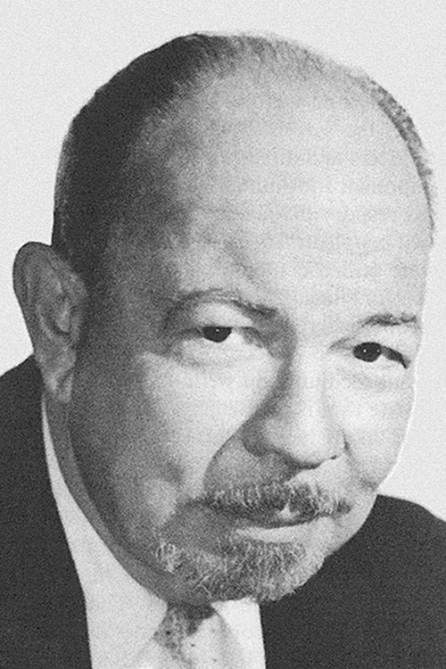

# Hugo Friedhofer

## País o nacionalidad

Estados Unidos

## Biografía

Nace una canción es una película musical de 1948, dirigida por Howard Hawks, protagonizada por Danny Kaye y Virginia Mayo.​ Fue producida por Samuel Goldwyn y liberada por RKO Cuadros Radiofónicos. El film es un remake de la cinta de 1941 no musical Bola de Fuego con Gary Cooper y Barbara Stanwyck, Rodada en Technicolor, presenta un reparto estelar de leyendas musicales, incluyendo Tommy Dorsey, Benny Goodman (con Al Hendrickson), Louis Armstrong, Lionel Hampton, y Benny Carter. Otros músicos notables presentes en el reparto incluyen a Charlie Barnet (con Harry Babasin), Mel Powell, Louis Bellson, El Cuarteto de Puerta Dorado, Russo y el Samba King, La Página Cavanaugh Trío, y Buck y Burbujas. Otros actores de la película Steve Cochran y Hugh Herbert.

## Estilo musical

Información de estilo musical en proceso de documentación.

## Datos curiosos y técnica de composición

Información de anécdotas y curiosidades en proceso de documentación.

## Top 10 bandas sonoras

1. ***The Best Years of Our Lives (Título en España: Los mejores años de nuestra vida)*** (1946)
    * **Póster:** [link](015_hugo_friedhofer/posters/poster_the_best_years_of_our_lives_1946.jpg)
2. ***An Affair to Remember (Título en España: Tú y yo)*** (1957)
    * **Póster:** [link](015_hugo_friedhofer/posters/poster_an_affair_to_remember_1957.jpg)
3. ***The Bishop's Wife (Título en España: La mujer del obispo)*** (1947)
    * **Póster:** [link](015_hugo_friedhofer/posters/poster_the_bishop_s_wife_1947.jpg)
4. ***The Young Lions (Título en España: El baile de los malditos)*** (1958)
    * **Póster:** [link](015_hugo_friedhofer/posters/poster_the_young_lions_1958.jpg)
5. ***Joan of Arc (Título en España: Juana de Arco)*** (1948)
    * **Póster:** [link](015_hugo_friedhofer/posters/poster_joan_of_arc_1948.jpg)
6. ***Gilda (Título en España: Gilda)*** (1946)
    * **Póster:** [link](015_hugo_friedhofer/posters/poster_gilda_1946.jpg)
7. ***Ace in the Hole (Título en España: El gran carnaval)*** (1951)
    * **Póster:** [link](015_hugo_friedhofer/posters/poster_ace_in_the_hole_1951.jpg)
8. ***Lifeboat (Título en España: Náufragos)*** (1944)
    * **Póster:** [link](015_hugo_friedhofer/posters/poster_lifeboat_1944.jpg)
9. ***One-Eyed Jacks (Título en España: El rostro impenetrable)*** (1961)
    * **Póster:** [link](015_hugo_friedhofer/posters/poster_one_eyed_jacks_1961.jpg)
10. ***Body and Soul (Título en España: Cuerpo y alma)*** (1947)
    * **Póster:** [link](015_hugo_friedhofer/posters/poster_body_and_soul_1947.jpg)

## Filmografía completa

| Año | Título | Título original | Póster |
| --- | --- | --- | --- |
| 1929 | Seven Faces | — | [Póster](015_hugo_friedhofer/posters/poster_seven_faces_1929.jpg) |
| 1930 | Una fantasía del porvenir | Just Imagine | [Póster](015_hugo_friedhofer/posters/poster_just_imagine_1930.jpg) |
| 1931 | Camarotes de lujo | Transatlantic | [Póster](015_hugo_friedhofer/posters/poster_transatlantic_1931.jpg) |
| 1931 | La araña | The Spider | [Póster](015_hugo_friedhofer/posters/poster_the_spider_1931.jpg) |
| 1931 | The Yellow Ticket | — | [Póster](015_hugo_friedhofer/posters/poster_the_yellow_ticket_1931.jpg) |
| 1932 | After Tomorrow | — | [Póster](015_hugo_friedhofer/posters/poster_after_tomorrow_1932.jpg) |
| 1932 | Amateur Daddy | — | [Póster](015_hugo_friedhofer/posters/poster_amateur_daddy_1932.jpg) |
| 1932 | The Trial of Vivienne Ware | — | [Póster](015_hugo_friedhofer/posters/poster_the_trial_of_vivienne_ware_1932.jpg) |
| 1933 | Zoo in Budapest | — | [Póster](015_hugo_friedhofer/posters/poster_zoo_in_budapest_1933.jpg) |
| 1935 | Sueño de amor eterno | Peter Ibbetson | [Póster](015_hugo_friedhofer/posters/poster_peter_ibbetson_1935.jpg) |
| 1936 | El camino del pino solitario | The Trail of the Lonesome Pine | [Póster](015_hugo_friedhofer/posters/poster_the_trail_of_the_lonesome_pine_1936.jpg) |
| 1936 | Prisionero del odio | The Prisoner of Shark Island | [Póster](015_hugo_friedhofer/posters/poster_the_prisoner_of_shark_island_1936.jpg) |
| 1936 | Rose of the Rancho | — | [Póster](015_hugo_friedhofer/posters/poster_rose_of_the_rancho_1936.jpg) |
| 1938 | Las aventuras de Marco Polo | The Adventures of Marco Polo | [Póster](015_hugo_friedhofer/posters/poster_the_adventures_of_marco_polo_1938.jpg) |
| 1942 | El cisne negro | The Black Swan | [Póster](015_hugo_friedhofer/posters/poster_the_black_swan_1942.jpg) |
| 1942 | Infierno en la tierra | China Girl | [Póster](015_hugo_friedhofer/posters/poster_china_girl_1942.jpg) |
| 1943 | They Came to Blow Up America | — | [Póster](015_hugo_friedhofer/posters/poster_they_came_to_blow_up_america_1943.jpg) |
| 1944 | Alas y una plegaria | Wing and a Prayer | [Póster](015_hugo_friedhofer/posters/poster_wing_and_a_prayer_1944.jpg) |
| 1944 | Jack, el destripador | The Lodger | [Póster](015_hugo_friedhofer/posters/poster_the_lodger_1944.jpg) |
| 1944 | La bella del Yukon | Belle of the Yukon | [Póster](015_hugo_friedhofer/posters/poster_belle_of_the_yukon_1944.jpg) |
| 1944 | Nuestra casa en Indiana | Home in Indiana | [Póster](015_hugo_friedhofer/posters/poster_home_in_indiana_1944.jpg) |
| 1944 | Náufragos | Lifeboat | [Póster](015_hugo_friedhofer/posters/poster_lifeboat_1944.jpg) |
| 1944 | The conspirators | The Conspirators | [Póster](015_hugo_friedhofer/posters/poster_the_conspirators_1944.jpg) |
| 1945 | El caballero del Oeste | Along Came Jones | [Póster](015_hugo_friedhofer/posters/poster_along_came_jones_1945.jpg) |
| 1945 | Mi novio está loco | Brewster's Millions | [Póster](015_hugo_friedhofer/posters/poster_brewster_s_millions_1945.jpg) |
| 1946 | Gilda | — | [Póster](015_hugo_friedhofer/posters/poster_gilda_1946.jpg) |
| 1946 | Los mejores años de nuestra vida | The Best Years of Our Lives | [Póster](015_hugo_friedhofer/posters/poster_the_best_years_of_our_lives_1946.jpg) |
| 1946 | So Dark the Night | — | [Póster](015_hugo_friedhofer/posters/poster_so_dark_the_night_1946.jpg) |
| 1947 | Cuerpo y alma | Body and Soul | [Póster](015_hugo_friedhofer/posters/poster_body_and_soul_1947.jpg) |
| 1947 | La mujer del obispo | The Bishop's Wife | [Póster](015_hugo_friedhofer/posters/poster_the_bishop_s_wife_1947.jpg) |
| 1947 | La mujer disputada | Wild Harvest | [Póster](015_hugo_friedhofer/posters/poster_wild_harvest_1947.jpg) |
| 1948 | Adventures of Casanova | — | [Póster](015_hugo_friedhofer/posters/poster_adventures_of_casanova_1948.jpg) |
| 1948 | Hechizo | Enchantment | [Póster](015_hugo_friedhofer/posters/poster_enchantment_1948.jpg) |
| 1948 | Juana de Arco | Joan of Arc | [Póster](015_hugo_friedhofer/posters/poster_joan_of_arc_1948.jpg) |
| 1948 | Nace una canción | A Song Is Born | [Póster](015_hugo_friedhofer/posters/poster_a_song_is_born_1948.jpg) |
| 1950 | Entre dos juramentos | Two Flags West | [Póster](015_hugo_friedhofer/posters/poster_two_flags_west_1950.jpg) |
| 1950 | Flecha Rota | Broken Arrow | [Póster](015_hugo_friedhofer/posters/poster_broken_arrow_1950.jpg) |
| 1950 | Mentira latente | No Man of Her Own | [Póster](015_hugo_friedhofer/posters/poster_no_man_of_her_own_1950.jpg) |
| 1950 | Nube de sangre | Edge of Doom | [Póster](015_hugo_friedhofer/posters/poster_edge_of_doom_1950.jpg) |
| 1950 | Regresaron tres | Three Came Home | [Póster](015_hugo_friedhofer/posters/poster_three_came_home_1950.jpg) |
| 1951 | El gran carnaval | Ace in the Hole | [Póster](015_hugo_friedhofer/posters/poster_ace_in_the_hole_1951.jpg) |
| 1952 | Chica para matrimonio | The Marrying Kind | [Póster](015_hugo_friedhofer/posters/poster_the_marrying_kind_1952.jpg) |
| 1952 | Tempestad en Oriente | Thunder in the East | [Póster](015_hugo_friedhofer/posters/poster_thunder_in_the_east_1952.jpg) |
| 1952 | The Outcasts of Poker Flat | — | [Póster](015_hugo_friedhofer/posters/poster_the_outcasts_of_poker_flat_1952.jpg) |
| 1953 | Hondo | — | [Póster](015_hugo_friedhofer/posters/poster_hondo_1953.jpg) |
| 1953 | Man in the Attic | — | [Póster](015_hugo_friedhofer/posters/poster_man_in_the_attic_1953.jpg) |
| 1954 | Vera Cruz | — | [Póster](015_hugo_friedhofer/posters/poster_vera_cruz_1954.jpg) |
| 1955 | Las lluvias de Ranchipur | The Rains of Ranchipur | [Póster](015_hugo_friedhofer/posters/poster_the_rains_of_ranchipur_1955.jpg) |
| 1955 | Pluma Blanca | White Feather | [Póster](015_hugo_friedhofer/posters/poster_white_feather_1955.jpg) |
| 1955 | Siete ciudades de oro | Seven Cities of Gold | [Póster](015_hugo_friedhofer/posters/poster_seven_cities_of_gold_1955.jpg) |
| 1955 | Sábado trágico | Violent Saturday | [Póster](015_hugo_friedhofer/posters/poster_violent_saturday_1955.jpg) |
| 1956 | La rebeldía de la Sra. Stover | The Revolt of Mamie Stover | [Póster](015_hugo_friedhofer/posters/poster_the_revolt_of_mamie_stover_1956.jpg) |
| 1956 | Los diablos del Pacífico | Between Heaven and Hell | [Póster](015_hugo_friedhofer/posters/poster_between_heaven_and_hell_1956.jpg) |
| 1956 | Más dura será la caída | The Harder They Fall | [Póster](015_hugo_friedhofer/posters/poster_the_harder_they_fall_1956.jpg) |
| 1957 | La sirena y el delfín | Boy on a Dolphin | [Póster](015_hugo_friedhofer/posters/poster_boy_on_a_dolphin_1957.jpg) |
| 1957 | Tú y yo | An Affair to Remember | [Póster](015_hugo_friedhofer/posters/poster_an_affair_to_remember_1957.jpg) |
| 1958 | El baile de los malditos | The Young Lions | [Póster](015_hugo_friedhofer/posters/poster_the_young_lions_1958.jpg) |
| 1958 | El bárbaro y la geisha | The Barbarian and the Geisha | [Póster](015_hugo_friedhofer/posters/poster_the_barbarian_and_the_geisha_1958.jpg) |
| 1958 | Me casé con un monstruo del espacio exterior | I Married a Monster from Outer Space | [Póster](015_hugo_friedhofer/posters/poster_i_married_a_monster_from_outer_space_1958.jpg) |
| 1959 | Cuando hierve la sangre | Never So Few | [Póster](015_hugo_friedhofer/posters/poster_never_so_few_1959.jpg) |
| 1959 | La mujer obsesionada | Woman Obsessed | [Póster](015_hugo_friedhofer/posters/poster_woman_obsessed_1959.jpg) |
| 1961 | El rostro impenetrable | One-Eyed Jacks | [Póster](015_hugo_friedhofer/posters/poster_one_eyed_jacks_1961.jpg) |
| 1961 | Homicidio | Homicidal | [Póster](015_hugo_friedhofer/posters/poster_homicidal_1961.jpg) |
| 1962 | Beauty and the Beast | — | [Póster](015_hugo_friedhofer/posters/poster_beauty_and_the_beast_1962.jpg) |
| 1964 | Secreta invasión | The Secret Invasion | [Póster](015_hugo_friedhofer/posters/poster_the_secret_invasion_1964.jpg) |
| 1969 | El regreso de los rangers de Texas | The Over the Hill Gang | [Póster](015_hugo_friedhofer/posters/poster_the_over_the_hill_gang_1969.jpg) |
| 1971 | El Barón Rojo | Von Richthofen and Brown | [Póster](015_hugo_friedhofer/posters/poster_von_richthofen_and_brown_1971.jpg) |
| 1972 | Neurosis asesina | Private Parts | [Póster](015_hugo_friedhofer/posters/poster_private_parts_1972.jpg) |
| 1978 | Die Sister, Die! | — | [Póster](015_hugo_friedhofer/posters/poster_die_sister_die_1978.jpg) |
| 2019 | Max Steiner: Maestro of Movie Music | — | [Póster](015_hugo_friedhofer/posters/poster_max_steiner_maestro_of_movie_music_2019.jpg) |

## Premios y nominaciones

* 1946 – Nominación de la Academia – por *The Woman in the Window (Título en España: La mujer en la ventana)*
* 1947 – Premio de la Academia – por *The Best Years of Our Lives (Título en España: Los mejores años de nuestra vida)*
* 1947 – Nominación de la Academia – por *The Best Years of Our Lives (Título en España: Los mejores años de nuestra vida)*
* 1948 – Nominación de la Academia – por *The Bishop's Wife (Título en España: La mujer del obispo)*
* 1949 – Nominación de la Academia – por *Joan of Arc (Título en España: Juana de Arco)*
* 1954 – Nominación de la Academia – por *Above and Beyond (Título en España: Above and Beyond)*
* 1957 – Nominación de la Academia – por *Between Heaven and Hell (Título en España: Los diablos del Pacífico)*
* 1958 – Nominación de la Academia – por *An Affair to Remember (Título en España: Tú y yo)*
* 1958 – Nominación de la Academia – por *Boy on a Dolphin (Título en España: La sirena y el delfín)*
* 1959 – Nominación de la Academia – por *The Young Lions (Título en España: El baile de los malditos)*

## Fuentes adicionales

* [MundoBSO](https://mundobso.com) — site:mundobso.com
* [Film Score Monthly](https://filmscoremonthly.com) — site:filmscoremonthly.com
* [SoundtrackCollector](https://soundtrackcollector.com) — site:soundtrackcollector.com
* [WhatSong](https://whatsong.org) — site:whatsong.org
